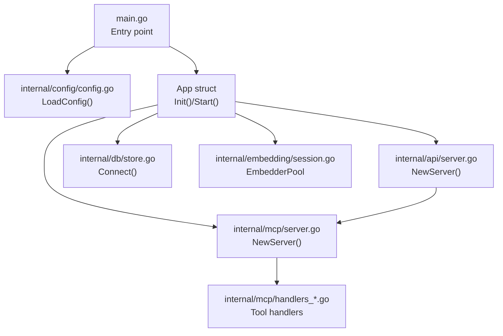
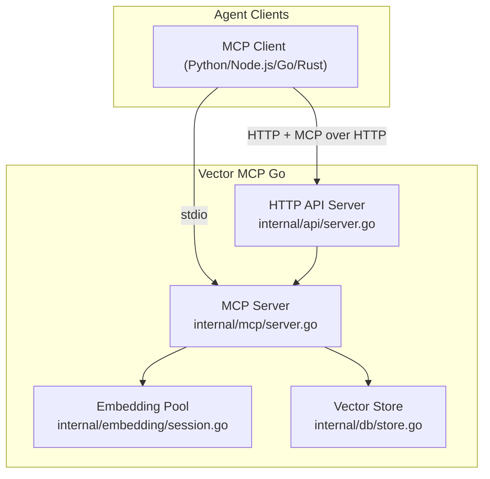
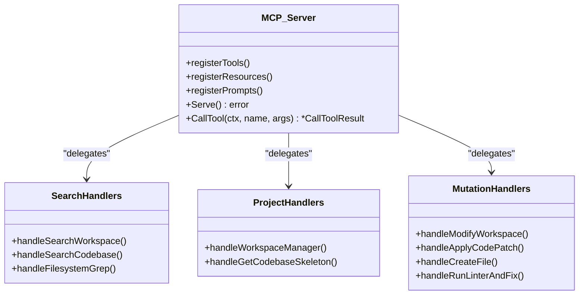
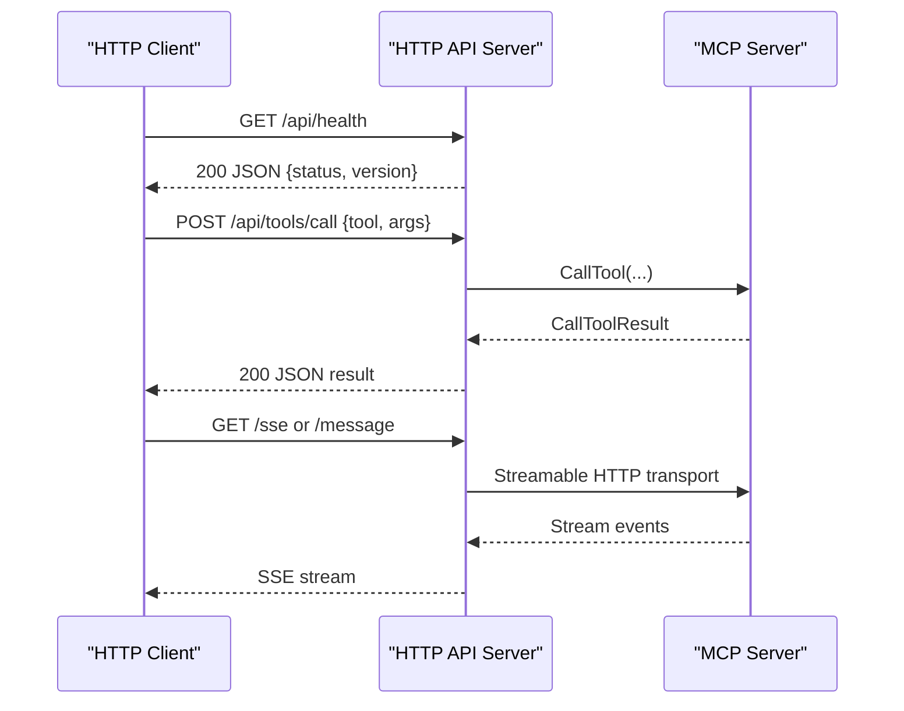
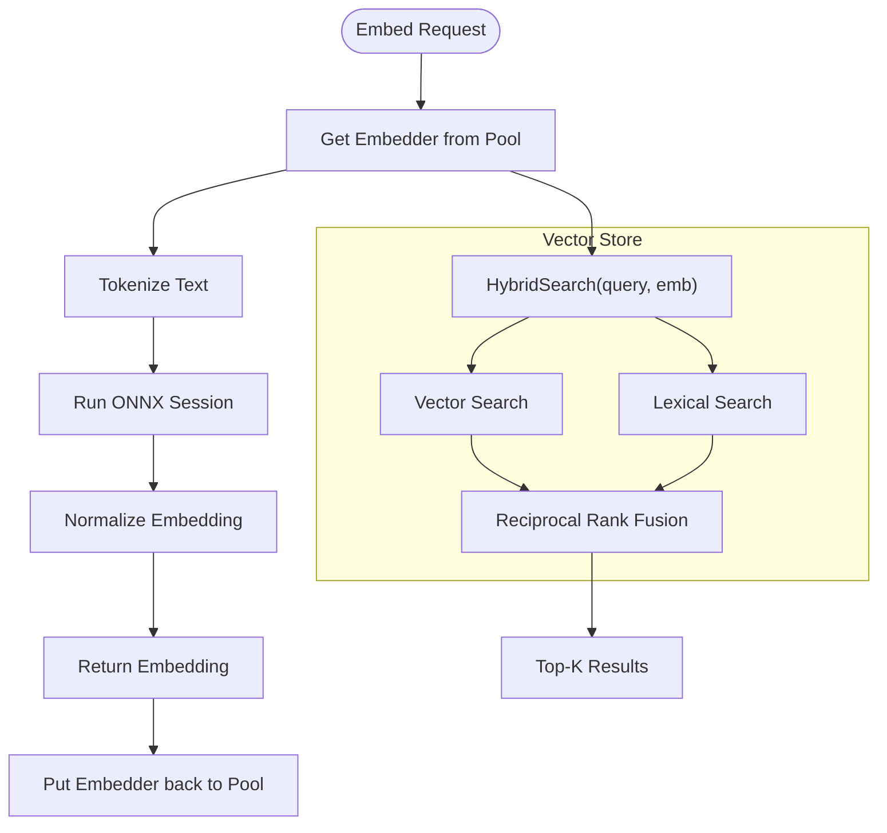
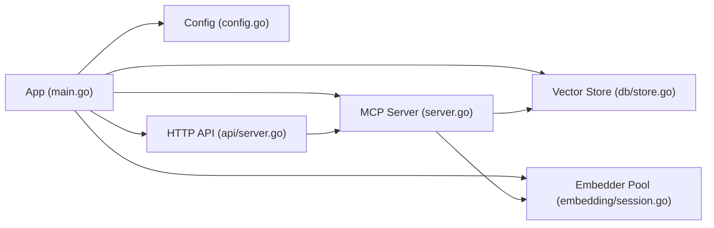

# API Integration Examples

<cite>
**Referenced Files in This Document**
- [main.go](file://main.go)
- [README.md](file://README.md)
- [mcp-config.json.example](file://mcp-config.json.example)
- [internal/mcp/server.go](file://internal/mcp/server.go)
- [internal/mcp/handlers_search.go](file://internal/mcp/handlers_search.go)
- [internal/mcp/handlers_project.go](file://internal/mcp/handlers_project.go)
- [internal/mcp/handlers_mutation.go](file://internal/mcp/handlers_mutation.go)
- [internal/api/server.go](file://internal/api/server.go)
- [internal/config/config.go](file://internal/config/config.go)
- [internal/embedding/session.go](file://internal/embedding/session.go)
- [internal/db/store.go](file://internal/db/store.go)
- [benchmark/retrieval_bench_test.go](file://benchmark/retrieval_bench_test.go)
- [AGENTS.md](file://AGENTS.md)
</cite>

## Table of Contents
1. [Introduction](#introduction)
2. [Project Structure](#project-structure)
3. [Core Components](#core-components)
4. [Architecture Overview](#architecture-overview)
5. [Detailed Component Analysis](#detailed-component-analysis)
6. [Dependency Analysis](#dependency-analysis)
7. [Performance Considerations](#performance-considerations)
8. [Troubleshooting Guide](#troubleshooting-guide)
9. [Conclusion](#conclusion)
10. [Appendices](#appendices)

## Introduction
This document provides practical API integration examples and best practices for Vector MCP Go. It focuses on:
- How to integrate with popular languages (Python, JavaScript/Node.js, Go, Rust)
- Common integration patterns for AI agents, development tools, and automated workflows
- MCP client implementations, HTTP API consumers, and native C/C++ integrations
- Authentication setup, connection pooling, error handling, and retry strategies
- Performance optimization techniques (batching, connection reuse, efficient query patterns)
- Troubleshooting, debugging, and monitoring approaches
- Production deployment considerations, load balancing, and scalability patterns

Vector MCP Go exposes a Model Context Protocol (MCP) server with a “Fat Tool” pattern that consolidates capabilities into unified tools. It also provides an HTTP API for programmatic access and SSE-style streaming over HTTP.

## Project Structure
At a high level, the application bootstraps configuration, initializes embedding pools, connects to a vector database, registers MCP tools and resources, and serves both MCP over stdio and an HTTP API.

**Diagram sources**
- [main.go:280-317](file://main.go#L280-L317)
- [internal/config/config.go:30-130](file://internal/config/config.go#L30-L130)
- [internal/mcp/server.go:90-128](file://internal/mcp/server.go#L90-L128)
- [internal/api/server.go:35-109](file://internal/api/server.go#L35-L109)
- [internal/db/store.go:35-64](file://internal/db/store.go#L35-L64)
- [internal/embedding/session.go:38-85](file://internal/embedding/session.go#L38-L85)

**Section sources**
- [main.go:280-317](file://main.go#L280-L317)
- [README.md:1-40](file://README.md#L1-L40)

## Core Components
- Configuration loader: Centralized environment-based configuration with defaults and structured logging.
- MCP Server: Registers tools, resources, and prompts; routes tool calls; coordinates with store and embedder.
- HTTP API: Exposes health, search, context, todo endpoints and MCP over HTTP with CORS.
- Embedding Pool: Manages ONNX-based embedders and optional rerankers with pooling.
- Vector Store: Persistent LanceDB-backed collection with hybrid search and lexical filtering.

Key integration touchpoints:
- MCP stdio transport for agent clients
- HTTP transport for web apps and microservices
- SSE-style streaming over HTTP for long-lived sessions

**Section sources**
- [internal/config/config.go:30-130](file://internal/config/config.go#L30-L130)
- [internal/mcp/server.go:90-128](file://internal/mcp/server.go#L90-L128)
- [internal/api/server.go:35-109](file://internal/api/server.go#L35-L109)
- [internal/embedding/session.go:38-85](file://internal/embedding/session.go#L38-L85)
- [internal/db/store.go:35-64](file://internal/db/store.go#L35-L64)

## Architecture Overview
The system supports two primary integration modes:
- MCP over stdio for agent clients
- HTTP API with MCP over HTTP for browser-based and microservice integrations

**Diagram sources**
- [internal/mcp/server.go:90-128](file://internal/mcp/server.go#L90-L128)
- [internal/api/server.go:35-109](file://internal/api/server.go#L35-L109)
- [internal/embedding/session.go:38-85](file://internal/embedding/session.go#L38-L85)
- [internal/db/store.go:35-64](file://internal/db/store.go#L35-L64)

## Detailed Component Analysis

### MCP Server and Tool Handlers
The MCP server registers tools and resources, and delegates tool execution to dedicated handlers. Unified tools consolidate multiple actions into single entry points.

**Diagram sources**
- [internal/mcp/server.go:334-418](file://internal/mcp/server.go#L334-L418)
- [internal/mcp/handlers_search.go:316-365](file://internal/mcp/handlers_search.go#L316-L365)
- [internal/mcp/handlers_project.go:134-161](file://internal/mcp/handlers_project.go#L134-L161)
- [internal/mcp/handlers_mutation.go:101-161](file://internal/mcp/handlers_mutation.go#L101-L161)

**Section sources**
- [internal/mcp/server.go:334-418](file://internal/mcp/server.go#L334-L418)
- [internal/mcp/handlers_search.go:316-365](file://internal/mcp/handlers_search.go#L316-L365)
- [internal/mcp/handlers_project.go:134-161](file://internal/mcp/handlers_project.go#L134-L161)
- [internal/mcp/handlers_mutation.go:101-161](file://internal/mcp/handlers_mutation.go#L101-L161)

### HTTP API and Streaming Transport
The HTTP server exposes health checks, MCP over HTTP endpoints, and tool management endpoints. It adds CORS headers and supports OPTIONS preflight.

**Diagram sources**
- [internal/api/server.go:46-109](file://internal/api/server.go#L46-L109)
- [internal/mcp/server.go:442-455](file://internal/mcp/server.go#L442-L455)

**Section sources**
- [internal/api/server.go:46-109](file://internal/api/server.go#L46-L109)

### Embedding Pool and Vector Store
Embedding pooling improves throughput by reusing initialized ONNX sessions. The vector store supports hybrid search combining semantic and lexical matching.

**Diagram sources**
- [internal/embedding/session.go:67-85](file://internal/embedding/session.go#L67-L85)
- [internal/db/store.go:223-336](file://internal/db/store.go#L223-L336)

**Section sources**
- [internal/embedding/session.go:67-85](file://internal/embedding/session.go#L67-L85)
- [internal/db/store.go:223-336](file://internal/db/store.go#L223-L336)

## Dependency Analysis
The application composes modular components with clear interfaces:
- App orchestrates configuration, stores, embedder pool, MCP server, and API server
- MCP server depends on store and embedder abstractions
- HTTP API depends on MCP server for tool execution
- Embedding pool encapsulates ONNX runtime sessions
- Vector store wraps persistent collection with hybrid search

**Diagram sources**
- [main.go:58-176](file://main.go#L58-L176)
- [internal/mcp/server.go:90-128](file://internal/mcp/server.go#L90-L128)
- [internal/api/server.go:35-109](file://internal/api/server.go#L35-L109)
- [internal/db/store.go:35-64](file://internal/db/store.go#L35-L64)
- [internal/embedding/session.go:38-85](file://internal/embedding/session.go#L38-L85)

**Section sources**
- [main.go:58-176](file://main.go#L58-L176)

## Performance Considerations
- Embedding Pooling
  - Use the embedder pool to reuse initialized ONNX sessions and avoid repeated initialization overhead.
  - Acquire and release embedders around batch operations to maximize throughput.
  - Reference: [internal/embedding/session.go:38-85](file://internal/embedding/session.go#L38-L85)

- Batching Requests
  - Prefer batch embedding APIs when available to reduce per-request overhead.
  - Reference: [internal/mcp/handlers_search.go:261-271](file://internal/mcp/handlers_search.go#L261-L271)

- Efficient Query Patterns
  - Hybrid search combines vector and lexical search; tune topK and category filters to balance precision/recall.
  - Reference: [internal/db/store.go:223-336](file://internal/db/store.go#L223-L336)

- Connection Reuse
  - Keep HTTP connections alive and reuse MCP sessions for long-running integrations.
  - Reference: [internal/api/server.go:48-71](file://internal/api/server.go#L48-L71)

- Monitoring Benchmarks
  - Use the included benchmark suite to measure recall, MRR, NDCG, latency, and indexing throughput.
  - Reference: [benchmark/retrieval_bench_test.go:92-224](file://benchmark/retrieval_bench_test.go#L92-L224)

[No sources needed since this section provides general guidance]

## Troubleshooting Guide
- Health Checks
  - Verify server availability via the health endpoint.
  - Reference: [internal/api/server.go:131-138](file://internal/api/server.go#L131-L138)

- Logging and Notifications
  - The MCP server emits notifications for logs and events; subscribe to client notifications for diagnostics.
  - Reference: [internal/mcp/server.go:420-440](file://internal/mcp/server.go#L420-L440)

- Agent Guidelines
  - Follow deterministic patterns, fat tool consolidation, rune-safe truncation, and parameter sanitization.
  - Reference: [AGENTS.md:1-16](file://AGENTS.md#L1-L16)

- Configuration Pitfalls
  - Ensure correct model paths, dimension alignment, and database directory permissions.
  - Reference: [internal/config/config.go:30-130](file://internal/config/config.go#L30-L130)

- Embedding Dimension Mismatch
  - If switching models, clear the vector database to avoid dimension mismatches.
  - Reference: [internal/db/store.go:51-61](file://internal/db/store.go#L51-L61)

**Section sources**
- [internal/api/server.go:131-138](file://internal/api/server.go#L131-L138)
- [internal/mcp/server.go:420-440](file://internal/mcp/server.go#L420-L440)
- [AGENTS.md:1-16](file://AGENTS.md#L1-L16)
- [internal/config/config.go:30-130](file://internal/config/config.go#L30-L130)
- [internal/db/store.go:51-61](file://internal/db/store.go#L51-L61)

## Conclusion
Vector MCP Go offers a robust, deterministic MCP server with an HTTP API and streaming transport. Integrators can choose between stdio-based MCP clients and HTTP-based consumers. By leveraging embedding pooling, batching, and hybrid search, applications achieve high throughput and strong relevance. Follow the guidelines for configuration, logging, and agent patterns to ensure reliable, scalable deployments.

[No sources needed since this section summarizes without analyzing specific files]

## Appendices

### Integration Patterns and Examples

- Python
  - MCP stdio: Use the MCP client library to communicate over stdio with the server.
  - HTTP API: Issue POST requests to tool endpoints and consume SSE streams for long-lived sessions.
  - References:
    - [mcp-config.json.example:1-12](file://mcp-config.json.example#L1-L12)
    - [internal/api/server.go:48-71](file://internal/api/server.go#L48-L71)

- JavaScript/Node.js
  - MCP over HTTP: Use fetch or axios to call tool endpoints and manage sessions via headers.
  - SSE: Use EventSource to consume streaming responses.
  - References:
    - [internal/api/server.go:48-71](file://internal/api/server.go#L48-L71)

- Go
  - MCP stdio: Use the MCP server library to serve tools and integrate with the embedded MCP server.
  - HTTP API: Wrap tool calls with the MCP server’s CallTool method.
  - References:
    - [internal/mcp/server.go:442-455](file://internal/mcp/server.go#L442-L455)

- Rust
  - MCP over HTTP: Use async HTTP clients to call tool endpoints and SSE.
  - References:
    - [internal/api/server.go:48-71](file://internal/api/server.go#L48-L71)

- Native C/C++
  - MCP over HTTP: Use HTTP libraries to call endpoints and SSE.
  - Embedding: Integrate with the ONNX runtime for inference if building a native client.
  - References:
    - [internal/embedding/session.go:87-174](file://internal/embedding/session.go#L87-L174)

### Authentication and Security
- Environment-based configuration controls model paths, dimensions, and ports.
- HTTP API adds CORS headers; set Authorization headers as needed for downstream services.
- Path validation prevents unsafe file mutations.
- References:
  - [internal/config/config.go:30-130](file://internal/config/config.go#L30-L130)
  - [internal/api/server.go:89-101](file://internal/api/server.go#L89-L101)
  - [internal/mcp/handlers_mutation.go:23-27](file://internal/mcp/handlers_mutation.go#L23-L27)

### Retry and Backoff Strategies
- Use exponential backoff for transient failures on HTTP endpoints.
- For MCP over HTTP, maintain session IDs and reconnect on errors.
- References:
  - [internal/api/server.go:48-71](file://internal/api/server.go#L48-L71)

### Production Deployment and Scaling
- Horizontal scaling: Run multiple instances behind a load balancer; ensure consistent model and database paths.
- Vertical scaling: Increase embedder pool size and CPU for vector operations.
- References:
  - [internal/config/config.go:103-108](file://internal/config/config.go#L103-L108)
  - [internal/db/store.go:35-64](file://internal/db/store.go#L35-L64)