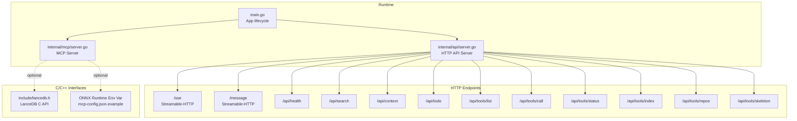
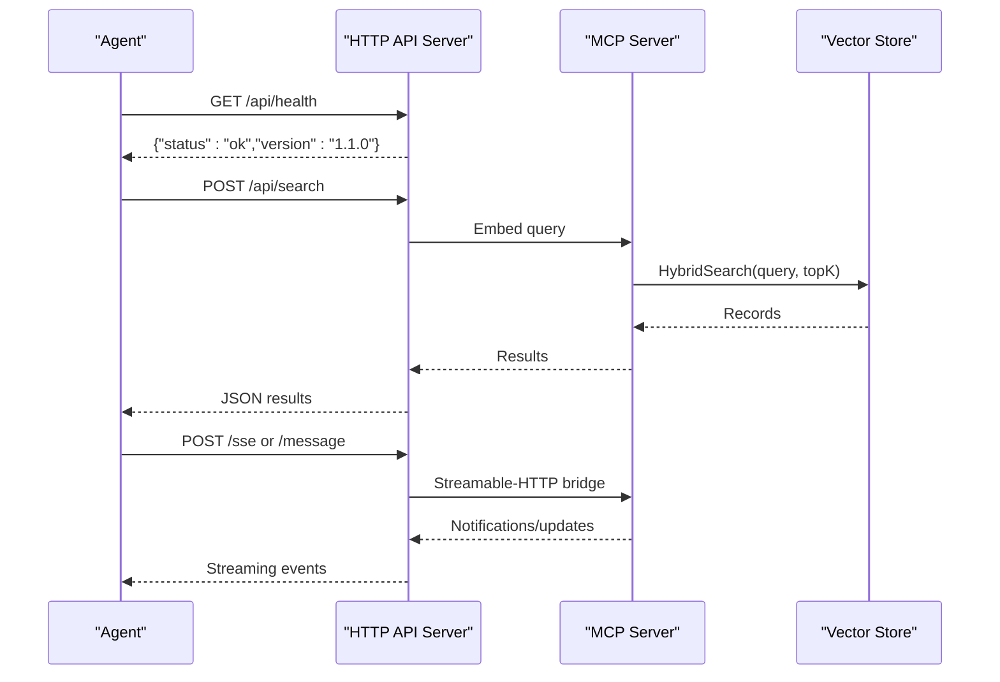
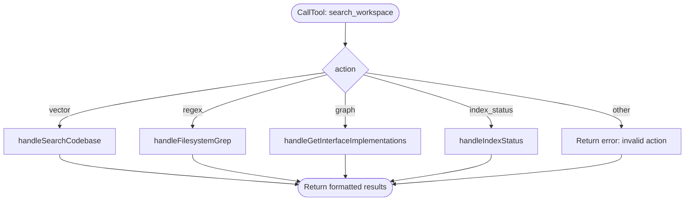
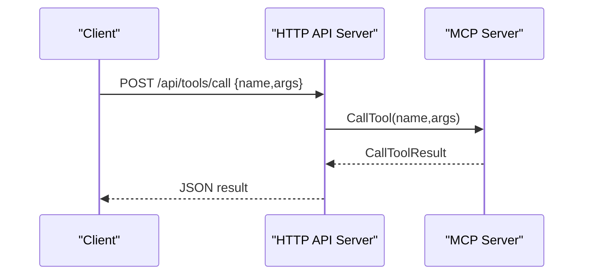
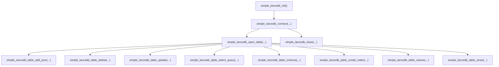
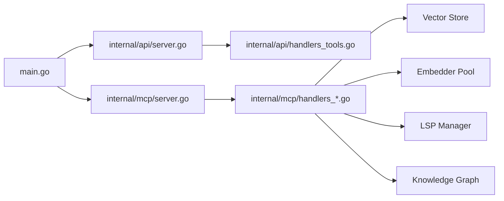

# API Reference

<cite>
**Referenced Files in This Document**
- [main.go](file://main.go)
- [mcp-config.json.example](file://mcp-config.json.example)
- [include/lancedb.h](file://include/lancedb.h)
- [internal/mcp/server.go](file://internal/mcp/server.go)
- [internal/api/server.go](file://internal/api/server.go)
- [internal/api/handlers_tools.go](file://internal/api/handlers_tools.go)
- [internal/mcp/handlers_search.go](file://internal/mcp/handlers_search.go)
- [internal/mcp/handlers_project.go](file://internal/mcp/handlers_project.go)
- [internal/mcp/handlers_lsp.go](file://internal/mcp/handlers_lsp.go)
- [internal/mcp/handlers_analysis.go](file://internal/mcp/handlers_analysis.go)
- [internal/mcp/handlers_mutation.go](file://internal/mcp/handlers_mutation.go)
- [internal/mcp/handlers_context.go](file://internal/mcp/handlers_context.go)
- [internal/mcp/handlers_distill.go](file://internal/mcp/handlers_distill.go)
- [internal/mcp/handlers_graph.go](file://internal/mcp/handlers_graph.go)
- [internal/mcp/handlers_safety.go](file://internal/mcp/handlers_safety.go)
</cite>

## Table of Contents
1. [Introduction](#introduction)
2. [Project Structure](#project-structure)
3. [Core Components](#core-components)
4. [Architecture Overview](#architecture-overview)
5. [Detailed Component Analysis](#detailed-component-analysis)
6. [Dependency Analysis](#dependency-analysis)
7. [Performance Considerations](#performance-considerations)
8. [Troubleshooting Guide](#troubleshooting-guide)
9. [Conclusion](#conclusion)
10. [Appendices](#appendices)

## Introduction
This document provides comprehensive API documentation for Vector MCP Go’s public interfaces. It covers:
- MCP protocol endpoints and tool schemas
- HTTP API endpoints, request/response formats, and streaming behavior
- C/C++ header interfaces for ONNX runtime integration and low-level database operations
- Authentication, rate limiting, and API versioning
- Parameter specifications, return value formats, error handling patterns
- Practical examples, client integration guidelines, and performance optimization tips
- Deprecation policies, backward compatibility, and migration guidance

## Project Structure
Vector MCP Go exposes two primary interfaces:
- MCP protocol over stdio and HTTP (via Streamable-HTTP)
- HTTP REST API for search, context, todo, and tool management
- Low-level C/C++ bindings for LanceDB and optional ONNX runtime integration

**Diagram sources**
- [main.go:280-317](file://main.go#L280-L317)
- [internal/mcp/server.go:86-117](file://internal/mcp/server.go#L86-L117)
- [internal/api/server.go:33-109](file://internal/api/server.go#L33-L109)
- [include/lancedb.h:36-188](file://include/lancedb.h#L36-L188)
- [mcp-config.json.example:4-8](file://mcp-config.json.example#L4-L8)

**Section sources**
- [main.go:280-317](file://main.go#L280-L317)
- [internal/mcp/server.go:86-117](file://internal/mcp/server.go#L86-L117)
- [internal/api/server.go:33-109](file://internal/api/server.go#L33-L109)
- [include/lancedb.h:36-188](file://include/lancedb.h#L36-L188)
- [mcp-config.json.example:4-8](file://mcp-config.json.example#L4-L8)

## Core Components
- MCP Server: Registers resources, prompts, and tools; routes tool calls; supports notifications and graph population.
- HTTP API Server: Exposes health, MCP over HTTP (Streamable-HTTP), and tool management endpoints.
- Tool Handlers: Implement the five core tools and auxiliary tools for search, project management, LSP, analysis, mutation, context, and graph traversal.
- C/C++ Bindings: LanceDB C API for low-level operations; ONNX runtime integration via environment variable configuration.

**Section sources**
- [internal/mcp/server.go:28-117](file://internal/mcp/server.go#L28-L117)
- [internal/api/server.go:24-109](file://internal/api/server.go#L24-L109)
- [include/lancedb.h:16-188](file://include/lancedb.h#L16-L188)
- [mcp-config.json.example:4-8](file://mcp-config.json.example#L4-L8)

## Architecture Overview
The system supports dual transport modes:
- MCP over stdio for agent integration
- MCP over HTTP (Streamable-HTTP) for web clients
- HTTP REST endpoints for programmatic access to search, context, todos, and tool management

**Diagram sources**
- [internal/api/server.go:131-139](file://internal/api/server.go#L131-L139)
- [internal/api/handlers_tools.go:28-84](file://internal/api/handlers_tools.go#L28-L84)
- [internal/mcp/server.go:184-188](file://internal/mcp/server.go#L184-L188)

## Detailed Component Analysis

### MCP Protocol Endpoints
The MCP server registers resources, prompts, and tools. Tools are grouped into five categories with unified “fat” tools for convenience.

- Unified Search Tool: search_workspace
  - Actions: vector, regex, graph, index_status
  - Parameters:
    - action: string
    - query: string
    - limit: number
    - path: string (scope filter)
  - Returns: Text result with formatted matches
  - Errors: Invalid action, missing parameters, timeouts, or tool-specific failures

- Workspace Manager Tool: workspace_manager
  - Actions: set_project_root, trigger_index, get_indexing_diagnostics
  - Parameters:
    - action: string
    - path: string
  - Returns: Operation outcome or diagnostics
  - Errors: Invalid action, invalid path, watcher reset blocking

- LSP Query Tool: lsp_query
  - Actions: definition, references, type_hierarchy, impact_analysis
  - Parameters:
    - action: string
    - path: string
    - line: number
    - character: number
  - Returns: LSP response or usage references
  - Errors: Missing path, LSP call failures, invalid position

- Analysis Tool: analyze_code
  - Actions: ast_skeleton, dead_code, duplicate_code, dependencies
  - Parameters:
    - action: string
    - path: string (scope)
  - Returns: Diagnostic report or Mermaid graph
  - Errors: Missing action/path, unsupported manifest, timeouts

- Modify Workspace Tool: modify_workspace
  - Actions: apply_patch, create_file, run_linter, verify_patch, auto_fix
  - Parameters:
    - action: string
    - path: string
    - content: string
    - search/replace: strings
    - tool: string
    - diagnostic_json: string
  - Returns: Operation outcome or suggestions
  - Errors: Missing parameters, file I/O, lint tool not supported

- Auxiliary Tools:
  - index_status, trigger_project_index, get_related_context, store_context, delete_context, distill_package_purpose, trace_data_flow

**Diagram sources**
- [internal/mcp/server.go:331-380](file://internal/mcp/server.go#L331-L380)
- [internal/mcp/handlers_search.go:316-365](file://internal/mcp/handlers_search.go#L316-L365)

**Section sources**
- [internal/mcp/server.go:323-407](file://internal/mcp/server.go#L323-L407)
- [internal/mcp/handlers_search.go:316-365](file://internal/mcp/handlers_search.go#L316-L365)
- [internal/mcp/handlers_project.go:134-161](file://internal/mcp/handlers_project.go#L134-L161)
- [internal/mcp/handlers_lsp.go:128-154](file://internal/mcp/handlers_lsp.go#L128-L154)
- [internal/mcp/handlers_analysis.go:21-224](file://internal/mcp/handlers_analysis.go#L21-L224)
- [internal/mcp/handlers_mutation.go:93-153](file://internal/mcp/handlers_mutation.go#L93-L153)

### HTTP API Endpoints
- GET /api/health
  - Purpose: Health check
  - Response: {"status":"ok","version":"1.1.0"}

- POST /api/search
  - Request body: SearchRequest
    - query: string
    - top_k: integer (clamped 1..100; default 5 if omitted)
    - docs_only: boolean (filters to documents)
  - Response: Array of SearchResponse
    - id: string
    - text: string (truncated)
    - similarity: number
    - metadata: object
  - Errors: Bad request, internal error

- POST /api/context
  - Request body: ContextRequest
    - text: string
    - source: string
    - metadata: object
  - Response: {"status":"success","message":"Context added to Global Brain"}

- POST /api/todo
  - Request body: TodoRequest
    - title: string
    - description: string
    - priority: string
  - Response: {"status":"success","message":"TODO stored in vector database"}

- GET /api/tools/repos
  - Response: Array of Repo
    - path: string
    - status: string

- GET /api/tools/status
  - Response: Tool result from index_status

- POST /api/tools/index
  - Request body: {"path": string}
  - Response: Tool result from trigger_project_index

- GET /api/tools/skeleton
  - Query: path (optional)
  - Response: Tool result from get_codebase_skeleton

- GET /api/tools/list
  - Response: Array of MCP tools

- POST /api/tools/call
  - Request body: {"name": string, "arguments": object}
  - Response: Tool result

- Streamable-HTTP
  - Routes: /sse, /message
  - Headers: Access-Control-Allow-* for CORS; MCP-Protocol-Version and Authorization headers supported
  - Behavior: Bridges MCP stdio semantics over HTTP with streaming

**Diagram sources**
- [internal/api/server.go:48-71](file://internal/api/server.go#L48-L71)
- [internal/api/server.go:89-101](file://internal/api/server.go#L89-L101)
- [internal/api/handlers_tools.go:208-232](file://internal/api/handlers_tools.go#L208-L232)

**Section sources**
- [internal/api/server.go:131-139](file://internal/api/server.go#L131-L139)
- [internal/api/handlers_tools.go:28-84](file://internal/api/handlers_tools.go#L28-L84)
- [internal/api/handlers_tools.go:94-139](file://internal/api/handlers_tools.go#L94-L139)
- [internal/api/handlers_tools.go:148-194](file://internal/api/handlers_tools.go#L148-L194)
- [internal/api/handlers_tools.go:196-206](file://internal/api/handlers_tools.go#L196-L206)
- [internal/api/handlers_tools.go:208-232](file://internal/api/handlers_tools.go#L208-L232)
- [internal/api/handlers_tools.go:234-247](file://internal/api/handlers_tools.go#L234-L247)
- [internal/api/handlers_tools.go:249-275](file://internal/api/handlers_tools.go#L249-L275)
- [internal/api/handlers_tools.go:283-311](file://internal/api/handlers_tools.go#L283-L311)
- [internal/api/handlers_tools.go:313-333](file://internal/api/handlers_tools.go#L313-L333)
- [internal/api/server.go:48-71](file://internal/api/server.go#L48-L71)
- [internal/api/server.go:89-101](file://internal/api/server.go#L89-L101)

### C/C++ Header Interfaces for ONNX and LanceDB
- ONNX Runtime Integration
  - Environment variable: ONNX_LIB_PATH
  - Example configuration: mcp-config.json.example
  - Notes: The process initializes ONNX at startup when running as master.

- LanceDB C API (include/lancedb.h)
  - Types:
    - SimpleResult: success flag and error message
    - VersionInfo: version, timestamp, metadata JSON
  - Functions:
    - simple_lancedb_connect(uri, handle*)
    - simple_lancedb_connect_with_options(uri, options_json, handle*)
    - simple_lancedb_close(handle*)
    - simple_lancedb_table_delete(table_handle*, predicate, deleted_count*)
    - simple_lancedb_table_update(table_handle*, predicate, updates_json, ...)
    - simple_lancedb_table_add_json(table_handle*, json_data, added_count*)
    - simple_lancedb_table_add_ipc(table_handle*, ipc_data, ipc_len, added_count*)
    - simple_lancedb_table_names(handle*, names**, count*)
    - simple_lancedb_free_table_names(names*, count*)
    - simple_lancedb_init()
    - simple_lancedb_result_free(SimpleResult*)
    - simple_lancedb_free_string(char*)
    - simple_lancedb_table_create_index(table_handle*, columns_json, index_type, index_name)
    - simple_lancedb_table_get_indexes(table_handle*, indexes_json*)
    - simple_lancedb_table_count_rows(table_handle*, count*)
    - simple_lancedb_table_version(table_handle*, version*)
    - simple_lancedb_table_schema(table_handle*, schema_json*)
    - simple_lancedb_table_schema_ipc(table_handle*, schema_ipc_data**, schema_ipc_len*)
    - simple_lancedb_free_ipc_data(uint8_t*)
    - simple_lancedb_table_select_query(table_handle*, query_config_json, result_json*)
    - simple_lancedb_create_table(handle*, table_name, schema_json)
    - simple_lancedb_create_table_with_ipc(handle*, table_name, schema_ipc, schema_len)
    - simple_lancedb_drop_table(handle*, table_name)
    - simple_lancedb_open_table(handle*, table_name, table_handle*)
    - simple_lancedb_table_close(table_handle*)
    - lancedb_version_info_free(VersionInfo*)

**Diagram sources**
- [include/lancedb.h:36-188](file://include/lancedb.h#L36-L188)

**Section sources**
- [mcp-config.json.example:4-8](file://mcp-config.json.example#L4-L8)
- [include/lancedb.h:36-188](file://include/lancedb.h#L36-L188)

### Authentication, Rate Limiting, and API Versioning
- Authentication
  - Authorization header: Supported by Streamable-HTTP transport
  - Session management: Mcp-Session-Id header for persistent sessions
- Rate Limiting
  - Not implemented in the current codebase
- API Versioning
  - HTTP health endpoint reports version 1.1.0
  - Streamable-HTTP transport accepts MCP-Protocol-Version header

**Section sources**
- [internal/api/server.go:55-60](file://internal/api/server.go#L55-L60)
- [internal/api/server.go:89-94](file://internal/api/server.go#L89-L94)
- [internal/api/server.go:134-137](file://internal/api/server.go#L134-L137)

### Parameter Specifications and Return Formats
- Unified Search Tool (search_workspace)
  - Parameters: action, query, limit, path
  - Returns: Text result with formatted matches
- Workspace Manager (workspace_manager)
  - Parameters: action, path
  - Returns: Operation outcome
- LSP Query (lsp_query)
  - Parameters: action, path, line, character
  - Returns: LSP response or usage references
- Analysis (analyze_code)
  - Parameters: action, path
  - Returns: Diagnostic report or Mermaid graph
- Modify Workspace (modify_workspace)
  - Parameters: action, path, content, search, replace, tool, diagnostic_json
  - Returns: Operation outcome or suggestions

**Section sources**
- [internal/mcp/server.go:331-380](file://internal/mcp/server.go#L331-L380)
- [internal/mcp/handlers_project.go:134-161](file://internal/mcp/handlers_project.go#L134-L161)
- [internal/mcp/handlers_lsp.go:128-154](file://internal/mcp/handlers_lsp.go#L128-L154)
- [internal/mcp/handlers_analysis.go:21-224](file://internal/mcp/handlers_analysis.go#L21-L224)
- [internal/mcp/handlers_mutation.go:93-153](file://internal/mcp/handlers_mutation.go#L93-L153)

### Error Handling Patterns
- Tool handlers return either:
  - Success result (text or JSON)
  - Error result with a descriptive message
- HTTP handlers:
  - Decode errors return 400
  - Internal errors return 500
  - CORS preflight handled for OPTIONS
- MCP transport:
  - Errors propagated via tool result messages
  - Notifications sent to clients for progress/logging

**Section sources**
- [internal/mcp/handlers_search.go:20-40](file://internal/mcp/handlers_search.go#L20-L40)
- [internal/api/server.go:55-64](file://internal/api/server.go#L55-L64)
- [internal/api/handlers_tools.go:30-34](file://internal/api/handlers_tools.go#L30-L34)
- [internal/mcp/server.go:409-429](file://internal/mcp/server.go#L409-L429)

### Practical Examples
- Search
  - HTTP: POST /api/search with {"query":"...", "top_k":10}
  - Returns: Array of records with id, text, similarity, metadata
- Call Tool
  - HTTP: POST /api/tools/call with {"name":"search_workspace","arguments":{"action":"vector","query":"..."}}
  - Returns: Tool result
- Streamable-HTTP
  - HTTP: POST /message with Authorization and Mcp-Session-Id headers
  - Behavior: Streams MCP notifications and responses

**Section sources**
- [internal/api/handlers_tools.go:28-84](file://internal/api/handlers_tools.go#L28-L84)
- [internal/api/handlers_tools.go:208-232](file://internal/api/handlers_tools.go#L208-L232)
- [internal/api/server.go:48-71](file://internal/api/server.go#L48-L71)
- [internal/api/server.go:89-101](file://internal/api/server.go#L89-L101)

### Client Integration Guidelines
- Use GET /api/health to verify service availability
- For MCP integrations, connect via stdio or HTTP using Streamable-HTTP
- Set Mcp-Session-Id for persistent sessions
- Use Authorization header for protected environments
- Respect request limits and timeouts in tool handlers

**Section sources**
- [internal/api/server.go:131-139](file://internal/api/server.go#L131-L139)
- [internal/api/server.go:48-71](file://internal/api/server.go#L48-L71)
- [internal/api/server.go:89-101](file://internal/api/server.go#L89-L101)

### Performance Considerations
- Vector search:
  - topK clamped to 1..100
  - Hybrid search with reranking when available
- Regex search:
  - Worker pool with timeout and match limit
- Parallel operations:
  - Duplicate code detection uses semaphore-controlled goroutines
- Token budgeting:
  - Context assembly respects max tokens and truncates output

**Section sources**
- [internal/mcp/handlers_search.go:192-313](file://internal/mcp/handlers_search.go#L192-L313)
- [internal/mcp/handlers_analysis.go:226-311](file://internal/mcp/handlers_analysis.go#L226-L311)

## Dependency Analysis

**Diagram sources**
- [main.go:58-71](file://main.go#L58-L71)
- [internal/mcp/server.go:86-117](file://internal/mcp/server.go#L86-L117)
- [internal/api/server.go:33-109](file://internal/api/server.go#L33-L109)
- [internal/api/handlers_tools.go:196-206](file://internal/api/handlers_tools.go#L196-L206)

**Section sources**
- [main.go:58-71](file://main.go#L58-L71)
- [internal/mcp/server.go:86-117](file://internal/mcp/server.go#L86-L117)
- [internal/api/server.go:33-109](file://internal/api/server.go#L33-L109)
- [internal/api/handlers_tools.go:196-206](file://internal/api/handlers_tools.go#L196-L206)

## Performance Considerations
- Embedding and reranking:
  - Batch embeddings and reranking reduce overhead
- Concurrency:
  - Controlled worker pools and semaphores prevent resource exhaustion
- Timeouts:
  - Context deadlines protect long-running operations
- Token budgets:
  - Truncation ensures client-side usability

[No sources needed since this section provides general guidance]

## Troubleshooting Guide
- Health check fails:
  - Verify service started and port configured
- MCP tool errors:
  - Check tool arguments and permissions
- LSP failures:
  - Ensure language server is configured for the file type
- ONNX initialization:
  - Confirm ONNX_LIB_PATH environment variable is set correctly

**Section sources**
- [internal/api/server.go:131-139](file://internal/api/server.go#L131-L139)
- [internal/mcp/handlers_lsp.go:19-53](file://internal/mcp/handlers_lsp.go#L19-L53)
- [mcp-config.json.example:4-8](file://mcp-config.json.example#L4-L8)

## Conclusion
Vector MCP Go provides a robust MCP server with HTTP transport and a rich set of tools for codebase search, analysis, mutation, and project management. The HTTP API complements MCP for web-based clients, while the C/C++ bindings enable low-level database operations and optional ONNX runtime integration. Clients should leverage health checks, proper headers, and tool argument validation for reliable operation.

[No sources needed since this section summarizes without analyzing specific files]

## Appendices

### API Versioning and Compatibility
- HTTP health reports version 1.1.0
- Streamable-HTTP transport supports MCP-Protocol-Version header
- Backward compatibility: Tool schemas are defined in MCP server registration; changes should be versioned and documented

**Section sources**
- [internal/api/server.go:134-137](file://internal/api/server.go#L134-L137)
- [internal/api/server.go:55-60](file://internal/api/server.go#L55-L60)

### Deprecation Policies and Migration
- Tools and endpoints are defined in MCP server registration
- Migration guidance:
  - Prefer unified tools (e.g., search_workspace) for simpler client integrations
  - Use /api/tools/call for dynamic tool invocation
  - Monitor tool result formats and adjust clients accordingly

**Section sources**
- [internal/mcp/server.go:323-407](file://internal/mcp/server.go#L323-L407)
- [internal/api/handlers_tools.go:208-232](file://internal/api/handlers_tools.go#L208-L232)