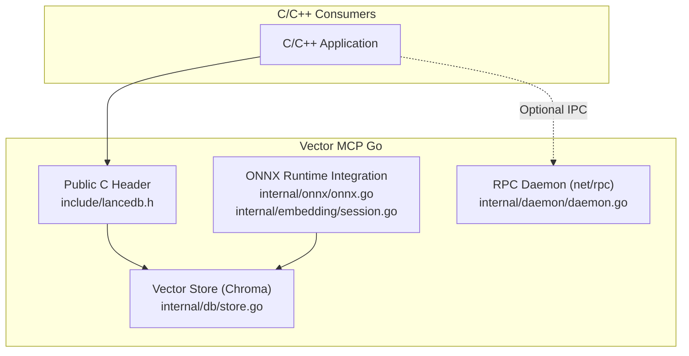
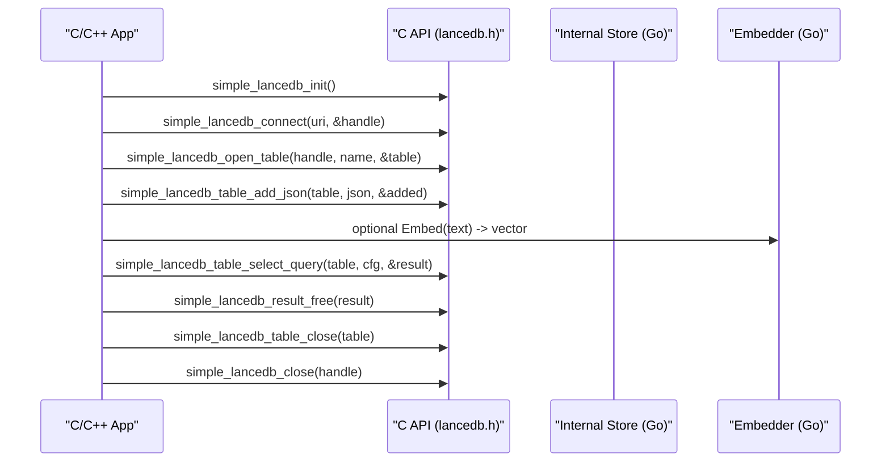
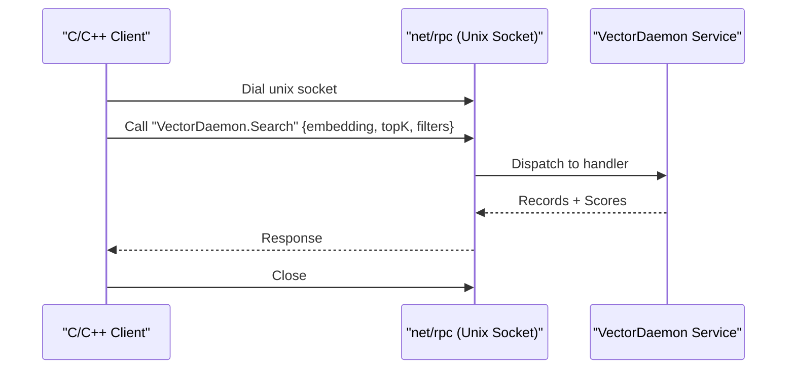
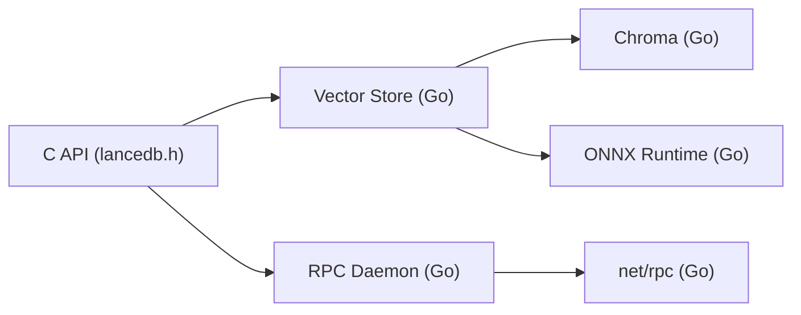

# C/C++ Interfaces

<cite>
**Referenced Files in This Document**
- [lancedb.h](file://include/lancedb.h)
- [onnx.go](file://internal/onnx/onnx.go)
- [session.go](file://internal/embedding/session.go)
- [store.go](file://internal/db/store.go)
- [graph.go](file://internal/db/graph.go)
- [daemon.go](file://internal/daemon/daemon.go)
- [Makefile](file://Makefile)
- [go.mod](file://go.mod)
</cite>

## Table of Contents
1. [Introduction](#introduction)
2. [Project Structure](#project-structure)
3. [Core Components](#core-components)
4. [Architecture Overview](#architecture-overview)
5. [Detailed Component Analysis](#detailed-component-analysis)
6. [Dependency Analysis](#dependency-analysis)
7. [Performance Considerations](#performance-considerations)
8. [Troubleshooting Guide](#troubleshooting-guide)
9. [Conclusion](#conclusion)
10. [Appendices](#appendices)

## Introduction
This document describes the C/C++ interfaces and low-level database operations exposed by Vector MCP Go. It focuses on:
- The public C API for LanceDB operations defined in the generated header.
- ONNX runtime integration through Go bindings and how it relates to C/C++ consumers.
- IPC communication via Unix domain sockets for vector database operations.
- Memory management patterns, error handling, and resource cleanup.
- Thread safety considerations and performance guidance.
- Compilation and linking requirements, including platform-specific notes for Windows, Linux, and macOS.

## Project Structure
The repository exposes a C header for external consumers and integrates ONNX runtime for embeddings. Vector operations are primarily implemented in Go, with an optional IPC layer for remote clients.

**Diagram sources**
- [lancedb.h:1-191](file://include/lancedb.h#L1-L191)
- [onnx.go:1-44](file://internal/onnx/onnx.go#L1-L44)
- [session.go:1-367](file://internal/embedding/session.go#L1-L367)
- [store.go:1-664](file://internal/db/store.go#L1-L664)
- [daemon.go:1-648](file://internal/daemon/daemon.go#L1-L648)

**Section sources**
- [lancedb.h:1-191](file://include/lancedb.h#L1-L191)
- [onnx.go:1-44](file://internal/onnx/onnx.go#L1-L44)
- [session.go:1-367](file://internal/embedding/session.go#L1-L367)
- [store.go:1-664](file://internal/db/store.go#L1-L664)
- [daemon.go:1-648](file://internal/daemon/daemon.go#L1-L648)

## Core Components
- Public C API: A generated header defines a simple C interface for connecting to LanceDB, managing tables, adding data (JSON and Arrow IPC), querying, and freeing resources.
- ONNX runtime integration: Go code initializes the ONNX runtime and manages sessions/tensors for embedding generation and reranking.
- IPC daemon: A Unix domain socket RPC server exposes vector operations to remote clients, enabling native applications to offload heavy work to a long-running daemon.

Key responsibilities:
- C API: Thin wrapper around internal operations with explicit memory management helpers.
- ONNX: Provides embedding vectors and reranking scores for downstream use.
- IPC: Exposes vector search, insert, and metadata operations over RPC.

**Section sources**
- [lancedb.h:1-191](file://include/lancedb.h#L1-L191)
- [onnx.go:1-44](file://internal/onnx/onnx.go#L1-L44)
- [session.go:1-367](file://internal/embedding/session.go#L1-L367)
- [daemon.go:1-648](file://internal/daemon/daemon.go#L1-L648)

## Architecture Overview
The C interface is designed for minimal overhead and predictable memory ownership. The typical flow for a consumer is:
- Initialize the library.
- Connect to a database and open a table.
- Add data using JSON or Arrow IPC.
- Execute queries and retrieve results.
- Clean up handles and strings.

**Diagram sources**
- [lancedb.h:36-183](file://include/lancedb.h#L36-L183)
- [store.go:35-64](file://internal/db/store.go#L35-L64)
- [session.go:176-245](file://internal/embedding/session.go#L176-L245)

## Detailed Component Analysis

### Public C API (include/lancedb.h)
The header defines a simple C ABI for LanceDB operations. Highlights:
- Result type: A struct containing a success flag and an error message pointer.
- Version info: A struct with version integer, timestamp, and metadata JSON pointer.
- Connection and table operations: Connect, close, open table, drop table, list names.
- Data ingestion: Add JSON and Arrow IPC batches.
- Schema and index operations: Get schema (JSON and IPC), create index, list indexes.
- Queries: Execute select queries with a JSON configuration.
- Resource cleanup: Helpers to free strings, arrays, and IPC buffers.

Memory management pattern:
- Functions return pointers to heap-allocated strings or arrays when requested.
- Callers must free returned strings and arrays using provided helpers.
- IPC buffers returned by schema IPC must be freed with the dedicated helper.

Thread safety:
- The header does not expose concurrent-safe APIs; callers should serialize access to the same handle/table.
- The underlying Go implementation uses mutexes for internal structures; however, the C API itself does not guarantee thread safety across simultaneous calls.

Error handling:
- Functions return a result pointer; callers must inspect the success flag and, if false, read the error message pointer.
- On success, callers must eventually free the result using the provided helper.

Examples of usage (described):
- Initialize the library, connect to a database, open a table, add JSON records, run a query, and free results.
- Use IPC ingestion for higher throughput when working with large batches.

**Section sources**
- [lancedb.h:1-191](file://include/lancedb.h#L1-L191)

### ONNX Runtime Integration (internal/onnx/onnx.go, internal/embedding/session.go)
ONNX runtime is integrated to produce embeddings and rerank scores:
- Initialization: The ONNX library path is set on Linux and the environment is initialized.
- Sessions: Per-model sessions manage tensors and run inference.
- Embedding pipeline: Tokenization, tensor preparation, inference, and normalization to cosine-similar vectors.
- Reranking: Optional reranker session computes relevance scores for query-document pairs.

Platform-specific notes:
- Linux requires setting the ONNX shared library path before initialization.
- Other platforms rely on the ONNX runtime’s default discovery mechanisms.

Resource management:
- Sessions and tensors are destroyed when closing the embedder.
- Embedder pooling enables reuse of sessions for concurrency.

**Section sources**
- [onnx.go:1-44](file://internal/onnx/onnx.go#L1-L44)
- [session.go:1-367](file://internal/embedding/session.go#L1-L367)

### Vector Database Operations (internal/db/store.go)
The internal store wraps a vector database and provides:
- Connection and collection management.
- Insertion of records with embeddings.
- Vector search, lexical search, hybrid search with reciprocal rank fusion.
- Metadata queries and path-based filtering.
- Utility operations for status, hashes, and counts.

Concurrency:
- Internal structures use read-write locks for safe concurrent access.
- Batch operations leverage parallelism for large datasets.

**Section sources**
- [store.go:1-664](file://internal/db/store.go#L1-L664)

### Knowledge Graph Utilities (internal/db/graph.go)
Supports building a knowledge graph from records for higher-order reasoning:
- Node and edge representation.
- Implementation detection for interfaces.
- Usage and name-based searches.

**Section sources**
- [graph.go:1-155](file://internal/db/graph.go#L1-L155)

### IPC Communication Protocol (internal/daemon/daemon.go)
A Unix domain socket RPC server exposes vector operations:
- Methods include embedding, batch embedding, reranking, indexing triggers, and vector store operations.
- Clients can remotely trigger indexing, query progress, and perform vector operations.
- Timeouts are applied for RPC calls to avoid indefinite blocking.

**Diagram sources**
- [daemon.go:401-647](file://internal/daemon/daemon.go#L401-L647)

**Section sources**
- [daemon.go:1-648](file://internal/daemon/daemon.go#L1-L648)

## Dependency Analysis
External dependencies relevant to C/C++ integration:
- ONNX runtime Go bindings for embeddings and reranking.
- Chroma-based vector store for semantic search.
- Standard C libraries for the C API (std headers).

**Diagram sources**
- [lancedb.h:1-191](file://include/lancedb.h#L1-L191)
- [store.go:1-664](file://internal/db/store.go#L1-L664)
- [session.go:1-367](file://internal/embedding/session.go#L1-L367)
- [daemon.go:1-648](file://internal/daemon/daemon.go#L1-L648)

**Section sources**
- [go.mod:1-37](file://go.mod#L1-L37)

## Performance Considerations
- Prefer Arrow IPC ingestion for bulk operations to minimize conversion overhead.
- Use hybrid search for improved recall and relevance.
- Tune Top-K and filters to reduce result sets.
- Embedder pooling reduces session creation overhead in high-throughput scenarios.
- Monitor memory usage and throttle heavy operations when system memory is low.

[No sources needed since this section provides general guidance]

## Troubleshooting Guide
Common issues and resolutions:
- ONNX initialization failures on Linux: Ensure the ONNX shared library path is set correctly before initializing the environment.
- Dimension mismatch errors: Switching embedding models requires clearing the existing vector database and restarting.
- RPC timeouts: Increase timeouts or reduce payload sizes; verify socket path availability.
- Memory pressure: Use the memory throttler to pause heavy tasks when thresholds are exceeded.

**Section sources**
- [onnx.go:1-44](file://internal/onnx/onnx.go#L1-L44)
- [store.go:52-61](file://internal/db/store.go#L52-L61)
- [daemon.go:448-474](file://internal/daemon/daemon.go#L448-L474)
- [session.go:273-298](file://internal/embedding/session.go#L273-L298)

## Conclusion
Vector MCP Go provides a straightforward C API for LanceDB operations, complemented by robust ONNX runtime integration and an IPC layer for distributed workloads. By following the documented memory management and error handling patterns, developers can integrate vector capabilities into native applications reliably across platforms.

[No sources needed since this section summarizes without analyzing specific files]

## Appendices

### A. C API Reference Summary
- Initialization and connection
  - Initialize library
  - Connect to database (simple and with options)
  - Close connection
- Table operations
  - List table names
  - Open/close table
  - Drop table
- Data ingestion
  - Add JSON records
  - Add Arrow IPC records
- Schema and index
  - Get schema (JSON and IPC)
  - Create index
  - List indexes
- Queries
  - Execute select query with configuration
- Resource cleanup
  - Free result
  - Free string
  - Free table names
  - Free IPC schema data
  - Free version info

**Section sources**
- [lancedb.h:36-188](file://include/lancedb.h#L36-L188)

### B. Compilation and Linking Notes
- Build the project using the provided Makefile targets for formatting, linting, testing, and building the binary.
- The project depends on ONNX runtime and Chroma; ensure these are available in the runtime environment.
- Platform-specific considerations:
  - Linux: Set the ONNX shared library path prior to initialization.
  - Windows/macOS: Rely on default ONNX runtime discovery mechanisms.

**Section sources**
- [Makefile:1-44](file://Makefile#L1-L44)
- [onnx.go:14-36](file://internal/onnx/onnx.go#L14-L36)
- [go.mod:1-37](file://go.mod#L1-L37)