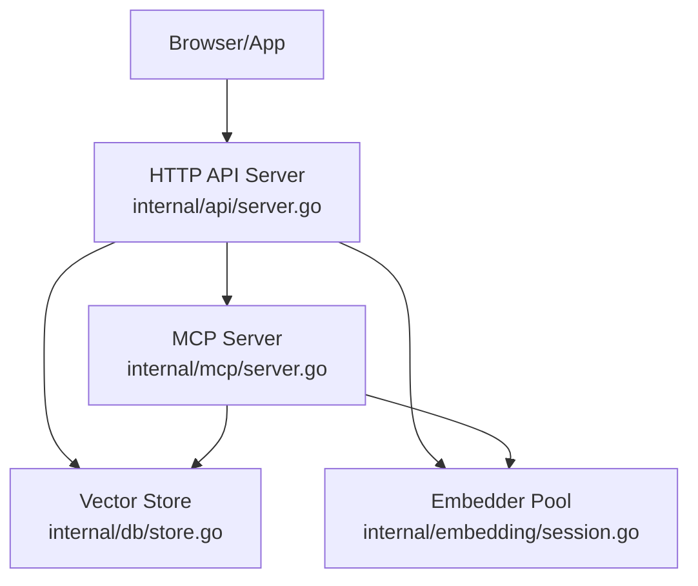
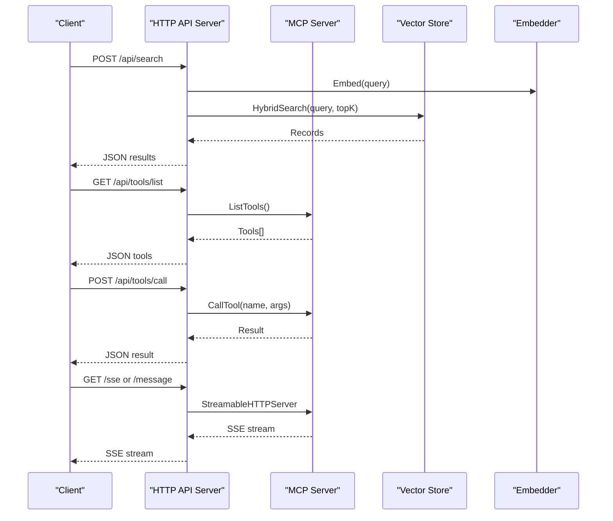
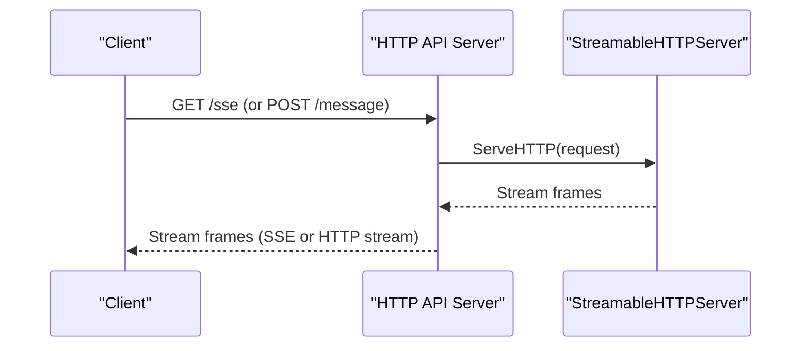
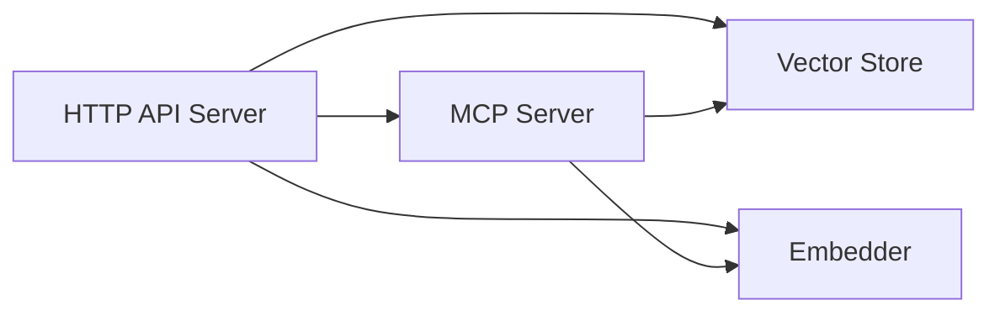

# HTTP API Endpoints

<cite>
**Referenced Files in This Document**
- [main.go](file://main.go)
- [server.go](file://internal/api/server.go)
- [handlers_tools.go](file://internal/api/handlers_tools.go)
- [server.go](file://internal/mcp/server.go)
- [handlers_search.go](file://internal/mcp/handlers_search.go)
- [handlers_project.go](file://internal/mcp/handlers_project.go)
- [handlers_index.go](file://internal/mcp/handlers_index.go)
- [handlers_lsp.go](file://internal/mcp/handlers_lsp.go)
- [handlers_mutation.go](file://internal/mcp/handlers_mutation.go)
- [config.go](file://internal/config/config.go)
</cite>

## Table of Contents
1. [Introduction](#introduction)
2. [Project Structure](#project-structure)
3. [Core Components](#core-components)
4. [Architecture Overview](#architecture-overview)
5. [Detailed Component Analysis](#detailed-component-analysis)
6. [Dependency Analysis](#dependency-analysis)
7. [Performance Considerations](#performance-considerations)
8. [Troubleshooting Guide](#troubleshooting-guide)
9. [Conclusion](#conclusion)
10. [Appendices](#appendices)

## Introduction
This document describes the HTTP API surface exposed by Vector MCP Go’s integrated HTTP server. It covers:
- Streaming endpoints for MCP tool execution using the Streamable-HTTP specification
- Standard REST endpoints for project management and tool invocation
- Real-time event streaming via Server-Sent Events (SSE)
- Authentication, CORS, and security considerations
- Streaming response patterns, error handling, rate limiting, and performance optimization
- Examples for curl and client integrations

## Project Structure
Vector MCP Go initializes an HTTP API server only when running in master mode. The HTTP server exposes:
- Health endpoint
- MCP endpoints under /sse and /message using Streamable-HTTP
- REST endpoints for search, context, todo, tool listing, tool invocation, repo listing, skeleton retrieval, and project management

**Diagram sources**
- [server.go:35-109](file://internal/api/server.go#L35-L109)
- [server.go:88-117](file://internal/mcp/server.go#L88-L117)

**Section sources**
- [main.go:170-176](file://main.go#L170-L176)
- [server.go:35-109](file://internal/api/server.go#L35-L109)

## Core Components
- HTTP API Server: Initializes routes, CORS middleware, and binds to configured port
- MCP Server: Provides tool execution, resource, and prompt endpoints via Streamable-HTTP
- Store: Vector database abstraction for search and indexing status
- Embedder: Text embedding and reranking engine

Key configuration:
- ApiPort: Defaults to 47821 when not set via environment variable

**Section sources**
- [server.go:35-109](file://internal/api/server.go#L35-L109)
- [config.go:110-113](file://internal/config/config.go#L110-L113)

## Architecture Overview
The HTTP API server composes two layers:
- REST endpoints for project management and tool orchestration
- MCP Streamable-HTTP transport for streaming tool execution

**Diagram sources**
- [server.go:75-85](file://internal/api/server.go#L75-L85)
- [handlers_tools.go:28-84](file://internal/api/handlers_tools.go#L28-L84)
- [server.go:447-453](file://internal/mcp/server.go#L447-L453)

## Detailed Component Analysis

### Health Endpoint
- Method: GET
- URL: /api/health
- Response: JSON with status and version
- Typical status codes: 200 OK

curl example:
- curl http://localhost:47821/api/health

**Section sources**
- [server.go:132-138](file://internal/api/server.go#L132-L138)

### Search Endpoint
- Method: POST
- URL: /api/search
- Request body:
  - query: string
  - top_k: integer (clamped 1..100; default 5 if omitted)
  - docs_only: boolean (filters to documentation category)
- Response: JSON array of results
  - id: string
  - text: string (truncated for length)
  - similarity: number
  - metadata: object
- Typical status codes: 200 OK, 400 Bad Request, 500 Internal Server Error

curl example:
- curl -X POST http://localhost:47821/api/search -H "Content-Type: application/json" -d '{"query":"example","top_k":5}'

**Section sources**
- [handlers_tools.go:13-28](file://internal/api/handlers_tools.go#L13-L28)
- [handlers_tools.go:28-84](file://internal/api/handlers_tools.go#L28-L84)

### Context Endpoint
- Method: POST
- URL: /api/context
- Request body:
  - text: string
  - source: string
  - metadata: object (optional)
- Response: JSON with status and message
- Typical status codes: 200 OK, 400 Bad Request, 500 Internal Server Error

curl example:
- curl -X POST http://localhost:47821/api/context -H "Content-Type: application/json" -d '{"text":"rule","source":"manual"}'

**Section sources**
- [handlers_tools.go:86-91](file://internal/api/handlers_tools.go#L86-L91)
- [handlers_tools.go:93-139](file://internal/api/handlers_tools.go#L93-L139)

### Todo Endpoint
- Method: POST
- URL: /api/todo
- Request body:
  - title: string
  - description: string
  - priority: string
- Response: JSON with status and message
- Typical status codes: 200 OK, 400 Bad Request, 500 Internal Server Error

curl example:
- curl -X POST http://localhost:47821/api/todo -H "Content-Type: application/json" -d '{"title":"task","description":"details","priority":"medium"}'

**Section sources**
- [handlers_tools.go:141-146](file://internal/api/handlers_tools.go#L141-L146)
- [handlers_tools.go:148-194](file://internal/api/handlers_tools.go#L148-L194)

### Tool Management Endpoints

#### List Tools
- Method: GET
- URL: /api/tools/list
- Response: JSON array of MCP tools
- Typical status codes: 200 OK, 500 Internal Server Error

curl example:
- curl http://localhost:47821/api/tools/list

**Section sources**
- [handlers_tools.go:196-206](file://internal/api/handlers_tools.go#L196-L206)

#### Call Tool
- Method: POST
- URL: /api/tools/call
- Request body:
  - name: string
  - arguments: object
- Response: JSON result from MCP tool
- Typical status codes: 200 OK, 400 Bad Request, 500 Internal Server Error

curl example:
- curl -X POST http://localhost:47821/api/tools/call -H "Content-Type: application/json" -d '{"name":"search_workspace","arguments":{"action":"vector","query":"cache","limit":5}}'

**Section sources**
- [handlers_tools.go:208-232](file://internal/api/handlers_tools.go#L208-L232)

#### Index Status
- Method: GET
- URL: /api/tools/status
- Response: JSON result from MCP tool index_status
- Typical status codes: 200 OK, 500 Internal Server Error

curl example:
- curl http://localhost:47821/api/tools/status

**Section sources**
- [handlers_tools.go:234-247](file://internal/api/handlers_tools.go#L234-L247)

#### Trigger Index
- Method: POST
- URL: /api/tools/index
- Request body:
  - path: string (defaults to project root if omitted)
- Response: JSON result from MCP tool trigger_project_index
- Typical status codes: 200 OK, 400 Bad Request, 500 Internal Server Error

curl example:
- curl -X POST http://localhost:47821/api/tools/index -H "Content-Type: application/json" -d '{"path":"/opt/project"}'

**Section sources**
- [handlers_tools.go:249-275](file://internal/api/handlers_tools.go#L249-L275)

#### List Repositories
- Method: GET
- URL: /api/tools/repos
- Response: JSON array of repositories with path and status
- Typical status codes: 200 OK, 500 Internal Server Error

curl example:
- curl http://localhost:47821/api/tools/repos

**Section sources**
- [handlers_tools.go:283-311](file://internal/api/handlers_tools.go#L283-L311)

#### Get Codebase Skeleton
- Method: GET
- URL: /api/tools/skeleton
- Query parameters:
  - path: string (defaults to project root)
- Response: JSON result from MCP tool get_codebase_skeleton
- Typical status codes: 200 OK, 500 Internal Server Error

curl example:
- curl "http://localhost:47821/api/tools/skeleton?path=/src"

**Section sources**
- [handlers_tools.go:313-333](file://internal/api/handlers_tools.go#L313-L333)

### MCP Streaming Endpoints (SSE and Message)
- Methods: GET and POST (OPTIONS preflight handled)
- URLs:
  - /sse (Server-Sent Events)
  - /message (Streamable-HTTP)
- Headers:
  - Access-Control-Allow-Origin: *
  - Access-Control-Allow-Methods: GET, POST, DELETE, OPTIONS
  - Access-Control-Allow-Headers: Content-Type, Mcp-Session-Id, Authorization, MCP-Protocol-Version
  - Access-Control-Expose-Headers: Mcp-Session-Id
- Behavior:
  - OPTIONS returns 204 No Content
  - Actual requests are forwarded to StreamableHTTPServer
  - Responses are streamed per Streamable-HTTP spec

curl example (SSE):
- curl -N -H "Accept: text/event-stream" http://localhost:47821/sse

curl example (message):
- curl -N -H "Content-Type: application/json" -d '{"method":"tools/list"}' http://localhost:47821/message

**Section sources**
- [server.go:48-71](file://internal/api/server.go#L48-L71)
- [server.go:89-101](file://internal/api/server.go#L89-L101)

### Authentication, CORS, and Security
- CORS:
  - All endpoints expose Access-Control-Allow-* headers
  - OPTIONS preflight is handled with 204 No Content
- Authentication:
  - No built-in authentication enforced by the HTTP server
  - Authorization header is passed through to MCP handlers
- Security considerations:
  - Restrict exposure of the HTTP API to trusted networks
  - Consider adding reverse proxy authentication and TLS termination
  - Validate and sanitize inputs on the client side before sending to endpoints

**Section sources**
- [server.go:55-64](file://internal/api/server.go#L55-L64)
- [server.go:89-101](file://internal/api/server.go#L89-L101)

### Streaming Response Patterns
- SSE (/sse): Server-sent events for continuous MCP tool output
- Streamable-HTTP (/message): HTTP transport for MCP streams
- Both endpoints:
  - Support Mcp-Session-Id header for session continuity
  - Support MCP-Protocol-Version header for protocol negotiation
  - Expose Mcp-Session-Id in Access-Control-Expose-Headers

**Diagram sources**
- [server.go:48-71](file://internal/api/server.go#L48-L71)

## Dependency Analysis
- HTTP API server depends on:
  - MCP server for tool execution
  - Vector store for search and status
  - Embedder for embeddings and reranking
- MCP server registers tools and resources; HTTP handlers proxy tool invocations

**Diagram sources**
- [server.go:35-44](file://internal/api/server.go#L35-L44)
- [server.go:88-117](file://internal/mcp/server.go#L88-L117)

**Section sources**
- [server.go:35-44](file://internal/api/server.go#L35-L44)
- [server.go:88-117](file://internal/mcp/server.go#L88-L117)

## Performance Considerations
- Embedding cost:
  - Search and tool calls that embed text incur latency; batch where possible
- Top-K limits:
  - REST search enforces 1..100 clamp; keep reasonable values
- Truncation:
  - Responses truncate long content to protect bandwidth and client performance
- Streaming:
  - Use SSE or Streamable-HTTP for long-running operations to reduce latency and improve UX
- Concurrency:
  - MCP tools may spawn background workers; ensure adequate CPU and memory headroom
- Monitoring:
  - Use /api/health for liveness and integrate with your metrics stack

[No sources needed since this section provides general guidance]

## Troubleshooting Guide
Common issues and resolutions:
- 400 Bad Request:
  - Validate request JSON and required fields (e.g., query, name, arguments)
- 500 Internal Server Error:
  - Check server logs; errors often originate from embedding failures or store operations
- CORS errors:
  - Ensure client sends required headers and respects Access-Control-Allow-* responses
- Streaming stalls:
  - Verify network stability and client SSE/HTTP streaming support

**Section sources**
- [handlers_tools.go:30-34](file://internal/api/handlers_tools.go#L30-L34)
- [handlers_tools.go:219-222](file://internal/api/handlers_tools.go#L219-L222)

## Conclusion
Vector MCP Go exposes a cohesive HTTP API for semantic search, project management, and MCP tool execution with streaming support. By leveraging CORS-friendly endpoints and SSE/Streamable-HTTP, applications can deliver responsive, real-time experiences. Integrate with reverse proxies for authentication and TLS, monitor with /api/health, and tune top_K and streaming to balance accuracy and performance.

[No sources needed since this section summarizes without analyzing specific files]

## Appendices

### Endpoint Reference Summary
- GET /api/health → JSON { status, version }
- POST /api/search → JSON array of results
- POST /api/context → JSON { status, message }
- POST /api/todo → JSON { status, message }
- GET /api/tools/list → JSON array of tools
- POST /api/tools/call → JSON tool result
- GET /api/tools/status → JSON tool result
- POST /api/tools/index → JSON tool result
- GET /api/tools/repos → JSON array of repos
- GET /api/tools/skeleton → JSON tool result
- GET /sse → SSE stream
- POST /message → Streamable-HTTP stream

**Section sources**
- [server.go:46-86](file://internal/api/server.go#L46-L86)
- [handlers_tools.go:28-333](file://internal/api/handlers_tools.go#L28-L333)

### Example Client Integrations
- Web application:
  - Use fetch/XMLHttpRequest to call /api/search and render results
  - Use EventSource for /sse to receive incremental tool output
- SPA frameworks:
  - Axios/Fetch for REST calls; SSE via native EventSource or libraries
- Real-time dashboards:
  - Poll /api/tools/status for background indexing progress
  - Subscribe to /sse for live notifications and tool outputs

[No sources needed since this section provides general guidance]