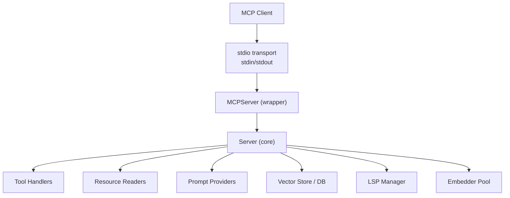
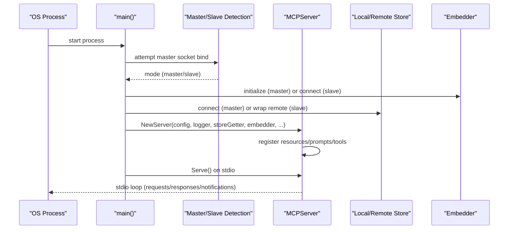
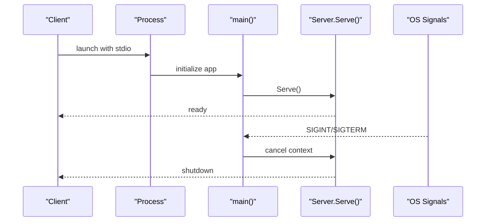
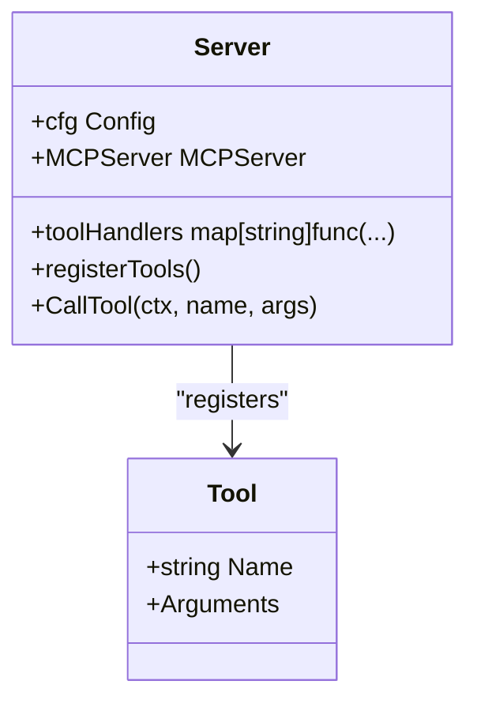
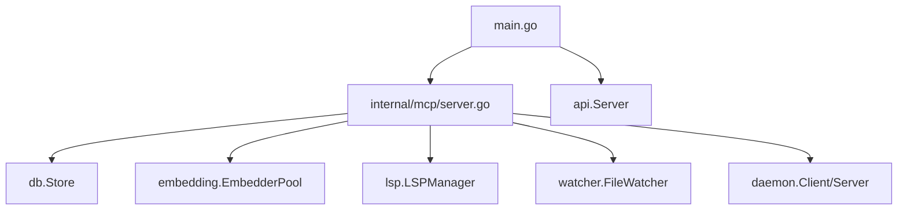

# MCP Communication Protocol

<cite>
**Referenced Files in This Document**
- [main.go](file://main.go)
- [server.go](file://internal/mcp/server.go)
- [handlers_search.go](file://internal/mcp/handlers_search.go)
- [handlers_analysis.go](file://internal/mcp/handlers_analysis.go)
- [handlers_context.go](file://internal/mcp/handlers_context.go)
- [handlers_index.go](file://internal/mcp/handlers_index.go)
- [handlers_lsp.go](file://internal/mcp/handlers_lsp.go)
- [handlers_mutation.go](file://internal/mcp/handlers_mutation.go)
- [handlers_project.go](file://internal/mcp/handlers_project.go)
- [handlers_safety.go](file://internal/mcp/handlers_safety.go)
- [handlers_distill.go](file://internal/mcp/handlers_distill.go)
- [server_test.go](file://internal/mcp/server_test.go)
- [mcp-config.json.example](file://mcp-config.json.example)
</cite>

## Table of Contents
1. [Introduction](#introduction)
2. [Project Structure](#project-structure)
3. [Core Components](#core-components)
4. [Architecture Overview](#architecture-overview)
5. [Detailed Component Analysis](#detailed-component-analysis)
6. [Dependency Analysis](#dependency-analysis)
7. [Performance Considerations](#performance-considerations)
8. [Troubleshooting Guide](#troubleshooting-guide)
9. [Conclusion](#conclusion)
10. [Appendices](#appendices)

## Introduction
This document specifies the Model Context Protocol (MCP) communication format used by the server and explains how the Go implementation adheres to stdio-based MCP semantics. It covers message types, JSON-RPC 2.0 compatibility, authentication patterns, rate limiting considerations, connection lifecycle, server initialization, tool registration, request routing, error handling, notifications, protocol versioning, and client integration patterns. It also includes examples of request-response cycles, streaming-like behavior for long-running operations, and debugging/logging/monitoring guidance.

## Project Structure
The MCP server is implemented as a stdio-based process that communicates with an MCP client over stdin/stdout. The server is initialized by the main entry point, which sets up master/slave modes, embedding pools, stores, and the MCP server instance. The MCP server registers resources, prompts, and tools, and routes requests to dedicated handlers.

**Diagram sources**
- [main.go:280-317](file://main.go#L280-L317)
- [server.go:90-128](file://internal/mcp/server.go#L90-L128)

**Section sources**
- [main.go:280-317](file://main.go#L280-L317)
- [server.go:90-128](file://internal/mcp/server.go#L90-L128)

## Core Components
- Server: Manages MCP lifecycle, registers resources/prompts/tools, routes tool calls, and emits notifications.
- Tool Handlers: Implement the business logic for each tool (search, LSP, analysis, mutation, etc.).
- Resource Readers: Provide read-only content (status, config, docs).
- Prompt Providers: Generate structured prompts for common tasks.
- Store/DB: Vector database for semantic search and persistence.
- Embedder: ONNX-based embedding and reranking.
- LSP Manager: Language Server Protocol integration for precise symbol queries.
- Notifications: Logging notifications broadcast to clients.

**Section sources**
- [server.go:67-86](file://internal/mcp/server.go#L67-L86)
- [server.go:201-283](file://internal/mcp/server.go#L201-L283)
- [server.go:285-332](file://internal/mcp/server.go#L285-L332)
- [server.go:334-418](file://internal/mcp/server.go#L334-L418)

## Architecture Overview
The server is started by the main entry point, which detects master/slave mode via a daemon socket. In master mode, it initializes the embedding pool, connects to the vector store, and starts workers and watchers. In slave mode, it connects to the master daemon and uses remote store and embedder. The MCP server is then created and started on stdio.

**Diagram sources**
- [main.go:93-176](file://main.go#L93-L176)
- [server.go:90-128](file://internal/mcp/server.go#L90-L128)

## Detailed Component Analysis

### MCP Message Types and JSON-RPC 2.0 Compatibility
- Requests: Tool calls and resource/prompt requests are routed to handlers. Responses are returned as tool results or resource content.
- Notifications: The server emits logging notifications to clients.
- JSON-RPC 2.0: The underlying library uses JSON-RPC 2.0 semantics for transport. The server wraps it and exposes typed tool calls and resource/prompt APIs.

Key behaviors:
- Tool invocation returns either a successful result or an error result.
- Resource reads return textual or binary content with MIME type metadata.
- Prompt providers return structured messages for chat.

**Section sources**
- [server.go:420-440](file://internal/mcp/server.go#L420-L440)
- [handlers_search.go:315-365](file://internal/mcp/handlers_search.go#L315-L365)
- [server.go:201-283](file://internal/mcp/server.go#L201-L283)
- [server.go:285-332](file://internal/mcp/server.go#L285-L332)

### Authentication Patterns
- The server does not implement explicit MCP authentication. It relies on process isolation and environment controls.
- Clients configure the server via MCP configuration files and environment variables.
- Security is enforced via path validation for file mutations and controlled LSP access.

**Section sources**
- [handlers_mutation.go:23-27](file://internal/mcp/handlers_mutation.go#L23-L27)
- [handlers_lsp.go:26-29](file://internal/mcp/handlers_lsp.go#L26-L29)
- [mcp-config.json.example:1-12](file://mcp-config.json.example#L1-L12)

### Rate Limiting Considerations
- Global rate limiting is not implemented in the server. Concurrency is managed internally by:
  - Embedding pool for batch operations.
  - Worker pools for filesystem scanning and indexing.
  - Context timeouts on individual tool calls.
- Clients should throttle their requests and use tool parameters (limits, timeouts) to manage load.

**Section sources**
- [main.go:133-139](file://main.go#L133-L139)
- [handlers_search.go:52-58](file://internal/mcp/handlers_search.go#L52-L58)
- [handlers_analysis.go:23-25](file://internal/mcp/handlers_analysis.go#L23-L25)

### Connection Lifecycle Management
- The server listens on stdio via a stdio-based server wrapper.
- The main entry point starts the MCP server after initializing components.
- Graceful shutdown is handled via signal handling and cancellation contexts.

**Diagram sources**
- [main.go:280-317](file://main.go#L280-L317)
- [server.go:195-199](file://internal/mcp/server.go#L195-L199)

**Section sources**
- [main.go:280-317](file://main.go#L280-L317)
- [server.go:195-199](file://internal/mcp/server.go#L195-L199)

### Server Initialization Process
- Load configuration and detect master/slave mode.
- Initialize embedding pool (master) or remote embedder (slave).
- Connect to vector store (master) or wrap remote store (slave).
- Create MCP server with store getter, embedder, queues, and resolvers.
- Register resources, prompts, and tools.
- Optionally start API server, workers, and file watcher.

**Section sources**
- [main.go:93-176](file://main.go#L93-L176)
- [server.go:90-128](file://internal/mcp/server.go#L90-L128)

### Tool Registration Mechanism and Request Routing
- Tools are registered with names and argument schemas.
- A handler map tracks tool names to functions.
- The server routes tool calls to handlers and returns results.

**Diagram sources**
- [server.go:334-418](file://internal/mcp/server.go#L334-L418)
- [server.go:442-455](file://internal/mcp/server.go#L442-L455)

**Section sources**
- [server.go:334-418](file://internal/mcp/server.go#L334-L418)
- [server.go:442-455](file://internal/mcp/server.go#L442-L455)

### Request Routing Examples
- Unified search tool routes to vector search, regex grep, graph queries, or index status.
- Workspace manager routes to project root change, indexing trigger, or diagnostics.
- LSP tool routes to precise definition, references, type hierarchy, or impact analysis.
- Mutation tool routes to patch application, file creation, linting, verification, or auto-fix.

**Section sources**
- [handlers_search.go:315-365](file://internal/mcp/handlers_search.go#L315-L365)
- [handlers_project.go:134-161](file://internal/mcp/handlers_project.go#L134-L161)
- [handlers_lsp.go:128-154](file://internal/mcp/handlers_lsp.go#L128-L154)
- [handlers_mutation.go:101-161](file://internal/mcp/handlers_mutation.go#L101-L161)

### Error Handling Patterns and Response Schemas
- Handlers return either a successful tool result or an error result with a message.
- Some handlers return text content; others return structured results.
- Context timeouts are used to bound long-running operations.
- Validation errors are returned early with descriptive messages.

**Section sources**
- [handlers_search.go:20-25](file://internal/mcp/handlers_search.go#L20-L25)
- [handlers_analysis.go:33-36](file://internal/mcp/handlers_analysis.go#L33-L36)
- [handlers_index.go:40-47](file://internal/mcp/handlers_index.go#L40-L47)
- [handlers_mutation.go:14-21](file://internal/mcp/handlers_mutation.go#L14-L21)

### Notification Systems
- The server can emit logging notifications to all connected clients.
- Notifications include level, data, and optional logger name.
- File watcher and other subsystems can forward logs via the server’s notification method.

**Section sources**
- [server.go:420-440](file://internal/mcp/server.go#L420-L440)
- [main.go:226-228](file://main.go#L226-L228)

### Streaming Responses for Long-Running Operations
- While MCP does not define a native streaming body, long-running operations can:
  - Emit periodic notifications to inform progress.
  - Return partial results incrementally via repeated polling of status resources.
  - Use index status and diagnostics tools to monitor progress.

**Section sources**
- [handlers_index.go:96-127](file://internal/mcp/handlers_index.go#L96-L127)
- [handlers_index.go:129-169](file://internal/mcp/handlers_index.go#L129-L169)

### Client Integration Patterns
- Configure the MCP client to launch the server executable with desired arguments and environment.
- Use the provided resources (status, config, docs) to discover capabilities.
- Invoke tools with validated arguments and handle both text and structured results.
- Poll index status or listen for notifications to track progress.

**Section sources**
- [mcp-config.json.example:1-12](file://mcp-config.json.example#L1-L12)
- [server.go:201-283](file://internal/mcp/server.go#L201-L283)

### Protocol Versioning, Backward Compatibility, and Migration
- The server declares its identity and version when constructing the MCP server wrapper.
- Backward compatibility is maintained by keeping tool signatures stable and adding optional parameters.
- Migration considerations:
  - When adding new tools or arguments, keep defaults so older clients continue working.
  - Prefer additive changes to resource URIs and prompt names.
  - Maintain stable response schemas for existing tools.

**Section sources**
- [server.go:90-91](file://internal/mcp/server.go#L90-L91)

### Examples of Complete Request-Response Cycles
- Tool call: search_workspace with action=vector returns a text result with formatted matches.
- Tool call: lsp_query with action=definition returns a text result with location data.
- Tool call: workspace_manager with action=trigger_index returns a text result indicating delegation or background trigger.
- Resource read: index://status returns JSON content describing indexing state.
- Prompt get: generate-docstring returns structured messages for documentation generation.

Note: The examples below reference specific handler implementations and resource definitions.

**Section sources**
- [handlers_search.go:315-365](file://internal/mcp/handlers_search.go#L315-L365)
- [handlers_lsp.go:128-154](file://internal/mcp/handlers_lsp.go#L128-L154)
- [handlers_project.go:134-161](file://internal/mcp/handlers_project.go#L134-L161)
- [server.go:201-237](file://internal/mcp/server.go#L201-L237)
- [server.go:285-332](file://internal/mcp/server.go#L285-L332)

## Dependency Analysis
The server composes several subsystems:
- Configuration and environment
- Vector store and indexing
- Embedding and reranking
- LSP integration
- File watching and live indexing
- Daemon-based master/slave coordination

**Diagram sources**
- [main.go:93-176](file://main.go#L93-L176)
- [server.go:90-128](file://internal/mcp/server.go#L90-L128)

**Section sources**
- [main.go:93-176](file://main.go#L93-L176)
- [server.go:90-128](file://internal/mcp/server.go#L90-L128)

## Performance Considerations
- Use tool parameters to constrain result sizes (e.g., limit, max_tokens).
- Prefer vector search for broad semantic recall; use regex grep for exact matches.
- Leverage reranking when available to improve precision.
- Monitor indexing progress via notifications and status resources.
- Avoid excessive concurrent tool calls; rely on internal worker pools and timeouts.

[No sources needed since this section provides general guidance]

## Troubleshooting Guide
- Indexing stuck: Check background tasks and diagnostics; verify file watcher is enabled.
- LSP failures: Ensure language servers are configured for the file type; confirm session creation.
- Mutations blocked: Validate paths and check security constraints; verify patch integrity.
- Timeouts: Reduce limits or adjust context timeouts in handlers.

**Section sources**
- [handlers_index.go:129-169](file://internal/mcp/handlers_index.go#L129-L169)
- [handlers_lsp.go:26-29](file://internal/mcp/handlers_lsp.go#L26-L29)
- [handlers_mutation.go:23-27](file://internal/mcp/handlers_mutation.go#L23-L27)
- [handlers_analysis.go:23-25](file://internal/mcp/handlers_analysis.go#L23-L25)

## Conclusion
The server implements a stdio-based MCP transport with typed tools, resources, and prompts. It emphasizes deterministic behavior, strong security controls, and observability via notifications and status resources. Clients integrate by launching the server process and invoking tools with validated arguments, while monitoring progress through status and notifications.

[No sources needed since this section summarizes without analyzing specific files]

## Appendices

### Appendix A: Example MCP Configuration
- Configure the MCP client to launch the server executable with command, args, and environment variables.

**Section sources**
- [mcp-config.json.example:1-12](file://mcp-config.json.example#L1-L12)

### Appendix B: Test Coverage Highlights
- Index status tool tests validate output formatting and background task reporting.
- Search codebase tool tests validate embedding and result formatting.
- Architect tools tests validate dependency health, docstring prompt generation, architecture analysis, and dead code detection.

**Section sources**
- [server_test.go:50-92](file://internal/mcp/server_test.go#L50-L92)
- [server_test.go:94-163](file://internal/mcp/server_test.go#L94-L163)
- [server_test.go:165-337](file://internal/mcp/server_test.go#L165-L337)