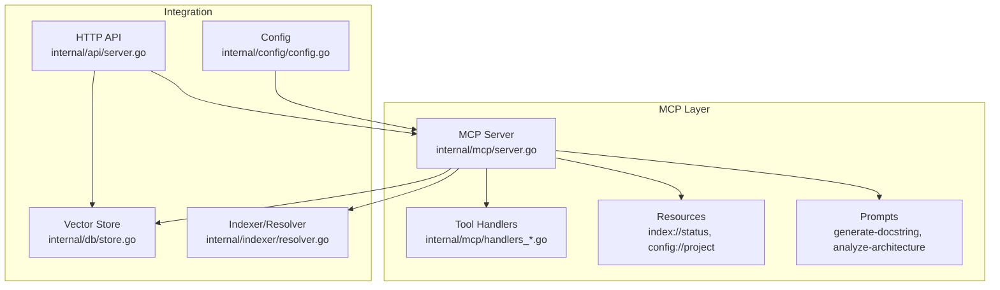
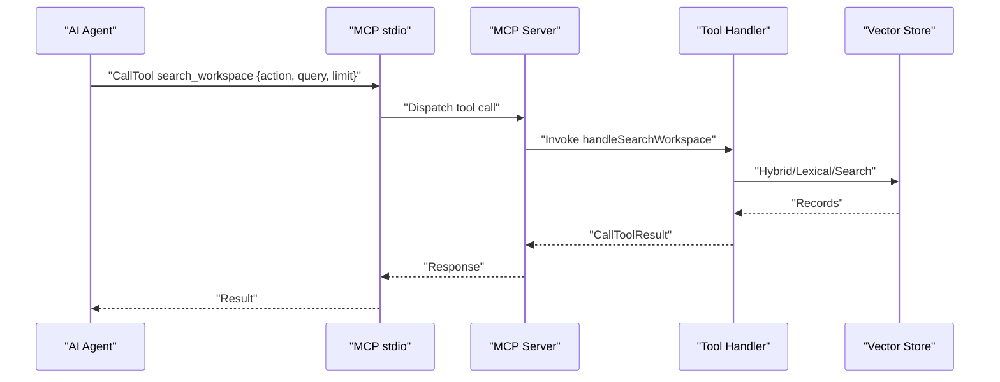
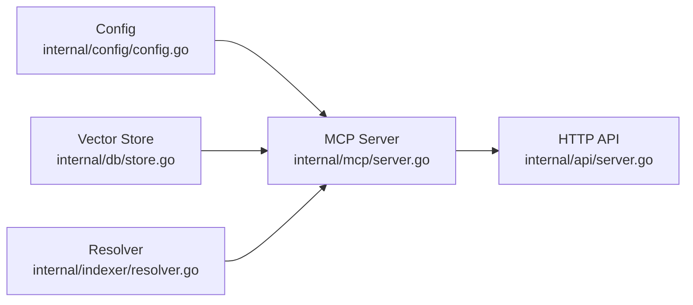

# MCP Protocol API

<cite>
**Referenced Files in This Document**
- [main.go](file://main.go)
- [mcp-config.json.example](file://mcp-config.json.example)
- [internal/mcp/server.go](file://internal/mcp/server.go)
- [internal/mcp/handlers_search.go](file://internal/mcp/handlers_search.go)
- [internal/mcp/handlers_mutation.go](file://internal/mcp/handlers_mutation.go)
- [internal/mcp/handlers_context.go](file://internal/mcp/handlers_context.go)
- [internal/mcp/handlers_index.go](file://internal/mcp/handlers_index.go)
- [internal/mcp/handlers_distill.go](file://internal/mcp/handlers_distill.go)
- [internal/mcp/handlers_lsp.go](file://internal/mcp/handlers_lsp.go)
- [internal/mcp/handlers_project.go](file://internal/mcp/handlers_project.go)
- [internal/mcp/handlers_graph.go](file://internal/mcp/handlers_graph.go)
- [internal/mcp/handlers_safety.go](file://internal/mcp/handlers_safety.go)
- [internal/api/server.go](file://internal/api/server.go)
- [internal/config/config.go](file://internal/config/config.go)
- [internal/db/store.go](file://internal/db/store.go)
- [internal/indexer/resolver.go](file://internal/indexer/resolver.go)
</cite>

## Table of Contents
1. [Introduction](#introduction)
2. [Project Structure](#project-structure)
3. [Core Components](#core-components)
4. [Architecture Overview](#architecture-overview)
5. [Detailed Component Analysis](#detailed-component-analysis)
6. [Dependency Analysis](#dependency-analysis)
7. [Performance Considerations](#performance-considerations)
8. [Troubleshooting Guide](#troubleshooting-guide)
9. [Conclusion](#conclusion)
10. [Appendices](#appendices)

## Introduction
This document provides comprehensive Model Context Protocol (MCP) API documentation for Vector MCP Go. It covers all seven MCP tools, resource endpoints, prompt registrations, notification system, and stdio-based communication semantics. It also includes request/response schemas, parameter specifications, examples, and integration guidelines for AI agents.

Vector MCP Go exposes:
- A stdio-based MCP server for tool execution and resource/prompt access
- An HTTP API gateway for SSE and message transport plus convenience endpoints
- A vector database-backed semantic search and code analysis platform

## Project Structure
The MCP server is implemented under internal/mcp and integrates with:
- internal/db for vector storage
- internal/indexer for workspace resolution and scanning
- internal/api for HTTP transport
- internal/config for runtime configuration

**Diagram sources**
- [internal/mcp/server.go:86-117](file://internal/mcp/server.go#L86-L117)
- [internal/api/server.go:33-109](file://internal/api/server.go#L33-L109)
- [internal/config/config.go:30-130](file://internal/config/config.go#L30-L130)
- [internal/db/store.go:35-64](file://internal/db/store.go#L35-L64)
- [internal/indexer/resolver.go:16-27](file://internal/indexer/resolver.go#L16-L27)

**Section sources**
- [main.go:280-317](file://main.go#L280-L317)
- [internal/mcp/server.go:190-321](file://internal/mcp/server.go#L190-L321)
- [internal/api/server.go:33-109](file://internal/api/server.go#L33-L109)

## Core Components
- MCP Server: Registers tools, resources, and prompts; serves stdio; forwards tool calls to handlers; emits notifications.
- HTTP API: Bridges MCP to HTTP via Streamable-HTTP; exposes health, SSE, message transport, and tool proxy endpoints.
- Vector Store: Persistent Chromem-backed collection supporting semantic, lexical, and hybrid search.
- Indexer/Resolver: Scans codebase, resolves monorepo aliases and workspaces, and supports path mapping.
- Configuration: Loads environment variables and sets up directories, ports, and model settings.

**Section sources**
- [internal/mcp/server.go:86-117](file://internal/mcp/server.go#L86-L117)
- [internal/api/server.go:33-109](file://internal/api/server.go#L33-L109)
- [internal/db/store.go:35-64](file://internal/db/store.go#L35-L64)
- [internal/indexer/resolver.go:16-27](file://internal/indexer/resolver.go#L16-L27)
- [internal/config/config.go:30-130](file://internal/config/config.go#L30-L130)

## Architecture Overview
The MCP server orchestrates:
- Tool registration and dispatch
- Resource retrieval (index status, project config)
- Prompt retrieval (docstring generation, architecture analysis)
- Notifications for progress/logging
- HTTP transport bridging for browser-based clients

**Diagram sources**
- [internal/mcp/server.go:323-407](file://internal/mcp/server.go#L323-L407)
- [internal/mcp/handlers_search.go:315-365](file://internal/mcp/handlers_search.go#L315-L365)
- [internal/db/store.go:223-336](file://internal/db/store.go#L223-L336)

## Detailed Component Analysis

### MCP Protocol Transport and Semantics
- Transport: stdio-based MCP server; served via server.ServeStdio.
- Message Types: Tools, Resources, Prompts, Notifications.
- Notifications: Emitted via SendNotificationToAllClients with subject "notifications/message".

**Section sources**
- [internal/mcp/server.go:184-188](file://internal/mcp/server.go#L184-L188)
- [internal/mcp/server.go:409-429](file://internal/mcp/server.go#L409-L429)

### Resource Endpoints
- index://status
  - Description: Current indexing status and background progress diagnostics.
  - MIME Type: application/json
  - Response: JSON object with project_root, status, record_count, is_master, model.
- config://project
  - Description: Active configuration for the server process.
  - MIME Type: application/json
  - Response: JSON dump of current Config.
- docs://guide
  - Description: Quick-start usage guide for clients.

**Section sources**
- [internal/mcp/server.go:190-272](file://internal/mcp/server.go#L190-L272)

### Prompt Registration
- generate-docstring
  - Arguments: file_path (required), entity_name (required)
  - Returns: Messages with a user role prompt instructing documentation generation.
- analyze-architecture
  - Arguments: none
  - Returns: Messages with a user role prompt for architecture review.

**Section sources**
- [internal/mcp/server.go:274-321](file://internal/mcp/server.go#L274-L321)

### Tool: search_workspace
- Purpose: Unified search engine for semantic, lexical, graph, and index status.
- Action types:
  - vector: Semantic similarity search; arguments: query (required), limit (optional), path (optional).
  - regex: Exact text/pattern match; arguments: query (required), is_regex=true, include_pattern (optional).
  - graph: Follow code relationship graphs; arguments: interface_name (required).
  - index_status: Check background progress; no arguments.
- Responses:
  - vector: Formatted results with path, categories, symbols, and content excerpts.
  - regex: Grep-style matches with path:line: content.
  - graph: Implementation list for interface.
  - index_status: Human-readable status and background tasks.

Examples:
- Vector search: {"action":"vector","query":"authentication middleware","limit":5,"path":"internal/auth"}
- Regex search: {"action":"regex","query":"TODO","is_regex":true,"include_pattern":"*.go"}
- Graph search: {"action":"graph","interface_name":"Repository"}
- Index status: {}

**Section sources**
- [internal/mcp/server.go:331-338](file://internal/mcp/server.go#L331-L338)
- [internal/mcp/handlers_search.go:315-365](file://internal/mcp/handlers_search.go#L315-L365)
- [internal/mcp/handlers_search.go:191-313](file://internal/mcp/handlers_search.go#L191-L313)
- [internal/mcp/handlers_search.go:20-189](file://internal/mcp/handlers_search.go#L20-L189)
- [internal/mcp/handlers_graph.go:10-31](file://internal/mcp/handlers_graph.go#L10-L31)
- [internal/mcp/handlers_index.go:96-127](file://internal/mcp/handlers_index.go#L96-L127)

### Tool: workspace_manager
- Purpose: Project management and indexing control.
- Actions:
  - set_project_root: Update active project root; argument: project_path (required).
  - trigger_index: Start re-indexing; argument: project_path (required).
  - get_indexing_diagnostics: Detailed health/state report.
- Responses:
  - set_project_root: Confirmation and watcher reset notice.
  - trigger_index: Delegation or background trigger confirmation.
  - get_indexing_diagnostics: Project root, global status, active tasks, counts, and troubleshooting tips.

Examples:
- Set root: {"action":"set_project_root","path":"/absolute/path/to/project"}
- Trigger index: {"action":"trigger_index","path":"/absolute/path/to/project"}
- Diagnostics: {"action":"get_indexing_diagnostics"}

**Section sources**
- [internal/mcp/server.go:340-345](file://internal/mcp/server.go#L340-L345)
- [internal/mcp/handlers_project.go:134-161](file://internal/mcp/handlers_project.go#L134-L161)
- [internal/mcp/handlers_index.go:129-169](file://internal/mcp/handlers_index.go#L129-L169)
- [internal/mcp/handlers_context.go:14-32](file://internal/mcp/handlers_context.go#L14-L32)

### Tool: lsp_query
- Purpose: High-precision LSP symbol analysis.
- Actions:
  - definition: Find symbol definition; arguments: path (required), line (required), character (required).
  - references: Find all usages; same arguments as definition.
  - type_hierarchy: Explore supertypes/subtypes; same arguments.
  - impact_analysis: Downstream dependencies (delegates to graph-based analysis).
- Responses: Human-readable locations/results or “No [X] found”.

Examples:
- Definition: {"action":"definition","path":"/abs/path/File.go","line":42,"character":12}
- References: {"action":"references","path":"/abs/path/File.go","line":42,"character":12}
- Type hierarchy: {"action":"type_hierarchy","path":"/abs/path/File.go","line":42,"character":12}

**Section sources**
- [internal/mcp/server.go:347-354](file://internal/mcp/server.go#L347-L354)
- [internal/mcp/handlers_lsp.go:128-154](file://internal/mcp/handlers_lsp.go#L128-L154)
- [internal/mcp/handlers_lsp.go:19-53](file://internal/mcp/handlers_lsp.go#L19-L53)
- [internal/mcp/handlers_lsp.go:55-95](file://internal/mcp/handlers_lsp.go#L55-L95)
- [internal/mcp/handlers_lsp.go:97-126](file://internal/mcp/handlers_lsp.go#L97-L126)

### Tool: analyze_code
- Purpose: Advanced diagnostics over indexed content.
- Actions:
  - ast_skeleton: Structural skeleton of codebase.
  - dead_code: Unused exported symbols.
  - duplicate_code: Semantically similar blocks.
  - dependencies: Validate external imports against manifests.
- Responses: Markdown reports or “No matches found” messages.

Examples:
- Dead code: {"action":"dead_code","target_path":"internal/pkg","is_library":false}
- Duplicate code: {"action":"duplicate_code","target_path":"internal/pkg/util.go"}
- Dependencies: {"action":"dependencies","directory_path":"."}

**Section sources**
- [internal/mcp/server.go:356-361](file://internal/mcp/server.go#L356-L361)
- [internal/mcp/handlers_project.go:16-132](file://internal/mcp/handlers_project.go#L16-L132)

### Tool: modify_workspace
- Purpose: Safe and structured codebase mutation.
- Actions:
  - apply_patch: Replace text in file; arguments: path (required), search (required), replace (required).
  - create_file: Write new file; arguments: path (required), content (required).
  - run_linter: Format code (e.g., go fmt).
  - verify_patch: Dry-run integrity check.
  - auto_fix: LSP-driven fix suggestion from diagnostics.
- Responses: Success confirmation or detailed diagnostics.

Examples:
- Apply patch: {"action":"apply_patch","path":"./cmd/app/main.go","search":"old","replace":"new"}
- Create file: {"action":"create_file","path":"./new/pkg/example.go","content":"..."}
- Verify patch: {"action":"verify_patch","path":"./example.go","search":"old","replace":"new"}
- Auto fix: {"action":"auto_fix","diagnostic_json":"{...}"}

**Section sources**
- [internal/mcp/server.go:363-372](file://internal/mcp/server.go#L363-L372)
- [internal/mcp/handlers_mutation.go:93-153](file://internal/mcp/handlers_mutation.go#L93-L153)
- [internal/mcp/handlers_mutation.go:13-44](file://internal/mcp/handlers_mutation.go#L13-L44)
- [internal/mcp/handlers_mutation.go:66-91](file://internal/mcp/handlers_mutation.go#L66-L91)
- [internal/mcp/handlers_mutation.go:46-64](file://internal/mcp/handlers_mutation.go#L46-L64)
- [internal/mcp/handlers_safety.go:13-58](file://internal/mcp/handlers_safety.go#L13-L58)

### Tool: index_status
- Purpose: Check current indexing progress and background tasks.
- Arguments: none
- Response: Human-readable status and background task list.

**Section sources**
- [internal/mcp/server.go:374-375](file://internal/mcp/server.go#L374-L375)
- [internal/mcp/handlers_index.go:96-127](file://internal/mcp/handlers_index.go#L96-L127)

### Tool: trigger_project_index
- Purpose: Manually trigger a full re-index.
- Arguments: project_path (required)
- Response: Delegation confirmation or background trigger confirmation.

**Section sources**
- [internal/mcp/server.go:376-380](file://internal/mcp/server.go#L376-L380)
- [internal/mcp/handlers_index.go:16-38](file://internal/mcp/handlers_index.go#L16-L38)

### Tool: get_related_context
- Purpose: Retrieve semantically related code and dependencies for a file.
- Arguments: filePath (required), max_tokens (optional), cross_reference_projects (optional)
- Response: XML-like context with metadata, code chunks, omitted matches, and usage samples.

**Section sources**
- [internal/mcp/server.go:381-385](file://internal/mcp/server.go#L381-L385)
- [internal/mcp/handlers_search.go:21-189](file://internal/mcp/handlers_search.go#L21-L189)

### Tool: store_context
- Purpose: Persist general project rules or decisions.
- Arguments: text (required), project_id (optional)
- Response: Confirmation message.

**Section sources**
- [internal/mcp/server.go:387-391](file://internal/mcp/server.go#L387-L391)
- [internal/mcp/handlers_context.go:34-64](file://internal/mcp/handlers_context.go#L34-L64)

### Tool: delete_context
- Purpose: Remove specific context entries or wipe a project’s index.
- Arguments: target_path (required), project_id (optional), dry_run (optional)
- Response: Confirmation or dry-run listing.

**Section sources**
- [internal/mcp/server.go:392-396](file://internal/mcp/server.go#L392-L396)
- [internal/mcp/handlers_index.go:40-94](file://internal/mcp/handlers_index.go#L40-L94)

### Tool: distill_package_purpose
- Purpose: Generate a high-level semantic summary of a package.
- Arguments: path (required)
- Response: Success message with summary and priority note.

**Section sources**
- [internal/mcp/server.go:397-401](file://internal/mcp/server.go#L397-L401)
- [internal/mcp/handlers_distill.go:11-31](file://internal/mcp/handlers_distill.go#L11-L31)

### Tool: trace_data_flow
- Purpose: Trace usage of a field or symbol across the project.
- Arguments: field_name (required)
- Response: Entities using/containing the symbol with optional docstrings.

**Section sources**
- [internal/mcp/server.go:402-406](file://internal/mcp/server.go#L402-L406)
- [internal/mcp/handlers_graph.go:33-56](file://internal/mcp/handlers_graph.go#L33-L56)

### Notification System
- Subject: notifications/message
- Payload fields: level (logging level), data (arbitrary), logger (optional)
- Emission: via SendNotificationToAllClients

**Section sources**
- [internal/mcp/server.go:409-429](file://internal/mcp/server.go#L409-L429)

### HTTP API Bridge
- Endpoints:
  - GET /api/health
  - GET /sse, POST /message (Streamable-HTTP transport)
  - POST /api/search, POST /api/context, POST /api/todo
  - GET /api/tools/repos, GET /api/tools/status, POST /api/tools/index, GET /api/tools/skeleton, GET /api/tools/list, POST /api/tools/call
- Headers: CORS and MCP-Protocol-Version support; Mcp-Session-Id exposure

**Section sources**
- [internal/api/server.go:46-129](file://internal/api/server.go#L46-L129)

## Dependency Analysis
- MCP Server depends on:
  - Config for runtime settings
  - Vector Store for search and persistence
  - Indexer Resolver for monorepo path mapping
  - LSP Manager for precise symbol queries
  - Daemon Client for master-slave coordination
- HTTP API depends on MCP Server for tool execution and resource access.

**Diagram sources**
- [internal/mcp/server.go:86-117](file://internal/mcp/server.go#L86-L117)
- [internal/api/server.go:33-109](file://internal/api/server.go#L33-L109)
- [internal/db/store.go:35-64](file://internal/db/store.go#L35-L64)
- [internal/indexer/resolver.go:16-27](file://internal/indexer/resolver.go#L16-L27)
- [internal/config/config.go:30-130](file://internal/config/config.go#L30-L130)

**Section sources**
- [internal/mcp/server.go:156-169](file://internal/mcp/server.go#L156-L169)
- [internal/api/server.go:33-109](file://internal/api/server.go#L33-L109)

## Performance Considerations
- Embedding and reranking: Batch operations are supported; consider pooling and concurrency limits.
- Search scaling: Hybrid search uses reciprocal rank fusion with dynamic weighting; lexical boosting for identifier-heavy queries.
- Memory throttling: System memory throttler is integrated to avoid overload.
- Concurrency: Handlers use worker pools and channels; timeouts applied to long-running operations.
- Caching: Metadata JSON arrays are cached to reduce repeated unmarshalling.

**Section sources**
- [internal/db/store.go:223-336](file://internal/db/store.go#L223-L336)
- [internal/mcp/handlers_search.go:20-189](file://internal/mcp/handlers_search.go#L20-L189)
- [internal/mcp/handlers_search.go:191-313](file://internal/mcp/handlers_search.go#L191-L313)
- [internal/mcp/server.go:68-70](file://internal/mcp/server.go#L68-L70)

## Troubleshooting Guide
- Dimension mismatch: If switching embedding models, the store probes and may require deleting the vector database.
- Index health: Compare disk files with DB mapping; missing/updated/deleted files are reported.
- Background tasks: Check progress map or master daemon for active indexing tasks.
- LSP failures: Ensure language servers are configured per file extension; verify sessions are started.
- HTTP transport: Verify CORS headers and MCP-Protocol-Version compatibility.

**Section sources**
- [internal/db/store.go:51-63](file://internal/db/store.go#L51-L63)
- [internal/mcp/handlers_index.go:171-225](file://internal/mcp/handlers_index.go#L171-L225)
- [internal/mcp/server.go:119-148](file://internal/mcp/server.go#L119-L148)
- [internal/api/server.go:48-71](file://internal/api/server.go#L48-L71)

## Conclusion
Vector MCP Go provides a robust MCP implementation with semantic search, precise LSP queries, mutation safety, and contextual knowledge management. Its stdio-based MCP server integrates seamlessly with HTTP bridges, offers rich diagnostics, and supports scalable vector operations backed by a persistent store.

## Appendices

### MCP Configuration Example
- Command and environment variables for launching the MCP server process.

**Section sources**
- [mcp-config.json.example:1-12](file://mcp-config.json.example#L1-L12)

### Authentication and Rate Limiting
- Authentication: Not enforced by the MCP server; agents should manage credentials externally.
- Rate limiting: Not implemented in the MCP server; consider upstream rate limiting or client-side throttling.

**Section sources**
- [internal/mcp/server.go:184-188](file://internal/mcp/server.go#L184-L188)

### Integration Guidelines for AI Agents
- Use index://status and config://project to discover capabilities and health.
- Prefer search_workspace with action=vector for semantic search; use action=regex for exact matches.
- Use lsp_query for precise symbol analysis; use get_related_context for file-level context.
- Use workspace_manager to set project root and trigger re-indexing.
- Use store_context and delete_context to manage shared knowledge.
- Use HTTP API endpoints for browser-based integrations and SSE/message transport.

**Section sources**
- [internal/mcp/server.go:190-272](file://internal/mcp/server.go#L190-L272)
- [internal/api/server.go:46-129](file://internal/api/server.go#L46-L129)