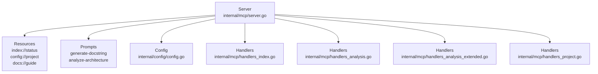
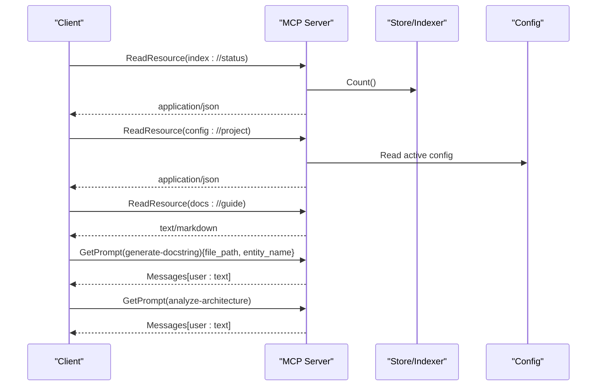
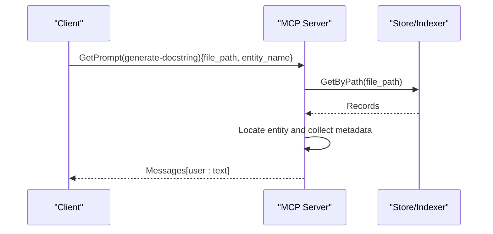
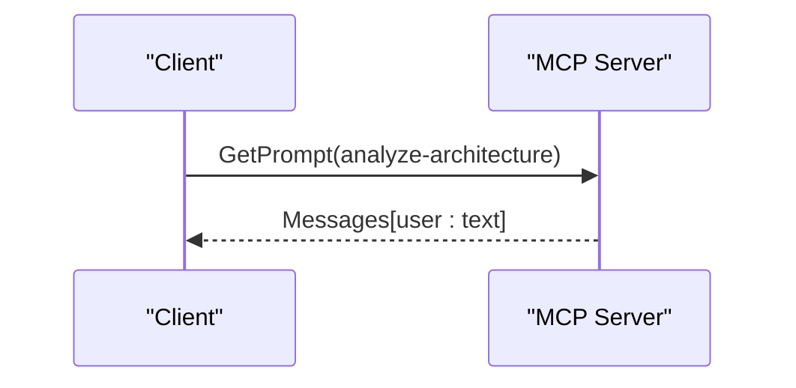
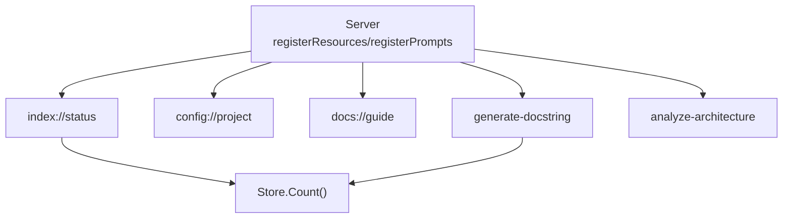

# MCP Resources and Prompts

<cite>
**Referenced Files in This Document**
- [server.go](file://internal/mcp/server.go)
- [config.go](file://internal/config/config.go)
- [handlers_index.go](file://internal/mcp/handlers_index.go)
- [handlers_analysis.go](file://internal/mcp/handlers_analysis.go)
- [handlers_analysis_extended.go](file://internal/mcp/handlers_analysis_extended.go)
- [handlers_project.go](file://internal/mcp/handlers_project.go)
- [mcp-config.json.example](file://mcp-config.json.example)
- [README.md](file://README.md)
- [AGENTS.md](file://AGENTS.md)
</cite>

## Table of Contents
1. [Introduction](#introduction)
2. [Project Structure](#project-structure)
3. [Core Components](#core-components)
4. [Architecture Overview](#architecture-overview)
5. [Detailed Component Analysis](#detailed-component-analysis)
6. [Dependency Analysis](#dependency-analysis)
7. [Performance Considerations](#performance-considerations)
8. [Troubleshooting Guide](#troubleshooting-guide)
9. [Conclusion](#conclusion)
10. [Appendices](#appendices)

## Introduction
This document describes the Model Context Protocol (MCP) resources and prompts exposed by the server. It covers:
- Three registered resources: index://status, config://project, and docs://guide
- Two registered prompts: generate-docstring and analyze-architecture
- Resource URI patterns, MIME types, response formats, and data schemas
- Prompt argument specifications, message formats, and integration examples
- Resource polling patterns, prompt parameter validation, and best practices for client consumption
- Examples of resource queries and prompt retrieval workflows

## Project Structure
The MCP server is implemented in the internal/mcp package and registers resources and prompts during initialization. Supporting configuration and handler modules provide the runtime behavior for resource retrieval and prompt generation.

**Diagram sources**
- [server.go:201-283](file://internal/mcp/server.go#L201-L283)
- [config.go:13-28](file://internal/config/config.go#L13-L28)
- [handlers_index.go:16-38](file://internal/mcp/handlers_index.go#L16-L38)
- [handlers_analysis.go:474-555](file://internal/mcp/handlers_analysis.go#L474-L555)
- [handlers_analysis_extended.go:12-82](file://internal/mcp/handlers_analysis_extended.go#L12-L82)
- [handlers_project.go:16-132](file://internal/mcp/handlers_project.go#L16-L132)

**Section sources**
- [server.go:201-283](file://internal/mcp/server.go#L201-L283)
- [config.go:13-28](file://internal/config/config.go#L13-L28)

## Core Components
- Resource registry: Registers three resources with URIs, descriptions, and MIME types.
- Prompt registry: Registers two prompts with argument specifications and message templates.
- Handler integrations: Indexing status and diagnostics, related context retrieval, and LSP impact analysis support prompt workflows.

**Section sources**
- [server.go:201-283](file://internal/mcp/server.go#L201-L283)
- [handlers_index.go:96-169](file://internal/mcp/handlers_index.go#L96-L169)
- [handlers_analysis.go:21-224](file://internal/mcp/handlers_analysis.go#L21-L224)
- [handlers_analysis_extended.go:12-82](file://internal/mcp/handlers_analysis_extended.go#L12-L82)

## Architecture Overview
The MCP server exposes:
- Resources: static or dynamic content retrieved via read-resource calls
- Prompts: parameterized prompt templates resolved to message arrays
- Tools: underlying capabilities used by prompts and agents

**Diagram sources**
- [server.go:201-283](file://internal/mcp/server.go#L201-L283)
- [handlers_analysis.go:286-332](file://internal/mcp/server.go#L286-L332)

## Detailed Component Analysis

### Resource: index://status
- Purpose: Provides live indexing telemetry for health checks and agent orchestration.
- URI Pattern: index://status
- MIME Type: application/json
- Response Format: JSON object with fields:
  - project_root: string
  - status: string
  - record_count: integer
  - is_master: boolean
  - model: string
- Data Schema:
  - project_root: string
  - status: string
  - record_count: integer
  - is_master: boolean
  - model: string

Polling Pattern:
- Clients can poll index://status to determine readiness and progress.
- The status value is derived from an in-memory progress map keyed by project root.
- Record count comes from the store’s Count() method.

Integration Example:
- Poll until status indicates completion or desired threshold.
- Use record_count to estimate index completeness.

**Section sources**
- [server.go:201-237](file://internal/mcp/server.go#L201-L237)
- [handlers_index.go:96-127](file://internal/mcp/handlers_index.go#L96-L127)

### Resource: config://project
- Purpose: Returns the active runtime configuration used by the server process.
- URI Pattern: config://project
- MIME Type: application/json
- Response Format: JSON object representing the active configuration.
- Data Schema: Matches the Config struct fields.

Integration Example:
- Retrieve config to align client behavior with server-side settings (e.g., model name, project root).

**Section sources**
- [server.go:237-251](file://internal/mcp/server.go#L237-L251)
- [config.go:13-28](file://internal/config/config.go#L13-L28)

### Resource: docs://guide
- Purpose: Provides a concise Markdown quick-start for client agents and developers.
- URI Pattern: docs://guide
- MIME Type: text/markdown
- Response Format: Markdown text with usage guidance and recommended prompts.

Integration Example:
- Use as a human-readable help resource for first-time users and agent workflows.

**Section sources**
- [server.go:251-283](file://internal/mcp/server.go#L251-L283)

### Prompt: generate-docstring
- Arguments:
  - file_path (required): string
  - entity_name (required): string
- Message Format: Single user message containing a templated prompt instructing to generate professional documentation for the specified entity, incorporating context such as internal calls and imports.
- Validation:
  - Both file_path and entity_name are required.
  - The handler locates the entity within indexed records and constructs a prompt enriched with metadata (calls, symbols, relationships).
- Integration Example:
  - Clients call GetPrompt(generate-docstring) with arguments and then send the resulting messages to an LLM for docstring generation.

**Diagram sources**
- [server.go:286-332](file://internal/mcp/server.go#L286-L332)
- [handlers_analysis.go:474-555](file://internal/mcp/handlers_analysis.go#L474-L555)

**Section sources**
- [server.go:286-332](file://internal/mcp/server.go#L286-L332)
- [handlers_analysis.go:474-555](file://internal/mcp/handlers_analysis.go#L474-L555)

### Prompt: analyze-architecture
- Arguments: none (optional monorepo prefix supported by related tools)
- Message Format: Single user message requesting a system-level architectural analysis focusing on package boundaries, dependency flow, and design patterns.
- Integration Example:
  - Clients call GetPrompt(analyze-architecture) and route the message to an LLM for a high-level project structure summary.

**Diagram sources**
- [server.go:286-332](file://internal/mcp/server.go#L286-L332)

**Section sources**
- [server.go:286-332](file://internal/mcp/server.go#L286-L332)

## Dependency Analysis
- Resource and prompt registration depend on the MCP server instance and configuration.
- Indexing status and diagnostics rely on the store’s Count() and status APIs.
- Prompt generation depends on indexed metadata (symbols, relationships, calls) retrieved from the store.

**Diagram sources**
- [server.go:201-283](file://internal/mcp/server.go#L201-L283)
- [handlers_index.go:96-127](file://internal/mcp/handlers_index.go#L96-L127)
- [handlers_analysis.go:474-555](file://internal/mcp/handlers_analysis.go#L474-L555)

**Section sources**
- [server.go:201-283](file://internal/mcp/server.go#L201-L283)
- [handlers_index.go:96-127](file://internal/mcp/handlers_index.go#L96-L127)
- [handlers_analysis.go:474-555](file://internal/mcp/handlers_analysis.go#L474-L555)

## Performance Considerations
- Resource polling: Poll index://status at intervals suitable for background indexing duration; avoid excessive polling to reduce overhead.
- Prompt construction: Retrieving and assembling prompt context involves store lookups; batch or cache where feasible on the client side.
- Configuration retrieval: config://project returns the full active configuration; cache locally after initial fetch.

## Troubleshooting Guide
- index://status shows unexpected status:
  - Verify progress map updates and store availability.
  - Use index_status tool to diagnose background tasks and record counts.
- generate-docstring returns “entity not found”:
  - Confirm file_path and entity_name are correct and present in indexed records.
  - Ensure indexing is complete so metadata (symbols, relationships) is available.
- analyze-architecture prompt yields generic results:
  - Combine with related tools (e.g., get_related_context) to enrich the LLM with concrete context.

**Section sources**
- [handlers_index.go:96-169](file://internal/mcp/handlers_index.go#L96-L169)
- [handlers_analysis.go:474-555](file://internal/mcp/handlers_analysis.go#L474-L555)

## Conclusion
The MCP resources and prompts provide a compact, deterministic interface for agents to query indexing status, retrieve configuration, access usage guidance, and obtain curated prompts for documentation and architecture analysis. Clients should poll index://status for readiness, cache config://project, and integrate prompts with complementary tools for robust workflows.

## Appendices

### Appendix A: Resource and Prompt Reference
- Resources
  - index://status
    - MIME type: application/json
    - Fields: project_root, status, record_count, is_master, model
  - config://project
    - MIME type: application/json
    - Fields: all Config struct fields
  - docs://guide
    - MIME type: text/markdown
- Prompts
  - generate-docstring
    - Arguments: file_path (required), entity_name (required)
    - Output: Messages[user: text]
  - analyze-architecture
    - Arguments: none
    - Output: Messages[user: text]

**Section sources**
- [server.go:201-283](file://internal/mcp/server.go#L201-L283)
- [handlers_analysis.go:286-332](file://internal/mcp/server.go#L286-L332)

### Appendix B: Client Consumption Best Practices
- Use index://status polling to gate downstream actions.
- Cache config://project and docs://guide content locally.
- Validate prompt arguments before retrieval to minimize errors.
- Combine prompts with tools (e.g., get_related_context) for richer context.

**Section sources**
- [AGENTS.md:1-16](file://AGENTS.md#L1-L16)
- [README.md:1-40](file://README.md#L1-L40)

### Appendix C: Example Workflows
- Resource Query: ReadResource(index://status) → parse JSON fields to assess readiness.
- Prompt Retrieval: GetPrompt(generate-docstring){file_path, entity_name} → send messages to LLM.
- Configuration Access: ReadResource(config://project) → apply server settings in client logic.

**Section sources**
- [server.go:201-283](file://internal/mcp/server.go#L201-L283)
- [handlers_analysis.go:286-332](file://internal/mcp/server.go#L286-L332)