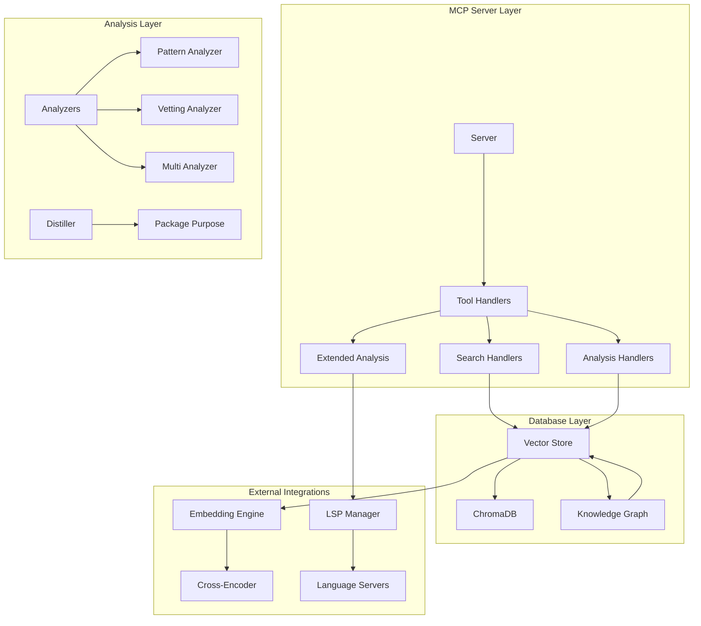
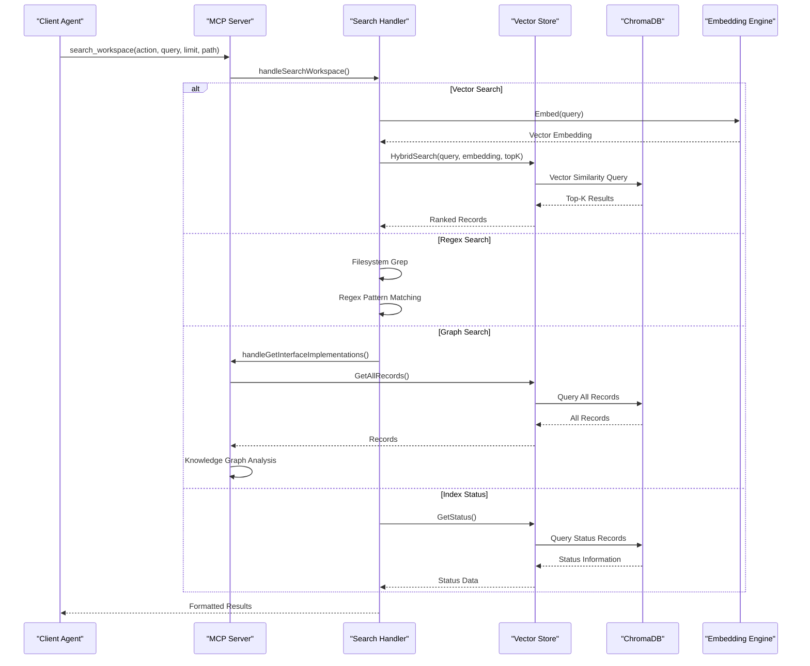
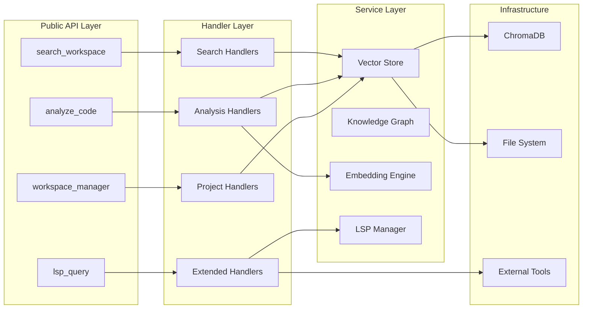

# Core Search and Analysis Tools

<cite>
**Referenced Files in This Document**
- [handlers_search.go](file://internal/mcp/handlers_search.go)
- [handlers_analysis.go](file://internal/mcp/handlers_analysis.go)
- [handlers_analysis_extended.go](file://internal/mcp/handlers_analysis_extended.go)
- [handlers_project.go](file://internal/mcp/handlers_project.go)
- [store.go](file://internal/db/store.go)
- [graph.go](file://internal/db/graph.go)
- [analyzer.go](file://internal/analysis/analyzer.go)
- [distiller.go](file://internal/analysis/distiller.go)
- [server.go](file://internal/mcp/server.go)
</cite>

## Table of Contents
1. [Introduction](#introduction)
2. [Project Structure](#project-structure)
3. [Core Components](#core-components)
4. [Architecture Overview](#architecture-overview)
5. [Detailed Component Analysis](#detailed-component-analysis)
6. [Dependency Analysis](#dependency-analysis)
7. [Performance Considerations](#performance-considerations)
8. [Troubleshooting Guide](#troubleshooting-guide)
9. [Conclusion](#conclusion)

## Introduction

This document provides comprehensive documentation for the core search and analysis tools in the vector-mcp-go system. The tools focus on two primary areas: unified workspace search and advanced code analysis. The search tools enable semantic vector similarity search, regex pattern matching, graph traversal, and index status checking through a single unified interface. The analysis tools provide AST skeleton generation, dead code detection, duplicate code identification, and dependency validation capabilities.

The system is built around a Model Context Protocol (MCP) server that orchestrates various search and analysis operations backed by a persistent vector database and knowledge graph infrastructure.

## Project Structure

The search and analysis functionality is organized across several key modules:



**Diagram sources**
- [server.go:67-86](file://internal/mcp/server.go#L67-L86)
- [store.go:19-25](file://internal/db/store.go#L19-L25)
- [graph.go:18-24](file://internal/db/graph.go#L18-L24)

**Section sources**
- [server.go:334-418](file://internal/mcp/server.go#L334-L418)

## Core Components

### Unified Search Engine (search_workspace)

The `search_workspace` tool serves as a comprehensive search interface that unifies four distinct search modalities:

1. **Vector Semantic Search**: Uses embedding vectors for similarity-based code retrieval
2. **Regex Pattern Matching**: Provides exact text and pattern matching capabilities  
3. **Graph Traversal**: Explores code relationships and dependencies
4. **Index Status Checking**: Monitors indexing progress and health

### Advanced Code Analysis Suite (analyze_code)

The `analyze_code` tool consolidates four sophisticated analysis capabilities:

1. **AST Skeleton Generation**: Creates structural maps of codebases
2. **Dead Code Detection**: Identifies unused exported symbols
3. **Duplicate Code Identification**: Finds semantically similar code blocks
4. **Dependency Validation**: Verifies manifest files against indexed imports

**Section sources**
- [handlers_search.go:315-365](file://internal/mcp/handlers_search.go#L315-L365)
- [handlers_analysis.go:1196-1241](file://internal/mcp/handlers_analysis.go#L1196-L1241)

## Architecture Overview

The system employs a layered architecture with clear separation of concerns:



**Diagram sources**
- [handlers_search.go:315-365](file://internal/mcp/handlers_search.go#L315-L365)
- [store.go:223-336](file://internal/db/store.go#L223-L336)

**Section sources**
- [server.go:67-86](file://internal/mcp/server.go#L67-L86)
- [store.go:19-25](file://internal/db/store.go#L19-L25)

## Detailed Component Analysis

### search_workspace - Unified Search Engine

#### Action Parameter Variations

The tool supports four distinct actions through the `action` parameter:

| Action | Purpose | Query Type | Parameters |
|--------|---------|------------|------------|
| `vector` | Semantic similarity search | Natural language/query | `query`, `limit`, `path` |
| `regex` | Exact text/pattern matching | Regex pattern | `query`, `limit`, `path` |
| `graph` | Relationship traversal | Symbol name | `query` (interface name) |
| `index_status` | Index health monitoring | N/A | N/A |

#### Query Syntax and Processing

**Vector Search Processing:**
1. Query embedding generation using the configured embedding model
2. Concurrent vector and lexical search with reciprocal rank fusion
3. Dynamic weighting based on query characteristics
4. Priority and recency boosting for document categories

**Regex Search Processing:**
1. Filesystem traversal with ignore pattern support
2. Parallel worker pool for file processing
3. Regex compilation and validation
4. Content matching with line-level precision

**Graph Search Processing:**
1. Knowledge graph population from indexed records
2. Interface implementation detection
3. Relationship graph construction
4. Symbol usage tracing

#### Limit Controls and Path Filtering

**Limit Controls:**
- `limit`: Maximum results (1-100, default 10)
- `topK`: Vector search parameter (1-100, default 10)
- `max_tokens`: Context window control for result formatting

**Path Filtering:**
- `path`: Restricts search scope to specific files/directories
- `include_pattern`: File pattern matching for regex searches
- Cross-project filtering via `cross_reference_projects`

#### Request/Response Schema

**Request Parameters:**
```json
{
  "action": "vector|regex|graph|index_status",
  "query": "string",
  "limit": "number",
  "path": "string",
  "is_regex": "boolean",
  "topK": "number",
  "max_tokens": "number",
  "cross_reference_projects": ["string"]
}
```

**Response Formats:**
- **Vector Search**: Formatted markdown with metadata and content
- **Regex Search**: Line-by-line matches with file context
- **Graph Search**: Implementation lists with structural details
- **Index Status**: JSON status information

**Section sources**
- [handlers_search.go:315-365](file://internal/mcp/handlers_search.go#L315-L365)
- [handlers_search.go:191-313](file://internal/mcp/handlers_search.go#L191-L313)
- [handlers_search.go:20-189](file://internal/mcp/handlers_search.go#L20-L189)

### analyze_code - Advanced Code Analysis Suite

#### AST Skeleton Generation

The skeleton generation creates hierarchical representations of codebases:

**Processing Pipeline:**
1. Directory traversal with configurable depth limits
2. Pattern-based inclusion/exclusion filtering
3. Recursive tree building with sorting
4. Hierarchical formatting with file/folder indicators

**Parameters:**
- `target_path`: Root directory for skeleton generation
- `max_depth`: Maximum recursion depth (0-20)
- `include_pattern`: File inclusion patterns
- `exclude_pattern`: File exclusion patterns
- `max_items`: Maximum items to process (1-10000)

#### Dead Code Detection

Identifies unused exported symbols through structural analysis:

**Detection Logic:**
1. Exported symbol extraction from indexed records
2. Usage tracking via calls and relationships metadata
3. Set difference calculation for unused symbols
4. Method name resolution for dot-notation symbols

**Exclusion Rules:**
- Test files and test-related functions
- Entry points (main, constructors)
- Library-internal/private symbols
- Whitelisted symbols (NewServer)

#### Duplicate Code Identification

Finds semantically similar code blocks across the codebase:

**Processing Approach:**
1. Target chunk extraction from specified path
2. Parallel similarity searches for each chunk
3. Embedding-based similarity scoring
4. Duplicate finding aggregation with project context

**Optimization Features:**
- Concurrency limiting (10 simultaneous searches)
- Parallel chunk processing
- Efficient embedding reuse

#### Dependency Validation

Verifies manifest files against indexed imports:

**Supported Manifest Types:**
- `package.json` (npm): Extracts dependencies/devDependencies
- `go.mod` (Go): Parses module dependencies
- `requirements.txt` (Python): Processes pip requirements

**Validation Process:**
1. Workspace root detection and manifest identification
2. Manifest parsing and dependency extraction
3. Indexed import analysis
4. Missing dependency reporting with file locations

**Section sources**
- [handlers_analysis.go:1196-1241](file://internal/mcp/handlers_analysis.go#L1196-L1241)
- [handlers_analysis.go:16-131](file://internal/mcp/handlers_analysis.go#L16-L131)
- [handlers_analysis.go:636-777](file://internal/mcp/handlers_analysis.go#L636-L777)
- [handlers_analysis.go:226-311](file://internal/mcp/handlers_analysis.go#L226-L311)
- [handlers_analysis.go:313-472](file://internal/mcp/handlers_analysis.go#L313-L472)

### Extended Analysis Capabilities

#### Impact Analysis

Uses LSP for comprehensive change impact assessment:

**Process Flow:**
1. LSP session establishment for target file
2. Symbol reference resolution across workspace
3. Unique file impact calculation
4. Risk level determination based on scope

**Risk Classification:**
- Low: ≤ 3 impacted files
- Medium: 4-10 impacted files  
- High: > 10 impacted files

#### Additional Analysis Tools

**Missing Tests Detection:** Identifies exported symbols without corresponding test coverage
**API Endpoint Discovery:** Scans for common routing patterns across the codebase
**Code History Retrieval:** Fetches git commit history for specific files
**Knowledge Distillation:** Generates semantic summaries of package purposes

**Section sources**
- [handlers_analysis_extended.go:12-82](file://internal/mcp/handlers_analysis_extended.go#L12-L82)
- [handlers_analysis.go:844-938](file://internal/mcp/handlers_analysis.go#L844-L938)
- [handlers_analysis.go:940-986](file://internal/mcp/handlers_analysis.go#L940-L986)
- [handlers_analysis.go:988-1017](file://internal/mcp/handlers_analysis.go#L988-L1017)
- [handlers_analysis.go:1116-1166](file://internal/mcp/handlers_analysis.go#L1116-L1166)

## Dependency Analysis

The system exhibits well-structured dependencies with clear separation between layers:



**Diagram sources**
- [server.go:334-418](file://internal/mcp/server.go#L334-L418)
- [store.go:19-25](file://internal/db/store.go#L19-L25)
- [graph.go:18-24](file://internal/db/graph.go#L18-L24)

**Section sources**
- [server.go:67-86](file://internal/mcp/server.go#L67-L86)
- [store.go:223-336](file://internal/db/store.go#L223-L336)

## Performance Considerations

### Vector Search Optimization

**Reciprocal Rank Fusion (RRF):**
- Dynamic weighting based on query characteristics
- 60-point ranking constant for optimal balance
- Priority and recency boosting for enhanced relevance

**Parallel Processing:**
- Concurrent vector and lexical search execution
- Worker pool for file processing (8 concurrent workers)
- Semaphore-controlled parallel duplicate detection (10 concurrent searches)

### Memory Management

**Cache Strategies:**
- JSON string array parsing cache with automatic eviction
- Dimension mismatch detection to prevent invalid operations
- Memory throttling for resource-constrained environments

**Resource Limits:**
- Context window truncation (12,000 characters)
- Token-based result limiting (max_tokens parameter)
- Item counting for large directory traversals

### Scalability Factors

**Index Size Impact:**
- Vector similarity queries scale with indexed record count
- Lexical search performance improves with larger indexes
- Graph operations benefit from comprehensive indexing

**Network Considerations:**
- Remote store support for distributed architectures
- Background indexing queue for large projects
- Progress tracking for long-running operations

## Troubleshooting Guide

### Common Issues and Solutions

**Dimension Mismatch Errors:**
- Cause: Switched embedding models without clearing database
- Solution: Delete vector database and restart server
- Prevention: Maintain consistent embedding model configuration

**Timeout Issues:**
- Vector searches: 30-second timeout for lexical operations
- Regex searches: 30-second timeout for filesystem operations  
- Duplicate detection: 30-second timeout for parallel processing
- Impact analysis: 60-second timeout for LSP operations

**Permission Problems:**
- File system access restrictions
- LSP server initialization failures
- Git command execution errors

**Memory Constraints:**
- Large project indexing may require increased memory
- Parallel operation limits can be adjusted
- Context window truncation prevents excessive memory usage

### Error Handling Patterns

**Structured Error Responses:**
- Consistent error message formatting across all tools
- Specific error codes for different failure modes
- Graceful degradation when optional components fail

**Recovery Strategies:**
- Automatic fallback to simpler search modes
- Partial result reporting when timeouts occur
- Incremental progress tracking for long operations

**Section sources**
- [store.go:51-63](file://internal/db/store.go#L51-L63)
- [handlers_search.go:156-163](file://internal/mcp/handlers_search.go#L156-L163)
- [handlers_analysis.go:846-857](file://internal/mcp/handlers_analysis.go#L846-L857)

## Conclusion

The vector-mcp-go search and analysis tools provide a comprehensive solution for modern codebase exploration and maintenance. The unified search interface (`search_workspace`) offers seamless access to vector similarity, regex matching, graph traversal, and index monitoring through a single API. The analysis suite (`analyze_code`) delivers sophisticated code quality and structural insights through AST skeleton generation, dead code detection, duplicate identification, and dependency validation.

The system's architecture emphasizes modularity, performance, and scalability while maintaining ease of use through well-designed parameter schemas and clear response formats. The integration of vector databases, knowledge graphs, and LSP capabilities creates a powerful foundation for AI-assisted development workflows.

Key strengths include:
- Unified interface for diverse search modalities
- Comprehensive code analysis capabilities  
- Robust error handling and recovery mechanisms
- Performance optimizations for large-scale projects
- Extensible architecture supporting additional analysis types

The tools are designed to integrate seamlessly with AI agents and development workflows, providing both immediate value through search capabilities and strategic insights through advanced analysis features.