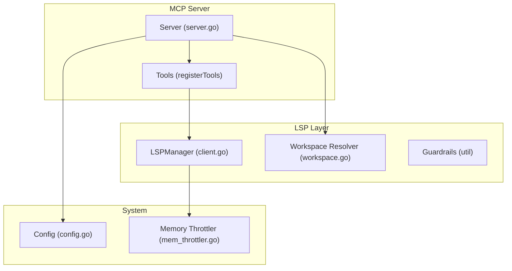
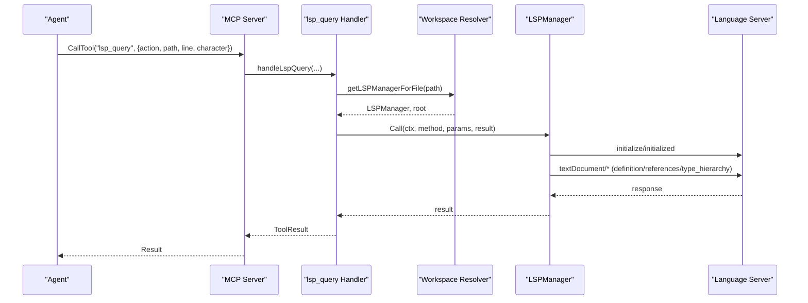
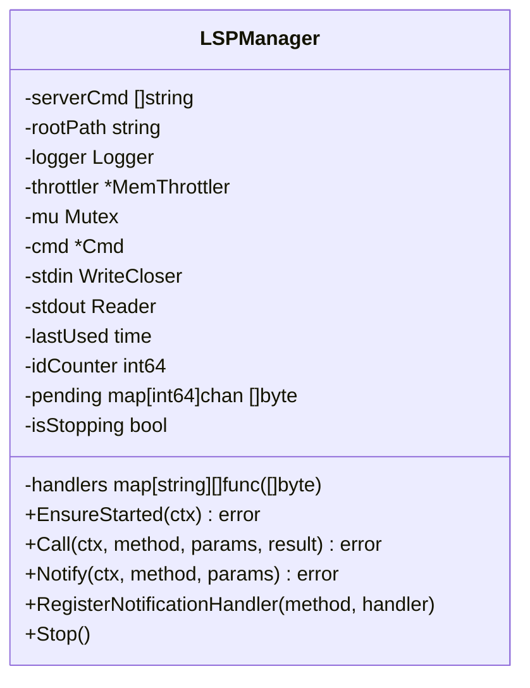
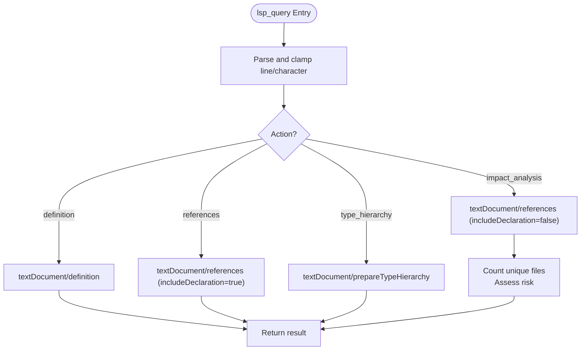
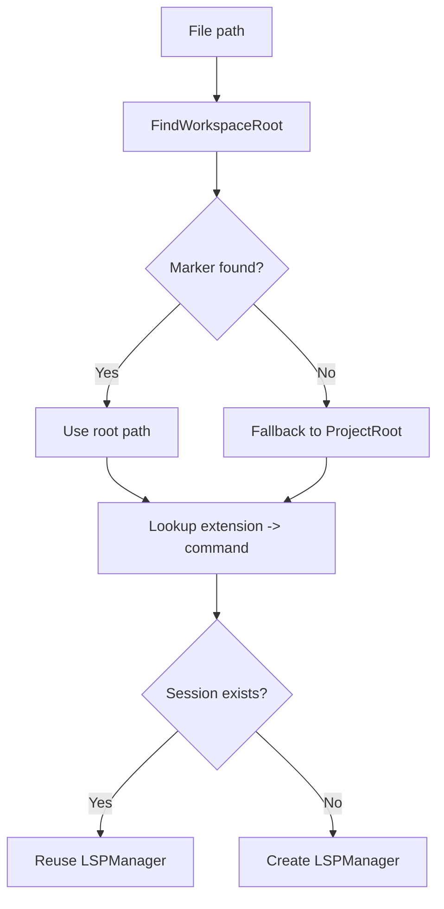
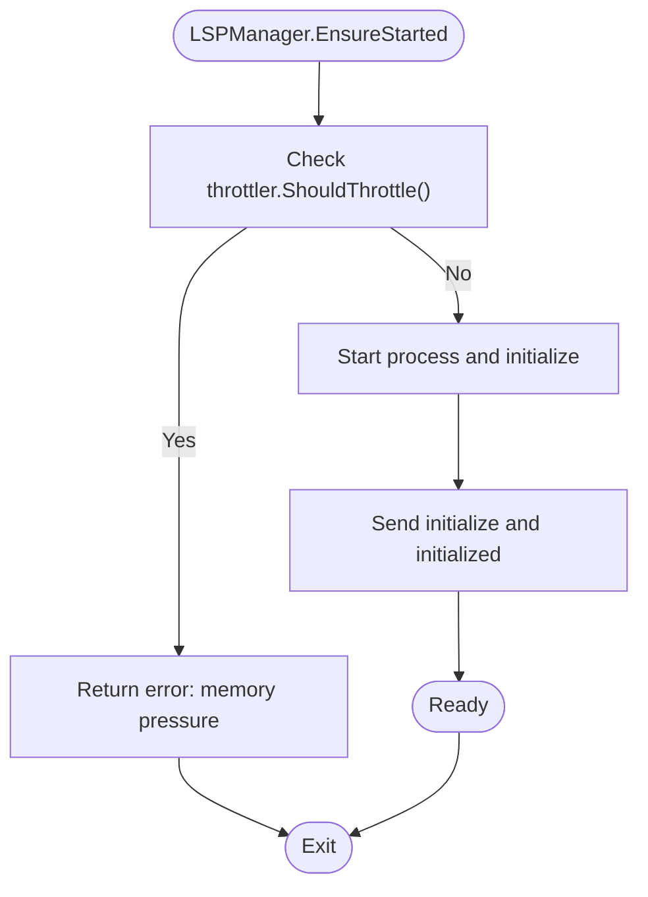
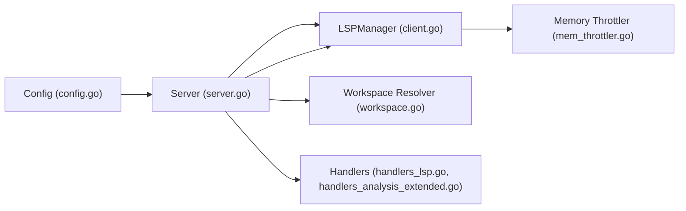

# Language Server Protocol Tools

<cite>
**Referenced Files in This Document**
- [client.go](file://internal/lsp/client.go)
- [handlers_lsp.go](file://internal/mcp/handlers_lsp.go)
- [server.go](file://internal/mcp/server.go)
- [handlers_analysis_extended.go](file://internal/mcp/handlers_analysis_extended.go)
- [workspace.go](file://internal/util/workspace.go)
- [mem_throttler.go](file://internal/system/mem_throttler.go)
- [config.go](file://internal/config/config.go)
- [README.md](file://README.md)
- [mcp-config.json.example](file://mcp-config.json.example)
</cite>

## Table of Contents
1. [Introduction](#introduction)
2. [Project Structure](#project-structure)
3. [Core Components](#core-components)
4. [Architecture Overview](#architecture-overview)
5. [Detailed Component Analysis](#detailed-component-analysis)
6. [Dependency Analysis](#dependency-analysis)
7. [Performance Considerations](#performance-considerations)
8. [Troubleshooting Guide](#troubleshooting-guide)
9. [Conclusion](#conclusion)
10. [Appendices](#appendices)

## Introduction
This document describes the Language Server Protocol (LSP) integration tools within the vector-mcp-go project. It focuses on the lsp_query functionality that enables precise symbol analysis across a codebase, including definition lookup, reference finding, type hierarchy exploration, and impact analysis. The documentation covers coordinate-based queries, file path requirements, action-specific parameters, LSP server configuration, language support matrix, performance characteristics, and integration patterns with the broader Model Context Protocol (MCP) ecosystem.

## Project Structure
The LSP integration spans several modules:
- LSP client and lifecycle management
- MCP tool registration and request routing
- Workspace resolution and path validation
- Memory throttling safeguards
- Configuration and environment integration

**Diagram sources**
- [server.go:67-128](file://internal/mcp/server.go#L67-L128)
- [client.go:37-64](file://internal/lsp/client.go#L37-L64)
- [workspace.go:9-46](file://internal/util/workspace.go#L9-L46)
- [mem_throttler.go:22-44](file://internal/system/mem_throttler.go#L22-L44)
- [config.go:13-28](file://internal/config/config.go#L13-L28)

**Section sources**
- [README.md:13-19](file://README.md#L13-L19)
- [server.go:334-418](file://internal/mcp/server.go#L334-L418)

## Core Components
- LSPManager: Manages a single LSP server process, JSON-RPC transport, request/response correlation, and lifecycle (start, initialize, idle TTL, stop).
- MCP lsp_query tool: A “Fat Tool” that consolidates four actions: definition, references, type_hierarchy, and impact_analysis.
- Workspace resolution: Determines the project root for a given file to select the correct LSP server command.
- Memory throttling: Prevents starting LSP servers under memory pressure.

Key responsibilities:
- Coordinate-based queries: line and character positions are validated and clamped before dispatching LSP requests.
- File path requirements: Absolute file paths are required; URIs are constructed as file:// for LSP.
- Action-specific parameters: Each action uses the same coordinate inputs plus a dedicated context for references.

**Section sources**
- [client.go:20-34](file://internal/lsp/client.go#L20-L34)
- [handlers_lsp.go:128-154](file://internal/mcp/handlers_lsp.go#L128-L154)
- [server.go:130-159](file://internal/mcp/server.go#L130-L159)
- [mem_throttler.go:87-103](file://internal/system/mem_throttler.go#L87-L103)

## Architecture Overview
The MCP server registers the lsp_query tool and routes requests to handlers that resolve the appropriate LSP session for the target file. Handlers construct LSP requests with position coordinates and dispatch them via LSPManager. Responses are parsed and returned to the caller.

**Diagram sources**
- [server.go:358-365](file://internal/mcp/server.go#L358-L365)
- [handlers_lsp.go:129-153](file://internal/mcp/handlers_lsp.go#L129-L153)
- [client.go:119-143](file://internal/lsp/client.go#L119-L143)
- [client.go:146-206](file://internal/lsp/client.go#L146-L206)

## Detailed Component Analysis

### LSPManager: Lifecycle and Transport
LSPManager encapsulates:
- Process lifecycle: start, initialize, idle TTL shutdown, explicit stop
- JSON-RPC transport: header parsing, request/response correlation, notification handling
- Memory throttling: prevents startup under pressure
- Session reuse keyed by root path and server command

**Diagram sources**
- [client.go:37-64](file://internal/lsp/client.go#L37-L64)
- [client.go:146-206](file://internal/lsp/client.go#L146-L206)
- [client.go:249-304](file://internal/lsp/client.go#L249-L304)
- [client.go:329-347](file://internal/lsp/client.go#L329-L347)

**Section sources**
- [client.go:67-117](file://internal/lsp/client.go#L67-L117)
- [client.go:119-143](file://internal/lsp/client.go#L119-L143)
- [client.go:249-304](file://internal/lsp/client.go#L249-L304)
- [client.go:306-327](file://internal/lsp/client.go#L306-L327)
- [client.go:349-355](file://internal/lsp/client.go#L349-L355)

### MCP lsp_query Tool: Actions and Parameters
The lsp_query tool accepts:
- action: one of definition, references, type_hierarchy, impact_analysis
- path: absolute file path containing the symbol
- line: 0-indexed line number
- character: 0-indexed character offset

Behavior:
- Definition: resolves the symbol’s definition location(s)
- References: finds all usages across the workspace (including declaration)
- Type Hierarchy: prepares the type hierarchy root for the symbol
- Impact Analysis: computes the blast radius by counting impacted files from references

**Diagram sources**
- [handlers_lsp.go:129-153](file://internal/mcp/handlers_lsp.go#L129-L153)
- [handlers_lsp.go:19-53](file://internal/mcp/handlers_lsp.go#L19-L53)
- [handlers_lsp.go:55-95](file://internal/mcp/handlers_lsp.go#L55-L95)
- [handlers_lsp.go:97-126](file://internal/mcp/handlers_lsp.go#L97-L126)
- [handlers_analysis_extended.go:14-82](file://internal/mcp/handlers_analysis_extended.go#L14-L82)

**Section sources**
- [handlers_lsp.go:128-154](file://internal/mcp/handlers_lsp.go#L128-L154)
- [handlers_lsp.go:12-17](file://internal/mcp/handlers_lsp.go#L12-L17)
- [handlers_analysis_extended.go:14-82](file://internal/mcp/handlers_analysis_extended.go#L14-L82)

### Workspace Resolution and Session Management
- Workspace root is determined by scanning upward from the target file for known markers (e.g., package.json, go.mod, Cargo.toml, .git).
- LSP command is selected based on file extension using a mapping.
- Sessions are cached per root path and server command to avoid redundant processes.

**Diagram sources**
- [workspace.go:9-46](file://internal/util/workspace.go#L9-L46)
- [server.go:130-159](file://internal/mcp/server.go#L130-L159)
- [client.go:20-34](file://internal/lsp/client.go#L20-L34)

**Section sources**
- [workspace.go:9-46](file://internal/util/workspace.go#L9-L46)
- [server.go:130-159](file://internal/mcp/server.go#L130-L159)

### Memory Throttling and LSP Startup
- MemoryThrottler monitors system memory and decides whether to allow LSP startup.
- LSPManager checks throttler before launching a process.

**Diagram sources**
- [mem_throttler.go:87-103](file://internal/system/mem_throttler.go#L87-L103)
- [client.go:76-83](file://internal/lsp/client.go#L76-L83)
- [client.go:119-143](file://internal/lsp/client.go#L119-L143)

**Section sources**
- [mem_throttler.go:87-103](file://internal/system/mem_throttler.go#L87-L103)
- [client.go:76-83](file://internal/lsp/client.go#L76-L83)

## Dependency Analysis
- LSPManager depends on:
  - System memory throttler for startup decisions
  - JSON-RPC transport and goroutines for async I/O
- MCP Server depends on:
  - LSPManager for symbol analysis
  - Workspace resolver for root detection
  - Configuration for project root and logging
- Impact analysis depends on references results and counts unique files.

**Diagram sources**
- [config.go:13-28](file://internal/config/config.go#L13-L28)
- [server.go:67-128](file://internal/mcp/server.go#L67-L128)
- [client.go:37-64](file://internal/lsp/client.go#L37-L64)
- [workspace.go:9-46](file://internal/util/workspace.go#L9-L46)
- [mem_throttler.go:22-44](file://internal/system/mem_throttler.go#L22-L44)
- [handlers_lsp.go:129-153](file://internal/mcp/handlers_lsp.go#L129-L153)
- [handlers_analysis_extended.go:14-82](file://internal/mcp/handlers_analysis_extended.go#L14-L82)

**Section sources**
- [server.go:130-159](file://internal/mcp/server.go#L130-L159)
- [client.go:20-34](file://internal/lsp/client.go#L20-L34)

## Performance Considerations
- Process reuse: LSP sessions are reused per root and command to reduce startup overhead.
- Idle TTL: Sessions automatically shut down after 10 minutes of inactivity.
- Memory throttling: Prevents LSP startup under memory pressure to protect system stability.
- Request/response correlation: Single-threaded write lock with channel-based response delivery minimizes contention.
- Impact analysis: Counts unique files from references to estimate blast radius; caps output to avoid excessive payloads.

[No sources needed since this section provides general guidance]

## Troubleshooting Guide
Common issues and resolutions:
- No language server configured for extension
  - Cause: File extension not present in mapping.
  - Resolution: Add a command for the extension or ensure the file has a recognized extension.
  - Section sources
    - [client.go:20-34](file://internal/lsp/client.go#L20-L34)
    - [server.go:140-145](file://internal/mcp/server.go#L140-L145)

- Failed to get LSP session
  - Cause: Workspace root not found or invalid path.
  - Resolution: Verify path exists and contains a project marker; ensure permissions are correct.
  - Section sources
    - [workspace.go:9-46](file://internal/util/workspace.go#L9-L46)
    - [server.go:133-138](file://internal/mcp/server.go#L133-L138)

- LSP call failed
  - Cause: Language server process died or returned an error.
  - Resolution: Check logs for disconnect warnings; session will restart on next request.
  - Section sources
    - [client.go:306-314](file://internal/lsp/client.go#L306-L314)
    - [client.go:249-304](file://internal/lsp/client.go#L249-L304)

- System memory pressure too high to start LSP
  - Cause: MemoryThrottler indicates high usage or low available memory.
  - Resolution: Free memory or adjust thresholds; wait for automatic retry.
  - Section sources
    - [mem_throttler.go:87-103](file://internal/system/mem_throttler.go#L87-L103)
    - [client.go:76-79](file://internal/lsp/client.go#L76-L79)

- Invalid action in lsp_query
  - Cause: action parameter not one of the supported values.
  - Resolution: Use definition, references, type_hierarchy, or impact_analysis.
  - Section sources
    - [handlers_lsp.go:151-153](file://internal/mcp/handlers_lsp.go#L151-L153)

## Conclusion
The lsp_query tool provides a unified, deterministic interface to LSP capabilities within the MCP ecosystem. It supports precise symbol analysis, comprehensive reference discovery, type hierarchy exploration, and impact blast-radius estimation. Robust session management, memory safeguards, and workspace resolution ensure reliable operation across diverse environments.

[No sources needed since this section summarizes without analyzing specific files]

## Appendices

### LSP Server Configuration and Language Support Matrix
- Language server mapping is defined by extension:
  - Go: gopls
  - JavaScript/TypeScript: typescript-language-server --stdio
  - JSX/TSX: typescript-language-server --stdio
- Workspace root detection uses markers: go.mod, package.json, Cargo.toml, .git
- MCP configuration example shows how to launch the server as an MCP server

**Section sources**
- [client.go:20-34](file://internal/lsp/client.go#L20-L34)
- [workspace.go:26-34](file://internal/util/workspace.go#L26-L34)
- [mcp-config.json.example:1-12](file://mcp-config.json.example#L1-L12)

### Coordinate-Based Queries and File Path Requirements
- Coordinates:
  - line: 0-indexed integer
  - character: 0-indexed integer
  - Both are clamped to safe ranges before use
- File path:
  - Must be absolute
  - URI is constructed as file://path for LSP requests

**Section sources**
- [handlers_lsp.go:12-17](file://internal/mcp/handlers_lsp.go#L12-L17)
- [handlers_lsp.go:31-39](file://internal/mcp/handlers_lsp.go#L31-L39)
- [handlers_lsp.go:66-77](file://internal/mcp/handlers_lsp.go#L66-L77)
- [handlers_lsp.go:108-116](file://internal/mcp/handlers_lsp.go#L108-L116)

### Integration Patterns with MCP Ecosystem
- The lsp_query tool is registered as part of the MCP server’s tool set alongside search, analysis, workspace management, and mutation tools.
- It integrates with the broader system by leveraging:
  - Workspace resolution for root selection
  - Configuration for project root and logging
  - Memory throttling for resource-awareness

**Section sources**
- [server.go:358-365](file://internal/mcp/server.go#L358-L365)
- [server.go:109-122](file://internal/mcp/server.go#L109-L122)
- [config.go:13-28](file://internal/config/config.go#L13-L28)