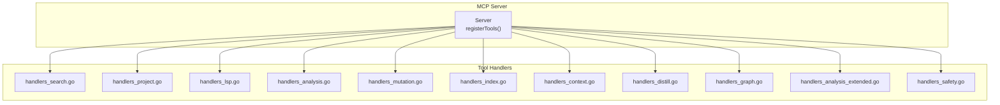
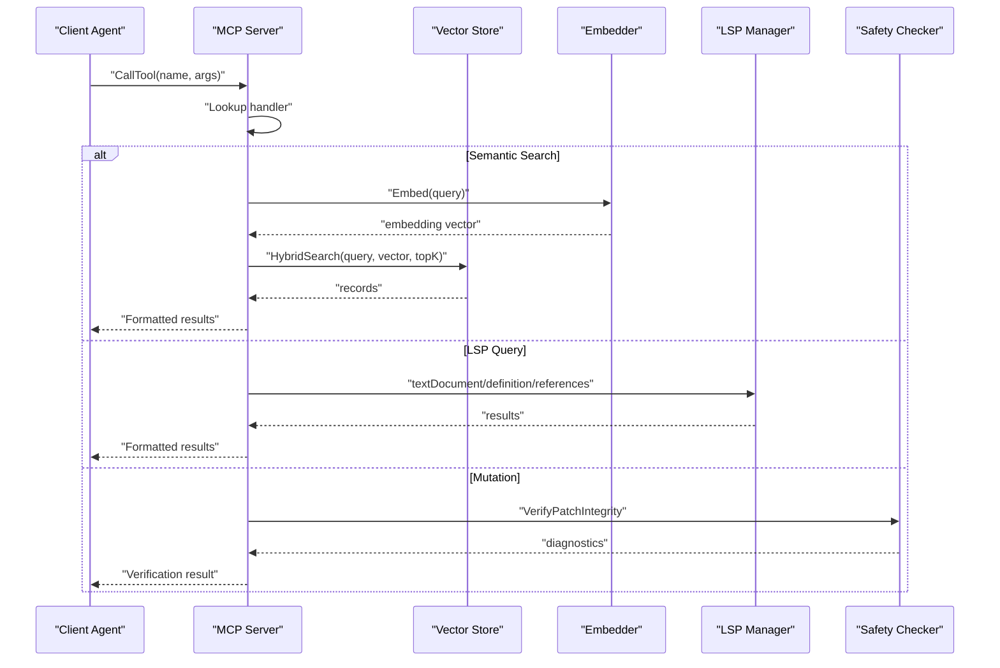
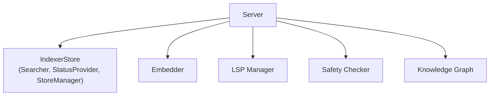

# MCP Tools Reference

<cite>
**Referenced Files in This Document**
- [server.go](file://internal/mcp/server.go)
- [handlers_search.go](file://internal/mcp/handlers_search.go)
- [handlers_project.go](file://internal/mcp/handlers_project.go)
- [handlers_lsp.go](file://internal/mcp/handlers_lsp.go)
- [handlers_analysis.go](file://internal/mcp/handlers_analysis.go)
- [handlers_mutation.go](file://internal/mcp/handlers_mutation.go)
- [handlers_index.go](file://internal/mcp/handlers_index.go)
- [handlers_context.go](file://internal/mcp/handlers_context.go)
- [handlers_distill.go](file://internal/mcp/handlers_distill.go)
- [handlers_graph.go](file://internal/mcp/handlers_graph.go)
- [handlers_analysis_extended.go](file://internal/mcp/handlers_analysis_extended.go)
- [handlers_safety.go](file://internal/mcp/handlers_safety.go)
- [mcp-config.json.example](file://mcp-config.json.example)
</cite>

## Table of Contents
1. [Introduction](#introduction)
2. [Project Structure](#project-structure)
3. [Core Components](#core-components)
4. [Architecture Overview](#architecture-overview)
5. [Detailed Component Analysis](#detailed-component-analysis)
6. [Dependency Analysis](#dependency-analysis)
7. [Performance Considerations](#performance-considerations)
8. [Troubleshooting Guide](#troubleshooting-guide)
9. [Conclusion](#conclusion)

## Introduction
This document provides a comprehensive reference for all MCP tools registered by the vector-mcp-go server. It covers the complete tool definitions, parameter schemas, validation rules, request/response patterns, error handling, return value formats, and integration workflows. The nine tools documented here are:
- search_workspace
- workspace_manager
- lsp_query
- analyze_code
- modify_workspace
- index_status
- trigger_project_index
- get_related_context
- store_context
- delete_context
- distill_package_purpose
- trace_data_flow

## Project Structure
The MCP server is implemented as a modular Go application with dedicated handler files for each tool family. Tools are registered centrally and routed to specific handlers that encapsulate their logic, validation, and response formatting.

**Diagram sources**
- [server.go:334-418](file://internal/mcp/server.go#L334-L418)
- [handlers_search.go:315-365](file://internal/mcp/handlers_search.go#L315-L365)
- [handlers_project.go:134-161](file://internal/mcp/handlers_project.go#L134-L161)
- [handlers_lsp.go:128-154](file://internal/mcp/handlers_lsp.go#L128-L154)
- [handlers_analysis.go:21-224](file://internal/mcp/handlers_analysis.go#L21-L224)
- [handlers_mutation.go:101-161](file://internal/mcp/handlers_mutation.go#L101-L161)
- [handlers_index.go:16-94](file://internal/mcp/handlers_index.go#L16-L94)
- [handlers_context.go:14-64](file://internal/mcp/handlers_context.go#L14-L64)
- [handlers_distill.go:11-31](file://internal/mcp/handlers_distill.go#L11-L31)
- [handlers_graph.go:10-57](file://internal/mcp/handlers_graph.go#L10-L57)
- [handlers_analysis_extended.go:12-82](file://internal/mcp/handlers_analysis_extended.go#L12-L82)
- [handlers_safety.go:13-58](file://internal/mcp/handlers_safety.go#L13-L58)

**Section sources**
- [server.go:334-418](file://internal/mcp/server.go#L334-L418)

## Core Components
- Server: Central orchestrator that registers tools, maintains handler mappings, and routes requests. It also manages stores, embeddings, LSP sessions, path validation, and safety checks.
- Tool Registration: Tools are defined with descriptions and argument schemas, then mapped to handlers.
- Handler Functions: Each tool’s logic resides in a dedicated handler file, implementing validation, execution, and response formatting.

Key responsibilities:
- Parameter validation and sanitization
- Store selection (local vs remote)
- Embedding generation and reranking
- LSP integration for precise symbol queries
- Safety verification for mutations
- Graph-based code reasoning

**Section sources**
- [server.go:88-128](file://internal/mcp/server.go#L88-L128)
- [server.go:334-418](file://internal/mcp/server.go#L334-L418)

## Architecture Overview
The MCP server exposes tools that integrate with:
- Vector database for semantic search and retrieval
- Filesystem scanning and indexing
- Language Server Protocol for precise symbol analysis
- Mutation safety checker for guarded edits
- Knowledge graph for structural reasoning

**Diagram sources**
- [server.go:334-418](file://internal/mcp/server.go#L334-L418)
- [handlers_search.go:191-313](file://internal/mcp/handlers_search.go#L191-L313)
- [handlers_lsp.go:19-53](file://internal/mcp/handlers_lsp.go#L19-L53)
- [handlers_mutation.go:13-45](file://internal/mcp/handlers_mutation.go#L13-L45)
- [handlers_safety.go:13-42](file://internal/mcp/handlers_safety.go#L13-L42)

## Detailed Component Analysis

### Tool: search_workspace
- Description: Unified search engine supporting semantic vector search, exact regex matching, graph-driven lookups, and index status checks.
- Action types:
  - vector: Semantic similarity search with hybrid search and reranking.
  - regex: Exact text/regex matching across files with include patterns.
  - graph: Find interface implementations via the knowledge graph.
  - index_status: Poll current indexing progress and background tasks.
- Required parameters:
  - action (string): One of vector, regex, graph, index_status.
- Optional parameters:
  - query (string): Search term or regex pattern.
  - limit (number): Max results (default 10, clamped 1–100).
  - path (string): Restrict search scope to a file or directory.
- Validation rules:
  - action must be one of the allowed values.
  - query is required for vector and regex actions.
  - limit is clamped to 1–100.
- Request/response schemas:
  - Request: { action, query?, limit?, path? }
  - Response: Text-formatted results or error message.
- Typical invocation patterns:
  - Vector search: { action: "vector", query: "cache invalidation", limit: 5 }
  - Regex search: { action: "regex", query: "\\bTODO\\b", path: "*.go" }
  - Graph lookup: { action: "graph", query: "Repository" }
  - Index status: { action: "index_status" }
- Error scenarios:
  - Invalid action returns an error result.
  - Missing query for vector/regex actions returns an error result.
- Return value formats:
  - Vector search: Markdown-formatted results with metadata and code excerpts.
  - Regex search: Grep-style matches with file paths and line numbers.
  - Graph: List of implementations with names, types, and paths.
  - Index status: Human-readable status and background task list.
- Integration patterns:
  - Chain with get_related_context for deeper investigation after vector search.
  - Use index_status to gate downstream operations until indexing completes.

**Section sources**
- [server.go:342-349](file://internal/mcp/server.go#L342-L349)
- [handlers_search.go:315-365](file://internal/mcp/handlers_search.go#L315-L365)
- [handlers_search.go:191-313](file://internal/mcp/handlers_search.go#L191-L313)
- [handlers_search.go:20-189](file://internal/mcp/handlers_search.go#L20-L189)
- [handlers_index.go:96-127](file://internal/mcp/handlers_index.go#L96-L127)
- [handlers_graph.go:10-31](file://internal/mcp/handlers_graph.go#L10-L31)

### Tool: workspace_manager
- Description: Core project management tool for switching project roots, triggering indexing, and retrieving diagnostics.
- Action types:
  - set_project_root: Update active workspace root and reset file watcher.
  - trigger_index: Start re-indexing for a project path.
  - get_indexing_diagnostics: Retrieve detailed health and state report.
- Required parameters:
  - action (string): One of set_project_root, trigger_index, get_indexing_diagnostics.
- Optional parameters:
  - path (string): Absolute path to project root or directory.
- Validation rules:
  - action must be one of the allowed values.
  - project_path is required for set_project_root and trigger_index.
- Request/response schemas:
  - Request: { action, path? }
  - Response: Text-formatted status or diagnostics.
- Typical invocation patterns:
  - Switch root: { action: "set_project_root", path: "/absolute/path" }
  - Trigger index: { action: "trigger_index", path: "/absolute/path" }
  - Diagnostics: { action: "get_indexing_diagnostics" }
- Error scenarios:
  - Invalid action returns an error result.
  - Invalid or inaccessible path returns an error result.
- Return value formats:
  - set_project_root: Confirmation with watcher reset notice.
  - trigger_index: Delegation or background initiation confirmation.
  - get_indexing_diagnostics: Structured diagnostics with counts and troubleshooting tips.
- Integration patterns:
  - Use after changing project roots or adding/removing files.
  - Combine with index_status polling for readiness checks.

**Section sources**
- [server.go:351-356](file://internal/mcp/server.go#L351-L356)
- [handlers_project.go:134-161](file://internal/mcp/handlers_project.go#L134-L161)
- [handlers_index.go:16-38](file://internal/mcp/handlers_index.go#L16-L38)
- [handlers_index.go:129-169](file://internal/mcp/handlers_index.go#L129-L169)
- [handlers_context.go:14-32](file://internal/mcp/handlers_context.go#L14-L32)

### Tool: lsp_query
- Description: High-precision symbol analysis via LSP for definitions, references, type hierarchy, and impact analysis.
- Action types:
  - definition: Jump to symbol definition.
  - references: Find all usages across the workspace.
  - type_hierarchy: Explore supertypes/subtypes.
  - impact_analysis: Analyze blast radius of a symbol change.
- Required parameters:
  - action (string): One of definition, references, type_hierarchy, impact_analysis.
  - path (string): Absolute path to the file containing the symbol.
  - line (number): 0-indexed line number.
  - character (number): 0-indexed character offset.
- Validation rules:
  - action must be one of the allowed values.
  - path is required for all actions except type_hierarchy impact analysis.
  - line and character are clamped to safe ranges.
- Request/response schemas:
  - Request: { action, path, line, character }
  - Response: Formatted LSP results or error message.
- Typical invocation patterns:
  - Definition: { action: "definition", path: "/abs/file.go", line: 42, character: 10 }
  - References: { action: "references", path: "/abs/file.go", line: 15, character: 5 }
  - Type hierarchy: { action: "type_hierarchy", path: "/abs/file.ts", line: 0, character: 0 }
  - Impact: { action: "impact_analysis", path: "/abs/file.js", line: 10, character: 3 }
- Error scenarios:
  - Invalid action returns an error result.
  - Missing path returns an error result.
  - LSP call failures return error results.
- Return value formats:
  - definition/references/type_hierarchy: Structured LSP result representation.
  - impact_analysis: Risk level, counts, and impacted files list.
- Integration patterns:
  - Use before making changes to understand usage and risks.
  - Chain with modify_workspace for safe automated fixes.

**Section sources**
- [server.go:358-365](file://internal/mcp/server.go#L358-L365)
- [handlers_lsp.go:128-154](file://internal/mcp/handlers_lsp.go#L128-L154)
- [handlers_analysis_extended.go:12-82](file://internal/mcp/handlers_analysis_extended.go#L12-L82)

### Tool: analyze_code
- Description: Advanced diagnostics including AST skeletons, dead code detection, duplicate code analysis, and dependency health checks.
- Action types:
  - ast_skeleton: Structural map of the codebase.
  - dead_code: Unused exported symbols.
  - duplicate_code: Semantically similar code blocks.
  - dependencies: Validate imports against manifests.
- Required parameters:
  - action (string): One of ast_skeleton, dead_code, duplicate_code, dependencies.
- Optional parameters:
  - path (string): Subdirectory or file path to analyze.
- Validation rules:
  - action must be one of the allowed values.
  - Some actions accept additional parameters (e.g., target_path, directory_path).
- Request/response schemas:
  - Request: { action, path? }
  - Response: Formatted diagnostic report or error message.
- Typical invocation patterns:
  - Dead code: { action: "dead_code", target_path: "src/", is_library: false }
  - Duplicate code: { action: "duplicate_code", target_path: "src/components/" }
  - Dependencies: { action: "dependencies", directory_path: "packages/web" }
- Error scenarios:
  - Invalid action returns an error result.
  - Missing or unsupported manifest returns an error result.
- Return value formats:
  - Reports with lists, counts, and actionable insights.
- Integration patterns:
  - Use after refactoring to identify dead or duplicated code.
  - Validate dependencies post-install or post-update.

**Section sources**
- [server.go:367-372](file://internal/mcp/server.go#L367-L372)
- [handlers_analysis.go:21-224](file://internal/mcp/handlers_analysis.go#L21-L224)
- [handlers_analysis.go:313-472](file://internal/mcp/handlers_analysis.go#L313-L472)
- [handlers_analysis.go:636-777](file://internal/mcp/handlers_analysis.go#L636-L777)
- [handlers_analysis.go:557-634](file://internal/mcp/handlers_analysis.go#L557-L634)

### Tool: modify_workspace
- Description: Safe and structured codebase mutation tools for patches, file creation, linting, integrity verification, and auto-fix suggestions.
- Action types:
  - apply_patch: Search-and-replace within a file.
  - create_file: Create a new file with content.
  - run_linter: Execute a formatter/linter (e.g., go fmt).
  - verify_patch: Dry-run to check for compiler errors.
  - auto_fix: Generate fix suggestions from diagnostics.
- Required parameters:
  - action (string): One of apply_patch, create_file, run_linter, verify_patch, auto_fix.
- Optional parameters:
  - path (string): Target file path.
  - content (string): Complete file content for create_file.
  - search (string): Exact text to find for apply_patch/verify_patch.
  - replace (string): Replacement text for apply_patch/verify_patch.
  - tool (string): Linter/formatter name (e.g., "go fmt").
  - diagnostic_json (string): JSON-encoded diagnostic for auto_fix.
- Validation rules:
  - action must be one of the allowed values.
  - apply_patch requires path and search; create_file requires path; run_linter requires path and tool; verify_patch requires path and search; auto_fix requires diagnostic_json.
  - Paths are validated for security to prevent traversal.
- Request/response schemas:
  - Request: { action, path?, content?, search?, replace?, tool?, diagnostic_json? }
  - Response: Success confirmation or error message.
- Typical invocation patterns:
  - Apply patch: { action: "apply_patch", path: "/abs/file.go", search: "oldFunc", replace: "newFunc" }
  - Create file: { action: "create_file", path: "/abs/new.go", content: "..." }
  - Verify patch: { action: "verify_patch", path: "/abs/file.go", search: "old", replace: "new" }
  - Auto fix: { action: "auto_fix", diagnostic_json: "{...}" }
- Error scenarios:
  - Invalid action returns an error result.
  - Path validation failures return an error result.
  - Search string not found returns an error result.
- Return value formats:
  - Success messages or formatted diagnostic summaries.
- Integration patterns:
  - Use verify_patch before apply_patch.
  - Use auto_fix to propose minimal safe changes.

**Section sources**
- [server.go:374-383](file://internal/mcp/server.go#L374-L383)
- [handlers_mutation.go:101-161](file://internal/mcp/handlers_mutation.go#L101-L161)
- [handlers_safety.go:13-58](file://internal/mcp/handlers_safety.go#L13-L58)

### Tool: index_status
- Description: Check current indexing status and background progress.
- Required parameters: None.
- Optional parameters: None.
- Validation rules: None.
- Request/response schemas:
  - Request: {}
  - Response: Text-formatted status including background tasks.
- Typical invocation patterns:
  - Polling: {} (periodic checks)
- Error scenarios: None (returns status or empty).
- Return value formats: Human-readable status and task list.
- Integration patterns:
  - Use as a readiness gate before search operations.

**Section sources**
- [server.go:385-386](file://internal/mcp/server.go#L385-L386)
- [handlers_index.go:96-127](file://internal/mcp/handlers_index.go#L96-L127)

### Tool: trigger_project_index
- Description: Manually trigger a full re-index of the project.
- Required parameters:
  - project_path (string): Absolute path to the project root.
- Optional parameters: None.
- Validation rules:
  - project_path is required and must be an absolute path.
  - Delegates to master daemon if configured.
- Request/response schemas:
  - Request: { project_path }
  - Response: Confirmation of delegation or background initiation.
- Typical invocation patterns:
  - After major changes: { project_path: "/abs/root" }
- Error scenarios:
  - Invalid or inaccessible path returns an error result.
- Return value formats: Confirmation message.
- Integration patterns:
  - Use after adding/removing large directories or updating ignore rules.

**Section sources**
- [server.go:387-391](file://internal/mcp/server.go#L387-L391)
- [handlers_index.go:16-38](file://internal/mcp/handlers_index.go#L16-L38)

### Tool: get_related_context
- Description: Retrieve semantically related code and dependencies for a specific file, plus usage samples.
- Required parameters:
  - filePath (string): Path to the source file.
- Optional parameters:
  - max_tokens (number): Token budget for context (default capped).
  - cross_reference_projects (array of strings): Additional project IDs to include.
- Validation rules:
  - filePath is required.
  - max_tokens is clamped to a safe upper bound.
- Request/response schemas:
  - Request: { filePath, max_tokens?, cross_reference_projects? }
  - Response: XML-like structured context with code chunks, metadata, and usage samples.
- Typical invocation patterns:
  - Context retrieval: { filePath: "/abs/file.go", max_tokens: 2000 }
- Error scenarios:
  - No context found returns a neutral message.
- Return value formats: Structured context suitable for prompting.
- Integration patterns:
  - Use as input to LLM prompts for accurate summarization or refactoring.

**Section sources**
- [server.go:392-396](file://internal/mcp/server.go#L392-L396)
- [handlers_analysis.go:21-224](file://internal/mcp/handlers_analysis.go#L21-L224)

### Tool: store_context
- Description: Persist general project rules or architectural decisions into the vector database.
- Required parameters:
  - text (string): The text context to store.
- Optional parameters:
  - project_id (string): Project identifier (defaults to active project root).
- Validation rules:
  - text is required.
- Request/response schemas:
  - Request: { text, project_id? }
  - Response: Confirmation message.
- Typical invocation patterns:
  - Rule storage: { text: "Use snake_case for internal constants" }
- Error scenarios:
  - Embedding or storage failures return an error result.
- Return value formats: Success confirmation.
- Integration patterns:
  - Use to maintain shared knowledge across the team.

**Section sources**
- [server.go:398-402](file://internal/mcp/server.go#L398-L402)
- [handlers_context.go:34-64](file://internal/mcp/handlers_context.go#L34-L64)

### Tool: delete_context
- Description: Delete specific shared memory context or wipe a project’s vector index.
- Required parameters:
  - target_path (string): Exact file path, context ID, or "ALL" to clear the whole project.
- Optional parameters:
  - project_id (string): Project identifier (defaults to active project root).
  - dry_run (boolean): Preview deletions without applying.
- Validation rules:
  - target_path is required.
  - dry_run is optional; if true, returns preview list.
- Request/response schemas:
  - Request: { target_path, project_id?, dry_run? }
  - Response: Confirmation or preview list.
- Typical invocation patterns:
  - Dry run: { target_path: "/abs/file.go", dry_run: true }
  - Full wipe: { target_path: "ALL" }
- Error scenarios:
  - Store errors return an error result.
- Return value formats: Confirmation or preview list.
- Integration patterns:
  - Use cautiously; dry_run helps assess impact.

**Section sources**
- [server.go:404-407](file://internal/mcp/server.go#L404-L407)
- [handlers_index.go:40-94](file://internal/mcp/handlers_index.go#L40-L94)

### Tool: distill_package_purpose
- Description: Generate a high-level semantic summary of a package’s primary purpose and key entities.
- Required parameters:
  - path (string): Relative or absolute path of the package directory.
- Optional parameters: None.
- Validation rules:
  - path is required.
- Request/response schemas:
  - Request: { path }
  - Response: Summary text with re-indexing note.
- Typical invocation patterns:
  - Purpose distillation: { path: "internal/api" }
- Error scenarios:
  - Distillation failures return an error result.
- Return value formats: Formatted summary with emphasis on retrieval priority.
- Integration patterns:
  - Use to bootstrap onboarding or documentation efforts.

**Section sources**
- [server.go:409-412](file://internal/mcp/server.go#L409-L412)
- [handlers_distill.go:11-31](file://internal/mcp/handlers_distill.go#L11-L31)

### Tool: trace_data_flow
- Description: Trace the usage of a specific field or symbol across the project.
- Required parameters:
  - field_name (string): The name of the field or symbol to trace.
- Optional parameters: None.
- Validation rules:
  - field_name is required.
- Request/response schemas:
  - Request: { field_name }
  - Response: List of entities using/containing the symbol.
- Typical invocation patterns:
  - Symbol tracing: { field_name: "cacheTTL" }
- Error scenarios:
  - Missing symbol returns a neutral message.
- Return value formats: Formatted list with types and paths.
- Integration patterns:
  - Use to understand ripple effects of renaming or refactoring.

**Section sources**
- [server.go:414-417](file://internal/mcp/server.go#L414-L417)
- [handlers_graph.go:33-57](file://internal/mcp/handlers_graph.go#L33-L57)

## Dependency Analysis
The server composes multiple subsystems to implement tool behaviors. The following diagram shows key dependencies among components.

**Diagram sources**
- [server.go:29-62](file://internal/mcp/server.go#L29-L62)
- [server.go:167-174](file://internal/mcp/server.go#L167-L174)
- [server.go:118-122](file://internal/mcp/server.go#L118-L122)

**Section sources**
- [server.go:29-62](file://internal/mcp/server.go#L29-L62)

## Performance Considerations
- Vector search:
  - Hybrid search with reranking improves precision but adds latency; tune topK and max_tokens to balance recall and speed.
  - Timeout contexts prevent long-running filesystem scans.
- Regex search:
  - Worker pool with bounded channels limits resource usage; maxMatches caps output.
- LSP queries:
  - Clamped positions prevent excessive work; impact analysis aggregates references efficiently.
- Mutations:
  - Safety verification prevents introducing compile errors; dry-run mode avoids risky writes.
- Indexing:
  - Background queues and progress maps enable asynchronous operation; diagnostics help troubleshoot bottlenecks.

[No sources needed since this section provides general guidance]

## Troubleshooting Guide
Common issues and resolutions:
- Invalid tool name:
  - Symptom: Tool not found error.
  - Resolution: Verify tool name matches registered tools.
- Missing required parameters:
  - Symptom: Error result indicating missing fields.
  - Resolution: Provide required parameters per tool schema.
- Path validation failures:
  - Symptom: Error result for invalid or unsafe paths.
  - Resolution: Use absolute paths within project root; respect security constraints.
- LSP call failures:
  - Symptom: Error result from LSP.
  - Resolution: Ensure language servers are configured and file paths are correct.
- Indexing stuck or incomplete:
  - Symptom: Empty or partial results.
  - Resolution: Trigger re-index, check diagnostics, and confirm background tasks.

**Section sources**
- [server.go:442-455](file://internal/mcp/server.go#L442-L455)
- [handlers_mutation.go:13-45](file://internal/mcp/handlers_mutation.go#L13-L45)
- [handlers_index.go:129-169](file://internal/mcp/handlers_index.go#L129-L169)

## Conclusion
The MCP tools in vector-mcp-go provide a cohesive toolkit for semantic search, precise symbol analysis, diagnostics, safe mutations, and knowledge management. By leveraging vector embeddings, LSP, and a knowledge graph, these tools enable efficient codebase navigation and maintenance. Use the provided schemas, validation rules, and integration patterns to build reliable automation and agent workflows.