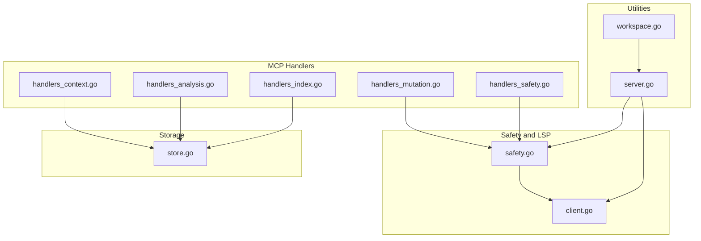
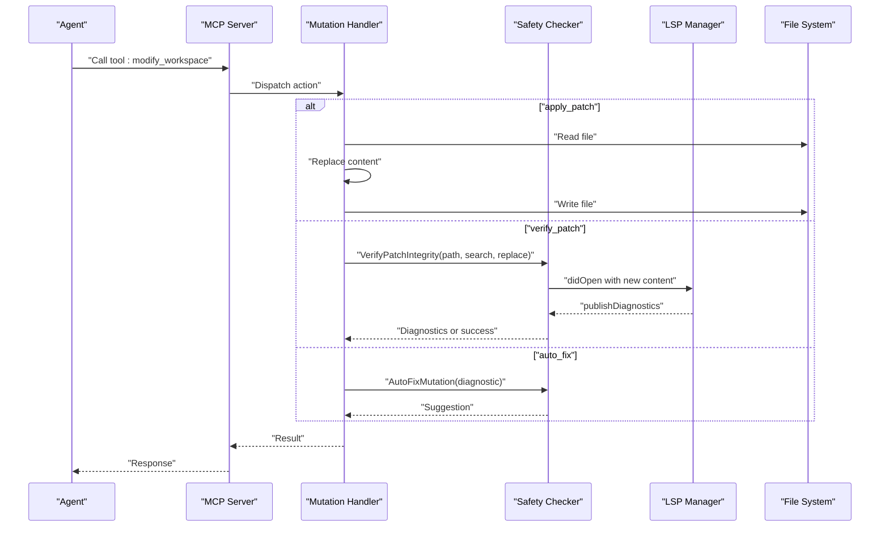
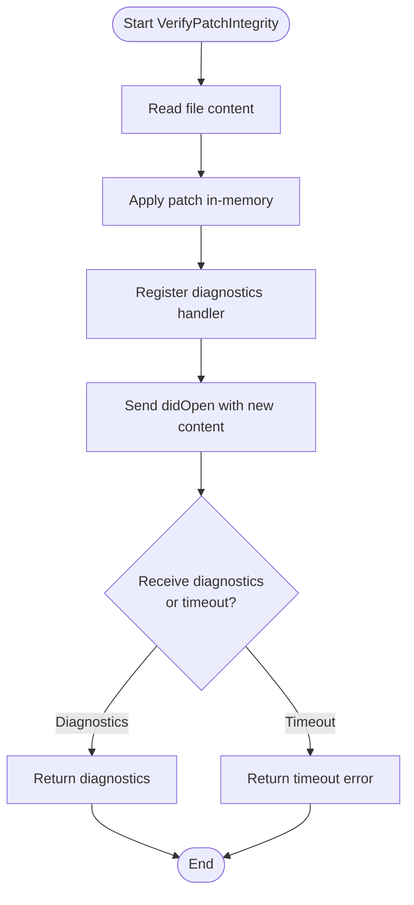
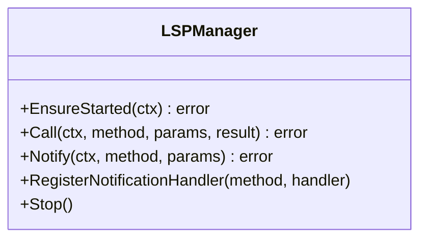
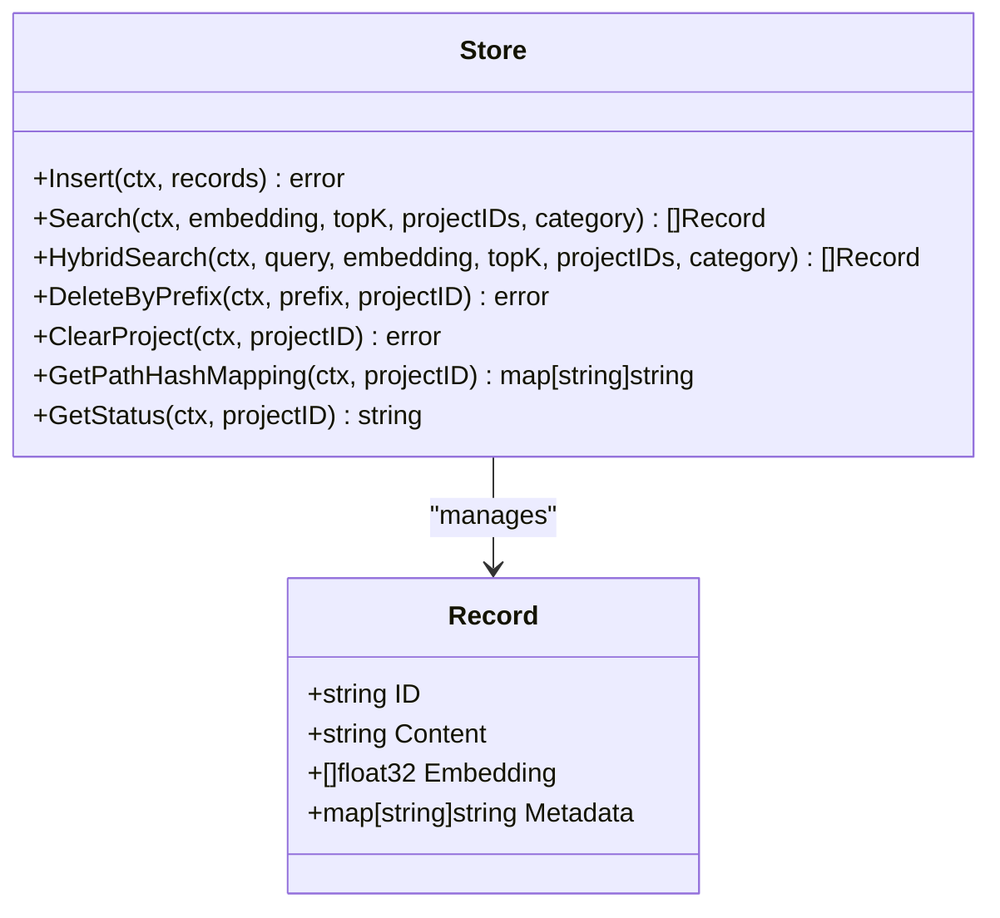
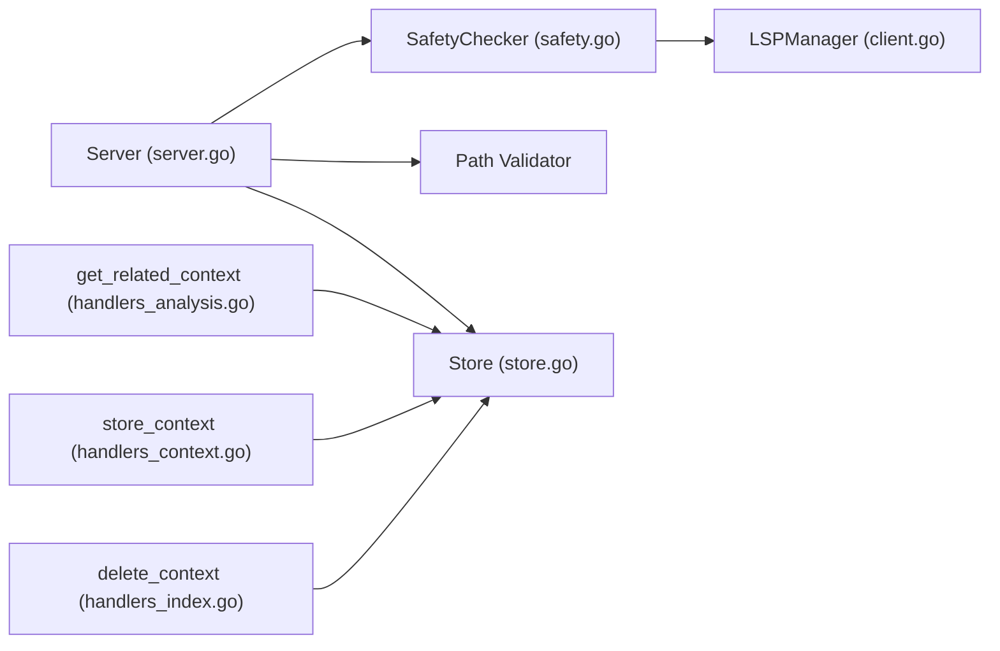

# Mutation and Modification Tools

<cite>
**Referenced Files in This Document**
- [handlers_mutation.go](file://internal/mcp/handlers_mutation.go)
- [handlers_safety.go](file://internal/mcp/handlers_safety.go)
- [safety.go](file://internal/mutation/safety.go)
- [client.go](file://internal/lsp/client.go)
- [handlers_context.go](file://internal/mcp/handlers_context.go)
- [handlers_index.go](file://internal/mcp/handlers_index.go)
- [handlers_analysis.go](file://internal/mcp/handlers_analysis.go)
- [server.go](file://internal/mcp/server.go)
- [workspace.go](file://internal/util/workspace.go)
- [store.go](file://internal/db/store.go)
- [SKILL.md](file://skills/vector-context/SKILL.md)
</cite>

## Table of Contents
1. [Introduction](#introduction)
2. [Project Structure](#project-structure)
3. [Core Components](#core-components)
4. [Architecture Overview](#architecture-overview)
5. [Detailed Component Analysis](#detailed-component-analysis)
6. [Dependency Analysis](#dependency-analysis)
7. [Performance Considerations](#performance-considerations)
8. [Troubleshooting Guide](#troubleshooting-guide)
9. [Conclusion](#conclusion)
10. [Appendices](#appendices)

## Introduction
This document describes the mutation and modification tools that enable safe, context-aware code changes. It covers:
- Workspace mutation tools: modify_workspace, apply_patch, create_file, run_linter, verify_patch, and auto_fix
- Context management tools: store_context, delete_context, and get_related_context
- Safety mechanisms, LSP verification workflows, patch validation, and rollback procedures
- Parameter requirements, error handling, and integration with the safety checker
- Practical examples and best practices for safe code modifications

## Project Structure
The mutation and context management capabilities are implemented across several packages:
- MCP handlers orchestrate tool calls and route them to specialized functions
- Safety checker integrates with the LSP to validate patches before applying changes
- Vector database stores and retrieves shared context and project knowledge
- Utility functions provide workspace root resolution and path validation

**Diagram sources**
- [handlers_mutation.go:1-162](file://internal/mcp/handlers_mutation.go#L1-L162)
- [handlers_safety.go:1-59](file://internal/mcp/handlers_safety.go#L1-L59)
- [safety.go:1-126](file://internal/mutation/safety.go#L1-L126)
- [client.go:1-355](file://internal/lsp/client.go#L1-L355)
- [handlers_context.go:1-65](file://internal/mcp/handlers_context.go#L1-L65)
- [handlers_analysis.go:1-274](file://internal/mcp/handlers_analysis.go#L1-L274)
- [handlers_index.go:1-226](file://internal/mcp/handlers_index.go#L1-L226)
- [server.go:1-200](file://internal/mcp/server.go#L1-L200)
- [workspace.go:1-46](file://internal/util/workspace.go#L1-L46)
- [store.go:1-664](file://internal/db/store.go#L1-L664)

**Section sources**
- [handlers_mutation.go:1-162](file://internal/mcp/handlers_mutation.go#L1-L162)
- [handlers_safety.go:1-59](file://internal/mcp/handlers_safety.go#L1-L59)
- [safety.go:1-126](file://internal/mutation/safety.go#L1-L126)
- [client.go:1-355](file://internal/lsp/client.go#L1-L355)
- [handlers_context.go:1-65](file://internal/mcp/handlers_context.go#L1-L65)
- [handlers_analysis.go:1-274](file://internal/mcp/handlers_analysis.go#L1-L274)
- [handlers_index.go:1-226](file://internal/mcp/handlers_index.go#L1-L226)
- [server.go:1-200](file://internal/mcp/server.go#L1-L200)
- [workspace.go:1-46](file://internal/util/workspace.go#L1-L46)
- [store.go:1-664](file://internal/db/store.go#L1-L664)

## Core Components
- Modify workspace tool: Unified entry point to apply patches, create files, run linters, verify patches, and auto-fix issues.
- Safety checker: Validates patches using LSP diagnostics and provides suggestions for fixes.
- Context storage: Stores and retrieves shared knowledge and architectural decisions.
- Related context retrieval: Builds contextual knowledge around a file, including dependencies and usage samples.
- Index management: Triggers indexing, reports status, and deletes context records.

**Section sources**
- [handlers_mutation.go:101-162](file://internal/mcp/handlers_mutation.go#L101-L162)
- [safety.go:33-126](file://internal/mutation/safety.go#L33-L126)
- [handlers_safety.go:13-59](file://internal/mcp/handlers_safety.go#L13-L59)
- [handlers_context.go:34-65](file://internal/mcp/handlers_context.go#L34-L65)
- [handlers_analysis.go:21-224](file://internal/mcp/handlers_analysis.go#L21-L224)
- [handlers_index.go:16-94](file://internal/mcp/handlers_index.go#L16-L94)

## Architecture Overview
The mutation tools integrate with the safety checker and LSP to ensure changes are validated before being applied. Context tools integrate with the vector database to persist and retrieve shared knowledge.

**Diagram sources**
- [handlers_mutation.go:101-162](file://internal/mcp/handlers_mutation.go#L101-L162)
- [handlers_safety.go:13-59](file://internal/mcp/handlers_safety.go#L13-L59)
- [safety.go:42-114](file://internal/mutation/safety.go#L42-L114)
- [client.go:66-143](file://internal/lsp/client.go#L66-L143)

## Detailed Component Analysis

### Modify Workspace Tool
The modify_workspace tool is a unified “fat tool” that routes to specific mutation actions. Supported actions:
- apply_patch: Applies a search-and-replace patch to a file after validating the path and presence of the search string.
- create_file: Creates a file with provided content after ensuring the directory exists.
- run_linter: Executes a linter tool on a path (currently supports a built-in formatter).
- verify_patch: Validates a proposed patch using LSP diagnostics.
- auto_fix: Generates a human-readable suggestion for fixing a reported diagnostic.

Parameters:
- action: Required. One of apply_patch, create_file, run_linter, verify_patch, auto_fix.
- path: Required for file operations.
- content: Required for create_file.
- search, replace: Required for apply_patch and verify_patch.
- diagnostic_json: Required for auto_fix.
- tool: Required for run_linter.

Error handling:
- Missing required parameters return an error result.
- Path validation prevents unsafe operations outside the allowed workspace.
- Read/write failures and LSP errors are surfaced as errors.

Rollback:
- The current implementation does not implement automatic rollback. For production use, implement a backup mechanism prior to applying changes.

Best practices:
- Always verify patches before applying.
- Use run_linter to normalize code style post-change.
- Store context before making large changes to capture rationale.

**Section sources**
- [handlers_mutation.go:101-162](file://internal/mcp/handlers_mutation.go#L101-L162)
- [handlers_mutation.go:13-45](file://internal/mcp/handlers_mutation.go#L13-L45)
- [handlers_mutation.go:73-99](file://internal/mcp/handlers_mutation.go#L73-L99)
- [handlers_mutation.go:47-71](file://internal/mcp/handlers_mutation.go#L47-L71)

### Safety Checker and LSP Integration
The SafetyChecker validates patches by:
- Loading the file content
- Applying the patch in-memory
- Triggering an LSP didOpen with the modified content
- Waiting for publishDiagnostics notifications
- Returning diagnostics or a timeout/error

Key behaviors:
- Uses a notification handler to capture diagnostics for the specific URI.
- Starts the LSP session if needed and respects memory throttling.
- Times out after a fixed duration to avoid hanging.

Integration:
- The MCP server constructs a SafetyChecker with an LSP provider that resolves sessions per file’s workspace root.

**Diagram sources**
- [safety.go:42-114](file://internal/mutation/safety.go#L42-L114)
- [client.go:208-236](file://internal/lsp/client.go#L208-L236)

**Section sources**
- [safety.go:33-126](file://internal/mutation/safety.go#L33-L126)
- [handlers_safety.go:13-42](file://internal/mcp/handlers_safety.go#L13-L42)
- [server.go:118-122](file://internal/mcp/server.go#L118-L122)

### Context Management Tools
- Store context: Embeds and stores shared knowledge with metadata including project_id and type.
- Delete context: Removes records by path prefix or clears an entire project index; supports a dry-run mode.
- Get related context: Builds a structured context around a file, including dependencies, symbols, resolved imports, and usage samples.

Parameters:
- store_context: text (required), project_id (optional, defaults to project root).
- delete_context: target_path (required), project_id (optional), dry_run (optional).
- get_related_context: filePath (required), max_tokens (optional), cross_reference_projects (optional).

Error handling:
- Missing required parameters return errors.
- Embedding and storage failures are surfaced as errors.
- Index status and diagnostics helpers provide operational insights.

**Section sources**
- [handlers_context.go:34-65](file://internal/mcp/handlers_context.go#L34-L65)
- [handlers_index.go:40-94](file://internal/mcp/handlers_index.go#L40-L94)
- [handlers_analysis.go:21-224](file://internal/mcp/handlers_analysis.go#L21-L224)
- [store.go:66-78](file://internal/db/store.go#L66-L78)

### LSP Lifecycle and Session Management
The LSP subsystem manages language server lifecycles:
- Ensures the server is started and initializes it with capabilities.
- Supports request-response and notification patterns.
- Registers notification handlers for publishDiagnostics.
- Implements TTL-based shutdown and memory throttling.

**Diagram sources**
- [client.go:36-143](file://internal/lsp/client.go#L36-L143)

**Section sources**
- [client.go:66-143](file://internal/lsp/client.go#L66-L143)
- [client.go:208-236](file://internal/lsp/client.go#L208-L236)
- [client.go:329-355](file://internal/lsp/client.go#L329-L355)

### Vector Database Operations
The vector database supports:
- Inserting records with embeddings and metadata
- Searching by vector and lexical similarity
- Hybrid search combining vector and lexical results
- Deleting by path prefix and clearing entire projects
- Status reporting and path hash mapping for index health

**Diagram sources**
- [store.go:19-664](file://internal/db/store.go#L19-L664)

**Section sources**
- [store.go:66-78](file://internal/db/store.go#L66-L78)
- [store.go:338-409](file://internal/db/store.go#L338-L409)
- [store.go:411-444](file://internal/db/store.go#L411-L444)
- [store.go:586-610](file://internal/db/store.go#L586-L610)

## Dependency Analysis
- The MCP server composes the SafetyChecker with an LSP provider that resolves sessions per file’s workspace root.
- Workspace root resolution uses markers to locate project boundaries.
- Mutation handlers depend on path validation to prevent unsafe operations.
- Context tools depend on the vector database for persistence and retrieval.

**Diagram sources**
- [server.go:118-122](file://internal/mcp/server.go#L118-L122)
- [safety.go:33-40](file://internal/mutation/safety.go#L33-L40)
- [client.go:132-159](file://internal/lsp/client.go#L132-L159)
- [workspace.go:9-46](file://internal/util/workspace.go#L9-L46)
- [handlers_analysis.go:32-42](file://internal/mcp/handlers_analysis.go#L32-L42)
- [handlers_context.go:47-63](file://internal/mcp/handlers_context.go#L47-L63)
- [handlers_index.go:55-93](file://internal/mcp/handlers_index.go#L55-L93)

**Section sources**
- [server.go:118-122](file://internal/mcp/server.go#L118-L122)
- [workspace.go:9-46](file://internal/util/workspace.go#L9-L46)
- [handlers_analysis.go:32-42](file://internal/mcp/handlers_analysis.go#L32-L42)
- [handlers_context.go:47-63](file://internal/mcp/handlers_context.go#L47-L63)
- [handlers_index.go:55-93](file://internal/mcp/handlers_index.go#L55-L93)

## Performance Considerations
- LSP startup and initialization cost: The LSP manager lazily starts language servers and shuts them down after inactivity.
- Memory throttling: Prevents starting LSP when system memory pressure is too high.
- Vector search parallelism: Hybrid and lexical searches use parallel workers and chunking to scale with dataset size.
- Token limits: Context retrieval enforces token budgets to keep responses manageable.

[No sources needed since this section provides general guidance]

## Troubleshooting Guide
Common issues and resolutions:
- Invalid path or missing parameters: Ensure required parameters are present and paths are valid.
- LSP not configured for extension: Verify language server mapping for the file type.
- Timeout waiting for diagnostics: Increase tolerance or reduce change scope; check LSP logs.
- Storage failures: Confirm embedding generation and database connectivity.
- Index health: Use index status and diagnostics to identify missing or modified files.

**Section sources**
- [handlers_mutation.go:13-45](file://internal/mcp/handlers_mutation.go#L13-L45)
- [handlers_mutation.go:73-99](file://internal/mcp/handlers_mutation.go#L73-L99)
- [handlers_safety.go:13-42](file://internal/mcp/handlers_safety.go#L13-L42)
- [safety.go:98-113](file://internal/mutation/safety.go#L98-L113)
- [handlers_index.go:96-169](file://internal/mcp/handlers_index.go#L96-L169)

## Conclusion
The mutation and context tools provide a robust foundation for safe, context-aware code modifications. By integrating LSP-based verification, vector-backed context retrieval, and careful path validation, teams can confidently apply changes while preserving code quality and institutional knowledge.

[No sources needed since this section summarizes without analyzing specific files]

## Appendices

### Example Scenarios and Best Practices
- Before editing a file, retrieve related context to understand dependencies and usage.
- Use verify_patch to detect regressions prior to applying changes.
- After applying a patch, run the linter to normalize style.
- Store architectural decisions and rationale in shared context for future maintainers.
- For risky changes, stage with dry-run deletions and incremental verification.

**Section sources**
- [handlers_analysis.go:21-224](file://internal/mcp/handlers_analysis.go#L21-L224)
- [handlers_safety.go:13-42](file://internal/mcp/handlers_safety.go#L13-L42)
- [handlers_context.go:34-65](file://internal/mcp/handlers_context.go#L34-L65)
- [SKILL.md:18-39](file://skills/vector-context/SKILL.md#L18-L39)