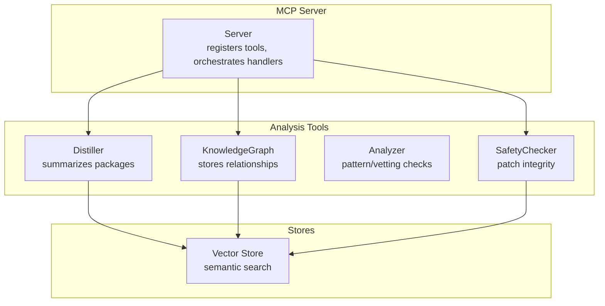
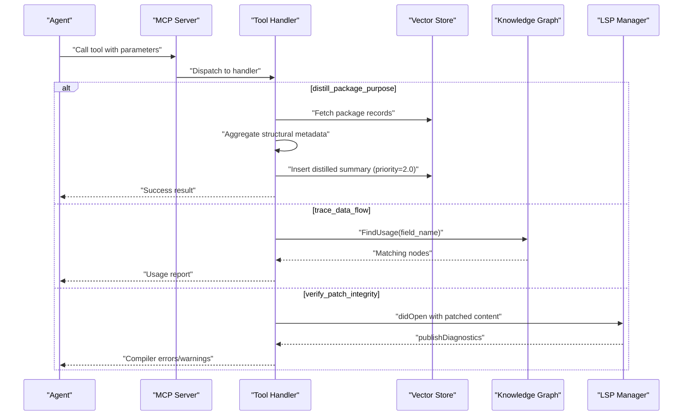
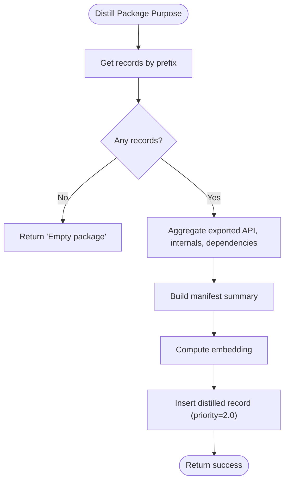
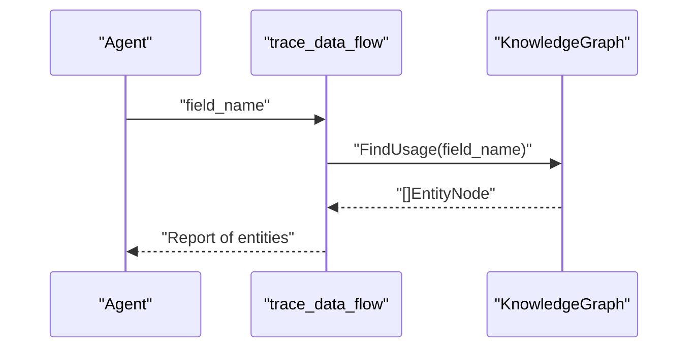
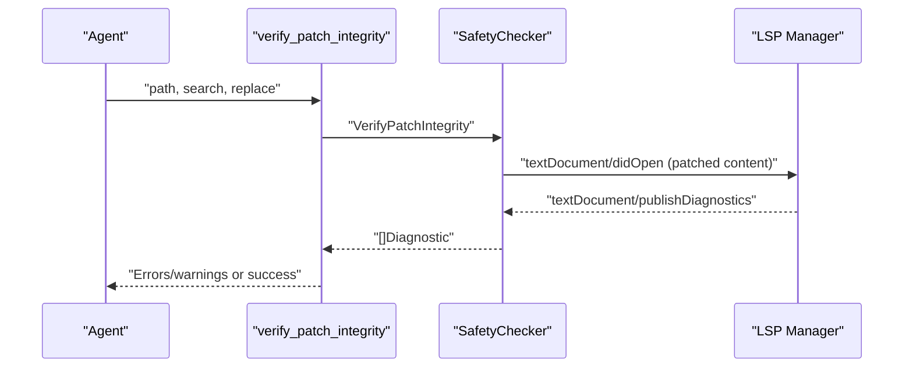
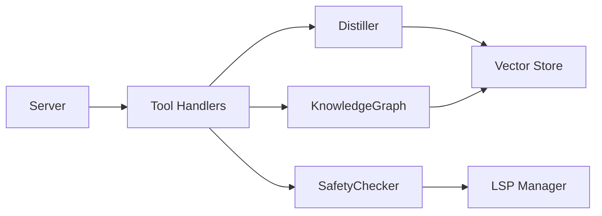

# Utility and Analysis Tools

<cite>
**Referenced Files in This Document**
- [README.md](file://README.md)
- [server.go](file://internal/mcp/server.go)
- [handlers_distill.go](file://internal/mcp/handlers_distill.go)
- [handlers_analysis.go](file://internal/mcp/handlers_analysis.go)
- [handlers_analysis_extended.go](file://internal/mcp/handlers_analysis_extended.go)
- [handlers_graph.go](file://internal/mcp/handlers_graph.go)
- [handlers_safety.go](file://internal/mcp/handlers_safety.go)
- [distiller.go](file://internal/analysis/distiller.go)
- [analyzer.go](file://internal/analysis/analyzer.go)
- [safety.go](file://internal/mutation/safety.go)
- [graph.go](file://internal/db/graph.go)
- [guardrails.go](file://internal/util/guardrails.go)
</cite>

## Table of Contents
1. [Introduction](#introduction)
2. [Project Structure](#project-structure)
3. [Core Components](#core-components)
4. [Architecture Overview](#architecture-overview)
5. [Detailed Component Analysis](#detailed-component-analysis)
6. [Dependency Analysis](#dependency-analysis)
7. [Performance Considerations](#performance-considerations)
8. [Troubleshooting Guide](#troubleshooting-guide)
9. [Conclusion](#conclusion)
10. [Appendices](#appendices)

## Introduction
This document focuses on the utility and specialized analysis tools that power semantic summarization, data flow tracing, and safety validation within the system. It covers:
- Package purpose summarization via distillation
- Data flow tracing across symbol usage
- Safety checking mechanisms for mutations and patches
- Parameter specifications, use cases, integration patterns, and performance considerations
- Knowledge graph utilization, relationship mapping, and advanced analysis workflows
- Examples of complex analysis scenarios and guidance for interpreting results

The project follows a “Fat Tool” pattern, exposing consolidated tools that reduce fragmentation and improve deterministic, privacy-preserving operations.

**Section sources**
- [README.md:1-40](file://README.md#L1-L40)

## Project Structure
The analysis tools are implemented as MCP server tools backed by dedicated modules:
- MCP tool handlers orchestrate requests and coordinate with internal services
- Distiller performs package-level summarization and persistence
- Knowledge Graph maintains structural relationships for tracing and reasoning
- Safety Checker validates mutations and patches using LSP diagnostics
- Utilities provide guardrails for safe parameter handling

**Diagram sources**
- [server.go:67-86](file://internal/mcp/server.go#L67-L86)
- [distiller.go:22-36](file://internal/analysis/distiller.go#L22-L36)
- [graph.go:18-33](file://internal/db/graph.go#L18-L33)
- [safety.go:33-40](file://internal/mutation/safety.go#L33-L40)

**Section sources**
- [server.go:334-418](file://internal/mcp/server.go#L334-L418)

## Core Components
- distill_package_purpose: Summarizes a package’s purpose and key entities, storing a high-priority distilled record for semantic retrieval
- trace_data_flow: Traces usage of a field or symbol across the codebase using the knowledge graph
- Safety tools: Verify patch integrity via LSP and auto-suggest fixes for diagnostics

Key integration points:
- Server orchestrates tool registration and delegates to handlers
- Handlers resolve stores, embedders, and graph for analysis
- Knowledge Graph is populated from stored records for relationship mapping

**Section sources**
- [server.go:408-417](file://internal/mcp/server.go#L408-L417)
- [handlers_distill.go:11-31](file://internal/mcp/handlers_distill.go#L11-L31)
- [handlers_graph.go:33-56](file://internal/mcp/handlers_graph.go#L33-L56)
- [handlers_safety.go:13-58](file://internal/mcp/handlers_safety.go#L13-L58)

## Architecture Overview
The tools integrate with the MCP server and leverage:
- Vector store for semantic search and retrieval
- Knowledge Graph for structural relationships and tracing
- LSP for precise symbol analysis and diagnostics
- Embedding engine for semantic operations

**Diagram sources**
- [server.go:408-417](file://internal/mcp/server.go#L408-L417)
- [handlers_distill.go:13-30](file://internal/mcp/handlers_distill.go#L13-L30)
- [handlers_graph.go:33-56](file://internal/mcp/handlers_graph.go#L33-L56)
- [handlers_safety.go:14-41](file://internal/mcp/handlers_safety.go#L14-L41)
- [graph.go:121-133](file://internal/db/graph.go#L121-L133)
- [safety.go:42-114](file://internal/mutation/safety.go#L42-L114)

## Detailed Component Analysis

### Package Purpose Distillation (distill_package_purpose)
Purpose:
- Generate a high-level semantic summary of a package’s exported API, internal components, and dependencies
- Persist the summary with a high priority multiplier for retrieval

Inputs:
- path: Relative or absolute path to the package directory

Processing logic:
- Fetch records under the package prefix
- Aggregate exported vs internal entities and dependencies
- Build a structured manifest-style summary
- Compute embedding and insert a distilled record with category=distilled and priority=2.0

Outputs:
- Text result indicating success and the generated summary
- Persisted record in the vector store for semantic retrieval

**Diagram sources**
- [distiller.go:40-190](file://internal/analysis/distiller.go#L40-L190)

**Section sources**
- [handlers_distill.go:11-31](file://internal/mcp/handlers_distill.go#L11-L31)
- [distiller.go:22-36](file://internal/analysis/distiller.go#L22-L36)
- [distiller.go:38-190](file://internal/analysis/distiller.go#L38-L190)

### Data Flow Tracing (trace_data_flow)
Purpose:
- Trace usage of a specific field or symbol across the codebase using the knowledge graph

Inputs:
- field_name: The symbol or field to trace

Processing logic:
- Query the knowledge graph for nodes that use the specified field
- Return a list of entities with their types and paths
- Optionally include docstrings if present

Outputs:
- Text result enumerating entities using the symbol

**Diagram sources**
- [handlers_graph.go:33-56](file://internal/mcp/handlers_graph.go#L33-L56)
- [graph.go:121-133](file://internal/db/graph.go#L121-L133)

**Section sources**
- [handlers_graph.go:33-56](file://internal/mcp/handlers_graph.go#L33-L56)
- [graph.go:18-33](file://internal/db/graph.go#L18-L33)
- [graph.go:121-133](file://internal/db/graph.go#L121-L133)

### Safety Checking Mechanisms
Two complementary safety tools ensure mutation integrity and provide actionable fixes:

1) Patch Integrity Verification (handleVerifyPatchIntegrity)
- Validates whether a proposed search-and-replace patch introduces compiler errors
- Uses LSP to publish diagnostics for the patched content

2) Auto-Fix Mutation (handleAutoFixMutation)
- Interprets a diagnostic and returns a human-readable suggestion for remediation

**Diagram sources**
- [handlers_safety.go:14-41](file://internal/mcp/handlers_safety.go#L14-L41)
- [safety.go:42-114](file://internal/mutation/safety.go#L42-L114)

**Section sources**
- [handlers_safety.go:13-58](file://internal/mcp/handlers_safety.go#L13-L58)
- [safety.go:33-126](file://internal/mutation/safety.go#L33-L126)

### Advanced Analysis Workflows
Beyond the core tools, the server exposes additional analysis capabilities that complement summarization and tracing:

- Related context retrieval: Gathers semantically related code chunks, dependencies, and usage samples for a file
- Duplicate code detection: Scans for semantically similar code blocks across the codebase
- Dependency health check: Validates imports against manifests (package.json, go.mod, requirements.txt)
- Architecture analysis: Generates a Mermaid graph of package dependencies
- Dead code identification: Finds potentially unused exported symbols
- Impact analysis: Uses LSP to compute the blast radius of a symbol change

These workflows rely on:
- Vector store for semantic search and lexical matching
- Knowledge Graph for structural relationships
- LSP for precise symbol analysis

**Section sources**
- [handlers_analysis.go:21-224](file://internal/mcp/handlers_analysis.go#L21-L224)
- [handlers_analysis.go:226-311](file://internal/mcp/handlers_analysis.go#L226-L311)
- [handlers_analysis.go:313-472](file://internal/mcp/handlers_analysis.go#L313-L472)
- [handlers_analysis.go:557-634](file://internal/mcp/handlers_analysis.go#L557-L634)
- [handlers_analysis.go:636-777](file://internal/mcp/handlers_analysis.go#L636-L777)
- [handlers_analysis_extended.go:12-82](file://internal/mcp/handlers_analysis_extended.go#L12-L82)

## Dependency Analysis
The tools share common dependencies and integration points:

**Diagram sources**
- [server.go:67-86](file://internal/mcp/server.go#L67-L86)
- [handlers_distill.go:13-30](file://internal/mcp/handlers_distill.go#L13-L30)
- [handlers_graph.go:33-56](file://internal/mcp/handlers_graph.go#L33-L56)
- [handlers_safety.go:14-41](file://internal/mcp/handlers_safety.go#L14-L41)
- [graph.go:18-33](file://internal/db/graph.go#L18-L33)
- [safety.go:33-40](file://internal/mutation/safety.go#L33-L40)

**Section sources**
- [server.go:169-193](file://internal/mcp/server.go#L169-L193)
- [server.go:334-418](file://internal/mcp/server.go#L334-L418)

## Performance Considerations
- Distillation
  - Priority multiplier: Distilled summaries are inserted with priority=2.0 to boost recall during semantic retrieval
  - Embedding cost: Computing embeddings for summaries adds latency; batch operations are recommended when re-indexing packages
- Data flow tracing
  - Knowledge Graph lookups are O(N) over nodes; ensure the graph is populated from the full dataset
  - Field name matching is a metadata scan; keep metadata compact and consistent
- Safety verification
  - LSP diagnostics are asynchronous; a timeout is enforced to prevent blocking
  - Patch application is in-memory; ensure the search term is present to avoid unnecessary computation
- Related context retrieval
  - Token budgeting: The handler estimates tokens per chunk and stops when exceeding the max_tokens limit
  - Cross-project filtering: Use project IDs to constrain scope and reduce search overhead
- Duplicate code detection
  - Parallelism: Uses a semaphore to cap concurrent searches; tune based on available CPU and memory
  - Embedding reuse: Reuse computed embeddings when available to avoid recomputation

[No sources needed since this section provides general guidance]

## Troubleshooting Guide
Common issues and resolutions:
- Missing or empty package summary
  - Ensure the package path exists and contains indexed records
  - Confirm the vector store is populated and reachable
- No usage found for a symbol
  - Verify the symbol name is correct and present in metadata
  - Check that the knowledge graph was populated from the full dataset
- Patch verification timeouts
  - Increase LSP startup or diagnostic wait time if needed
  - Confirm the LSP session is started for the correct workspace root
- Excessive token usage in related context
  - Reduce max_tokens or narrow the scope with cross-reference projects
- Dependency health false positives
  - Review manifest parsing logic for the project type (npm, go, python)
  - Exclude local or monorepo prefixes appropriately

**Section sources**
- [handlers_distill.go:13-30](file://internal/mcp/handlers_distill.go#L13-L30)
- [handlers_graph.go:33-56](file://internal/mcp/handlers_graph.go#L33-L56)
- [handlers_safety.go:14-41](file://internal/mcp/handlers_safety.go#L14-L41)
- [handlers_analysis.go:21-224](file://internal/mcp/handlers_analysis.go#L21-L224)

## Conclusion
The utility and analysis tools provide a cohesive toolkit for summarizing packages, tracing data flow, and validating mutations. They integrate tightly with the vector store, knowledge graph, and LSP to deliver deterministic, privacy-preserving insights. By leveraging these tools, agents can perform advanced codebase exploration, safety-aware refactoring, and architectural reasoning with confidence.

[No sources needed since this section summarizes without analyzing specific files]

## Appendices

### Parameter Specifications and Use Cases

- distill_package_purpose
  - path: Package directory path (required)
  - Use cases: On-demand summarization, re-indexing updates, retrieval prioritization
  - Integration: Called via MCP tool; returns a success message and persisted summary

- trace_data_flow
  - field_name: Symbol or field name to trace (required)
  - Use cases: Understanding cross-file dependencies, identifying consumers of a field
  - Integration: Queries the knowledge graph; returns a list of entities

- verify_patch_integrity
  - path: Target file path (required)
  - search: Exact text to replace (required)
  - replace: Replacement text
  - Use cases: Safe refactoring, automated patch validation
  - Integration: Uses LSP diagnostics; returns errors/warnings or success

- auto_fix_mutation
  - diagnostic_json: Serialized diagnostic object (required)
  - Use cases: Human-readable suggestions for fixing issues
  - Integration: Parses diagnostic and returns a suggested action

**Section sources**
- [server.go:408-417](file://internal/mcp/server.go#L408-L417)
- [handlers_distill.go:14-17](file://internal/mcp/handlers_distill.go#L14-L17)
- [handlers_graph.go:38-41](file://internal/mcp/handlers_graph.go#L38-L41)
- [handlers_safety.go:15-21](file://internal/mcp/handlers_safety.go#L15-L21)
- [handlers_safety.go:46-54](file://internal/mcp/handlers_safety.go#L46-L54)

### Knowledge Graph Utilization and Relationship Mapping
- Population: The graph is built from all records in the store, capturing nodes, edges, and implementations
- Queries:
  - GetImplementations(interfaceName): Lists struct implementations
  - FindUsage(fieldName): Finds entities using a field
  - SearchByName(name): Searches entities by name
- Integration: Used by trace_data_flow and architecture analysis to reason about structural relationships

**Section sources**
- [server.go:176-193](file://internal/mcp/server.go#L176-L193)
- [graph.go:35-105](file://internal/db/graph.go#L35-L105)
- [graph.go:107-154](file://internal/db/graph.go#L107-L154)

### Advanced Analysis Scenarios and Interpretation Guidance
- Complex analysis scenario: Combine distill_package_purpose with trace_data_flow
  - Steps:
    1) Distill a package to capture its purpose and exported API
    2) Use trace_data_flow to find all entities consuming a specific field
    3) Cross-reference with architecture analysis to understand dependency flow
  - Interpretation: If a field is widely used, consider backward compatibility when changing its semantics
- Safety-first refactoring:
  - Steps:
    1) Use verify_patch_integrity to validate a proposed change
    2) If diagnostics are found, use auto_fix_mutation for guidance
    3) Iterate until no diagnostics remain
  - Interpretation: Compiler errors indicate type mismatches or missing imports; warnings often suggest style or potential issues

**Section sources**
- [handlers_distill.go:13-30](file://internal/mcp/handlers_distill.go#L13-L30)
- [handlers_graph.go:33-56](file://internal/mcp/handlers_graph.go#L33-L56)
- [handlers_analysis.go:557-634](file://internal/mcp/handlers_analysis.go#L557-L634)
- [handlers_safety.go:14-41](file://internal/mcp/handlers_safety.go#L14-L41)
- [handlers_safety.go:44-58](file://internal/mcp/handlers_safety.go#L44-L58)

### Guardrails and Parameter Validation
Utilities provide safe parameter handling:
- ClampInt, ClampInt64, ClampFloat64: Bound values to a safe range
- TruncateRuneSafe: Safely truncate strings preserving UTF-8 integrity

These utilities are used across handlers to sanitize inputs (e.g., max_tokens, line/character positions).

**Section sources**
- [guardrails.go:3-61](file://internal/util/guardrails.go#L3-L61)
- [handlers_analysis.go:23-31](file://internal/mcp/handlers_analysis.go#L23-L31)
- [handlers_analysis_extended.go:14-17](file://internal/mcp/handlers_analysis_extended.go#L14-L17)