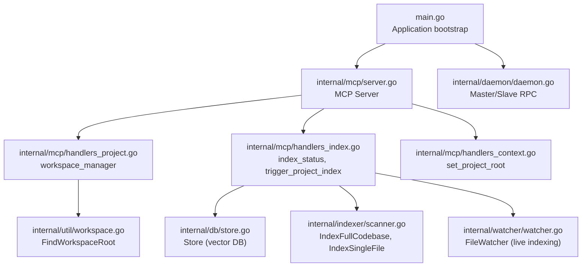
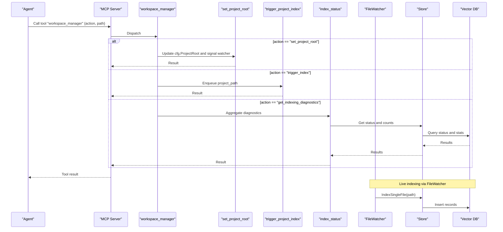
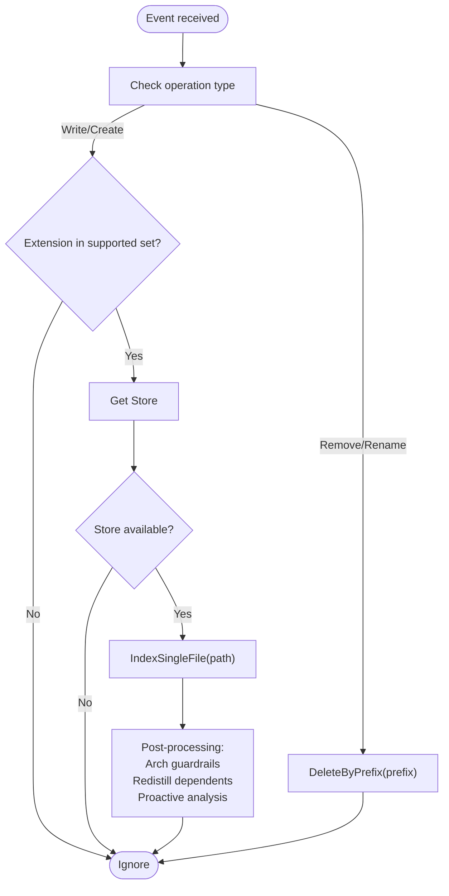
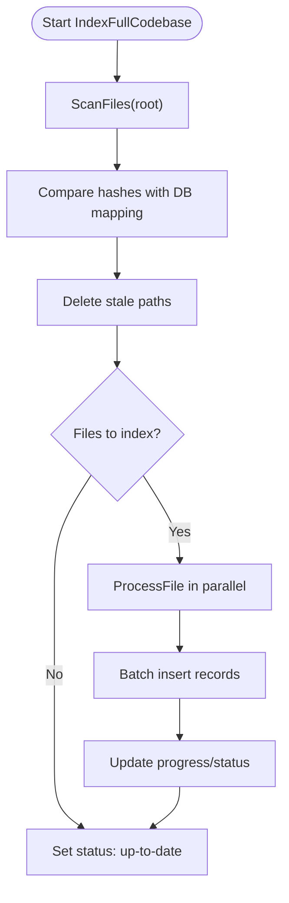
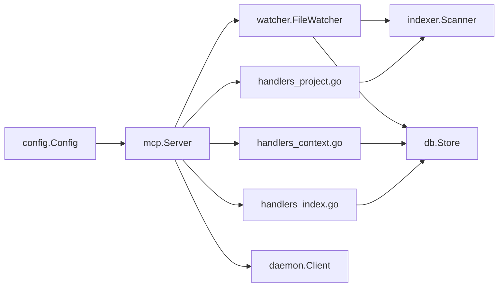

# Workspace Management Tools

<cite>
**Referenced Files in This Document**
- [main.go](file://main.go)
- [server.go](file://internal/mcp/server.go)
- [handlers_project.go](file://internal/mcp/handlers_project.go)
- [handlers_index.go](file://internal/mcp/handlers_index.go)
- [handlers_context.go](file://internal/mcp/handlers_context.go)
- [workspace.go](file://internal/util/workspace.go)
- [watcher.go](file://internal/watcher/watcher.go)
- [scanner.go](file://internal/indexer/scanner.go)
- [chunker.go](file://internal/indexer/chunker.go)
- [store.go](file://internal/db/store.go)
- [config.go](file://internal/config/config.go)
- [daemon.go](file://internal/daemon/daemon.go)
- [README.md](file://README.md)
</cite>

## Table of Contents
1. [Introduction](#introduction)
2. [Project Structure](#project-structure)
3. [Core Components](#core-components)
4. [Architecture Overview](#architecture-overview)
5. [Detailed Component Analysis](#detailed-component-analysis)
6. [Dependency Analysis](#dependency-analysis)
7. [Performance Considerations](#performance-considerations)
8. [Troubleshooting Guide](#troubleshooting-guide)
9. [Conclusion](#conclusion)
10. [Appendices](#appendices)

## Introduction
This document explains the workspace management tools focused on workspace_manager and index_status. It covers how to set project roots, trigger specialized indexing runs, retrieve system diagnostics, monitor indexing progress, and integrate with file watcher events. It also provides parameter specifications, state management, error scenarios, and practical workflows for common tasks.

## Project Structure
The workspace management features are implemented as MCP tools and integrated with the indexing pipeline and file watcher subsystems. The main entry point initializes the application, detects master/slave roles, and wires up the MCP server, file watcher, and indexing workers.

**Diagram sources**
- [main.go:280-317](file://main.go#L280-L317)
- [server.go:334-418](file://internal/mcp/server.go#L334-L418)
- [handlers_project.go:134-161](file://internal/mcp/handlers_project.go#L134-L161)
- [handlers_index.go:96-169](file://internal/mcp/handlers_index.go#L96-L169)
- [handlers_context.go:14-31](file://internal/mcp/handlers_context.go#L14-L31)
- [workspace.go:9-45](file://internal/util/workspace.go#L9-L45)
- [store.go:19-664](file://internal/db/store.go#L19-L664)
- [scanner.go:67-191](file://internal/indexer/scanner.go#L67-L191)
- [watcher.go:22-86](file://internal/watcher/watcher.go#L22-L86)
- [daemon.go:333-437](file://internal/daemon/daemon.go#L333-L437)

**Section sources**
- [README.md:1-40](file://README.md#L1-L40)
- [main.go:280-317](file://main.go#L280-L317)
- [server.go:334-418](file://internal/mcp/server.go#L334-L418)

## Core Components
- workspace_manager: Unified tool for project root management, triggering indexing, and retrieving diagnostics.
- index_status: Reports current indexing progress and background tasks.
- FileWatcher: Monitors file system events and triggers live indexing and related operations.
- Indexer: Scans, hashes, chunks, embeds, and inserts records into the vector store.
- Store: Persistent storage for embeddings, metadata, and status.
- Config: Runtime configuration including project root, DB path, and feature toggles.

**Section sources**
- [server.go:351-356](file://internal/mcp/server.go#L351-L356)
- [handlers_index.go:96-127](file://internal/mcp/handlers_index.go#L96-L127)
- [watcher.go:22-86](file://internal/watcher/watcher.go#L22-L86)
- [scanner.go:67-191](file://internal/indexer/scanner.go#L67-L191)
- [store.go:586-631](file://internal/db/store.go#L586-L631)
- [config.go:13-28](file://internal/config/config.go#L13-L28)

## Architecture Overview
The MCP server exposes workspace_manager and index_status as tools. workspace_manager dispatches to set_project_root, trigger_project_index, and get_indexing_diagnostics. Live indexing is handled by FileWatcher, which triggers IndexSingleFile for changed files and coordinates with the database via Store. Background indexing tasks are queued and tracked via a progress map and the master daemon.

**Diagram sources**
- [server.go:351-356](file://internal/mcp/server.go#L351-L356)
- [handlers_project.go:134-161](file://internal/mcp/handlers_project.go#L134-L161)
- [handlers_context.go:14-31](file://internal/mcp/handlers_context.go#L14-L31)
- [handlers_index.go:16-38](file://internal/mcp/handlers_index.go#L16-L38)
- [handlers_index.go:96-169](file://internal/mcp/handlers_index.go#L96-L169)
- [watcher.go:141-196](file://internal/watcher/watcher.go#L141-L196)
- [store.go:66-78](file://internal/db/store.go#L66-L78)

## Detailed Component Analysis

### workspace_manager
- Purpose: Centralized project lifecycle and indexing control.
- Actions:
  - set_project_root: Updates active project root and resets file watcher.
  - trigger_index: Starts background indexing for a project path.
  - get_indexing_diagnostics: Returns health and progress diagnostics.
- Parameters:
  - action: One of "set_project_root", "trigger_index", "get_indexing_diagnostics".
  - path: Target path for the action (required for set_project_root and trigger_index).
- Behavior:
  - Delegates to dedicated handlers based on action.
  - Uses configuration and progress map for state reporting.
- Error handling:
  - Validates presence of required parameters.
  - Returns descriptive errors for invalid paths or missing prerequisites.

**Section sources**
- [server.go:351-356](file://internal/mcp/server.go#L351-L356)
- [handlers_project.go:134-161](file://internal/mcp/handlers_project.go#L134-L161)
- [handlers_context.go:14-31](file://internal/mcp/handlers_context.go#L14-L31)
- [handlers_index.go:16-38](file://internal/mcp/handlers_index.go#L16-L38)

### index_status
- Purpose: Polling-friendly status of indexing progress and background tasks.
- Output:
  - Current indexing status string.
  - List of active background tasks with their progress.
- Integration:
  - Reads progress map for master instances.
  - Delegates to master daemon for slave instances.
- Use cases:
  - Readiness checks.
  - Loop termination conditions in automation.

**Section sources**
- [server.go:385-386](file://internal/mcp/server.go#L385-L386)
- [handlers_index.go:96-127](file://internal/mcp/handlers_index.go#L96-L127)
- [daemon.go:425-437](file://internal/daemon/daemon.go#L425-L437)

### FileWatcher and Live Indexing
- Responsibilities:
  - Watches file system events with debouncing.
  - Triggers IndexSingleFile for supported extensions.
  - Removes stale records on deletion/rename.
  - Performs proactive analysis and architectural guardrails.
- Event handling:
  - On write/create: IndexSingleFile and optional analysis.
  - On remove/rename: DeleteByPrefix for affected paths.
- State management:
  - Tracks current root and recursively adds/removes watches.
  - Resets watchers on project root changes.

**Diagram sources**
- [watcher.go:141-196](file://internal/watcher/watcher.go#L141-L196)
- [watcher.go:102-119](file://internal/watcher/watcher.go#L102-L119)
- [store.go:411-439](file://internal/db/store.go#L411-L439)

**Section sources**
- [watcher.go:22-86](file://internal/watcher/watcher.go#L22-L86)
- [watcher.go:102-119](file://internal/watcher/watcher.go#L102-L119)
- [watcher.go:141-196](file://internal/watcher/watcher.go#L141-L196)
- [store.go:411-439](file://internal/db/store.go#L411-L439)

### Indexer Pipeline
- Full indexing:
  - Scans files, computes hashes, compares with DB mapping.
  - Cleans stale records, batches and inserts new records atomically.
  - Updates progress in real-time and stores status.
- Single file indexing:
  - Computes hash, processes file, deletes old chunks, inserts new records.
- Chunking:
  - Uses Tree-sitter for language-specific AST-based chunks.
  - Falls back to fast chunking for unsupported languages.
  - Builds contextual strings and metadata for embeddings.

**Diagram sources**
- [scanner.go:67-191](file://internal/indexer/scanner.go#L67-L191)
- [scanner.go:193-355](file://internal/indexer/scanner.go#L193-L355)
- [chunker.go:43-101](file://internal/indexer/chunker.go#L43-L101)

**Section sources**
- [scanner.go:67-191](file://internal/indexer/scanner.go#L67-L191)
- [scanner.go:193-355](file://internal/indexer/scanner.go#L193-L355)
- [chunker.go:43-101](file://internal/indexer/chunker.go#L43-L101)

### Diagnostics and Health Checks
- Index status comparison:
  - Disk vs DB mapping to compute indexed, updated, missing, deleted.
- Global statistics:
  - Total chunks indexed.
- Troubleshooting hints:
  - Check master logs if indexing appears stuck.
  - Ensure file watcher is enabled for real-time updates.

**Section sources**
- [handlers_index.go:171-225](file://internal/mcp/handlers_index.go#L171-L225)
- [handlers_index.go:129-169](file://internal/mcp/handlers_index.go#L129-L169)
- [store.go:446-469](file://internal/db/store.go#L446-L469)

## Dependency Analysis
- MCP Server depends on:
  - Config for runtime settings.
  - Store for vector operations and status.
  - Indexer for scanning and embedding.
  - FileWatcher for live indexing.
  - Daemon client for master-slave coordination.
- Handlers depend on:
  - Server’s configuration and store getter.
  - Indexer options and progress map.
- FileWatcher depends on:
  - Store getter, embedder, analyzer, and distiller.
  - Indexer helpers for single-file indexing.

**Diagram sources**
- [config.go:13-28](file://internal/config/config.go#L13-L28)
- [server.go:67-86](file://internal/mcp/server.go#L67-L86)
- [handlers_project.go:134-161](file://internal/mcp/handlers_project.go#L134-L161)
- [handlers_index.go:16-38](file://internal/mcp/handlers_index.go#L16-L38)
- [handlers_context.go:14-31](file://internal/mcp/handlers_context.go#L14-L31)
- [watcher.go:22-56](file://internal/watcher/watcher.go#L22-L56)
- [daemon.go:401-437](file://internal/daemon/daemon.go#L401-L437)

**Section sources**
- [server.go:67-86](file://internal/mcp/server.go#L67-L86)
- [handlers_project.go:134-161](file://internal/mcp/handlers_project.go#L134-L161)
- [handlers_index.go:16-38](file://internal/mcp/handlers_index.go#L16-L38)
- [handlers_context.go:14-31](file://internal/mcp/handlers_context.go#L14-L31)
- [watcher.go:22-56](file://internal/watcher/watcher.go#L22-L56)
- [daemon.go:401-437](file://internal/daemon/daemon.go#L401-L437)

## Performance Considerations
- Parallelization:
  - Full indexing uses worker goroutines proportional to CPU count.
  - Batch embedding with fallback to sequential on failure.
- Debouncing:
  - 500 ms debounce reduces redundant indexing during bursts.
- Incremental updates:
  - Hash comparison avoids re-indexing unchanged files.
- Memory throttling:
  - Memory throttler prevents resource exhaustion during large operations.

[No sources needed since this section provides general guidance]

## Troubleshooting Guide
Common issues and resolutions:
- Indexing appears stuck:
  - Verify master daemon logs for errors.
  - Confirm background worker is running and progress map is updating.
- Real-time updates missing:
  - Ensure file watcher is enabled and not disabled by configuration.
  - Check that supported extensions are being monitored.
- Dimension mismatch after model change:
  - Delete the vector database directory and restart to rebuild indices.
- Diagnostics show stale paths:
  - Run a full indexing to reconcile disk and DB mappings.

**Section sources**
- [handlers_index.go:129-169](file://internal/mcp/handlers_index.go#L129-L169)
- [store.go:51-64](file://internal/db/store.go#L51-L64)
- [watcher.go:121-139](file://internal/watcher/watcher.go#L121-L139)

## Conclusion
workspace_manager and index_status provide a cohesive interface for workspace lifecycle management and indexing observability. Combined with FileWatcher and the indexer pipeline, they deliver robust, incremental, and observable codebase indexing suitable for agent-driven workflows.

[No sources needed since this section summarizes without analyzing specific files]

## Appendices

### Parameter Specifications

- workspace_manager
  - action: String. Allowed values: "set_project_root", "trigger_index", "get_indexing_diagnostics".
  - path: String. Absolute or relative path depending on action.

- trigger_project_index
  - project_path: String. Absolute path to the project root.

- index_status
  - No parameters required.

- set_project_root
  - project_path: String. Absolute path to the new project root.

**Section sources**
- [server.go:351-356](file://internal/mcp/server.go#L351-L356)
- [handlers_index.go:16-38](file://internal/mcp/handlers_index.go#L16-L38)
- [handlers_context.go:14-31](file://internal/mcp/handlers_context.go#L14-L31)

### State Management
- Project root:
  - Updated in configuration and propagated to watchers.
- Progress tracking:
  - Real-time progress stored in a thread-safe map and DB status.
- Status reporting:
  - DB stores project status records for retrieval by diagnostics.

**Section sources**
- [handlers_context.go:24-31](file://internal/mcp/handlers_context.go#L24-L31)
- [scanner.go:177-184](file://internal/indexer/scanner.go#L177-L184)
- [store.go:586-610](file://internal/db/store.go#L586-L610)

### Integration with File Watcher Events
- Supported extensions: .go, .ts, .tsx, .js, .jsx, .md.
- Operations:
  - Write/Create: IndexSingleFile, optional analysis, guardrails, redistillation.
  - Remove/Rename: DeleteByPrefix for affected paths.

**Section sources**
- [watcher.go:141-196](file://internal/watcher/watcher.go#L141-L196)
- [store.go:416-439](file://internal/db/store.go#L416-L439)

### Common Workflows

- Switch project root and refresh watcher
  - Call workspace_manager with action "set_project_root" and provide path.
  - The server updates cfg.ProjectRoot and signals the watcher to reset.

- Trigger a full re-index
  - Call workspace_manager with action "trigger_index" and provide project_path.
  - The server enqueues the path and returns immediately.

- Monitor indexing progress
  - Poll index_status to check current progress and active tasks.
  - For slaves, progress is fetched from the master daemon.

- Retrieve diagnostics
  - Call workspace_manager with action "get_indexing_diagnostics".
  - Review active tasks, DB statistics, and troubleshooting tips.

**Section sources**
- [handlers_project.go:134-161](file://internal/mcp/handlers_project.go#L134-L161)
- [handlers_index.go:96-127](file://internal/mcp/handlers_index.go#L96-L127)
- [handlers_index.go:129-169](file://internal/mcp/handlers_index.go#L129-L169)