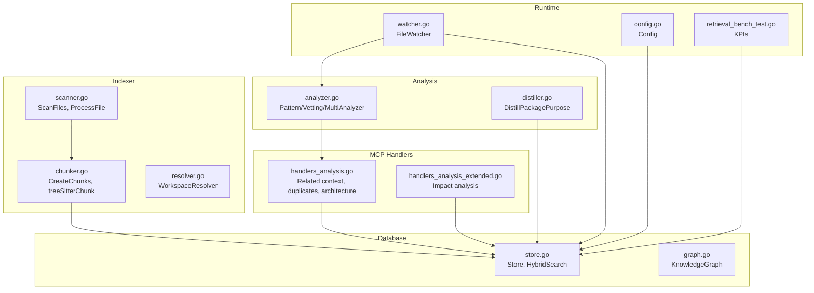
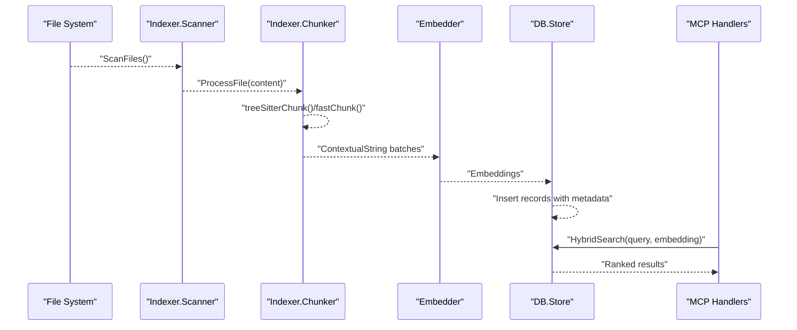
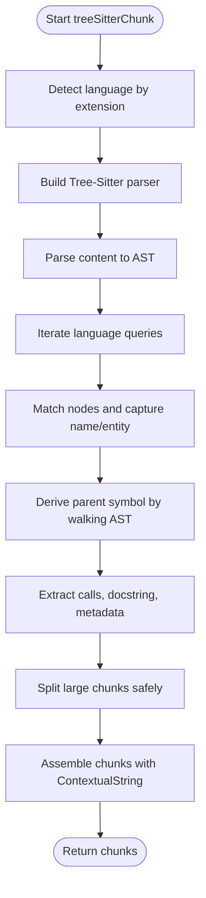
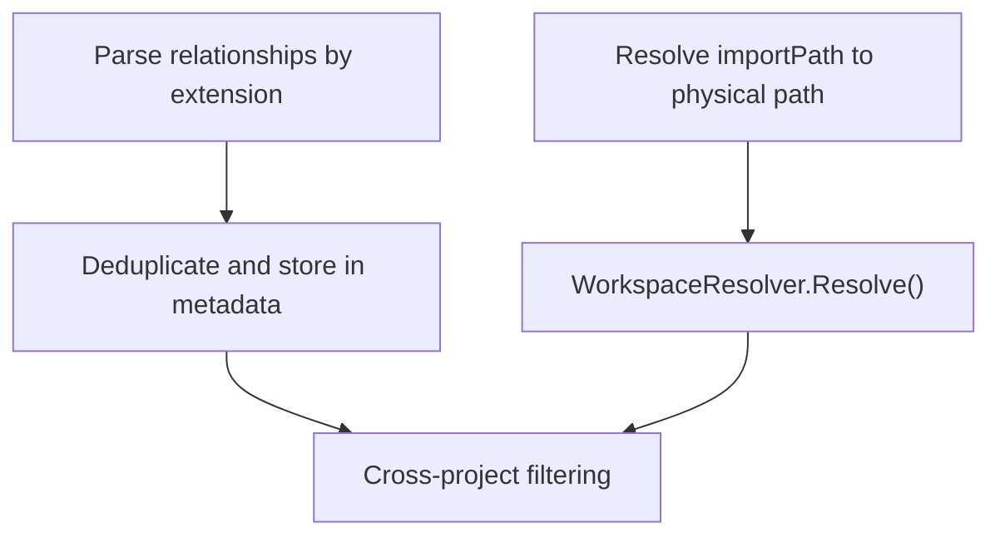
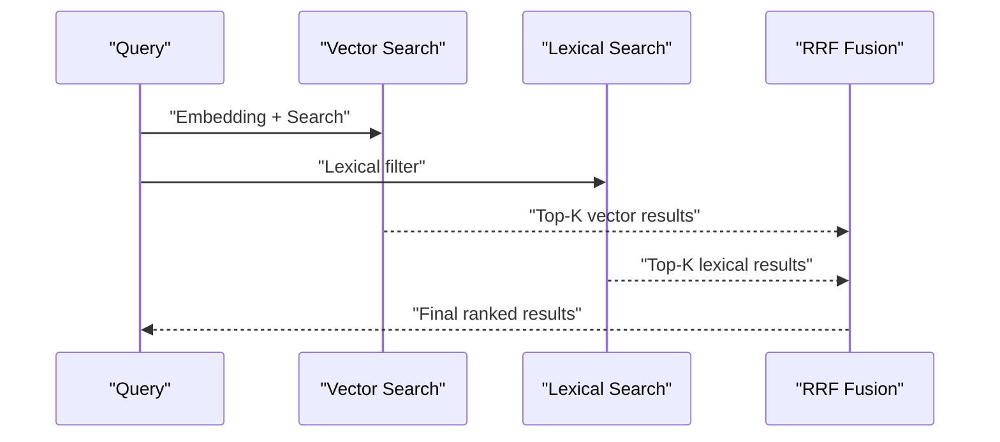
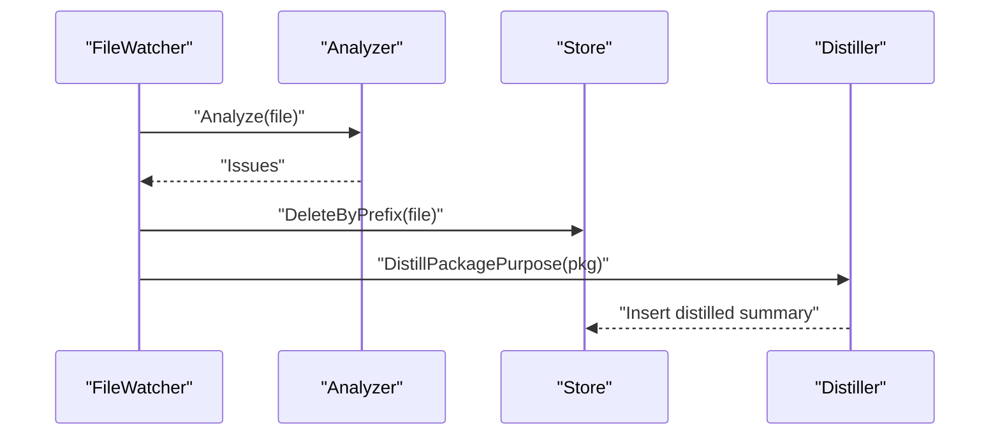
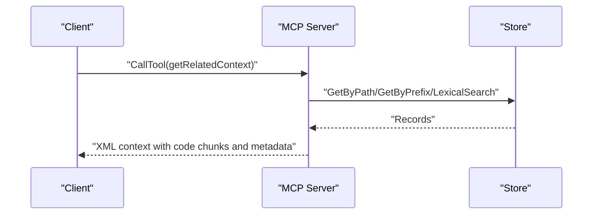
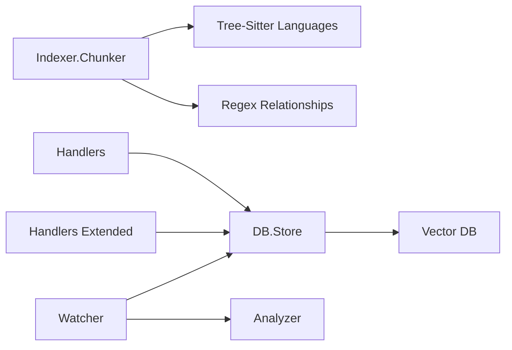

# AST-Based Analysis and Skeleton Generation

<cite>
**Referenced Files in This Document**
- [analyzer.go](file://internal/analysis/analyzer.go)
- [distiller.go](file://internal/analysis/distiller.go)
- [handlers_analysis.go](file://internal/mcp/handlers_analysis.go)
- [handlers_analysis_extended.go](file://internal/mcp/handlers_analysis_extended.go)
- [scanner.go](file://internal/indexer/scanner.go)
- [chunker.go](file://internal/indexer/chunker.go)
- [resolver.go](file://internal/indexer/resolver.go)
- [store.go](file://internal/db/store.go)
- [graph.go](file://internal/db/graph.go)
- [watcher.go](file://internal/watcher/watcher.go)
- [config.go](file://internal/config/config.go)
- [retrieval_bench_test.go](file://benchmark/retrieval_bench_test.go)
- [technology-modernization-plan.md](file://docs/technology-modernization-plan.md)
</cite>

## Table of Contents
1. [Introduction](#introduction)
2. [Project Structure](#project-structure)
3. [Core Components](#core-components)
4. [Architecture Overview](#architecture-overview)
5. [Detailed Component Analysis](#detailed-component-analysis)
6. [Dependency Analysis](#dependency-analysis)
7. [Performance Considerations](#performance-considerations)
8. [Troubleshooting Guide](#troubleshooting-guide)
9. [Conclusion](#conclusion)
10. [Appendices](#appendices)

## Introduction
This document explains the AST-based analysis and skeleton generation capabilities of the system. It covers how the system parses code into abstract syntax trees (ASTs), extracts structural skeletons, and enriches them with metadata for semantic understanding. It also documents integration with Tree-Sitter parsers, skeleton extraction patterns, traversal and classification techniques, and relationship mapping. Finally, it provides guidance on performance, memory management, incremental analysis, and extending the system to new languages and analysis patterns.

## Project Structure
The AST and skeleton generation pipeline spans several modules:
- Indexer: file scanning, chunking, and AST-based skeleton extraction
- Database: storage and retrieval of records with embeddings and metadata
- MCP Handlers: orchestration of analysis tools and contextual retrieval
- Analysis: proactive analyzers and distillation of package-level summaries
- Watcher: live indexing and proactive analysis on file changes
- Benchmark: quality and performance KPIs for retrieval and indexing

**Diagram sources**
- [scanner.go:67-191](file://internal/indexer/scanner.go#L67-L191)
- [chunker.go:43-101](file://internal/indexer/chunker.go#L43-L101)
- [resolver.go:16-27](file://internal/indexer/resolver.go#L16-L27)
- [store.go:35-64](file://internal/db/store.go#L35-L64)
- [graph.go:26-33](file://internal/db/graph.go#L26-L33)
- [handlers_analysis.go:21-224](file://internal/mcp/handlers_analysis.go#L21-L224)
- [handlers_analysis_extended.go:12-82](file://internal/mcp/handlers_analysis_extended.go#L12-L82)
- [analyzer.go:23-144](file://internal/analysis/analyzer.go#L23-L144)
- [distiller.go:22-36](file://internal/analysis/distiller.go#L22-L36)
- [watcher.go:164-208](file://internal/watcher/watcher.go#L164-L208)
- [config.go:30-130](file://internal/config/config.go#L30-L130)
- [retrieval_bench_test.go:92-224](file://benchmark/retrieval_bench_test.go#L92-L224)

**Section sources**
- [scanner.go:67-191](file://internal/indexer/scanner.go#L67-L191)
- [chunker.go:43-101](file://internal/indexer/chunker.go#L43-L101)
- [store.go:35-64](file://internal/db/store.go#L35-L64)
- [handlers_analysis.go:21-224](file://internal/mcp/handlers_analysis.go#L21-L224)
- [handlers_analysis_extended.go:12-82](file://internal/mcp/handlers_analysis_extended.go#L12-L82)
- [analyzer.go:23-144](file://internal/analysis/analyzer.go#L23-L144)
- [distiller.go:22-36](file://internal/analysis/distiller.go#L22-L36)
- [watcher.go:164-208](file://internal/watcher/watcher.go#L164-L208)
- [config.go:30-130](file://internal/config/config.go#L30-L130)
- [retrieval_bench_test.go:92-224](file://benchmark/retrieval_bench_test.go#L92-L224)

## Core Components
- AST-based chunking and skeleton extraction: Language-specific Tree-Sitter queries identify top-level entities (functions, classes, types, methods, tags, rulesets), derive parent context, extract calls, docstrings, and structural metadata, then split large chunks safely.
- Relationship parsing: Imports/uses are extracted from code for cross-file and cross-project analysis.
- Vector store and hybrid search: Records include embeddings and metadata enabling semantic search, lexical filtering, and hybrid ranking with recency and priority boosts.
- MCP tooling: Tools for related context retrieval, duplicate detection, dependency health, architecture analysis, and impact assessment.
- Proactive analysis: Pattern-based and vetting analyzers run on file changes; distillation aggregates package-level summaries.

**Section sources**
- [chunker.go:111-421](file://internal/indexer/chunker.go#L111-L421)
- [chunker.go:648-722](file://internal/indexer/chunker.go#L648-L722)
- [store.go:80-409](file://internal/db/store.go#L80-L409)
- [handlers_analysis.go:21-224](file://internal/mcp/handlers_analysis.go#L21-L224)
- [analyzer.go:23-144](file://internal/analysis/analyzer.go#L23-L144)
- [distiller.go:22-190](file://internal/analysis/distiller.go#L22-L190)

## Architecture Overview
The system transforms raw code into semantic chunks enriched with metadata, embeds them, and stores them for retrieval. On demand, tools combine semantic vectors with lexical and structural metadata to produce context-rich results.

**Diagram sources**
- [scanner.go:67-191](file://internal/indexer/scanner.go#L67-L191)
- [chunker.go:43-101](file://internal/indexer/chunker.go#L43-L101)
- [store.go:66-78](file://internal/db/store.go#L66-L78)
- [handlers_analysis.go:223-310](file://internal/mcp/handlers_analysis.go#L223-L310)

## Detailed Component Analysis

### AST Parsing and Skeleton Extraction
- Language selection: Supported extensions use Tree-Sitter; others fall back to fast chunking.
- Queries: Language-specific Tree-Sitter queries capture entities and names; cursors iterate matches.
- Parent context: For methods and blocks, the system walks up the AST to infer parent scopes (e.g., class, struct, tag, ruleset).
- Calls and docstrings: Extracted by traversing call expressions and locating comments immediately preceding nodes.
- Structural metadata: Captures fields, types, and method signatures for Go and TS/JS constructs.
- Gap filling: Unmatched regions are split into Unknown chunks to preserve continuity.

**Diagram sources**
- [chunker.go:111-421](file://internal/indexer/chunker.go#L111-L421)
- [chunker.go:423-452](file://internal/indexer/chunker.go#L423-L452)
- [chunker.go:454-531](file://internal/indexer/chunker.go#L454-L531)
- [chunker.go:594-646](file://internal/indexer/chunker.go#L594-L646)

**Section sources**
- [chunker.go:103-109](file://internal/indexer/chunker.go#L103-L109)
- [chunker.go:111-421](file://internal/indexer/chunker.go#L111-L421)
- [chunker.go:423-452](file://internal/indexer/chunker.go#L423-L452)
- [chunker.go:454-531](file://internal/indexer/chunker.go#L454-L531)
- [chunker.go:594-646](file://internal/indexer/chunker.go#L594-L646)

### Relationship Mapping and Symbol Resolution
- Relationships: Language-specific regex extracts imports/uses; deduplicated and stored in metadata.
- Workspace resolution: Path aliases and monorepo workspace mapping resolve logical imports to physical paths.
- Cross-project dependency health: Compares manifest-declared dependencies with indexed imports.

**Diagram sources**
- [chunker.go:648-722](file://internal/indexer/chunker.go#L648-L722)
- [resolver.go:169-188](file://internal/indexer/resolver.go#L169-L188)
- [handlers_analysis.go:313-472](file://internal/mcp/handlers_analysis.go#L313-L472)

**Section sources**
- [chunker.go:648-722](file://internal/indexer/chunker.go#L648-L722)
- [resolver.go:169-188](file://internal/indexer/resolver.go#L169-L188)
- [handlers_analysis.go:313-472](file://internal/mcp/handlers_analysis.go#L313-L472)

### Vector Search and Hybrid Ranking
- Embeddings: Generated for chunk contextual strings and file content; stored with records.
- Hybrid search: Concurrent vector and lexical search with Reciprocal Rank Fusion (RRF), dynamic weighting, and boosts for function score, recency, and priority.
- Metadata-driven filtering: Category, project_id, and symbol/name/content matching.

**Diagram sources**
- [store.go:223-336](file://internal/db/store.go#L223-L336)
- [store.go:80-409](file://internal/db/store.go#L80-L409)

**Section sources**
- [store.go:223-336](file://internal/db/store.go#L223-L336)
- [store.go:80-409](file://internal/db/store.go#L80-L409)

### Proactive Analysis and Distillation
- Proactive analyzers: Pattern-based and vetting analyzers run on file changes; issues are surfaced to watchers.
- Distillation: Aggregates package-level exports, internals, dependencies, and structural counts; stores a high-priority summary record.

**Diagram sources**
- [watcher.go:164-208](file://internal/watcher/watcher.go#L164-L208)
- [analyzer.go:23-144](file://internal/analysis/analyzer.go#L23-L144)
- [distiller.go:40-190](file://internal/analysis/distiller.go#L40-L190)

**Section sources**
- [watcher.go:164-208](file://internal/watcher/watcher.go#L164-L208)
- [analyzer.go:23-144](file://internal/analysis/analyzer.go#L23-L144)
- [distiller.go:40-190](file://internal/analysis/distiller.go#L40-L190)

### MCP Tools for Context and Impact
- Related context: Gathers code chunks, dependencies, symbols, and usage samples with token budgeting.
- Duplicate detection: Parallel embedding search across the corpus with concurrency control.
- Architecture analysis: Builds Mermaid dependency graphs from relationships.
- Impact analysis: Uses LSP to compute blast radius of symbol changes.

**Diagram sources**
- [handlers_analysis.go:21-224](file://internal/mcp/handlers_analysis.go#L21-L224)

**Section sources**
- [handlers_analysis.go:21-224](file://internal/mcp/handlers_analysis.go#L21-L224)
- [handlers_analysis_extended.go:12-82](file://internal/mcp/handlers_analysis_extended.go#L12-L82)

## Dependency Analysis
- Indexer depends on Tree-Sitter language packs and regex parsing for relationships.
- Database integrates with a vector store and supports concurrent lexical filtering.
- MCP handlers depend on the store for retrieval and on the resolver for path mapping.
- Watcher coordinates proactive analysis and distillation after indexing.

**Diagram sources**
- [chunker.go:10-20](file://internal/indexer/chunker.go#L10-L20)
- [chunker.go:648-722](file://internal/indexer/chunker.go#L648-L722)
- [store.go:35-64](file://internal/db/store.go#L35-L64)
- [handlers_analysis.go:21-224](file://internal/mcp/handlers_analysis.go#L21-L224)
- [handlers_analysis_extended.go:12-82](file://internal/mcp/handlers_analysis_extended.go#L12-L82)
- [watcher.go:164-208](file://internal/watcher/watcher.go#L164-L208)

**Section sources**
- [chunker.go:10-20](file://internal/indexer/chunker.go#L10-L20)
- [chunker.go:648-722](file://internal/indexer/chunker.go#L648-L722)
- [store.go:35-64](file://internal/db/store.go#L35-L64)
- [handlers_analysis.go:21-224](file://internal/mcp/handlers_analysis.go#L21-L224)
- [handlers_analysis_extended.go:12-82](file://internal/mcp/handlers_analysis_extended.go#L12-L82)
- [watcher.go:164-208](file://internal/watcher/watcher.go#L164-L208)

## Performance Considerations
- Chunk sizing and overlap: Large chunks are split with overlap to avoid losing context; rune-safe slicing prevents UTF-8 corruption.
- Concurrency: Indexing workers and embedding batches use CPU count; lexical filtering parallelizes across chunks.
- Memory management: Fast chunking avoids AST overhead for unsupported files; parser/query cursors are closed promptly.
- Incremental analysis: Hash-based discovery skips unchanged files; prefix deletion ensures atomic updates.
- Hybrid ranking: Dynamic weights and recency boosts reduce unnecessary recomputation while improving relevance.
- Benchmarks: Polyglot fixtures and KPIs (recall@K, MRR, NDCG, index time per KLOC, latency percentiles) provide regression guards.

**Section sources**
- [chunker.go:537-577](file://internal/indexer/chunker.go#L537-L577)
- [scanner.go:120-189](file://internal/indexer/scanner.go#L120-L189)
- [store.go:130-221](file://internal/db/store.go#L130-L221)
- [store.go:223-336](file://internal/db/store.go#L223-L336)
- [retrieval_bench_test.go:92-224](file://benchmark/retrieval_bench_test.go#L92-L224)
- [technology-modernization-plan.md:82-116](file://docs/technology-modernization-plan.md#L82-L116)

## Troubleshooting Guide
- AST parsing failures: If Tree-Sitter fails to parse, the system falls back to fast chunking; verify language pack availability and content encoding.
- Missing relationships: Ensure regex patterns match the language’s import/require syntax; confirm deduplication and normalization.
- Hybrid search slow-down: Reduce topK, tune concurrency, or adjust recency and priority boosts; verify vector dimension consistency.
- Proactive analysis not triggered: Confirm analyzer availability and watcher event handling; check notifications and logging levels.
- Distillation anomalies: Validate package prefix and metadata completeness; ensure embeddings are generated before insertion.

**Section sources**
- [chunker.go:141-148](file://internal/indexer/chunker.go#L141-L148)
- [chunker.go:648-722](file://internal/indexer/chunker.go#L648-L722)
- [store.go:223-336](file://internal/db/store.go#L223-L336)
- [watcher.go:164-208](file://internal/watcher/watcher.go#L164-L208)
- [distiller.go:40-190](file://internal/analysis/distiller.go#L40-L190)

## Conclusion
The system combines language-aware AST parsing with metadata enrichment and vector search to deliver precise, scalable code analysis. Its modular design enables incremental updates, robust error handling, and extensibility for new languages and analysis patterns.

## Appendices

### Extending to New Programming Languages
- Add Tree-Sitter language pack import and language switch case.
- Define language-specific queries for entities and names.
- Implement parent context inference for the language’s scoping constructs.
- Add relationship extraction regex if needed.
- Extend supported extensions and add tests.

**Section sources**
- [chunker.go:10-20](file://internal/indexer/chunker.go#L10-L20)
- [chunker.go:118-139](file://internal/indexer/chunker.go#L118-L139)
- [chunker.go:211-253](file://internal/indexer/chunker.go#L211-L253)
- [chunker.go:648-722](file://internal/indexer/chunker.go#L648-L722)

### Custom Analysis Patterns
- Implement Analyzer interface for new checks (e.g., style, complexity).
- Integrate analyzers into MultiAnalyzer for orchestrated runs.
- Surface findings via MCP tools or watcher notifications.

**Section sources**
- [analyzer.go:23-27](file://internal/analysis/analyzer.go#L23-L27)
- [analyzer.go:121-144](file://internal/analysis/analyzer.go#L121-L144)
- [watcher.go:164-208](file://internal/watcher/watcher.go#L164-L208)