# Code Analysis Engine

<cite>
**Referenced Files in This Document**
- [analyzer.go](file://internal/analysis/analyzer.go)
- [distiller.go](file://internal/analysis/distiller.go)
- [handlers_analysis.go](file://internal/mcp/handlers_analysis.go)
- [handlers_analysis_extended.go](file://internal/mcp/handlers_analysis_extended.go)
- [handlers_distill.go](file://internal/mcp/handlers_distill.go)
- [server.go](file://internal/mcp/server.go)
- [config.go](file://internal/config/config.go)
- [chunker.go](file://internal/indexer/chunker.go)
- [resolver.go](file://internal/indexer/resolver.go)
- [store.go](file://internal/db/store.go)
- [session.go](file://internal/embedding/session.go)
- [watcher.go](file://internal/watcher/watcher.go)
- [mcp-config.json.example](file://mcp-config.json.example)
- [README.md](file://README.md)
- [technology-modernization-plan.md](file://docs/technology-modernization-plan.md)
- [retrieval_bench_test.go](file://benchmark/retrieval_bench_test.go)
</cite>

## Table of Contents
1. [Introduction](#introduction)
2. [Project Structure](#project-structure)
3. [Core Components](#core-components)
4. [Architecture Overview](#architecture-overview)
5. [Detailed Component Analysis](#detailed-component-analysis)
6. [Dependency Analysis](#dependency-analysis)
7. [Performance Considerations](#performance-considerations)
8. [Troubleshooting Guide](#troubleshooting-guide)
9. [Conclusion](#conclusion)
10. [Appendices](#appendices)

## Introduction
This document describes the code analysis engine that powers the vector MCP Go system. It explains how the engine performs AST-based analysis, detects dead code, identifies duplicate code, and applies pattern-based analysis. It also covers quality metrics computation, compliance checking, integration with Tree-Sitter parsers, and the distillation process for extracting meaningful insights. Configuration options, thresholds, and custom analyzer development are documented, along with performance considerations for large codebases, incremental analysis capabilities, and result interpretation guidelines. Examples of common analysis patterns and integration with MCP tools are included.

## Project Structure
The analysis engine spans several modules:
- Analysis: AST-based analyzers and distillation
- MCP Handlers: Tool integrations for semantic search, duplication detection, dead code checks, dependency health, and more
- Indexer: Language-aware chunking using Tree-Sitter
- Database: Vector storage and hybrid search
- Embedding: ONNX-based embeddings and optional reranking
- Watcher: Proactive analysis and re-distillation on file changes
- Configuration: Environment-driven settings and thresholds

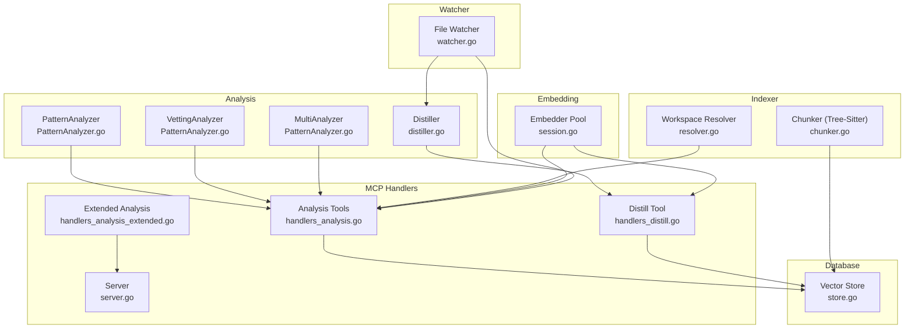

**Diagram sources**
- [analyzer.go:24-144](file://internal/analysis/analyzer.go#L24-L144)
- [distiller.go:22-191](file://internal/analysis/distiller.go#L22-L191)
- [handlers_analysis.go:1-800](file://internal/mcp/handlers_analysis.go#L1-L800)
- [handlers_analysis_extended.go:1-83](file://internal/mcp/handlers_analysis_extended.go#L1-L83)
- [handlers_distill.go:1-32](file://internal/mcp/handlers_distill.go#L1-L32)
- [server.go:66-459](file://internal/mcp/server.go#L66-L459)
- [chunker.go:43-759](file://internal/indexer/chunker.go#L43-L759)
- [resolver.go:16-189](file://internal/indexer/resolver.go#L16-L189)
- [store.go:19-664](file://internal/db/store.go#L19-L664)
- [session.go:29-367](file://internal/embedding/session.go#L29-L367)
- [watcher.go:23-281](file://internal/watcher/watcher.go#L23-L281)

**Section sources**
- [server.go:323-407](file://internal/mcp/server.go#L323-L407)
- [chunker.go:103-139](file://internal/indexer/chunker.go#L103-L139)

## Core Components
- Analyzer interface and implementations:
  - PatternAnalyzer: Scans files for markers like TODO, FIXME, HACK, DEPRECATED
  - VettingAnalyzer: Runs go vet on Go files
  - MultiAnalyzer: Chains multiple analyzers
- Distiller: Generates semantic summaries of packages and stores them with high priority
- MCP Handlers: Provide tools for related context retrieval, duplicate code detection, dependency health, architecture analysis, dead code detection, and docstring prompt generation
- Indexer: Uses Tree-Sitter for language-specific AST chunking and relationship extraction
- Database: Chromem-based vector store with hybrid search and lexical filtering
- Embedding: ONNX runtime-based embedder with pooling and normalization
- Watcher: Proactive analysis and re-distillation triggered by file changes

**Section sources**
- [analyzer.go:23-144](file://internal/analysis/analyzer.go#L23-L144)
- [distiller.go:22-191](file://internal/analysis/distiller.go#L22-L191)
- [handlers_analysis.go:226-777](file://internal/mcp/handlers_analysis.go#L226-L777)
- [chunker.go:43-421](file://internal/indexer/chunker.go#L43-L421)
- [store.go:19-664](file://internal/db/store.go#L19-L664)
- [session.go:176-280](file://internal/embedding/session.go#L176-L280)
- [watcher.go:141-280](file://internal/watcher/watcher.go#L141-L280)

## Architecture Overview
The analysis engine integrates MCP tools with a semantic search backend. The workflow:
- Files are chunked using Tree-Sitter into language-aware segments enriched with symbols, relationships, and structural metadata
- Embeddings are generated and stored in a vector database
- MCP tools query the database for related context, duplicates, architecture, and compliance
- Proactive watchers trigger analysis and re-distillation on file changes

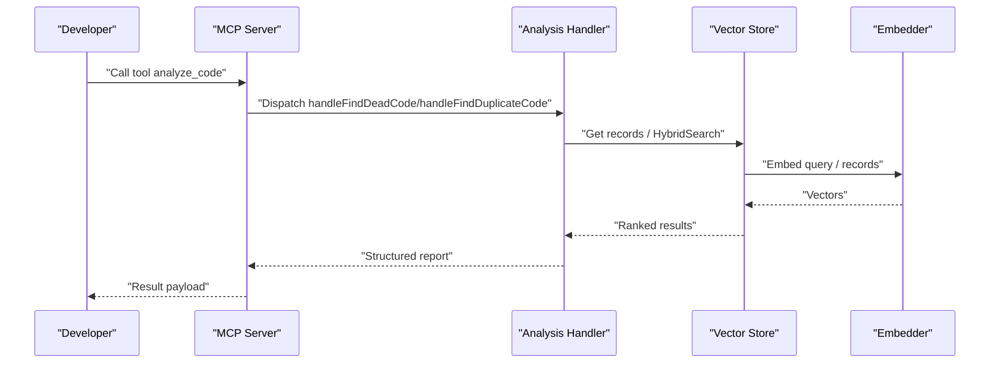

**Diagram sources**
- [server.go:323-407](file://internal/mcp/server.go#L323-L407)
- [handlers_analysis.go:637-777](file://internal/mcp/handlers_analysis.go#L637-L777)
- [store.go:223-336](file://internal/db/store.go#L223-L336)
- [session.go:176-245](file://internal/embedding/session.go#L176-L245)

## Detailed Component Analysis

### AST-Based Analysis and Pattern Detection
- PatternAnalyzer scans for markers using regular expressions and emits issues with severity and source
- VettingAnalyzer executes go vet on Go files and parses output into structured issues
- MultiAnalyzer aggregates results from multiple analyzers

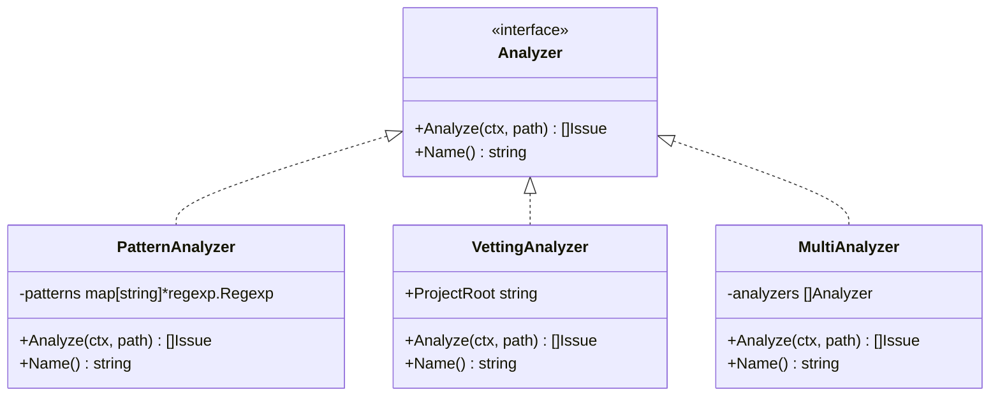

**Diagram sources**
- [analyzer.go:23-144](file://internal/analysis/analyzer.go#L23-L144)

**Section sources**
- [analyzer.go:29-119](file://internal/analysis/analyzer.go#L29-L119)

### Duplicate Code Identification
- The handler enumerates chunks for a target path and performs parallel semantic similarity searches
- It embeds missing chunks and compares vectors across projects, reporting near-duplicates

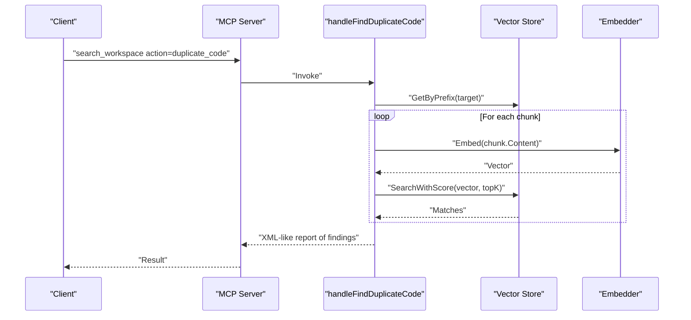

**Diagram sources**
- [handlers_analysis.go:226-311](file://internal/mcp/handlers_analysis.go#L226-L311)
- [store.go:338-409](file://internal/db/store.go#L338-L409)
- [session.go:176-245](file://internal/embedding/session.go#L176-L245)

**Section sources**
- [handlers_analysis.go:226-311](file://internal/mcp/handlers_analysis.go#L226-L311)

### Dead Code Detection
- Enumerates exported symbols and usage (calls and imports) across the codebase
- Identifies symbols present in metadata but not referenced anywhere, excluding whitelisted and test symbols

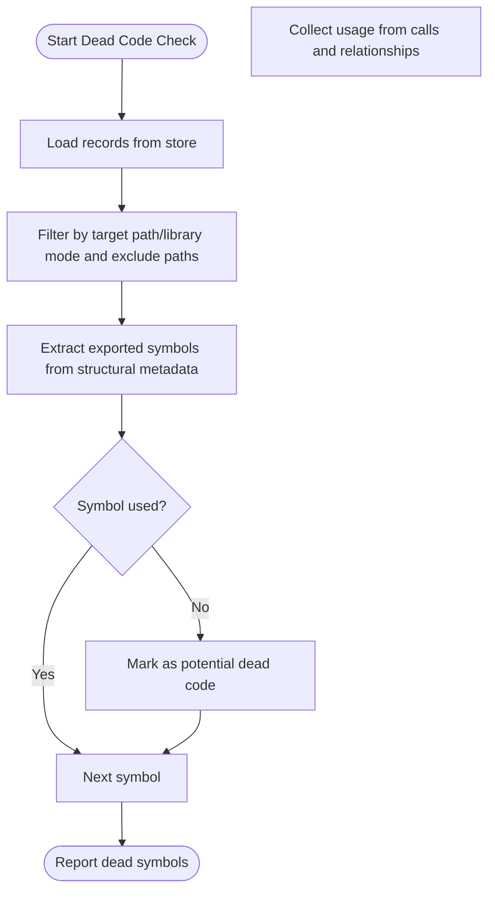

**Diagram sources**
- [handlers_analysis.go:637-777](file://internal/mcp/handlers_analysis.go#L637-L777)

**Section sources**
- [handlers_analysis.go:637-777](file://internal/mcp/handlers_analysis.go#L637-L777)

### Dependency Health Checking
- Detects project type by manifest presence and parses dependencies
- Compares indexed imports against manifest to surface missing external dependencies

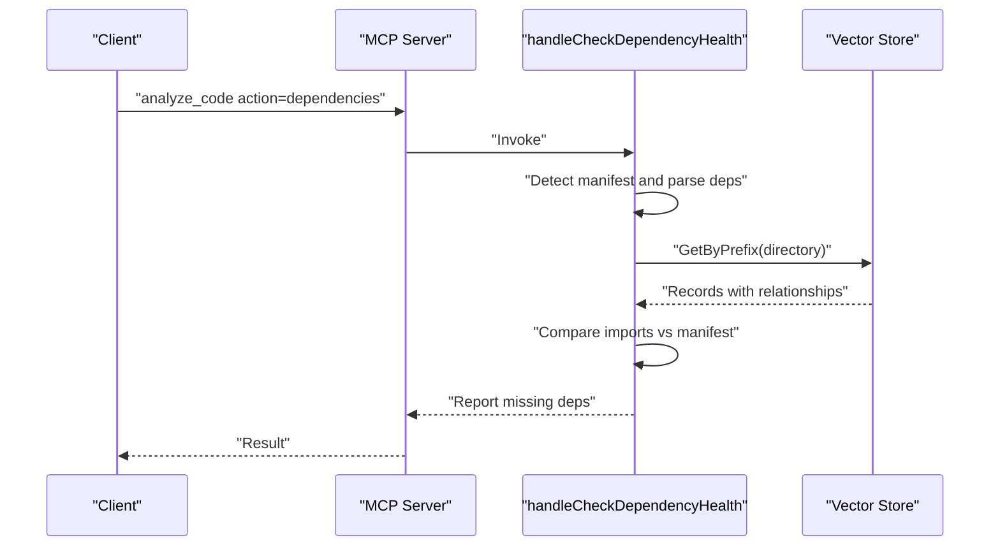

**Diagram sources**
- [handlers_analysis.go:313-472](file://internal/mcp/handlers_analysis.go#L313-L472)

**Section sources**
- [handlers_analysis.go:313-472](file://internal/mcp/handlers_analysis.go#L313-L472)

### Related Context Retrieval
- Gathers a file’s code chunks and its dependencies, resolving monorepo imports
- Retrieves usage samples across projects and constrains token usage

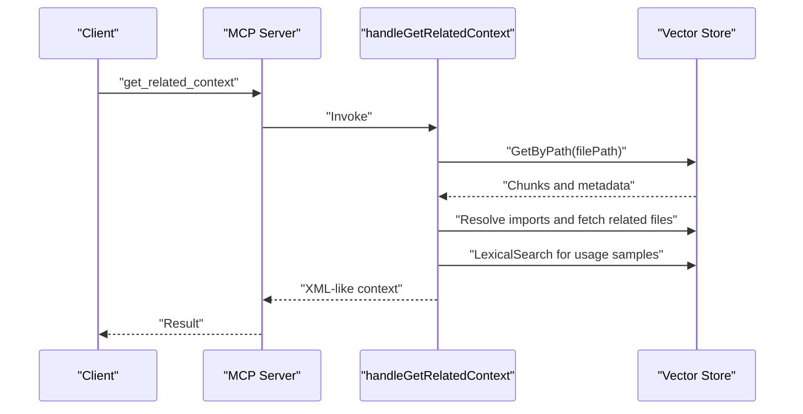

**Diagram sources**
- [handlers_analysis.go:21-224](file://internal/mcp/handlers_analysis.go#L21-L224)

**Section sources**
- [handlers_analysis.go:21-224](file://internal/mcp/handlers_analysis.go#L21-L224)

### Impact Analysis (LSP)
- Uses LSP references to compute blast radius and risk level for a symbol change

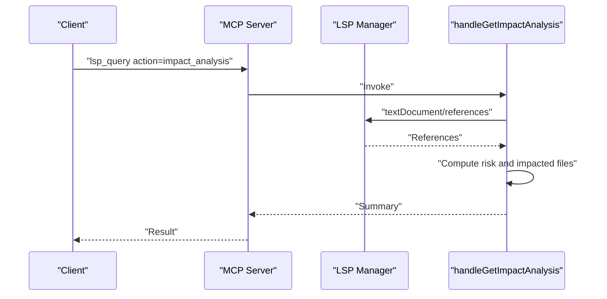

**Diagram sources**
- [handlers_analysis_extended.go:12-83](file://internal/mcp/handlers_analysis_extended.go#L12-L83)

**Section sources**
- [handlers_analysis_extended.go:12-83](file://internal/mcp/handlers_analysis_extended.go#L12-L83)

### Distillation Pipeline
- Aggregates structural metadata from indexed records to build a package-level summary
- Embeds and stores the summary with high priority for retrieval

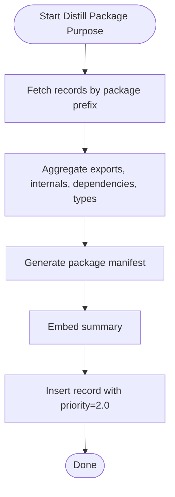

**Diagram sources**
- [distiller.go:38-191](file://internal/analysis/distiller.go#L38-L191)

**Section sources**
- [distiller.go:38-191](file://internal/analysis/distiller.go#L38-L191)

### Proactive Analysis and Compliance
- On file write/create, re-indexes, checks architectural compliance against distilled/ADR rules, and triggers re-distillation for dependent packages
- Runs analyzers (e.g., PatternAnalyzer) and emits notifications

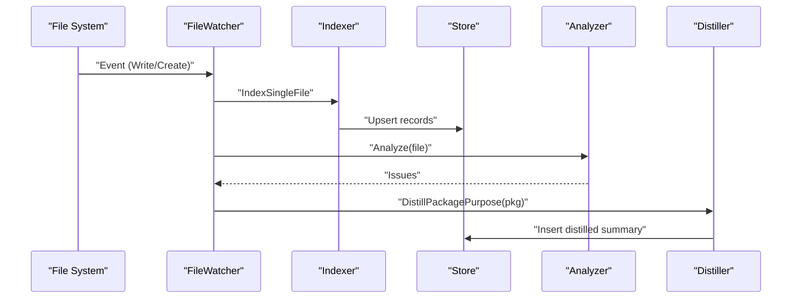

**Diagram sources**
- [watcher.go:141-280](file://internal/watcher/watcher.go#L141-L280)

**Section sources**
- [watcher.go:141-280](file://internal/watcher/watcher.go#L141-L280)

## Dependency Analysis
- The MCP server composes multiple subsystems: configuration, database, embedding, indexer, LSP, and watcher
- Handlers depend on the store interface for search, lexical filtering, and hybrid ranking
- Tree-Sitter integration is centralized in the chunker with language-specific queries

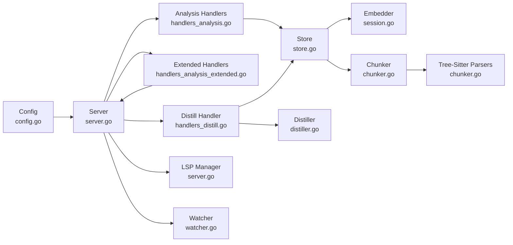

**Diagram sources**
- [server.go:66-459](file://internal/mcp/server.go#L66-L459)
- [handlers_analysis.go:1-800](file://internal/mcp/handlers_analysis.go#L1-L800)
- [handlers_analysis_extended.go:1-83](file://internal/mcp/handlers_analysis_extended.go#L1-L83)
- [handlers_distill.go:1-32](file://internal/mcp/handlers_distill.go#L1-L32)
- [store.go:19-664](file://internal/db/store.go#L19-L664)
- [session.go:29-367](file://internal/embedding/session.go#L29-L367)
- [chunker.go:103-206](file://internal/indexer/chunker.go#L103-L206)
- [watcher.go:23-281](file://internal/watcher/watcher.go#L23-L281)

**Section sources**
- [server.go:66-117](file://internal/mcp/server.go#L66-L117)
- [chunker.go:103-206](file://internal/indexer/chunker.go#L103-L206)

## Performance Considerations
- Concurrency and batching:
  - Duplicate code search uses a semaphore to cap parallelism
  - Lexical search parallelizes filtering across CPU cores
  - Embedder pool supports concurrent embedding requests
- Memory and resource management:
  - Memory throttler integration in watcher and server
  - Rune-safe truncation and clamping utilities for safe output caps
- Indexing and retrieval:
  - Hybrid search combines vector and lexical results with dynamic weights
  - Reciprocal Rank Fusion (RRF) with boosting by function score and priority
  - Splitting large chunks with overlap to avoid UTF-8 corruption
- Benchmarks and thresholds:
  - Polyglot fixture with KPIs for recall@k, MRR, NDCG, index time per KLOC, and latency percentiles
- Incremental analysis:
  - Live indexing and file watcher with debounced processing
  - Prefix deletion on rename/remove to keep index consistent

**Section sources**
- [handlers_analysis.go:252-295](file://internal/mcp/handlers_analysis.go#L252-L295)
- [store.go:124-221](file://internal/db/store.go#L124-L221)
- [session.go:38-85](file://internal/embedding/session.go#L38-L85)
- [technology-modernization-plan.md:65-107](file://docs/technology-modernization-plan.md#L65-L107)
- [retrieval_bench_test.go:92-229](file://benchmark/retrieval_bench_test.go#L92-L229)
- [chunker.go:538-577](file://internal/indexer/chunker.go#L538-L577)
- [store.go:223-336](file://internal/db/store.go#L223-L336)
- [watcher.go:121-139](file://internal/watcher/watcher.go#L121-L139)

## Troubleshooting Guide
Common issues and remedies:
- Dimension mismatch in vector database:
  - Occurs when switching embedding models; the store probes and returns a clear error instructing to delete the database and restart
- Missing manifests or unsupported project types:
  - Dependency health checks require package.json, go.mod, or requirements.txt; absence returns an explicit error
- LSP session failures:
  - Impact analysis requires a working LSP session; errors are surfaced with actionable messages
- Proactive analysis notifications:
  - Watcher emits warnings for architectural violations and notifies clients accordingly

**Section sources**
- [store.go:51-62](file://internal/db/store.go#L51-L62)
- [handlers_analysis.go:313-344](file://internal/mcp/handlers_analysis.go#L313-L344)
- [handlers_analysis_extended.go:23-39](file://internal/mcp/handlers_analysis_extended.go#L23-L39)
- [watcher.go:234-243](file://internal/watcher/watcher.go#L234-L243)

## Conclusion
The code analysis engine combines AST-based analysis, semantic search, and proactive monitoring to deliver practical insights for code quality, architecture, and maintainability. Tree-Sitter-powered chunking ensures language-aware semantics, while hybrid search and distillation improve retrieval quality. Proactive watchers and compliance checks enforce architectural rules and keep summaries fresh. With configurable thresholds, concurrency controls, and benchmarks, the system scales to large codebases and integrates seamlessly with MCP tools.

## Appendices

### Configuration Options
- Environment variables and defaults:
  - Project root, data directory, DB path, models directory, log path, model names, reranker model, HF token, dimension, watcher and live indexing toggles, embedder pool size, API port
- Thresholds and limits:
  - Token limits for context building, max results for search, and clamping utilities for safe numeric parameters

**Section sources**
- [config.go:30-130](file://internal/config/config.go#L30-L130)

### Integration with MCP Tools
- Tool registration and argument schemas:
  - search_workspace, workspace_manager, lsp_query, analyze_code, modify_workspace, index_status, trigger_project_index, get_related_context, store_context, delete_context, distill_package_purpose, trace_data_flow
- Example configuration for MCP servers:
  - Command path and environment variables for runtime libraries

**Section sources**
- [server.go:323-407](file://internal/mcp/server.go#L323-L407)
- [mcp-config.json.example:1-12](file://mcp-config.json.example#L1-L12)

### Example Analysis Patterns
- Dead code detection:
  - Target a package or file, exclude test and entry points, and report unused exported symbols
- Duplicate code detection:
  - Scan for semantically similar blocks across projects with configurable parallelism
- Dependency health:
  - Compare imports against manifest for npm, Go, or Python projects
- Architecture analysis:
  - Generate Mermaid dependency graphs from indexed relationships
- Docstring prompt generation:
  - Produce a rich prompt tailored to the language’s documentation conventions

**Section sources**
- [handlers_analysis.go:637-777](file://internal/mcp/handlers_analysis.go#L637-L777)
- [handlers_analysis.go:226-311](file://internal/mcp/handlers_analysis.go#L226-L311)
- [handlers_analysis.go:313-472](file://internal/mcp/handlers_analysis.go#L313-L472)
- [handlers_analysis.go:557-634](file://internal/mcp/handlers_analysis.go#L557-L634)
- [handlers_analysis.go:474-555](file://internal/mcp/handlers_analysis.go#L474-L555)