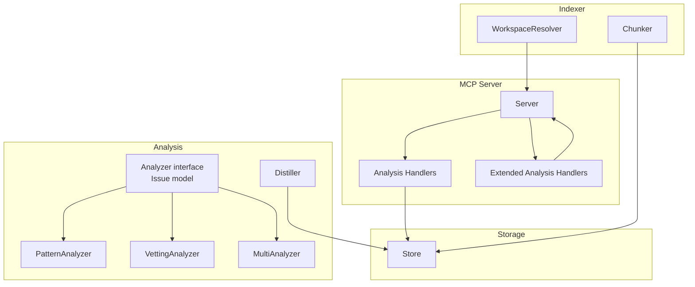
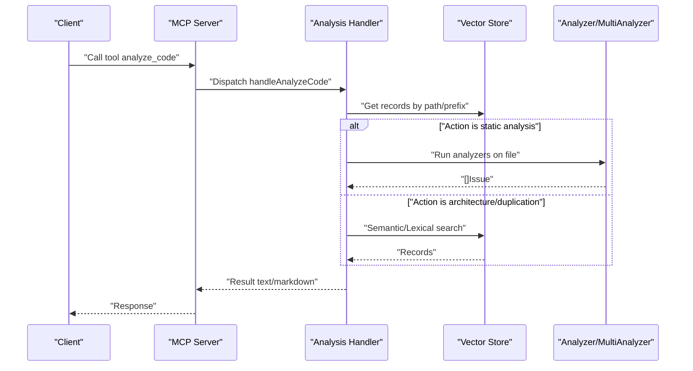
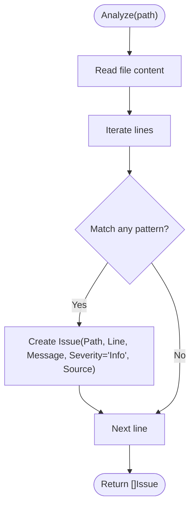
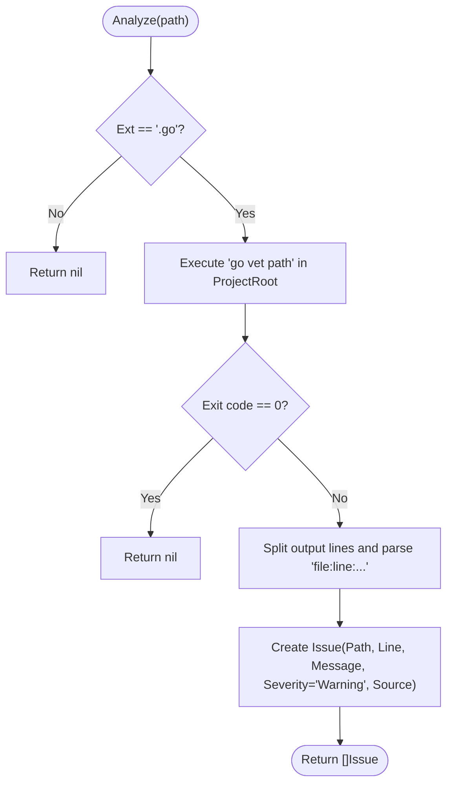
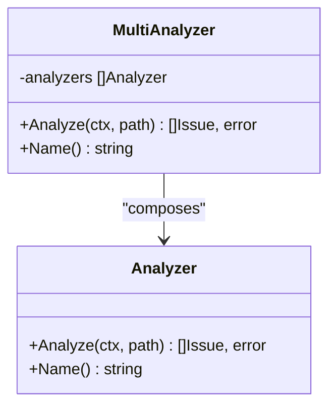
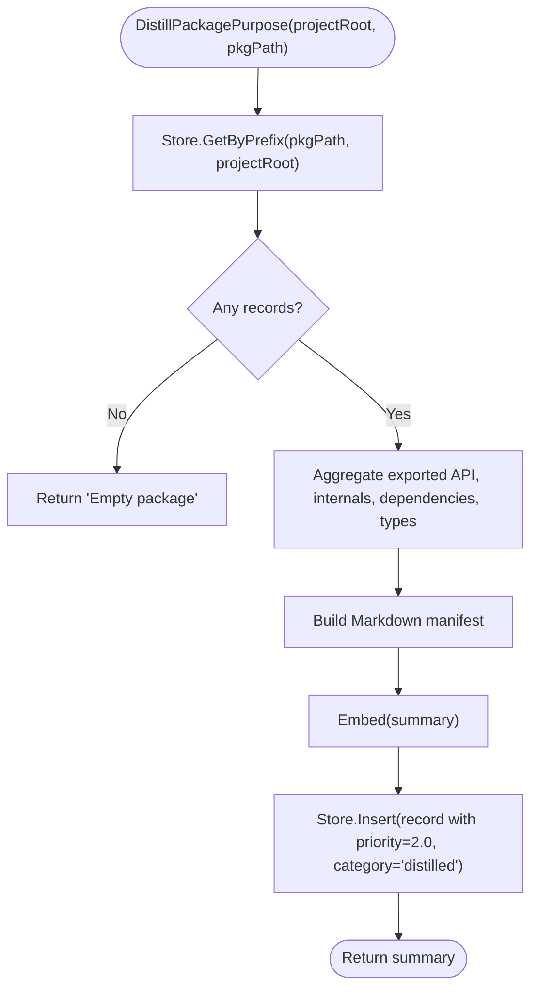
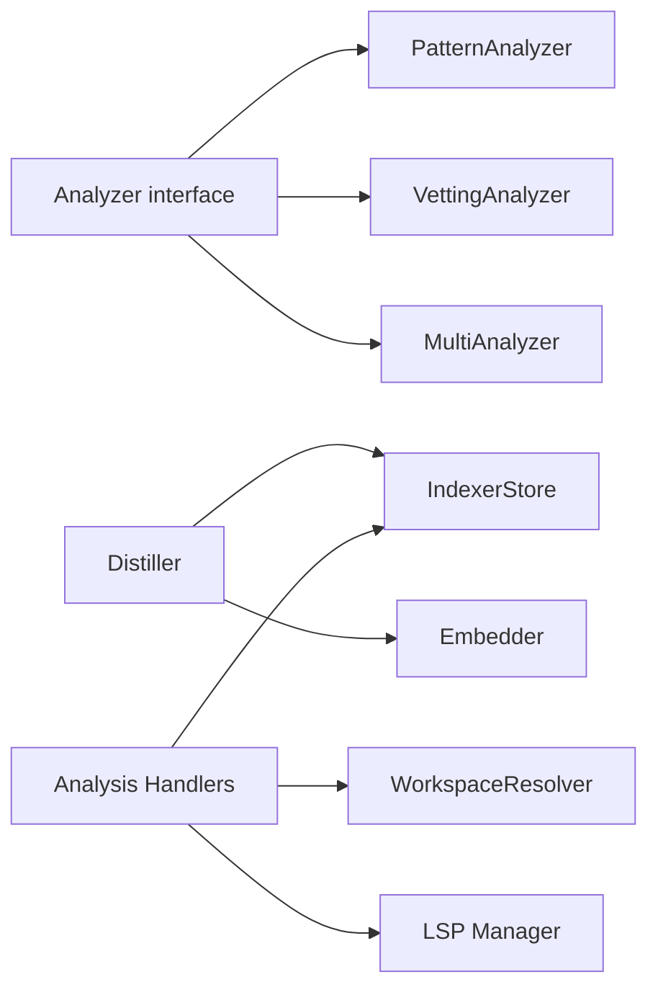

# Custom Analyzer Development

<cite>
**Referenced Files in This Document**
- [analyzer.go](file://internal/analysis/analyzer.go)
- [distiller.go](file://internal/analysis/distiller.go)
- [handlers_analysis.go](file://internal/mcp/handlers_analysis.go)
- [handlers_analysis_extended.go](file://internal/mcp/handlers_analysis_extended.go)
- [server.go](file://internal/mcp/server.go)
- [chunker.go](file://internal/indexer/chunker.go)
- [resolver.go](file://internal/indexer/resolver.go)
- [store.go](file://internal/db/store.go)
- [chunker_test.go](file://internal/indexer/chunker_test.go)
- [resolver_test.go](file://internal/indexer/resolver_test.go)
- [store_test.go](file://internal/db/store_test.go)
</cite>

## Table of Contents
1. [Introduction](#introduction)
2. [Project Structure](#project-structure)
3. [Core Components](#core-components)
4. [Architecture Overview](#architecture-overview)
5. [Detailed Component Analysis](#detailed-component-analysis)
6. [Dependency Analysis](#dependency-analysis)
7. [Performance Considerations](#performance-considerations)
8. [Troubleshooting Guide](#troubleshooting-guide)
9. [Conclusion](#conclusion)
10. [Appendices](#appendices)

## Introduction
This document explains how to build custom analyzers and extend the analysis engine in this codebase. It covers the Analyzer interface contract, implementation requirements, composition patterns, and integration with the MCP server. You will learn how to create domain-specific analyzers (e.g., static analysis, architectural compliance, code style), compose them with MultiAnalyzer, register them in the analysis pipeline, and configure workflows. Testing strategies, performance optimization techniques, and best practices are included, along with templates and examples for common analyzer patterns.

## Project Structure
The analysis and analyzer subsystems are primarily located under internal/analysis and integrate with the MCP server under internal/mcp. Indexing and chunking logic lives under internal/indexer, while persistence and retrieval are handled by internal/db.

**Diagram sources**
- [analyzer.go:23-143](file://internal/analysis/analyzer.go#L23-L143)
- [server.go:67-128](file://internal/mcp/server.go#L67-L128)
- [handlers_analysis.go:1-1242](file://internal/mcp/handlers_analysis.go#L1-L1242)
- [handlers_analysis_extended.go:1-83](file://internal/mcp/handlers_analysis_extended.go#L1-L83)
- [chunker.go:1-759](file://internal/indexer/chunker.go#L1-L759)
- [resolver.go:1-189](file://internal/indexer/resolver.go#L1-L189)
- [store.go:19-664](file://internal/db/store.go#L19-L664)
- [distiller.go:22-191](file://internal/analysis/distiller.go#L22-L191)

**Section sources**
- [analyzer.go:1-144](file://internal/analysis/analyzer.go#L1-L144)
- [server.go:1-470](file://internal/mcp/server.go#L1-L470)
- [handlers_analysis.go:1-1242](file://internal/mcp/handlers_analysis.go#L1-L1242)
- [handlers_analysis_extended.go:1-83](file://internal/mcp/handlers_analysis_extended.go#L1-L83)
- [chunker.go:1-759](file://internal/indexer/chunker.go#L1-L759)
- [resolver.go:1-189](file://internal/indexer/resolver.go#L1-L189)
- [store.go:19-664](file://internal/db/store.go#L19-L664)
- [distiller.go:1-191](file://internal/analysis/distiller.go#L1-L191)

## Core Components
- Analyzer interface: Defines Analyze(ctx, path) []Issue, error and Name() string. Implementations scan files and produce Issue results with Path, Line, Column, Message, Severity, Source.
- PatternAnalyzer: Scans for predefined regex patterns (e.g., TODO, FIXME, HACK, DEPRECATED) and emits Info severity issues.
- VettingAnalyzer: Runs go vet on Go files and parses its output into Issue entries.
- MultiAnalyzer: Composes multiple analyzers and aggregates their results, continuing on analyzer errors.
- Issue model: Central data structure representing discovered problems.
- Distiller: Generates semantic summaries of packages and stores them with high priority and category metadata.

Key implementation references:
- Analyzer interface and Issue model: [analyzer.go:14-27](file://internal/analysis/analyzer.go#L14-L27)
- PatternAnalyzer: [analyzer.go:29-70](file://internal/analysis/analyzer.go#L29-L70)
- VettingAnalyzer: [analyzer.go:72-119](file://internal/analysis/analyzer.go#L72-L119)
- MultiAnalyzer: [analyzer.go:121-143](file://internal/analysis/analyzer.go#L121-L143)
- Distiller: [distiller.go:22-191](file://internal/analysis/distiller.go#L22-L191)

**Section sources**
- [analyzer.go:14-143](file://internal/analysis/analyzer.go#L14-L143)
- [distiller.go:22-191](file://internal/analysis/distiller.go#L22-L191)

## Architecture Overview
The MCP server exposes tools for analysis and codebase diagnostics. Analysis handlers query the vector store, leverage chunking and metadata, and optionally invoke analyzers. Distiller provides semantic summarization and persistence.

**Diagram sources**
- [server.go:334-418](file://internal/mcp/server.go#L334-L418)
- [handlers_analysis.go:1-1242](file://internal/mcp/handlers_analysis.go#L1-L1242)
- [analyzer.go:23-143](file://internal/analysis/analyzer.go#L23-L143)
- [store.go:80-409](file://internal/db/store.go#L80-L409)

## Detailed Component Analysis

### Analyzer Interface Contract
- Methods:
  - Analyze(ctx context.Context, path string) ([]Issue, error)
  - Name() string
- Responsibilities:
  - Scan a single file path.
  - Return zero or more Issue entries.
  - Propagate context cancellation and timeouts.
  - Keep errors localized; do not fail the entire pipeline if one analyzer fails.

Implementation requirements:
- Use context-aware operations (e.g., exec.CommandContext).
- Normalize output fields (Path, Line, Column, Message, Severity, Source).
- Keep Analyze deterministic and side-effect free for a given path.

Integration patterns:
- Single analyzer: implement Analyzer and pass to MultiAnalyzer.
- Composition: combine analyzers with MultiAnalyzer to run multiple checks in one pass.

**Section sources**
- [analyzer.go:23-27](file://internal/analysis/analyzer.go#L23-L27)

### PatternAnalyzer
- Purpose: Lightweight scanning for common markers.
- Behavior:
  - Reads file content.
  - Matches predefined regex patterns per line.
  - Emits Issue entries with Info severity.
- Extensibility:
  - Add or customize patterns in the constructor.
  - Adjust severity or categorization.

**Diagram sources**
- [analyzer.go:47-70](file://internal/analysis/analyzer.go#L47-L70)

**Section sources**
- [analyzer.go:29-70](file://internal/analysis/analyzer.go#L29-L70)

### VettingAnalyzer
- Purpose: Run go vet on Go files and convert output into Issue entries.
- Behavior:
  - Skips non-Go files.
  - Executes go vet with context.
  - Parses output lines into Issue entries.
- Notes:
  - Uses combined output; successful runs return no issues.
  - Severity is Warning for findings.

**Diagram sources**
- [analyzer.go:83-119](file://internal/analysis/analyzer.go#L83-L119)

**Section sources**
- [analyzer.go:72-119](file://internal/analysis/analyzer.go#L72-L119)

### MultiAnalyzer Composition
- Purpose: Run multiple analyzers sequentially and aggregate results.
- Behavior:
  - Iterates analyzers in order.
  - Continues on analyzer errors.
  - Concatenates all issues.

**Diagram sources**
- [analyzer.go:23-27](file://internal/analysis/analyzer.go#L23-L27)
- [analyzer.go:121-143](file://internal/analysis/analyzer.go#L121-L143)

**Section sources**
- [analyzer.go:121-143](file://internal/analysis/analyzer.go#L121-L143)

### Distiller
- Purpose: Generate semantic summaries of packages and persist them with high priority and category metadata.
- Steps:
  - Fetch records by package prefix.
  - Aggregate exported API, internal components, dependencies, and structural metadata.
  - Generate a Markdown manifest.
  - Embed and store with priority and category.

**Diagram sources**
- [distiller.go:40-191](file://internal/analysis/distiller.go#L40-L191)

**Section sources**
- [distiller.go:22-191](file://internal/analysis/distiller.go#L22-L191)

### Analysis Handlers Integration
- The MCP server registers tools and dispatches to handlers.
- Analysis handlers:
  - handleGetRelatedContext: context retrieval and dependency exploration.
  - handleFindDuplicateCode: semantic duplicate detection with concurrency.
  - handleCheckDependencyHealth: manifest-based dependency health.
  - handleAnalyzeArchitecture: Mermaid graph generation.
  - handleFindDeadCode: unused exported symbol detection.
  - handleGenerateDocstringPrompt: prompt construction for documentation.
  - handleGetImpactAnalysis: LSP-based impact analysis.

These handlers demonstrate:
- Store usage for retrieval and search.
- Concurrency patterns (goroutines, channels, waitgroups).
- Metadata-driven filtering and ranking.

**Section sources**
- [server.go:334-418](file://internal/mcp/server.go#L334-L418)
- [handlers_analysis.go:1-1242](file://internal/mcp/handlers_analysis.go#L1-L1242)
- [handlers_analysis_extended.go:12-82](file://internal/mcp/handlers_analysis_extended.go#L12-L82)

## Dependency Analysis
- Analyzer implementations depend on:
  - File I/O and regex matching.
  - External tool invocation (go vet).
- MultiAnalyzer depends on the Analyzer interface contract.
- Distiller depends on:
  - IndexerStore for retrieval.
  - Embedder for embeddings.
  - Logger for diagnostics.
- Analysis handlers depend on:
  - Store for vector search and lexical filtering.
  - WorkspaceResolver for monorepo path resolution.
  - LSP manager for impact analysis.

**Diagram sources**
- [analyzer.go:23-143](file://internal/analysis/analyzer.go#L23-L143)
- [distiller.go:22-36](file://internal/analysis/distiller.go#L22-L36)
- [handlers_analysis.go:1-1242](file://internal/mcp/handlers_analysis.go#L1-L1242)
- [resolver.go:10-189](file://internal/indexer/resolver.go#L10-L189)
- [server.go:67-86](file://internal/mcp/server.go#L67-L86)

**Section sources**
- [analyzer.go:23-143](file://internal/analysis/analyzer.go#L23-L143)
- [distiller.go:22-36](file://internal/analysis/distiller.go#L22-L36)
- [handlers_analysis.go:1-1242](file://internal/mcp/handlers_analysis.go#L1-L1242)
- [resolver.go:10-189](file://internal/indexer/resolver.go#L10-L189)
- [server.go:67-86](file://internal/mcp/server.go#L67-L86)

## Performance Considerations
- Concurrency:
  - Handlers use goroutines and semaphores to limit parallelism (e.g., duplicate search).
  - Use WaitGroups to coordinate completion.
- Caching:
  - Store caches parsed JSON arrays to avoid repeated unmarshalling in lexical filters.
- Chunking:
  - Indexer chunker splits large content with overlap to fit embedding model constraints.
- Ranking:
  - Hybrid search uses Reciprocal Rank Fusion (RRF) with dynamic weighting and boosts for function score and recency.
- I/O:
  - Prefer streaming and batching where possible.
  - Use context timeouts to bound operations.

Practical tips:
- For custom analyzers, prefer streaming reads and bounded memory usage.
- Use context cancellation to abort expensive operations early.
- Avoid spawning unlimited goroutines; cap concurrency with semaphores.

**Section sources**
- [handlers_analysis.go:226-311](file://internal/mcp/handlers_analysis.go#L226-L311)
- [store.go:633-664](file://internal/db/store.go#L633-L664)
- [chunker.go:537-577](file://internal/indexer/chunker.go#L537-L577)
- [store.go:223-336](file://internal/db/store.go#L223-L336)

## Troubleshooting Guide
Common issues and resolutions:
- go vet not found or failing:
  - Ensure the go toolchain is installed and on PATH.
  - Verify ProjectRoot is set correctly for VettingAnalyzer.
- Analyzer errors during MultiAnalyzer:
  - MultiAnalyzer continues on analyzer errors; check logs for suppressed failures.
- Empty or unexpected results:
  - Confirm file extension support and analyzer scope.
  - For PatternAnalyzer, ensure patterns match intended content.
- Dependency health mismatches:
  - Validate manifest parsing logic for the project type (package.json, go.mod, requirements.txt).
- LSP impact analysis:
  - Ensure LSP sessions are started and the file path is resolvable.

Testing references:
- Chunker tests validate chunking behavior and relationships parsing.
- Resolver tests validate JSON-C comment stripping.
- Store tests validate status CRUD operations.

**Section sources**
- [analyzer.go:83-119](file://internal/analysis/analyzer.go#L83-L119)
- [analyzer.go:132-142](file://internal/analysis/analyzer.go#L132-L142)
- [handlers_analysis.go:313-472](file://internal/mcp/handlers_analysis.go#L313-L472)
- [chunker_test.go:1-312](file://internal/indexer/chunker_test.go#L1-L312)
- [resolver_test.go:1-84](file://internal/indexer/resolver_test.go#L1-L84)
- [store_test.go:1-59](file://internal/db/store_test.go#L1-L59)

## Conclusion
This codebase provides a robust foundation for building and composing analyzers. The Analyzer interface enforces a simple, composable contract. PatternAnalyzer and VettingAnalyzer illustrate lightweight and tool-backed analysis respectively. MultiAnalyzer enables multi-check workflows. Distiller adds semantic summarization. Handlers integrate analyzers and retrieval to deliver actionable insights. By following the patterns and best practices outlined here, you can implement domain-specific analyzers, compose them effectively, and plug them into the analysis pipeline.

## Appendices

### Step-by-Step: Implementing a Custom Analyzer
1. Define a struct implementing Analyzer:
   - Add fields for configuration (e.g., regex patterns, thresholds).
   - Implement Analyze(ctx, path) ([]Issue, error) and Name().
2. Choose a scanning strategy:
   - Regex scanning (similar to PatternAnalyzer).
   - Tool invocation (similar to VettingAnalyzer).
   - Semantic analysis via chunker metadata (see Chunker).
3. Normalize output:
   - Set Path, Line, Column, Message, Severity, Source.
4. Register with MultiAnalyzer:
   - Instantiate analyzers and pass to NewMultiAnalyzer.
5. Integrate with the pipeline:
   - Use an analysis handler to invoke analyzers on demand.
   - Persist results or summarize via Distiller.

References:
- Analyzer interface: [analyzer.go:23-27](file://internal/analysis/analyzer.go#L23-L27)
- PatternAnalyzer example: [analyzer.go:29-70](file://internal/analysis/analyzer.go#L29-L70)
- VettingAnalyzer example: [analyzer.go:72-119](file://internal/analysis/analyzer.go#L72-L119)
- MultiAnalyzer composition: [analyzer.go:121-143](file://internal/analysis/analyzer.go#L121-L143)

### Step-by-Step: Creating Domain-Specific Analyzers
- Static Analysis (e.g., lint rules):
  - Use regex or AST-based extraction (see Chunker).
  - Emit structured Issues with severity aligned to rule type.
- Architectural Compliance (e.g., import policies):
  - Combine lexical search and relationships metadata.
  - Enforce rules via handlers (see dependency health).
- Code Style Enforcement (e.g., naming conventions):
  - Scan symbols and structural metadata.
  - Produce suggestions with Source pointing to the analyzer.

References:
- Chunker structural metadata: [chunker.go:454-531](file://internal/indexer/chunker.go#L454-L531)
- Relationships parsing: [chunker.go:648-722](file://internal/indexer/chunker.go#L648-L722)
- Dependency health handler: [handlers_analysis.go:313-472](file://internal/mcp/handlers_analysis.go#L313-L472)

### Step-by-Step: Registering Analyzers and Configuring Workflows
- Register tools in the MCP server:
  - Add a tool definition and handler in Server.registerTools.
  - Dispatch to a handler that orchestrates analyzers and store operations.
- Configure workflows:
  - Use MultiAnalyzer to chain analyzers.
  - Combine with Distiller for periodic summarization.
  - Use handlers for on-demand analysis.

References:
- Tool registration: [server.go:334-418](file://internal/mcp/server.go#L334-L418)
- Distiller usage: [distiller.go:40-191](file://internal/analysis/distiller.go#L40-L191)

### Testing Strategies for Custom Analyzers
- Unit tests:
  - Validate Issue fields and severity mapping.
  - Test boundary conditions (empty files, single line, multiline).
- Integration tests:
  - Use a temporary file and run Analyze to assert produced Issues.
  - Compare against expected patterns or tool outputs.
- Handler tests:
  - Mock Store and Embedder to isolate analyzer logic.
  - Verify handler responses and error handling.

References:
- Chunker tests: [chunker_test.go:1-312](file://internal/indexer/chunker_test.go#L1-L312)
- Resolver tests: [resolver_test.go:1-84](file://internal/indexer/resolver_test.go#L1-L84)
- Store tests: [store_test.go:1-59](file://internal/db/store_test.go#L1-L59)

### Templates and Examples
- Template: Pattern-based Analyzer
  - Fields: patterns map[string]*regexp.Regexp
  - Analyze: read file, iterate lines, match patterns, emit Issues
  - Reference: [analyzer.go:29-70](file://internal/analysis/analyzer.go#L29-L70)
- Template: Tool-backed Analyzer
  - Analyze: exec.CommandContext, parse output, map to Issues
  - Reference: [analyzer.go:72-119](file://internal/analysis/analyzer.go#L72-L119)
- Example: Duplicate Detection Handler
  - Parallel search with semaphore, channel aggregation
  - Reference: [handlers_analysis.go:226-311](file://internal/mcp/handlers_analysis.go#L226-L311)
- Example: Dependency Health Handler
  - Manifest parsing and import validation
  - Reference: [handlers_analysis.go:313-472](file://internal/mcp/handlers_analysis.go#L313-L472)