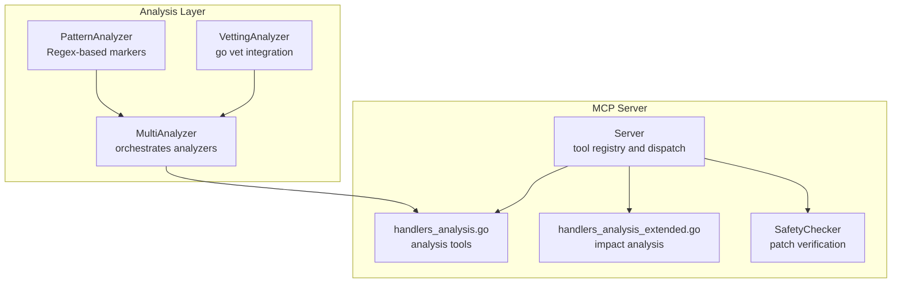
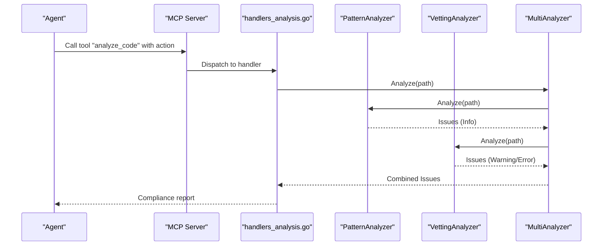
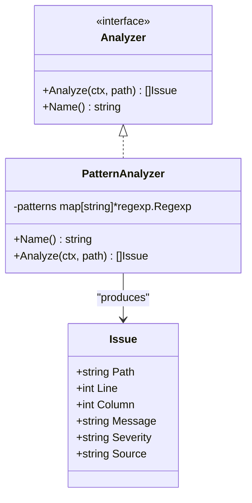
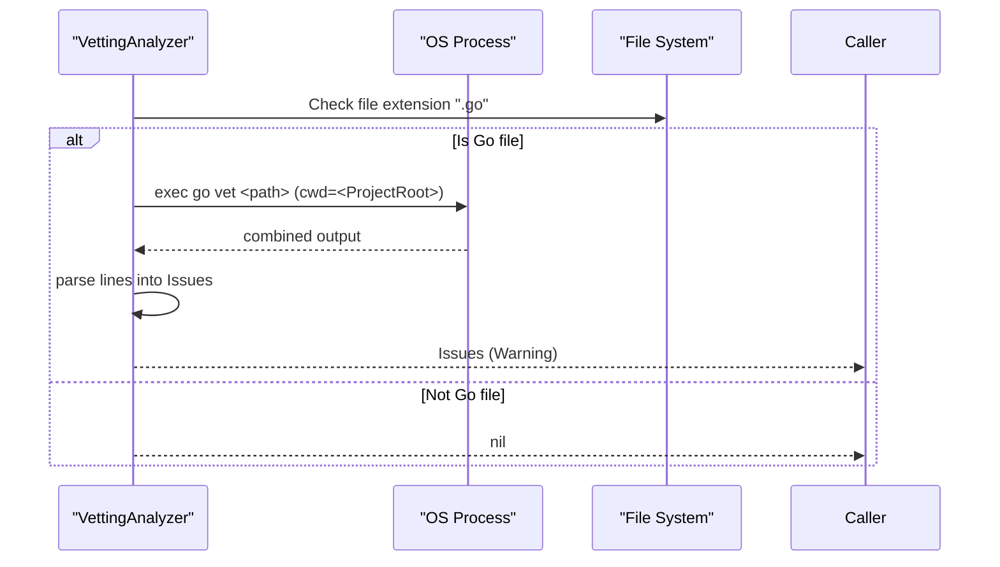
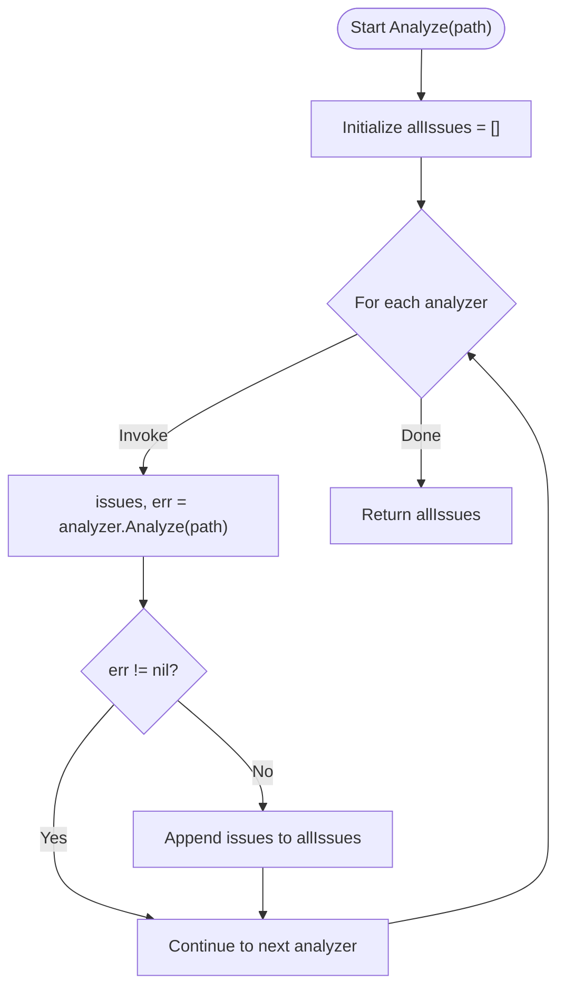
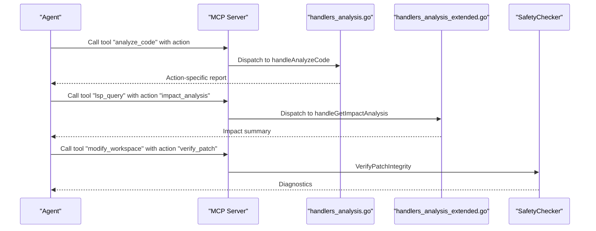
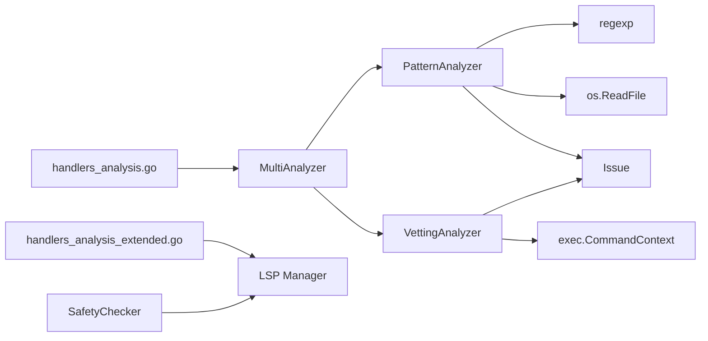

# Pattern Detection and Compliance Checking

<cite>
**Referenced Files in This Document**
- [analyzer.go](file://internal/analysis/analyzer.go)
- [handlers_analysis.go](file://internal/mcp/handlers_analysis.go)
- [handlers_analysis_extended.go](file://internal/mcp/handlers_analysis_extended.go)
- [server.go](file://internal/mcp/server.go)
- [safety.go](file://internal/mutation/safety.go)
- [README.md](file://README.md)
</cite>

## Table of Contents
1. [Introduction](#introduction)
2. [Project Structure](#project-structure)
3. [Core Components](#core-components)
4. [Architecture Overview](#architecture-overview)
5. [Detailed Component Analysis](#detailed-component-analysis)
6. [Dependency Analysis](#dependency-analysis)
7. [Performance Considerations](#performance-considerations)
8. [Troubleshooting Guide](#troubleshooting-guide)
9. [Conclusion](#conclusion)
10. [Appendices](#appendices)

## Introduction
This document explains the pattern-based analysis and compliance checking systems implemented in the repository. It focuses on:
- PatternAnalyzer: scanning code for markers like TODO, FIXME, HACK, and DEPRECATED.
- Regex pattern configuration and custom pattern definition.
- Compliance rule enforcement and severity assignment.
- VettingAnalyzer integration with the Go toolchain’s go vet for static analysis.
- Automated compliance reporting and practical examples.
- Performance optimization strategies for large codebases, incremental scanning, and integration with external linting tools.
- Guidance for building custom analyzers and extending compliance capabilities.

## Project Structure
The compliance and analysis features are primarily implemented under internal/analysis and integrated into the MCP server’s tooling under internal/mcp. The MCP server exposes a unified tool surface for code analysis and mutation.

**Diagram sources**
- [analyzer.go:29-143](file://internal/analysis/analyzer.go#L29-L143)
- [server.go:324-407](file://internal/mcp/server.go#L324-L407)
- [handlers_analysis.go:1196-1241](file://internal/mcp/handlers_analysis.go#L1196-L1241)
- [handlers_analysis_extended.go:12-82](file://internal/mcp/handlers_analysis_extended.go#L12-L82)
- [safety.go:33-126](file://internal/mutation/safety.go#L33-L126)

**Section sources**
- [README.md:11-19](file://README.md#L11-L19)
- [server.go:324-407](file://internal/mcp/server.go#L324-L407)

## Core Components
- PatternAnalyzer: Scans files for predefined regex patterns and emits issues with Info severity.
- VettingAnalyzer: Runs go vet on Go files and parses output into issues.
- MultiAnalyzer: Chains multiple analyzers and aggregates results.
- MCP Handlers: Expose analysis tools and integrate with broader server capabilities.
- SafetyChecker: Verifies patch integrity using LSP diagnostics.

**Section sources**
- [analyzer.go:29-143](file://internal/analysis/analyzer.go#L29-L143)
- [handlers_analysis.go:1196-1241](file://internal/mcp/handlers_analysis.go#L1196-L1241)
- [handlers_analysis_extended.go:12-82](file://internal/mcp/handlers_analysis_extended.go#L12-L82)
- [safety.go:33-126](file://internal/mutation/safety.go#L33-L126)

## Architecture Overview
The MCP server registers tools and routes requests to handlers. Analysis tools are exposed via analyze_code and related handlers. PatternAnalyzer and VettingAnalyzer are invoked by these handlers to produce compliance reports.

**Diagram sources**
- [server.go:324-407](file://internal/mcp/server.go#L324-L407)
- [handlers_analysis.go:1196-1241](file://internal/mcp/handlers_analysis.go#L1196-L1241)
- [analyzer.go:121-143](file://internal/analysis/analyzer.go#L121-L143)

## Detailed Component Analysis

### PatternAnalyzer
- Purpose: Detect markers indicating incomplete or problematic code.
- Patterns: Predefined regex for TODO, FIXME, HACK, DEPRECATED.
- Behavior: Reads file content, splits into lines, applies regex per line, and emits Issue entries with Info severity and source PatternAnalyzer.

**Diagram sources**
- [analyzer.go:23-70](file://internal/analysis/analyzer.go#L23-L70)

**Section sources**
- [analyzer.go:29-70](file://internal/analysis/analyzer.go#L29-L70)

### VettingAnalyzer (go vet integration)
- Purpose: Perform Go-specific static analysis using go vet.
- Behavior: Skips non-Go files; runs go vet on the target path within the configured project root; parses output lines into Issue entries with Warning severity.

**Diagram sources**
- [analyzer.go:72-119](file://internal/analysis/analyzer.go#L72-L119)

**Section sources**
- [analyzer.go:72-119](file://internal/analysis/analyzer.go#L72-L119)

### MultiAnalyzer
- Purpose: Compose multiple analyzers and merge their results.
- Behavior: Iterates analyzers in order, collects issues, and continues on analyzer errors.

**Diagram sources**
- [analyzer.go:121-143](file://internal/analysis/analyzer.go#L121-L143)

**Section sources**
- [analyzer.go:121-143](file://internal/analysis/analyzer.go#L121-L143)

### MCP Handlers and Compliance Reporting
- analyze_code: Routes to structural, duplication, dead code, and dependency checks. Pattern and vetting analysis can be composed via MultiAnalyzer and invoked from these handlers.
- Impact analysis: Uses LSP to compute “blast radius” of symbol changes.
- SafetyChecker: Verifies patches using LSP diagnostics to prevent introducing compile-time errors.

**Diagram sources**
- [handlers_analysis.go:1196-1241](file://internal/mcp/handlers_analysis.go#L1196-L1241)
- [handlers_analysis_extended.go:12-82](file://internal/mcp/handlers_analysis_extended.go#L12-L82)
- [safety.go:42-114](file://internal/mutation/safety.go#L42-L114)

**Section sources**
- [handlers_analysis.go:1196-1241](file://internal/mcp/handlers_analysis.go#L1196-L1241)
- [handlers_analysis_extended.go:12-82](file://internal/mcp/handlers_analysis_extended.go#L12-L82)
- [safety.go:42-114](file://internal/mutation/safety.go#L42-L114)

## Dependency Analysis
- PatternAnalyzer depends on:
  - File I/O for reading content.
  - Regular expressions for pattern matching.
  - Issue model for reporting.
- VettingAnalyzer depends on:
  - Executing external go vet binary.
  - Parsing textual output into structured issues.
- MultiAnalyzer composes arbitrary analyzers and merges results.
- MCP handlers depend on analyzers and LSP for impact and safety checks.

**Diagram sources**
- [analyzer.go:29-143](file://internal/analysis/analyzer.go#L29-L143)
- [handlers_analysis.go:1196-1241](file://internal/mcp/handlers_analysis.go#L1196-L1241)
- [handlers_analysis_extended.go:12-82](file://internal/mcp/handlers_analysis_extended.go#L12-L82)
- [safety.go:33-126](file://internal/mutation/safety.go#L33-L126)

**Section sources**
- [analyzer.go:29-143](file://internal/analysis/analyzer.go#L29-L143)
- [handlers_analysis.go:1196-1241](file://internal/mcp/handlers_analysis.go#L1196-L1241)
- [handlers_analysis_extended.go:12-82](file://internal/mcp/handlers_analysis_extended.go#L12-L82)
- [safety.go:33-126](file://internal/mutation/safety.go#L33-L126)

## Performance Considerations
- File I/O and regex scanning:
  - Current implementation reads entire files and splits by newline. For very large files, consider streaming or chunked scanning to reduce memory pressure.
- Regex compilation:
  - Patterns are compiled once per analyzer instance. Keep patterns minimal and reuse compiled regex instances.
- go vet invocation:
  - Spawning an external process per file can be expensive. Prefer batching or package-level vetting when feasible.
- Concurrency:
  - MultiAnalyzer processes analyzers sequentially. Consider parallelizing analyzer invocations with bounded concurrency to speed up large codebases.
- Incremental scanning:
  - Track last scanned timestamps or checksums per file and skip unchanged files.
- Output aggregation:
  - Combine issues from multiple analyzers and deduplicate by path/line/message to reduce noise.

[No sources needed since this section provides general guidance]

## Troubleshooting Guide
- PatternAnalyzer returns no issues:
  - Ensure the file encoding and line endings are compatible with string splitting.
  - Confirm the marker text matches the expected format (e.g., TODO:, TODO , etc.).
- VettingAnalyzer returns no issues:
  - Verify go vet is installed and on PATH.
  - Confirm the target path is within the configured ProjectRoot.
  - Check that the file is a Go file (.go).
- go vet output parsing:
  - The parser expects lines formatted as file:line:column: message. Adjust parsing if output format varies.
- LSP diagnostics for patch verification:
  - If timeouts occur, increase wait duration or ensure the LSP server is ready.
  - Validate that the didOpen notification is accepted and diagnostics are published.

**Section sources**
- [analyzer.go:83-119](file://internal/analysis/analyzer.go#L83-L119)
- [safety.go:105-114](file://internal/mutation/safety.go#L105-L114)

## Conclusion
The repository provides a modular, extensible foundation for pattern-based compliance checking and Go-specific vetting. PatternAnalyzer and VettingAnalyzer can be composed via MultiAnalyzer and surfaced through MCP handlers to deliver automated compliance reporting. With targeted performance improvements—such as incremental scanning, parallelization, and smarter batching—the system can scale to large codebases while maintaining deterministic, deterministic behavior.

[No sources needed since this section summarizes without analyzing specific files]

## Appendices

### A. Pattern Matching Configuration Examples
- Predefined categories: TODO, FIXME, HACK, DEPRECATED.
- Severity: PatternAnalyzer emits Info; VettingAnalyzer emits Warning for go vet findings.
- Custom patterns:
  - Extend PatternAnalyzer by adding new keys and compiled regexes in the patterns map.
  - Assign severity by mapping Issue.Severity per analyzer’s domain (e.g., Info vs Warning).
- Compliance rule enforcement:
  - Aggregate issues from MultiAnalyzer and filter/report by severity and source.
  - Integrate with MCP tools to expose compliance reports to agents.

**Section sources**
- [analyzer.go:34-43](file://internal/analysis/analyzer.go#L34-L43)
- [analyzer.go:58-65](file://internal/analysis/analyzer.go#L58-L65)
- [analyzer.go:111-115](file://internal/analysis/analyzer.go#L111-L115)

### B. Integrating External Linters
- PatternAnalyzer and VettingAnalyzer focus on lightweight, deterministic checks.
- For broader linting, invoke external tools from handlers or analyzers and convert their output into Issue entries.
- Use SafetyChecker to validate changes against LSP diagnostics before applying mutations.

**Section sources**
- [handlers_analysis.go:1196-1241](file://internal/mcp/handlers_analysis.go#L1196-L1241)
- [safety.go:42-114](file://internal/mutation/safety.go#L42-L114)

### C. Developing Custom Analyzers
- Implement the Analyzer interface with Analyze(ctx, path) and Name().
- Emit Issue entries with accurate Path, Line, Message, Severity, and Source.
- Compose analyzers using MultiAnalyzer to build layered compliance checks.

**Section sources**
- [analyzer.go:23-27](file://internal/analysis/analyzer.go#L23-L27)
- [analyzer.go:121-128](file://internal/analysis/analyzer.go#L121-L128)