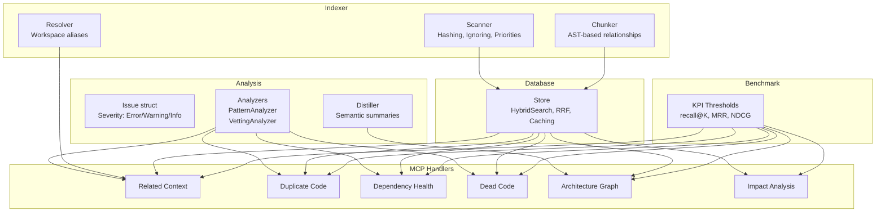
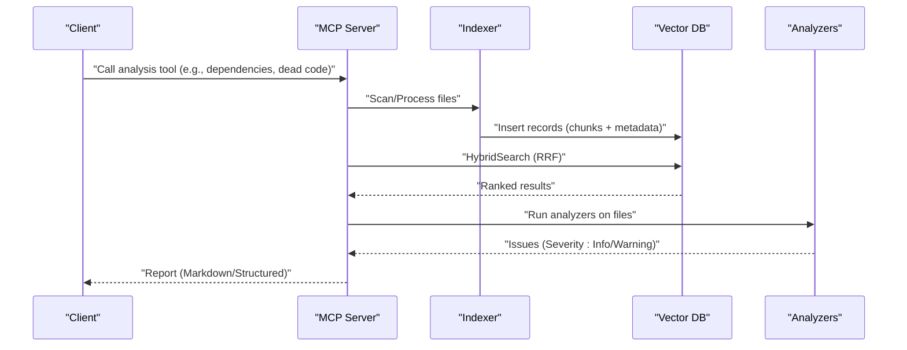
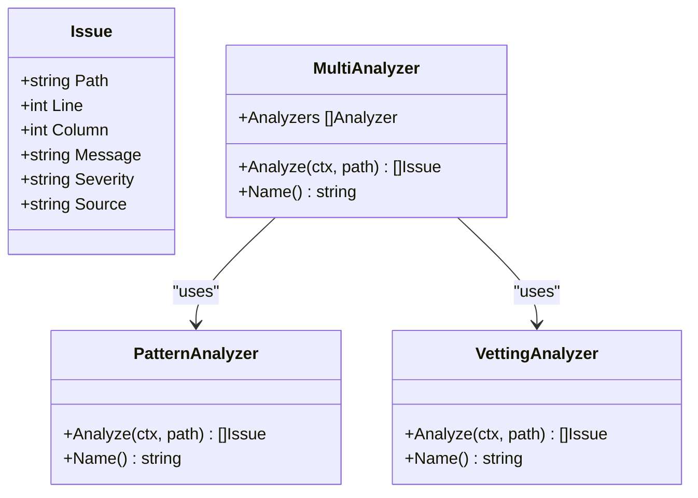
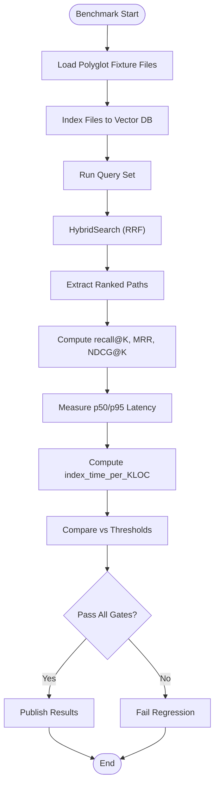
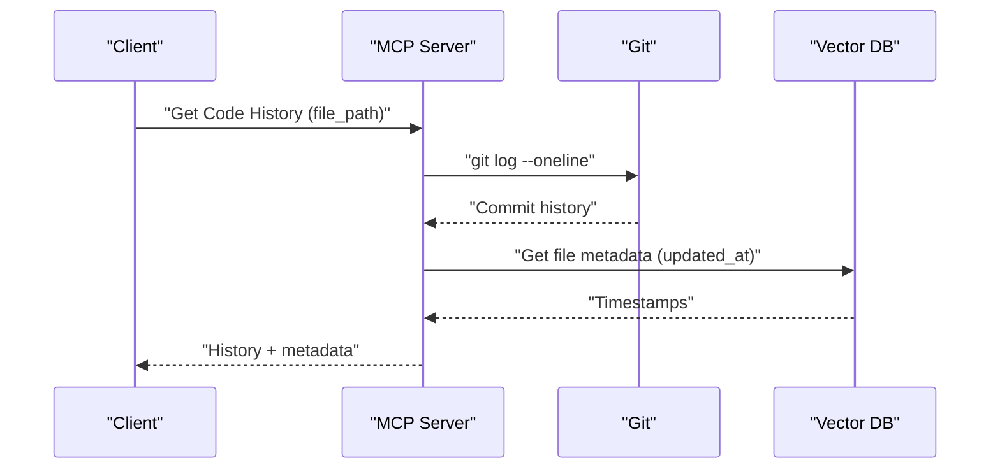
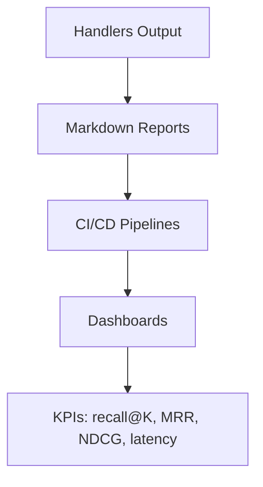
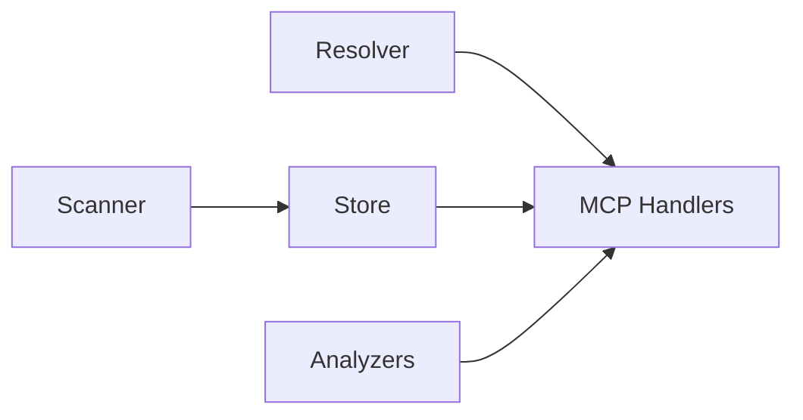

# Quality Metrics and Reporting

<cite>
**Referenced Files in This Document**
- [analyzer.go](file://internal/analysis/analyzer.go)
- [distiller.go](file://internal/analysis/distiller.go)
- [handlers_analysis.go](file://internal/mcp/handlers_analysis.go)
- [handlers_analysis_extended.go](file://internal/mcp/handlers_analysis_extended.go)
- [store.go](file://internal/db/store.go)
- [scanner.go](file://internal/indexer/scanner.go)
- [resolver.go](file://internal/indexer/resolver.go)
- [config.go](file://internal/config/config.go)
- [retrieval_bench_test.go](file://benchmark/retrieval_bench_test.go)
- [kpi_thresholds.json](file://benchmark/fixtures/polyglot/kpi_thresholds.json)
- [technology-modernization-plan.md](file://docs/technology-modernization-plan.md)
</cite>

## Table of Contents
1. [Introduction](#introduction)
2. [Project Structure](#project-structure)
3. [Core Components](#core-components)
4. [Architecture Overview](#architecture-overview)
5. [Detailed Component Analysis](#detailed-component-analysis)
6. [Dependency Analysis](#dependency-analysis)
7. [Performance Considerations](#performance-considerations)
8. [Troubleshooting Guide](#troubleshooting-guide)
9. [Conclusion](#conclusion)
10. [Appendices](#appendices)

## Introduction
This document explains the code quality metrics calculation and reporting systems implemented in the repository. It focuses on:
- The Issue struct definition and severity classification system (Error, Warning, Info)
- Quality metric computation using retrieval KPIs (recall@K, MRR, NDCG)
- Trend analysis and historical tracking capabilities
- Reporting formats, categorization, and automated dashboards
- Examples of quality score calculation, trend visualization, and integration with project management tools
- Performance considerations for large-scale analysis, caching strategies, and real-time monitoring
- Guidance on customizing thresholds, integrating external quality tools, and exporting reports

## Project Structure
The quality and reporting system spans several modules:
- Analysis: Issue detection and summarization
- MCP Handlers: Tools for analysis, dependency checks, dead code detection, and reporting
- Indexer: File scanning, chunking, hashing, and indexing
- Database: Vector storage, hybrid search, and metadata management
- Benchmark: Deterministic KPI thresholds and scoring functions
- Docs: Technology modernization plan with operational excellence guidance

**Diagram sources**
- [analyzer.go:13-144](file://internal/analysis/analyzer.go#L13-L144)
- [handlers_analysis.go:21-1242](file://internal/mcp/handlers_analysis.go#L21-L1242)
- [handlers_analysis_extended.go:12-83](file://internal/mcp/handlers_analysis_extended.go#L12-L83)
- [scanner.go:67-485](file://internal/indexer/scanner.go#L67-L485)
- [store.go:80-409](file://internal/db/store.go#L80-L409)
- [retrieval_bench_test.go:55-224](file://benchmark/retrieval_bench_test.go#L55-L224)

**Section sources**
- [analyzer.go:13-144](file://internal/analysis/analyzer.go#L13-L144)
- [handlers_analysis.go:21-1242](file://internal/mcp/handlers_analysis.go#L21-L1242)
- [handlers_analysis_extended.go:12-83](file://internal/mcp/handlers_analysis_extended.go#L12-L83)
- [scanner.go:67-485](file://internal/indexer/scanner.go#L67-L485)
- [store.go:80-409](file://internal/db/store.go#L80-L409)
- [retrieval_bench_test.go:55-224](file://benchmark/retrieval_bench_test.go#L55-L224)

## Core Components
- Issue struct and severity classification:
  - Fields: Path, Line, Column, Message, Severity, Source
  - Severity values observed: Info, Warning
  - Used by analyzers to report findings consistently
- Analyzers:
  - PatternAnalyzer: Scans for markers like TODO, FIXME, HACK, DEPRECATED and reports as Info
  - VettingAnalyzer: Runs go vet on Go files and reports warnings
  - MultiAnalyzer: Aggregates results from multiple analyzers
- Database and search:
  - HybridSearch with Reciprocal Rank Fusion (RRF) and dynamic weighting
  - Priority and recency boosting for ranking
  - JSON metadata caching for efficient lexical filtering
- Indexing and chunking:
  - Hash-based incremental indexing with deletion-before-insert atomic updates
  - Priority and function score metadata for ranking
  - Workspace resolution for monorepo imports

**Section sources**
- [analyzer.go:13-144](file://internal/analysis/analyzer.go#L13-L144)
- [store.go:223-336](file://internal/db/store.go#L223-L336)
- [store.go:633-664](file://internal/db/store.go#L633-L664)
- [scanner.go:67-485](file://internal/indexer/scanner.go#L67-L485)

## Architecture Overview
The system integrates indexing, vector search, and analysis tools to produce quality insights and reports.

**Diagram sources**
- [handlers_analysis.go:313-472](file://internal/mcp/handlers_analysis.go#L313-L472)
- [handlers_analysis.go:637-777](file://internal/mcp/handlers_analysis.go#L637-L777)
- [scanner.go:67-191](file://internal/indexer/scanner.go#L67-L191)
- [store.go:223-336](file://internal/db/store.go#L223-L336)
- [analyzer.go:29-119](file://internal/analysis/analyzer.go#L29-L119)

## Detailed Component Analysis

### Issue Struct and Severity Classification
- Definition: Path, Line, Column, Message, Severity, Source
- Severity values:
  - Info: PatternAnalyzer findings (e.g., TODO/DEPRECATED)
  - Warning: VettingAnalyzer findings (go vet)
- MultiAnalyzer aggregates issues from multiple analyzers and continues on errors

**Diagram sources**
- [analyzer.go:13-144](file://internal/analysis/analyzer.go#L13-L144)

**Section sources**
- [analyzer.go:13-144](file://internal/analysis/analyzer.go#L13-L144)

### Quality Metric Computation (KPIs)
- KPIs measured in benchmarks:
  - recall@K: fraction of queries where expected path appears in top-K
  - MRR: mean of reciprocal ranks for expected path
  - NDCG@K: normalized discounted cumulative gain at K
  - index_time_per_KLOC: index duration per 1K lines of code
  - p50/p95 latency: latency percentiles
- Thresholds loaded from fixture JSON for regression gating

**Diagram sources**
- [retrieval_bench_test.go:92-224](file://benchmark/retrieval_bench_test.go#L92-L224)
- [kpi_thresholds.json:1-5](file://benchmark/fixtures/polyglot/kpi_thresholds.json#L1-L5)

**Section sources**
- [retrieval_bench_test.go:55-224](file://benchmark/retrieval_bench_test.go#L55-L224)
- [kpi_thresholds.json:1-5](file://benchmark/fixtures/polyglot/kpi_thresholds.json#L1-L5)

### Trend Analysis and Historical Tracking
- Historical tracking:
  - Git history retrieval via handler for a specific file
  - File metadata includes updated_at timestamps for recency boosting
  - Project status stored in DB for operational dashboards
- Trend visualization:
  - Dashboards can track KPIs over time using persisted metrics and status
  - Technology modernization plan proposes publishing dashboard templates

**Diagram sources**
- [handlers_analysis.go:988-1017](file://internal/mcp/handlers_analysis.go#L988-L1017)
- [store.go:471-482](file://internal/db/store.go#L471-L482)

**Section sources**
- [handlers_analysis.go:988-1017](file://internal/mcp/handlers_analysis.go#L988-L1017)
- [store.go:471-482](file://internal/db/store.go#L471-L482)
- [technology-modernization-plan.md:109-115](file://docs/technology-modernization-plan.md#L109-L115)

### Reporting Formats and Automated Dashboards
- Reports generated as Markdown blocks:
  - Dependency health, architecture graphs, dead code, missing tests, endpoint lists
- Automated dashboards:
  - Dashboard templates published for latency and index health
  - Release pipeline checks include benchmarks and tests

**Diagram sources**
- [handlers_analysis.go:313-472](file://internal/mcp/handlers_analysis.go#L313-L472)
- [handlers_analysis.go:557-634](file://internal/mcp/handlers_analysis.go#L557-L634)
- [technology-modernization-plan.md:109-115](file://docs/technology-modernization-plan.md#L109-L115)

**Section sources**
- [handlers_analysis.go:313-472](file://internal/mcp/handlers_analysis.go#L313-L472)
- [handlers_analysis.go:557-634](file://internal/mcp/handlers_analysis.go#L557-L634)
- [technology-modernization-plan.md:109-115](file://docs/technology-modernization-plan.md#L109-L115)

### Example: Quality Score Calculation
- Inputs:
  - Query set with expected paths
  - HybridSearch results
- Computation:
  - recall@K: count of queries with expected path in top-K / total queries
  - MRR: mean of 1/rank for expected path
  - NDCG@K: compute DCG with binary relevance, divide by IDCG
- Threshold gating:
  - Fail if any KPI falls below configured thresholds

**Section sources**
- [retrieval_bench_test.go:164-224](file://benchmark/retrieval_bench_test.go#L164-L224)
- [kpi_thresholds.json:1-5](file://benchmark/fixtures/polyglot/kpi_thresholds.json#L1-L5)

### Example: Trend Visualization
- Use historical KPIs over time to plot:
  - recall@K, MRR, NDCG trends
  - p50/p95 latency trends
  - index_time_per_KLOC trend
- Dashboards can be templated and integrated into CI/CD

**Section sources**
- [technology-modernization-plan.md:109-115](file://docs/technology-modernization-plan.md#L109-L115)

### Integration with Project Management Tools
- Dependency health reports list missing external dependencies and affected files
- Architecture graph generation supports integration with PM tools for dependency tracking
- Impact analysis via LSP helps assess blast radius for change requests

**Section sources**
- [handlers_analysis.go:313-472](file://internal/mcp/handlers_analysis.go#L313-L472)
- [handlers_analysis.go:557-634](file://internal/mcp/handlers_analysis.go#L557-L634)
- [handlers_analysis_extended.go:12-83](file://internal/mcp/handlers_analysis_extended.go#L12-L83)

## Dependency Analysis
- Indexer depends on:
  - Scanner for file discovery, hashing, and priorities
  - Resolver for monorepo workspace and path alias resolution
- Database provides:
  - HybridSearch with RRF and boosting
  - Metadata caching for JSON arrays
- Handlers depend on:
  - Indexer store for retrieval
  - Analyzers for issue detection

**Diagram sources**
- [scanner.go:67-485](file://internal/indexer/scanner.go#L67-L485)
- [resolver.go:16-189](file://internal/indexer/resolver.go#L16-L189)
- [store.go:80-409](file://internal/db/store.go#L80-L409)
- [handlers_analysis.go:21-1242](file://internal/mcp/handlers_analysis.go#L21-L1242)
- [analyzer.go:23-144](file://internal/analysis/analyzer.go#L23-L144)

**Section sources**
- [scanner.go:67-485](file://internal/indexer/scanner.go#L67-L485)
- [resolver.go:16-189](file://internal/indexer/resolver.go#L16-L189)
- [store.go:80-409](file://internal/db/store.go#L80-L409)
- [handlers_analysis.go:21-1242](file://internal/mcp/handlers_analysis.go#L21-L1242)
- [analyzer.go:23-144](file://internal/analysis/analyzer.go#L23-L144)

## Performance Considerations
- HybridSearch with RRF and dynamic lexical/vector weights
- Parallel lexical filtering with worker pools
- JSON metadata parsing cached to avoid repeated unmarshalling
- Incremental indexing with hash comparison and atomic delete-before-insert
- Parameter clamping and rune-safe truncation to bound resource usage
- Embedding batch fallback and bounded concurrency

**Section sources**
- [store.go:223-336](file://internal/db/store.go#L223-L336)
- [store.go:633-664](file://internal/db/store.go#L633-L664)
- [scanner.go:67-191](file://internal/indexer/scanner.go#L67-L191)
- [technology-modernization-plan.md:65-80](file://docs/technology-modernization-plan.md#L65-L80)

## Troubleshooting Guide
- Dimension mismatch in vector DB:
  - Detected when embedding dimensions change; requires clearing DB and restarting
- Missing manifests for dependency health:
  - Supported: package.json, go.mod, requirements.txt
- Empty or untracked files for history:
  - git log returns no output for untracked files
- Analyzer failures:
  - MultiAnalyzer continues on analyzer errors to ensure partial results

**Section sources**
- [store.go:35-64](file://internal/db/store.go#L35-L64)
- [handlers_analysis.go:313-472](file://internal/mcp/handlers_analysis.go#L313-L472)
- [handlers_analysis.go:988-1017](file://internal/mcp/handlers_analysis.go#L988-L1017)
- [analyzer.go:132-143](file://internal/analysis/analyzer.go#L132-L143)

## Conclusion
The system provides a robust foundation for quality metrics and reporting:
- Consistent Issue struct with severity classification
- Deterministic KPIs (recall@K, MRR, NDCG) with threshold gating
- Hybrid search with RRF and boosting for accurate results
- Incremental indexing and caching for scalability
- Reporting in Markdown and integration-ready dashboards
- Guidance for customization, external tool integration, and export formats

## Appendices

### Appendix A: Customizing Quality Thresholds
- Adjust thresholds in the fixture JSON to enforce stricter or relaxed gates
- Use thresholds to gate releases and regressions

**Section sources**
- [kpi_thresholds.json:1-5](file://benchmark/fixtures/polyglot/kpi_thresholds.json#L1-L5)

### Appendix B: Integrating External Quality Tools
- Add analyzers implementing the Analyzer interface
- Use MultiAnalyzer to combine built-in and custom analyzers
- Emit issues with Severity aligned to your policy (e.g., Info/Warning/Error)

**Section sources**
- [analyzer.go:23-27](file://internal/analysis/analyzer.go#L23-L27)
- [analyzer.go:121-144](file://internal/analysis/analyzer.go#L121-L144)

### Appendix C: Exporting Analysis Reports
- Handlers return structured text/markdown suitable for export
- Combine with CI/CD to publish artifacts and dashboards

**Section sources**
- [handlers_analysis.go:313-472](file://internal/mcp/handlers_analysis.go#L313-L472)
- [technology-modernization-plan.md:109-115](file://docs/technology-modernization-plan.md#L109-L115)