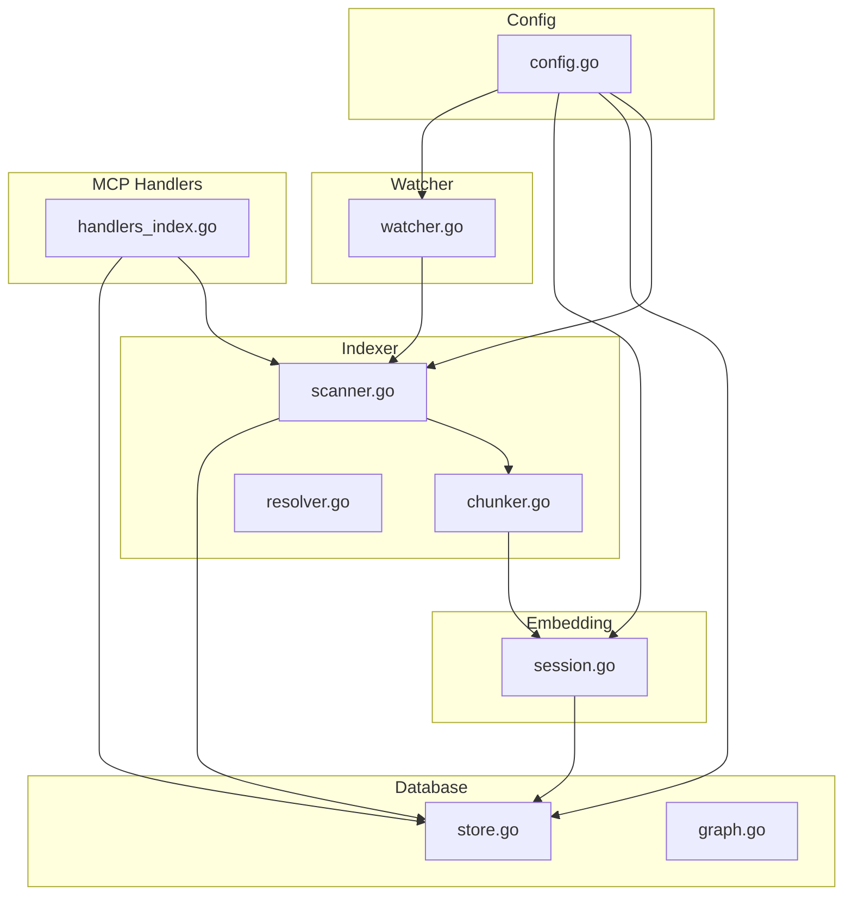
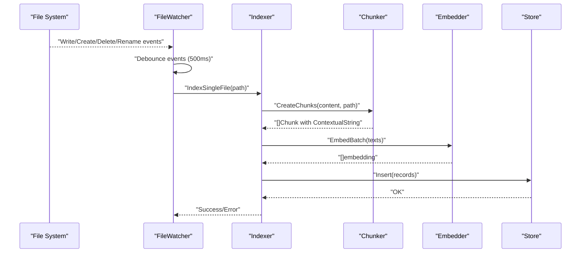
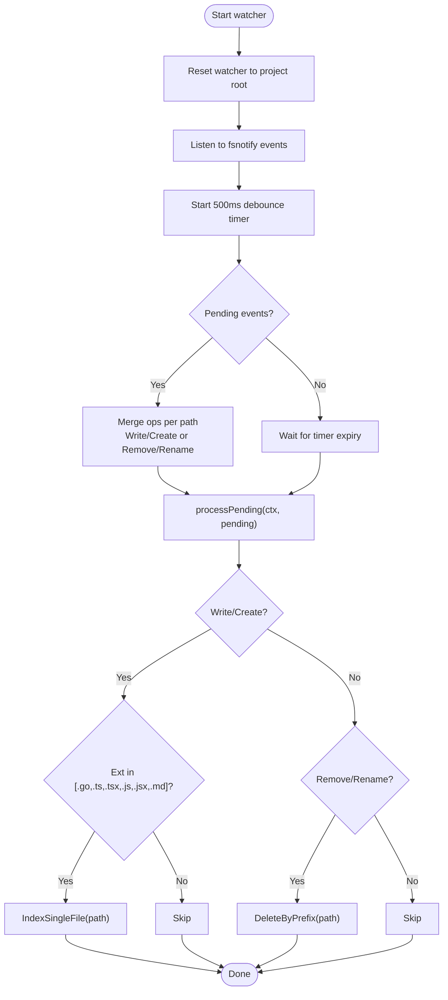
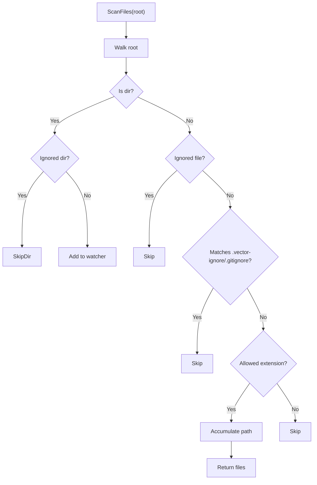
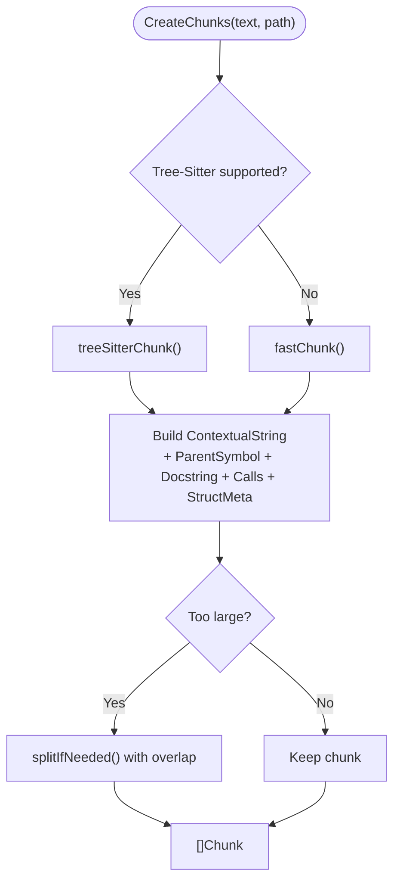
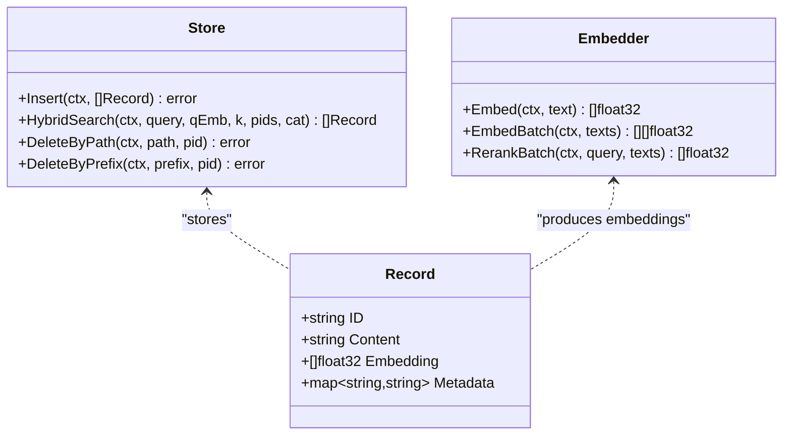
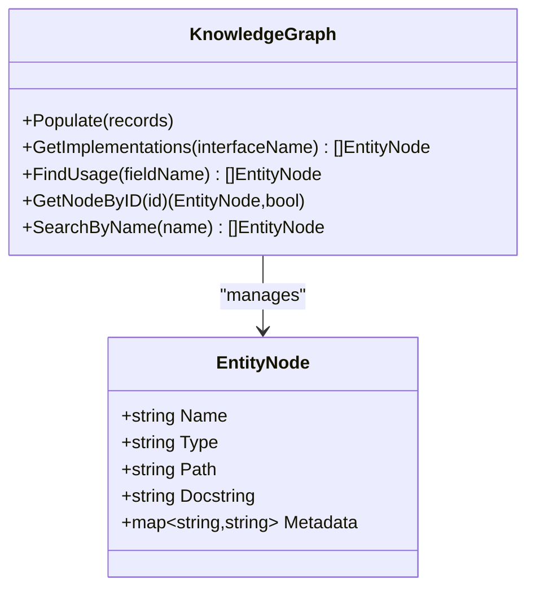
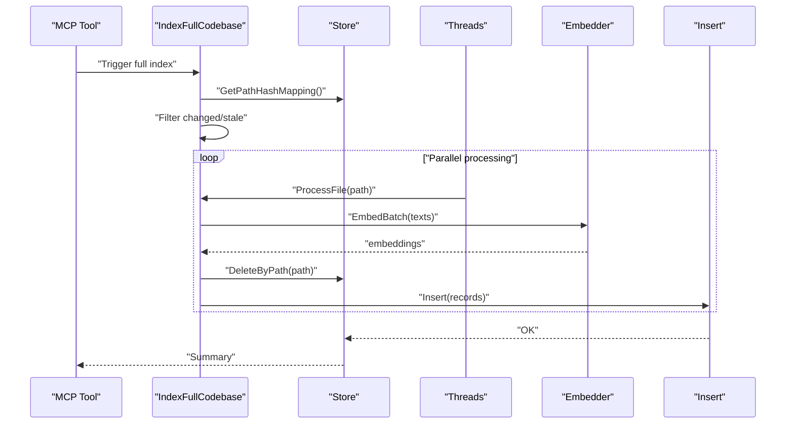
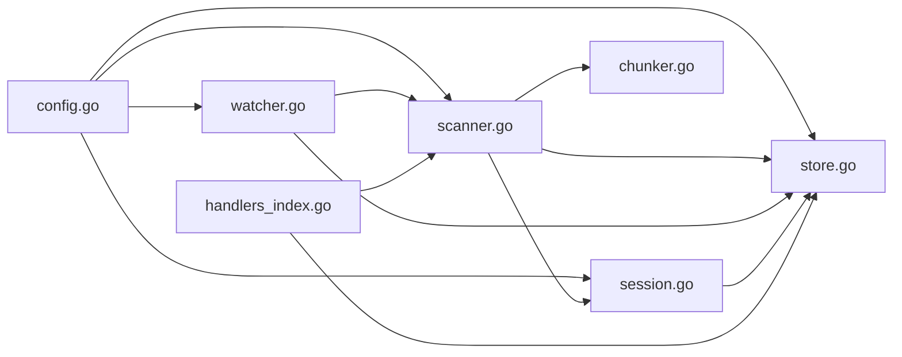

# Code Indexing System

<cite>
**Referenced Files in This Document**
- [scanner.go](file://internal/indexer/scanner.go)
- [chunker.go](file://internal/indexer/chunker.go)
- [resolver.go](file://internal/indexer/resolver.go)
- [watcher.go](file://internal/watcher/watcher.go)
- [store.go](file://internal/db/store.go)
- [graph.go](file://internal/db/graph.go)
- [session.go](file://internal/embedding/session.go)
- [config.go](file://internal/config/config.go)
- [handlers_index.go](file://internal/mcp/handlers_index.go)
- [scanner_test.go](file://internal/indexer/scanner_test.go)
- [chunker_test.go](file://internal/indexer/chunker_test.go)
- [retrieval_bench_test.go](file://benchmark/retrieval_bench_test.go)
</cite>

## Table of Contents
1. [Introduction](#introduction)
2. [Project Structure](#project-structure)
3. [Core Components](#core-components)
4. [Architecture Overview](#architecture-overview)
5. [Detailed Component Analysis](#detailed-component-analysis)
6. [Dependency Analysis](#dependency-analysis)
7. [Performance Considerations](#performance-considerations)
8. [Troubleshooting Guide](#troubleshooting-guide)
9. [Conclusion](#conclusion)
10. [Appendices](#appendices)

## Introduction
This document explains the code indexing system in Vector MCP Go. It covers how files are watched and filtered, how content is chunked using language-specific parsers, how relationships between code entities are extracted, and how vector embeddings are produced. It also documents the indexing pipeline from file discovery to vector insertion, supported languages, chunking strategies, metadata enrichment, configuration options, performance characteristics, scalability limits, troubleshooting, and monitoring techniques.

## Project Structure
The indexing system spans several modules:
- Indexer: file scanning, chunking, and processing
- Watcher: file system event monitoring with debouncing
- Database: vector storage and hybrid search
- Embedding: ONNX-based embedding sessions and batching
- MCP Handlers: orchestration and diagnostics
- Tests and Benchmarks: validation and performance baselines

**Diagram sources**
- [scanner.go:68-191](file://internal/indexer/scanner.go#L68-L191)
- [chunker.go:43-101](file://internal/indexer/chunker.go#L43-L101)
- [resolver.go:16-27](file://internal/indexer/resolver.go#L16-L27)
- [watcher.go:58-86](file://internal/watcher/watcher.go#L58-L86)
- [store.go:35-64](file://internal/db/store.go#L35-L64)
- [graph.go:26-33](file://internal/db/graph.go#L26-L33)
- [session.go:38-65](file://internal/embedding/session.go#L38-L65)
- [handlers_index.go:16-38](file://internal/mcp/handlers_index.go#L16-L38)
- [config.go:30-129](file://internal/config/config.go#L30-L129)

**Section sources**
- [scanner.go:68-191](file://internal/indexer/scanner.go#L68-L191)
- [chunker.go:43-101](file://internal/indexer/chunker.go#L43-L101)
- [watcher.go:58-86](file://internal/watcher/watcher.go#L58-L86)
- [store.go:35-64](file://internal/db/store.go#L35-L64)
- [session.go:38-65](file://internal/embedding/session.go#L38-L65)
- [handlers_index.go:16-38](file://internal/mcp/handlers_index.go#L16-L38)
- [config.go:30-129](file://internal/config/config.go#L30-L129)

## Core Components
- File Scanner and Processor: discovers files, filters by extension and ignore rules, hashes for up-to-date checks, and processes content into chunks.
- Chunker: language-aware chunking using Tree-Sitter for supported languages; fallback fast chunking for others; relationship extraction and metadata enrichment.
- Watcher: file system monitoring with debounced event handling; live indexing on write/create; cleanup on remove/rename.
- Database Store: vector persistence, hybrid search, lexical filtering, and status reporting.
- Embedding Sessions: ONNX runtime-based embedding with pooling and normalization; optional reranking.
- MCP Handlers: trigger indexing, manage context deletion, report status and diagnostics.
- Configuration: environment-driven settings for roots, models, dimensions, and runtime toggles.

**Section sources**
- [scanner.go:68-191](file://internal/indexer/scanner.go#L68-L191)
- [chunker.go:43-101](file://internal/indexer/chunker.go#L43-L101)
- [watcher.go:121-196](file://internal/watcher/watcher.go#L121-L196)
- [store.go:66-78](file://internal/db/store.go#L66-L78)
- [session.go:176-271](file://internal/embedding/session.go#L176-L271)
- [handlers_index.go:16-38](file://internal/mcp/handlers_index.go#L16-L38)
- [config.go:30-129](file://internal/config/config.go#L30-L129)

## Architecture Overview
The indexing pipeline integrates file watching, scanning, chunking, embedding, and storage. Live updates are handled by the watcher; full scans are orchestrated via MCP tools.

**Diagram sources**
- [watcher.go:121-196](file://internal/watcher/watcher.go#L121-L196)
- [scanner.go:193-355](file://internal/indexer/scanner.go#L193-L355)
- [chunker.go:43-101](file://internal/indexer/chunker.go#L43-L101)
- [session.go:261-271](file://internal/embedding/session.go#L261-L271)
- [store.go:66-78](file://internal/db/store.go#L66-L78)

## Detailed Component Analysis

### File Watching and Debounced Event Handling
- Watches the configured project root recursively, skipping ignored directories.
- Debounces events with a 500 ms timer; pending events are merged per path.
- On Write/Create for supported extensions (.go, .ts, .tsx, .js, .jsx, .md), triggers single-file indexing.
- On Remove/Rename, deletes matching records by path/prefix.
- Proactively checks architectural compliance and triggers re-distillation for dependents.

**Diagram sources**
- [watcher.go:58-196](file://internal/watcher/watcher.go#L58-L196)

**Section sources**
- [watcher.go:58-196](file://internal/watcher/watcher.go#L58-L196)

### File Scanning and Filtering
- Walks the project root, applying ignore rules in order:
  - Default ignored directories (e.g., node_modules, .git, dist).
  - Default ignored files (e.g., lockfiles, .map, images).
  - Loads .vector-ignore if present; otherwise falls back to .gitignore.
  - Filters by allowed extensions list.
- Computes SHA-256 hashes per file for up-to-date checks.
- Supports full-codebase indexing with atomic replacement of chunks per file.

**Diagram sources**
- [scanner.go:361-423](file://internal/indexer/scanner.go#L361-L423)

**Section sources**
- [scanner.go:361-423](file://internal/indexer/scanner.go#L361-L423)
- [scanner_test.go:157-274](file://internal/indexer/scanner_test.go#L157-L274)

### Chunking and Relationship Extraction
- Language-aware chunking:
  - Supported extensions: .go, .js/.jsx, .ts, .tsx, .php, .py, .rs, .html, .css.
  - Uses Tree-Sitter to extract top-level entities (functions, classes, types, tags, rulesets).
  - Builds contextual strings with file path, entity scope, type, docstring, calls, and structural metadata.
  - Splits large chunks with overlap to respect model context windows.
- Fallback chunking:
  - Rune-safe slicing with fixed chunk size and overlap for unsupported extensions.
- Relationship extraction:
  - Imports/exports for JavaScript/TypeScript and PHP.
  - Import statements for Go.
- Structural metadata:
  - Field names and types for Go structs.
  - Method names for Go interfaces.
  - Properties for TS/JS classes.
- Function scoring:
  - Heuristic based on line count and call count.

**Diagram sources**
- [chunker.go:43-101](file://internal/indexer/chunker.go#L43-L101)
- [chunker.go:111-421](file://internal/indexer/chunker.go#L111-L421)
- [chunker.go:724-758](file://internal/indexer/chunker.go#L724-L758)

**Section sources**
- [chunker.go:43-101](file://internal/indexer/chunker.go#L43-L101)
- [chunker.go:111-421](file://internal/indexer/chunker.go#L111-L421)
- [chunker.go:537-577](file://internal/indexer/chunker.go#L537-L577)
- [chunker.go:594-646](file://internal/indexer/chunker.go#L594-L646)
- [chunker.go:648-722](file://internal/indexer/chunker.go#L648-L722)
- [chunker.go:724-758](file://internal/indexer/chunker.go#L724-L758)
- [chunker_test.go:8-36](file://internal/indexer/chunker_test.go#L8-L36)
- [chunker_test.go:107-133](file://internal/indexer/chunker_test.go#L107-L133)
- [chunker_test.go:134-196](file://internal/indexer/chunker_test.go#L134-L196)
- [chunker_test.go:198-264](file://internal/indexer/chunker_test.go#L198-L264)
- [chunker_test.go:266-311](file://internal/indexer/chunker_test.go#L266-L311)

### Metadata Enrichment and Vector Creation
- Per-chunk metadata includes:
  - path, project_id, category (code/document), updated_at, hash, relationships, symbols, parent_symbol, type, name, calls, priority, function_score, docstring, structural_metadata, start_line, end_line.
- File-level metadata record inserted with a dummy embedding to anchor file-level attributes.
- Embeddings generated via Embedder interface; batch embedding with fallback to sequential on failure.
- Deterministic chunk IDs for debugging; file metadata IDs derived from path and project.

**Diagram sources**
- [store.go:27-33](file://internal/db/store.go#L27-L33)
- [store.go:66-78](file://internal/db/store.go#L66-L78)
- [session.go:29-32](file://internal/embedding/session.go#L29-L32)
- [session.go:261-271](file://internal/embedding/session.go#L261-L271)

**Section sources**
- [scanner.go:246-334](file://internal/indexer/scanner.go#L246-L334)
- [store.go:66-78](file://internal/db/store.go#L66-L78)
- [session.go:261-271](file://internal/embedding/session.go#L261-L271)

### Knowledge Graph Construction
- Builds a lightweight knowledge graph from indexed records:
  - Nodes keyed by record ID with name, type, path, docstring, and structural metadata.
  - Edges and implementations inferred from metadata (e.g., interface implementations).
- Enables higher-order reasoning and cross-entity queries.

**Diagram sources**
- [graph.go:9-16](file://internal/db/graph.go#L9-L16)
- [graph.go:26-33](file://internal/db/graph.go#L26-L33)
- [graph.go:35-105](file://internal/db/graph.go#L35-L105)

**Section sources**
- [graph.go:35-105](file://internal/db/graph.go#L35-L105)

### Configuration Options
- Environment-driven configuration supports:
  - Project root, data directory, database path, models directory, log path.
  - Model names (embedding and optional reranker), HF token.
  - Dimension, watcher toggles, live indexing toggle, embedder pool size, API port.
- Relative path utilities and environment loading.

**Section sources**
- [config.go:30-129](file://internal/config/config.go#L30-L129)

### Indexing Pipeline: From Detection to Vectors
- Full codebase indexing:
  - Discover files, compute hashes, skip unchanged, delete stale paths, process changed files concurrently, insert batches atomically.
- Single-file indexing:
  - Hash, process, delete old chunks, insert new records.
- Hybrid search and lexical filtering:
  - Concurrent vector and lexical search with Reciprocal Rank Fusion (RRF), dynamic weighting, and boosting by function_score, recency, and priority.

**Diagram sources**
- [handlers_index.go:16-38](file://internal/mcp/handlers_index.go#L16-L38)
- [scanner.go:68-191](file://internal/indexer/scanner.go#L68-L191)
- [scanner.go:193-355](file://internal/indexer/scanner.go#L193-L355)
- [store.go:411-414](file://internal/db/store.go#L411-L414)
- [store.go:66-78](file://internal/db/store.go#L66-L78)

**Section sources**
- [handlers_index.go:16-38](file://internal/mcp/handlers_index.go#L16-L38)
- [scanner.go:68-191](file://internal/indexer/scanner.go#L68-L191)
- [scanner.go:193-355](file://internal/indexer/scanner.go#L193-L355)
- [store.go:411-414](file://internal/db/store.go#L411-L414)
- [store.go:66-78](file://internal/db/store.go#L66-L78)

## Dependency Analysis
- Indexer depends on:
  - Config for project root and dimensions.
  - DB Store for persistence and status.
  - Embedder for vector generation.
  - Tree-Sitter libraries for language parsing.
- Watcher depends on:
  - fsnotify for OS events.
  - Indexer for single-file indexing.
  - DB Store for deletions and status.
  - Analyzer/Distiller for proactive checks.
- Embedder depends on:
  - ONNX runtime and tokenizer.
  - Model configuration and dimensions.
- MCP Handlers depend on:
  - Indexer and Store for orchestration and diagnostics.

**Diagram sources**
- [config.go:30-129](file://internal/config/config.go#L30-L129)
- [scanner.go:58-65](file://internal/indexer/scanner.go#L58-L65)
- [chunker.go:3-20](file://internal/indexer/chunker.go#L3-L20)
- [watcher.go:38-55](file://internal/watcher/watcher.go#L38-L55)
- [store.go:19-25](file://internal/db/store.go#L19-L25)
- [session.go:3-14](file://internal/embedding/session.go#L3-L14)
- [handlers_index.go:16-38](file://internal/mcp/handlers_index.go#L16-L38)

**Section sources**
- [config.go:30-129](file://internal/config/config.go#L30-L129)
- [scanner.go:58-65](file://internal/indexer/scanner.go#L58-L65)
- [chunker.go:3-20](file://internal/indexer/chunker.go#L3-L20)
- [watcher.go:38-55](file://internal/watcher/watcher.go#L38-L55)
- [store.go:19-25](file://internal/db/store.go#L19-L25)
- [session.go:3-14](file://internal/embedding/session.go#L3-L14)
- [handlers_index.go:16-38](file://internal/mcp/handlers_index.go#L16-L38)

## Performance Considerations
- Concurrency:
  - Full indexing uses CPU count workers to process files concurrently.
  - Embedding batch operations with fallback to sequential reduce failures.
- Memory usage:
  - Large chunks are split with overlap to respect model context windows; rune-safe slicing avoids UTF-8 corruption.
  - Embedder pool allows parallel embedding sessions; tensors reused per session.
  - Store caches parsed JSON arrays to avoid repeated unmarshalling during lexical filtering.
- Scalability:
  - Hybrid search scales with dataset size; lexical filtering parallelized across CPU cores.
  - Dimension probing detects model switch mismatches early.
- Throughput:
  - Batch inserts and periodic flushes minimize I/O overhead.
  - Debounce reduces redundant indexing on burst writes.

[No sources needed since this section provides general guidance]

## Troubleshooting Guide
Common issues and remedies:
- Index stuck or incomplete:
  - Check background progress and global status via MCP diagnostics.
  - Verify watcher is enabled and project root is correct.
- Dimension mismatch after model change:
  - The store probes for dimension mismatches and returns a clear error; delete the database and restart.
- Missing or outdated results:
  - Use the “delete context” tool to remove stale records by path or prefix.
  - Trigger a full index to rebuild from scratch.
- Ignored files or directories:
  - Ensure .vector-ignore or .gitignore rules are correct; remember .vector-ignore takes precedence.
- Live indexing not triggering:
  - Confirm supported extensions and that live indexing is enabled.
  - Check watcher reset logs and recursive watch status.

**Section sources**
- [handlers_index.go:96-169](file://internal/mcp/handlers_index.go#L96-L169)
- [store.go:51-61](file://internal/db/store.go#L51-L61)
- [store.go:411-414](file://internal/db/store.go#L411-L414)
- [watcher.go:102-119](file://internal/watcher/watcher.go#L102-L119)
- [scanner.go:361-423](file://internal/indexer/scanner.go#L361-L423)

## Conclusion
The Vector MCP Go indexing system combines robust file watching with language-aware chunking, relationship extraction, and vector embedding to deliver a scalable, efficient code understanding pipeline. Its modular design enables live updates, hybrid search, and proactive architectural checks, while configuration and diagnostics support operational reliability.

[No sources needed since this section summarizes without analyzing specific files]

## Appendices

### Supported Programming Languages and Extensions
- Tree-Sitter supported: .go, .js, .jsx, .ts, .tsx, .php, .py, .rs, .html, .css.
- Additional categories: .md, .txt, .pdf treated as documents.
- Allowed extensions list governs scanning.

**Section sources**
- [chunker.go:103-109](file://internal/indexer/chunker.go#L103-L109)
- [chunker.go:43-52](file://internal/indexer/chunker.go#L43-L52)
- [scanner.go:357-359](file://internal/indexer/scanner.go#L357-L359)

### Chunking Strategies
- Language-aware:
  - Top-level entity extraction via Tree-Sitter queries per language.
  - Gap-filling with Unknown chunks; structural metadata extraction.
- Fallback:
  - Fixed-size rune-safe chunks with overlap for unsupported extensions.

**Section sources**
- [chunker.go:111-421](file://internal/indexer/chunker.go#L111-L421)
- [chunker.go:724-758](file://internal/indexer/chunker.go#L724-L758)

### Metadata Enrichment Fields
- Per-chunk: path, project_id, category, updated_at, hash, relationships, symbols, parent_symbol, type, name, calls, priority, function_score, docstring, structural_metadata, start_line, end_line.
- File-level: path, project_id, hash, updated_at, type=file_meta.

**Section sources**
- [scanner.go:286-332](file://internal/indexer/scanner.go#L286-L332)

### Configuration Options
- Environment variables:
  - DATA_DIR, DB_PATH, MODELS_DIR, LOG_PATH, PROJECT_ROOT, MODEL_NAME, RERANKER_MODEL_NAME, HF_TOKEN, DISABLE_FILE_WATCHER, ENABLE_LIVE_INDEXING, EMBEDDER_POOL_SIZE, API_PORT.
- Defaults and validation ensure safe operation.

**Section sources**
- [config.go:30-129](file://internal/config/config.go#L30-L129)

### Monitoring and Diagnostics
- MCP tools:
  - Trigger project index, delete context, index status, diagnostics.
- Store status and counts:
  - Global status record and total chunk count.
- Benchmarking:
  - Deterministic embedding harness and KPI thresholds for regression testing.

**Section sources**
- [handlers_index.go:16-38](file://internal/mcp/handlers_index.go#L16-L38)
- [handlers_index.go:96-169](file://internal/mcp/handlers_index.go#L96-L169)
- [store.go:586-610](file://internal/db/store.go#L586-L610)
- [store.go:484-486](file://internal/db/store.go#L484-L486)
- [retrieval_bench_test.go:92-224](file://benchmark/retrieval_bench_test.go#L92-L224)