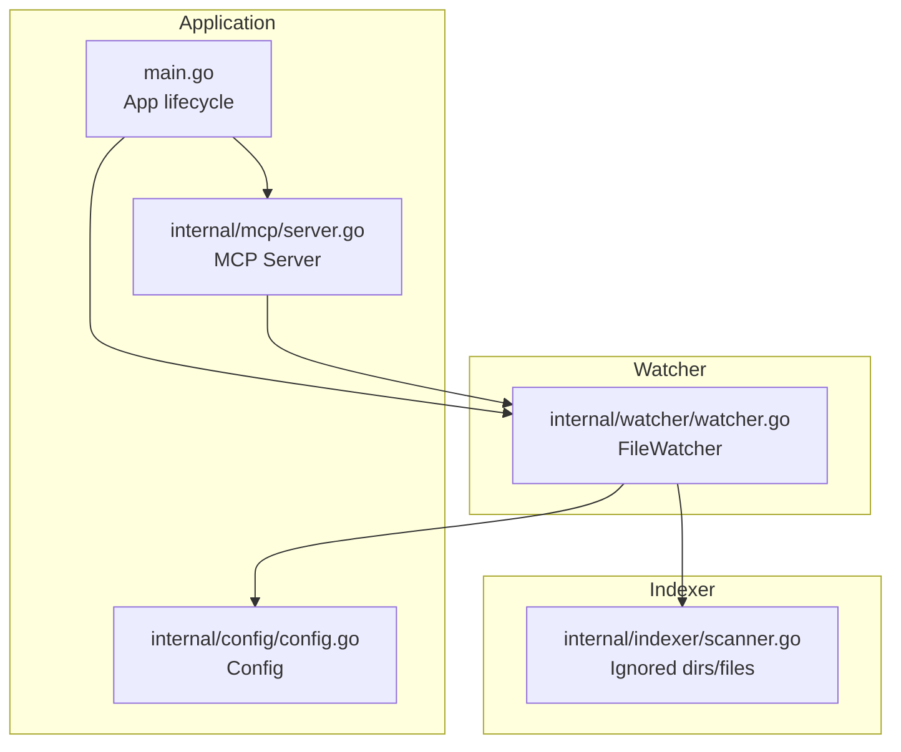
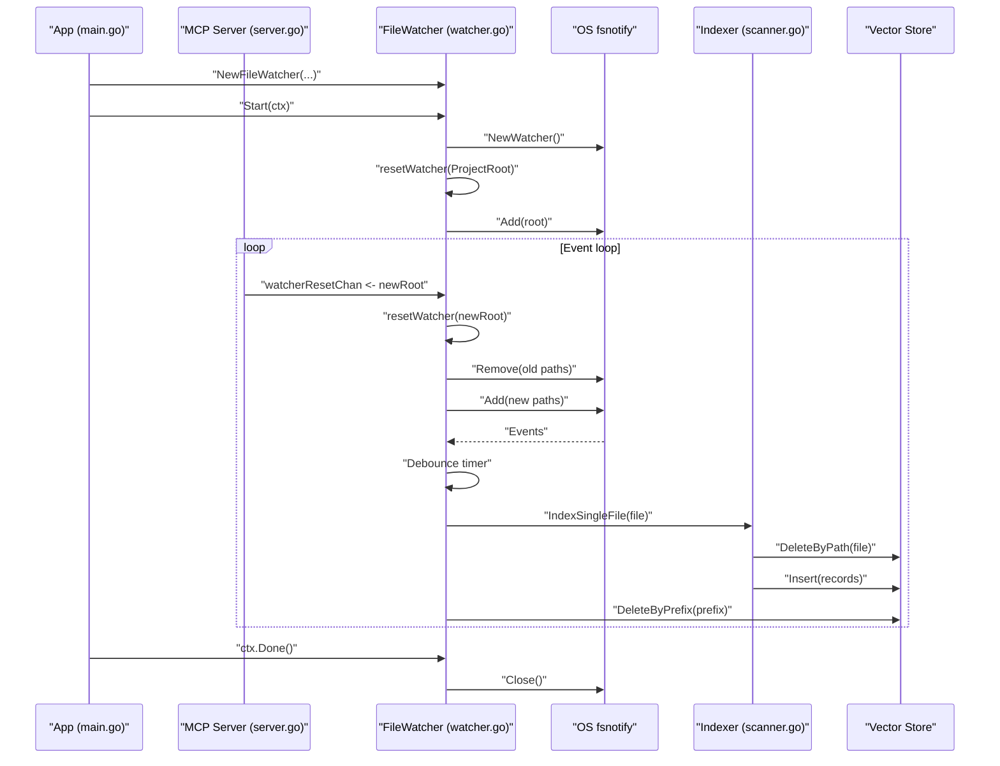
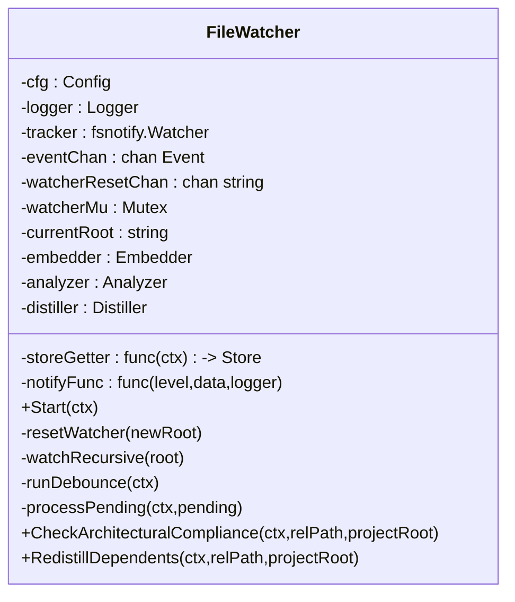
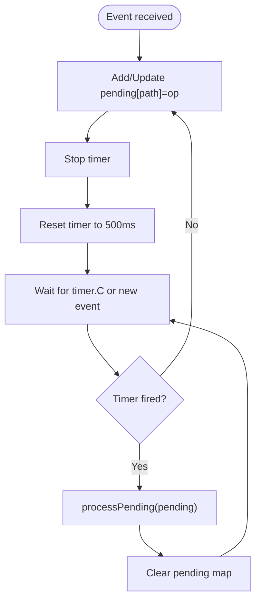
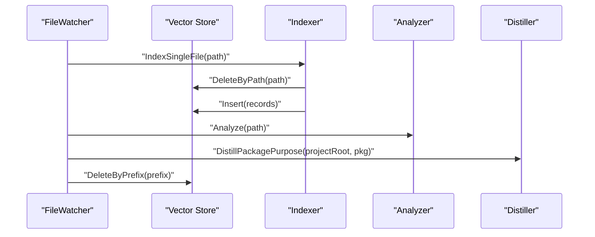
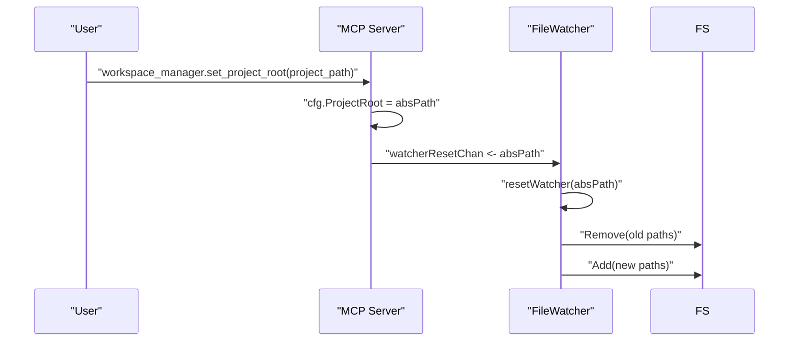
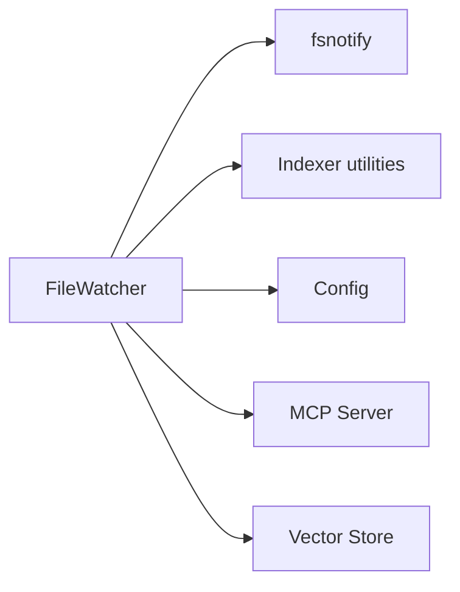

# File Watching and Monitoring

<cite>
**Referenced Files in This Document**
- [watcher.go](file://internal/watcher/watcher.go)
- [config.go](file://internal/config/config.go)
- [scanner.go](file://internal/indexer/scanner.go)
- [main.go](file://main.go)
- [server.go](file://internal/mcp/server.go)
- [handlers_context.go](file://internal/mcp/handlers_context.go)
</cite>

## Table of Contents
1. [Introduction](#introduction)
2. [Project Structure](#project-structure)
3. [Core Components](#core-components)
4. [Architecture Overview](#architecture-overview)
5. [Detailed Component Analysis](#detailed-component-analysis)
6. [Dependency Analysis](#dependency-analysis)
7. [Performance Considerations](#performance-considerations)
8. [Troubleshooting Guide](#troubleshooting-guide)
9. [Conclusion](#conclusion)

## Introduction
This document explains the file watching and monitoring system in Vector MCP Go. It covers FSNotify-based file system event monitoring with debounced event handling, recursive directory watching, ignored directory filtering, automatic watcher reset functionality, and the event processing pipeline. It also documents configuration options, concurrency and synchronization mechanisms, graceful shutdown procedures, and common operational issues.

## Project Structure
The file watching system is implemented in a dedicated package and integrated with the main application and MCP server:

- File watcher implementation: internal/watcher
- Configuration: internal/config
- Indexer utilities (ignored directories and file filtering): internal/indexer
- Application bootstrap and integration: main.go
- MCP server integration and project root reset: internal/mcp/server.go and internal/mcp/handlers_context.go

**Diagram sources**
- [main.go:204-265](file://main.go#L204-L265)
- [server.go:86-117](file://internal/mcp/server.go#L86-L117)
- [watcher.go:22-56](file://internal/watcher/watcher.go#L22-L56)
- [scanner.go:425-459](file://internal/indexer/scanner.go#L425-L459)
- [config.go:13-28](file://internal/config/config.go#L13-L28)

**Section sources**
- [main.go:204-265](file://main.go#L204-L265)
- [server.go:86-117](file://internal/mcp/server.go#L86-L117)
- [watcher.go:22-56](file://internal/watcher/watcher.go#L22-L56)
- [scanner.go:425-459](file://internal/indexer/scanner.go#L425-L459)
- [config.go:13-28](file://internal/config/config.go#L13-L28)

## Core Components
- FileWatcher: wraps fsnotify.Watcher, maintains watcher state, debounces events, and processes them to trigger indexing and cleanup.
- Config: holds runtime configuration including project root, watcher toggles, and performance-related settings.
- Indexer utilities: define ignored directories and files to avoid unnecessary monitoring and indexing.
- MCP Server: exposes a tool to change the project root, which triggers watcher reset via a channel.

Key responsibilities:
- Monitor file system events with fsnotify.
- Debounce events to reduce redundant processing.
- Recursively watch directories while respecting ignored patterns.
- Trigger re-indexing on write/create events for supported file types.
- Clean up vector index entries on remove/rename events.
- Reset watcher when project root changes.
- Gracefully shut down on context cancellation.

**Section sources**
- [watcher.go:22-56](file://internal/watcher/watcher.go#L22-L56)
- [config.go:13-28](file://internal/config/config.go#L13-L28)
- [scanner.go:425-459](file://internal/indexer/scanner.go#L425-L459)
- [server.go:86-117](file://internal/mcp/server.go#L86-L117)

## Architecture Overview
The watcher integrates with the application lifecycle and MCP server:

**Diagram sources**
- [main.go:219-234](file://main.go#L219-L234)
- [server.go:14-148](file://internal/mcp/server.go#L14-L148)
- [watcher.go:58-139](file://internal/watcher/watcher.go#L58-L139)
- [scanner.go:337-355](file://internal/indexer/scanner.go#L337-L355)

## Detailed Component Analysis

### FileWatcher Implementation
The FileWatcher coordinates:
- Creating and managing an fsnotify.Watcher.
- Maintaining current project root and watcher subscriptions.
- Debouncing events with a 500 ms timer.
- Processing pending events to trigger indexing and cleanup.

**Diagram sources**
- [watcher.go:22-56](file://internal/watcher/watcher.go#L22-L56)
- [watcher.go:58-196](file://internal/watcher/watcher.go#L58-L196)

Key behaviors:
- Start initializes watcher and spawns the debounce goroutine.
- resetWatcher removes old subscriptions and adds new ones under the new root.
- watchRecursive walks directories and adds them to the watcher, skipping ignored directories.
- runDebounce aggregates events and fires after 500 ms.
- processPending handles Write/Create events by indexing and optionally notifying and triggering analysis/distillation; Remove/Rename events trigger prefix-based deletion.

**Section sources**
- [watcher.go:58-196](file://internal/watcher/watcher.go#L58-L196)

### Debounce Mechanism
The debounce timer aggregates events per path and fires after 500 ms. Pending events are stored in a map keyed by path.

**Diagram sources**
- [watcher.go:121-139](file://internal/watcher/watcher.go#L121-L139)
- [watcher.go:141-196](file://internal/watcher/watcher.go#L141-L196)

**Section sources**
- [watcher.go:121-139](file://internal/watcher/watcher.go#L121-L139)
- [watcher.go:141-196](file://internal/watcher/watcher.go#L141-L196)

### Recursive Directory Watching and Ignored Directory Filtering
- On Start, the watcher is reset to the configured project root.
- When a Create event occurs for a directory, the watcher adds it and recursively watches subdirectories, skipping ignored directories.
- resetWatcher removes subscriptions for the previous root and re-adds them for the new root, again skipping ignored directories.

Ignored directories are defined in the indexer utilities and include common build artifacts and hidden directories.

**Section sources**
- [watcher.go:58-119](file://internal/watcher/watcher.go#L58-L119)
- [scanner.go:425-436](file://internal/indexer/scanner.go#L425-L436)

### Event Processing Pipeline
- Supported file types: .go, .ts, .tsx, .js, .jsx, .md.
- Write/Create events: trigger IndexSingleFile, then optional architectural compliance checks, re-distillation of dependents, and proactive analysis.
- Remove/Rename events: trigger DeleteByPrefix on the vector store.

**Diagram sources**
- [watcher.go:141-196](file://internal/watcher/watcher.go#L141-L196)
- [scanner.go:337-355](file://internal/indexer/scanner.go#L337-L355)

**Section sources**
- [watcher.go:141-196](file://internal/watcher/watcher.go#L141-L196)
- [scanner.go:337-355](file://internal/indexer/scanner.go#L337-L355)

### Automatic Watcher Reset Functionality
The MCP server exposes a tool to change the project root. When invoked, it updates the configuration and sends the new absolute path to the watcher via a channel. The watcher then resets subscriptions accordingly.

**Diagram sources**
- [handlers_context.go:14-32](file://internal/mcp/handlers_context.go#L14-L32)
- [server.go:86-117](file://internal/mcp/server.go#L86-L117)
- [watcher.go:102-119](file://internal/watcher/watcher.go#L102-L119)

**Section sources**
- [handlers_context.go:14-32](file://internal/mcp/handlers_context.go#L14-L32)
- [server.go:86-117](file://internal/mcp/server.go#L86-L117)
- [watcher.go:102-119](file://internal/watcher/watcher.go#L102-L119)

### Concurrent Event Channel Handling and Mutex Protection
- The watcher uses a buffered channel for fsnotify events to decouple event reception from processing.
- A mutex protects state changes (current root and watcher subscriptions) during reset operations.
- The debounce goroutine runs independently and processes pending events after the 500 ms timer.

**Section sources**
- [watcher.go:27-29](file://internal/watcher/watcher.go#L27-L29)
- [watcher.go:48](file://internal/watcher/watcher.go#L48)
- [watcher.go:102-119](file://internal/watcher/watcher.go#L102-L119)

### Graceful Shutdown Procedures
- The watcher closes the fsnotify.Watcher when the context is cancelled.
- The application installs OS signals and cancels the context, allowing all goroutines to exit cleanly.

**Section sources**
- [watcher.go:81-83](file://internal/watcher/watcher.go#L81-L83)
- [main.go:297-305](file://main.go#L297-L305)
- [main.go:267-278](file://main.go#L267-L278)

## Dependency Analysis
- FileWatcher depends on:
  - fsnotify for OS-level file system events.
  - Indexer utilities for ignored directory detection.
  - Config for project root and runtime settings.
  - MCP server for notifications and project root updates.
  - Vector store for index insertions and deletions.

**Diagram sources**
- [watcher.go:14-20](file://internal/watcher/watcher.go#L14-L20)
- [config.go:13-28](file://internal/config/config.go#L13-L28)
- [server.go:66-84](file://internal/mcp/server.go#L66-L84)

**Section sources**
- [watcher.go:14-20](file://internal/watcher/watcher.go#L14-L20)
- [config.go:13-28](file://internal/config/config.go#L13-L28)
- [server.go:66-84](file://internal/mcp/server.go#L66-L84)

## Performance Considerations
- Debounce timer: 500 ms reduces churn from bursty file writes.
- Buffered event channel: helps absorb bursts of events.
- Ignored directories and files: significantly reduce watcher load and indexing overhead.
- Concurrency: separate goroutines for event reception and debounce processing.
- Memory usage: large projects may increase watcher subscription count; consider limiting project scope or adjusting ignored patterns.

[No sources needed since this section provides general guidance]

## Troubleshooting Guide
Common issues and resolutions:

- Watcher limit exceeded
  - Symptom: Events not firing or errors indicating too many open files.
  - Cause: Excessive directory subscriptions.
  - Resolution: Ensure ignored directories are respected; verify project root is correct; consider narrowing the project scope.

- High CPU/memory usage during large projects
  - Symptom: Elevated resource consumption.
  - Cause: Many file changes or large directory trees.
  - Resolution: Confirm ignored directories are effective; adjust debounce timing if needed; monitor vector store operations.

- Events not triggering re-indexing
  - Symptom: Changes not reflected in search results.
  - Cause: Unsupported file type or ignored directory.
  - Resolution: Verify file extensions are supported (.go, .ts, .tsx, .js, .jsx, .md); confirm path is not ignored.

- Remove/Rename not cleaning index
  - Symptom: Stale entries remain after deletion.
  - Cause: Path mismatch or prefix deletion scope.
  - Resolution: Ensure project root is correct; verify prefix deletion logic applies to the intended scope.

- Watcher not resetting on project root change
  - Symptom: Old subscriptions persist after changing project root.
  - Cause: Reset signal blocked or project root not updated.
  - Resolution: Confirm MCP tool invocation succeeds; ensure watcherResetChan is not full; verify absolute path is sent.

**Section sources**
- [watcher.go:141-196](file://internal/watcher/watcher.go#L141-L196)
- [scanner.go:425-459](file://internal/indexer/scanner.go#L425-L459)
- [handlers_context.go:14-32](file://internal/mcp/handlers_context.go#L14-L32)

## Conclusion
The file watching and monitoring system in Vector MCP Go provides robust, efficient, and configurable file system event handling. It leverages fsnotify, debounced processing, recursive directory watching with ignored patterns, and automatic reset on project root changes. The system integrates tightly with the indexing pipeline and MCP server, enabling live, proactive codebase updates with minimal overhead.