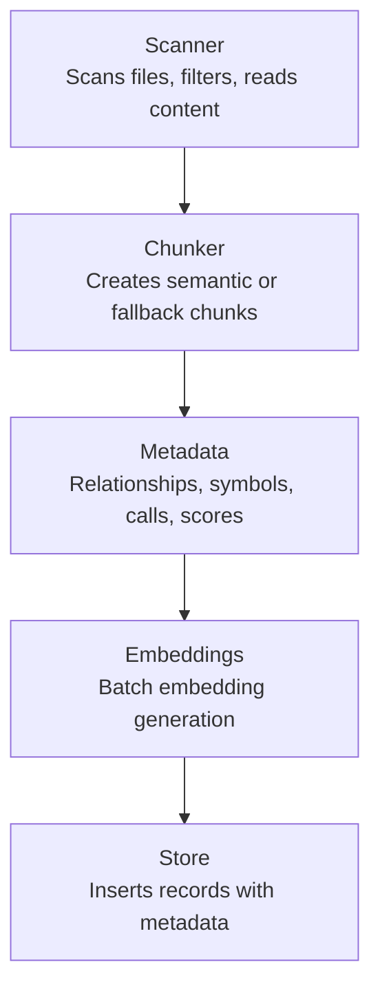
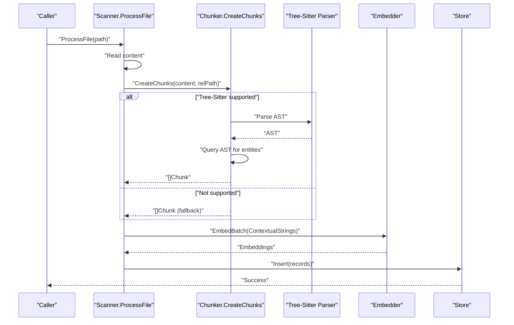
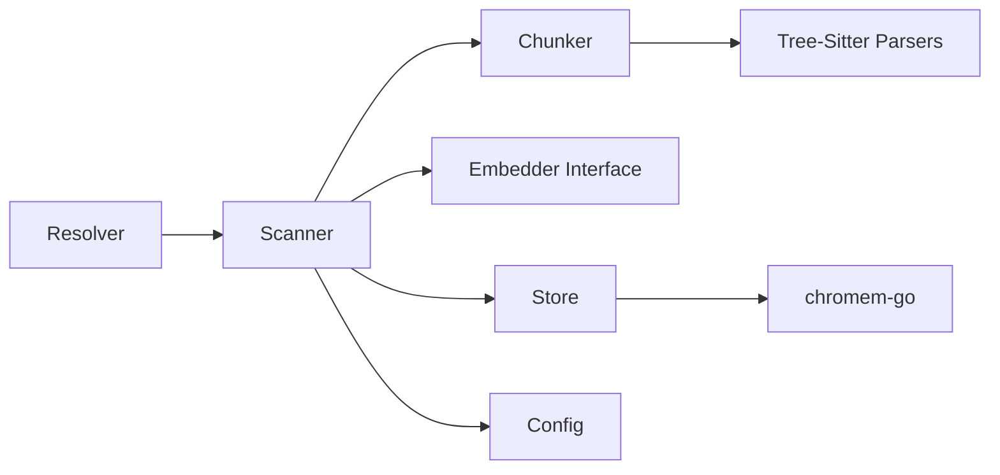

# Language-Specific Chunking and Parsing

<cite>
**Referenced Files in This Document**
- [chunker.go](file://internal/indexer/chunker.go)
- [resolver.go](file://internal/indexer/resolver.go)
- [scanner.go](file://internal/indexer/scanner.go)
- [chunker_test.go](file://internal/indexer/chunker_test.go)
- [resolver_test.go](file://internal/indexer/resolver_test.go)
- [scanner_test.go](file://internal/indexer/scanner_test.go)
- [store.go](file://internal/db/store.go)
- [config.go](file://internal/config/config.go)
- [retrieval_bench_test.go](file://benchmark/retrieval_bench_test.go)
- [main.go](file://main.go)
- [README.md](file://README.md)
</cite>

## Table of Contents
1. [Introduction](#introduction)
2. [Project Structure](#project-structure)
3. [Core Components](#core-components)
4. [Architecture Overview](#architecture-overview)
5. [Detailed Component Analysis](#detailed-component-analysis)
6. [Dependency Analysis](#dependency-analysis)
7. [Performance Considerations](#performance-considerations)
8. [Troubleshooting Guide](#troubleshooting-guide)
9. [Conclusion](#conclusion)
10. [Appendices](#appendices)

## Introduction
This document explains the language-specific chunking and parsing system used to transform source code and documentation into semantically meaningful chunks suitable for vector search. It covers Tree-Sitter integration for AST-based parsing across supported languages (Go, TypeScript/JavaScript, PHP, Python, Rust, HTML, CSS), chunking strategies for different file types, the language resolver system, metadata generation, configuration options, performance characteristics, and troubleshooting guidance.

## Project Structure
The chunking pipeline lives primarily in the indexer package and integrates with the database layer for storage and retrieval. The main flow is:
- Scanner discovers files and prepares content
- Chunker creates semantic or fallback chunks
- Metadata is attached and embeddings are generated
- Results are inserted into the vector store

**Diagram sources**
- [scanner.go:67-191](file://internal/indexer/scanner.go#L67-L191)
- [chunker.go:43-101](file://internal/indexer/chunker.go#L43-L101)
- [store.go:66-78](file://internal/db/store.go#L66-L78)

**Section sources**
- [scanner.go:67-191](file://internal/indexer/scanner.go#L67-L191)
- [chunker.go:43-101](file://internal/indexer/chunker.go#L43-L101)
- [store.go:66-78](file://internal/db/store.go#L66-L78)

## Core Components
- Chunker: Creates semantic chunks using Tree-Sitter for supported languages, falls back to fixed-size overlapping chunks otherwise. Generates contextual strings, relationships, symbols, calls, and structural metadata.
- Resolver: Parses workspace configuration to resolve import paths and workspace boundaries for relationship extraction.
- Scanner: Discovers files, filters by extensions and ignore rules, reads content, and orchestrates chunking and embedding.
- Store: Provides vector search, hybrid search, and metadata-aware retrieval.

**Section sources**
- [chunker.go:22-101](file://internal/indexer/chunker.go#L22-L101)
- [resolver.go:16-27](file://internal/indexer/resolver.go#L16-L27)
- [scanner.go:67-191](file://internal/indexer/scanner.go#L67-L191)
- [store.go:19-33](file://internal/db/store.go#L19-L33)

## Architecture Overview
The system integrates Tree-Sitter parsers per language, AST queries to extract entities, and metadata enrichment to produce high-quality embeddings for semantic search.

**Diagram sources**
- [scanner.go:194-335](file://internal/indexer/scanner.go#L194-L335)
- [chunker.go:43-101](file://internal/indexer/chunker.go#L43-L101)
- [chunker.go:114-421](file://internal/indexer/chunker.go#L114-L421)
- [store.go:66-78](file://internal/db/store.go#L66-L78)

## Detailed Component Analysis

### Tree-Sitter Integration and Language Support
- Supported languages: Go, JavaScript/TypeScript, PHP, Python, Rust, HTML, CSS.
- Each language has a dedicated Tree-Sitter parser and a set of AST queries to identify top-level entities (functions, classes, methods, types, tags, rulesets).
- The system builds a list of entity matches, deduplicates by byte range, sorts by position, and fills gaps with Unknown chunks.

Key behaviors:
- Entity extraction uses captures named "entity" and "name" (and special cases like hook_name for PHP).
- Parent context resolution is language-aware (e.g., Go receiver types, TS/JS class bodies, HTML tag parents, CSS selectors/media/keyframes).
- Gap-filling ensures contiguous coverage of the file by splitting large chunks and adding Unknown chunks for whitespace/comments-only regions.

**Section sources**
- [chunker.go:103-109](file://internal/indexer/chunker.go#L103-L109)
- [chunker.go:114-421](file://internal/indexer/chunker.go#L114-L421)
- [chunker.go:208-351](file://internal/indexer/chunker.go#L208-L351)
- [chunker.go:375-421](file://internal/indexer/chunker.go#L375-L421)

### Language-Specific Chunking Strategies
- Go: Extracts function declarations, method declarations, type declarations (struct/interface), and associates docstrings and structural metadata for fields and interface methods.
- TypeScript/JavaScript: Extracts exported and non-exported classes, functions, interfaces, methods, arrow functions, and lexical declarations.
- PHP: Extracts classes, methods, functions, interfaces, and function call expressions with string arguments and anonymous callbacks.
- Python: Extracts classes and functions.
- Rust: Extracts structs, enums, functions, impl blocks, and traits.
- HTML/CSS: Extracts elements, script/style blocks, rule sets, media statements, and keyframes.

Chunk generation:
- For each matched entity, a Chunk is created with Content, Symbols, ParentSymbol, Type, Calls, FunctionScore, Docstring, StructuralMetadata, and line numbers.
- Large chunks are split with overlap to avoid token limits and preserve context continuity.

**Section sources**
- [chunker.go:154-205](file://internal/indexer/chunker.go#L154-L205)
- [chunker.go:331-347](file://internal/indexer/chunker.go#L331-L347)
- [chunker.go:539-577](file://internal/indexer/chunker.go#L539-L577)

### Relationship Extraction and Resolution
- Relationships are derived from import/require statements and language-specific constructs:
  - TypeScript/TSX/JS: Named imports, default imports, require calls.
  - Go: Single-line and block import statements.
  - PHP: require/include variants and use statements.
- A WorkspaceResolver parses tsconfig.json path aliases and pnpm/package.json workspaces to resolve logical import paths to physical file paths.

**Section sources**
- [chunker.go:648-722](file://internal/indexer/chunker.go#L648-L722)
- [resolver.go:87-114](file://internal/indexer/resolver.go#L87-L114)
- [resolver.go:116-167](file://internal/indexer/resolver.go#L116-L167)
- [resolver.go:169-188](file://internal/indexer/resolver.go#L169-L188)

### Metadata Generation
Each Chunk produces:
- ContextualString: A formatted string combining file path, entity scope, type, docstring, calls, and structure metadata for embedding.
- Relationships: Deduplicated list of imported/required modules/packages.
- Symbols: Top-level symbol names extracted from AST.
- ParentSymbol: Scope-level parent (e.g., class name, HTML tag, CSS selector).
- Calls: Unique function/method calls captured from the entity subtree.
- FunctionScore: Heuristic score based on line count and call count.
- Docstring: Comments immediately preceding the entity.
- StructuralMetadata: Field types for Go structs/interfaces, property definitions for TS/JS classes, etc.

These are serialized into JSON and stored in the vector store’s metadata.

**Section sources**
- [chunker.go:54-99](file://internal/indexer/chunker.go#L54-L99)
- [chunker.go:423-452](file://internal/indexer/chunker.go#L423-L452)
- [chunker.go:454-531](file://internal/indexer/chunker.go#L454-L531)
- [chunker.go:594-632](file://internal/indexer/chunker.go#L594-L632)
- [chunker.go:634-646](file://internal/indexer/chunker.go#L634-L646)

### Fallback Chunking and Gap-Filling
- Unsupported extensions fall back to fastChunk: fixed-size overlapping chunks with configurable sizes.
- Gap-filling identifies non-entity regions and splits them into Unknown chunks to ensure full coverage.

**Section sources**
- [chunker.go:50-52](file://internal/indexer/chunker.go#L50-L52)
- [chunker.go:724-758](file://internal/indexer/chunker.go#L724-L758)
- [chunker.go:375-410](file://internal/indexer/chunker.go#L375-L410)

### Language Resolver System
- Reads tsconfig.json to extract path aliases and maps them to target directories.
- Scans pnpm-workspace.yaml and package.json workspaces to map package names to relative directories.
- Resolves logical import paths to physical paths for relationship tracking.

**Section sources**
- [resolver.go:16-27](file://internal/indexer/resolver.go#L16-L27)
- [resolver.go:87-114](file://internal/indexer/resolver.go#L87-L114)
- [resolver.go:116-167](file://internal/indexer/resolver.go#L116-L167)
- [resolver.go:169-188](file://internal/indexer/resolver.go#L169-L188)

### Vector Store Integration
- Records include ID, Content, Embedding, and Metadata.
- Hybrid search combines vector and lexical search with Reciprocal Rank Fusion (RRF), applying boosts for function score, recency, and priority.
- Supports deletion by path/prefix and project, and efficient retrieval of file metadata.

**Section sources**
- [store.go:27-33](file://internal/db/store.go#L27-L33)
- [store.go:223-336](file://internal/db/store.go#L223-L336)
- [store.go:411-439](file://internal/db/store.go#L411-L439)

### Configuration Options
- Embedding model and reranker selection, pool size, and dimension are configured via environment variables and defaults.
- Chunk size and overlap are tuned for large-context models:
  - Semantic chunks: max 8000 runes with 800 rune overlap.
  - Fallback chunks: 3000 runes with 500 rune overlap.
- Priority scoring for specific files (e.g., ADRs/architecture docs) influences ranking.

**Section sources**
- [config.go:30-130](file://internal/config/config.go#L30-L130)
- [chunker.go:539-577](file://internal/indexer/chunker.go#L539-L577)
- [chunker.go:724-758](file://internal/indexer/chunker.go#L724-L758)
- [scanner.go:461-469](file://internal/indexer/scanner.go#L461-L469)

## Dependency Analysis
- Chunker depends on Tree-Sitter parsers and language-specific queries.
- Scanner depends on Chunker and the Embedder interface.
- Store depends on chromem-go for vector operations and metadata filtering.
- Resolver depends on JSON parsing and filesystem discovery.

**Diagram sources**
- [chunker.go:10-20](file://internal/indexer/chunker.go#L10-L20)
- [scanner.go:19-23](file://internal/indexer/scanner.go#L19-L23)
- [store.go:3-17](file://internal/db/store.go#L3-L17)
- [config.go:3-11](file://internal/config/config.go#L3-L11)
- [resolver.go:3-8](file://internal/indexer/resolver.go#L3-L8)

**Section sources**
- [chunker.go:10-20](file://internal/indexer/chunker.go#L10-L20)
- [scanner.go:19-23](file://internal/indexer/scanner.go#L19-L23)
- [store.go:3-17](file://internal/db/store.go#L3-L17)
- [config.go:3-11](file://internal/config/config.go#L3-L11)
- [resolver.go:3-8](file://internal/indexer/resolver.go#L3-L8)

## Performance Considerations
- Token estimation: A simple heuristic is used to estimate tokens for prioritization.
- Overlap tuning: Semantic chunks use 8000 runes with 800 overlap; fallback uses 3000 runes with 500 overlap to balance context and memory.
- Parallelism: Scanner uses goroutines equal to CPU count for concurrent processing and embedding.
- Batch embedding: Attempts batch embedding first, falls back to sequential embedding on failure.
- Memory: Tree-Sitter parsing allocates AST nodes; chunks are rune-sliced to avoid UTF-8 corruption and reduce memory pressure.
- Ignoring files: Extensive ignore lists for directories and file suffixes reduce IO and parsing overhead.

**Section sources**
- [scanner.go:47-49](file://internal/indexer/scanner.go#L47-L49)
- [chunker.go:539-577](file://internal/indexer/chunker.go#L539-L577)
- [chunker.go:724-758](file://internal/indexer/chunker.go#L724-L758)
- [scanner.go:128-148](file://internal/indexer/scanner.go#L128-L148)
- [scanner.go:256-269](file://internal/indexer/scanner.go#L256-L269)
- [scanner.go:357-423](file://internal/indexer/scanner.go#L357-L423)

## Troubleshooting Guide
Common issues and resolutions:
- Unsupported syntax or encoding:
  - If Tree-Sitter parsing fails or returns nil, the system falls back to fastChunk. Verify encoding is UTF-8 and syntax is valid.
  - Large files exceeding token limits are automatically split; ensure overlap is sufficient for context continuity.
- Relationship extraction mismatches:
  - For TypeScript/JS, ensure import statements are valid and not commented out. For Go/PHP, confirm import/use statements are correctly formatted.
  - Workspace resolution requires tsconfig.json and workspace files to be present; otherwise, logical paths may not resolve.
- Memory and performance:
  - Increase EMBEDDER_POOL_SIZE for faster embedding throughput.
  - Reduce chunk size or increase overlap if context is lost at boundaries.
- Storage dimension mismatch:
  - Changing embedding models requires clearing the vector database to avoid dimension errors.

**Section sources**
- [chunker.go:145-147](file://internal/indexer/chunker.go#L145-L147)
- [chunker.go:50-52](file://internal/indexer/chunker.go#L50-L52)
- [chunker.go:648-722](file://internal/indexer/chunker.go#L648-L722)
- [resolver.go:87-114](file://internal/indexer/resolver.go#L87-L114)
- [resolver.go:116-167](file://internal/indexer/resolver.go#L116-L167)
- [store.go:51-61](file://internal/db/store.go#L51-L61)
- [config.go:103-108](file://internal/config/config.go#L103-L108)

## Conclusion
The language-specific chunking system leverages Tree-Sitter to extract semantically meaningful units from source code and documents, enriches them with metadata, and produces embeddings optimized for hybrid search. The resolver enhances relationship tracking by mapping logical import paths to physical locations. With tunable chunk sizes, overlaps, and robust fallbacks, the system balances accuracy and performance across large, polyglot codebases.

## Appendices

### API and Workflow References
- Chunk creation and metadata assembly: [chunker.go:43-101](file://internal/indexer/chunker.go#L43-L101)
- Tree-Sitter parsing and entity extraction: [chunker.go:114-421](file://internal/indexer/chunker.go#L114-L421)
- Relationship extraction: [chunker.go:648-722](file://internal/indexer/chunker.go#L648-L722)
- Workspace resolution: [resolver.go:87-188](file://internal/indexer/resolver.go#L87-L188)
- File scanning and indexing: [scanner.go:67-191](file://internal/indexer/scanner.go#L67-L191)
- Vector store operations: [store.go:223-336](file://internal/db/store.go#L223-L336)

### Benchmark and Polyglot Testing
- Polyglot fixture with Go, TypeScript, and Python files: [retrieval_bench_test.go:92-224](file://benchmark/retrieval_bench_test.go#L92-L224)
- Example files: [main.go](file://benchmark/fixtures/polyglot/main.go), [service.ts](file://benchmark/fixtures/polyglot/service.ts), [worker.py](file://benchmark/fixtures/polyglot/worker.py)

**Section sources**
- [retrieval_bench_test.go:92-224](file://benchmark/retrieval_bench_test.go#L92-L224)
- [main.go](file://benchmark/fixtures/polyglot/main.go)
- [service.ts](file://benchmark/fixtures/polyglot/service.ts)
- [worker.py](file://benchmark/fixtures/polyglot/worker.py)