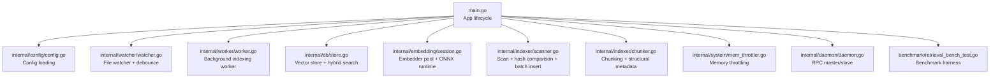
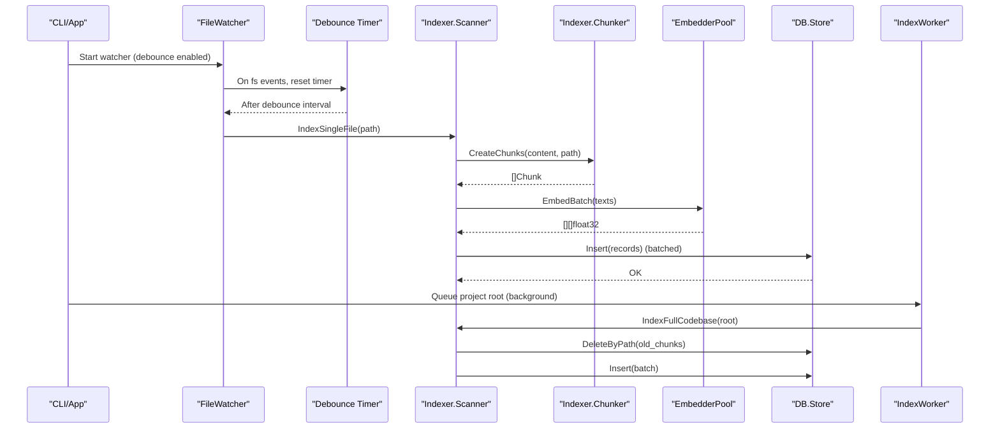
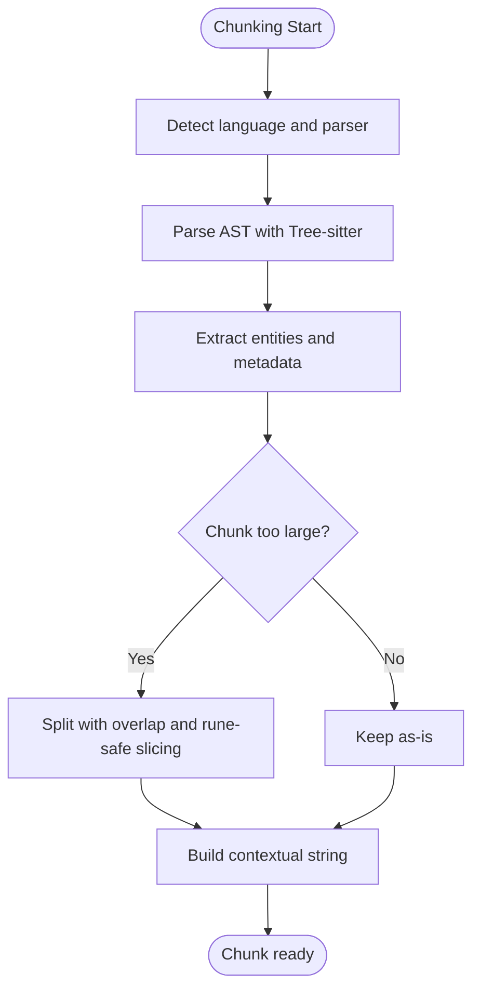
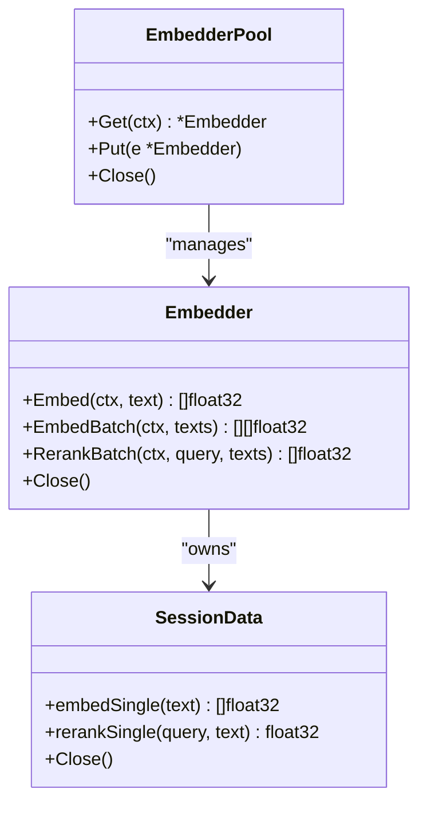
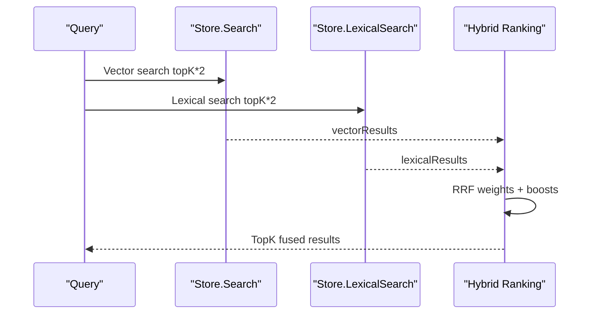
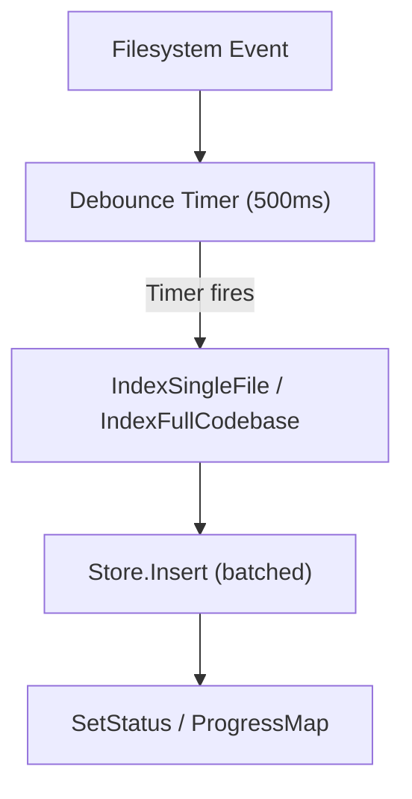
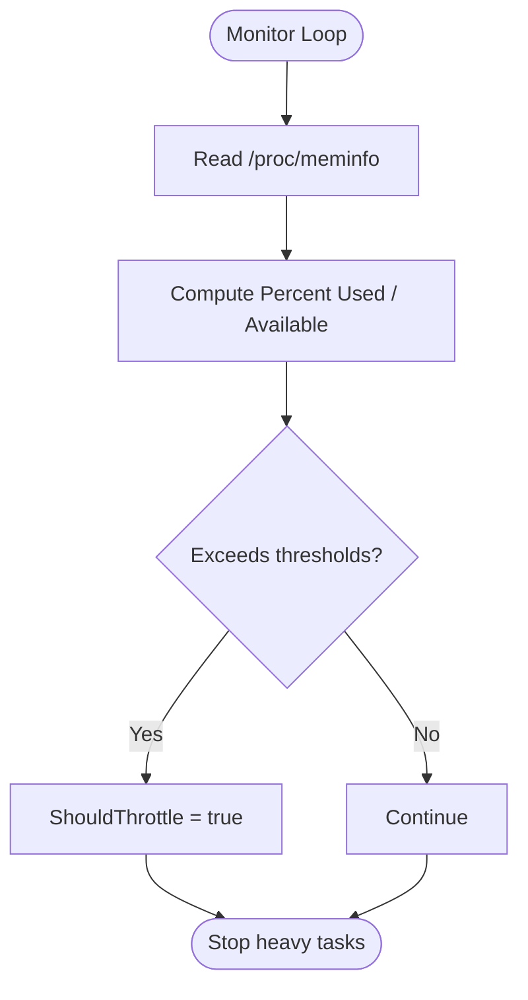
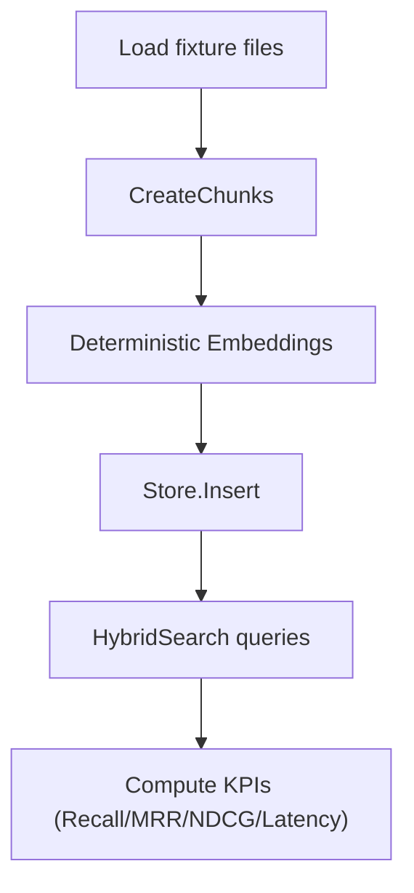
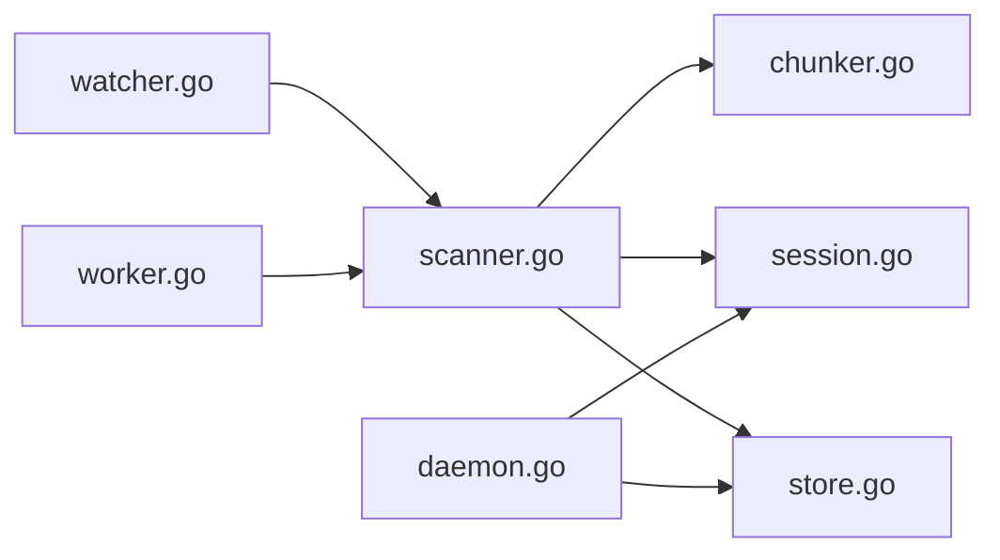

# Performance Optimization and Monitoring

<cite>
**Referenced Files in This Document**
- [main.go](file://main.go)
- [internal/config/config.go](file://internal/config/config.go)
- [internal/indexer/chunker.go](file://internal/indexer/chunker.go)
- [internal/indexer/scanner.go](file://internal/indexer/scanner.go)
- [internal/db/store.go](file://internal/db/store.go)
- [internal/embedding/session.go](file://internal/embedding/session.go)
- [internal/system/mem_throttler.go](file://internal/system/mem_throttler.go)
- [internal/worker/worker.go](file://internal/worker/worker.go)
- [internal/watcher/watcher.go](file://internal/watcher/watcher.go)
- [internal/daemon/daemon.go](file://internal/daemon/daemon.go)
- [benchmark/retrieval_bench_test.go](file://benchmark/retrieval_bench_test.go)
</cite>

## Table of Contents
1. [Introduction](#introduction)
2. [Project Structure](#project-structure)
3. [Core Components](#core-components)
4. [Architecture Overview](#architecture-overview)
5. [Detailed Component Analysis](#detailed-component-analysis)
6. [Dependency Analysis](#dependency-analysis)
7. [Performance Considerations](#performance-considerations)
8. [Troubleshooting Guide](#troubleshooting-guide)
9. [Conclusion](#conclusion)
10. [Appendices](#appendices)

## Introduction
This document focuses on performance optimization and monitoring within the code indexing system. It explains memory management strategies (chunk buffering, garbage collection optimization, resource cleanup), performance monitoring techniques (throughput, memory usage, CPU utilization), scalability considerations (parallel processing, batching, distributed indexing), configuration options for tuning chunk sizes and resource limits, and troubleshooting guidance for common performance issues such as slow indexing, memory leaks, and high CPU usage. It also outlines monitoring and alerting mechanisms for index health and capacity planning.

## Project Structure
The indexing pipeline spans several subsystems:
- Configuration and environment management
- File discovery and scanning
- Chunking and content preparation
- Embedding generation with pooling
- Vector storage and hybrid search
- Live indexing and debounced file watching
- Daemon orchestration and progress reporting
- Benchmarks for retrieval KPIs

**Diagram sources**
- [main.go:1-349](file://main.go#L1-L349)
- [internal/config/config.go:1-139](file://internal/config/config.go#L1-L139)
- [internal/watcher/watcher.go:1-281](file://internal/watcher/watcher.go#L1-L281)
- [internal/worker/worker.go:1-112](file://internal/worker/worker.go#L1-L112)
- [internal/db/store.go:1-664](file://internal/db/store.go#L1-L664)
- [internal/embedding/session.go:1-367](file://internal/embedding/session.go#L1-L367)
- [internal/indexer/scanner.go:1-485](file://internal/indexer/scanner.go#L1-L485)
- [internal/indexer/chunker.go:1-759](file://internal/indexer/chunker.go#L1-L759)
- [internal/system/mem_throttler.go:1-151](file://internal/system/mem_throttler.go#L1-L151)
- [internal/daemon/daemon.go:1-648](file://internal/daemon/daemon.go#L1-L648)
- [benchmark/retrieval_bench_test.go:1-357](file://benchmark/retrieval_bench_test.go#L1-L357)

**Section sources**
- [main.go:1-349](file://main.go#L1-L349)
- [internal/config/config.go:1-139](file://internal/config/config.go#L1-L139)

## Core Components
- Configuration and environment: centralizes tunables such as model paths, dimensions, watcher flags, and embedder pool size.
- Indexer pipeline: scans files, compares hashes, chunks content, generates embeddings, and inserts records in batches.
- Vector store: supports vector and lexical search, hybrid ranking, and metadata filtering.
- Embedding pool: manages ONNX sessions and tensors with pooling and normalization.
- Memory throttler: monitors system memory and advises when to throttle or pause heavy tasks.
- Live watcher: debounces file system events and triggers targeted re-indexing.
- Daemon: orchestrates master/slave mode, exposes RPC endpoints, and coordinates progress reporting.

**Section sources**
- [internal/config/config.go:13-139](file://internal/config/config.go#L13-L139)
- [internal/indexer/scanner.go:67-191](file://internal/indexer/scanner.go#L67-L191)
- [internal/db/store.go:19-664](file://internal/db/store.go#L19-L664)
- [internal/embedding/session.go:29-367](file://internal/embedding/session.go#L29-L367)
- [internal/system/mem_throttler.go:21-151](file://internal/system/mem_throttler.go#L21-L151)
- [internal/watcher/watcher.go:22-281](file://internal/watcher/watcher.go#L22-L281)
- [internal/daemon/daemon.go:17-648](file://internal/daemon/daemon.go#L17-L648)

## Architecture Overview
The indexing system is designed around deterministic, local-first operations with strong emphasis on batching, parallelism, and resource pooling.

**Diagram sources**
- [internal/watcher/watcher.go:121-196](file://internal/watcher/watcher.go#L121-L196)
- [internal/indexer/scanner.go:337-355](file://internal/indexer/scanner.go#L337-L355)
- [internal/indexer/chunker.go:43-101](file://internal/indexer/chunker.go#L43-L101)
- [internal/embedding/session.go:261-271](file://internal/embedding/session.go#L261-L271)
- [internal/db/store.go:66-78](file://internal/db/store.go#L66-L78)
- [internal/worker/worker.go:47-111](file://internal/worker/worker.go#L47-L111)

## Detailed Component Analysis

### Memory Management Strategies
- Chunk buffering and overlap:
  - Large chunks are split into overlapping segments to fit model context windows and embedding constraints. This reduces fragmentation and improves retrieval granularity.
  - Overlap ensures continuity across chunk boundaries.
- Garbage collection optimization:
  - String builders and rune-safe slicing prevent excessive allocations and UTF-8 corruption.
  - Temporary slices and maps are reused or scoped locally to minimize GC pressure.
- Resource cleanup:
  - ONNX tensors and sessions are explicitly destroyed when closing embedders.
  - Tree-sitter parsers and cursors are deferred to close after parsing.
  - File watchers and timers are stopped gracefully on shutdown.

**Diagram sources**
- [internal/indexer/chunker.go:114-421](file://internal/indexer/chunker.go#L114-L421)
- [internal/indexer/chunker.go:539-577](file://internal/indexer/chunker.go#L539-L577)

**Section sources**
- [internal/indexer/chunker.go:539-577](file://internal/indexer/chunker.go#L539-L577)
- [internal/embedding/session.go:282-298](file://internal/embedding/session.go#L282-L298)
- [internal/indexer/chunker.go:141-148](file://internal/indexer/chunker.go#L141-L148)

### Embedding Pipeline and Batching
- Embedder pool:
  - Maintains a channel-based pool of embedders with configurable size.
  - Embeddings are generated via ONNX runtime with pooled outputs and cosine-normalized vectors.
- Batch embedding:
  - Scanner aggregates contextual strings and invokes batch embedding for throughput.
  - Falls back to sequential embedding on batch failure.
- Dimension consistency:
  - Store probes dimension mismatch to prevent vector insertion errors.

**Diagram sources**
- [internal/embedding/session.go:34-85](file://internal/embedding/session.go#L34-L85)
- [internal/embedding/session.go:29-36](file://internal/embedding/session.go#L29-L36)
- [internal/embedding/session.go:176-245](file://internal/embedding/session.go#L176-L245)

**Section sources**
- [internal/embedding/session.go:38-85](file://internal/embedding/session.go#L38-L85)
- [internal/embedding/session.go:176-245](file://internal/embedding/session.go#L176-L245)
- [internal/db/store.go:51-63](file://internal/db/store.go#L51-L63)

### Vector Storage and Hybrid Search
- Batch insertions:
  - Scanner buffers records and inserts in batches to reduce I/O overhead.
- Hybrid search:
  - Combines vector and lexical search with Reciprocal Rank Fusion (RRF) and dynamic weighting.
  - Applies boosts for function score, recency, and priority metadata.
- Filtering and concurrency:
  - Lexical filtering parallelizes across CPU cores for large result sets.
  - Prefix deletion efficiently removes stale paths on rename/remove.

**Diagram sources**
- [internal/db/store.go:223-336](file://internal/db/store.go#L223-L336)
- [internal/db/store.go:85-221](file://internal/db/store.go#L85-L221)

**Section sources**
- [internal/db/store.go:66-78](file://internal/db/store.go#L66-L78)
- [internal/db/store.go:223-336](file://internal/db/store.go#L223-L336)
- [internal/db/store.go:85-221](file://internal/db/store.go#L85-L221)

### Live Indexing and Debounce
- Debounce:
  - Events are accumulated and processed after a fixed interval to avoid redundant indexing.
- Background worker:
  - Processes queued projects concurrently, reporting progress and status.
- File watcher:
  - Watches recursive directories, ignores common noise, and triggers targeted re-indexing.

**Diagram sources**
- [internal/watcher/watcher.go:121-196](file://internal/watcher/watcher.go#L121-L196)
- [internal/worker/worker.go:47-111](file://internal/worker/worker.go#L47-L111)

**Section sources**
- [internal/watcher/watcher.go:121-196](file://internal/watcher/watcher.go#L121-L196)
- [internal/worker/worker.go:47-111](file://internal/worker/worker.go#L47-L111)

### Memory Throttling
- Monitors system memory periodically and exposes:
  - Percentage used and available memory thresholds
  - LSP readiness checks based on available memory
- Provides ShouldThrottle and GetStatus for downstream decisions.

**Diagram sources**
- [internal/system/mem_throttler.go:46-110](file://internal/system/mem_throttler.go#L46-L110)

**Section sources**
- [internal/system/mem_throttler.go:21-110](file://internal/system/mem_throttler.go#L21-L110)

### Benchmarking and Retrieval KPIs
- Deterministic embedder for stable benchmarks
- Fixture-based retrieval KPIs: recall@K, MRR, NDCG, latency percentiles, and index time per KLOC
- Validates hybrid search quality and latency characteristics

**Diagram sources**
- [benchmark/retrieval_bench_test.go:92-224](file://benchmark/retrieval_bench_test.go#L92-L224)

**Section sources**
- [benchmark/retrieval_bench_test.go:21-53](file://benchmark/retrieval_bench_test.go#L21-L53)
- [benchmark/retrieval_bench_test.go:92-224](file://benchmark/retrieval_bench_test.go#L92-L224)

## Dependency Analysis
- Coupling:
  - Scanner depends on Chunker, Embedder, and Store.
  - Watcher depends on Scanner and Store for targeted re-indexing.
  - Worker depends on Scanner and Store for background indexing.
  - Daemon provides remote access to Embedder and Store for slave instances.
- Cohesion:
  - Embedder pool encapsulates ONNX runtime lifecycle and tensor management.
  - Store encapsulates vector operations, caching, and hybrid search logic.
- External dependencies:
  - ONNX runtime for embeddings
  - Chromem/Lancedb for persistence
  - Tree-sitter for language-specific AST parsing

**Diagram sources**
- [internal/indexer/scanner.go:67-191](file://internal/indexer/scanner.go#L67-L191)
- [internal/indexer/chunker.go:43-101](file://internal/indexer/chunker.go#L43-L101)
- [internal/embedding/session.go:29-367](file://internal/embedding/session.go#L29-L367)
- [internal/db/store.go:19-664](file://internal/db/store.go#L19-L664)
- [internal/watcher/watcher.go:141-196](file://internal/watcher/watcher.go#L141-L196)
- [internal/worker/worker.go:47-111](file://internal/worker/worker.go#L47-L111)
- [internal/daemon/daemon.go:17-648](file://internal/daemon/daemon.go#L17-L648)

**Section sources**
- [internal/indexer/scanner.go:67-191](file://internal/indexer/scanner.go#L67-L191)
- [internal/db/store.go:19-664](file://internal/db/store.go#L19-L664)

## Performance Considerations
- Throughput
  - Batch embedding and batched inserts significantly reduce overhead.
  - Parallel lexical filtering scales with CPU cores.
  - Embedder pool size can be tuned to balance latency and throughput.
- Memory usage
  - Rune-safe chunking avoids unnecessary copies and UTF-8 corruption.
  - ONNX tensors are explicitly destroyed to prevent leaks.
  - Memory throttler can pause heavy tasks when thresholds are exceeded.
- CPU utilization
  - Parallel workers and lexical filtering leverage multiple cores.
  - Debounce reduces redundant CPU work from rapid file changes.
- Scalability
  - Master/slave RPC architecture enables distributed indexing and embedding.
  - Prefix-based deletions and hash comparisons minimize stale data.
  - Daemon mode supports background indexing without blocking MCP server.

[No sources needed since this section provides general guidance]

## Troubleshooting Guide
- Slow indexing
  - Reduce embedder pool size or increase debounce interval.
  - Verify chunk sizes and overlaps are appropriate for the model context window.
  - Monitor batch sizes and consider increasing batch thresholds.
- Memory leaks
  - Ensure embedder pool is closed on shutdown.
  - Confirm Tree-sitter parsers and cursors are closed.
  - Use memory throttler to detect and mitigate high memory usage.
- High CPU usage
  - Limit embedder pool size and parallel workers.
  - Increase debounce interval to coalesce events.
  - Review lexical filtering thresholds and CPU scaling.
- Dimension mismatch errors
  - Store probes dimensionality on startup; recreate DB if switching models.
- Stale index entries
  - Ensure prefix deletion and hash comparison are functioning after renames.

**Section sources**
- [internal/embedding/session.go:80-85](file://internal/embedding/session.go#L80-L85)
- [internal/embedding/session.go:282-298](file://internal/embedding/session.go#L282-L298)
- [internal/db/store.go:51-63](file://internal/db/store.go#L51-L63)
- [internal/watcher/watcher.go:187-195](file://internal/watcher/watcher.go#L187-L195)
- [internal/system/mem_throttler.go:87-103](file://internal/system/mem_throttler.go#L87-L103)

## Conclusion
The indexing system employs deterministic, local-first operations with strong batching, parallelism, and resource pooling to achieve high throughput and low latency. Memory management is explicit through chunking strategies, rune-safe slicing, and careful resource cleanup. Monitoring and alerting are facilitated by memory throttling, progress reporting, and benchmark-driven KPIs. Configuration options allow tuning chunk sizes, debounce intervals, and resource limits to meet diverse workload demands.

[No sources needed since this section summarizes without analyzing specific files]

## Appendices

### Configuration Options for Tuning
- Embedder pool size
  - Controls concurrency of embedding requests.
  - Environment variable: EMBEDDER_POOL_SIZE
- Debounce interval
  - Controls event coalescing for live indexing.
  - Implemented as a fixed interval in the watcher.
- Chunk sizing
  - Large chunks are split with overlap; tune based on model context window.
- Resource limits
  - Memory thresholds for throttling and LSP readiness checks.

**Section sources**
- [internal/config/config.go:103-108](file://internal/config/config.go#L103-L108)
- [internal/watcher/watcher.go:121-139](file://internal/watcher/watcher.go#L121-L139)
- [internal/indexer/chunker.go:539-577](file://internal/indexer/chunker.go#L539-L577)
- [internal/system/mem_throttler.go:33-44](file://internal/system/mem_throttler.go#L33-L44)

### Monitoring and Alerting Mechanisms
- Progress reporting
  - Indexer progress and status updates are stored and retrievable via RPC.
- Memory throttling
  - Periodic memory snapshots and threshold-based throttling.
- Benchmark KPIs
  - Automated retrieval KPIs for regression detection and capacity planning.

**Section sources**
- [internal/worker/worker.go:74-111](file://internal/worker/worker.go#L74-L111)
- [internal/db/store.go:586-631](file://internal/db/store.go#L586-L631)
- [internal/system/mem_throttler.go:46-110](file://internal/system/mem_throttler.go#L46-L110)
- [benchmark/retrieval_bench_test.go:92-224](file://benchmark/retrieval_bench_test.go#L92-L224)