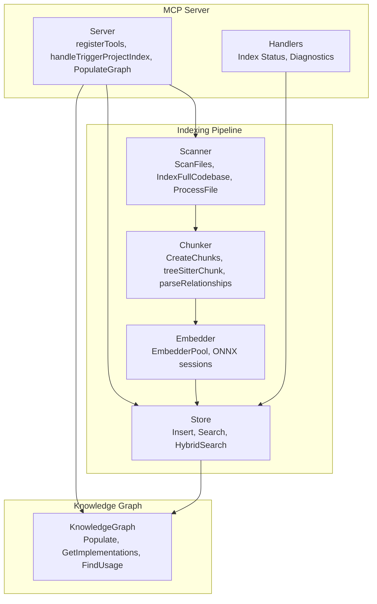
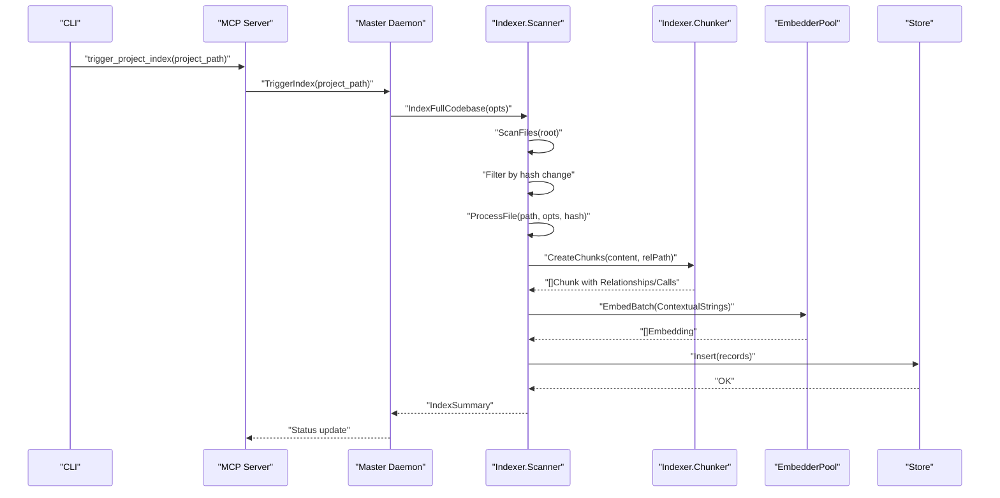
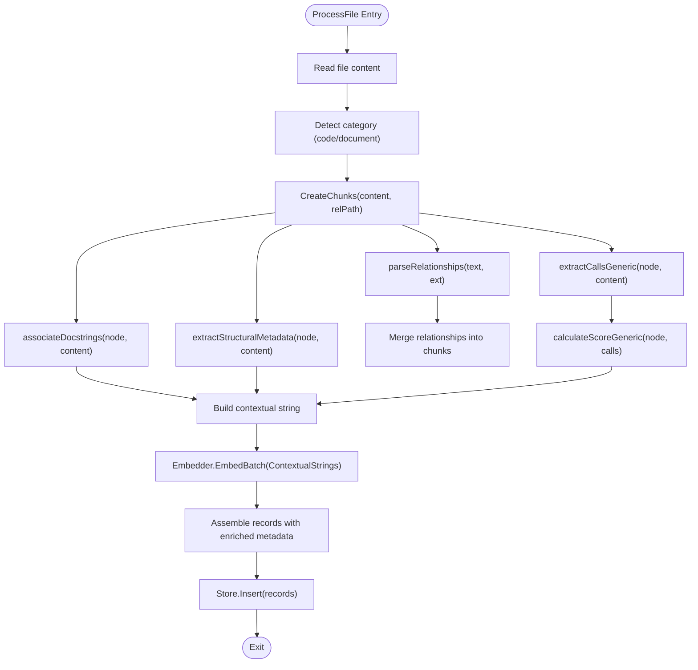
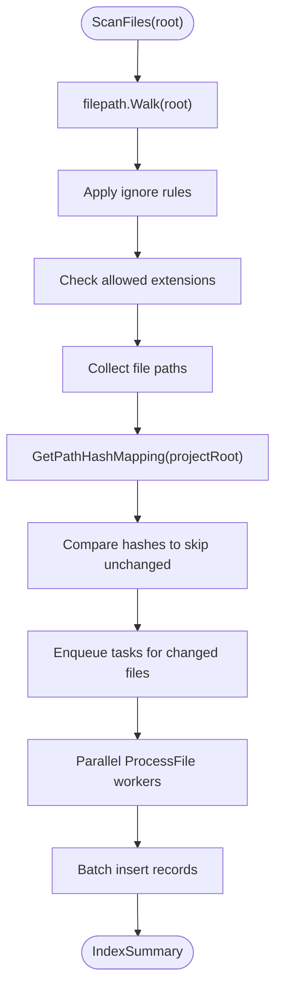
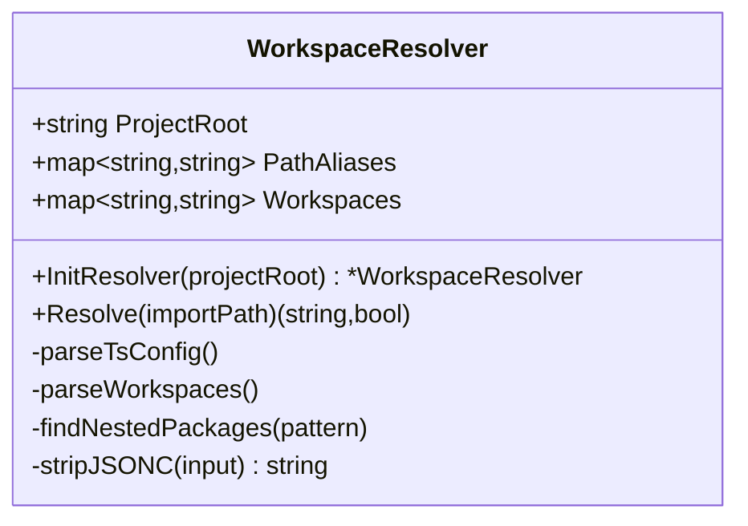
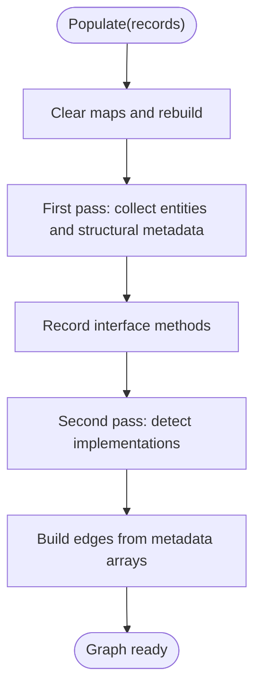
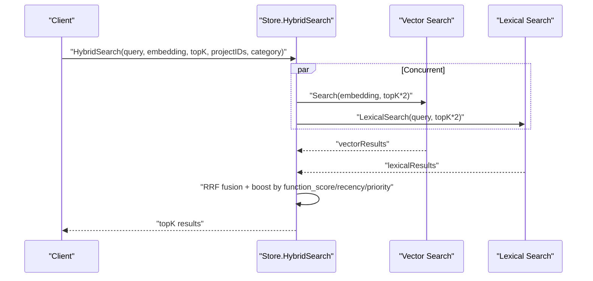
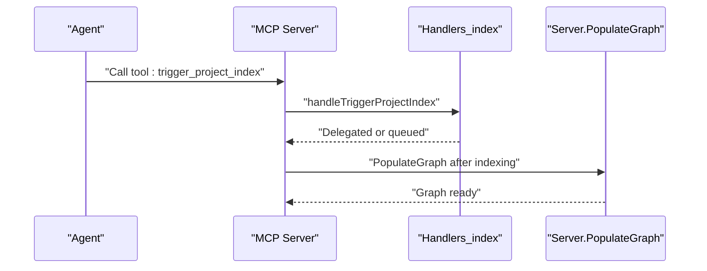
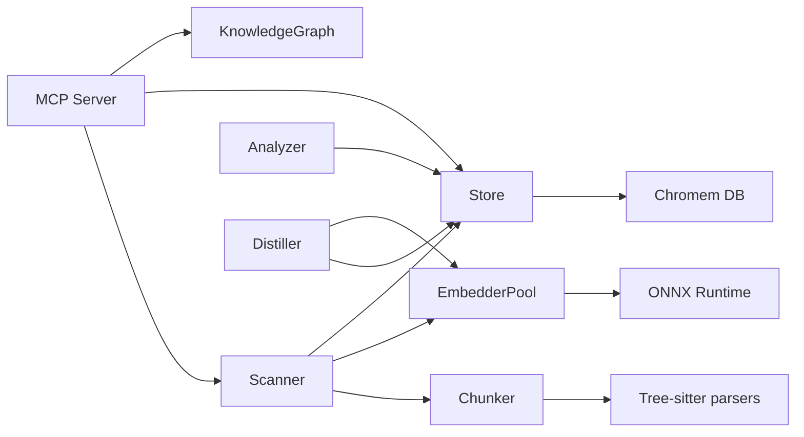

# Relationship Extraction and Metadata

<cite>
**Referenced Files in This Document**
- [main.go](file://main.go)
- [config.go](file://internal/config/config.go)
- [scanner.go](file://internal/indexer/scanner.go)
- [chunker.go](file://internal/indexer/chunker.go)
- [resolver.go](file://internal/indexer/resolver.go)
- [store.go](file://internal/db/store.go)
- [graph.go](file://internal/db/graph.go)
- [server.go](file://internal/mcp/server.go)
- [handlers_index.go](file://internal/mcp/handlers_index.go)
- [session.go](file://internal/embedding/session.go)
- [analyzer.go](file://internal/analysis/analyzer.go)
- [distiller.go](file://internal/analysis/distiller.go)
- [scanner_test.go](file://internal/indexer/scanner_test.go)
- [resolver_test.go](file://internal/indexer/resolver_test.go)
- [store_bench_test.go](file://internal/db/store_bench_test.go)
</cite>

## Table of Contents
1. [Introduction](#introduction)
2. [Project Structure](#project-structure)
3. [Core Components](#core-components)
4. [Architecture Overview](#architecture-overview)
5. [Detailed Component Analysis](#detailed-component-analysis)
6. [Dependency Analysis](#dependency-analysis)
7. [Performance Considerations](#performance-considerations)
8. [Troubleshooting Guide](#troubleshooting-guide)
9. [Conclusion](#conclusion)

## Introduction
This document explains the relationship extraction and metadata enrichment system that powers semantic indexing and retrieval of codebases. It covers how code entities are identified, how cross-file relationships are discovered and tracked, and how metadata is enriched for each chunk. It also documents the scanning pipeline, the relationship resolution system, configuration options, performance optimizations, and troubleshooting strategies for missing or incorrect relationships.

## Project Structure
The relationship extraction and metadata enrichment system spans several modules:
- Indexing pipeline: file discovery, chunking, embedding, and database insertion
- Relationship extraction: per-language parsing of imports, requires, and calls
- Metadata enrichment: path, language category, timestamps, hashes, and structural metadata
- Knowledge graph: in-memory graph for high-order reasoning and implementation detection
- Search and hybrid retrieval: vector and lexical search with recency and priority boosting
- MCP server integration: tools for triggering indexing, retrieving diagnostics, and managing context

**Diagram sources**
- [scanner.go:68-191](file://internal/indexer/scanner.go#L68-L191)
- [chunker.go:43-101](file://internal/indexer/chunker.go#L43-L101)
- [session.go:38-85](file://internal/embedding/session.go#L38-L85)
- [store.go:66-78](file://internal/db/store.go#L66-L78)
- [graph.go:36-105](file://internal/db/graph.go#L36-L105)
- [server.go:88-117](file://internal/mcp/server.go#L88-L117)
- [handlers_index.go:18-38](file://internal/mcp/handlers_index.go#L18-L38)

**Section sources**
- [main.go:93-176](file://main.go#L93-L176)
- [config.go:30-130](file://internal/config/config.go#L30-L130)

## Core Components
- Scanner: Discovers files, computes hashes, filters unchanged files, processes content, and inserts records into the store. It supports PDF and document ingestion alongside code.
- Chunker: Uses Tree-sitter for language-aware chunking, extracts symbols, parent scopes, calls, docstrings, and structural metadata, and builds contextual strings for embeddings.
- Relationship Parser: Extracts import/use relationships per language (TypeScript/JavaScript, Go, PHP).
- Metadata Enrichment: Adds path, project_id, category, timestamps, hashes, symbol arrays, calls, relationships, function scores, structural metadata, and line ranges.
- Store: Vector database abstraction with hybrid search, lexical filtering, and recency boosting.
- Knowledge Graph: Builds an in-memory graph from records for implementation detection and usage tracing.
- MCP Server: Exposes tools for indexing, diagnostics, and context management.

**Section sources**
- [scanner.go:68-355](file://internal/indexer/scanner.go#L68-L355)
- [chunker.go:43-758](file://internal/indexer/chunker.go#L43-L758)
- [store.go:80-336](file://internal/db/store.go#L80-L336)
- [graph.go:36-155](file://internal/db/graph.go#L36-L155)
- [server.go:165-182](file://internal/mcp/server.go#L165-L182)

## Architecture Overview
The indexing pipeline is orchestrated by the MCP server and runs in master/slave modes. The master initializes the embedder pool, connects to the vector store, and coordinates background workers and file watching. The slave delegates operations to the master via RPC.

**Diagram sources**
- [main.go:178-202](file://main.go#L178-L202)
- [scanner.go:68-191](file://internal/indexer/scanner.go#L68-L191)
- [scanner.go:194-355](file://internal/indexer/scanner.go#L194-L355)
- [chunker.go:43-101](file://internal/indexer/chunker.go#L43-L101)
- [session.go:323-348](file://internal/embedding/session.go#L323-L348)
- [store.go:66-78](file://internal/db/store.go#L66-L78)

## Detailed Component Analysis

### Relationship Extraction and Metadata Enrichment
- Relationship extraction:
  - TypeScript/JavaScript: Parses import statements, dynamic require calls, and named imports.
  - Go: Parses single-line and block import statements, including grouped imports.
  - PHP: Parses require/include and use statements, including aliases.
- Metadata enrichment per chunk:
  - Core fields: path, project_id, category, updated_at, hash, type, name, parent_symbol
  - Arrays: symbols, calls, relationships
  - Scores: function_score, priority
  - Structural: structural_metadata (fields/methods), docstring
  - Position: start_line, end_line
- File-level metadata record: separate "file_meta" record with hash and updated_at for efficient stale file cleanup.

**Diagram sources**
- [scanner.go:246-335](file://internal/indexer/scanner.go#L246-L335)
- [chunker.go:594-646](file://internal/indexer/chunker.go#L594-L646)
- [chunker.go:648-722](file://internal/indexer/chunker.go#L648-L722)
- [chunker.go:423-452](file://internal/indexer/chunker.go#L423-L452)
- [chunker.go:454-531](file://internal/indexer/chunker.go#L454-L531)

**Section sources**
- [chunker.go:648-722](file://internal/indexer/chunker.go#L648-L722)
- [chunker.go:594-646](file://internal/indexer/chunker.go#L594-L646)
- [chunker.go:423-531](file://internal/indexer/chunker.go#L423-L531)
- [scanner.go:286-314](file://internal/indexer/scanner.go#L286-L314)

### Scanning and Change Detection
- File discovery: Walks the project root, applies ignore rules (.vector-ignore or .gitignore), filters by allowed extensions, and excludes heavy or lock files.
- Hash-based change detection: Compares file hashes to skip unchanged files and cleans up stale records.
- Parallel processing: Worker goroutines consume tasks and stream results back, batching inserts and updating progress.

**Diagram sources**
- [scanner.go:361-423](file://internal/indexer/scanner.go#L361-L423)
- [scanner.go:73-118](file://internal/indexer/scanner.go#L73-L118)
- [scanner.go:120-191](file://internal/indexer/scanner.go#L120-L191)

**Section sources**
- [scanner.go:361-423](file://internal/indexer/scanner.go#L361-L423)
- [scanner.go:73-118](file://internal/indexer/scanner.go#L73-L118)
- [scanner.go:120-191](file://internal/indexer/scanner.go#L120-L191)

### Relationship Resolution System
- WorkspaceResolver: Parses tsconfig.json path aliases and pnpm/package.json workspaces to resolve import paths to physical locations.
- Resolution order: Path aliases first, then workspace packages, returning a relative path and a boolean indicating success.

**Diagram sources**
- [resolver.go:10-27](file://internal/indexer/resolver.go#L10-L27)
- [resolver.go:87-114](file://internal/indexer/resolver.go#L87-L114)
- [resolver.go:116-167](file://internal/indexer/resolver.go#L116-L167)
- [resolver.go:169-188](file://internal/indexer/resolver.go#L169-L188)

**Section sources**
- [resolver.go:16-189](file://internal/indexer/resolver.go#L16-L189)

### Knowledge Graph Population and Queries
- Populate: Iterates records, extracts name/type/path/docstring/structural_metadata, collects interface methods, and detects implementations by method signature matching.
- Queries: GetImplementations, FindUsage, SearchByName, GetNodeByID.

**Diagram sources**
- [graph.go:36-105](file://internal/db/graph.go#L36-L105)

**Section sources**
- [graph.go:36-155](file://internal/db/graph.go#L36-L155)

### Search and Hybrid Retrieval
- Vector search: Similarity-based retrieval with optional project scoping and category filtering.
- Lexical search: Parallel filtering over symbols, names, content, and calls arrays with caching of parsed JSON arrays.
- Hybrid search: Reciprocal Rank Fusion (RRF) with dynamic weights, recency boost for documents, and priority boost for results.
- Boosting factors: Function score, recency (documents), and priority (files).

**Diagram sources**
- [store.go:223-336](file://internal/db/store.go#L223-L336)

**Section sources**
- [store.go:80-336](file://internal/db/store.go#L80-L336)

### MCP Integration and Management Tools
- Indexing triggers: handleTriggerProjectIndex, handleIndexStatus, handleGetIndexingDiagnostics.
- Graph population: PopulateGraph fetches all records and rebuilds the knowledge graph.
- Configuration: LoadConfig reads environment variables for paths, model names, watchers, and pool sizes.

**Diagram sources**
- [handlers_index.go:18-38](file://internal/mcp/handlers_index.go#L18-L38)
- [server.go:165-182](file://internal/mcp/server.go#L165-L182)

**Section sources**
- [handlers_index.go:18-226](file://internal/mcp/handlers_index.go#L18-L226)
- [server.go:165-182](file://internal/mcp/server.go#L165-L182)
- [config.go:30-130](file://internal/config/config.go#L30-L130)

## Dependency Analysis
- External libraries:
  - Tree-sitter parsers for Go, JavaScript/TypeScript, Python, Rust, PHP, HTML, CSS
  - ONNX runtime for embeddings and optional reranking
  - Chromem for persistent vector storage
  - Gitignore matcher for ignore rules
- Internal dependencies:
  - Scanner depends on Chunker, Embedder, and Store
  - Store depends on Chromem
  - KnowledgeGraph depends on Store metadata
  - MCP Server orchestrates Scanner, Store, and KnowledgeGraph
  - Analyzer and Distiller depend on Store and Embedder

**Diagram sources**
- [scanner.go:3-23](file://internal/indexer/scanner.go#L3-L23)
- [chunker.go:3-20](file://internal/indexer/chunker.go#L3-L20)
- [session.go:3-14](file://internal/embedding/session.go#L3-L14)
- [store.go:3-17](file://internal/db/store.go#L3-L17)
- [server.go:8-26](file://internal/mcp/server.go#L8-L26)
- [analyzer.go:3-11](file://internal/analysis/analyzer.go#L3-L11)
- [distiller.go:15-27](file://internal/analysis/distiller.go#L15-L27)

**Section sources**
- [scanner.go:3-23](file://internal/indexer/scanner.go#L3-L23)
- [chunker.go:3-20](file://internal/indexer/chunker.go#L3-L20)
- [session.go:3-14](file://internal/embedding/session.go#L3-L14)
- [store.go:3-17](file://internal/db/store.go#L3-L17)
- [server.go:8-26](file://internal/mcp/server.go#L8-L26)
- [analyzer.go:3-11](file://internal/analysis/analyzer.go#L3-L11)
- [distiller.go:15-27](file://internal/analysis/distiller.go#L15-L27)

## Performance Considerations
- Parallelization:
  - Scanner uses runtime.NumCPU goroutines to process files concurrently.
  - Lexical search parallelizes filtering across CPU cores.
- Batching:
  - Embedder pool and batch embedding reduce overhead.
  - Batch inserts minimize database round-trips.
- Memory management:
  - EmbedderPool limits concurrent sessions.
  - KnowledgeGraph uses read-write locks and avoids unnecessary copies.
  - Store caches parsed JSON arrays to avoid repeated unmarshalling.
- Caching and hashing:
  - Hash comparison skips unchanged files.
  - ProgressMap tracks real-time status for responsiveness.
- Tuning:
  - EmbedderPoolSize controls concurrency.
  - Chunk size and overlap are tuned for large-context models.

[No sources needed since this section provides general guidance]

## Troubleshooting Guide
Common issues and resolutions:
- Missing relationships:
  - Verify language-specific regex patterns match your import style.
  - Ensure .vector-ignore or .gitignore does not exclude relevant files.
  - Confirm tsconfig.json path aliases and workspace configs are correct.
- Incorrect relationships:
  - Review WorkspaceResolver parsing for aliases and workspaces.
  - Validate that relative paths resolve to actual files.
- Stale or ghost chunks:
  - Use DeleteByPath/DeleteByPrefix to remove outdated records before reindexing.
  - Confirm hash-based change detection is working.
- Slow indexing:
  - Increase EmbedderPoolSize and leverage parallel workers.
  - Reduce ignore rules to include fewer files.
- Diagnostics:
  - Use handleGetIndexingDiagnostics for status and background task details.
  - Check MCP index://status resource for live telemetry.

**Section sources**
- [scanner.go:105-113](file://internal/indexer/scanner.go#L105-L113)
- [store.go:411-439](file://internal/db/store.go#L411-L439)
- [handlers_index.go:130-169](file://internal/mcp/handlers_index.go#L130-L169)
- [resolver.go:87-188](file://internal/indexer/resolver.go#L87-L188)

## Conclusion
The relationship extraction and metadata enrichment system combines language-aware chunking, robust relationship parsing, and rich metadata to power accurate semantic search and high-order reasoning. The modular design enables scalable indexing, efficient retrieval, and practical troubleshooting. By tuning configuration options and leveraging the provided tools, teams can maintain precise and performant codebase indexes across large, polyglot repositories.