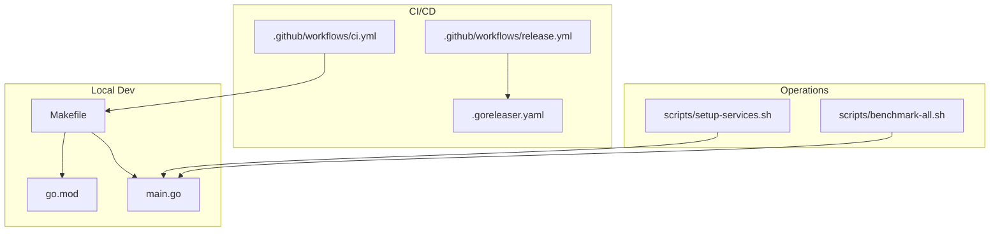
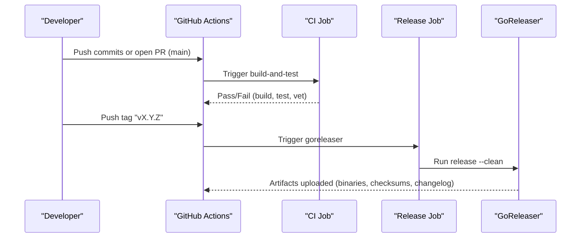
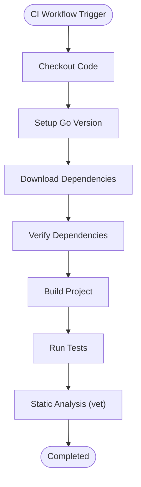
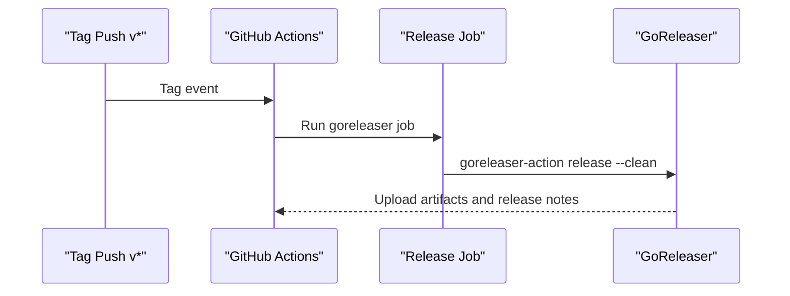
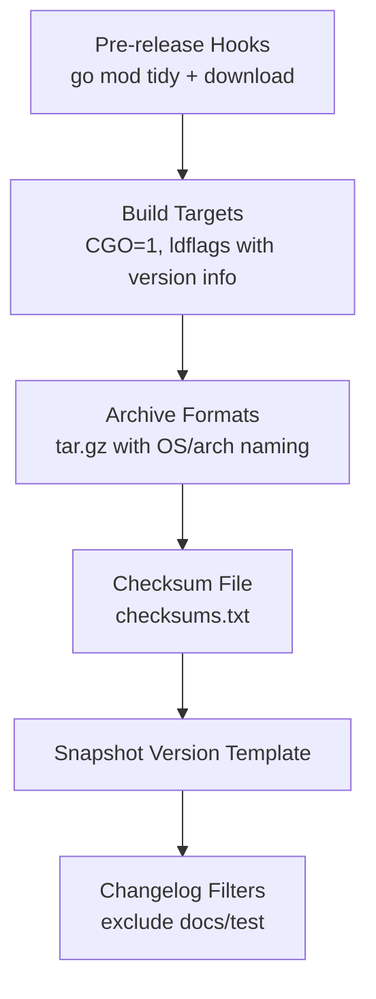
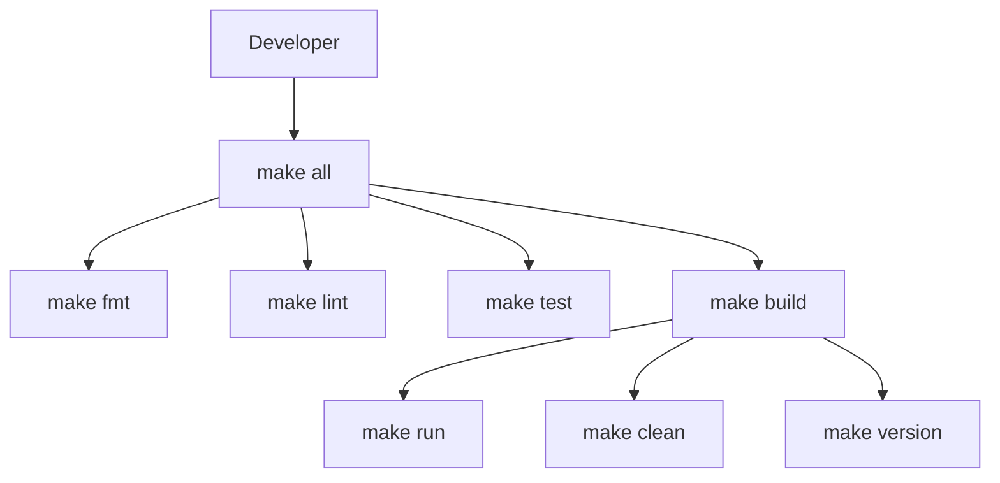
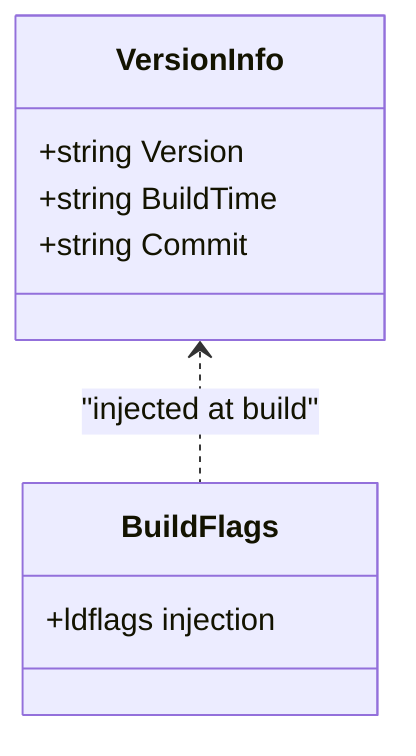
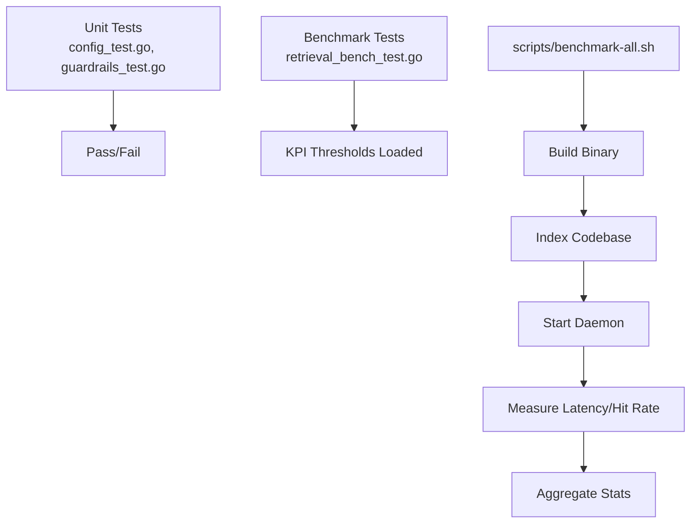
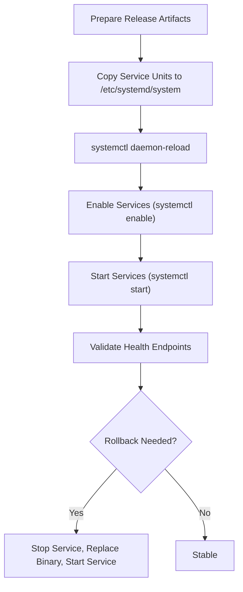
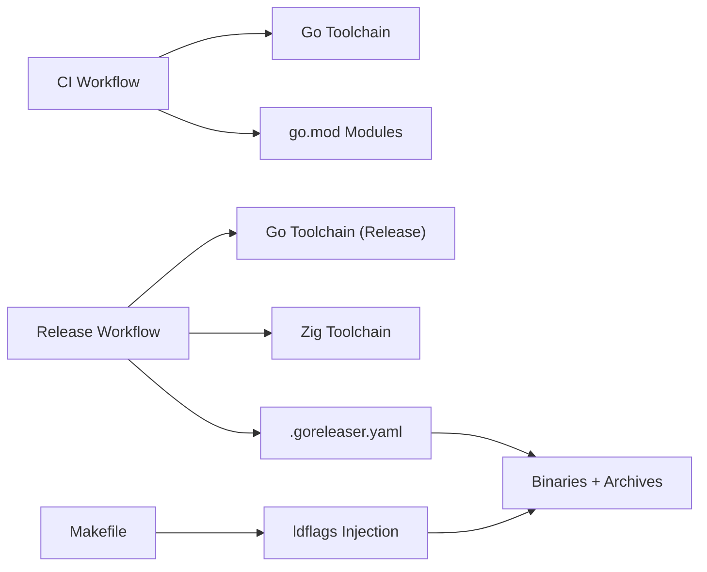

# CI/CD and Release Management

<cite>
**Referenced Files in This Document**
- [.github/workflows/ci.yml](file://.github/workflows/ci.yml)
- [.github/workflows/release.yml](file://.github/workflows/release.yml)
- [.goreleaser.yaml](file://.goreleaser.yaml)
- [Makefile](file://Makefile)
- [go.mod](file://go.mod)
- [main.go](file://main.go)
- [scripts/setup-services.sh](file://scripts/setup-services.sh)
- [scripts/benchmark-all.sh](file://scripts/benchmark-all.sh)
- [RELEASE_NOTES.md](file://RELEASE_NOTES.md)
- [internal/config/config_test.go](file://internal/config/config_test.go)
- [internal/util/guardrails_test.go](file://internal/util/guardrails_test.go)
- [benchmark/retrieval_bench_test.go](file://benchmark/retrieval_bench_test.go)
</cite>

## Table of Contents
1. [Introduction](#introduction)
2. [Project Structure](#project-structure)
3. [Core Components](#core-components)
4. [Architecture Overview](#architecture-overview)
5. [Detailed Component Analysis](#detailed-component-analysis)
6. [Dependency Analysis](#dependency-analysis)
7. [Performance Considerations](#performance-considerations)
8. [Troubleshooting Guide](#troubleshooting-guide)
9. [Conclusion](#conclusion)
10. [Appendices](#appendices)

## Introduction
This document describes the CI/CD and release management practices for Vector MCP Go. It covers the GitHub Actions workflows for continuous integration and releases, the GoReleaser configuration for building and distributing artifacts, automated testing and quality checks, and operational deployment scripts. It also documents branching and merging policies, release validation, and guidance for extending the pipeline.

## Project Structure
Vector MCP Go organizes CI/CD assets under the .github/workflows directory and release packaging under .goreleaser.yaml. Local developer workflows are supported via a Makefile. Release notes and benchmarking utilities complement the CI/CD setup.

**Diagram sources**
- [.github/workflows/ci.yml:1-37](file://.github/workflows/ci.yml#L1-L37)
- [.github/workflows/release.yml:1-38](file://.github/workflows/release.yml#L1-L38)
- [.goreleaser.yaml:1-54](file://.goreleaser.yaml#L1-L54)
- [Makefile:1-44](file://Makefile#L1-L44)
- [go.mod:1-37](file://go.mod#L1-L37)
- [main.go:1-349](file://main.go#L1-L349)
- [scripts/setup-services.sh:1-31](file://scripts/setup-services.sh#L1-L31)
- [scripts/benchmark-all.sh:1-127](file://scripts/benchmark-all.sh#L1-L127)

**Section sources**
- [.github/workflows/ci.yml:1-37](file://.github/workflows/ci.yml#L1-L37)
- [.github/workflows/release.yml:1-38](file://.github/workflows/release.yml#L1-L38)
- [.goreleaser.yaml:1-54](file://.goreleaser.yaml#L1-L54)
- [Makefile:1-44](file://Makefile#L1-L44)
- [go.mod:1-37](file://go.mod#L1-L37)
- [main.go:1-349](file://main.go#L1-L349)
- [scripts/setup-services.sh:1-31](file://scripts/setup-services.sh#L1-L31)
- [scripts/benchmark-all.sh:1-127](file://scripts/benchmark-all.sh#L1-L127)

## Core Components
- Continuous Integration workflow: Builds, tests, and vets the code on pushes and pull requests to main.
- Release workflow: Builds cross-platform binaries and archives using GoReleaser on tag pushes.
- GoReleaser configuration: Defines builds, archives, checksums, snapshot versioning, and changelog filtering.
- Local developer workflow: Makefile targets for fmt, lint, test, build, run, and version inspection.
- Operational scripts: Service setup and benchmarking utilities for deployment and performance validation.

**Section sources**
- [.github/workflows/ci.yml:1-37](file://.github/workflows/ci.yml#L1-L37)
- [.github/workflows/release.yml:1-38](file://.github/workflows/release.yml#L1-L38)
- [.goreleaser.yaml:1-54](file://.goreleaser.yaml#L1-L54)
- [Makefile:1-44](file://Makefile#L1-L44)

## Architecture Overview
The CI/CD pipeline consists of two primary GitHub Actions workflows orchestrated around GoReleaser. The CI workflow validates code quality and correctness, while the Release workflow packages binaries for distribution.

**Diagram sources**
- [.github/workflows/ci.yml:1-37](file://.github/workflows/ci.yml#L1-L37)
- [.github/workflows/release.yml:1-38](file://.github/workflows/release.yml#L1-L38)
- [.goreleaser.yaml:1-54](file://.goreleaser.yaml#L1-L54)

## Detailed Component Analysis

### CI Workflow (.github/workflows/ci.yml)
- Triggers: On push to main and on pull_request to main.
- Environment:
  - Sets ONNX library path and dynamic loader path for runtime linking.
- Steps:
  - Checkout repository.
  - Set up Go with a specific version.
  - Download and verify module dependencies.
  - Build the project.
  - Run tests with verbose output.
  - Static analysis using vet.

**Diagram sources**
- [.github/workflows/ci.yml:1-37](file://.github/workflows/ci.yml#L1-L37)

**Section sources**
- [.github/workflows/ci.yml:1-37](file://.github/workflows/ci.yml#L1-L37)

### Release Workflow (.github/workflows/release.yml)
- Triggers: On push of tags matching "v*".
- Permissions: contents write.
- Steps:
  - Checkout with full history.
  - Set up Go with a specific version.
  - Set up Zig for cross-compilation toolchain.
  - Run GoReleaser to publish artifacts.

**Diagram sources**
- [.github/workflows/release.yml:1-38](file://.github/workflows/release.yml#L1-L38)
- [.goreleaser.yaml:1-54](file://.goreleaser.yaml#L1-L54)

**Section sources**
- [.github/workflows/release.yml:1-38](file://.github/workflows/release.yml#L1-L38)

### GoReleaser Configuration (.goreleaser.yaml)
- Version: Uses configuration version 2.
- Before hooks:
  - Tidy and download modules.
- Builds:
  - CGO enabled.
  - Cross-compiles Linux binaries for amd64 and arm64 with Zig targets.
  - Uses ldflags to inject version, commit, and build date.
- Archives:
  - tar.gz archives with OS/arch naming convention.
- Checksum:
  - Generates checksums.txt.
- Snapshot:
  - Next patch version template for non-tagged builds.
- Changelog:
  - Sorts entries ascending and excludes docs/test commits.

**Diagram sources**
- [.goreleaser.yaml:1-54](file://.goreleaser.yaml#L1-L54)

**Section sources**
- [.goreleaser.yaml:1-54](file://.goreleaser.yaml#L1-L54)

### Local Developer Workflow (Makefile)
- Targets:
  - all: fmt, lint, test, build.
  - fmt: gofmt formatting.
  - lint: go vet.
  - build: compile with injected version/build-time/commit.
  - test: run tests.
  - clean: remove binary and dist.
  - run: build and execute locally.
  - version: print version/build-time/commit.
- Variables:
  - VERSION derived from git describe.
  - BUILD_TIME and COMMIT derived from git.

**Diagram sources**
- [Makefile:1-44](file://Makefile#L1-L44)

**Section sources**
- [Makefile:1-44](file://Makefile#L1-L44)

### Version Embedding in main.go
- Global variables define version, build time, and commit.
- ldflags from Makefile and GoReleaser inject these values at build time.
- Version flags in main print version metadata.

**Diagram sources**
- [main.go:31-35](file://main.go#L31-L35)
- [Makefile:7](file://Makefile#L7)
- [.goreleaser.yaml:28-29](file://.goreleaser.yaml#L28-L29)

**Section sources**
- [main.go:31-35](file://main.go#L31-L35)
- [Makefile:7](file://Makefile#L7)
- [.goreleaser.yaml:28-29](file://.goreleaser.yaml#L28-L29)

### Automated Testing Strategies
- Unit tests:
  - Config tests validate environment-driven defaults and overrides.
  - Guardrails tests validate clamping and truncation utilities.
- Benchmark tests:
  - Retrieval KPI thresholds loaded from fixture JSON for regression detection.
- Benchmarking script:
  - Builds the project, iterates embedder/reranker combinations, indexes, starts daemon, measures latency and hit rate, and reports statistics.

**Diagram sources**
- [internal/config/config_test.go:1-138](file://internal/config/config_test.go#L1-L138)
- [internal/util/guardrails_test.go:1-107](file://internal/util/guardrails_test.go#L1-L107)
- [benchmark/retrieval_bench_test.go:62-96](file://benchmark/retrieval_bench_test.go#L62-L96)
- [scripts/benchmark-all.sh:1-127](file://scripts/benchmark-all.sh#L1-L127)

**Section sources**
- [internal/config/config_test.go:1-138](file://internal/config/config_test.go#L1-L138)
- [internal/util/guardrails_test.go:1-107](file://internal/util/guardrails_test.go#L1-L107)
- [benchmark/retrieval_bench_test.go:62-96](file://benchmark/retrieval_bench_test.go#L62-L96)
- [scripts/benchmark-all.sh:1-127](file://scripts/benchmark-all.sh#L1-L127)

### Deployment Automation and Rollback Procedures
- Service setup:
  - Copies systemd service units and enables them to start at boot.
  - Starts services immediately and prints status commands.
- Rollback guidance:
  - Keep previous release artifacts and checksums for quick revert.
  - Use service unit rollback by stopping and restarting the service or switching to a prior binary path.
  - Validate health endpoints post-deployment.

**Diagram sources**
- [scripts/setup-services.sh:1-31](file://scripts/setup-services.sh#L1-L31)

**Section sources**
- [scripts/setup-services.sh:1-31](file://scripts/setup-services.sh#L1-L31)

### Release Validation Processes
- Pre-release:
  - Ensure tag follows semantic versioning pattern vX.Y.Z.
  - Review release notes for changes and impact.
- Post-release:
  - Verify checksums.txt integrity.
  - Confirm archives extract and binaries execute on target platforms.
  - Validate changelog entries and snapshot behavior for prereleases.

**Section sources**
- [.goreleaser.yaml:45-54](file://.goreleaser.yaml#L45-L54)
- [RELEASE_NOTES.md:1-36](file://RELEASE_NOTES.md#L1-L36)

### Branch Protection Rules, Pull Request Workflows, and Merge Strategies
- Branch protection:
  - Require CI jobs to pass before merging to main.
  - Dismiss stale review approvals on new pushes.
  - Require at least one approving review.
- Pull request workflow:
  - Open PR targeting main.
  - CI automatically runs on push and PR events.
  - Address comments and update PR until approved.
- Merge strategies:
  - Squash and merge to keep history linear.
  - Rebase merge to integrate cleanly if preferred.

[No sources needed since this section provides general guidance]

### Artifact Management, Package Distribution, and Version Compatibility Tracking
- Artifacts:
  - Linux binaries for amd64 and arm64.
  - tar.gz archives named by OS and architecture.
  - checksums.txt for integrity verification.
- Distribution:
  - GitHub Releases created by GoReleaser.
- Version compatibility:
  - ldflags inject version, commit, and build date into binaries.
  - Makefile and GoReleaser align versions for local and release builds.

**Section sources**
- [.goreleaser.yaml:10-43](file://.goreleaser.yaml#L10-L43)
- [Makefile:3-7](file://Makefile#L3-L7)
- [.goreleaser.yaml:28-29](file://.goreleaser.yaml#L28-L29)

### Extending the CI/CD Pipeline and Integrating External Tools
- Add quality gates:
  - Integrate static analysis tools (e.g., revive, gocyclo).
  - Add license compliance checks (e.g., fossa, depguard).
- Security scanning:
  - Integrate SAST tools (e.g., CodeQL, Semgrep) in CI.
  - Add dependency vulnerability scanning (e.g., govulncheck).
- Multi-environment deployments:
  - Extend GoReleaser to produce platform-specific packages (deb, rpm).
  - Add smoke tests per environment in CI.
- Observability:
  - Publish test coverage reports and benchmark metrics to dashboards.

[No sources needed since this section provides general guidance]

## Dependency Analysis
- CI depends on:
  - Go toolchain version pinned in CI and Release workflows.
  - Zig toolchain for cross-compilation in the Release workflow.
  - Module dependencies managed via go.mod and verified in CI.
- Release depends on:
  - GoReleaser configuration for build targets and archive formats.
  - Version metadata injected via ldflags from Makefile and GoReleaser.

**Diagram sources**
- [.github/workflows/ci.yml:18-21](file://.github/workflows/ci.yml#L18-L21)
- [.github/workflows/release.yml:20-28](file://.github/workflows/release.yml#L20-L28)
- [.goreleaser.yaml:10-30](file://.goreleaser.yaml#L10-L30)
- [Makefile:7](file://Makefile#L7)

**Section sources**
- [.github/workflows/ci.yml:18-21](file://.github/workflows/ci.yml#L18-L21)
- [.github/workflows/release.yml:20-28](file://.github/workflows/release.yml#L20-L28)
- [.goreleaser.yaml:10-30](file://.goreleaser.yaml#L10-L30)
- [Makefile:7](file://Makefile#L7)

## Performance Considerations
- CI performance:
  - Cache Go modules and build cache in CI runners.
  - Parallelize independent jobs where possible.
- Release performance:
  - Use Zig cross-compilation to avoid matrix builds.
  - Limit archive formats to reduce upload time.
- Benchmarking:
  - Use the benchmark script to measure latency and hit rates across model combinations.
  - Establish KPI thresholds to detect regressions.

[No sources needed since this section provides general guidance]

## Troubleshooting Guide
- CI fails on dependency verification:
  - Ensure go.mod and go.sum are consistent; run module tidy locally.
- Release fails due to missing Zig:
  - Confirm Zig setup action version matches GoReleaser expectations.
- Artifacts missing or checksum mismatch:
  - Verify checksums.txt presence and integrity.
  - Check ldflags injection for version/build metadata.
- Service does not start after deployment:
  - Confirm service unit paths and permissions.
  - Check logs via systemctl status and journalctl.

**Section sources**
- [.github/workflows/ci.yml:23-27](file://.github/workflows/ci.yml#L23-L27)
- [.github/workflows/release.yml:25-28](file://.github/workflows/release.yml#L25-L28)
- [.goreleaser.yaml:42-43](file://.goreleaser.yaml#L42-L43)
- [scripts/setup-services.sh:12-25](file://scripts/setup-services.sh#L12-L25)

## Conclusion
Vector MCP Go’s CI/CD pipeline provides reliable, repeatable builds and releases across Linux platforms. The CI workflow enforces quality and correctness, while the Release workflow leverages GoReleaser to produce distributable artifacts. Combined with local developer workflows, benchmarking, and deployment scripts, the system supports efficient development, validation, and operations.

## Appendices
- Version compatibility:
  - CI uses a Go version aligned with the project’s go.mod.
  - Release uses a separate Go version for release builds.
- Release notes:
  - Maintain a release notes document to summarize changes and migration notes.

**Section sources**
- [go.mod:3](file://go.mod#L3)
- [.github/workflows/release.yml:22](file://.github/workflows/release.yml#L22)
- [RELEASE_NOTES.md:1-36](file://RELEASE_NOTES.md#L1-L36)