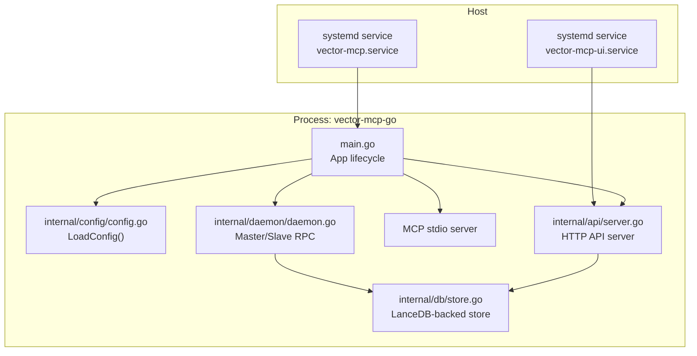
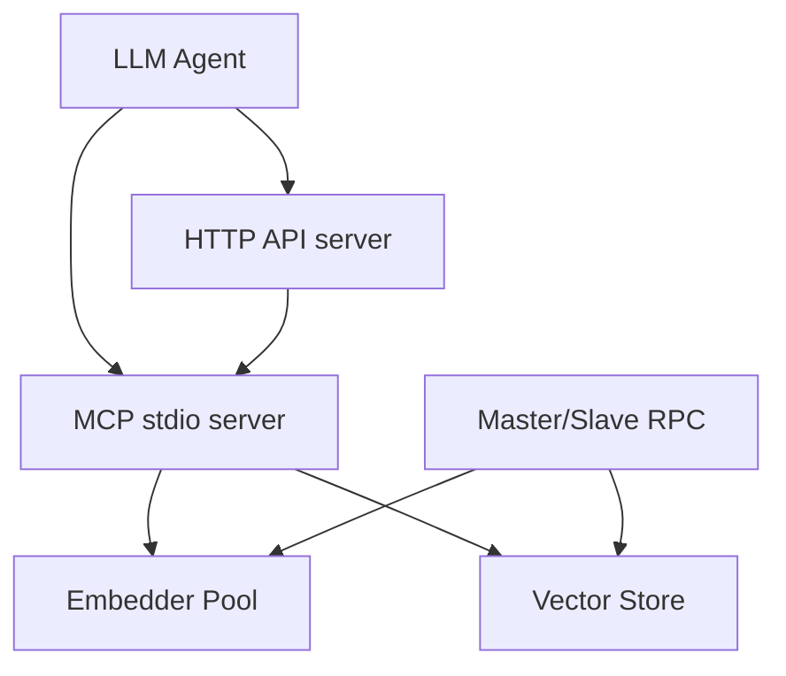
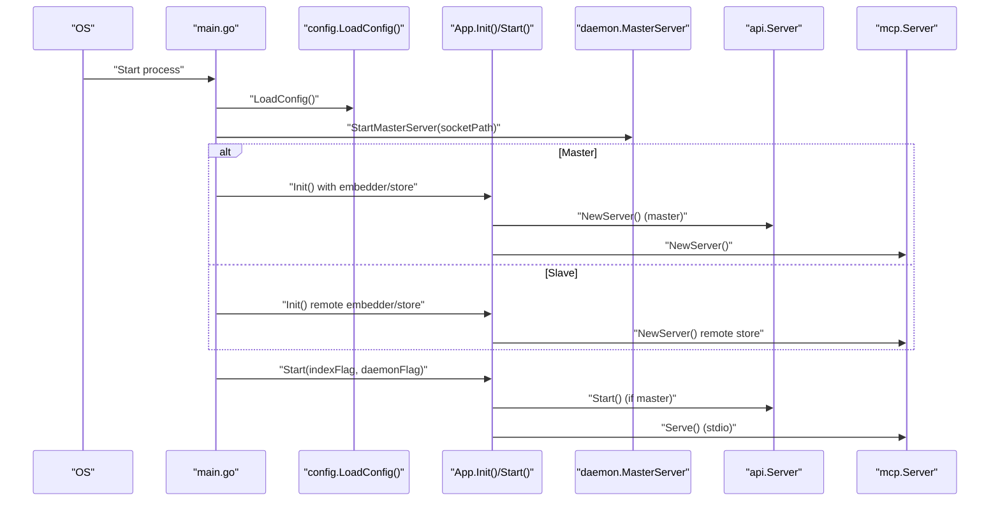
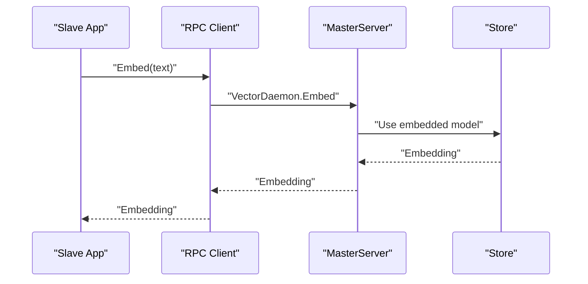
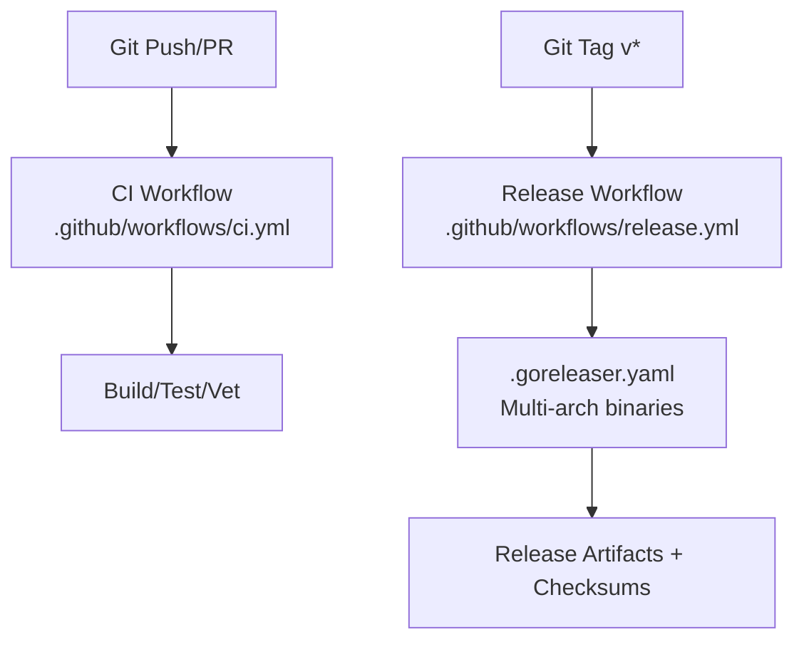
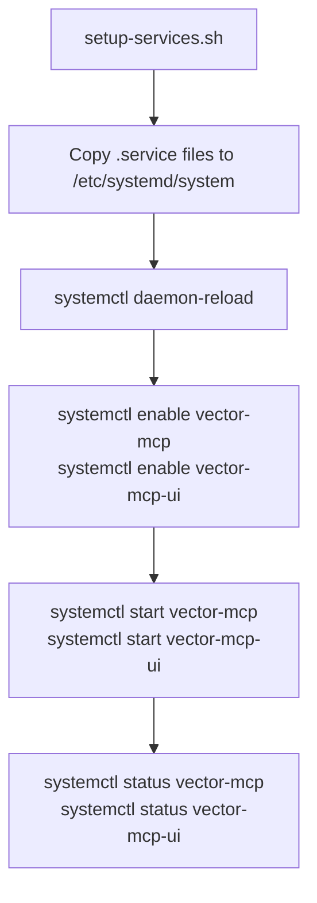
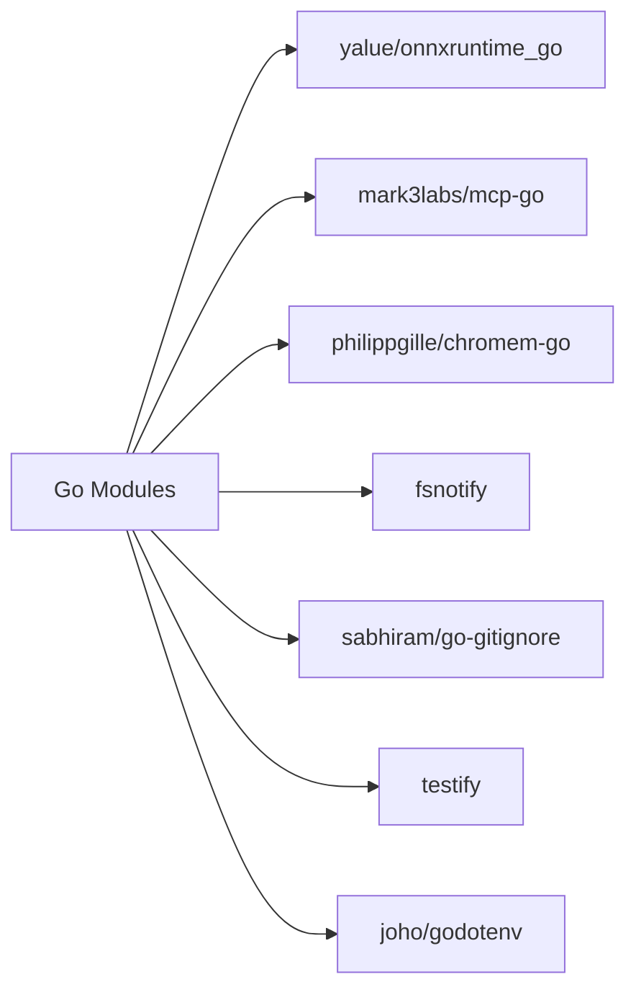

# Deployment and Operations

<cite>
**Referenced Files in This Document**
- [README.md](file://README.md)
- [main.go](file://main.go)
- [internal/config/config.go](file://internal/config/config.go)
- [.github/workflows/ci.yml](file://.github/workflows/ci.yml)
- [.github/workflows/release.yml](file://.github/workflows/release.yml)
- [.goreleaser.yaml](file://.goreleaser.yaml)
- [Makefile](file://Makefile)
- [internal/daemon/daemon.go](file://internal/daemon/daemon.go)
- [internal/api/server.go](file://internal/api/server.go)
- [internal/db/store.go](file://internal/db/store.go)
- [scripts/vector-mcp.service](file://scripts/vector-mcp.service)
- [scripts/vector-mcp-ui.service](file://scripts/vector-mcp-ui.service)
- [scripts/setup-services.sh](file://scripts/setup-services.sh)
- [mcp-config.json.example](file://mcp-config.json.example)
</cite>

## Table of Contents
1. [Introduction](#introduction)
2. [Project Structure](#project-structure)
3. [Core Components](#core-components)
4. [Architecture Overview](#architecture-overview)
5. [Detailed Component Analysis](#detailed-component-analysis)
6. [Dependency Analysis](#dependency-analysis)
7. [Performance Considerations](#performance-considerations)
8. [Troubleshooting Guide](#troubleshooting-guide)
9. [Conclusion](#conclusion)
10. [Appendices](#appendices)

## Introduction
This document provides comprehensive deployment and operations guidance for Vector MCP Go. It covers production deployment strategies, containerization approaches, infrastructure requirements, CI/CD pipelines, automated testing and release management, service configuration for systemd integration, process supervision, health monitoring, configuration and secrets management, monitoring and logging, alerting, operational troubleshooting, backup and recovery, disaster recovery planning, maintenance schedules, scaling, capacity planning, and performance monitoring.

## Project Structure
Vector MCP Go is a single-process Go application that exposes:
- An MCP server over stdio for LLM agents
- An optional HTTP API server for tool orchestration and health checks
- A Unix-domain RPC daemon for master/slave coordination

Key runtime entry points and configuration:
- Application entrypoint initializes configuration, logging, stores, embedders, and servers
- Configuration is loaded from environment variables and .env files, with sensible defaults
- Optional systemd service units and a setup script streamline production deployment

**Diagram sources**
- [main.go:280-317](file://main.go#L280-L317)
- [internal/config/config.go:30-130](file://internal/config/config.go#L30-L130)
- [internal/api/server.go:35-109](file://internal/api/server.go#L35-L109)
- [internal/daemon/daemon.go:333-378](file://internal/daemon/daemon.go#L333-L378)
- [internal/db/store.go:35-64](file://internal/db/store.go#L35-L64)

**Section sources**
- [README.md:1-40](file://README.md#L1-L40)
- [main.go:280-317](file://main.go#L280-L317)
- [internal/config/config.go:30-130](file://internal/config/config.go#L30-L130)

## Core Components
- Application lifecycle and resource management
  - Initializes configuration, logging, stores, embedder pools, MCP server, optional API server, and workers
  - Supports master/slave daemon mode with Unix RPC for distributed compute
- Configuration and environment variables
  - Loads .env if present, applies environment overrides, ensures directories, configures structured logging, and sets defaults
- HTTP API server
  - Exposes health endpoint and MCP over HTTP/SSE for browser-based clients
- Daemon (master/slave)
  - Provides RPC methods for embeddings, search, insert/delete, status, and progress
- Database store
  - LanceDB-backed vector store with hybrid search, lexical filtering, and metadata-aware ranking

**Section sources**
- [main.go:37-71](file://main.go#L37-L71)
- [main.go:93-176](file://main.go#L93-L176)
- [internal/config/config.go:30-130](file://internal/config/config.go#L30-L130)
- [internal/api/server.go:35-109](file://internal/api/server.go#L35-L109)
- [internal/daemon/daemon.go:17-286](file://internal/daemon/daemon.go#L17-L286)
- [internal/db/store.go:19-664](file://internal/db/store.go#L19-L664)

## Architecture Overview
The system operates as a single binary with optional subsystems:
- MCP stdio server for agent interaction
- HTTP API server for tool orchestration and health checks
- Daemon for master/slave coordination and shared resources
- Persistent vector store for embeddings and metadata

**Diagram sources**
- [main.go:159-175](file://main.go#L159-L175)
- [internal/api/server.go:46-71](file://internal/api/server.go#L46-L71)
- [internal/daemon/daemon.go:326-399](file://internal/daemon/daemon.go#L326-L399)
- [internal/db/store.go:35-64](file://internal/db/store.go#L35-L64)

## Detailed Component Analysis

### Application Lifecycle and Startup
- Flags and signals
  - Supports flags for data/model/db directories, one-shot indexing, daemon mode, and version printing
  - Registers OS signals for graceful shutdown
- Initialization
  - Detects master vs slave via daemon socket; initializes ONNX, models, embedder pool, store, MCP server, and API server
  - Starts live indexing, watchers, and workers in master mode
- Runtime modes
  - MCP stdio server, HTTP API server, or daemon-only mode

**Diagram sources**
- [main.go:280-317](file://main.go#L280-L317)
- [internal/config/config.go:30-130](file://internal/config/config.go#L30-L130)
- [internal/daemon/daemon.go:333-378](file://internal/daemon/daemon.go#L333-L378)
- [internal/api/server.go:112-121](file://internal/api/server.go#L112-L121)

**Section sources**
- [main.go:280-317](file://main.go#L280-L317)
- [internal/daemon/daemon.go:333-378](file://internal/daemon/daemon.go#L333-L378)

### Configuration and Environment Variables
- Configuration loading order and precedence
  - .env file (optional)
  - Explicit CLI flags override
  - Environment variables override defaults
  - Defaults for directories, ports, model names, and toggles
- Logging
  - Structured JSON logging to stderr and optional file
- Directory layout
  - Data directory, models directory, and database path are configurable

Recommended environment variables:
- DATA_DIR, DB_PATH, MODELS_DIR, LOG_PATH
- PROJECT_ROOT, MODEL_NAME, RERANKER_MODEL_NAME, HF_TOKEN
- DISABLE_FILE_WATCHER, ENABLE_LIVE_INDEXING, EMBEDDER_POOL_SIZE, API_PORT

**Section sources**
- [internal/config/config.go:30-130](file://internal/config/config.go#L30-L130)

### HTTP API Server and Health Monitoring
- Endpoints
  - GET /api/health for readiness/liveness
  - MCP over HTTP/SSE for browser-based clients
  - Tool management endpoints for repo listing, index status, triggering index, skeleton retrieval, tool listing, and tool invocation
- CORS and headers
  - Configured for browser-based clients and streaming transports
- Port binding
  - Bound to configured API_PORT

Operational tips:
- Use /api/health for Kubernetes probes
- Expose MCP endpoints behind reverse proxy with appropriate headers

**Section sources**
- [internal/api/server.go:46-139](file://internal/api/server.go#L46-L139)

### Daemon (Master/Slave) and IPC
- Master server
  - Registers RPC service and serves connections on a Unix domain socket
  - Updates embedder/store dynamically
- Slave client
  - Delegates embeddings, reranking, and store operations to master via RPC
- Remote embedder and store
  - Transparently proxy calls to master for slaves

**Diagram sources**
- [internal/daemon/daemon.go:401-437](file://internal/daemon/daemon.go#L401-L437)
- [internal/daemon/daemon.go:439-500](file://internal/daemon/daemon.go#L439-L500)
- [internal/db/store.go:35-64](file://internal/db/store.go#L35-L64)

**Section sources**
- [internal/daemon/daemon.go:326-399](file://internal/daemon/daemon.go#L326-L399)
- [internal/daemon/daemon.go:401-437](file://internal/daemon/daemon.go#L401-L437)
- [internal/daemon/daemon.go:439-500](file://internal/daemon/daemon.go#L439-L500)

### Vector Store and Indexing
- Store capabilities
  - Insert, search, hybrid search, lexical search, delete by path/prefix, status management, and metadata queries
- Hybrid search
  - Concurrent vector and lexical search with reciprocal rank fusion and metadata-based boosting
- Indexing pipeline
  - Full codebase indexing orchestrated by master; optional live indexing and file watching

Operational guidance:
- Monitor collection counts and status per project
- Use project scoping and categories to segment workloads

**Section sources**
- [internal/db/store.go:66-409](file://internal/db/store.go#L66-L409)
- [internal/db/store.go:223-336](file://internal/db/store.go#L223-L336)

### CI/CD Pipeline and Release Management
- CI workflow
  - Builds, tests, vets, and sets up ONNX runtime libraries for Linux
- Release workflow
  - Uses GoReleaser to produce multi-arch Linux binaries with ldflags injected at build time
- Build flags
  - Version, commit, and build time are embedded via Makefile and ldflags

**Diagram sources**
- [.github/workflows/ci.yml:1-37](file://.github/workflows/ci.yml#L1-L37)
- [.github/workflows/release.yml:1-38](file://.github/workflows/release.yml#L1-L38)
- [.goreleaser.yaml:10-30](file://.goreleaser.yaml#L10-L30)
- [Makefile:7](file://Makefile#L7)

**Section sources**
- [.github/workflows/ci.yml:1-37](file://.github/workflows/ci.yml#L1-L37)
- [.github/workflows/release.yml:1-38](file://.github/workflows/release.yml#L1-L38)
- [.goreleaser.yaml:10-30](file://.goreleaser.yaml#L10-L30)
- [Makefile:7](file://Makefile#L7)

### Systemd Integration and Process Supervision
- Service units
  - vector-mcp.service runs the backend in daemon mode with environment file
  - vector-mcp-ui.service runs the frontend Next.js app
- Setup script
  - Copies service files, reloads systemd, enables and starts services

**Diagram sources**
- [scripts/setup-services.sh:12-31](file://scripts/setup-services.sh#L12-L31)
- [scripts/vector-mcp.service:1-17](file://scripts/vector-mcp.service#L1-L17)
- [scripts/vector-mcp-ui.service:1-17](file://scripts/vector-mcp-ui.service#L1-L17)

**Section sources**
- [scripts/setup-services.sh:1-31](file://scripts/setup-services.sh#L1-L31)
- [scripts/vector-mcp.service:1-17](file://scripts/vector-mcp.service#L1-L17)
- [scripts/vector-mcp-ui.service:1-17](file://scripts/vector-mcp-ui.service#L1-L17)

### Containerization Approaches
- Multi-stage build (recommended)
  - Stage 1: Build binary with CGO enabled and Zig compiler for target-specific CC/CXX
  - Stage 2: Minimal runtime image (e.g., distroless) copying the binary and ONNX runtime library
- Image layout
  - Mount persistent volumes for data directory (models, DB, logs)
  - Pass environment variables via Kubernetes ConfigMap/Secrets or Docker env files
- Entrypoint
  - Run the binary with -daemon flag for systemd-less deployments
- Networking
  - Expose API_PORT for HTTP API and rely on stdio for MCP protocol
- Security
  - Drop unnecessary capabilities, run as non-root user, mount only required paths

[No sources needed since this section provides general guidance]

### Infrastructure Requirements
- Compute
  - CPU: Multi-core recommended for parallel lexical filtering and embedding batching
  - RAM: Scale with embedder pool size and dataset size; memory throttling is supported
- Storage
  - Local disk for models, LanceDB vectors, and logs
  - SSD recommended for vector index performance
- Networking
  - Unix socket for inter-process communication (master/daemon)
  - Optional HTTP API exposed on API_PORT
- Operating system
  - Linux (multi-arch builds supported)

[No sources needed since this section provides general guidance]

### Configuration Management, Environment Variables, and Secrets
- Configuration sources
  - .env file (development)
  - Environment variables (production)
  - CLI flags (override)
- Secret handling
  - HF_TOKEN for model downloads
  - Keep secrets out of images and repositories
- Example MCP configuration
  - mcp-config.json.example demonstrates how to configure the MCP server command and environment

**Section sources**
- [internal/config/config.go:30-130](file://internal/config/config.go#L30-L130)
- [mcp-config.json.example:1-12](file://mcp-config.json.example#L1-L12)

### Monitoring and Logging Strategies
- Logging
  - Structured JSON logging to stderr and optional file
  - Use centralized log collectors (e.g., Fluent Bit, Promtail) to ship logs
- Health checks
  - GET /api/health for readiness/liveness
  - MCP stdio server health is implicit via agent connectivity
- Metrics
  - Expose metrics via Prometheus endpoint (custom instrumentation)
  - Track embedding latency, search latency, queue depth, and progress
- Alerting
  - Threshold-based alerts for error rates, latency, queue backlog, and disk usage

**Section sources**
- [internal/config/config.go:71-81](file://internal/config/config.go#L71-L81)
- [internal/api/server.go:132-139](file://internal/api/server.go#L132-L139)

### Backup and Recovery Procedures
- Data to protect
  - LanceDB vector database directory
  - Models directory
  - Logs directory
- Backup strategy
  - Snapshot the data directory at idle periods
  - Use periodic tarball backups or filesystem snapshots
- Recovery
  - Restore to identical paths
  - Restart services; verify /api/health and agent connectivity
- Disaster recovery
  - Maintain offsite backups
  - Validate restore procedure regularly

**Section sources**
- [internal/config/config.go:67-69](file://internal/config/config.go#L67-L69)

### Maintenance Schedules
- Index maintenance
  - Periodic full re-indexing for large codebases
  - Live indexing and file watching for incremental updates
- Model updates
  - Validate dimension compatibility before switching models
- Log rotation
  - Configure logrotate or use container-native log rotation
- Dependency updates
  - Review ONNX runtime and Go module updates

**Section sources**
- [internal/db/store.go:51-61](file://internal/db/store.go#L51-L61)

### Scaling Operations and Capacity Planning
- Horizontal scaling
  - Use multiple instances behind a load balancer for MCP clients
  - Limit MCP stdio to one active server per host
- Vertical scaling
  - Increase embedder pool size and CPU/RAM
  - Tune topK and concurrency for search
- Queue management
  - Monitor index queue depth and progress map
- Resource limits
  - Enforce memory throttling and CPU quotas

**Section sources**
- [internal/config/config.go:103-108](file://internal/config/config.go#L103-L108)
- [internal/daemon/daemon.go:139-147](file://internal/daemon/daemon.go#L139-L147)

## Dependency Analysis
External dependencies and build/runtime characteristics:
- Go modules include ONNX runtime bindings, MCP server, chromem-go, and various utilities
- CGO enabled for ONNX runtime integration
- Zig used for cross-compilation toolchain targeting Linux architectures

**Diagram sources**
- [go.mod:5-16](file://go.mod#L5-L16)

**Section sources**
- [go.mod:5-16](file://go.mod#L5-L16)

## Performance Considerations
- Embedding throughput
  - Tune embedder pool size and batch sizes
- Search performance
  - Use hybrid search with tuned weights; leverage metadata for boosting
- Memory pressure
  - Monitor and cap memory usage; adjust pool size accordingly
- Disk I/O
  - SSD-backed storage; monitor I/O wait during indexing

[No sources needed since this section provides general guidance]

## Troubleshooting Guide
Common issues and resolutions:
- Initialization failures
  - Check model download permissions and HF_TOKEN
  - Verify DB path and directory permissions
- Daemon conflicts
  - Ensure only one master instance; remove stale sockets if necessary
- Embedding errors
  - Confirm model dimensions match the existing vector store
- HTTP API not reachable
  - Verify API_PORT and firewall rules; check CORS headers
- Slow search or indexing
  - Increase embedder pool size; reduce topK; optimize project scoping

**Section sources**
- [internal/config/config.go:67-69](file://internal/config/config.go#L67-L69)
- [internal/daemon/daemon.go:348-356](file://internal/daemon/daemon.go#L348-L356)
- [internal/db/store.go:51-61](file://internal/db/store.go#L51-L61)
- [internal/api/server.go:112-121](file://internal/api/server.go#L112-L121)

## Conclusion
Vector MCP Go provides a cohesive, deterministic MCP server with optional HTTP API and robust daemon coordination. Production deployments benefit from systemd-based supervision, structured logging, CI/CD automation, and careful capacity planning. The included service units and scripts accelerate onboarding, while environment-driven configuration and secrets management support secure operations across diverse infrastructures.

## Appendices

### Appendix A: Environment Variable Reference
- DATA_DIR: Base directory for DB and models
- DB_PATH: Specific path for the database
- MODELS_DIR: Specific directory for models
- LOG_PATH: Path for log file
- PROJECT_ROOT: Root of the project being indexed
- MODEL_NAME: Embedding model identifier
- RERANKER_MODEL_NAME: Optional reranker model identifier or "none"
- HF_TOKEN: Hugging Face token for model downloads
- DISABLE_FILE_WATCHER: Boolean toggle to disable file watching
- ENABLE_LIVE_INDEXING: Boolean toggle to enable live indexing
- EMBEDDER_POOL_SIZE: Number of concurrent embedders
- API_PORT: TCP port for HTTP API server

**Section sources**
- [internal/config/config.go:30-130](file://internal/config/config.go#L30-L130)

### Appendix B: MCP Configuration Example
- mcp-config.json.example shows how to configure the MCP server command and environment variables for ONNX runtime.

**Section sources**
- [mcp-config.json.example:1-12](file://mcp-config.json.example#L1-L12)