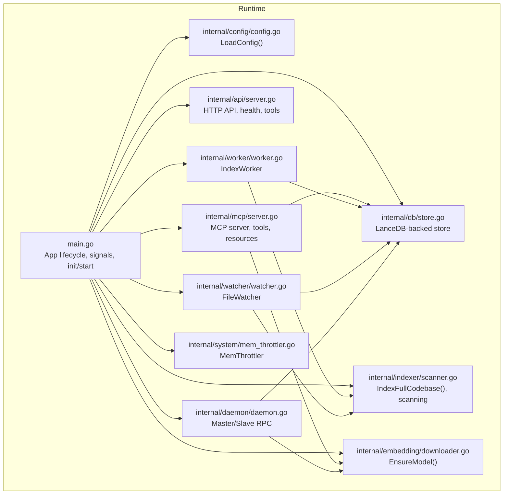
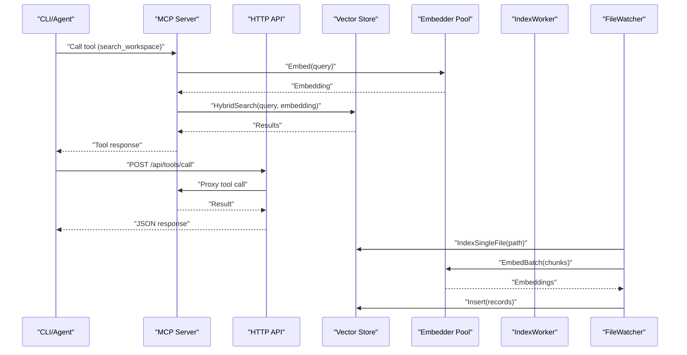
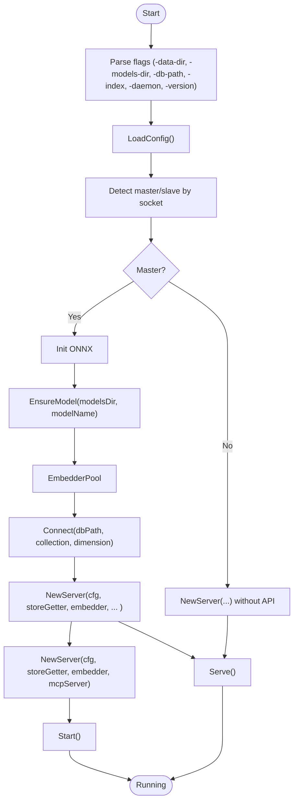
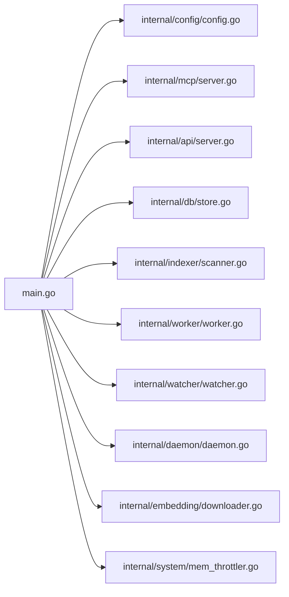

# Operational Procedures and Maintenance

<cite>
**Referenced Files in This Document**
- [README.md](file://README.md)
- [main.go](file://main.go)
- [internal/config/config.go](file://internal/config/config.go)
- [internal/db/store.go](file://internal/db/store.go)
- [internal/indexer/scanner.go](file://internal/indexer/scanner.go)
- [internal/mcp/server.go](file://internal/mcp/server.go)
- [internal/daemon/daemon.go](file://internal/daemon/daemon.go)
- [internal/worker/worker.go](file://internal/worker/worker.go)
- [internal/watcher/watcher.go](file://internal/watcher/watcher.go)
- [internal/api/server.go](file://internal/api/server.go)
- [internal/embedding/downloader.go](file://internal/embedding/downloader.go)
- [internal/system/mem_throttler.go](file://internal/system/mem_throttler.go)
- [scripts/setup-services.sh](file://scripts/setup-services.sh)
- [scripts/vector-mcp.service](file://scripts/vector-mcp.service)
- [Makefile](file://Makefile)
</cite>

## Table of Contents
1. [Introduction](#introduction)
2. [Project Structure](#project-structure)
3. [Core Components](#core-components)
4. [Architecture Overview](#architecture-overview)
5. [Detailed Component Analysis](#detailed-component-analysis)
6. [Dependency Analysis](#dependency-analysis)
7. [Performance Considerations](#performance-considerations)
8. [Troubleshooting Guide](#troubleshooting-guide)
9. [Conclusion](#conclusion)
10. [Appendices](#appendices)

## Introduction
This document provides comprehensive operational procedures and maintenance guidance for Vector MCP Go. It covers routine maintenance tasks (index optimization, database cleanup, model updates), capacity planning and performance monitoring, scaling strategies, backup and recovery procedures, disaster recovery and replication, update and upgrade processes, security and compliance, incident response, performance tuning, and operational checklists.

## Project Structure
Vector MCP Go is a modular Go application that exposes an MCP server with integrated vector search, file watching, indexing, and optional HTTP API. Key operational areas include:
- Application lifecycle and daemonization
- Configuration management and environment overrides
- Vector database storage and hybrid search
- Indexing pipeline with background workers and file watchers
- Embedding model provisioning and pooling
- System memory throttling for stability
- Optional HTTP API for tool orchestration and diagnostics

**Diagram sources**
- [main.go:280-317](file://main.go#L280-L317)
- [internal/config/config.go:30-129](file://internal/config/config.go#L30-L129)
- [internal/mcp/server.go:90-128](file://internal/mcp/server.go#L90-L128)
- [internal/api/server.go:35-109](file://internal/api/server.go#L35-L109)
- [internal/db/store.go:35-64](file://internal/db/store.go#L35-L64)
- [internal/indexer/scanner.go:68-191](file://internal/indexer/scanner.go#L68-L191)
- [internal/worker/worker.go:34-61](file://internal/worker/worker.go#L34-L61)
- [internal/watcher/watcher.go:38-86](file://internal/watcher/watcher.go#L38-L86)
- [internal/daemon/daemon.go:333-378](file://internal/daemon/daemon.go#L333-L378)
- [internal/embedding/downloader.go:98-124](file://internal/embedding/downloader.go#L98-L124)
- [internal/system/mem_throttler.go:30-44](file://internal/system/mem_throttler.go#L30-L44)

**Section sources**
- [README.md:1-40](file://README.md#L1-L40)
- [main.go:280-317](file://main.go#L280-L317)
- [internal/config/config.go:30-129](file://internal/config/config.go#L30-L129)

## Core Components
- Application lifecycle and graceful shutdown
- Configuration loading and environment overrides
- MCP server with tools and resources
- HTTP API for health, tool management, and streaming transport
- Vector database store with hybrid search and lexical ranking
- Indexing pipeline with background workers and file watchers
- Embedding model provisioning and pooling
- System memory throttling
- Master/Slave daemon with RPC for distributed operation

**Section sources**
- [main.go:37-71](file://main.go#L37-L71)
- [internal/config/config.go:30-129](file://internal/config/config.go#L30-L129)
- [internal/mcp/server.go:67-86](file://internal/mcp/server.go#L67-L86)
- [internal/api/server.go:24-31](file://internal/api/server.go#L24-L31)
- [internal/db/store.go:19-25](file://internal/db/store.go#L19-L25)
- [internal/indexer/scanner.go:67-66](file://internal/indexer/scanner.go#L67-L66)
- [internal/daemon/daemon.go:17-23](file://internal/daemon/daemon.go#L17-L23)
- [internal/system/mem_throttler.go:21-28](file://internal/system/mem_throttler.go#L21-L28)

## Architecture Overview
Vector MCP Go operates as a single-process MCP server with optional HTTP API and a vector database backend. It supports a master/slave mode via Unix-domain RPC for distributed embedding and storage operations. Background workers and file watchers keep the index fresh and responsive.

**Diagram sources**
- [internal/mcp/server.go:342-418](file://internal/mcp/server.go#L342-L418)
- [internal/api/server.go:74-86](file://internal/api/server.go#L74-L86)
- [internal/db/store.go:223-336](file://internal/db/store.go#L223-L336)
- [internal/indexer/scanner.go:337-355](file://internal/indexer/scanner.go#L337-L355)
- [internal/worker/worker.go:63-111](file://internal/worker/worker.go#L63-L111)
- [internal/watcher/watcher.go:141-196](file://internal/watcher/watcher.go#L141-L196)

## Detailed Component Analysis

### Application Lifecycle and Daemonization
- Initializes configuration, detects master/slave mode, sets up embedding pool, store, MCP server, and optional API server.
- Starts background worker and file watcher in master mode.
- Supports daemon mode for long-running background indexing without MCP stdio server.
- Graceful shutdown via OS signals.

**Diagram sources**
- [main.go:280-317](file://main.go#L280-L317)
- [internal/config/config.go:30-129](file://internal/config/config.go#L30-L129)
- [internal/embedding/downloader.go:98-124](file://internal/embedding/downloader.go#L98-L124)
- [internal/db/store.go:35-64](file://internal/db/store.go#L35-L64)
- [internal/mcp/server.go:90-128](file://internal/mcp/server.go#L90-L128)
- [internal/api/server.go:35-109](file://internal/api/server.go#L35-L109)

**Section sources**
- [main.go:93-176](file://main.go#L93-L176)
- [main.go:204-265](file://main.go#L204-L265)
- [internal/config/config.go:30-129](file://internal/config/config.go#L30-L129)

### Configuration Management
- Loads environment variables and defaults for data directories, database path, models directory, logs, project root, model names, reranker, pool size, API port, and toggles for watcher and live indexing.
- Ensures directories exist and sets up structured JSON logging.

Operational checklist:
- Verify DATA_DIR, DB_PATH, MODELS_DIR, LOG_PATH, PROJECT_ROOT, MODEL_NAME, RERANKER_MODEL_NAME, EMBEDDER_POOL_SIZE, API_PORT, DISABLE_FILE_WATCHER, ENABLE_LIVE_INDEXING.
- Confirm permissions for directories and log file location.

**Section sources**
- [internal/config/config.go:30-129](file://internal/config/config.go#L30-L129)

### Vector Database Store and Hybrid Search
- Persistent LanceDB-backed store with collection management and dimension probing.
- Supports vector search, lexical search, hybrid search with reciprocal rank fusion, and metadata-based filters.
- Provides batch insert, prefix deletion, and status tracking.

Operational checklist:
- Monitor record counts and collection sizes.
- Validate dimension consistency when switching models.
- Use prefix deletion for directory renames and deletions.
- Track indexing status via project status records.

**Section sources**
- [internal/db/store.go:35-64](file://internal/db/store.go#L35-L64)
- [internal/db/store.go:80-408](file://internal/db/store.go#L80-L408)
- [internal/db/store.go:411-444](file://internal/db/store.go#L411-L444)
- [internal/db/store.go:586-610](file://internal/db/store.go#L586-L610)

### Indexing Pipeline
- Full codebase indexing with hash-based change detection, atomic updates, and batch inserts.
- Single-file indexing for proactive updates on watched files.
- Scanning respects ignore rules (.vector-ignore or .gitignore), extensions, and directories.

Operational checklist:
- Schedule periodic full indexing for large projects.
- Monitor progress via status records and progress map.
- Investigate errors in indexing summary and logs.
- Ensure ignore files are maintained to reduce noise.

**Section sources**
- [internal/indexer/scanner.go:67-191](file://internal/indexer/scanner.go#L67-L191)
- [internal/indexer/scanner.go:337-355](file://internal/indexer/scanner.go#L337-L355)
- [internal/indexer/scanner.go:361-423](file://internal/indexer/scanner.go#L361-L423)

### Background Workers and File Watchers
- IndexWorker drains the index queue and performs background indexing with panic protection and status updates.
- FileWatcher debounces events, triggers single-file re-indexing, enforces architectural guardrails, and proactively re-distills dependent packages.

Operational checklist:
- Monitor worker progress map and store status.
- Adjust debounce timing and ignored directories as needed.
- Review architectural alerts and remediate violations.

**Section sources**
- [internal/worker/worker.go:34-111](file://internal/worker/worker.go#L34-L111)
- [internal/watcher/watcher.go:58-196](file://internal/watcher/watcher.go#L58-L196)

### Master/Slave Daemon and RPC
- Master server exposes RPC methods for embedding, search, insert, delete, and status.
- Slave client delegates operations to master via Unix-domain RPC.
- Supports dynamic updates to embedder and store.

Operational checklist:
- Ensure Unix socket path availability and permissions.
- Monitor RPC timeouts and queue capacity.
- Keep master and slave models aligned.

**Section sources**
- [internal/daemon/daemon.go:326-399](file://internal/daemon/daemon.go#L326-L399)
- [internal/daemon/daemon.go:401-474](file://internal/daemon/daemon.go#L401-L474)
- [internal/daemon/daemon.go:502-608](file://internal/daemon/daemon.go#L502-L608)

### Embedding Models and Pooling
- Model presets and downloader ensure ONNX model and tokenizer presence.
- Embedder pool manages concurrency and resource sharing.

Operational checklist:
- Periodically validate model availability and checksums.
- Adjust pool size based on workload and memory headroom.
- Rotate models carefully and clean/reindex database when changing dimensions.

**Section sources**
- [internal/embedding/downloader.go:19-86](file://internal/embedding/downloader.go#L19-L86)
- [internal/embedding/downloader.go:98-124](file://internal/embedding/downloader.go#L98-L124)
- [main.go:133-138](file://main.go#L133-L138)

### System Memory Throttling
- Monitors system memory and advises when to throttle or pause heavy tasks.
- Helps prevent out-of-memory conditions during embedding and indexing.

Operational checklist:
- Tune thresholds based on hardware and workload.
- Observe LSP startup decisions and adjust accordingly.

**Section sources**
- [internal/system/mem_throttler.go:21-151](file://internal/system/mem_throttler.go#L21-L151)

### HTTP API and Tool Orchestration
- Exposes health endpoint, streaming MCP transport, and tool management endpoints.
- Enables CORS and session headers for browser-based clients.

Operational checklist:
- Monitor API health and latency.
- Validate CORS headers and session handling.
- Use tool endpoints for automation and diagnostics.

**Section sources**
- [internal/api/server.go:35-109](file://internal/api/server.go#L35-L109)
- [internal/api/server.go:111-139](file://internal/api/server.go#L111-L139)

## Dependency Analysis

**Diagram sources**
- [main.go:37-71](file://main.go#L37-L71)
- [internal/mcp/server.go:67-86](file://internal/mcp/server.go#L67-L86)
- [internal/api/server.go:24-31](file://internal/api/server.go#L24-L31)
- [internal/db/store.go:19-25](file://internal/db/store.go#L19-L25)
- [internal/indexer/scanner.go:58-66](file://internal/indexer/scanner.go#L58-L66)
- [internal/worker/worker.go:24-32](file://internal/worker/worker.go#L24-L32)
- [internal/watcher/watcher.go:22-36](file://internal/watcher/watcher.go#L22-L36)
- [internal/daemon/daemon.go:17-23](file://internal/daemon/daemon.go#L17-L23)
- [internal/embedding/downloader.go:11-17](file://internal/embedding/downloader.go#L11-L17)
- [internal/system/mem_throttler.go:21-28](file://internal/system/mem_throttler.go#L21-L28)

**Section sources**
- [main.go:37-71](file://main.go#L37-L71)
- [internal/mcp/server.go:67-86](file://internal/mcp/server.go#L67-L86)

## Performance Considerations
- Embedding batching and pooling: Increase pool size cautiously and monitor memory usage.
- Hybrid search tuning: Adjust lexical/vector weights and topK based on query characteristics.
- Indexing throughput: Batch inserts, parallel scanning, and hash-based change detection reduce redundant work.
- Memory throttling: Use MemThrottler to avoid OOM during heavy operations.
- File watcher debounce: Tune delay to balance responsiveness and CPU usage.

[No sources needed since this section provides general guidance]

## Troubleshooting Guide
Common issues and remedies:
- Dimension mismatch when switching models: Delete the vector database and restart to rebuild with the new model.
- Indexing failures: Inspect errors in indexing summary and logs; retry or fix offending files.
- RPC timeouts: Verify socket path, master availability, and queue capacity.
- Out-of-memory during embedding: Reduce pool size or throttle operations using MemThrottler.
- File watcher not triggering: Confirm debounce timing, ignored directories, and file extensions.

**Section sources**
- [internal/db/store.go:51-61](file://internal/db/store.go#L51-L61)
- [internal/indexer/scanner.go:153-184](file://internal/indexer/scanner.go#L153-L184)
- [internal/daemon/daemon.go:463-474](file://internal/daemon/daemon.go#L463-L474)
- [internal/system/mem_throttler.go:87-103](file://internal/system/mem_throttler.go#L87-L103)
- [internal/watcher/watcher.go:121-139](file://internal/watcher/watcher.go#L121-L139)

## Conclusion
Vector MCP Go provides a robust, deterministic MCP server with integrated vector search, indexing, and operational tooling. By following the procedures and checklists herein—covering maintenance, monitoring, scaling, backups, upgrades, security, and incident response—you can operate the system reliably and efficiently.

[No sources needed since this section summarizes without analyzing specific files]

## Appendices

### Routine Maintenance Tasks
- Index optimization
  - Run full indexing periodically for large projects.
  - Use prefix deletion for directory renames and deletions.
  - Monitor progress and resolve errors promptly.
- Database cleanup
  - Remove stale records via prefix deletion.
  - Clear project data when needed.
  - Validate dimension consistency when changing models.
- Model updates
  - Ensure model and tokenizer files exist.
  - Align master and slave models.
  - Re-index after model changes.

**Section sources**
- [internal/indexer/scanner.go:104-113](file://internal/indexer/scanner.go#L104-L113)
- [internal/db/store.go:411-444](file://internal/db/store.go#L411-L444)
- [internal/db/store.go:586-610](file://internal/db/store.go#L586-L610)
- [internal/embedding/downloader.go:98-124](file://internal/embedding/downloader.go#L98-L124)

### Capacity Planning and Scaling
- Horizontal scaling: Use master/slave mode with RPC delegation.
- Vertical scaling: Increase embedder pool size and memory headroom.
- Monitoring: Track record counts, indexing progress, and memory usage.

**Section sources**
- [internal/daemon/daemon.go:326-399](file://internal/daemon/daemon.go#L326-L399)
- [internal/system/mem_throttler.go:30-44](file://internal/system/mem_throttler.go#L30-L44)

### Performance Monitoring and Tuning
- Use MCP resources and API endpoints for diagnostics.
- Tune hybrid search weights and topK.
- Adjust embedding pool size and file watcher debounce.

**Section sources**
- [internal/mcp/server.go:202-237](file://internal/mcp/server.go#L202-L237)
- [internal/api/server.go:111-139](file://internal/api/server.go#L111-L139)
- [internal/db/store.go:223-336](file://internal/db/store.go#L223-L336)
- [internal/watcher/watcher.go:121-139](file://internal/watcher/watcher.go#L121-L139)

### Backup and Recovery
- Back up vector database directory and models directory.
- Back up configuration files and environment variables.
- Recovery: Restore directories, restart master, and re-index as needed.

**Section sources**
- [internal/config/config.go:67-69](file://internal/config/config.go#L67-L69)
- [internal/db/store.go:35-64](file://internal/db/store.go#L35-L64)

### Disaster Recovery and Replication
- Master/Slave RPC enables distributed operation; ensure socket path accessibility.
- Replication: Use master’s store and embedder; maintain consistent models.

**Section sources**
- [internal/daemon/daemon.go:333-378](file://internal/daemon/daemon.go#L333-L378)
- [internal/daemon/daemon.go:502-608](file://internal/daemon/daemon.go#L502-L608)

### Update and Upgrade Procedures
- Zero-downtime deployment (recommended): Deploy new binary, restart daemon, and re-index if model changed.
- Rollback: Restore previous binary and configuration, restart.
- Model rotation: Ensure new model files, re-index database, and validate dimension consistency.

**Section sources**
- [scripts/setup-services.sh:12-25](file://scripts/setup-services.sh#L12-L25)
- [scripts/vector-mcp.service:10-13](file://scripts/vector-mcp.service#L10-L13)
- [Makefile:17-18](file://Makefile#L17-L18)
- [internal/db/store.go:51-61](file://internal/db/store.go#L51-L61)

### Security Maintenance and Compliance
- Restrict file watcher scope via ignore files.
- Validate paths and enforce guardrails in mutation operations.
- Monitor logs and notifications for anomalies.

**Section sources**
- [internal/watcher/watcher.go:361-423](file://internal/watcher/watcher.go#L361-L423)
- [internal/mcp/server.go:109-122](file://internal/mcp/server.go#L109-L122)

### Incident Response
- Identify symptoms: slow responses, indexing failures, RPC timeouts, OOM.
- Containment: Reduce pool size, pause indexing, throttle operations.
- Resolution: Fix model or database issues, restore services, re-index.
- Escalation: Review logs, notifications, and progress status.

**Section sources**
- [internal/worker/worker.go:63-111](file://internal/worker/worker.go#L63-L111)
- [internal/daemon/daemon.go:463-474](file://internal/daemon/daemon.go#L463-L474)
- [internal/system/mem_throttler.go:87-103](file://internal/system/mem_throttler.go#L87-L103)

### Operational Checklists and Excellence Practices
- Daily
  - Check API health endpoint.
  - Review indexing status and progress.
  - Validate memory usage and throttling decisions.
- Weekly
  - Full re-index for large projects.
  - Audit ignore files and exclusions.
  - Review architectural alerts and remediations.
- Monthly
  - Validate model integrity and re-index if needed.
  - Archive logs and review trends.

**Section sources**
- [internal/api/server.go:132-138](file://internal/api/server.go#L132-L138)
- [internal/mcp/server.go:202-237](file://internal/mcp/server.go#L202-L237)
- [internal/system/mem_throttler.go:69-71](file://internal/system/mem_throttler.go#L69-L71)