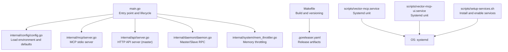
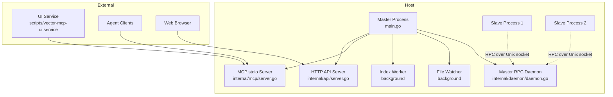
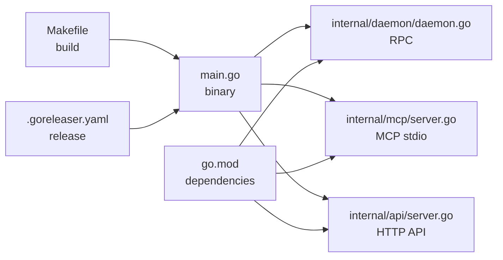

# Production Deployment

<cite>
**Referenced Files in This Document**
- [main.go](file://main.go)
- [go.mod](file://go.mod)
- [Makefile](file://Makefile)
- [.goreleaser.yaml](file://.goreleaser.yaml)
- [internal/config/config.go](file://internal/config/config.go)
- [internal/api/server.go](file://internal/api/server.go)
- [internal/mcp/server.go](file://internal/mcp/server.go)
- [internal/daemon/daemon.go](file://internal/daemon/daemon.go)
- [scripts/vector-mcp.service](file://scripts/vector-mcp.service)
- [scripts/vector-mcp-ui.service](file://scripts/vector-mcp-ui.service)
- [scripts/setup-services.sh](file://scripts/setup-services.sh)
- [mcp-config.json.example](file://mcp-config.json.example)
- [.gitignore](file://.gitignore)
- [internal/system/mem_throttler.go](file://internal/system/mem_throttler.go)
</cite>

## Table of Contents
1. [Introduction](#introduction)
2. [Project Structure](#project-structure)
3. [Core Components](#core-components)
4. [Architecture Overview](#architecture-overview)
5. [Detailed Component Analysis](#detailed-component-analysis)
6. [Dependency Analysis](#dependency-analysis)
7. [Performance Considerations](#performance-considerations)
8. [Troubleshooting Guide](#troubleshooting-guide)
9. [Conclusion](#conclusion)
10. [Appendices](#appendices)

## Introduction
This document provides comprehensive production deployment guidance for Vector MCP Go. It covers containerization strategies (Docker), systemd service configuration, infrastructure and resource requirements, deployment topologies, environment variable management, configuration and secrets handling, security considerations, and step-by-step deployment procedures tailored to Linux hosts and cloud environments.

## Project Structure
Vector MCP Go is a single-process Go application that supports:
- A Model Context Protocol (MCP) server over stdio for agent integrations
- An optional HTTP API server for web clients and tooling
- A master/slave daemon architecture using Unix domain sockets for distributed embedding and storage operations
- Background indexing, file watching, and LSP integration

Key runtime entry points and responsibilities:
- Application bootstrap and lifecycle: [main.go](file://main.go)
- Configuration loading and environment variables: [internal/config/config.go](file://internal/config/config.go)
- HTTP API server (optional): [internal/api/server.go](file://internal/api/server.go)
- MCP server (stdio) and tool registry: [internal/mcp/server.go](file://internal/mcp/server.go)
- Master/Slave RPC daemon: [internal/daemon/daemon.go](file://internal/daemon/daemon.go)
- System memory throttling: [internal/system/mem_throttler.go](file://internal/system/mem_throttler.go)
- Build and release automation: [Makefile](file://Makefile), [.goreleaser.yaml](file://.goreleaser.yaml)
- Systemd service units and setup script: [scripts/vector-mcp.service](file://scripts/vector-mcp.service), [scripts/vector-mcp-ui.service](file://scripts/vector-mcp-ui.service), [scripts/setup-services.sh](file://scripts/setup-services.sh)
- Example MCP client configuration: [mcp-config.json.example](file://mcp-config.json.example)

**Diagram sources**
- [main.go:280-317](file://main.go#L280-L317)
- [internal/config/config.go:30-130](file://internal/config/config.go#L30-L130)
- [internal/mcp/server.go:86-117](file://internal/mcp/server.go#L86-L117)
- [internal/api/server.go:33-109](file://internal/api/server.go#L33-L109)
- [internal/daemon/daemon.go:333-378](file://internal/daemon/daemon.go#L333-L378)
- [internal/system/mem_throttler.go:30-110](file://internal/system/mem_throttler.go#L30-L110)
- [Makefile:17-18](file://Makefile#L17-L18)
- [.goreleaser.yaml:10-30](file://.goreleaser.yaml#L10-L30)
- [scripts/vector-mcp.service:1-17](file://scripts/vector-mcp.service#L1-L17)
- [scripts/vector-mcp-ui.service:1-17](file://scripts/vector-mcp-ui.service#L1-L17)
- [scripts/setup-services.sh:1-31](file://scripts/setup-services.sh#L1-L31)

**Section sources**
- [main.go:280-317](file://main.go#L280-L317)
- [internal/config/config.go:30-130](file://internal/config/config.go#L30-L130)
- [internal/api/server.go:33-109](file://internal/api/server.go#L33-L109)
- [internal/mcp/server.go:86-117](file://internal/mcp/server.go#L86-L117)
- [internal/daemon/daemon.go:333-378](file://internal/daemon/daemon.go#L333-L378)
- [internal/system/mem_throttler.go:30-110](file://internal/system/mem_throttler.go#L30-L110)
- [Makefile:17-18](file://Makefile#L17-L18)
- [.goreleaser.yaml:10-30](file://.goreleaser.yaml#L10-L30)
- [scripts/vector-mcp.service:1-17](file://scripts/vector-mcp.service#L1-L17)
- [scripts/vector-mcp-ui.service:1-17](file://scripts/vector-mcp-ui.service#L1-L17)
- [scripts/setup-services.sh:1-31](file://scripts/setup-services.sh#L1-L31)

## Core Components
- Application lifecycle and flags: [main.go:280-317](file://main.go#L280-L317)
- Configuration and environment variables: [internal/config/config.go:30-130](file://internal/config/config.go#L30-L130)
- HTTP API server (master only): [internal/api/server.go:33-109](file://internal/api/server.go#L33-L109)
- MCP stdio server and tool registry: [internal/mcp/server.go:86-117](file://internal/mcp/server.go#L86-L117)
- Master/Slave RPC daemon: [internal/daemon/daemon.go:333-378](file://internal/daemon/daemon.go#L333-L378)
- Memory throttling: [internal/system/mem_throttler.go:30-110](file://internal/system/mem_throttler.go#L30-L110)

Key operational modes:
- MCP stdio server (agent integration)
- HTTP API server (web UI and tooling)
- Master/Slave daemon with Unix socket RPC
- Background indexing and file watching (master)

**Section sources**
- [main.go:280-317](file://main.go#L280-L317)
- [internal/config/config.go:30-130](file://internal/config/config.go#L30-L130)
- [internal/api/server.go:33-109](file://internal/api/server.go#L33-L109)
- [internal/mcp/server.go:86-117](file://internal/mcp/server.go#L86-L117)
- [internal/daemon/daemon.go:333-378](file://internal/daemon/daemon.go#L333-L378)
- [internal/system/mem_throttler.go:30-110](file://internal/system/mem_throttler.go#L30-L110)

## Architecture Overview
Vector MCP Go supports a master/slave architecture:
- Master process runs the HTTP API server, indexing workers, file watcher, and the MCP stdio server
- Slave processes connect to the master via Unix domain socket RPC for embeddings and storage operations
- Optional UI service runs independently and connects to the MCP backend

**Diagram sources**
- [main.go:93-176](file://main.go#L93-L176)
- [internal/api/server.go:33-109](file://internal/api/server.go#L33-L109)
- [internal/mcp/server.go:184-188](file://internal/mcp/server.go#L184-L188)
- [internal/daemon/daemon.go:333-378](file://internal/daemon/daemon.go#L333-L378)
- [scripts/vector-mcp-ui.service:1-17](file://scripts/vector-mcp-ui.service#L1-L17)

**Section sources**
- [main.go:93-176](file://main.go#L93-L176)
- [internal/api/server.go:33-109](file://internal/api/server.go#L33-L109)
- [internal/mcp/server.go:184-188](file://internal/mcp/server.go#L184-L188)
- [internal/daemon/daemon.go:333-378](file://internal/daemon/daemon.go#L333-L378)
- [scripts/vector-mcp-ui.service:1-17](file://scripts/vector-mcp-ui.service#L1-L17)

## Detailed Component Analysis

### Containerization Strategy (Docker)
Recommended approach:
- Multi-stage build to minimize attack surface and artifact size
- Base image: modern minimal Linux distribution (e.g., Debian slim or Ubuntu)
- Build stage: compile the Go binary with release flags and static linking considerations
- Runtime stage: copy only the binary and required runtime libraries; avoid dev packages
- Entrypoint: run the binary in daemon mode for production
- Volumes: mount persistent directories for data, models, and logs
- Security: run as non-root user, drop unnecessary capabilities, enable read-only root filesystem

Example Dockerfile outline (descriptive steps):
- Stage 1: Build with CGO enabled for ONNX runtime as needed
- Stage 2: Copy the statically linked binary to a minimal runtime image
- Add a dedicated non-root user and group
- Expose ports for HTTP API if enabled
- Mount volumes for DATA_DIR, MODELS_DIR, DB_PATH, LOG_PATH
- Entrypoint executes the binary with -daemon flag

Image optimization tips:
- Use .dockerignore to exclude build artifacts and development files
- Keep layers minimal; combine RUN commands
- Pin base image digest for reproducibility

Note: The repository does not include a Dockerfile. The above describes a recommended production-grade Docker strategy aligned with the project’s runtime needs.

### systemd Service Configuration
Two systemd units are provided:
- Backend service: [scripts/vector-mcp.service:1-17](file://scripts/vector-mcp.service#L1-L17)
- UI service: [scripts/vector-mcp-ui.service:1-17](file://scripts/vector-mcp-ui.service#L1-L17)
- Setup script: [scripts/setup-services.sh:1-31](file://scripts/setup-services.sh#L1-L31)

Key directives and considerations:
- Type: simple
- User/Group: dedicated unprivileged user
- WorkingDirectory: project root
- EnvironmentFile: path to .env file
- ExecStart: run the binary with -daemon flag
- Restart: always with RestartSec delay
- After: network.target and ordering dependencies for UI

Setup steps:
- Copy unit files to /etc/systemd/system
- systemctl daemon-reload
- systemctl enable vector-mcp vector-mcp-ui
- systemctl start vector-mcp vector-mcp-ui

Verification:
- systemctl status vector-mcp
- journalctl -u vector-mcp -f

**Section sources**
- [scripts/vector-mcp.service:1-17](file://scripts/vector-mcp.service#L1-L17)
- [scripts/vector-mcp-ui.service:1-17](file://scripts/vector-mcp-ui.service#L1-L17)
- [scripts/setup-services.sh:1-31](file://scripts/setup-services.sh#L1-L31)

### Infrastructure Requirements and Resource Allocation
Observed runtime characteristics and requirements:
- Embedding engine initialization and pooling: [main.go:112-137](file://main.go#L112-L137)
- Memory throttling for LSP and heavy operations: [internal/system/mem_throttler.go:30-110](file://internal/system/mem_throttler.go#L30-L110)
- File watcher and live indexing: [main.go:219-234](file://main.go#L219-L234)
- MCP and HTTP servers: [internal/mcp/server.go:184-188](file://internal/mcp/server.go#L184-L188), [internal/api/server.go:112-121](file://internal/api/server.go#L112-L121)

Recommended baseline:
- CPU: Quad-core minimum; dual-core sufficient for light workloads
- Memory: 8 GB RAM minimum; 16 GB recommended for larger projects and concurrent operations
- Storage: SSD NVMe preferred; allocate 2–4x the expected index size for models and logs
- Network: Low-latency inter-process communication (Unix sockets) and optional HTTP API port exposure

Notes:
- The application includes a memory throttler to prevent out-of-memory conditions during embedding and LSP operations.
- Live indexing and file watching can be CPU and I/O intensive; disable watchers in constrained environments.

**Section sources**
- [main.go:112-137](file://main.go#L112-L137)
- [internal/system/mem_throttler.go:30-110](file://internal/system/mem_throttler.go#L30-L110)
- [internal/api/server.go:112-121](file://internal/api/server.go#L112-L121)
- [internal/mcp/server.go:184-188](file://internal/mcp/server.go#L184-L188)

### Deployment Topologies and High Availability
Topology options:
- Single-master: simplest deployment; suitable for small teams or development
- Multi-master with external coordination: not implemented in code; consider external consensus or leader election outside this process
- Multiple slaves per master: supported by the RPC daemon; useful for distributing compute across nodes

High availability considerations:
- Use systemd restart policies for resilience
- Monitor health endpoint for readiness
- Distribute load across multiple slave instances behind a reverse proxy if exposing HTTP API externally
- Persist data directories on shared storage if running multiple masters (not implemented here)

**Section sources**
- [internal/daemon/daemon.go:333-378](file://internal/daemon/daemon.go#L333-L378)
- [internal/api/server.go:132-138](file://internal/api/server.go#L132-L138)

### Environment Variables and Configuration Management
Primary configuration is loaded from environment variables and .env file:
- Data directories and paths: DATA_DIR, DB_PATH, MODELS_DIR, LOG_PATH
- Project root: PROJECT_ROOT
- Model selection: MODEL_NAME, RERANKER_MODEL_NAME
- Feature toggles: ENABLE_LIVE_INDEXING, DISABLE_FILE_WATCHER
- Embedder pool sizing: EMBEDDER_POOL_SIZE
- API port: API_PORT
- Hugging Face token: HF_TOKEN
- Logging: structured JSON to file/stderr

Configuration precedence:
- Command-line overrides for data-dir, models-dir, db-path
- Environment variables
- Defaults in code

Secrets management:
- Store tokens and sensitive keys in environment files or secret stores
- Restrict file permissions on .env and logs
- Avoid committing secrets to version control

**Section sources**
- [internal/config/config.go:30-130](file://internal/config/config.go#L30-L130)
- [.gitignore:6-9](file://.gitignore#L6-L9)

### Security Considerations
Network and access controls:
- Unix domain sockets for master-slave RPC: secure by default; ensure restrictive file permissions on the socket path
- HTTP API server: CORS headers are set; restrict origins in production deployments
- MCP stdio server: intended for trusted agent connections

Firewall and host hardening:
- Allow inbound only on required ports (HTTP API if exposed)
- Disable unnecessary services and ports
- Run as non-root user with minimal privileges

Operational hygiene:
- Regularly rotate secrets and update models
- Monitor logs and alert on errors
- Use SELinux/AppArmor if available

**Section sources**
- [internal/daemon/daemon.go:333-378](file://internal/daemon/daemon.go#L333-L378)
- [internal/api/server.go:46-101](file://internal/api/server.go#L46-L101)
- [internal/mcp/server.go:184-188](file://internal/mcp/server.go#L184-L188)

### Step-by-Step Deployment Guides

#### Option A: Bare Metal or VM (systemd)
- Prepare host: install Go toolchain, Node.js (for UI), and system dependencies
- Clone repository and build:
  - Use Makefile targets for build and versioning
  - Release artifacts are produced by GoReleaser configuration
- Create .env files for backend and UI
- Install systemd units and enable services:
  - Copy unit files to /etc/systemd/system
  - Run setup script or manually enable and start services
- Verify:
  - systemctl status vector-mcp, vector-mcp-ui
  - Check logs and health endpoints

**Section sources**
- [Makefile:17-18](file://Makefile#L17-L18)
- [.goreleaser.yaml:10-30](file://.goreleaser.yaml#L10-L30)
- [scripts/setup-services.sh:1-31](file://scripts/setup-services.sh#L1-L31)
- [scripts/vector-mcp.service:1-17](file://scripts/vector-mcp.service#L1-L17)
- [scripts/vector-mcp-ui.service:1-17](file://scripts/vector-mcp-ui.service#L1-L17)

#### Option B: Docker (Single Node)
- Create Dockerfile following multi-stage build guidance
- Build image with secure defaults
- Run container with:
  - Volumes mapped for DATA_DIR, MODELS_DIR, DB_PATH, LOG_PATH
  - Environment variables via .env or docker-compose
  - Non-root user and restricted capabilities
- Expose HTTP API port if needed; otherwise rely on stdio for agents

#### Option C: Kubernetes (Descriptive)
- Deploy a StatefulSet for the backend with persistent volumes
- Optionally deploy a Deployment for the UI
- Use ConfigMaps for environment variables and Secrets for tokens
- Expose HTTP API via Service/Ingress if required
- Use probes for readiness and liveness

#### Option D: Cloud Providers (Descriptive)
- AWS: EC2 instance with systemd or ECS/Fargate; EBS volumes for persistence
- GCP: Compute Engine or GKE; Persistent Disk or Filestore
- Azure: VMSS with systemd or AKS; Managed Disks or Files

## Dependency Analysis
Build and release pipeline:
- Makefile compiles the binary with version metadata
- GoReleaser configures cross-platform builds with CGO and Zig CC for Linux targets

Runtime dependencies:
- ONNX runtime is used for embeddings; ensure library availability
- MCP protocol libraries for stdio transport
- File watching and tree-sitter for parsing

**Diagram sources**
- [Makefile:17-18](file://Makefile#L17-L18)
- [.goreleaser.yaml:10-30](file://.goreleaser.yaml#L10-L30)
- [main.go:280-317](file://main.go#L280-L317)
- [internal/daemon/daemon.go:333-378](file://internal/daemon/daemon.go#L333-L378)
- [internal/mcp/server.go:86-117](file://internal/mcp/server.go#L86-L117)
- [internal/api/server.go:33-109](file://internal/api/server.go#L33-L109)
- [go.mod:5-16](file://go.mod#L5-L16)

**Section sources**
- [Makefile:17-18](file://Makefile#L17-L18)
- [.goreleaser.yaml:10-30](file://.goreleaser.yaml#L10-L30)
- [go.mod:5-16](file://go.mod#L5-L16)
- [main.go:280-317](file://main.go#L280-L317)

## Performance Considerations
- Embedder pool sizing: tune EMBEDDER_POOL_SIZE for throughput vs. memory trade-offs
- Memory throttling: the throttler prevents OOM during heavy operations; adjust thresholds if needed
- Live indexing and watchers: enable only when beneficial; disable in constrained environments
- HTTP API concurrency: scale horizontally with multiple slave instances behind a reverse proxy
- Model caching: ensure MODELS_DIR is on fast storage; pre-warm models at startup

[No sources needed since this section provides general guidance]

## Troubleshooting Guide
Common issues and remedies:
- Master already running: indicates another master instance; check Unix socket path and PID
- Embedding timeouts: increase timeouts or reduce batch sizes; verify ONNX runtime availability
- HTTP API not reachable: verify API_PORT and firewall rules; check CORS configuration
- File watcher failures: disable watcher or fix permissions; ensure project root accessibility
- Out-of-memory: reduce pool size, enable throttling, or provision more RAM

Operational checks:
- Health endpoint: GET /api/health
- systemd status and logs
- MCP notifications and progress resources

**Section sources**
- [internal/daemon/daemon.go:348-356](file://internal/daemon/daemon.go#L348-L356)
- [internal/api/server.go:132-138](file://internal/api/server.go#L132-L138)
- [internal/system/mem_throttler.go:87-103](file://internal/system/mem_throttler.go#L87-L103)

## Conclusion
Vector MCP Go is designed for production use with a robust master/slave architecture, optional HTTP API, and systemd-friendly operation. By following the containerization and deployment strategies outlined here—combined with proper environment management, security hardening, and resource planning—you can reliably operate Vector MCP Go across diverse infrastructures and cloud providers.

[No sources needed since this section summarizes without analyzing specific files]

## Appendices

### Environment Variables Reference
- DATA_DIR: Base directory for DB and models
- DB_PATH: Specific path for the database
- MODELS_DIR: Directory for models
- LOG_PATH: Path for server log file
- PROJECT_ROOT: Active project root
- MODEL_NAME: Embedding model identifier
- RERANKER_MODEL_NAME: Optional reranker model identifier
- HF_TOKEN: Hugging Face access token
- ENABLE_LIVE_INDEXING: Enable initial live indexing
- DISABLE_FILE_WATCHER: Disable file watcher
- EMBEDDER_POOL_SIZE: Number of concurrent embedders
- API_PORT: HTTP API port (default applied if unset)

**Section sources**
- [internal/config/config.go:30-130](file://internal/config/config.go#L30-L130)

### MCP Client Configuration Example
- Example configuration for integrating an MCP client with the backend

**Section sources**
- [mcp-config.json.example:1-12](file://mcp-config.json.example#L1-L12)