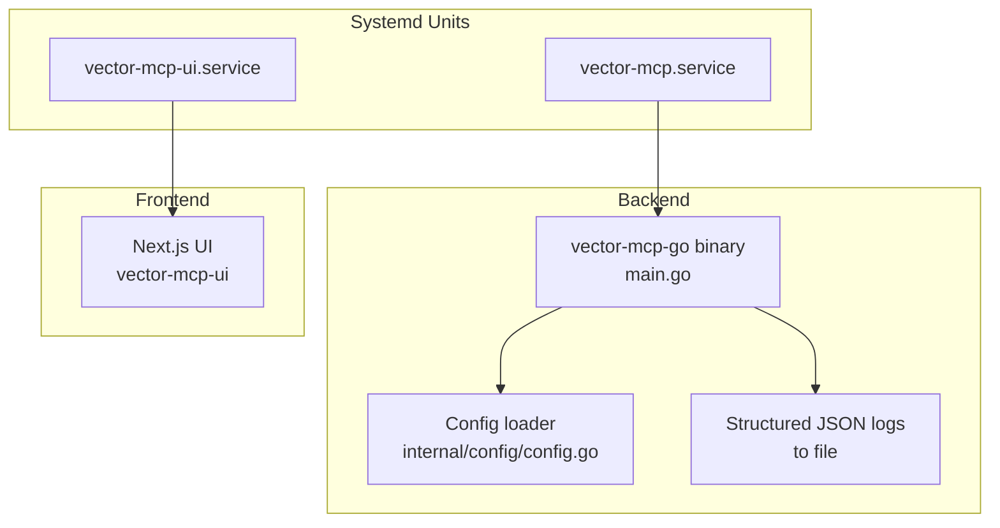
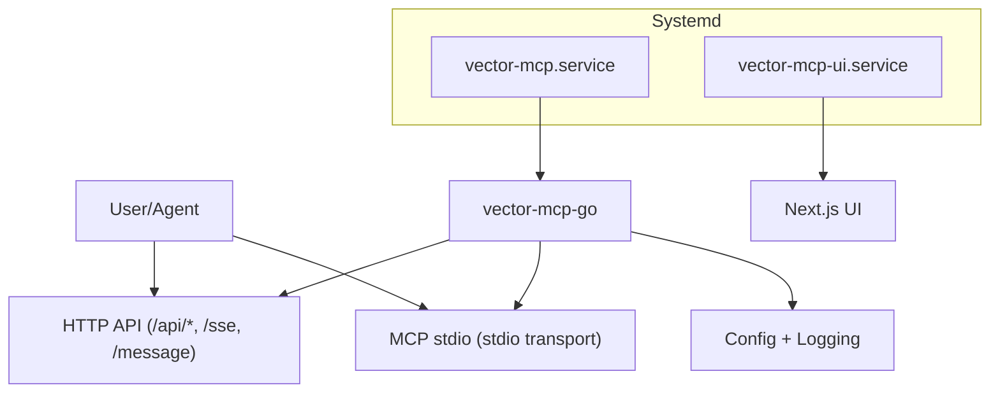
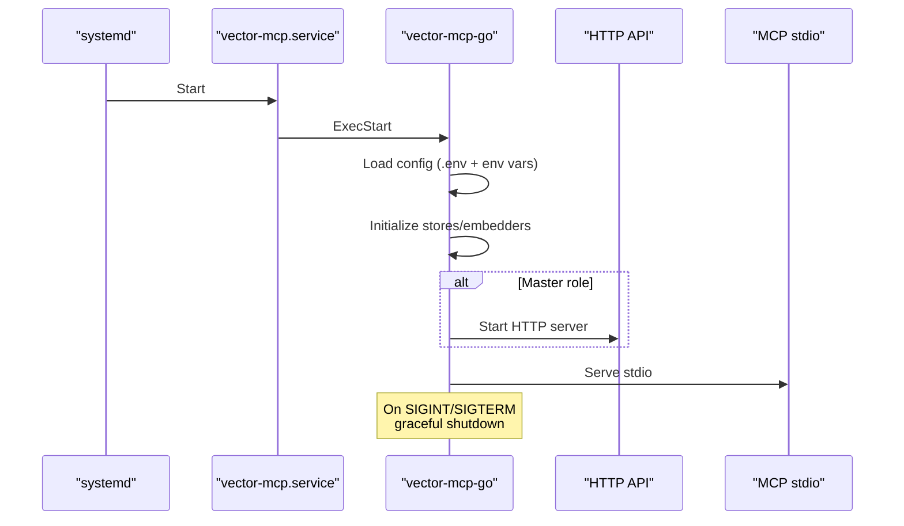
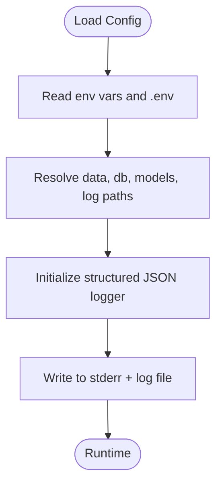
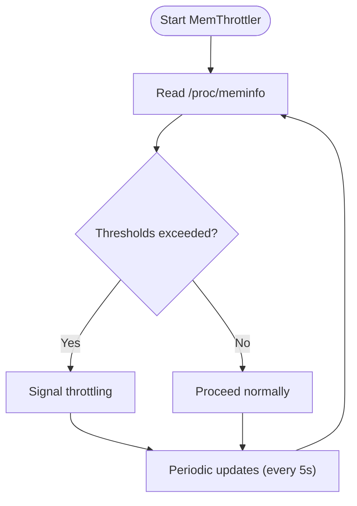
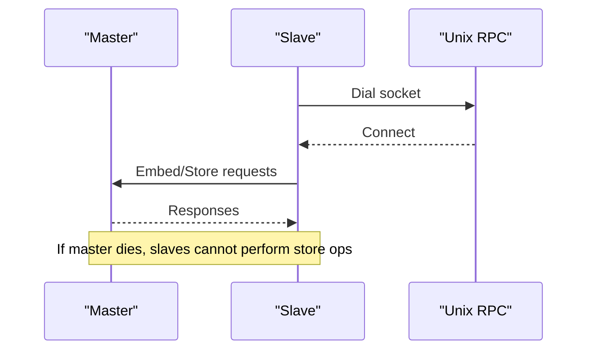
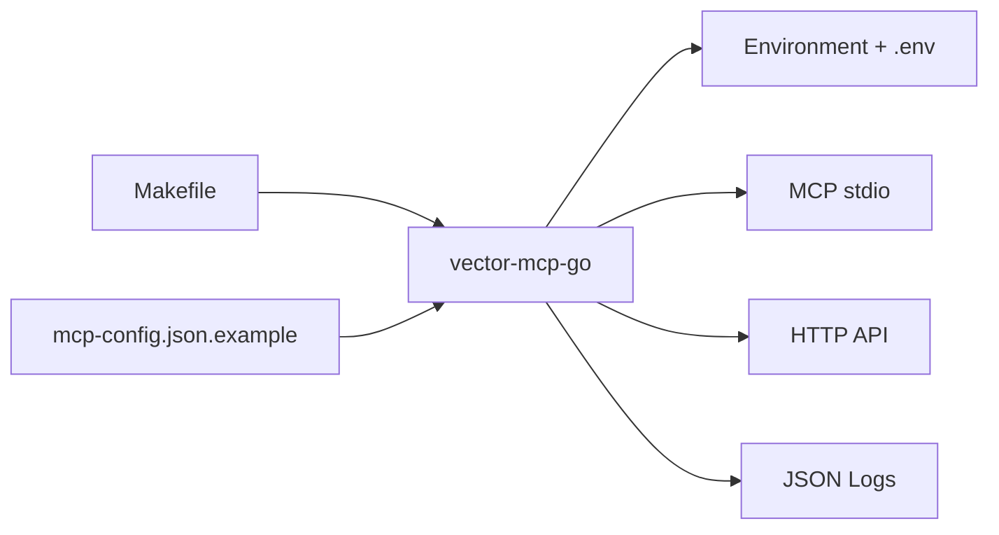

# Service Configuration and Monitoring

<cite>
**Referenced Files in This Document**
- [vector-mcp.service](file://scripts/vector-mcp.service)
- [vector-mcp-ui.service](file://scripts/vector-mcp-ui.service)
- [setup-services.sh](file://scripts/setup-services.sh)
- [main.go](file://main.go)
- [config.go](file://internal/config/config.go)
- [mem_throttler.go](file://internal/system/mem_throttler.go)
- [daemon.go](file://internal/daemon/daemon.go)
- [server.go (API)](file://internal/api/server.go)
- [server.go (MCP)](file://internal/mcp/server.go)
- [Makefile](file://Makefile)
- [README.md](file://README.md)
- [mcp-config.json.example](file://mcp-config.json.example)
</cite>

## Table of Contents
1. [Introduction](#introduction)
2. [Project Structure](#project-structure)
3. [Core Components](#core-components)
4. [Architecture Overview](#architecture-overview)
5. [Detailed Component Analysis](#detailed-component-analysis)
6. [Dependency Analysis](#dependency-analysis)
7. [Performance Considerations](#performance-considerations)
8. [Troubleshooting Guide](#troubleshooting-guide)
9. [Conclusion](#conclusion)
10. [Appendices](#appendices)

## Introduction
This document provides comprehensive service configuration and monitoring guidance for Vector MCP Go. It covers systemd service configuration for both the backend MCP service and the UI service, environment variable management, process supervision, health checks, automatic restart policies, logging configuration and rotation, centralized logging integration, resource monitoring, alerting, service discovery and failover, troubleshooting, and validation procedures.

## Project Structure
Vector MCP Go is organized around a main binary that supports both MCP stdio and an optional HTTP API. Services are managed via systemd unit files and a setup script. Configuration is loaded from environment variables and .env files, with structured JSON logging to a configurable log path.

**Diagram sources**
- [vector-mcp.service](file://scripts/vector-mcp.service)
- [vector-mcp-ui.service](file://scripts/vector-mcp-ui.service)
- [main.go](file://main.go)
- [config.go](file://internal/config/config.go)

**Section sources**
- [vector-mcp.service](file://scripts/vector-mcp.service)
- [vector-mcp-ui.service](file://scripts/vector-mcp-ui.service)
- [setup-services.sh](file://scripts/setup-services.sh)
- [main.go](file://main.go)
- [config.go](file://internal/config/config.go)

## Core Components
- Backend MCP service: Runs the main binary with daemon mode, exposing MCP stdio and optionally an HTTP API.
- UI service: Runs the Next.js frontend and depends on the backend service.
- Configuration: Loads environment variables and .env files, sets up structured JSON logging and directories.
- Health endpoints: HTTP API exposes a health endpoint for readiness and status checks.
- Memory throttling: Built-in memory monitoring to avoid overcommitting system resources.

**Section sources**
- [main.go](file://main.go)
- [config.go](file://internal/config/config.go)
- [server.go (API)](file://internal/api/server.go)
- [mem_throttler.go](file://internal/system/mem_throttler.go)

## Architecture Overview
The system consists of two systemd-managed services:
- Backend service: Starts the Go binary in daemon mode, loads configuration, and supervises the MCP server and optional API server.
- UI service: Starts the Next.js app and waits for the backend service to be ready.

**Diagram sources**
- [vector-mcp.service](file://scripts/vector-mcp.service)
- [vector-mcp-ui.service](file://scripts/vector-mcp-ui.service)
- [main.go](file://main.go)
- [server.go (API)](file://internal/api/server.go)

## Detailed Component Analysis

### Systemd Service Configuration

#### Backend Service (vector-mcp.service)
- Unit metadata: Description, network dependency.
- Service type: Simple process.
- Identity: User and group under which the service runs.
- Working directory: Project root.
- Environment: Loads environment variables from a .env file.
- ExecStart: Invokes the Go binary with the daemon flag.
- Restart policy: Always restart with a 10-second delay.
- Install: Enabled for multi-user target.

Key configuration touchpoints:
- ExecStart path and arguments.
- EnvironmentFile path for .env loading.
- RestartSec interval.

Operational behavior:
- On startup, the backend loads configuration from environment variables and .env, initializes stores and embedders, and starts either MCP stdio or the HTTP API depending on role and flags.

**Section sources**
- [vector-mcp.service](file://scripts/vector-mcp.service)
- [main.go](file://main.go)
- [config.go](file://internal/config/config.go)

#### UI Service (vector-mcp-ui.service)
- Unit metadata: Description, depends on the backend service and network.
- Service type: Simple process.
- Identity: User and group.
- Working directory: UI project root.
- Environment: Loads UI .env file.
- ExecStart: Uses Node/npm to start the UI on a fixed port.
- Restart policy: Always restart with a 10-second delay.
- Install: Enabled for multi-user target.

Operational behavior:
- Starts after the backend is available, ensuring the UI can communicate with the backend’s MCP and HTTP APIs.

**Section sources**
- [vector-mcp-ui.service](file://scripts/vector-mcp-ui.service)

#### Service Setup Script (setup-services.sh)
- Copies unit files to systemd directory.
- Reloads systemd daemon.
- Enables and starts both services.
- Provides status commands for verification.

**Section sources**
- [setup-services.sh](file://scripts/setup-services.sh)

### Process Supervision, Health Checks, and Automatic Restarts
- Automatic restart: Both services use a persistent restart policy with a short backoff interval to recover from transient failures.
- Health checks:
  - HTTP API health endpoint: Returns a simple JSON status and version.
  - MCP stdio availability: Indicates the MCP server is listening on stdio.
- Graceful shutdown: The main binary listens for OS signals and cancels contexts, stopping subsystems cleanly.

**Diagram sources**
- [vector-mcp.service](file://scripts/vector-mcp.service)
- [main.go](file://main.go)
- [server.go (API)](file://internal/api/server.go)

**Section sources**
- [vector-mcp.service](file://scripts/vector-mcp.service)
- [vector-mcp-ui.service](file://scripts/vector-mcp-ui.service)
- [main.go](file://main.go)
- [server.go (API)](file://internal/api/server.go)

### Logging Configuration and Centralized Logging Integration
- Configuration-driven logging:
  - Structured JSON logging via slog.
  - Log path defaults to a file under the data directory.
  - Output is written to stderr and appended to the log file.
- Environment variables:
  - LOG_PATH controls the log file location.
  - Other environment variables influence model paths, ports, and behavior.
- Centralized logging:
  - Standard output and file outputs can be aggregated by log collectors (e.g., journald, Fluent Bit, Filebeat).
  - JSON logs facilitate parsing and filtering.

**Diagram sources**
- [config.go](file://internal/config/config.go)

**Section sources**
- [config.go](file://internal/config/config.go)

### Monitoring Setup for System Resources, Memory Usage, and Performance Metrics
- Built-in memory throttling:
  - Periodic sampling of system memory via /proc/meminfo.
  - Thresholds for percentage used and minimum available MB.
  - Decision helpers for LSP startup and general throttling.
- Observability hooks:
  - MCP server emits notifications for operational events.
  - HTTP API exposes health status.
  - Application logs provide operational insights.

**Diagram sources**
- [mem_throttler.go](file://internal/system/mem_throttler.go)

**Section sources**
- [mem_throttler.go](file://internal/system/mem_throttler.go)
- [server.go (MCP)](file://internal/mcp/server.go)
- [server.go (API)](file://internal/api/server.go)

### Alerting Mechanisms, Thresholds, and Notification Integrations
- Threshold configuration:
  - Percentage-based memory threshold and minimum available MB are tunable via configuration.
- Notifications:
  - MCP server can broadcast notifications to connected clients.
  - HTTP API health endpoint can be polled by monitoring systems.
- Integration points:
  - Use systemd journal and log collectors for alerting.
  - Expose Prometheus-compatible metrics via a dedicated exporter if desired.

**Section sources**
- [mem_throttler.go](file://internal/system/mem_throttler.go)
- [server.go (MCP)](file://internal/mcp/server.go)
- [server.go (API)](file://internal/api/server.go)

### Service Discovery, Load Balancing, and Failover Scenarios
- Master/Slave architecture:
  - A Unix domain socket-based RPC mechanism coordinates between master and slave instances.
  - Slave instances delegate embedding and store operations to the master.
- Failover:
  - If the master becomes unavailable, slaves continue running but cannot perform certain operations; they can be restarted or reconfigured to point to a new master.
- Load balancing:
  - The current design centers on a single master; horizontal scaling would require additional coordination and proxying.

**Diagram sources**
- [daemon.go](file://internal/daemon/daemon.go)

**Section sources**
- [daemon.go](file://internal/daemon/daemon.go)

### Configuration Validation Procedures and Health Verification Methods
- Configuration validation:
  - Environment variables and .env are read at startup; missing keys fall back to defaults.
  - Ensure required directories exist and are writable.
- Health verification:
  - HTTP GET /api/health for API server status.
  - Polling MCP stdio readiness indicates the server is listening.
  - Inspect logs for initialization errors and warnings.

**Section sources**
- [config.go](file://internal/config/config.go)
- [server.go (API)](file://internal/api/server.go)
- [main.go](file://main.go)

## Dependency Analysis
- Binary dependencies:
  - The binary is built with Makefile targets and includes embedded version metadata.
- Runtime dependencies:
  - ONNX runtime library path can be configured via environment variables.
  - MCP client configuration references the binary path and environment overrides.

**Diagram sources**
- [Makefile](file://Makefile)
- [mcp-config.json.example](file://mcp-config.json.example)
- [main.go](file://main.go)

**Section sources**
- [Makefile](file://Makefile)
- [mcp-config.json.example](file://mcp-config.json.example)
- [main.go](file://main.go)

## Performance Considerations
- Embedding pool sizing:
  - Tune EMBEDDER_POOL_SIZE to balance throughput and memory usage.
- Live indexing:
  - ENABLE_LIVE_INDEXING triggers background indexing; monitor CPU and I/O.
- Memory pressure:
  - Adjust memory thresholds to prevent thrashing during heavy operations.
- Port configuration:
  - API_PORT controls the HTTP API binding; ensure it is not conflicting with other services.

[No sources needed since this section provides general guidance]

## Troubleshooting Guide
Common issues and resolutions:
- Service fails to start:
  - Verify ExecStart path and that the binary exists.
  - Check EnvironmentFile path and permissions.
  - Review logs for initialization errors.
- UI fails to connect:
  - Confirm the backend service is running and the MCP stdio/API are reachable.
  - Validate UI .env and port configuration.
- Memory-related slowdowns:
  - Reduce embedder pool size or throttle workloads.
  - Adjust memory thresholds to avoid throttling.
- Health checks failing:
  - Use /api/health to confirm API server status.
  - Check systemd status for both services.

**Section sources**
- [vector-mcp.service](file://scripts/vector-mcp.service)
- [vector-mcp-ui.service](file://scripts/vector-mcp-ui.service)
- [server.go (API)](file://internal/api/server.go)
- [mem_throttler.go](file://internal/system/mem_throttler.go)

## Conclusion
Vector MCP Go provides a robust, systemd-friendly deployment model with clear separation between the backend MCP service and the UI service. Configuration is environment-driven, logging is structured and file-backed, and health endpoints enable straightforward monitoring. The master/slave architecture and memory throttling offer practical mechanisms for reliability and performance.

[No sources needed since this section summarizes without analyzing specific files]

## Appendices

### Environment Variables Reference
- DATA_DIR: Base directory for data, DB, and models.
- DB_PATH: Specific path for the database.
- MODELS_DIR: Directory for models.
- LOG_PATH: Path to the JSON log file.
- PROJECT_ROOT: Root of the project.
- MODEL_NAME: Name of the embedding model.
- RERANKER_MODEL_NAME: Optional reranker model name or empty to disable.
- HF_TOKEN: Token for model downloads.
- DISABLE_FILE_WATCHER: Disable file watching if true.
- ENABLE_LIVE_INDEXING: Enable live indexing if true.
- EMBEDDER_POOL_SIZE: Size of the embedding worker pool.
- API_PORT: TCP port for the HTTP API.
- ONNX_LIB_PATH: Path to the ONNX runtime library (for MCP client configuration).

**Section sources**
- [config.go](file://internal/config/config.go)
- [mcp-config.json.example](file://mcp-config.json.example)