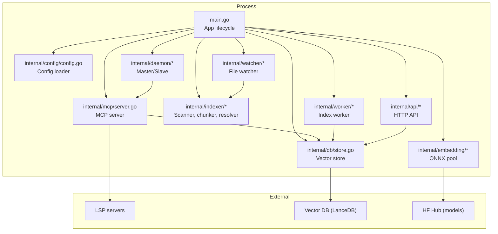
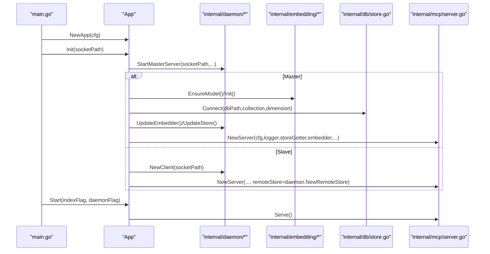
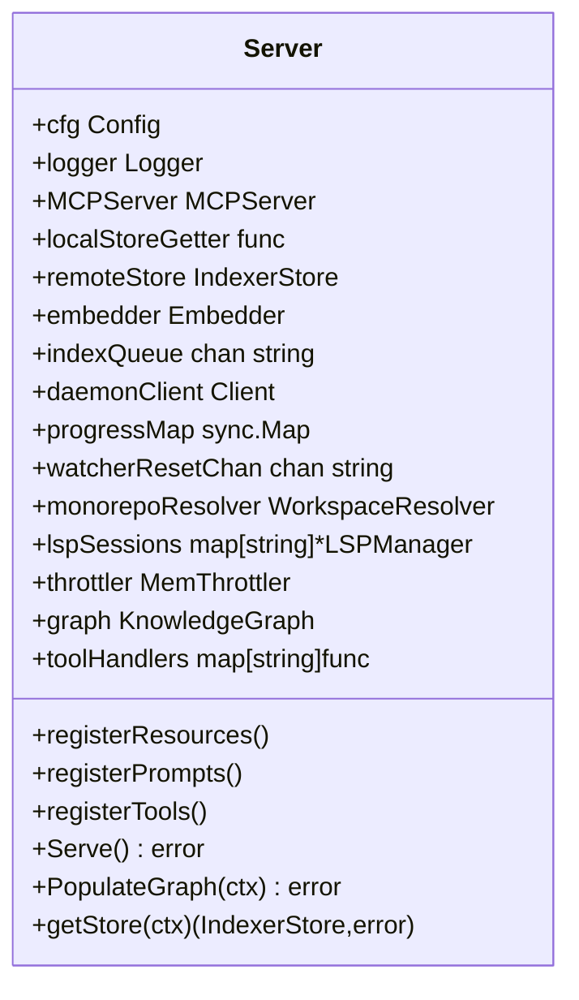
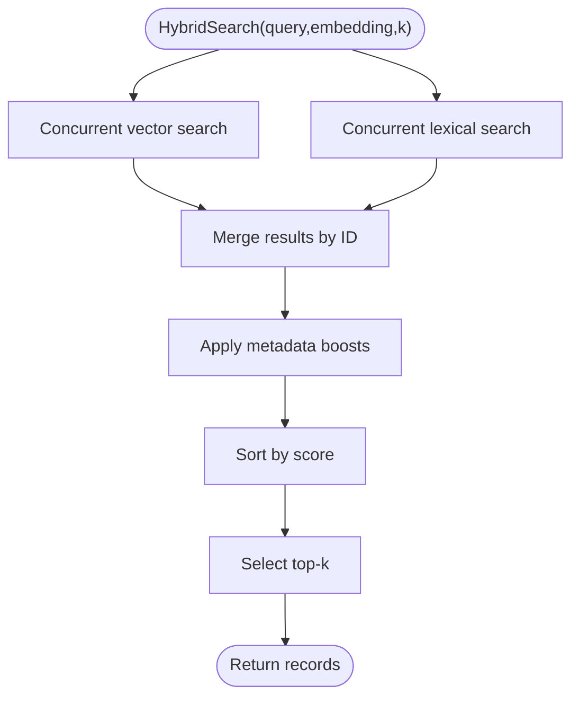
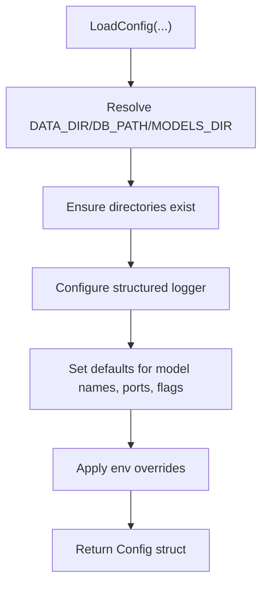
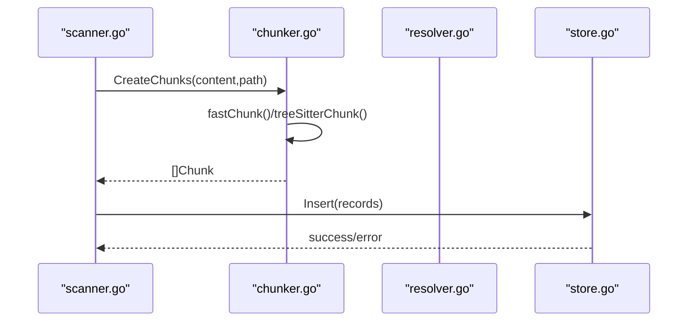
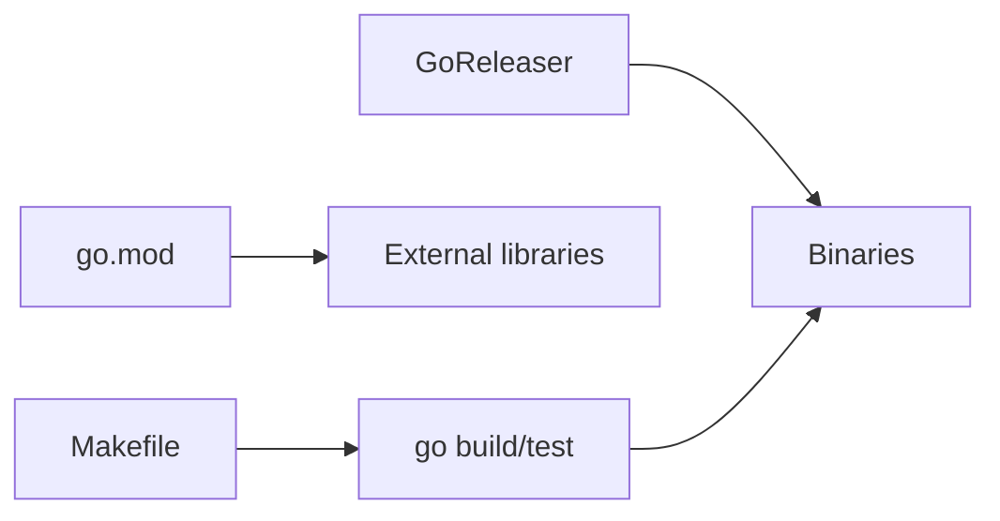
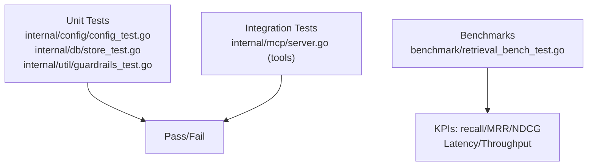

# Development Guide

<cite>
**Referenced Files in This Document**
- [README.md](file://README.md)
- [Makefile](file://Makefile)
- [go.mod](file://go.mod)
- [.goreleaser.yaml](file://.goreleaser.yaml)
- [main.go](file://main.go)
- [internal/config/config.go](file://internal/config/config.go)
- [internal/config/config_test.go](file://internal/config/config_test.go)
- [internal/mcp/server.go](file://internal/mcp/server.go)
- [internal/db/store.go](file://internal/db/store.go)
- [internal/db/store_test.go](file://internal/db/store_test.go)
- [internal/indexer/chunker_test.go](file://internal/indexer/chunker_test.go)
- [internal/util/guardrails_test.go](file://internal/util/guardrails_test.go)
- [benchmark/retrieval_bench_test.go](file://benchmark/retrieval_bench_test.go)
- [.github/workflows/ci.yml](file://.github/workflows/ci.yml)
- [scripts/setup-services.sh](file://scripts/setup-services.sh)
</cite>

## Table of Contents
1. [Introduction](#introduction)
2. [Project Structure](#project-structure)
3. [Core Components](#core-components)
4. [Architecture Overview](#architecture-overview)
5. [Detailed Component Analysis](#detailed-component-analysis)
6. [Dependency Analysis](#dependency-analysis)
7. [Performance Considerations](#performance-considerations)
8. [Testing Strategy](#testing-strategy)
9. [Development Environment Setup](#development-environment-setup)
10. [Coding Standards and Contribution Guidelines](#coding-standards-and-contribution-guidelines)
11. [Debugging and Local Testing](#debugging-and-local-testing)
12. [Extending the System](#extending-the-system)
13. [Troubleshooting Guide](#troubleshooting-guide)
14. [Conclusion](#conclusion)

## Introduction
This guide provides comprehensive development documentation for contributors working on Vector MCP Go. It covers environment setup, build and release processes, dependency management, testing, code quality, and extension points. The project implements a high-performance Model Context Protocol (MCP) server with a “Fat Tool” architecture, integrating semantic search, code analysis, and safe workspace mutation.

## Project Structure
The repository is organized around a modular internal package layout, with the main entry point, configuration, MCP server, database storage, indexing pipeline, and supporting utilities. Build and release automation are handled via Makefile and GoReleaser.

```mermaid
graph TB
A["main.go<br/>Application entrypoint"] --> B["internal/config/config.go<br/>Runtime configuration"]
A --> C["internal/mcp/server.go<br/>MCP server and tool registry"]
A --> D["internal/db/store.go<br/>Vector store and hybrid search"]
A --> E["internal/indexer/*<br/>Chunking, scanning, resolution"]
A --> F["internal/analysis/*<br/>Analyzers and distillation"]
A --> G["internal/embedding/*<br/>ONNX model management"]
A --> H["internal/worker/*<br/>Background indexing worker"]
A --> I["internal/watcher/*<br/>File change watcher"]
A --> J["internal/lsp/*<br/>Language Server integration"]
A --> K["internal/mutation/*<br/>Safety checks for mutations"]
A --> L["internal/system/*<br/>Memory throttling"]
A --> M["internal/util/*<br/>Utilities and guardrails"]
A --> N["internal/api/*<br/>HTTP API server"]
A --> O["internal/daemon/*<br/>Master/slave coordination"]
```

**Diagram sources**
- [main.go:280-317](file://main.go#L280-L317)
- [internal/config/config.go:30-130](file://internal/config/config.go#L30-L130)
- [internal/mcp/server.go:86-117](file://internal/mcp/server.go#L86-L117)
- [internal/db/store.go:35-64](file://internal/db/store.go#L35-L64)

**Section sources**
- [README.md:1-40](file://README.md#L1-L40)
- [main.go:16-29](file://main.go#L16-L29)

## Core Components
- Application lifecycle and initialization: Orchestrated by the main entrypoint, initializing configuration, embedding pool, database, MCP server, API server, workers, and watchers.
- Configuration: Centralized loading with environment overrides and defaults for paths, model names, pool sizes, and operational toggles.
- MCP Server: Registers resources, prompts, and tools; coordinates search, LSP, analysis, and mutation operations; supports master/slave modes.
- Database: Persistent vector store with hybrid search, lexical filtering, and metadata-driven ranking.
- Indexing Pipeline: File scanning, chunking, embedding, and insertion into the vector store.
- Utilities and Guardrails: Helpers for clamping values, truncating text safely, and memory throttling.

**Section sources**
- [main.go:58-71](file://main.go#L58-L71)
- [main.go:93-176](file://main.go#L93-L176)
- [internal/config/config.go:30-130](file://internal/config/config.go#L30-L130)
- [internal/mcp/server.go:86-117](file://internal/mcp/server.go#L86-L117)
- [internal/db/store.go:35-64](file://internal/db/store.go#L35-L64)

## Architecture Overview
The system operates as a standalone MCP server with optional API and background workers. It supports master/slave coordination for distributed indexing and embedding workloads.

**Diagram sources**
- [main.go:93-176](file://main.go#L93-L176)
- [internal/mcp/server.go:158-164](file://internal/mcp/server.go#L158-L164)
- [internal/db/store.go:35-64](file://internal/db/store.go#L35-L64)

## Detailed Component Analysis

### Application Lifecycle and Initialization
The application initializes configuration, sets up ONNX, ensures models, creates an embedding pool, connects to the vector store, and starts MCP, API, workers, and watchers depending on master/slave mode.

**Diagram sources**
- [main.go:93-176](file://main.go#L93-L176)
- [main.go:204-265](file://main.go#L204-L265)

**Section sources**
- [main.go:58-71](file://main.go#L58-L71)
- [main.go:93-176](file://main.go#L93-L176)
- [main.go:204-265](file://main.go#L204-L265)

### MCP Server and Tool Registry
The MCP server registers resources, prompts, and tools. It maintains LSP sessions per workspace root and supports master/slave store delegation.

**Diagram sources**
- [internal/mcp/server.go:66-117](file://internal/mcp/server.go#L66-L117)

**Section sources**
- [internal/mcp/server.go:190-407](file://internal/mcp/server.go#L190-L407)

### Vector Store and Hybrid Search
The vector store supports insertions, semantic search, lexical filtering, and hybrid retrieval with Reciprocal Rank Fusion and metadata-based boosting.

**Diagram sources**
- [internal/db/store.go:223-336](file://internal/db/store.go#L223-L336)

**Section sources**
- [internal/db/store.go:80-409](file://internal/db/store.go#L80-L409)

### Configuration Management
Configuration is loaded from environment variables and defaults, with support for model selection, reranking, watcher toggles, and pool sizing.

**Diagram sources**
- [internal/config/config.go:30-130](file://internal/config/config.go#L30-L130)

**Section sources**
- [internal/config/config.go:30-130](file://internal/config/config.go#L30-L130)
- [internal/config/config_test.go:8-114](file://internal/config/config_test.go#L8-L114)

### Indexing Pipeline and Chunking
The indexer scans files, chunks content using Tree-Sitter for supported languages, extracts relationships and structural metadata, and inserts embeddings into the vector store.

**Diagram sources**
- [internal/indexer/chunker_test.go:198-264](file://internal/indexer/chunker_test.go#L198-L264)
- [internal/db/store.go:66-78](file://internal/db/store.go#L66-L78)

**Section sources**
- [internal/indexer/chunker_test.go:8-364](file://internal/indexer/chunker_test.go#L8-L364)

## Dependency Analysis
- Build system: Makefile targets for formatting, linting, testing, building, and running the server.
- Modules: go.mod declares required libraries including MCP bindings, ONNX runtime, tree-sitter parsers, and LanceDB.
- Release: GoReleaser builds platform-specific binaries with CGO enabled and Zig-based cross-compilation toolchains.

**Diagram sources**
- [Makefile:11-28](file://Makefile#L11-L28)
- [go.mod:5-36](file://go.mod#L5-L36)
- [.goreleaser.yaml:10-30](file://.goreleaser.yaml#L10-L30)

**Section sources**
- [Makefile:1-44](file://Makefile#L1-L44)
- [go.mod:1-37](file://go.mod#L1-L37)
- [.goreleaser.yaml:1-54](file://.goreleaser.yaml#L1-L54)

## Performance Considerations
- Embedding pooling: A configurable pool reduces contention and improves throughput for concurrent requests.
- Parallelization: Lexical filtering and hybrid search leverage concurrency and CPU-aware chunking.
- Metadata-driven boosting: Priority and recency heuristics improve relevance without re-ranking costs.
- Memory throttling: System-level throttling prevents resource exhaustion during heavy indexing.

[No sources needed since this section provides general guidance]

## Testing Strategy
- Unit tests: Validate configuration behavior, vector store status operations, chunking logic, and utility functions.
- Integration tests: End-to-end scenarios for MCP tool invocation and server behavior.
- Benchmarks: Deterministic retrieval KPIs (recall, MRR, NDCG) on polyglot fixtures with latency and indexing metrics.

**Diagram sources**
- [internal/config/config_test.go:8-114](file://internal/config/config_test.go#L8-L114)
- [internal/db/store_test.go:9-58](file://internal/db/store_test.go#L9-L58)
- [internal/util/guardrails_test.go:5-106](file://internal/util/guardrails_test.go#L5-L106)
- [benchmark/retrieval_bench_test.go:92-224](file://benchmark/retrieval_bench_test.go#L92-L224)

**Section sources**
- [internal/config/config_test.go:8-114](file://internal/config/config_test.go#L8-L114)
- [internal/db/store_test.go:9-58](file://internal/db/store_test.go#L9-L58)
- [internal/indexer/chunker_test.go:8-364](file://internal/indexer/chunker_test.go#L8-L364)
- [internal/util/guardrails_test.go:5-106](file://internal/util/guardrails_test.go#L5-L106)
- [benchmark/retrieval_bench_test.go:92-224](file://benchmark/retrieval_bench_test.go#L92-L224)

## Development Environment Setup
- Prerequisites: Go version aligned with go.mod, C++ build tools for CGO-enabled ONNX runtime.
- Build: Use Makefile targets for formatting, vetting, testing, and building.
- Run: Execute the compiled binary or use the Makefile run target.
- CI: GitHub Actions enforces Go version, module downloads/verification, builds, tests, and vetting.

**Section sources**
- [README.md:21-40](file://README.md#L21-L40)
- [Makefile:11-28](file://Makefile#L11-L28)
- [.github/workflows/ci.yml:18-36](file://.github/workflows/ci.yml#L18-L36)
- [go.mod:3](file://go.mod#L3)

## Coding Standards and Contribution Guidelines
- Formatting and linting: Use gofmt simplification and go vet for static analysis.
- Tests: Include unit tests for new logic; integration tests for MCP tools; benchmarks for retrieval quality regressions.
- Commits: Follow conventional commit styles for clarity (e.g., feat:, fix:, docs:, test:).
- Pull Requests: Describe changes, link related issues, and ensure CI passes.

[No sources needed since this section provides general guidance]

## Debugging and Local Testing
- Logging: Structured JSON logging to stderr and optional file; configure via environment variables.
- Local execution: Use Makefile run target to compile and launch the server.
- Services: systemd service setup script for production deployments.
- Indexing diagnostics: Use MCP tools to trigger indexing and monitor status resources.

**Section sources**
- [internal/config/config.go:71-80](file://internal/config/config.go#L71-L80)
- [Makefile:27-28](file://Makefile#L27-L28)
- [scripts/setup-services.sh:1-31](file://scripts/setup-services.sh#L1-L31)
- [internal/mcp/server.go:190-272](file://internal/mcp/server.go#L190-L272)

## Extending the System
- Add new MCP tools: Register tools and handlers in the MCP server; expose prompts/resources as needed.
- Integrate custom analyzers: Extend the analyzer chain to incorporate domain-specific checks.
- Add new chunkers: Implement language-specific chunking logic compatible with the chunker interface.
- Custom reranking: Configure reranker model via environment variables; disable with sentinel value.

**Section sources**
- [internal/mcp/server.go:323-407](file://internal/mcp/server.go#L323-L407)
- [internal/config/config.go:88-98](file://internal/config/config.go#L88-L98)

## Troubleshooting Guide
- Dimension mismatch: If switching models, delete the vector database and restart to avoid embedding dimension errors.
- Missing master: Slave instances require a running master; disable watcher in slave mode.
- Slow search: Increase embedder pool size and ensure adequate memory; use throttling to stabilize performance.
- CI failures: Ensure Go version alignment, module verification, and successful vetting.

**Section sources**
- [internal/db/store.go:51-61](file://internal/db/store.go#L51-L61)
- [main.go:94-108](file://main.go#L94-L108)
- [.github/workflows/ci.yml:18-36](file://.github/workflows/ci.yml#L18-L36)

## Conclusion
Vector MCP Go provides a robust, deterministic MCP server with integrated semantic search, analysis, and safe mutation tools. Contributors should follow the established build, test, and release processes, maintain code quality with formatting and vetting, and leverage the modular architecture to extend functionality safely and efficiently.