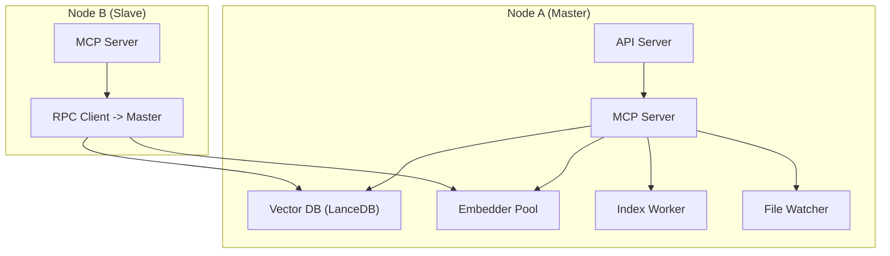
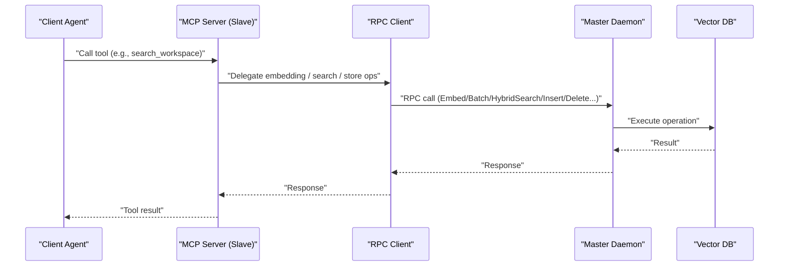
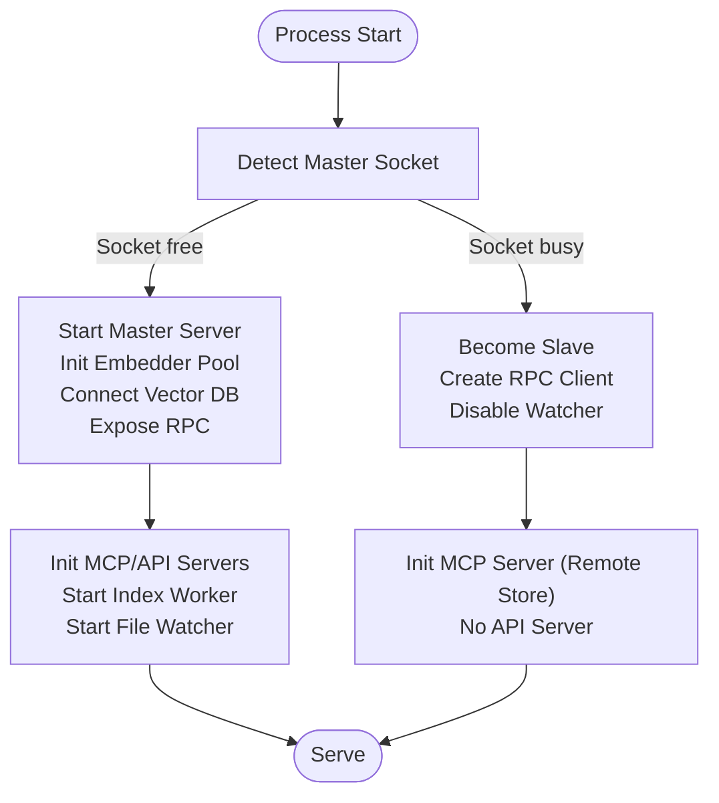
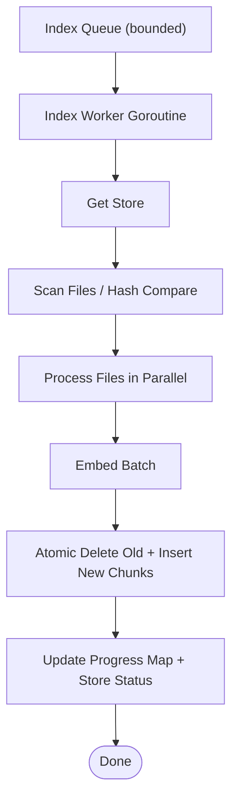
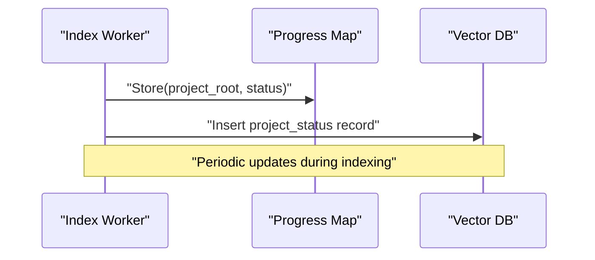
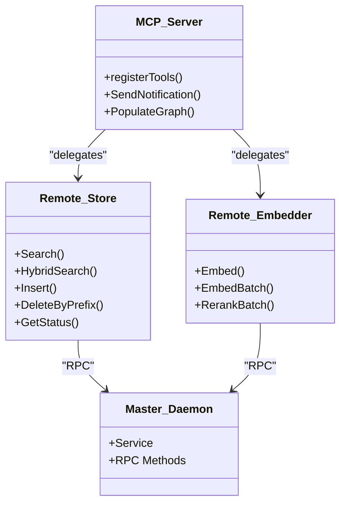
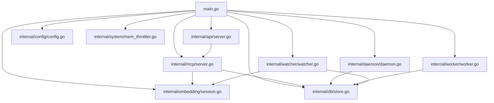

# Cluster Management and Scaling

<cite>
**Referenced Files in This Document**
- [main.go](file://main.go)
- [server.go](file://internal/mcp/server.go)
- [daemon.go](file://internal/daemon/daemon.go)
- [worker.go](file://internal/worker/worker.go)
- [config.go](file://internal/config/config.go)
- [store.go](file://internal/db/store.go)
- [scanner.go](file://internal/indexer/scanner.go)
- [watcher.go](file://internal/watcher/watcher.go)
- [server.go](file://internal/api/server.go)
- [session.go](file://internal/embedding/session.go)
- [mem_throttler.go](file://internal/system/mem_throttler.go)
- [analyzer.go](file://internal/analysis/analyzer.go)
- [safety.go](file://internal/mutation/safety.go)
- [go.mod](file://go.mod)
- [README.md](file://README.md)
</cite>

## Table of Contents
1. [Introduction](#introduction)
2. [Project Structure](#project-structure)
3. [Core Components](#core-components)
4. [Architecture Overview](#architecture-overview)
5. [Detailed Component Analysis](#detailed-component-analysis)
6. [Dependency Analysis](#dependency-analysis)
7. [Performance Considerations](#performance-considerations)
8. [Troubleshooting Guide](#troubleshooting-guide)
9. [Conclusion](#conclusion)
10. [Appendices](#appendices)

## Introduction
This document describes the cluster management and scaling strategies for the distributed Vector MCP system. It explains the master-slave architecture, load balancing, resource allocation, index queue management, progress tracking across workers, and coordination of distributed operations. It also covers horizontal scaling, worker process management, fault tolerance, deployment patterns, configuration management, monitoring, auto-scaling policies, capacity planning, and operational troubleshooting.

## Project Structure
The system centers around a single-process binary that dynamically assumes either a master or slave role depending on whether a master daemon is already present on the configured Unix domain socket. The master hosts the vector database, embedding pool, and orchestrates background indexing. Slaves connect to the master via RPC for embeddings and database operations while running their own MCP server locally.

**Diagram sources**
- [main.go:93-176](file://main.go#L93-L176)
- [daemon.go:333-378](file://internal/daemon/daemon.go#L333-L378)
- [server.go:86-117](file://internal/mcp/server.go#L86-L117)
- [worker.go:47-61](file://internal/worker/worker.go#L47-L61)
- [watcher.go:58-86](file://internal/watcher/watcher.go#L58-L86)

**Section sources**
- [main.go:93-176](file://main.go#L93-L176)
- [daemon.go:333-378](file://internal/daemon/daemon.go#L333-L378)
- [server.go:86-117](file://internal/mcp/server.go#L86-L117)
- [worker.go:47-61](file://internal/worker/worker.go#L47-L61)
- [watcher.go:58-86](file://internal/watcher/watcher.go#L58-L86)

## Core Components
- Application bootstrap and role detection: Initializes master/slave, model pools, stores, and servers.
- Master daemon: Exposes RPC service for embeddings and database operations; maintains index queue and progress map.
- MCP server: Registers tools/resources/prompts; coordinates search, indexing, and LSP operations; supports remote store mode.
- Index worker: Consumes index queue items and performs background indexing with progress reporting.
- File watcher: Monitors filesystem changes and triggers incremental indexing and proactive analysis.
- API server: Provides HTTP endpoints for health, search, context, and MCP transport.
- Embedding pool: Manages ONNX sessions and concurrency for embeddings and optional reranking.
- Memory throttler: Monitors system memory and advises when to throttle or pause heavy tasks.

**Section sources**
- [main.go:37-71](file://main.go#L37-L71)
- [daemon.go:17-23](file://internal/daemon/daemon.go#L17-L23)
- [server.go:66-84](file://internal/mcp/server.go#L66-L84)
- [worker.go:24-44](file://internal/worker/worker.go#L24-L44)
- [watcher.go:22-36](file://internal/watcher/watcher.go#L22-L36)
- [server.go:25-34](file://internal/mcp/server.go#L25-L34)
- [session.go:34-65](file://internal/embedding/session.go#L34-L65)
- [mem_throttler.go:21-28](file://internal/system/mem_throttler.go#L21-L28)

## Architecture Overview
The system implements a master-slave architecture with a shared vector database and coordinated indexing pipeline. The master controls the authoritative store and embedding pool, while slaves offload compute and serve MCP clients locally.

**Diagram sources**
- [daemon.go:401-408](file://internal/daemon/daemon.go#L401-L408)
- [daemon.go:511-518](file://internal/daemon/daemon.go#L511-L518)
- [daemon.go:112-128](file://internal/daemon/daemon.go#L112-L128)
- [daemon.go:149-184](file://internal/daemon/daemon.go#L149-L184)

**Section sources**
- [daemon.go:401-408](file://internal/daemon/daemon.go#L401-L408)
- [daemon.go:511-518](file://internal/daemon/daemon.go#L511-L518)
- [daemon.go:112-128](file://internal/daemon/daemon.go#L112-L128)
- [daemon.go:149-184](file://internal/daemon/daemon.go#L149-L184)

## Detailed Component Analysis

### Master-Slave Role Detection and Initialization
- Role detection: Starts a master server on a Unix socket; if a master is already present, the process becomes a slave.
- Master initialization: Loads models, initializes embedding pool, connects to vector DB, exposes RPC service, and starts live indexing if enabled.
- Slave initialization: Creates a remote embedder and remote store client; disables file watching; serves MCP over stdio.

**Diagram sources**
- [main.go:93-176](file://main.go#L93-L176)
- [daemon.go:333-378](file://internal/daemon/daemon.go#L333-L378)

**Section sources**
- [main.go:93-176](file://main.go#L93-L176)
- [daemon.go:333-378](file://internal/daemon/daemon.go#L333-L378)

### Index Queue Management and Background Workers
- Index queue: A bounded channel receives project roots for background indexing.
- Index worker: Consumes queue items, tracks per-path progress, and updates the store with atomic deletions and inserts.
- Live indexing: Optionally runs a full scan on startup and populates the knowledge graph.

**Diagram sources**
- [worker.go:47-61](file://internal/worker/worker.go#L47-L61)
- [worker.go:63-111](file://internal/worker/worker.go#L63-L111)
- [scanner.go:67-191](file://internal/indexer/scanner.go#L67-L191)

**Section sources**
- [worker.go:47-61](file://internal/worker/worker.go#L47-L61)
- [worker.go:63-111](file://internal/worker/worker.go#L63-L111)
- [scanner.go:67-191](file://internal/indexer/scanner.go#L67-L191)

### Progress Tracking Across Workers
- Progress map: A thread-safe map keyed by project root with a textual status string.
- Store status: Dedicated “project_status” records allow retrieval of per-project status.
- MCP resource: index://status exposes current status and record counts for health checks.

**Diagram sources**
- [worker.go:63-111](file://internal/worker/worker.go#L63-L111)
- [store.go:586-610](file://internal/db/store.go#L586-L610)
- [server.go:191-226](file://internal/mcp/server.go#L191-L226)

**Section sources**
- [worker.go:63-111](file://internal/worker/worker.go#L63-L111)
- [store.go:586-610](file://internal/db/store.go#L586-L610)
- [server.go:191-226](file://internal/mcp/server.go#L191-L226)

### Coordination of Distributed Operations
- Remote store and embedder: Slaves use RPC clients to delegate expensive operations to the master.
- MCP tool delegation: Tools that require embeddings or DB access route to master via RPC.
- Knowledge graph: Populated from the store to support reasoning across the codebase.

**Diagram sources**
- [server.go:150-164](file://internal/mcp/server.go#L150-L164)
- [daemon.go:502-509](file://internal/daemon/daemon.go#L502-L509)
- [daemon.go:439-446](file://internal/daemon/daemon.go#L439-L446)
- [daemon.go:17-23](file://internal/daemon/daemon.go#L17-L23)

**Section sources**
- [server.go:150-164](file://internal/mcp/server.go#L150-L164)
- [daemon.go:502-509](file://internal/daemon/daemon.go#L502-L509)
- [daemon.go:439-446](file://internal/daemon/daemon.go#L439-L446)
- [daemon.go:17-23](file://internal/daemon/daemon.go#L17-L23)

### Horizontal Scaling Considerations
- Multiple nodes: Each node runs the same binary; only one master is active. Additional nodes can join as slaves.
- Embedding pool sizing: Configure pool size per node to balance throughput and memory usage.
- File watcher: Disabled on slaves to avoid duplicate indexing work.
- API server: Only the master exposes the HTTP API; slaves serve MCP over stdio.

**Section sources**
- [main.go:104-108](file://main.go#L104-L108)
- [config.go:103-108](file://internal/config/config.go#L103-L108)
- [server.go:171-173](file://internal/mcp/server.go#L171-L173)

### Worker Process Management
- Single index worker: One goroutine consumes the index queue; can be extended to multiple workers with queue partitioning.
- Backpressure: Index queue is buffered; RPC index requests return immediately if the queue is full.
- Graceful shutdown: Context cancellation ensures workers and watchers terminate cleanly.

**Section sources**
- [worker.go:47-61](file://internal/worker/worker.go#L47-L61)
- [daemon.go:139-147](file://internal/daemon/daemon.go#L139-L147)
- [main.go:267-278](file://main.go#L267-L278)

### Fault Tolerance Mechanisms
- RPC timeouts: Embedding and rerank RPC calls enforce timeouts to avoid hanging slaves.
- Panic recovery: Index worker wraps processing in a defer/recover block and marks failures in progress.
- Stale path cleanup: Indexer removes records for files no longer present on disk.
- Memory throttling: Prevents out-of-memory conditions during heavy operations.

**Section sources**
- [daemon.go:463-474](file://internal/daemon/daemon.go#L463-L474)
- [daemon.go:636-647](file://internal/daemon/daemon.go#L636-L647)
- [worker.go:63-72](file://internal/worker/worker.go#L63-L72)
- [scanner.go:98-113](file://internal/indexer/scanner.go#L98-L113)
- [mem_throttler.go:87-103](file://internal/system/mem_throttler.go#L87-L103)

### Deployment Patterns for Multi-Node Setups
- Single master, multiple slaves: Recommended for most scenarios. Slaves connect to the master’s RPC endpoint.
- Environment isolation: Use separate data directories and sockets per node to avoid conflicts.
- API exposure: Only expose the master’s HTTP API; slaves remain internal.

**Section sources**
- [main.go:93-108](file://main.go#L93-L108)
- [server.go:171-173](file://internal/mcp/server.go#L171-L173)

### Configuration Management Across Nodes
- Centralized environment: Uses environment variables for model paths, dimensions, pool size, and API port.
- Local persistence: Each node maintains its own vector DB and logs; models are cached locally.
- Runtime configuration resource: MCP config://project resource exposes active runtime configuration.

**Section sources**
- [config.go:30-130](file://internal/config/config.go#L30-L130)
- [server.go:227-241](file://internal/mcp/server.go#L227-L241)

### Monitoring Strategies for Distributed Health Checks
- MCP index://status resource: Provides current indexing status, record count, and model info.
- API health endpoint: Returns server status and version.
- Progress retrieval: Slaves can query master for progress maps via RPC.

**Section sources**
- [server.go:191-226](file://internal/mcp/server.go#L191-L226)
- [server.go:131-139](file://internal/api/server.go#L131-L139)
- [daemon.go:425-437](file://internal/daemon/daemon.go#L425-L437)

### Auto-Scaling Policies and Capacity Planning
- CPU-bound tasks: Embedding and indexing scale with CPU cores; adjust pool size accordingly.
- Memory-bound tasks: Use memory throttler thresholds to avoid OOM; reduce pool size or add nodes.
- Queue depth: Tune index queue buffer to absorb bursts; monitor progress to detect backlog.
- Replication: Increase slave nodes to distribute MCP load; keep one master.

**Section sources**
- [session.go:34-65](file://internal/embedding/session.go#L34-L65)
- [mem_throttler.go:30-44](file://internal/system/mem_throttler.go#L30-L44)
- [worker.go:63-111](file://internal/worker/worker.go#L63-L111)

### Performance Optimization for Large-Scale Deployments
- Batch embeddings: Prefer batch operations; fallback to sequential on failure.
- Hybrid search: Combine vector and lexical search with reciprocal rank fusion.
- Parallel scanning: Indexer parallelizes file processing and batch insertion.
- Caching: Store-level metadata caching reduces repeated JSON parsing.

**Section sources**
- [scanner.go:256-269](file://internal/indexer/scanner.go#L256-L269)
- [scanner.go:120-148](file://internal/indexer/scanner.go#L120-L148)
- [store.go:223-336](file://internal/db/store.go#L223-L336)
- [store.go:633-663](file://internal/db/store.go#L633-L663)

### Troubleshooting Approaches
- Cluster-wide issues: Use index://status and MCP notifications to diagnose indexing problems; check API health.
- Node failure recovery: Restart slave processes; ensure master remains online; re-index affected projects if needed.
- Maintenance procedures: Rotate models via EnsureModel; clear stale paths; verify vector DB dimension compatibility.

**Section sources**
- [server.go:191-226](file://internal/mcp/server.go#L191-L226)
- [daemon.go:425-437](file://internal/daemon/daemon.go#L425-L437)
- [scanner.go:98-113](file://internal/indexer/scanner.go#L98-L113)
- [store.go:51-61](file://internal/db/store.go#L51-L61)

## Dependency Analysis
External dependencies include the MCP library, LanceDB-backed Chromem, ONNX runtime, and file system watching.

**Diagram sources**
- [go.mod:5-16](file://go.mod#L5-L16)
- [main.go:3-29](file://main.go#L3-L29)

**Section sources**
- [go.mod:5-16](file://go.mod#L5-L16)
- [main.go:3-29](file://main.go#L3-L29)

## Performance Considerations
- Embedding throughput: Scale pool size and leverage batch operations.
- Disk I/O: Batch inserts and parallel scanning reduce I/O pressure.
- Memory footprint: Monitor with throttler; cap available MB thresholds.
- Network latency: RPC calls are local IPC; keep master and slaves on the same host for best latency.

[No sources needed since this section provides general guidance]

## Troubleshooting Guide
- Embedding failures: Check model availability and tokenizer; verify ONNX session creation.
- Indexing stalls: Inspect progress map and store status; confirm queue consumption.
- Search anomalies: Validate hybrid search weights and metadata fields; ensure dimension consistency.
- LSP integration: Confirm language server availability and memory throttler permits.

**Section sources**
- [session.go:87-174](file://internal/embedding/session.go#L87-L174)
- [worker.go:63-111](file://internal/worker/worker.go#L63-L111)
- [store.go:223-336](file://internal/db/store.go#L223-L336)
- [mem_throttler.go:73-85](file://internal/system/mem_throttler.go#L73-L85)

## Conclusion
The Vector MCP system employs a practical master-slave architecture with a shared vector database and coordinated indexing pipeline. Its design emphasizes deterministic operations, local embeddings, and robust progress tracking. By tuning embedding pools, monitoring memory, and leveraging RPC delegation, the system scales horizontally across nodes while maintaining reliability and performance.

[No sources needed since this section summarizes without analyzing specific files]

## Appendices

### Configuration Options Reference
- Data directories and model paths
- API port and watcher toggles
- Embedding pool size and reranker selection

**Section sources**
- [config.go:30-130](file://internal/config/config.go#L30-L130)

### MCP Tools and Resources
- Unified search, LSP queries, analysis, mutation, and indexing tools
- Index status and configuration resources

**Section sources**
- [server.go:323-407](file://internal/mcp/server.go#L323-L407)
- [server.go:191-272](file://internal/mcp/server.go#L191-L272)