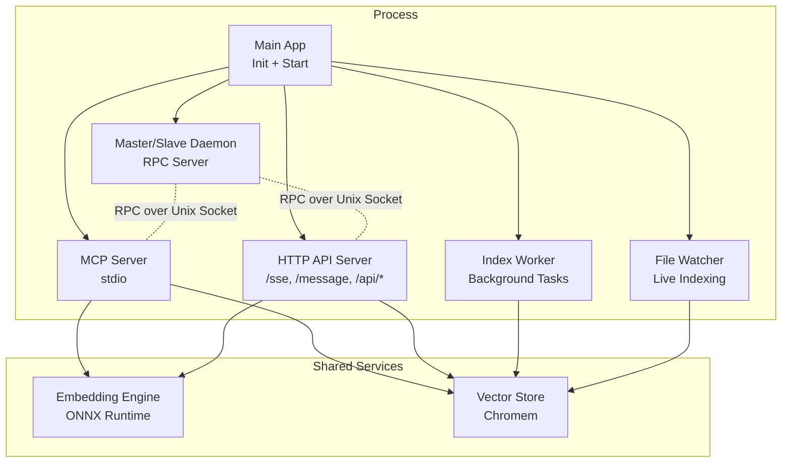
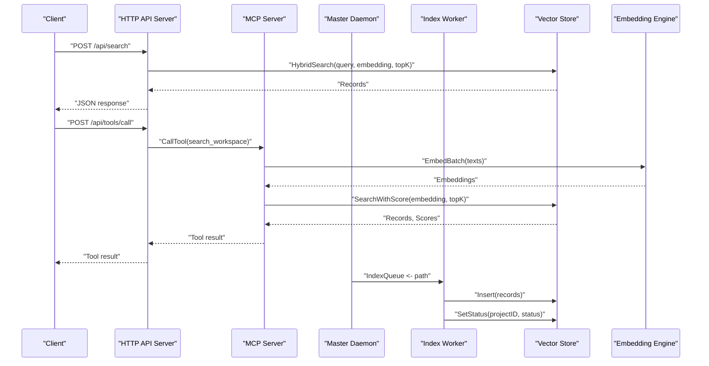
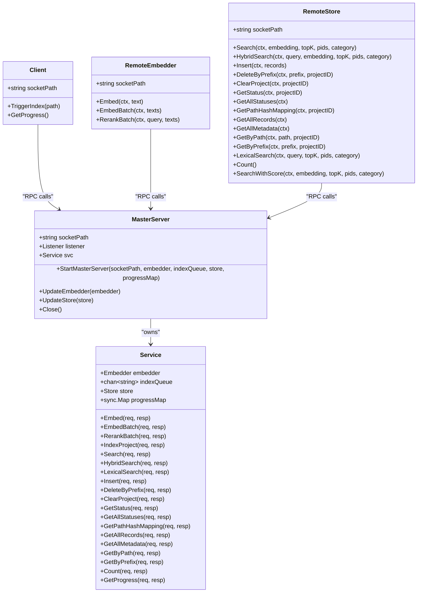
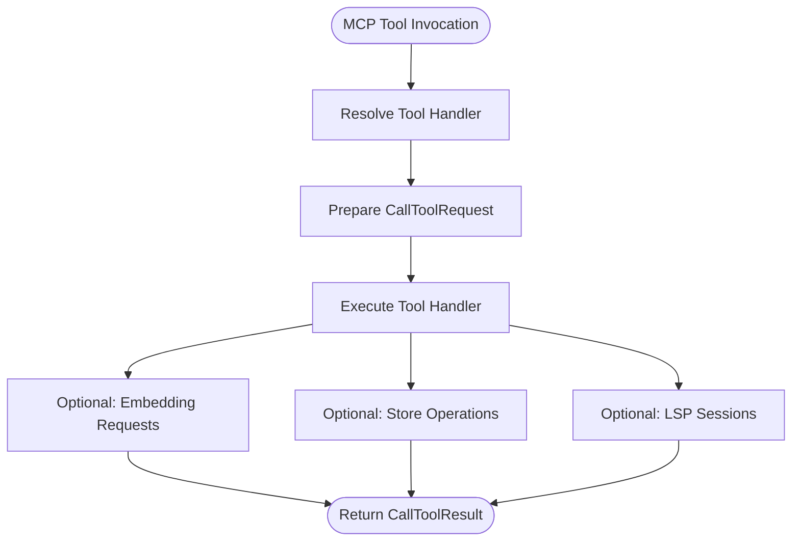
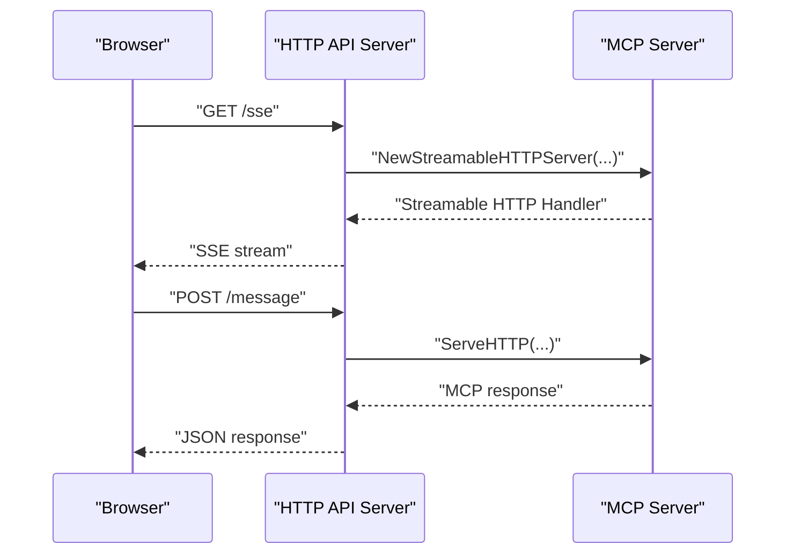
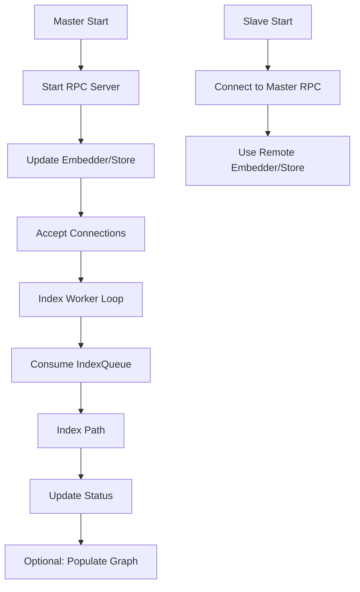
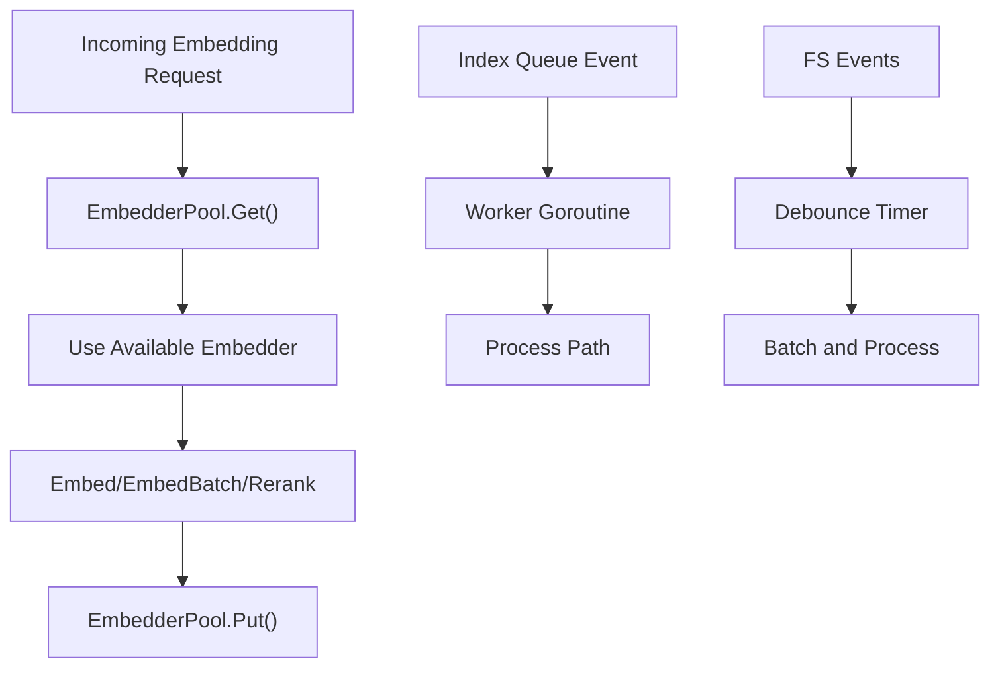
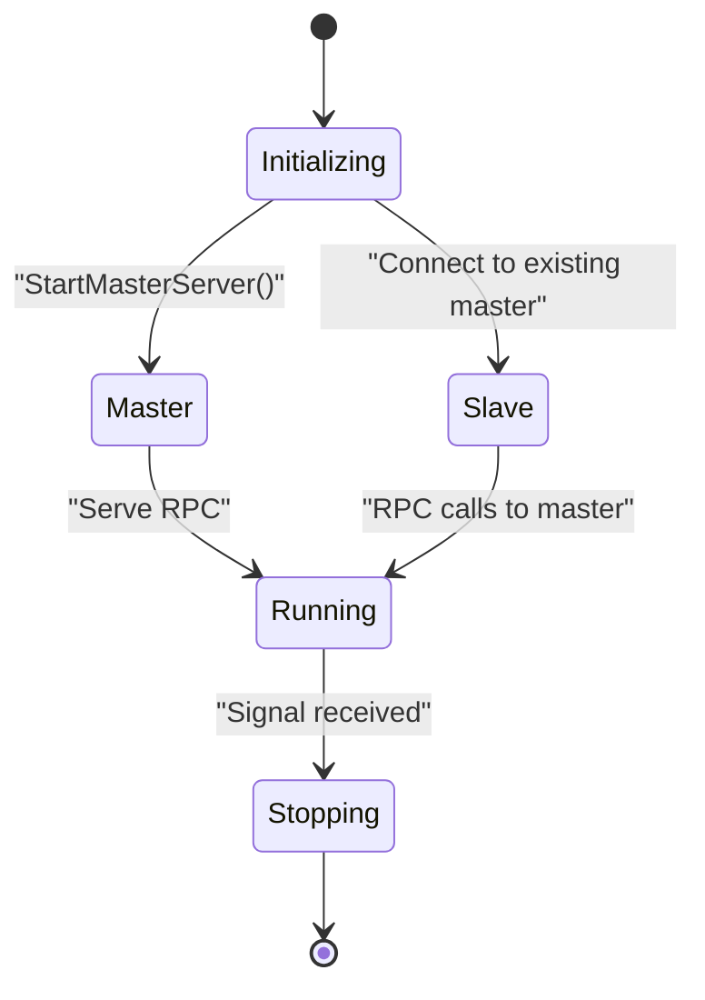
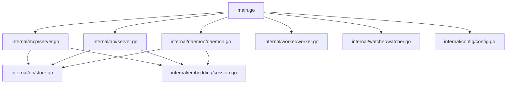

# Distributed Architecture

<cite>
**Referenced Files in This Document**
- [main.go](file://main.go)
- [daemon.go](file://internal/daemon/daemon.go)
- [server.go](file://internal/mcp/server.go)
- [server.go](file://internal/api/server.go)
- [config.go](file://internal/config/config.go)
- [worker.go](file://internal/worker/worker.go)
- [store.go](file://internal/db/store.go)
- [chunker.go](file://internal/indexer/chunker.go)
- [session.go](file://internal/embedding/session.go)
- [watcher.go](file://internal/watcher/watcher.go)
- [vector-mcp.service](file://scripts/vector-mcp.service)
- [vector-mcp-ui.service](file://scripts/vector-mcp-ui.service)
- [go.mod](file://go.mod)
</cite>

## Table of Contents
1. [Introduction](#introduction)
2. [Project Structure](#project-structure)
3. [Core Components](#core-components)
4. [Architecture Overview](#architecture-overview)
5. [Detailed Component Analysis](#detailed-component-analysis)
6. [Dependency Analysis](#dependency-analysis)
7. [Performance Considerations](#performance-considerations)
8. [Troubleshooting Guide](#troubleshooting-guide)
9. [Conclusion](#conclusion)
10. [Appendices](#appendices)

## Introduction
This document describes the distributed system design of Vector MCP Go, focusing on the master-slave coordination model, RPC service implementation, load balancing strategies, daemon architecture for worker coordination, resource allocation, task distribution, HTTP API server for web integration, streaming responses, real-time communication, cluster management, fault tolerance, scaling, network protocols, security, monitoring, deployment patterns, configuration management, and troubleshooting.

## Project Structure
The system is organized around a main entrypoint that orchestrates a daemonized master process, optional slave instances, an MCP server, an HTTP API server, workers, and auxiliary subsystems for indexing, embedding, and file watching.

**Diagram sources**
- [main.go:93-176](file://main.go#L93-L176)
- [daemon.go:333-378](file://internal/daemon/daemon.go#L333-L378)
- [worker.go:47-61](file://internal/worker/worker.go#L47-L61)
- [watcher.go:58-86](file://internal/watcher/watcher.go#L58-L86)
- [server.go:86-117](file://internal/mcp/server.go#L86-L117)
- [server.go:35-109](file://internal/api/server.go#L35-L109)

**Section sources**
- [main.go:280-317](file://main.go#L280-L317)
- [go.mod:1-37](file://go.mod#L1-L37)

## Core Components
- Master/Slave Daemon: Provides RPC service over a Unix domain socket for embedding, search, and store operations. Supports dynamic updates to embedder and store.
- MCP Server: Implements the Model Context Protocol over stdio, exposing tools, prompts, and resources for semantic search and code analysis.
- HTTP API Server: Exposes REST endpoints and streaming endpoints compatible with the Streamable-HTTP MCP spec, enabling browser-based clients and external integrations.
- Index Worker: Background worker consuming a channel of paths to index, reporting progress and status.
- File Watcher: Monitors filesystem changes and triggers live indexing, architectural guardrails, and re-distillation.
- Embedding Engine: ONNX Runtime-backed embedder with pooling and normalization, plus optional reranking.
- Vector Store: Persistent Chromem-based store with hybrid search, lexical filtering, and status tracking.

**Section sources**
- [daemon.go:17-324](file://internal/daemon/daemon.go#L17-L324)
- [server.go:66-84](file://internal/mcp/server.go#L66-L84)
- [server.go:24-31](file://internal/api/server.go#L24-L31)
- [worker.go:24-44](file://internal/worker/worker.go#L24-L44)
- [watcher.go:22-36](file://internal/watcher/watcher.go#L22-L36)
- [session.go:29-65](file://internal/embedding/session.go#L29-L65)
- [store.go:19-64](file://internal/db/store.go#L19-L64)

## Architecture Overview
Vector MCP Go implements a master-slave architecture centered on a Unix domain socket RPC service. The master coordinates embedding, indexing, and vector store operations, while slave instances delegate these tasks to the master. The MCP server runs on stdio for agent integration, and the HTTP API server provides web and streaming access. Workers and watchers operate under the master’s supervision for continuous indexing and live updates.

**Diagram sources**
- [server.go:75-85](file://internal/api/server.go#L75-L85)
- [server.go:331-407](file://internal/mcp/server.go#L331-L407)
- [daemon.go:139-147](file://internal/daemon/daemon.go#L139-L147)
- [worker.go:63-111](file://internal/worker/worker.go#L63-L111)
- [store.go:223-336](file://internal/db/store.go#L223-L336)
- [session.go:261-271](file://internal/embedding/session.go#L261-L271)

## Detailed Component Analysis

### Master/Slave Communication Pattern and RPC Service
- Master detection: The main process attempts to start a master RPC server on a Unix socket. If a master is already present, it operates as a slave.
- RPC surface: The master exposes embedding, search, insert, delete, status, mapping, and progress operations. Slaves communicate via RPC calls to the master.
- Embedder and store updates: The master can update the embedder and store dynamically, enabling hot-swapping of models and data stores.
- Remote clients: Slaves use RemoteEmbedder and RemoteStore wrappers to call master RPC methods transparently.

**Diagram sources**
- [daemon.go:326-400](file://internal/daemon/daemon.go#L326-L400)
- [daemon.go:17-111](file://internal/daemon/daemon.go#L17-L111)
- [daemon.go:401-474](file://internal/daemon/daemon.go#L401-L474)
- [daemon.go:502-622](file://internal/daemon/daemon.go#L502-L622)

**Section sources**
- [main.go:93-108](file://main.go#L93-L108)
- [daemon.go:333-378](file://internal/daemon/daemon.go#L333-L378)
- [daemon.go:401-474](file://internal/daemon/daemon.go#L401-L474)
- [daemon.go:502-622](file://internal/daemon/daemon.go#L502-L622)

### MCP Server Implementation and Tools
- Tool registration: The MCP server registers tools for search, workspace management, LSP queries, code analysis, workspace mutation, and context storage.
- Resource exposure: Provides index status, project configuration, and usage guide resources.
- Prompt management: Offers prompts for documentation generation and architecture analysis.
- Notifications: Sends notifications to clients for logging and progress updates.
- Embedder access: Exposes the embedder for tools requiring embeddings.

**Diagram sources**
- [server.go:324-407](file://internal/mcp/server.go#L324-L407)
- [server.go:190-272](file://internal/mcp/server.go#L190-L272)
- [server.go:431-444](file://internal/mcp/server.go#L431-L444)

**Section sources**
- [server.go:86-117](file://internal/mcp/server.go#L86-L117)
- [server.go:190-272](file://internal/mcp/server.go#L190-L272)
- [server.go:324-407](file://internal/mcp/server.go#L324-L407)
- [server.go:409-429](file://internal/mcp/server.go#L409-L429)

### HTTP API Server and Streaming Responses
- Streamable-HTTP: Uses the MCP Streamable-HTTP server to expose MCP endpoints over HTTP with SSE and message endpoints.
- CORS: Adds CORS headers for browser-based clients.
- Health endpoint: Reports server status and version.
- Tool endpoints: Provides endpoints to list repositories, check index status, trigger indexing, skeleton generation, list tools, and call tools programmatically.

**Diagram sources**
- [server.go:48-71](file://internal/api/server.go#L48-L71)
- [server.go:89-101](file://internal/api/server.go#L89-L101)

**Section sources**
- [server.go:35-109](file://internal/api/server.go#L35-L109)
- [server.go:111-121](file://internal/api/server.go#L111-L121)

### Daemon Architecture, Resource Allocation, and Task Distribution
- Master lifecycle: Starts the RPC server on a Unix socket, registers the service, and serves connections.
- Slave lifecycle: Detects an existing master and becomes a slave, disabling file watching and using remote store and embedder.
- Worker coordination: Master maintains an index queue; the worker consumes paths and performs indexing, updating progress and status.
- Memory throttling: A memory throttler prevents out-of-memory conditions during embedding and indexing.
- Live indexing: On master, a live indexing process scans the codebase and populates the knowledge graph.

**Diagram sources**
- [daemon.go:333-378](file://internal/daemon/daemon.go#L333-L378)
- [worker.go:47-61](file://internal/worker/worker.go#L47-L61)
- [worker.go:63-111](file://internal/worker/worker.go#L63-L111)
- [main.go:178-202](file://main.go#L178-L202)

**Section sources**
- [daemon.go:326-400](file://internal/daemon/daemon.go#L326-L400)
- [worker.go:24-44](file://internal/worker/worker.go#L24-L44)
- [main.go:178-202](file://main.go#L178-L202)

### Load Balancing Strategies
- Embedder pool: The embedder pool maintains a fixed-size channel of embedders, enabling concurrent embedding requests without blocking.
- Worker concurrency: The index worker runs in a goroutine consuming the index queue, processing paths concurrently as they arrive.
- File watcher debouncing: A debounced event processor batches filesystem events to reduce redundant indexing.
- Hybrid search: Vector and lexical searches run concurrently, then fused via Reciprocal Rank Fusion to balance performance and relevance.

**Diagram sources**
- [session.go:67-78](file://internal/embedding/session.go#L67-L78)
- [worker.go:47-61](file://internal/worker/worker.go#L47-L61)
- [watcher.go:121-139](file://internal/watcher/watcher.go#L121-L139)
- [store.go:223-336](file://internal/db/store.go#L223-L336)

**Section sources**
- [session.go:34-65](file://internal/embedding/session.go#L34-L65)
- [worker.go:47-61](file://internal/worker/worker.go#L47-L61)
- [watcher.go:121-139](file://internal/watcher/watcher.go#L121-L139)
- [store.go:223-336](file://internal/db/store.go#L223-L336)

### Cluster Management, Fault Tolerance, and Scaling
- Single master constraint: The master server detects an existing master on startup and fails fast if another master is running, preventing split-brain scenarios.
- Graceful shutdown: The main process listens for signals and cancels contexts, closing the master server and throttler.
- Retry and backoff: The systemd units restart the services on failure with a delay.
- Horizontal scaling: Multiple slave nodes can connect to a single master, distributing workload across machines while sharing the same vector store and models.

**Diagram sources**
- [main.go:297-305](file://main.go#L297-L305)
- [daemon.go:348-356](file://internal/daemon/daemon.go#L348-L356)
- [vector-mcp.service:11](file://scripts/vector-mcp.service#L11)
- [vector-mcp-ui.service:11](file://scripts/vector-mcp-ui.service#L11)

**Section sources**
- [daemon.go:348-356](file://internal/daemon/daemon.go#L348-L356)
- [main.go:267-278](file://main.go#L267-L278)
- [vector-mcp.service:1-17](file://scripts/vector-mcp.service#L1-L17)
- [vector-mcp-ui.service:1-17](file://scripts/vector-mcp-ui.service#L1-L17)

### Network Protocols, Security, and Monitoring
- Network protocol: RPC over Unix domain sockets for local IPC between master and slaves.
- Security: No authentication or TLS is implemented; the Unix socket is bound to a local path. Consider restricting filesystem permissions and using a dedicated user/group.
- Monitoring: MCP notifications provide progress and logging; the HTTP API exposes a health endpoint; the file watcher logs events; the store tracks indexing status.

**Section sources**
- [daemon.go:358-371](file://internal/daemon/daemon.go#L358-L371)
- [server.go:409-429](file://internal/mcp/server.go#L409-L429)
- [server.go:131-138](file://internal/api/server.go#L131-L138)
- [watcher.go:141-196](file://internal/watcher/watcher.go#L141-L196)

### Deployment Patterns and Configuration Management
- Environment variables: Configuration is loaded from environment variables with sensible defaults, including project root, data directories, model paths, API port, and toggles for watcher and live indexing.
- Systemd services: Separate units for backend and frontend, with environment files and restart policies.
- Multi-node deployment: Multiple slave nodes can share the same master, enabling horizontal scaling.

**Section sources**
- [config.go:30-130](file://internal/config/config.go#L30-L130)
- [vector-mcp.service:1-17](file://scripts/vector-mcp.service#L1-L17)
- [vector-mcp-ui.service:1-17](file://scripts/vector-mcp-ui.service#L1-L17)

## Dependency Analysis
The system relies on several external libraries for MCP transport, vector database, parsing, and ONNX runtime.

**Diagram sources**
- [main.go:3-29](file://main.go#L3-L29)
- [go.mod:5-16](file://go.mod#L5-L16)

**Section sources**
- [go.mod:1-37](file://go.mod#L1-L37)

## Performance Considerations
- Embedding throughput: Use the embedder pool to parallelize embedding requests; tune pool size according to CPU and memory capacity.
- Indexing concurrency: The index worker processes paths concurrently; ensure the index queue depth is appropriate for workload.
- Search fusion: Hybrid search runs vector and lexical searches concurrently and fuses results; adjust topK and weights for performance vs. recall.
- Memory management: The memory throttler helps avoid OOM; monitor memory usage and adjust pool sizes accordingly.
- File watcher batching: Debouncing reduces redundant indexing; tune the debounce interval for responsiveness vs. overhead.

[No sources needed since this section provides general guidance]

## Troubleshooting Guide
- Master already running: If starting a slave fails due to an existing master, verify the socket path and ensure only one master is active.
- Embedding timeouts: Remote embedding calls have timeouts; check master availability and network latency.
- Indexing failures: Inspect progress and status updates; verify model availability and store connectivity.
- HTTP API errors: Check CORS headers and endpoint paths; ensure the MCP server is reachable via Streamable-HTTP.
- File watcher issues: Verify watched directories and ignore patterns; ensure filesystem permissions allow watching.

**Section sources**
- [main.go:100-108](file://main.go#L100-L108)
- [daemon.go:463-474](file://internal/daemon/daemon.go#L463-L474)
- [worker.go:63-111](file://internal/worker/worker.go#L63-L111)
- [server.go:131-138](file://internal/api/server.go#L131-L138)
- [watcher.go:102-119](file://internal/watcher/watcher.go#L102-L119)

## Conclusion
Vector MCP Go’s distributed design centers on a robust master-slave RPC architecture with a Unix domain socket, enabling scalable coordination of embedding, indexing, and vector search across multiple nodes. The MCP server and HTTP API provide flexible integration for agents and web clients, while workers and watchers ensure continuous, live indexing. With embedder pools, concurrent search, and debounced file watching, the system balances performance and reliability. For production deployments, consider securing the Unix socket, monitoring resource usage, and tuning pool sizes and debounce intervals to match workload characteristics.

[No sources needed since this section summarizes without analyzing specific files]

## Appendices

### Configuration Options
- ProjectRoot: Root directory of the project to index.
- DataDir: Base directory for DB and models.
- DbPath: Specific path for the vector database.
- ModelsDir: Directory for embedding models.
- LogPath: Path for server logs.
- ModelName: Name of the embedding model.
- RerankerModelName: Name of the reranker model or empty to disable.
- HFToken: Hugging Face token for model downloads.
- Dimension: Embedding dimension.
- DisableWatcher: Disable file watching.
- EnableLiveIndexing: Enable live indexing on master.
- EmbedderPoolSize: Number of embedders in the pool.
- ApiPort: Port for the HTTP API server.

**Section sources**
- [config.go:13-28](file://internal/config/config.go#L13-L28)
- [config.go:30-130](file://internal/config/config.go#L30-L130)