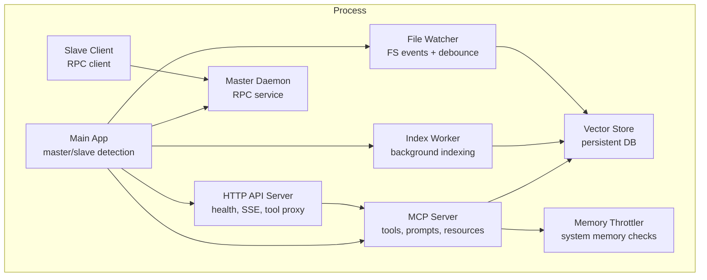
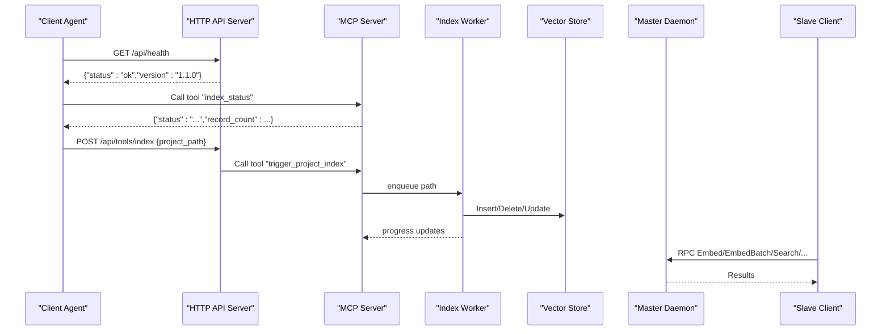
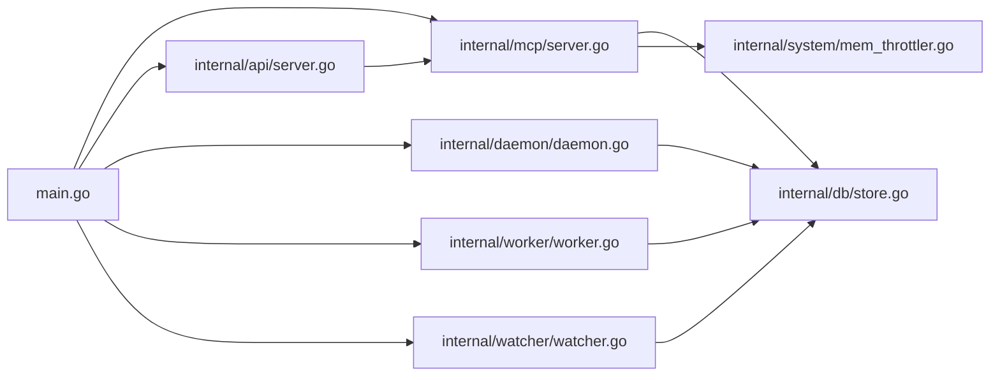

# Distributed System Monitoring and Troubleshooting

<cite>
**Referenced Files in This Document**
- [main.go](file://main.go)
- [server.go](file://internal/mcp/server.go)
- [daemon.go](file://internal/daemon/daemon.go)
- [server.go](file://internal/api/server.go)
- [config.go](file://internal/config/config.go)
- [store.go](file://internal/db/store.go)
- [mem_throttler.go](file://internal/system/mem_throttler.go)
- [worker.go](file://internal/worker/worker.go)
- [watcher.go](file://internal/watcher/watcher.go)
- [scanner.go](file://internal/indexer/scanner.go)
- [setup-services.sh](file://scripts/setup-services.sh)
- [vector-mcp.service](file://scripts/vector-mcp.service)
- [vector-mcp-ui.service](file://scripts/vector-mcp-ui.service)
- [README.md](file://README.md)
</cite>

## Table of Contents
1. [Introduction](#introduction)
2. [Project Structure](#project-structure)
3. [Core Components](#core-components)
4. [Architecture Overview](#architecture-overview)
5. [Detailed Component Analysis](#detailed-component-analysis)
6. [Dependency Analysis](#dependency-analysis)
7. [Performance Considerations](#performance-considerations)
8. [Troubleshooting Guide](#troubleshooting-guide)
9. [Conclusion](#conclusion)
10. [Appendices](#appendices)

## Introduction
This document provides comprehensive guidance for monitoring and troubleshooting distributed Vector MCP deployments. It explains health checks, progress tracking, and diagnostic endpoints; outlines logging and metrics strategies; details alerting configurations for master-slave coordination; and covers common troubleshooting scenarios such as RPC connection failures, embedding timeouts, search performance issues, and cluster synchronization problems. It also includes debugging tools, diagnostic commands, monitoring dashboards recommendations, performance bottleneck identification, resource utilization tracking, capacity planning, and operational procedures for maintenance windows, rolling updates, and disaster recovery.

## Project Structure
The system is composed of:
- A main entrypoint that orchestrates master/slave detection, initialization, and lifecycle management.
- An MCP server exposing tools, prompts, and resources for clients.
- An HTTP API server for health checks, streaming, and tool management.
- A master daemon exposing RPC endpoints for embedding and vector store operations.
- A slave daemon client delegating operations to the master.
- A worker that processes background indexing tasks.
- A file watcher that proactively indexes changes and enforces architectural guardrails.
- A vector store backed by a persistent database with hybrid search and lexical ranking.
- A memory throttler to prevent out-of-memory conditions during heavy operations.
- Configuration and environment-driven settings for paths, ports, and feature toggles.

**Diagram sources**
- [main.go:93-176](file://main.go#L93-L176)
- [server.go:88-128](file://internal/mcp/server.go#L88-L128)
- [server.go:33-109](file://internal/api/server.go#L33-L109)
- [daemon.go:333-378](file://internal/daemon/daemon.go#L333-L378)
- [daemon.go:401-437](file://internal/daemon/daemon.go#L401-L437)
- [worker.go:34-61](file://internal/worker/worker.go#L34-L61)
- [watcher.go:38-56](file://internal/watcher/watcher.go#L38-L56)
- [store.go:35-64](file://internal/db/store.go#L35-L64)
- [mem_throttler.go:30-44](file://internal/system/mem_throttler.go#L30-L44)

**Section sources**
- [main.go:37-176](file://main.go#L37-L176)
- [README.md:1-40](file://README.md#L1-L40)

## Core Components
- Health checks:
  - HTTP endpoint for API server readiness.
  - MCP resource for indexing status and record counts.
- Progress tracking:
  - In-memory progress map synchronized across workers and watchers.
  - Store-backed status for projects and files.
- Diagnostics:
  - MCP resource for configuration inspection.
  - MCP prompt registry for guidance.
  - MCP tool for retrieving index status and triggering re-indexing.
- Logging:
  - Structured JSON logs to file and stderr.
  - Notification channel to broadcast logs to clients.
- Metrics and alerting:
  - Built-in counters and status fields suitable for external metric collection.
  - Suggested Prometheus scraping targets and alert rules in the Troubleshooting Guide.

**Section sources**
- [server.go:131-139](file://internal/api/server.go#L131-L139)
- [server.go:201-283](file://internal/mcp/server.go#L201-L283)
- [worker.go:14-32](file://internal/worker/worker.go#L14-L32)
- [store.go:586-631](file://internal/db/store.go#L586-L631)
- [config.go:71-81](file://internal/config/config.go#L71-L81)
- [server.go:420-440](file://internal/mcp/server.go#L420-L440)

## Architecture Overview
The system operates in two modes:
- Master mode: Initializes ONNX, model pools, vector store, MCP server, HTTP API, worker, and file watcher. Exposes RPC service for embedding and store operations.
- Slave mode: Detects an existing master, connects via RPC, and delegates embedding and store operations to the master while acting as a client to the MCP server.

**Diagram sources**
- [server.go:131-139](file://internal/api/server.go#L131-L139)
- [server.go:385-418](file://internal/mcp/server.go#L385-L418)
- [worker.go:46-61](file://internal/worker/worker.go#L46-L61)
- [daemon.go:401-437](file://internal/daemon/daemon.go#L401-L437)
- [daemon.go:502-614](file://internal/daemon/daemon.go#L502-L614)

## Detailed Component Analysis

### Health Checks and Readiness
- HTTP health endpoint: Returns a simple JSON payload indicating service status and version.
- MCP resource index://status: Provides current indexing status, record count, model name, and whether the instance is master.
- MCP tool index_status: Returns a concise indexing status for polling.

Operational tips:
- Use the HTTP health endpoint for Kubernetes readiness probes.
- Poll index://status for background indexing completion before client requests.

**Section sources**
- [server.go:131-139](file://internal/api/server.go#L131-L139)
- [server.go:201-237](file://internal/mcp/server.go#L201-L237)
- [server.go:385-387](file://internal/mcp/server.go#L385-L387)

### Progress Tracking and Diagnostics
- In-memory progress map: Updated by the worker and watcher; exposed via MCP resource index://status.
- Store-backed status: Per-project and per-file status stored in the vector database.
- MCP notifications: Broadcasts logs and warnings to connected clients.

Diagnostic commands:
- Read index://status to confirm indexing progress and record counts.
- Use MCP tool index_status for quick status.
- Inspect config://project to verify runtime configuration.

**Section sources**
- [worker.go:63-111](file://internal/worker/worker.go#L63-L111)
- [watcher.go:141-196](file://internal/watcher/watcher.go#L141-L196)
- [store.go:586-631](file://internal/db/store.go#L586-L631)
- [server.go:420-440](file://internal/mcp/server.go#L420-L440)

### Master-Slave Coordination and RPC
- Master daemon RPC service exposes embedding, reranking, and store operations.
- Slave client dials the master UNIX socket and performs RPC calls with timeouts.
- Remote embedder and remote store wrap RPC calls for seamless delegation.

Common RPC issues:
- Socket path conflicts or stale sockets.
- Master not initialized (store not ready).
- RPC timeouts for embedding/batch operations.

**Section sources**
- [daemon.go:333-378](file://internal/daemon/daemon.go#L333-L378)
- [daemon.go:401-437](file://internal/daemon/daemon.go#L401-L437)
- [daemon.go:439-500](file://internal/daemon/daemon.go#L439-L500)
- [daemon.go:502-614](file://internal/daemon/daemon.go#L502-L614)

### Embedding and Search Performance
- Embedding batching with fallback to sequential embedding on failure.
- Hybrid search combining vector and lexical search with reciprocal rank fusion (RRF).
- Lexical search filters and parallel processing for large datasets.
- Priority and recency boosts applied to results.

Performance tuning:
- Adjust embedder pool size via configuration.
- Monitor memory usage to avoid throttling during heavy loads.
- Use lexical search for exact matches and identifiers-heavy queries.

**Section sources**
- [scanner.go:256-269](file://internal/indexer/scanner.go#L256-L269)
- [store.go:223-336](file://internal/db/store.go#L223-L336)
- [store.go:85-221](file://internal/db/store.go#L85-L221)
- [mem_throttler.go:30-44](file://internal/system/mem_throttler.go#L30-L44)

### File Watcher and Live Indexing
- Watches file system events with debouncing and recursive directory watching.
- Proactively indexes modified files and cleans up deleted paths.
- Enforces architectural guardrails and triggers redistillation for dependent packages.

Operational tips:
- Disable watcher in slave mode to avoid redundant indexing.
- Use live indexing for rapid feedback during development.

**Section sources**
- [watcher.go:58-119](file://internal/watcher/watcher.go#L58-L119)
- [watcher.go:121-196](file://internal/watcher/watcher.go#L121-L196)
- [watcher.go:198-281](file://internal/watcher/watcher.go#L198-L281)
- [main.go:220-234](file://main.go#L220-L234)

### Logging and Notifications
- Structured JSON logging to file and stderr.
- MCP notifications broadcast informational and warning messages to clients.
- Logger instances are passed across components for consistent logging.

**Section sources**
- [config.go:71-81](file://internal/config/config.go#L71-L81)
- [server.go:420-440](file://internal/mcp/server.go#L420-L440)

### Configuration and Environment
- Loads environment variables for paths, model names, dimensions, watcher flags, pool size, and API port.
- Ensures directories exist and sets up logging.

**Section sources**
- [config.go:30-130](file://internal/config/config.go#L30-L130)

## Dependency Analysis
The following diagram shows key dependencies among components:

**Diagram sources**
- [main.go:93-176](file://main.go#L93-L176)
- [server.go:88-128](file://internal/mcp/server.go#L88-L128)
- [server.go:33-109](file://internal/api/server.go#L33-L109)
- [daemon.go:333-378](file://internal/daemon/daemon.go#L333-L378)
- [worker.go:34-61](file://internal/worker/worker.go#L34-L61)
- [watcher.go:38-56](file://internal/watcher/watcher.go#L38-L56)
- [store.go:35-64](file://internal/db/store.go#L35-L64)
- [mem_throttler.go:30-44](file://internal/system/mem_throttler.go#L30-L44)

**Section sources**
- [main.go:93-176](file://main.go#L93-L176)
- [server.go:88-128](file://internal/mcp/server.go#L88-L128)
- [server.go:33-109](file://internal/api/server.go#L33-L109)
- [daemon.go:333-378](file://internal/daemon/daemon.go#L333-L378)
- [worker.go:34-61](file://internal/worker/worker.go#L34-L61)
- [watcher.go:38-56](file://internal/watcher/watcher.go#L38-L56)
- [store.go:35-64](file://internal/db/store.go#L35-L64)
- [mem_throttler.go:30-44](file://internal/system/mem_throttler.go#L30-L44)

## Performance Considerations
- Embedding throughput:
  - Use embedding batch APIs; fallback to sequential embedding on failure.
  - Tune embedder pool size via configuration to balance latency and throughput.
- Search performance:
  - Hybrid search with RRF improves recall; adjust weights for identifier-heavy queries.
  - Lexical search parallelization reduces latency for large datasets.
- Memory pressure:
  - Monitor system memory via the throttler; avoid starting heavy tasks when thresholds are exceeded.
- Disk and CPU:
  - Indexing uses CPU and disk IO; schedule large scans during off-peak hours.
  - Ensure sufficient disk space for the persistent vector database.

[No sources needed since this section provides general guidance]

## Troubleshooting Guide

### Health and Readiness
- Verify HTTP health endpoint responds with status OK.
- Confirm MCP resource index://status shows expected record counts and status.
- Use MCP tool index_status to check background indexing progress.

**Section sources**
- [server.go:131-139](file://internal/api/server.go#L131-L139)
- [server.go:201-237](file://internal/mcp/server.go#L201-L237)
- [server.go:385-387](file://internal/mcp/server.go#L385-L387)

### RPC Connection Failures
Symptoms:
- Slave cannot connect to master socket.
- RPC calls fail with connection errors.
- Master already running errors.

Resolution steps:
- Ensure the master daemon is running and the UNIX socket path is correct.
- Remove stale socket files if the master crashed unexpectedly.
- Confirm permissions and ownership of the socket path.

**Section sources**
- [daemon.go:348-357](file://internal/daemon/daemon.go#L348-L357)
- [daemon.go:410-423](file://internal/daemon/daemon.go#L410-L423)

### Embedding Timeouts
Symptoms:
- Embedding RPC calls timeout (single or batch).
- Rerank batch RPC calls timeout.

Resolution steps:
- Increase timeouts or reduce batch sizes.
- Check master daemon responsiveness and resource availability.
- Verify model loading and ONNX initialization.

**Section sources**
- [daemon.go:463-474](file://internal/daemon/daemon.go#L463-L474)
- [daemon.go:489-500](file://internal/daemon/daemon.go#L489-L500)
- [daemon.go:636-647](file://internal/daemon/daemon.go#L636-L647)

### Search Performance Issues
Symptoms:
- Slow hybrid search or lexical search.
- Missed results or low relevance.

Resolution steps:
- Reduce topK or filter by project IDs/categories.
- Use lexical search for exact matches and identifiers.
- Review priority and recency boosts affecting results.

**Section sources**
- [store.go:223-336](file://internal/db/store.go#L223-L336)
- [store.go:85-221](file://internal/db/store.go#L85-L221)

### Cluster Synchronization Problems
Symptoms:
- Slave shows outdated index or inconsistent status.
- Stale paths not cleaned up.

Resolution steps:
- Trigger re-indexing via MCP tool trigger_project_index.
- Verify file watcher is active (not disabled in slave mode).
- Check for stale socket files and restart master if needed.

**Section sources**
- [server.go:387-391](file://internal/mcp/server.go#L387-L391)
- [watcher.go:187-196](file://internal/watcher/watcher.go#L187-L196)
- [daemon.go:348-357](file://internal/daemon/daemon.go#L348-L357)

### Memory and Resource Exhaustion
Symptoms:
- Out-of-memory errors during indexing or embedding.
- LSP processes failing to start.

Resolution steps:
- Adjust memory thresholds and minimum available MB in the throttler.
- Reduce embedder pool size or concurrency.
- Schedule heavy operations during low-traffic periods.

**Section sources**
- [mem_throttler.go:30-44](file://internal/system/mem_throttler.go#L30-L44)
- [mem_throttler.go:87-103](file://internal/system/mem_throttler.go#L87-L103)

### Monitoring Dashboards and Alerts
Recommended metrics:
- Indexing progress percentage and rate.
- Record counts per project.
- Embedding latency and error rates.
- Search latency and hit ratio.
- Memory usage and throttling events.
- RPC call durations and error rates.

Suggested dashboards:
- Indexing pipeline: progress, rate, errors.
- Search performance: latency quantiles, error rates.
- Resource usage: CPU, memory, disk IO.
- RPC health: connection attempts, timeouts, errors.

Alerting rules (examples):
- Embedding timeout rate above threshold.
- Search latency p95 above threshold.
- Memory usage above threshold or throttling events.
- Indexing progress停滞超过阈值.

[No sources needed since this section provides general guidance]

### Debugging Tools and Commands
- Read MCP resource index://status for indexing status and record counts.
- Call MCP tool index_status for quick progress.
- Inspect config://project for active configuration.
- Use MCP prompt generate-docstring or analyze-architecture for guided diagnostics.
- Check structured logs for errors and panics.

**Section sources**
- [server.go:201-283](file://internal/mcp/server.go#L201-L283)
- [server.go:285-332](file://internal/mcp/server.go#L285-L332)
- [server.go:385-387](file://internal/mcp/server.go#L385-L387)

### Operational Procedures

#### Maintenance Windows
- Schedule maintenance during low-traffic periods.
- Drain traffic from the service and stop the master.
- Perform updates and restart services.
- Validate health endpoints and indexing status.

#### Rolling Updates
- Update one node at a time.
- Ensure the master remains available during updates.
- Verify RPC connectivity and embedding performance after each update.

#### Disaster Recovery
- Back up the persistent vector database directory.
- Restore from backup and restart services.
- Rebuild index if necessary using MCP tool trigger_project_index.

**Section sources**
- [main.go:267-278](file://main.go#L267-L278)
- [server.go:387-391](file://internal/mcp/server.go#L387-L391)

## Conclusion
This guide provides a comprehensive framework for monitoring and troubleshooting distributed Vector MCP deployments. By leveraging health checks, progress tracking, and diagnostic endpoints, teams can maintain reliable operations. Proper logging, metrics, and alerting enable early problem detection. Following the troubleshooting procedures and operational guidelines ensures smooth maintenance, updates, and recovery.

[No sources needed since this section summarizes without analyzing specific files]

## Appendices

### Service Management
- Systemd service files for backend and UI components.
- Setup script to copy and enable services.

**Section sources**
- [setup-services.sh:1-31](file://scripts/setup-services.sh#L1-L31)
- [vector-mcp.service:1-17](file://scripts/vector-mcp.service#L1-L17)
- [vector-mcp-ui.service:1-17](file://scripts/vector-mcp-ui.service#L1-L17)