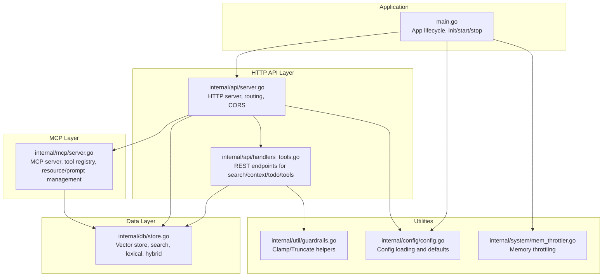
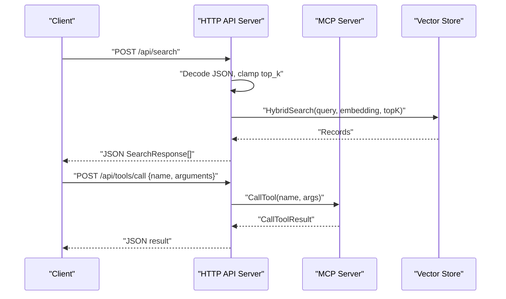
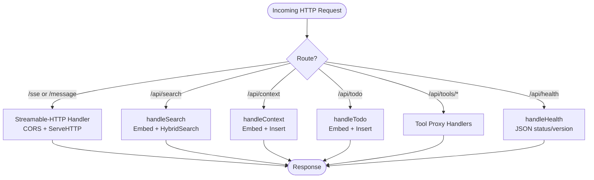
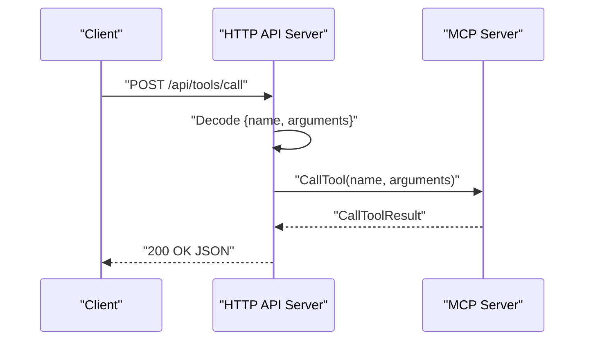
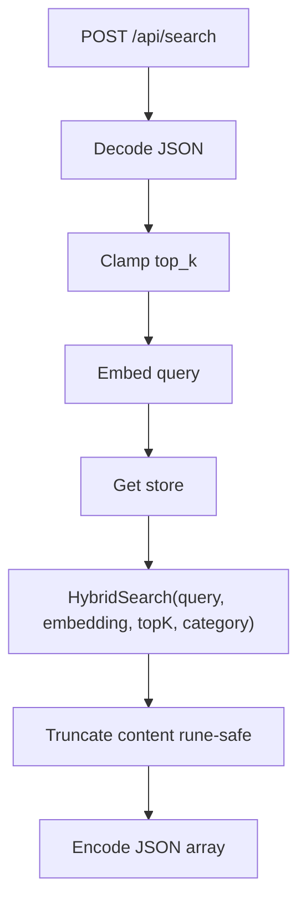
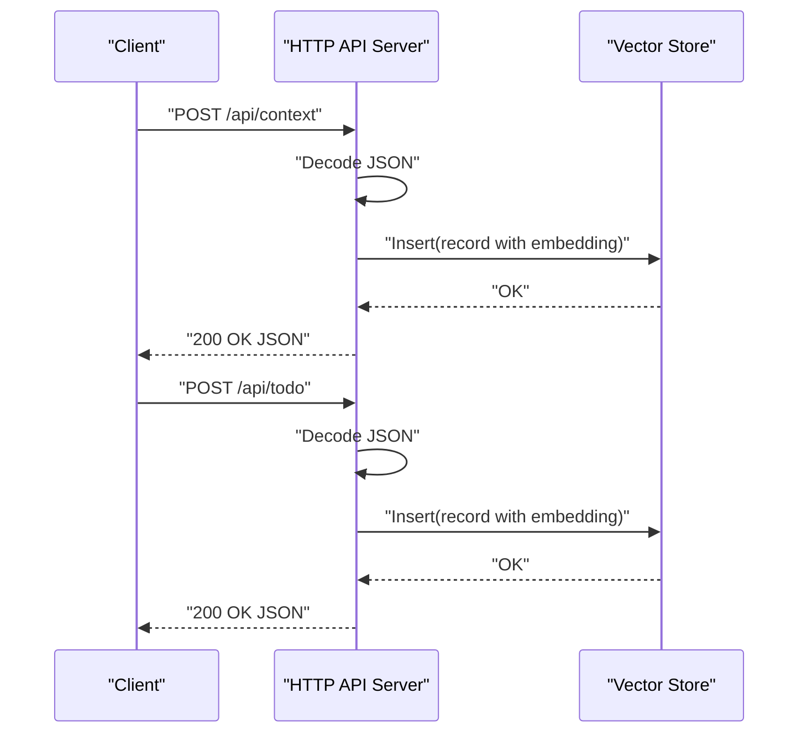
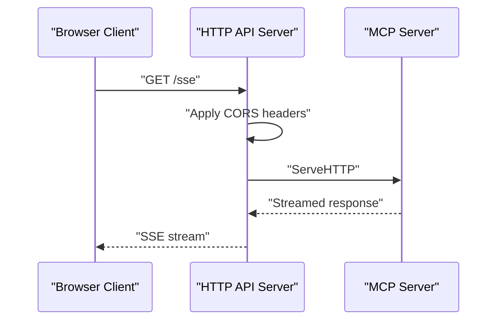
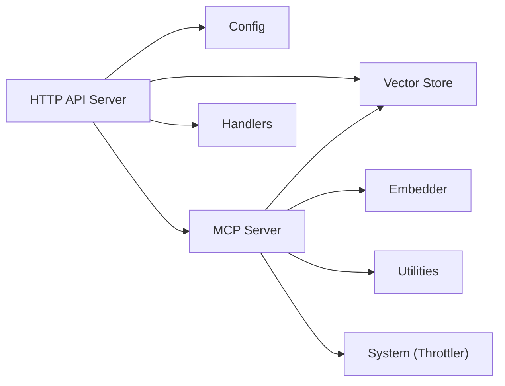

# HTTP API and Web Integration

<cite>
**Referenced Files in This Document**
- [main.go](file://main.go)
- [internal/api/server.go](file://internal/api/server.go)
- [internal/api/handlers_tools.go](file://internal/api/handlers_tools.go)
- [internal/mcp/server.go](file://internal/mcp/server.go)
- [internal/config/config.go](file://internal/config/config.go)
- [internal/db/store.go](file://internal/db/store.go)
- [internal/util/guardrails.go](file://internal/util/guardrails.go)
- [internal/system/mem_throttler.go](file://internal/system/mem_throttler.go)
- [benchmark/retrieval_bench_test.go](file://benchmark/retrieval_bench_test.go)
- [scripts/compare-models.sh](file://scripts/compare-models.sh)
- [RELEASE_NOTES.md](file://RELEASE_NOTES.md)
</cite>

## Table of Contents
1. [Introduction](#introduction)
2. [Project Structure](#project-structure)
3. [Core Components](#core-components)
4. [Architecture Overview](#architecture-overview)
5. [Detailed Component Analysis](#detailed-component-analysis)
6. [Dependency Analysis](#dependency-analysis)
7. [Performance Considerations](#performance-considerations)
8. [Troubleshooting Guide](#troubleshooting-guide)
9. [Conclusion](#conclusion)
10. [Appendices](#appendices)

## Introduction
This document explains the HTTP API server implementation and web integration capabilities of the Vector MCP Go system. It covers HTTP server setup, routing configuration, streaming response mechanisms for real-time communication, tool handler implementations bridging the MCP protocol with HTTP endpoints, request/response transformation patterns, authentication and CORS configuration, security considerations, practical usage examples, WebSocket/SSE integration, client-side integration patterns, performance optimization techniques, rate limiting, scalability considerations, error handling, status codes, and debugging approaches.

## Project Structure
The HTTP API layer is implemented in the internal/api package and integrates with the MCP server and vector database. The main application orchestrates initialization, startup, and lifecycle management.

**Diagram sources**
- [main.go:58-176](file://main.go#L58-L176)
- [internal/api/server.go:24-109](file://internal/api/server.go#L24-L109)
- [internal/api/handlers_tools.go:13-334](file://internal/api/handlers_tools.go#L13-L334)
- [internal/mcp/server.go:66-117](file://internal/mcp/server.go#L66-L117)
- [internal/db/store.go:19-64](file://internal/db/store.go#L19-L64)
- [internal/config/config.go:30-130](file://internal/config/config.go#L30-L130)
- [internal/util/guardrails.go:3-61](file://internal/util/guardrails.go#L3-L61)
- [internal/system/mem_throttler.go:22-110](file://internal/system/mem_throttler.go#L22-L110)

**Section sources**
- [main.go:58-176](file://main.go#L58-L176)
- [internal/api/server.go:24-109](file://internal/api/server.go#L24-L109)
- [internal/api/handlers_tools.go:13-334](file://internal/api/handlers_tools.go#L13-L334)
- [internal/mcp/server.go:66-117](file://internal/mcp/server.go#L66-L117)
- [internal/db/store.go:19-64](file://internal/db/store.go#L19-L64)
- [internal/config/config.go:30-130](file://internal/config/config.go#L30-L130)
- [internal/util/guardrails.go:3-61](file://internal/util/guardrails.go#L3-L61)
- [internal/system/mem_throttler.go:22-110](file://internal/system/mem_throttler.go#L22-L110)

## Core Components
- HTTP API Server: Provides health checks, MCP HTTP transport endpoints (/sse, /message), and REST endpoints for search, context, todo, and tool management.
- MCP Server: Manages tool registration, resource/prompt definitions, and integrates with the vector store for semantic operations.
- Vector Store: Implements search, lexical, and hybrid search with configurable top-K and category filters.
- Utilities: Parameter clamping and rune-safe truncation for robustness; memory throttling for safe operation under memory pressure.
- Configuration: Centralized configuration loading with environment overrides and defaults.

Key responsibilities:
- HTTP routing and CORS handling for browser-based clients.
- Streaming responses via Streamable-HTTP/MCP transport.
- Tool proxy endpoints that call MCP tools and return structured results.
- Search endpoints that compute embeddings and query the vector store.
- Context and TODO persistence to the vector store.

**Section sources**
- [internal/api/server.go:24-139](file://internal/api/server.go#L24-L139)
- [internal/api/handlers_tools.go:13-334](file://internal/api/handlers_tools.go#L13-L334)
- [internal/mcp/server.go:66-117](file://internal/mcp/server.go#L66-L117)
- [internal/db/store.go:80-200](file://internal/db/store.go#L80-L200)
- [internal/util/guardrails.go:3-61](file://internal/util/guardrails.go#L3-L61)
- [internal/system/mem_throttler.go:22-110](file://internal/system/mem_throttler.go#L22-L110)
- [internal/config/config.go:30-130](file://internal/config/config.go#L30-L130)

## Architecture Overview
The HTTP API server is layered atop the MCP server and vector database. MCP endpoints are exposed via Streamable-HTTP, while REST endpoints provide search, context, todo, and tool management.

**Diagram sources**
- [internal/api/server.go:75-85](file://internal/api/server.go#L75-L85)
- [internal/api/handlers_tools.go:28-84](file://internal/api/handlers_tools.go#L28-L84)
- [internal/mcp/server.go:431-444](file://internal/mcp/server.go#L431-L444)
- [internal/db/store.go:85-120](file://internal/db/store.go#L85-L120)

## Detailed Component Analysis

### HTTP API Server
Responsibilities:
- Health endpoint returns status and version.
- Streamable-HTTP transport for MCP via /sse and /message.
- CORS headers for browser compatibility.
- REST endpoints for search, context, todo, and tool management.

Implementation highlights:
- Streamable-HTTP handler wraps the MCP server and logs requests.
- CORS middleware applies Allow-Origin, Allow-Methods, Allow-Headers, and exposes Mcp-Session-Id.
- Options preflight handled explicitly.

**Diagram sources**
- [internal/api/server.go:46-109](file://internal/api/server.go#L46-L109)
- [internal/api/handlers_tools.go:28-334](file://internal/api/handlers_tools.go#L28-L334)

**Section sources**
- [internal/api/server.go:24-139](file://internal/api/server.go#L24-L139)

### Tool Handlers Bridge MCP and HTTP
- List tools: Returns MCP tool definitions.
- Call tool: Proxies tool execution to MCP and returns structured results.
- Index status: Calls index_status tool.
- Trigger index: Calls trigger_project_index with optional path.
- Get skeleton: Calls get_codebase_skeleton with optional path.
- List repositories: Reads statuses from the vector store.

Transformation patterns:
- JSON decoding of request bodies.
- Argument forwarding to MCP.CallTool.
- Structured JSON responses for tool results.

**Diagram sources**
- [internal/api/handlers_tools.go:208-232](file://internal/api/handlers_tools.go#L208-L232)
- [internal/mcp/server.go:431-444](file://internal/mcp/server.go#L431-L444)

**Section sources**
- [internal/api/handlers_tools.go:196-334](file://internal/api/handlers_tools.go#L196-L334)
- [internal/mcp/server.go:431-453](file://internal/mcp/server.go#L431-L453)

### Search Endpoint
Processing logic:
- Decode JSON with query, top_k, docs_only.
- Clamp top_k to a safe range.
- Compute embedding via embedder.
- Retrieve store via storeGetter.
- Perform hybrid search with optional category filter.
- Truncate content safely and return JSON array.

**Diagram sources**
- [internal/api/handlers_tools.go:28-84](file://internal/api/handlers_tools.go#L28-L84)
- [internal/util/guardrails.go:48-61](file://internal/util/guardrails.go#L48-L61)
- [internal/db/store.go:85-120](file://internal/db/store.go#L85-L120)

**Section sources**
- [internal/api/handlers_tools.go:28-84](file://internal/api/handlers_tools.go#L28-L84)
- [internal/util/guardrails.go:3-61](file://internal/util/guardrails.go#L3-L61)
- [internal/db/store.go:80-120](file://internal/db/store.go#L80-L120)

### Context and TODO Endpoints
- Context: Embeds provided text, merges metadata, inserts into store, returns success message.
- TODO: Combines title and description, embeds, inserts with metadata, returns success message.

**Diagram sources**
- [internal/api/handlers_tools.go:93-194](file://internal/api/handlers_tools.go#L93-L194)
- [internal/db/store.go:66-78](file://internal/db/store.go#L66-L78)

**Section sources**
- [internal/api/handlers_tools.go:93-194](file://internal/api/handlers_tools.go#L93-L194)
- [internal/db/store.go:66-78](file://internal/db/store.go#L66-L78)

### MCP Streamable-HTTP Transport
- Exposes /sse and /message endpoints.
- Wraps mcp_server.NewStreamableHTTPServer(MCPServer).
- Applies CORS headers and handles OPTIONS preflight.
- Logs incoming MCP requests.

**Diagram sources**
- [internal/api/server.go:48-71](file://internal/api/server.go#L48-L71)
- [RELEASE_NOTES.md:7-11](file://RELEASE_NOTES.md#L7-L11)

**Section sources**
- [internal/api/server.go:48-71](file://internal/api/server.go#L48-L71)
- [RELEASE_NOTES.md:7-11](file://RELEASE_NOTES.md#L7-L11)

### Authentication, CORS, and Security
- CORS: Access-Control-Allow-Origin, Access-Control-Allow-Methods, Access-Control-Allow-Headers, Access-Control-Expose-Headers are set for both MCP and general routes.
- Preflight: OPTIONS requests return 204 No Content.
- Headers: Content-Type, Authorization, Mcp-Session-Id, MCP-Protocol-Version, X-Requested-With, Accept, Origin are permitted.
- Session header exposure: Mcp-Session-Id is exposed for browser clients.

Security considerations:
- Restrict origins in production deployments by replacing wildcard with trusted domains.
- Enforce Authorization headers for protected environments.
- Validate and sanitize inputs (already clamped and truncated in handlers).
- Monitor logs for MCP request patterns.

**Section sources**
- [internal/api/server.go:55-69](file://internal/api/server.go#L55-L69)
- [internal/api/server.go:89-101](file://internal/api/server.go#L89-L101)

### Practical Usage Examples
- Health check: GET /api/health returns {"status":"ok","version":"X.Y.Z"}.
- Semantic search: POST /api/search with {"query":"...","top_k":5,"docs_only":false}.
- Add context: POST /api/context with {"text":"...","source":"...","metadata":{}}.
- Add TODO: POST /api/todo with {"title":"...","description":"...","priority":"...".
- List tools: GET /api/tools/list returns MCP tool definitions.
- Call tool: POST /api/tools/call with {"name":"...","arguments":{}}.
- Index status: GET /api/tools/status calls index_status tool.
- Trigger index: POST /api/tools/index with {"path":"/optional/path"}.
- Skeleton: GET /api/tools/skeleton?path=/optional/path calls get_codebase_skeleton.
- Repositories: GET /api/tools/repos lists indexed projects.

Example client invocation (conceptual):
- Use curl to POST /api/search with JSON payload.
- Use curl to GET /api/tools/list to discover available tools.
- Use curl to POST /api/tools/call to execute a tool with arguments.

**Section sources**
- [internal/api/server.go:46-85](file://internal/api/server.go#L46-L85)
- [internal/api/handlers_tools.go:28-334](file://internal/api/handlers_tools.go#L28-L334)
- [scripts/compare-models.sh:240-280](file://scripts/compare-models.sh#L240-L280)

### WebSocket Integration for Streaming Responses
- The Streamable-HTTP transport enables SSE-like streaming over HTTP endpoints (/sse, /message).
- Clients can consume incremental updates without long-polling.
- Use Mcp-Session-Id header for session continuity across requests.

**Section sources**
- [internal/api/server.go:48-71](file://internal/api/server.go#L48-L71)
- [RELEASE_NOTES.md:7-11](file://RELEASE_NOTES.md#L7-L11)

### Client-Side Integration Patterns
- Use Authorization header for protected environments.
- Set Mcp-Session-Id to maintain session state across requests.
- Implement exponential backoff for retries on transient errors.
- Validate response shapes before rendering.

**Section sources**
- [internal/api/server.go:55-69](file://internal/api/server.go#L55-L69)

## Dependency Analysis
The HTTP API server depends on configuration, MCP server, vector store, and embedder. The MCP server depends on the vector store and other subsystems.

**Diagram sources**
- [internal/api/server.go:35-44](file://internal/api/server.go#L35-L44)
- [internal/mcp/server.go:66-117](file://internal/mcp/server.go#L66-L117)
- [internal/db/store.go:19-64](file://internal/db/store.go#L19-L64)
- [internal/config/config.go:30-130](file://internal/config/config.go#L30-L130)
- [internal/system/mem_throttler.go:22-110](file://internal/system/mem_throttler.go#L22-L110)

**Section sources**
- [internal/api/server.go:35-44](file://internal/api/server.go#L35-L44)
- [internal/mcp/server.go:66-117](file://internal/mcp/server.go#L66-L117)
- [internal/db/store.go:19-64](file://internal/db/store.go#L19-L64)
- [internal/config/config.go:30-130](file://internal/config/config.go#L30-L130)
- [internal/system/mem_throttler.go:22-110](file://internal/system/mem_throttler.go#L22-L110)

## Performance Considerations
- Embedding pooling: The application uses an embedder pool to reduce latency and resource contention.
- Memory throttling: The MemThrottler monitors system memory and advises when to throttle heavy operations.
- Search optimization: Hybrid search and lexical filtering are optimized with parallel processing for large datasets.
- Benchmarking: Deterministic benchmarks validate recall, MRR, NDCG, and latency percentiles for retrieval quality.
- Latency-sensitive clients: Prefer SSE endpoints for low-latency streaming updates.

Recommendations:
- Tune EmbedderPoolSize via configuration/environment.
- Monitor memory usage and adjust thresholds in MemThrottler.
- Use top_k clamping to bound response sizes.
- Batch embedding requests where feasible.

**Section sources**
- [main.go:133-139](file://main.go#L133-L139)
- [internal/system/mem_throttler.go:22-110](file://internal/system/mem_throttler.go#L22-L110)
- [internal/db/store.go:124-142](file://internal/db/store.go#L124-L142)
- [benchmark/retrieval_bench_test.go:92-224](file://benchmark/retrieval_bench_test.go#L92-L224)

## Troubleshooting Guide
Common issues and resolutions:
- Dimension mismatch: If switching embedding models, the store enforces dimension checks and may require clearing the database.
- CORS errors: Ensure Access-Control-Allow-Origin and Allow-Headers are correctly set for your origin and headers.
- Tool not found: Verify tool registration in MCP server and that tool names match exactly.
- Empty responses: Confirm query embeddings succeed and that the store contains indexed records.
- Memory pressure: Use MemThrottler.ShouldThrottle to detect and mitigate heavy operations.

Debugging tips:
- Enable structured logging via Config.Logger.
- Inspect MCP notifications and logs for tool execution details.
- Validate request payloads and clamp values before processing.

**Section sources**
- [internal/db/store.go:51-61](file://internal/db/store.go#L51-L61)
- [internal/api/server.go:55-69](file://internal/api/server.go#L55-L69)
- [internal/mcp/server.go:431-444](file://internal/mcp/server.go#L431-L444)
- [internal/system/mem_throttler.go:87-103](file://internal/system/mem_throttler.go#L87-L103)

## Conclusion
The HTTP API layer provides a robust, CORS-enabled interface for semantic search, context management, TODO storage, and MCP tool execution. The Streamable-HTTP transport enables modern SSE-style streaming for real-time clients. With built-in parameter clamping, rune-safe truncation, memory throttling, and deterministic benchmarks, the system balances performance, reliability, and usability for web-based integrations.

## Appendices

### API Reference Summary
- GET /api/health: Returns {"status":"ok","version":"X.Y.Z"}.
- POST /api/search: {"query","top_k","docs_only"} -> SearchResponse[].
- POST /api/context: {"text","source","metadata"} -> success message.
- POST /api/todo: {"title","description","priority"} -> success message.
- GET /api/tools/list: Returns MCP tool definitions.
- POST /api/tools/call: {"name","arguments"} -> tool result.
- GET /api/tools/status: Calls index_status tool.
- POST /api/tools/index: {"path"} -> trigger_project_index result.
- GET /api/tools/skeleton: ?path -> get_codebase_skeleton result.
- GET /api/tools/repos: Lists indexed projects.

Headers:
- Authorization (recommended)
- Mcp-Session-Id (exposed)
- Content-Type: application/json

Status Codes:
- 200 OK for successful requests.
- 400 Bad Request for invalid JSON or parameters.
- 500 Internal Server Error for server-side failures.

**Section sources**
- [internal/api/server.go:46-85](file://internal/api/server.go#L46-L85)
- [internal/api/handlers_tools.go:28-334](file://internal/api/handlers_tools.go#L28-L334)
- [internal/api/server.go:55-69](file://internal/api/server.go#L55-L69)