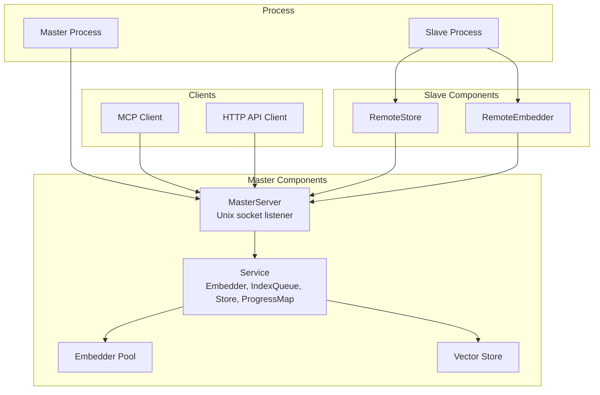
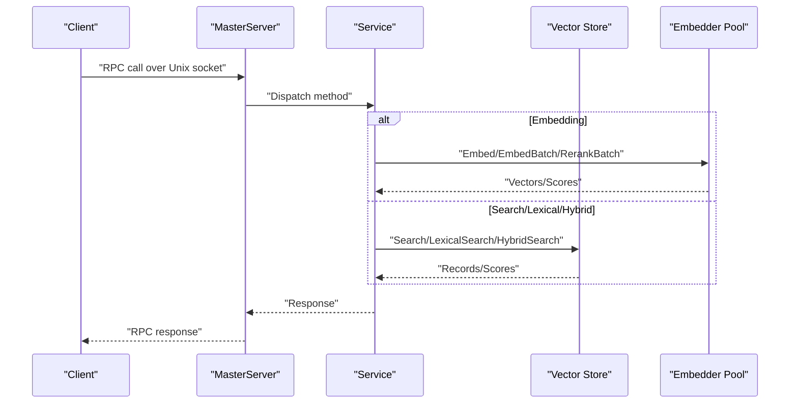
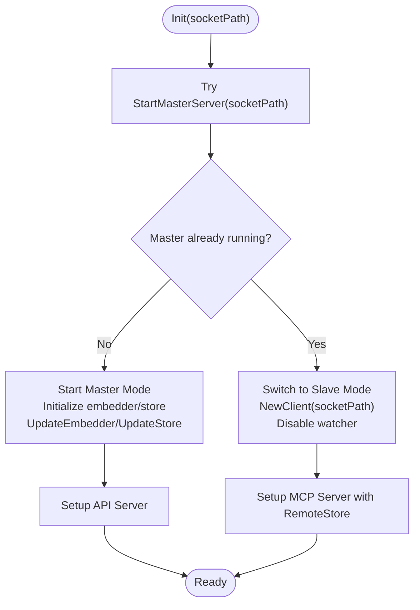
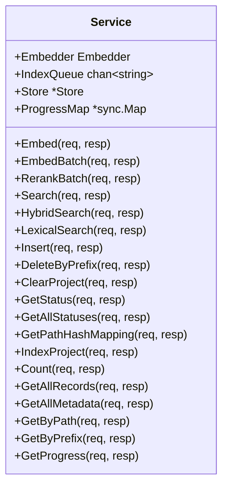
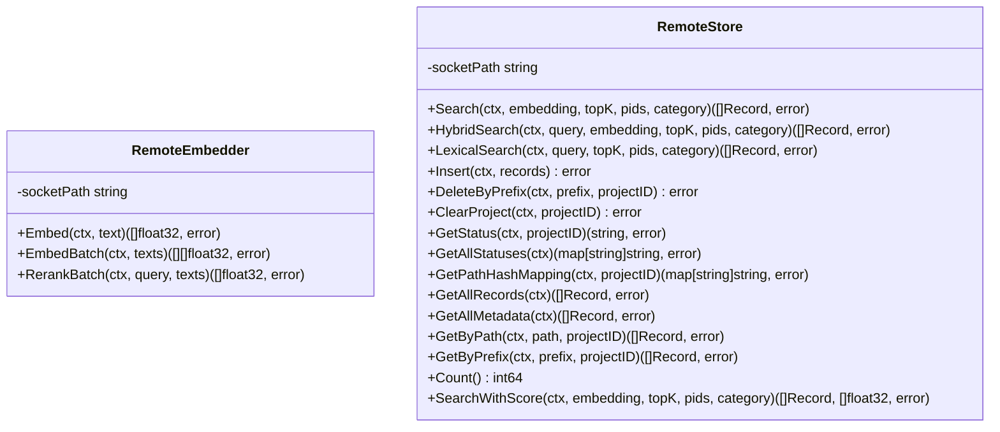
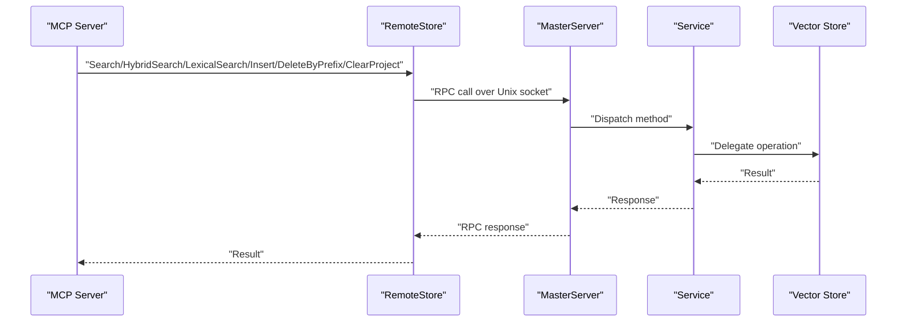
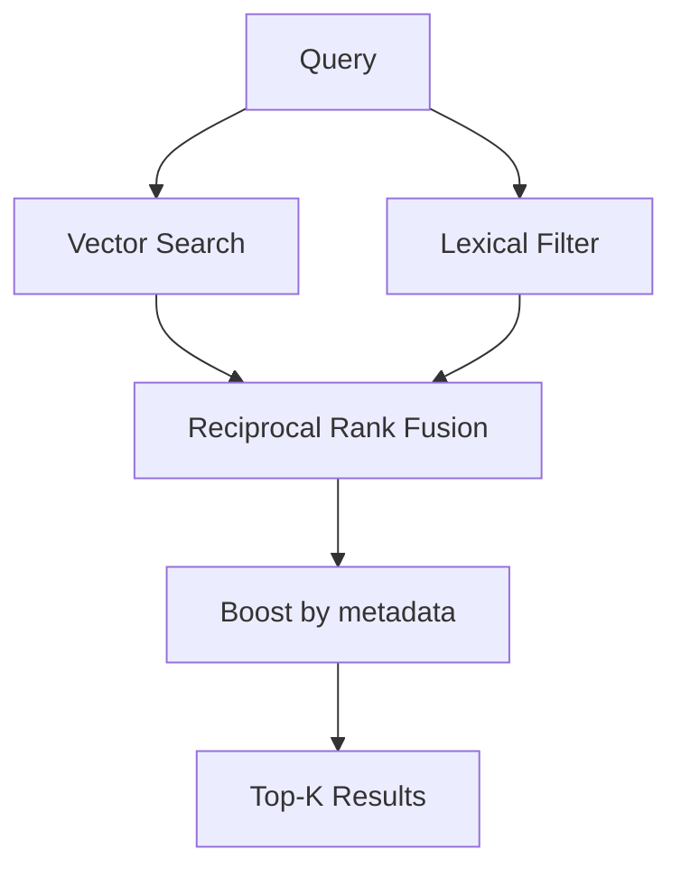
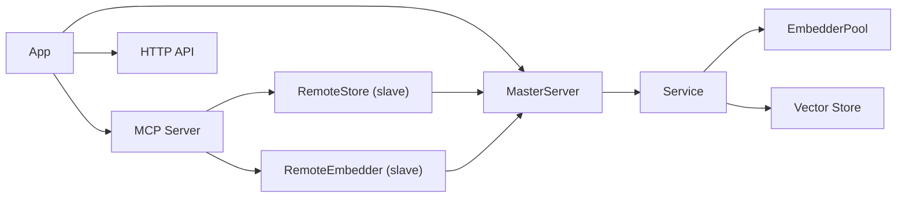

# Master-Slave Coordination and RPC Services

<cite>
**Referenced Files in This Document**
- [main.go](file://main.go)
- [daemon.go](file://internal/daemon/daemon.go)
- [server.go](file://internal/mcp/server.go)
- [store.go](file://internal/db/store.go)
- [resolver.go](file://internal/indexer/resolver.go)
- [config.go](file://internal/config/config.go)
- [worker.go](file://internal/worker/worker.go)
- [server.go](file://internal/api/server.go)
</cite>

## Table of Contents
1. [Introduction](#introduction)
2. [Project Structure](#project-structure)
3. [Core Components](#core-components)
4. [Architecture Overview](#architecture-overview)
5. [Detailed Component Analysis](#detailed-component-analysis)
6. [Dependency Analysis](#dependency-analysis)
7. [Performance Considerations](#performance-considerations)
8. [Troubleshooting Guide](#troubleshooting-guide)
9. [Conclusion](#conclusion)
10. [Appendices](#appendices)

## Introduction
This document explains the master-slave coordination system and RPC services in Vector MCP Go. It covers the Unix socket-based RPC communication between master and slave processes, the Service struct with its embedded embedder, index queue, and vector store components, and all RPC method implementations. It also documents the MasterServer lifecycle management, client connection handling, and service update mechanisms. Practical examples of RPC client usage, error handling patterns, timeout configurations, and connection management are included, along with remote embedder and remote store implementations that delegate operations to the master process.

## Project Structure
Vector MCP Go organizes the master-slave coordination around a small set of cohesive modules:
- Application bootstrap and lifecycle management
- Master RPC server and client
- MCP server and HTTP API server
- Vector database store and indexing utilities
- Configuration and worker components

**Diagram sources**
- [main.go:93-176](file://main.go#L93-L176)
- [daemon.go:333-399](file://internal/daemon/daemon.go#L333-L399)
- [daemon.go:440-474](file://internal/daemon/daemon.go#L440-L474)
- [daemon.go:503-597](file://internal/daemon/daemon.go#L503-L597)

**Section sources**
- [main.go:37-71](file://main.go#L37-L71)
- [daemon.go:17-23](file://internal/daemon/daemon.go#L17-L23)

## Core Components
- App orchestrates initialization, lifecycle, and resource management for both master and slave modes.
- MasterServer manages the Unix socket RPC server and exposes UpdateEmbedder and UpdateStore to dynamically change the running service.
- Service is the RPC endpoint that holds the embedder, index queue, vector store, and progress map.
- RemoteEmbedder and RemoteStore provide transparent delegation to the master for slaves.
- MCP Server integrates with the vector store and embedder to expose tools and resources.
- HTTP API Server provides streaming MCP transport and convenience endpoints.

**Section sources**
- [main.go:37-71](file://main.go#L37-L71)
- [daemon.go:327-399](file://internal/daemon/daemon.go#L327-L399)
- [daemon.go:440-474](file://internal/daemon/daemon.go#L440-L474)
- [daemon.go:503-597](file://internal/daemon/daemon.go#L503-L597)
- [server.go:66-84](file://internal/mcp/server.go#L66-L84)
- [server.go:150-163](file://internal/mcp/server.go#L150-L163)

## Architecture Overview
The system operates in two modes:
- Master mode: Starts the MasterServer, initializes the embedder pool and vector store, and serves RPC requests. Also starts the API server and background workers.
- Slave mode: Detects an existing master, connects via Unix socket, and uses RemoteEmbedder and RemoteStore to delegate operations to the master.

**Diagram sources**
- [daemon.go:112-137](file://internal/daemon/daemon.go#L112-L137)
- [daemon.go:149-184](file://internal/daemon/daemon.go#L149-L184)
- [daemon.go:503-597](file://internal/daemon/daemon.go#L503-L597)

## Detailed Component Analysis

### MasterServer Lifecycle and Service Updates
- Master detection: On startup, the application attempts to start a MasterServer. If a master is already running, it switches to slave mode.
- Unix socket lifecycle: The MasterServer binds to a Unix domain socket, accepts connections, and serves RPC requests concurrently.
- Service updates: UpdateEmbedder and UpdateStore allow changing the embedder or store while the server is running.

**Diagram sources**
- [main.go:93-176](file://main.go#L93-L176)
- [daemon.go:333-399](file://internal/daemon/daemon.go#L333-L399)

**Section sources**
- [main.go:93-176](file://main.go#L93-L176)
- [daemon.go:333-399](file://internal/daemon/daemon.go#L333-L399)

### Service Struct and RPC Methods
The Service struct aggregates:
- Embedder: Provides embeddings and reranking.
- IndexQueue: Receives paths to index.
- Store: Vector database operations.
- ProgressMap: Live indexing progress.

RPC methods include:
- Embed, EmbedBatch, RerankBatch
- Search, HybridSearch, LexicalSearch
- Insert, DeleteByPrefix, ClearProject
- GetStatus, GetAllStatuses, GetPathHashMapping
- IndexProject (enqueues indexing)
- Count, GetAllRecords, GetAllMetadata, GetByPath, GetByPrefix
- GetProgress

Each method validates that the store is initialized and delegates to the embedder or store accordingly.

**Diagram sources**
- [daemon.go:17-23](file://internal/daemon/daemon.go#L17-L23)
- [daemon.go:112-137](file://internal/daemon/daemon.go#L112-L137)
- [daemon.go:149-184](file://internal/daemon/daemon.go#L149-L184)
- [daemon.go:186-225](file://internal/daemon/daemon.go#L186-L225)
- [daemon.go:227-261](file://internal/daemon/daemon.go#L227-L261)
- [daemon.go:263-309](file://internal/daemon/daemon.go#L263-L309)
- [daemon.go:315-324](file://internal/daemon/daemon.go#L315-L324)

**Section sources**
- [daemon.go:17-23](file://internal/daemon/daemon.go#L17-L23)
- [daemon.go:112-137](file://internal/daemon/daemon.go#L112-L137)
- [daemon.go:149-184](file://internal/daemon/daemon.go#L149-L184)
- [daemon.go:186-225](file://internal/daemon/daemon.go#L186-L225)
- [daemon.go:227-261](file://internal/daemon/daemon.go#L227-L261)
- [daemon.go:263-309](file://internal/daemon/daemon.go#L263-L309)
- [daemon.go:315-324](file://internal/daemon/daemon.go#L315-L324)

### Remote Embedder and Remote Store
Slaves use RemoteEmbedder and RemoteStore to delegate operations to the master over Unix socket RPC:
- RemoteEmbedder: Embed, EmbedBatch, RerankBatch with timeouts and context cancellation.
- RemoteStore: Search, HybridSearch, LexicalSearch, Insert, DeleteByPrefix, ClearProject, GetStatus, GetAllStatuses, GetPathHashMapping, GetAllRecords, GetAllMetadata, GetByPath, GetByPrefix, Count, SearchWithScore.

**Diagram sources**
- [daemon.go:440-474](file://internal/daemon/daemon.go#L440-L474)
- [daemon.go:503-597](file://internal/daemon/daemon.go#L503-L597)

**Section sources**
- [daemon.go:440-474](file://internal/daemon/daemon.go#L440-L474)
- [daemon.go:503-597](file://internal/daemon/daemon.go#L503-L597)

### MCP Server Integration and Remote Store Usage
The MCP Server supports both local and remote stores. When running as a slave, it injects a RemoteStore so all search and data operations are delegated to the master.

**Diagram sources**
- [server.go:150-163](file://internal/mcp/server.go#L150-L163)
- [daemon.go:503-597](file://internal/daemon/daemon.go#L503-L597)

**Section sources**
- [server.go:150-163](file://internal/mcp/server.go#L150-L163)
- [main.go:164-168](file://main.go#L164-L168)

### Vector Store Operations
The vector store provides:
- Search, SearchWithScore
- HybridSearch (vector + lexical fusion)
- LexicalSearch (parallel filtering)
- Insert, DeleteByPrefix, ClearProject
- Status and mapping queries
- Metadata and record enumeration

**Diagram sources**
- [store.go:80-409](file://internal/db/store.go#L80-L409)
- [store.go:223-336](file://internal/db/store.go#L223-L336)
- [store.go:85-221](file://internal/db/store.go#L85-L221)

**Section sources**
- [store.go:80-409](file://internal/db/store.go#L80-L409)
- [store.go:223-336](file://internal/db/store.go#L223-L336)
- [store.go:85-221](file://internal/db/store.go#L85-L221)

### Configuration and Environment
Configuration supports:
- Paths for data, models, database
- Model names and reranker selection
- Watcher and live indexing toggles
- Embedder pool size
- API port
- Logging configuration

**Section sources**
- [config.go:30-130](file://internal/config/config.go#L30-L130)

### Background Indexing Worker
The IndexWorker consumes paths from the index queue and performs full codebase indexing with status reporting.

**Section sources**
- [worker.go:24-112](file://internal/worker/worker.go#L24-L112)

## Dependency Analysis
The master-slave RPC relies on:
- Unix domain sockets for IPC
- net/rpc for method dispatch
- EmbedderPool for concurrent embedding
- Chromem-backed vector store
- MCP server for tooling and resources
- HTTP API for streaming transport

**Diagram sources**
- [main.go:93-176](file://main.go#L93-L176)
- [daemon.go:333-399](file://internal/daemon/daemon.go#L333-L399)
- [server.go:150-163](file://internal/mcp/server.go#L150-L163)

**Section sources**
- [main.go:93-176](file://main.go#L93-L176)
- [daemon.go:333-399](file://internal/daemon/daemon.go#L333-L399)
- [server.go:150-163](file://internal/mcp/server.go#L150-L163)

## Performance Considerations
- Embedding concurrency: The embedder pool allows parallel embedding requests. Tune EmbedderPoolSize via configuration.
- Search fusion: HybridSearch uses reciprocal rank fusion with dynamic weights and metadata boosting to balance vector and lexical signals efficiently.
- Lexical filtering: Parallel filtering with CPU-aware chunking reduces latency for large datasets.
- Index queue: The index queue capacity is bounded; backpressure prevents overload.
- RPC timeouts: RemoteEmbedder applies explicit timeouts for Embed, EmbedBatch, and RerankBatch to avoid hanging operations.

[No sources needed since this section provides general guidance]

## Troubleshooting Guide
Common issues and resolutions:
- Master already running: If the Unix socket exists and another master is listening, the application switches to slave mode automatically. Verify the socket path and ensure only one master is running.
- Store not initialized: Many RPC methods return errors when the store is nil. Ensure the master initializes the store before serving RPC calls.
- RPC dial failures: RemoteEmbedder and RemoteStore wrap dial errors with context. Check socket accessibility and permissions.
- Embedding timeouts: RemoteEmbedder enforces timeouts for embedding operations. Increase model pool size or reduce batch sizes if timeouts occur frequently.
- Index queue full: IndexProject returns an error when the queue is full. Adjust queue capacity or reduce indexing frequency.

**Section sources**
- [main.go:93-108](file://main.go#L93-L108)
- [daemon.go:112-137](file://internal/daemon/daemon.go#L112-L137)
- [daemon.go:149-184](file://internal/daemon/daemon.go#L149-L184)
- [daemon.go:440-474](file://internal/daemon/daemon.go#L440-L474)
- [daemon.go:503-597](file://internal/daemon/daemon.go#L503-L597)

## Conclusion
Vector MCP Go’s master-slave architecture cleanly separates compute and storage concerns. The MasterServer exposes a focused RPC surface backed by an embedder pool and vector store, while slaves remain lightweight and delegate all heavy operations to the master. The MCP and HTTP servers integrate seamlessly with this model, enabling robust tooling and client connectivity.

[No sources needed since this section summarizes without analyzing specific files]

## Appendices

### RPC Method Reference
- Embed: Single text embedding
- EmbedBatch: Batch embedding
- RerankBatch: Cross-encoder scoring
- Search: Vector similarity search
- HybridSearch: Vector + lexical fusion
- LexicalSearch: Exact/text matching
- Insert: Persist records
- DeleteByPrefix: Remove by path prefix
- ClearProject: Wipe project index
- GetStatus, GetAllStatuses, GetPathHashMapping: Project metadata
- IndexProject: Enqueue path for indexing
- Count, GetAllRecords, GetAllMetadata, GetByPath, GetByPrefix: Store introspection
- GetProgress: Live indexing progress

**Section sources**
- [daemon.go:112-137](file://internal/daemon/daemon.go#L112-L137)
- [daemon.go:149-184](file://internal/daemon/daemon.go#L149-L184)
- [daemon.go:186-225](file://internal/daemon/daemon.go#L186-L225)
- [daemon.go:227-261](file://internal/daemon/daemon.go#L227-L261)
- [daemon.go:263-309](file://internal/daemon/daemon.go#L263-L309)
- [daemon.go:315-324](file://internal/daemon/daemon.go#L315-L324)

### Practical RPC Client Usage Patterns
- Dialing the master: Use a Unix socket client to call VectorDaemon methods.
- Embedding with timeouts: Wrap RPC calls with context deadlines to avoid blocking.
- Batch operations: Prefer EmbedBatch and RerankBatch for throughput.
- Delegation in slaves: Inject RemoteStore and RemoteEmbedder into the MCP server to route all operations to the master.

**Section sources**
- [daemon.go:410-437](file://internal/daemon/daemon.go#L410-L437)
- [daemon.go:440-474](file://internal/daemon/daemon.go#L440-L474)
- [daemon.go:503-597](file://internal/daemon/daemon.go#L503-L597)