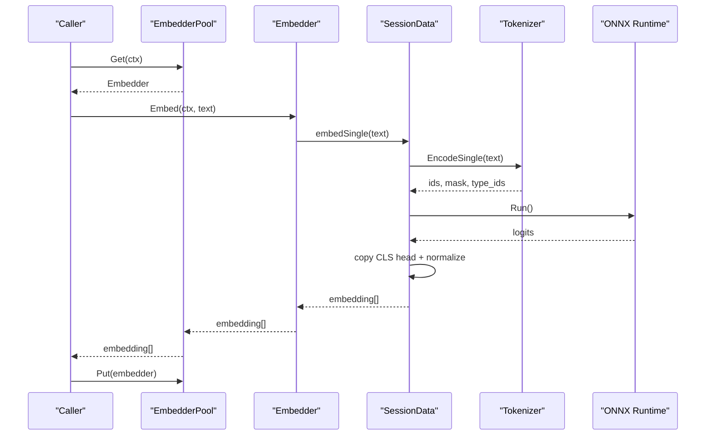
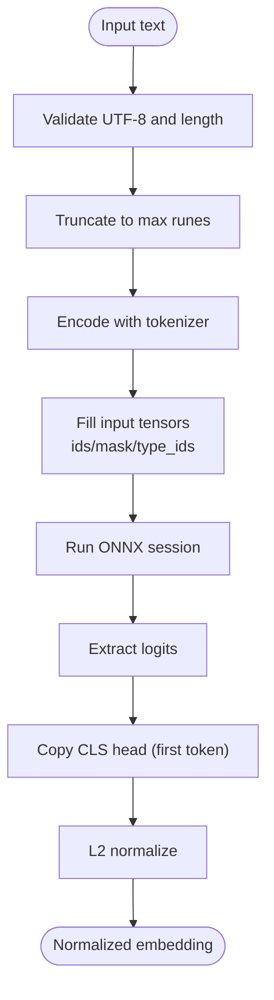
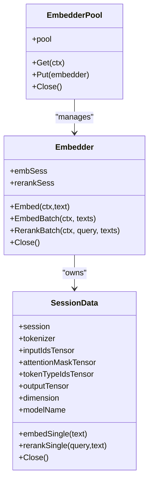
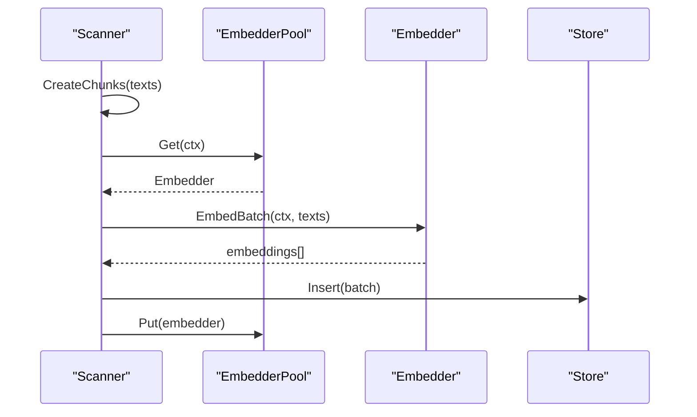
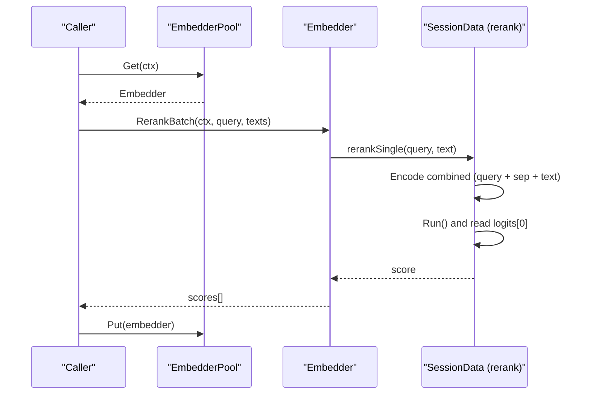
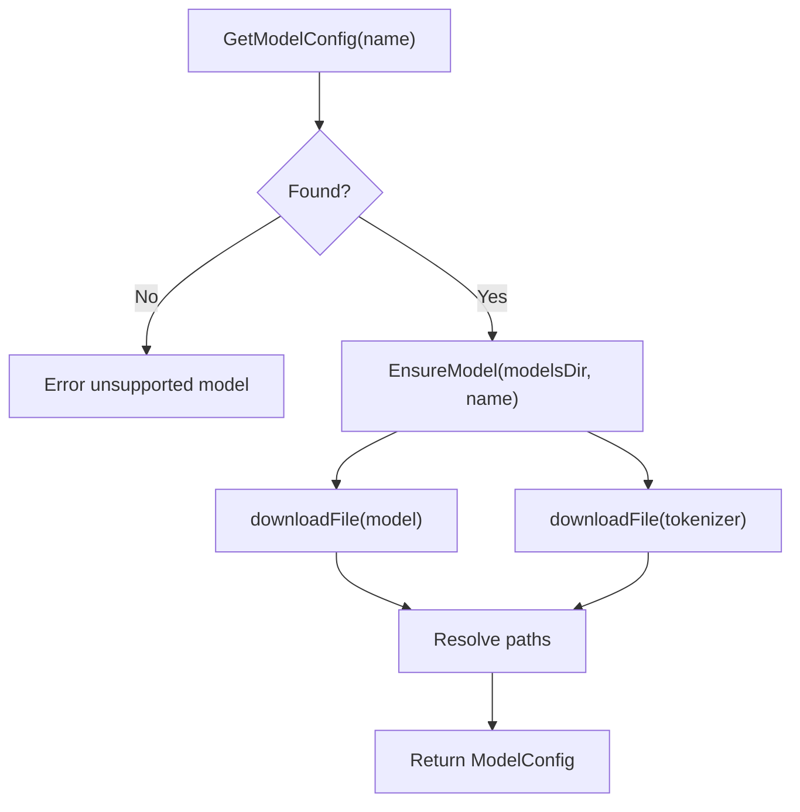
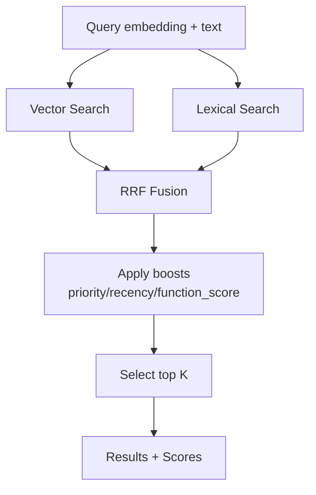
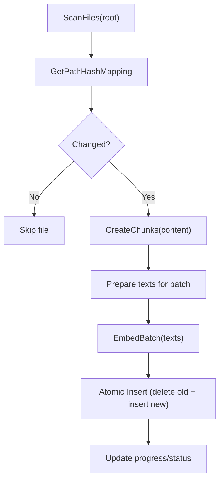
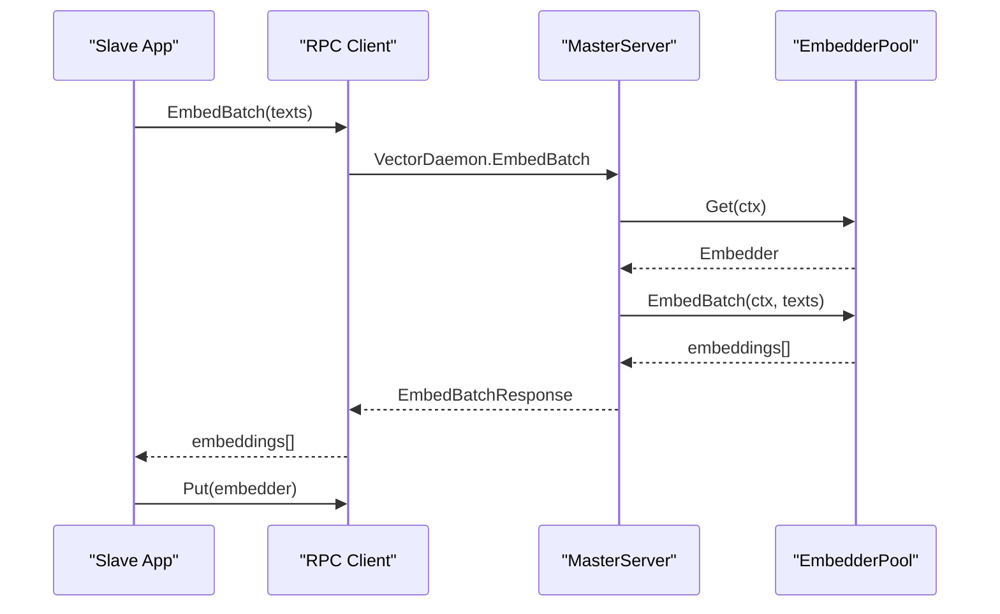
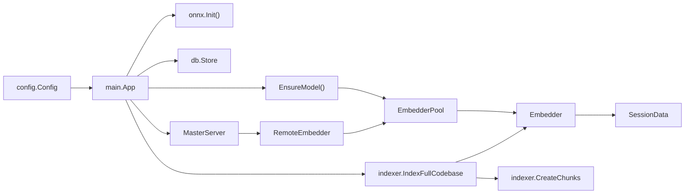

# Embedding Generation and Processing

<cite>
**Referenced Files in This Document**
- [session.go](file://internal/embedding/session.go)
- [downloader.go](file://internal/embedding/downloader.go)
- [onnx.go](file://internal/onnx/onnx.go)
- [store.go](file://internal/db/store.go)
- [scanner.go](file://internal/indexer/scanner.go)
- [chunker.go](file://internal/indexer/chunker.go)
- [config.go](file://internal/config/config.go)
- [daemon.go](file://internal/daemon/daemon.go)
- [worker.go](file://internal/worker/worker.go)
- [main.go](file://main.go)
- [mem_throttler.go](file://internal/system/mem_throttler.go)
</cite>

## Table of Contents
1. [Introduction](#introduction)
2. [Project Structure](#project-structure)
3. [Core Components](#core-components)
4. [Architecture Overview](#architecture-overview)
5. [Detailed Component Analysis](#detailed-component-analysis)
6. [Dependency Analysis](#dependency-analysis)
7. [Performance Considerations](#performance-considerations)
8. [Troubleshooting Guide](#troubleshooting-guide)
9. [Conclusion](#conclusion)
10. [Appendices](#appendices)

## Introduction
This document explains the embedding generation and processing system end-to-end, from raw text input to normalized vector output. It covers tokenization, model inference via ONNX Runtime, vector normalization, embedding sessions, batch processing, concurrent operations, reranking with cross-encoder models, and hybrid search. It also documents caching, memory optimization, performance tuning, and practical integration patterns.

## Project Structure
The embedding pipeline spans several modules:
- Embedding engine: tokenization, ONNX sessions, normalization, reranking
- Model downloader and configuration
- ONNX runtime initialization
- Vector storage and hybrid search
- Indexing pipeline with chunking and batching
- Daemon-based master/slave architecture for distributed embedding
- Worker and memory throttling for background indexing

```mermaid
graph TB
subgraph "Embedding Engine"
E1["Embedder<br/>SessionData"]
E2["EmbedderPool"]
end
subgraph "Model Management"
M1["ModelConfig<br/>Models presets"]
M2["EnsureModel<br/>downloadFile"]
end
subgraph "Runtime"
R1["ONNX Init<br/>SetSharedLibraryPath"]
end
subgraph "Storage"
S1["Store<br/>ChromaDB wrapper"]
end
subgraph "Indexing"
I1["Chunker<br/>tree-sitter + fallback"]
I2["Scanner<br/>IndexFullCodebase"]
end
subgraph "Daemon"
D1["MasterServer<br/>RPC Service"]
D2["RemoteEmbedder<br/>RPC Client"]
end
subgraph "System"
SYS1["MemThrottler"]
end
M2 --> E1
M1 --> M2
R1 --> E1
E2 --> E1
I1 --> I2
I2 --> S1
D1 <- --> D2
E2 -.-> D2
SYS1 -.-> I2
```

**Diagram sources**
- [session.go:18-174](file://internal/embedding/session.go#L18-L174)
- [downloader.go:11-124](file://internal/embedding/downloader.go#L11-L124)
- [onnx.go:13-42](file://internal/onnx/onnx.go#L13-L42)
- [store.go:19-664](file://internal/db/store.go#L19-L664)
- [chunker.go:43-101](file://internal/indexer/chunker.go#L43-L101)
- [scanner.go:67-191](file://internal/indexer/scanner.go#L67-L191)
- [daemon.go:327-390](file://internal/daemon/daemon.go#L327-L390)
- [daemon.go:439-487](file://internal/daemon/daemon.go#L439-L487)
- [mem_throttler.go:22-151](file://internal/system/mem_throttler.go#L22-L151)

**Section sources**
- [session.go:18-174](file://internal/embedding/session.go#L18-L174)
- [downloader.go:11-124](file://internal/embedding/downloader.go#L11-L124)
- [onnx.go:13-42](file://internal/onnx/onnx.go#L13-L42)
- [store.go:19-664](file://internal/db/store.go#L19-L664)
- [chunker.go:43-101](file://internal/indexer/chunker.go#L43-L101)
- [scanner.go:67-191](file://internal/indexer/scanner.go#L67-L191)
- [daemon.go:327-390](file://internal/daemon/daemon.go#L327-L390)
- [daemon.go:439-487](file://internal/daemon/daemon.go#L439-L487)
- [mem_throttler.go:22-151](file://internal/system/mem_throttler.go#L22-L151)

## Core Components
- Embedder and SessionData: manage tokenizer, ONNX tensors, model sessions, and inference
- EmbedderPool: concurrency-safe pool of embedders for parallel processing
- ModelConfig and downloader: model presets, resolution, and download logic
- ONNX initialization: environment setup and shared library discovery
- Store: vector database operations, hybrid search, and caching
- Chunker and Scanner: chunking code/docs and orchestrating embedding batches
- Daemon: master/slave RPC for distributed embedding and storage
- Worker: background indexing pipeline
- MemThrottler: memory-aware scheduling for heavy tasks

**Section sources**
- [session.go:29-85](file://internal/embedding/session.go#L29-L85)
- [downloader.go:11-95](file://internal/embedding/downloader.go#L11-L95)
- [onnx.go:13-42](file://internal/onnx/onnx.go#L13-L42)
- [store.go:19-664](file://internal/db/store.go#L19-L664)
- [chunker.go:22-101](file://internal/indexer/chunker.go#L22-L101)
- [scanner.go:51-65](file://internal/indexer/scanner.go#L51-L65)
- [daemon.go:17-50](file://internal/daemon/daemon.go#L17-L50)
- [worker.go:24-44](file://internal/worker/worker.go#L24-L44)
- [mem_throttler.go:21-103](file://internal/system/mem_throttler.go#L21-L103)

## Architecture Overview
The embedding pipeline integrates tokenization, ONNX inference, normalization, and optional reranking. It supports:
- Single and batch embedding
- Cross-encoder reranking
- Concurrent execution via a connection pool
- Master/slave RPC for distributed workloads
- Hybrid search combining vector and lexical results



**Diagram sources**
- [session.go:176-245](file://internal/embedding/session.go#L176-L245)
- [session.go:180-245](file://internal/embedding/session.go#L180-L245)

**Section sources**
- [session.go:176-245](file://internal/embedding/session.go#L176-L245)
- [daemon.go:439-487](file://internal/daemon/daemon.go#L439-L487)

## Detailed Component Analysis

### Embedding Pipeline: Tokenization, Inference, Normalization
- Tokenization: Uses a pre-trained tokenizer to encode text into ids, attention mask, and token type ids. Special handling for models without token_type_ids.
- Inference: ONNX AdvancedSession executes the model with prepared tensors. Output shape differs for embedding vs reranking.
- Pooling and normalization: Copies the CLS token representation and normalizes to unit vector for cosine similarity.



**Diagram sources**
- [session.go:180-245](file://internal/embedding/session.go#L180-L245)

**Section sources**
- [session.go:180-245](file://internal/embedding/session.go#L180-L245)

### Embedding Session Architecture and Pooling
- SessionData holds reusable tensors and model session for efficient inference.
- Embedder wraps embedding and optional reranking sessions.
- EmbedderPool provides a bounded channel of embedders for concurrent access with context-aware blocking.



**Diagram sources**
- [session.go:18-36](file://internal/embedding/session.go#L18-L36)

**Section sources**
- [session.go:29-85](file://internal/embedding/session.go#L29-L85)

### Batch Processing and Concurrency
- Embedder.EmbedBatch iterates over texts sequentially; fallback to per-item embedding on failure.
- Indexer.Scanner orchestrates parallel file processing with worker goroutines and batches records for insertion.
- EmbedderPool.Get/Put enables concurrent embedding requests without exceeding pool capacity.



**Diagram sources**
- [scanner.go:249-270](file://internal/indexer/scanner.go#L249-L270)
- [session.go:261-271](file://internal/embedding/session.go#L261-L271)
- [daemon.go:112-128](file://internal/daemon/daemon.go#L112-L128)

**Section sources**
- [scanner.go:249-270](file://internal/indexer/scanner.go#L249-L270)
- [session.go:261-271](file://internal/embedding/session.go#L261-L271)
- [daemon.go:112-128](file://internal/daemon/daemon.go#L112-L128)

### Reranking with Cross-Encoder Models
- Reranking combines query and candidate text with a separator token, encodes jointly, and returns a scalar relevance score.
- Reranker is optional; Embedder.RerankBatch validates presence before inference.



**Diagram sources**
- [session.go:300-366](file://internal/embedding/session.go#L300-L366)

**Section sources**
- [session.go:300-366](file://internal/embedding/session.go#L300-L366)

### Model Downloading and Configuration
- ModelConfig defines model metadata and dimensionality.
- EnsureModel downloads model and tokenizer assets, resolving paths for downstream usage.
- Supported presets include embedding and reranker models.



**Diagram sources**
- [downloader.go:88-124](file://internal/embedding/downloader.go#L88-L124)

**Section sources**
- [downloader.go:11-95](file://internal/embedding/downloader.go#L11-L95)
- [downloader.go:88-124](file://internal/embedding/downloader.go#L88-L124)

### ONNX Runtime Initialization
- Initializes environment and discovers the ONNX shared library path across multiple locations.
- Required before creating embedding sessions.

**Section sources**
- [onnx.go:13-42](file://internal/onnx/onnx.go#L13-L42)

### Vector Storage and Hybrid Search
- Store wraps ChromemDB, providing insert, vector search, lexical search, and hybrid fusion.
- HybridSearch uses Reciprocal Rank Fusion (RRF) with dynamic weighting and boost factors.



**Diagram sources**
- [store.go:223-336](file://internal/db/store.go#L223-L336)

**Section sources**
- [store.go:66-64](file://internal/db/store.go#L66-L64)
- [store.go:223-336](file://internal/db/store.go#L223-L336)

### Indexing Pipeline: Chunking and Batching
- Chunker splits code/docs into semantically meaningful chunks using Tree-sitter or fallback strategy, enriching context.
- Scanner walks the filesystem, computes hashes, skips unchanged files, and processes new/changed files in parallel.
- Batches embeddings and inserts records atomically to avoid ghost-chunks.



**Diagram sources**
- [scanner.go:67-191](file://internal/indexer/scanner.go#L67-L191)
- [chunker.go:43-101](file://internal/indexer/chunker.go#L43-L101)

**Section sources**
- [scanner.go:67-191](file://internal/indexer/scanner.go#L67-L191)
- [chunker.go:43-101](file://internal/indexer/chunker.go#L43-L101)

### Master/Slave RPC and Distributed Embedding
- MasterServer exposes RPC methods for embedding, reranking, indexing, and storage operations.
- RemoteEmbedder delegates calls to the master over Unix domain sockets with timeouts and context handling.
- Workers receive paths from a queue and index projects in the background.



**Diagram sources**
- [daemon.go:439-487](file://internal/daemon/daemon.go#L439-L487)
- [daemon.go:327-390](file://internal/daemon/daemon.go#L327-L390)

**Section sources**
- [daemon.go:439-487](file://internal/daemon/daemon.go#L439-L487)
- [daemon.go:327-390](file://internal/daemon/daemon.go#L327-L390)
- [worker.go:47-112](file://internal/worker/worker.go#L47-L112)

### Memory Throttling and Background Operations
- MemThrottler monitors system memory and advises when to throttle or pause heavy tasks.
- Used by LSP and indexing workers to avoid system overload.

**Section sources**
- [mem_throttler.go:21-103](file://internal/system/mem_throttler.go#L21-L103)

## Dependency Analysis
- Embedding depends on tokenizer and ONNX runtime; models and tokenizers are downloaded and cached locally.
- Indexer depends on Embedder interface; Scanner orchestrates embedding and storage.
- Daemon provides remote Embedder and Store implementations for slave nodes.
- Main coordinates initialization, embedding pool creation, and server startup.



**Diagram sources**
- [config.go:13-130](file://internal/config/config.go#L13-L130)
- [main.go:93-176](file://main.go#L93-L176)
- [onnx.go:13-42](file://internal/onnx/onnx.go#L13-L42)
- [downloader.go:88-124](file://internal/embedding/downloader.go#L88-L124)
- [session.go:38-65](file://internal/embedding/session.go#L38-L65)
- [scanner.go:67-191](file://internal/indexer/scanner.go#L67-L191)
- [chunker.go:43-101](file://internal/indexer/chunker.go#L43-L101)
- [daemon.go:327-390](file://internal/daemon/daemon.go#L327-L390)

**Section sources**
- [config.go:13-130](file://internal/config/config.go#L13-L130)
- [main.go:93-176](file://main.go#L93-L176)
- [onnx.go:13-42](file://internal/onnx/onnx.go#L13-L42)
- [downloader.go:88-124](file://internal/embedding/downloader.go#L88-L124)
- [session.go:38-65](file://internal/embedding/session.go#L38-L65)
- [scanner.go:67-191](file://internal/indexer/scanner.go#L67-L191)
- [chunker.go:43-101](file://internal/indexer/chunker.go#L43-L101)
- [daemon.go:327-390](file://internal/daemon/daemon.go#L327-L390)

## Performance Considerations
- Pool sizing: Tune EmbedderPoolSize to match CPU cores and available VRAM. Larger pools increase concurrency but raise memory usage.
- Batch embedding: Prefer batch APIs for throughput; fallback to sequential on errors.
- Model choice: Higher-dimensional models improve recall but cost more memory and compute.
- Hybrid search: Use RRF weights and boost factors judiciously to balance lexical and vector signals.
- Memory throttling: Enable MemThrottler to avoid swapping during heavy indexing.
- Disk I/O: Batch inserts to reduce write amplification; ensure SSD-backed data directories.

[No sources needed since this section provides general guidance]

## Troubleshooting Guide
- Tokenizer panics: Recovered and reported as tokenizer panic; verify input encoding and length limits.
- Empty or invalid UTF-8: Validation returns explicit errors; sanitize inputs.
- Model/tokenizer missing: Ensure EnsureModel succeeded and paths exist.
- ONNX initialization failures: Verify ONNX shared library path and permissions.
- Embedding timeouts (RPC): RemoteEmbedder applies timeouts; adjust if latency is expected.
- Dimension mismatch: Store probes for vector length consistency; switch models carefully and rebuild DB.
- Stale records: Scanner deletes old chunks before inserting new ones; ensure atomic updates.

**Section sources**
- [session.go:180-202](file://internal/embedding/session.go#L180-L202)
- [session.go:230-232](file://internal/embedding/session.go#L230-L232)
- [onnx.go:38-42](file://internal/onnx/onnx.go#L38-L42)
- [daemon.go:463-473](file://internal/daemon/daemon.go#L463-L473)
- [store.go:51-61](file://internal/db/store.go#L51-L61)
- [scanner.go:160-166](file://internal/indexer/scanner.go#L160-L166)

## Conclusion
The embedding system provides a robust, concurrent pipeline for generating normalized vectors from text, with optional reranking and hybrid search. It scales from single-node to distributed setups via RPC, integrates seamlessly with vector storage, and offers practical controls for memory and performance. By tuning pool sizes, batching strategies, and model choices, teams can optimize for speed, accuracy, and resource constraints.

[No sources needed since this section summarizes without analyzing specific files]

## Appendices

### Practical Examples

- Generate a single embedding:
  - Steps: Initialize ONNX, ensure model, create EmbedderPool, acquire Embedder, call Embed, release Embedder.
  - References: [onnx.go:13-42](file://internal/onnx/onnx.go#L13-L42), [downloader.go:88-124](file://internal/embedding/downloader.go#L88-L124), [session.go:38-65](file://internal/embedding/session.go#L38-L65), [session.go:176-178](file://internal/embedding/session.go#L176-L178)

- Batch embedding for indexed chunks:
  - Steps: Scanner prepares texts, EmbedderPool.Get, EmbedBatch, Store.Insert, Pool.Put.
  - References: [scanner.go:249-270](file://internal/indexer/scanner.go#L249-L270), [session.go:261-271](file://internal/embedding/session.go#L261-L271), [daemon.go:112-128](file://internal/daemon/daemon.go#L112-L128)

- Rerank candidates:
  - Steps: Ensure reranker model, Embedder.RerankBatch, sort by scores.
  - References: [downloader.go:39-59](file://internal/embedding/downloader.go#L39-L59), [session.go:300-314](file://internal/embedding/session.go#L300-L314)

- Distributed embedding (slave to master):
  - Steps: RemoteEmbedder connects to master, performs RPC calls with timeouts.
  - References: [daemon.go:439-487](file://internal/daemon/daemon.go#L439-L487), [daemon.go:623-647](file://internal/daemon/daemon.go#L623-L647)

### Environment Variables and Configuration
- DATA_DIR, MODELS_DIR, DB_PATH, LOG_PATH: Paths for data, models, database, and logs.
- MODEL_NAME, RERANKER_MODEL_NAME: Names of embedding and reranker models.
- HF_TOKEN: Optional token for model downloads.
- DISABLE_FILE_WATCHER, ENABLE_LIVE_INDEXING: Control indexing behavior.
- EMBEDDER_POOL_SIZE: Number of concurrent embedders.
- API_PORT: Port for API server (master mode).

**Section sources**
- [config.go:30-130](file://internal/config/config.go#L30-L130)