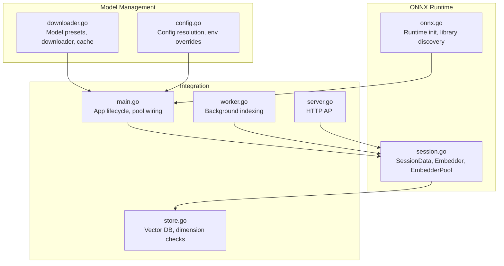
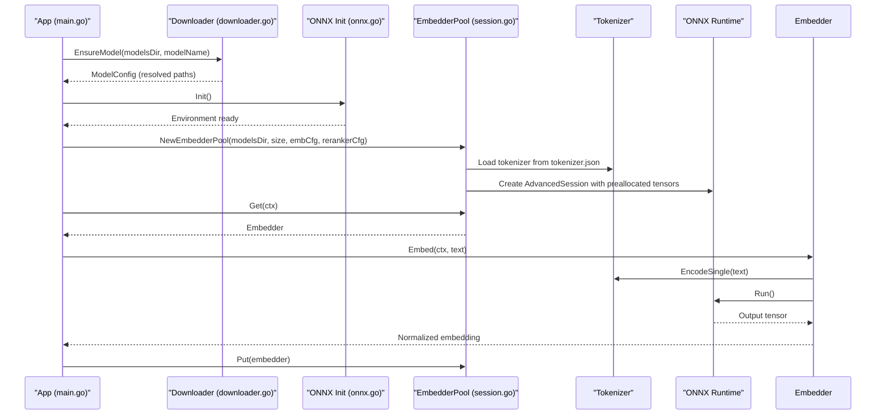
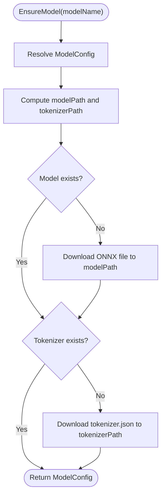
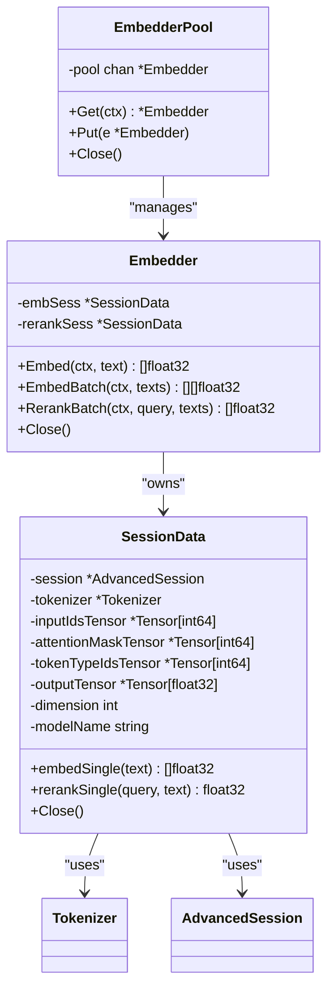
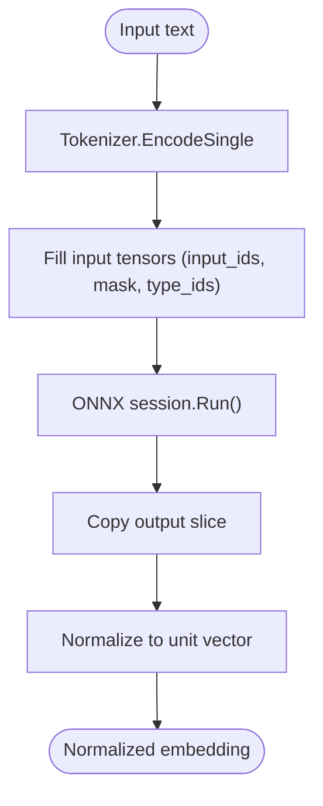
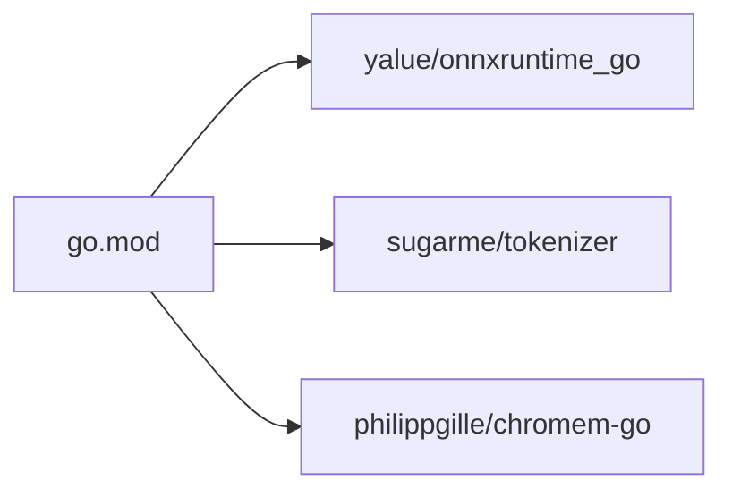

# Embedding and Model Management

<cite>
**Referenced Files in This Document**
- [main.go](file://main.go)
- [downloader.go](file://internal/embedding/downloader.go)
- [session.go](file://internal/embedding/session.go)
- [onnx.go](file://internal/onnx/onnx.go)
- [config.go](file://internal/config/config.go)
- [store.go](file://internal/db/store.go)
- [mem_throttler.go](file://internal/system/mem_throttler.go)
- [worker.go](file://internal/worker/worker.go)
- [server.go](file://internal/api/server.go)
- [resolver.go](file://internal/indexer/resolver.go)
- [scanner.go](file://internal/indexer/scanner.go)
- [go.mod](file://go.mod)
</cite>

## Table of Contents
1. [Introduction](#introduction)
2. [Project Structure](#project-structure)
3. [Core Components](#core-components)
4. [Architecture Overview](#architecture-overview)
5. [Detailed Component Analysis](#detailed-component-analysis)
6. [Dependency Analysis](#dependency-analysis)
7. [Performance Considerations](#performance-considerations)
8. [Troubleshooting Guide](#troubleshooting-guide)
9. [Conclusion](#conclusion)
10. [Appendices](#appendices)

## Introduction
This document explains the embedding and model management system, focusing on ONNX Runtime integration, model loading and initialization, and the end-to-end embedding generation pipeline. It covers the bge-m3 model configuration, quantization options, performance characteristics, model downloader functionality, cache management, version control, memory optimization strategies, batch processing, concurrent operations, session lifecycle, resource cleanup, error handling, troubleshooting, performance tuning, hardware compatibility, and guidance for integrating custom models and alternative embedding providers.

## Project Structure
The embedding subsystem is organized around three primary areas:
- Model management and downloading: responsible for resolving model presets, ensuring local availability, and caching artifacts.
- ONNX Runtime integration: initializes the runtime environment and loads models with preallocated tensors.
- Embedding pipeline: tokenization, tensor preparation, inference, normalization, and optional reranking.

**Diagram sources**
- [downloader.go:1-158](file://internal/embedding/downloader.go#L1-L158)
- [onnx.go:1-44](file://internal/onnx/onnx.go#L1-L44)
- [session.go:1-367](file://internal/embedding/session.go#L1-L367)
- [config.go:1-139](file://internal/config/config.go#L1-L139)
- [main.go:93-176](file://main.go#L93-L176)
- [worker.go:1-112](file://internal/worker/worker.go#L1-L112)
- [server.go:1-139](file://internal/api/server.go#L1-L139)
- [store.go:1-664](file://internal/db/store.go#L1-L664)

**Section sources**
- [main.go:93-176](file://main.go#L93-L176)
- [downloader.go:1-158](file://internal/embedding/downloader.go#L1-L158)
- [onnx.go:1-44](file://internal/onnx/onnx.go#L1-L44)
- [session.go:1-367](file://internal/embedding/session.go#L1-L367)
- [config.go:1-139](file://internal/config/config.go#L1-L139)
- [store.go:1-664](file://internal/db/store.go#L1-L664)
- [worker.go:1-112](file://internal/worker/worker.go#L1-L112)
- [server.go:1-139](file://internal/api/server.go#L1-L139)

## Core Components
- Model presets and downloader: central registry of supported models with URLs, filenames, and dimensions; downloads artifacts if missing and stores them under the models directory.
- ONNX Runtime initializer: discovers and loads the native shared library, then initializes the environment.
- Embedding session and pool: maintains reusable tokenizers and preallocated tensors; supports concurrent embedding and optional reranking.
- Application lifecycle: orchestrates model ensurement, pool creation, and integration with the vector store and API servers.
- Vector store integration: validates dimensions and provides hybrid search and lexical fallback.

**Section sources**
- [downloader.go:19-86](file://internal/embedding/downloader.go#L19-L86)
- [onnx.go:12-43](file://internal/onnx/onnx.go#L12-L43)
- [session.go:29-85](file://internal/embedding/session.go#L29-L85)
- [main.go:112-139](file://main.go#L112-L139)
- [store.go:35-64](file://internal/db/store.go#L35-L64)

## Architecture Overview
The embedding pipeline integrates model downloading, ONNX initialization, tokenization, tensor preparation, inference, normalization, and optional reranking. The system supports concurrent operations via an embedder pool and provides robust error handling and resource cleanup.

**Diagram sources**
- [main.go:112-139](file://main.go#L112-L139)
- [downloader.go:97-124](file://internal/embedding/downloader.go#L97-L124)
- [onnx.go:13-42](file://internal/onnx/onnx.go#L13-L42)
- [session.go:38-64](file://internal/embedding/session.go#L38-L64)
- [session.go:99-173](file://internal/embedding/session.go#L99-L173)
- [session.go:176-244](file://internal/embedding/session.go#L176-L244)

## Detailed Component Analysis

### Model Presets and Downloader
- Model presets define ONNX and tokenizer URLs, filenames, and dimensions. The downloader resolves a preset by name, ensures local presence, and updates the tokenizer path for later use.
- Download flow:
  - Verify model file existence; if missing, download from the configured URL to a deterministic filename under the models directory.
  - Verify tokenizer existence; if missing, download tokenizer.json to the same directory.
  - Atomic download strategy writes to a temporary file then renames to the destination to avoid partial files.
- Supported models include variants of bge-m3, bge-small, bge-base, cross-encoder rerankers, and others. Dimensions vary by model; reranker models are marked accordingly.

**Diagram sources**
- [downloader.go:88-124](file://internal/embedding/downloader.go#L88-L124)
- [downloader.go:126-157](file://internal/embedding/downloader.go#L126-L157)

**Section sources**
- [downloader.go:19-86](file://internal/embedding/downloader.go#L19-L86)
- [downloader.go:88-124](file://internal/embedding/downloader.go#L88-L124)
- [downloader.go:126-157](file://internal/embedding/downloader.go#L126-L157)

### ONNX Runtime Initialization
- On Linux, the initializer attempts multiple locations to discover the ONNX shared library:
  - Current working directory
  - Executable directory
  - User home-local installation path
- After setting the library path, it initializes the environment and returns an error if initialization fails.
- This ensures the runtime is available before creating sessions.

**Section sources**
- [onnx.go:12-43](file://internal/onnx/onnx.go#L12-L43)

### Embedding Session Lifecycle and Pool
- EmbedderPool:
  - Creates a bounded channel of Embedder instances.
  - Initializes embedding and optional reranker sessions per worker.
  - Provides Get/Put semantics for concurrency and Close for cleanup.
- SessionData:
  - Loads tokenizer from tokenizer.json.
  - Preallocates tensors for input_ids, attention_mask, token_type_ids, and output.
  - Handles model-specific input node selection (e.g., bge-m3 omits token_type_ids).
  - Supports reranker sessions with different output nodes.
- Embedder:
  - Single text embedding: tokenization, tensor fill, run, copy slice, normalization.
  - Batch embedding: sequential calls to Embed.
  - Reranking: concatenates query and text, runs reranker, returns score.
- Resource cleanup:
  - Embedder.Close and SessionData.Close destroy sessions and tensors.

**Diagram sources**
- [session.go:29-85](file://internal/embedding/session.go#L29-L85)
- [session.go:87-173](file://internal/embedding/session.go#L87-L173)
- [session.go:176-244](file://internal/embedding/session.go#L176-L244)
- [session.go:300-366](file://internal/embedding/session.go#L300-L366)

**Section sources**
- [session.go:29-85](file://internal/embedding/session.go#L29-L85)
- [session.go:87-173](file://internal/embedding/session.go#L87-L173)
- [session.go:176-244](file://internal/embedding/session.go#L176-L244)
- [session.go:273-298](file://internal/embedding/session.go#L273-L298)
- [session.go:300-366](file://internal/embedding/session.go#L300-L366)

### bge-m3 Model Configuration and Quantization
- Preset configuration:
  - Model name: "Xenova/bge-m3"
  - ONNX URL: quantized model artifact
  - Tokenizer URL: tokenizer.json
  - Filename: bge-m3-q4.onnx
  - Dimension: 1024
- Quantization:
  - The model is quantized (q4/int8 variants are also supported in presets), reducing memory footprint and improving throughput on CPU.
- Tokenization and inference:
  - Tokenizer is loaded from tokenizer.json.
  - For bge-m3, token_type_ids input is omitted; tensors are filled up to MaxSeqLength.
  - Output is copied and normalized for cosine similarity.

**Section sources**
- [downloader.go:21-26](file://internal/embedding/downloader.go#L21-L26)
- [session.go:147-150](file://internal/embedding/session.go#L147-L150)
- [session.go:237-244](file://internal/embedding/session.go#L237-L244)

### Model Downloader, Cache Management, and Version Control
- Cache management:
  - Ensures model and tokenizer files exist locally under modelsDir.
  - Uses deterministic filenames per preset to avoid conflicts.
- Version control:
  - Models are pinned by URL and filename; switching models changes the cache layout and requires DB dimension alignment.
- Atomic downloads:
  - Temporary files are written first, then renamed to the final destination to avoid partial artifacts.

**Section sources**
- [downloader.go:97-124](file://internal/embedding/downloader.go#L97-L124)
- [downloader.go:126-157](file://internal/embedding/downloader.go#L126-L157)

### Memory Optimization Strategies
- Preallocated tensors:
  - Input and output tensors are allocated once per session to reduce GC pressure.
- Dimension-aware normalization:
  - Embeddings are normalized to unit vectors to improve cosine similarity accuracy.
- Memory throttling:
  - A memory throttler monitors system memory and can influence decisions for heavy tasks (e.g., LSP startup).

**Section sources**
- [session.go:104-140](file://internal/embedding/session.go#L104-L140)
- [session.go:247-258](file://internal/embedding/session.go#L247-L258)
- [mem_throttler.go:21-103](file://internal/system/mem_throttler.go#L21-L103)

### Batch Processing and Concurrent Operations
- EmbedderPool:
  - Bounded channel of embedders enables concurrent embedding requests.
  - Get/Put semantics return embedders to the pool after use.
- Batch embedding:
  - Embedder.EmbedBatch iterates over texts sequentially; fallback to single embedding on failure.
- Background indexing:
  - Worker processes paths concurrently and uses the embedder pool for embeddings.

**Section sources**
- [session.go:38-85](file://internal/embedding/session.go#L38-L85)
- [session.go:261-271](file://internal/embedding/session.go#L261-L271)
- [worker.go:47-112](file://internal/worker/worker.go#L47-L112)

### Embedding Generation Pipeline
- Tokenization:
  - Encodes single text with special tokens; handles attention masks and type ids.
- Tensor preparation:
  - Fills input tensors up to MaxSeqLength; pads unused positions with zeros.
- Inference:
  - Runs the ONNX session and reads output tensor.
- Post-processing:
  - Copies embedding slice and normalizes to unit vector.

**Diagram sources**
- [session.go:199-244](file://internal/embedding/session.go#L199-L244)

**Section sources**
- [session.go:176-244](file://internal/embedding/session.go#L176-L244)

### Reranking Workflow
- Reranker sessions are optional and created when a reranker model is configured.
- Reranking combines query and candidate text, encodes, runs the reranker, and returns a score.

**Section sources**
- [session.go:300-366](file://internal/embedding/session.go#L300-L366)

### Vector Store Integration and Dimension Validation
- The vector store connects to a persistent database and validates dimension compatibility.
- If a dimension mismatch is detected, it instructs the user to clear the database and restart.

**Section sources**
- [store.go:35-64](file://internal/db/store.go#L35-L64)

### Application Lifecycle and Integration
- App initialization:
  - Initializes ONNX, ensures models, computes dimension, optionally ensures reranker, creates embedder pool, wires to MCP and API servers.
- API and MCP:
  - HTTP API server exposes health, search, context, and tool endpoints.
  - MCP server integrates embedding for semantic search and project context.

**Section sources**
- [main.go:93-176](file://main.go#L93-L176)
- [server.go:33-109](file://internal/api/server.go#L33-L109)

## Dependency Analysis
External dependencies relevant to embedding and model management:
- ONNX Runtime bindings for Go
- Tokenizer library for preprocessing
- Chromem for vector storage

**Diagram sources**
- [go.mod:14-15](file://go.mod#L14-L15)
- [go.mod:10](file://go.mod#L10)
- [go.mod:16](file://go.mod#L16)

**Section sources**
- [go.mod:14-16](file://go.mod#L14-L16)

## Performance Considerations
- Quantized models:
  - Prefer quantized variants (e.g., q4) for reduced memory and improved CPU throughput.
- Pool sizing:
  - Tune EmbedderPoolSize according to CPU cores and workload concurrency.
- Batch vs. single:
  - Use EmbedBatch when possible; the system falls back to sequential embedding on failure.
- Dimension checks:
  - Switching models requires clearing the vector database to avoid dimension mismatches.
- Memory throttling:
  - Use the memory throttler to avoid overcommitting during heavy operations.

[No sources needed since this section provides general guidance]

## Troubleshooting Guide
- ONNX initialization failures:
  - Verify ONNX shared library path discovery and environment initialization.
- Model or tokenizer not found:
  - Ensure EnsureModel ran successfully and files exist under modelsDir.
- Dimension mismatch:
  - Clear the vector database when switching models to align dimensions.
- Batch embedding errors:
  - The system falls back to single embedding; investigate tokenizer or runtime errors.
- Memory pressure:
  - Monitor system memory and adjust pool size or throttle operations.

**Section sources**
- [onnx.go:38-42](file://internal/onnx/onnx.go#L38-L42)
- [downloader.go:92-97](file://internal/embedding/downloader.go#L92-L97)
- [store.go:52-61](file://internal/db/store.go#L52-L61)
- [scanner.go:256-269](file://internal/indexer/scanner.go#L256-L269)
- [mem_throttler.go:87-103](file://internal/system/mem_throttler.go#L87-L103)

## Conclusion
The embedding and model management system provides a robust, concurrent pipeline for generating normalized embeddings using quantized ONNX models. It integrates model downloading, ONNX initialization, tokenization, inference, and normalization, while offering optional reranking and dimension-aware vector storage. With memory optimization, batch processing, and graceful error handling, it supports scalable deployment across diverse hardware configurations.

[No sources needed since this section summarizes without analyzing specific files]

## Appendices

### Model Configuration Reference
- bge-m3 preset:
  - Name: "Xenova/bge-m3"
  - Filename: bge-m3-q4.onnx
  - Dimension: 1024
  - Tokenizer: tokenizer.json
- Other presets include bge-small, bge-base, and multiple rerankers with varying quantization and filenames.

**Section sources**
- [downloader.go:21-26](file://internal/embedding/downloader.go#L21-L26)
- [downloader.go:19-86](file://internal/embedding/downloader.go#L19-L86)

### Environment Variables and Configuration
- Data directory, models directory, database path, model names, reranker model name, pool size, API port, and logging are configurable via environment variables and defaults.

**Section sources**
- [config.go:30-130](file://internal/config/config.go#L30-L130)

### Custom Model Integration
- To integrate a custom model:
  - Add a new preset with ONNX and tokenizer URLs, filename, and dimension.
  - Ensure the model and tokenizer are downloaded and placed under modelsDir.
  - Confirm the vector database dimension matches the new model.
  - Optionally configure reranker if needed.

**Section sources**
- [downloader.go:19-86](file://internal/embedding/downloader.go#L19-L86)
- [store.go:52-61](file://internal/db/store.go#L52-L61)

### Alternative Embedding Providers
- The system is designed around ONNX Runtime and tokenizer libraries. Integrating alternative providers would require adapting the tokenization and inference steps while maintaining the same embedding interface and normalization behavior.

[No sources needed since this section provides general guidance]