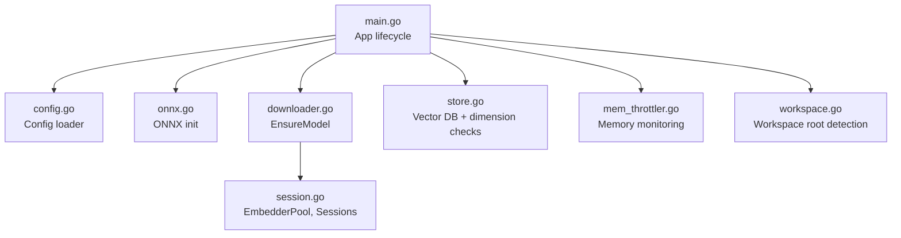
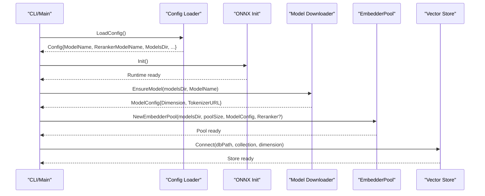
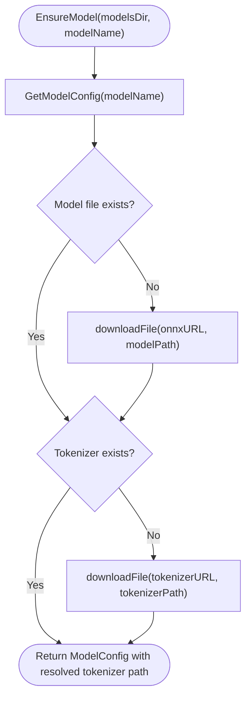
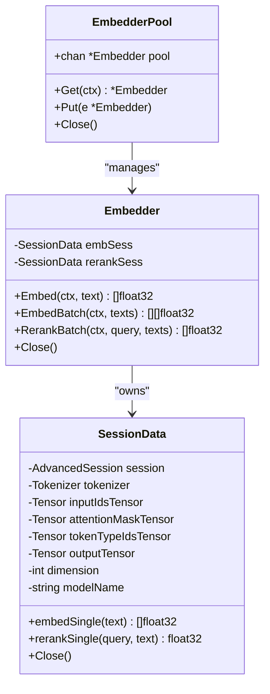
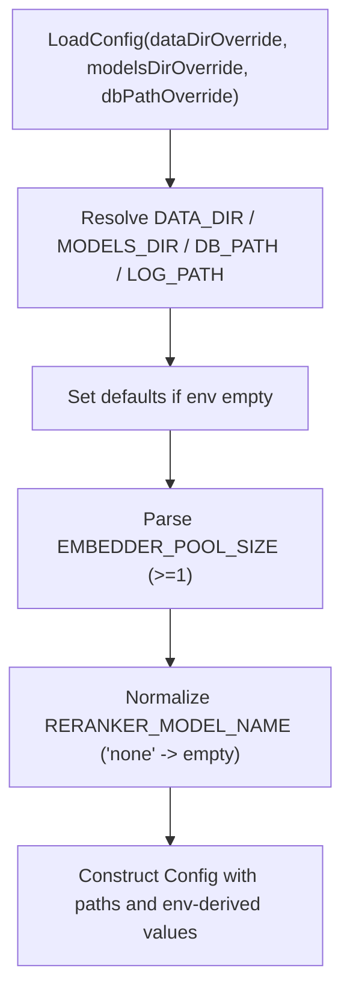
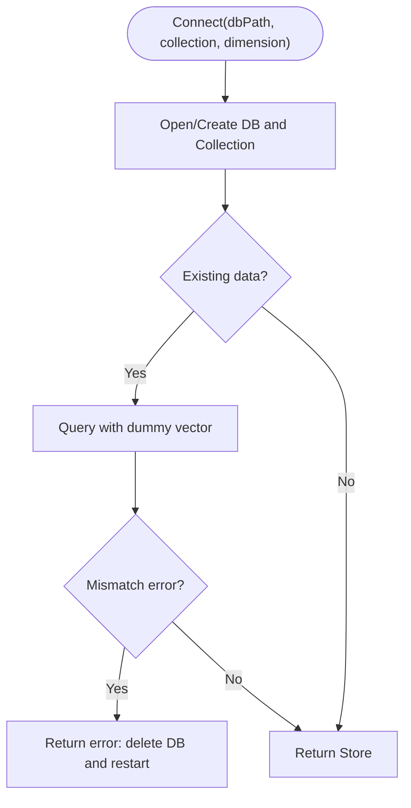
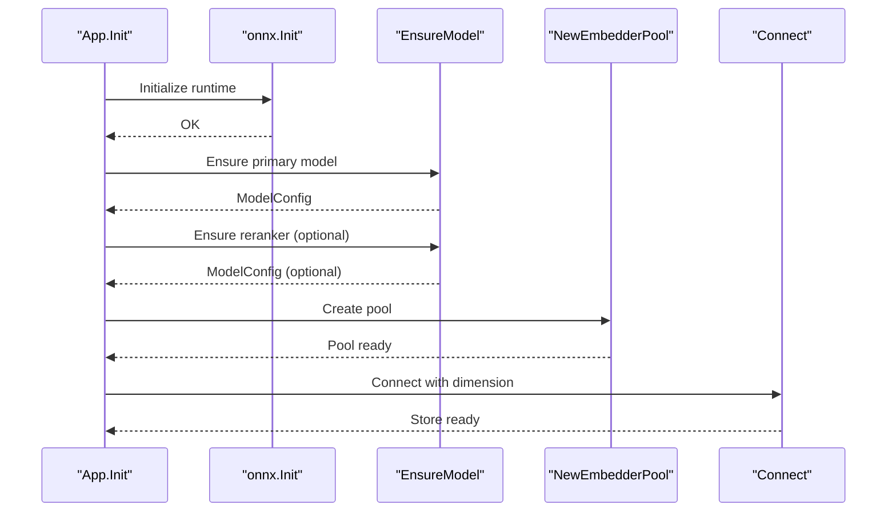
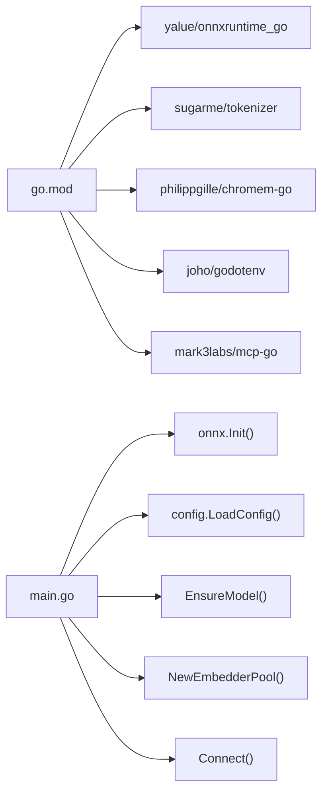

# Model Configuration and Management

<cite>
**Referenced Files in This Document**
- [downloader.go](file://internal/embedding/downloader.go)
- [session.go](file://internal/embedding/session.go)
- [config.go](file://internal/config/config.go)
- [config_test.go](file://internal/config/config_test.go)
- [store.go](file://internal/db/store.go)
- [onnx.go](file://internal/onnx/onnx.go)
- [workspace.go](file://internal/util/workspace.go)
- [main.go](file://main.go)
- [mem_throttler.go](file://internal/system/mem_throttler.go)
- [mcp-config.json.example](file://mcp-config.json.example)
- [go.mod](file://go.mod)
- [RELEASE_NOTES.md](file://RELEASE_NOTES.md)
</cite>

## Table of Contents
1. [Introduction](#introduction)
2. [Project Structure](#project-structure)
3. [Core Components](#core-components)
4. [Architecture Overview](#architecture-overview)
5. [Detailed Component Analysis](#detailed-component-analysis)
6. [Dependency Analysis](#dependency-analysis)
7. [Performance Considerations](#performance-considerations)
8. [Troubleshooting Guide](#troubleshooting-guide)
9. [Conclusion](#conclusion)
10. [Appendices](#appendices)

## Introduction
This document explains the model configuration and management system used by the application. It covers model discovery and download, configuration schema and validation, workspace organization, model caching and persistence, model selection criteria, lifecycle management (loading, unloading, hot-swapping), performance characteristics, compatibility, security and access control, and practical guidance for integrating custom models and migrating between versions.

## Project Structure
The model-related functionality spans several packages:
- Configuration and environment-driven setup
- Model discovery and download
- ONNX runtime initialization and model sessions
- Vector database storage and dimension validation
- Memory throttling for safe operation
- Workspace detection for project roots

**Diagram sources**
- [main.go:93-176](file://main.go#L93-L176)
- [config.go:30-130](file://internal/config/config.go#L30-L130)
- [onnx.go:12-44](file://internal/onnx/onnx.go#L12-L44)
- [downloader.go:97-124](file://internal/embedding/downloader.go#L97-L124)
- [session.go:38-85](file://internal/embedding/session.go#L38-L85)
- [store.go:35-64](file://internal/db/store.go#L35-L64)
- [mem_throttler.go:30-103](file://internal/system/mem_throttler.go#L30-L103)
- [workspace.go:9-46](file://internal/util/workspace.go#L9-L46)

**Section sources**
- [main.go:93-176](file://main.go#L93-L176)
- [config.go:30-130](file://internal/config/config.go#L30-L130)

## Core Components
- Model discovery and download: Centralized presets define supported models, URLs, filenames, and dimensions. The downloader ensures local presence and resolves tokenizer paths.
- Embedding sessions: A pool-based system loads ONNX models and tokenizers, prepares tensors, and executes inference with normalization and optional reranking.
- Configuration: Environment-driven configuration with defaults, validation, and overrides for model names, reranker selection, pool sizing, and logging.
- Vector store: Persistent storage with dimension probing to detect incompatible model switches and hybrid search with lexical and vector components.
- ONNX runtime: Automatic discovery and initialization of the shared library with fallbacks.
- Workspace detection: Utility to locate project roots using common markers.

**Section sources**
- [downloader.go:11-124](file://internal/embedding/downloader.go#L11-L124)
- [session.go:29-174](file://internal/embedding/session.go#L29-L174)
- [config.go:13-130](file://internal/config/config.go#L13-L130)
- [store.go:19-64](file://internal/db/store.go#L19-L64)
- [onnx.go:12-44](file://internal/onnx/onnx.go#L12-L44)
- [workspace.go:9-46](file://internal/util/workspace.go#L9-L46)

## Architecture Overview
The model management pipeline integrates configuration, model acquisition, runtime initialization, and embedding execution.

**Diagram sources**
- [main.go:93-176](file://main.go#L93-L176)
- [config.go:30-130](file://internal/config/config.go#L30-L130)
- [onnx.go:12-44](file://internal/onnx/onnx.go#L12-L44)
- [downloader.go:97-124](file://internal/embedding/downloader.go#L97-L124)
- [session.go:38-85](file://internal/embedding/session.go#L38-L85)
- [store.go:35-64](file://internal/db/store.go#L35-L64)

## Detailed Component Analysis

### Model Discovery and Download
- Preset registry: Named models map to ONNX and tokenizer URLs, filenames, and dimensions. Some models are marked as rerankers.
- Resolution: Lookup by name returns a validated configuration or an error listing supported models.
- Local provisioning: Ensures model and tokenizer files exist locally. Downloads via HTTP with atomic write semantics (temporary file then rename). Resolves tokenizer path for later session creation.

**Diagram sources**
- [downloader.go:88-124](file://internal/embedding/downloader.go#L88-L124)
- [downloader.go:126-158](file://internal/embedding/downloader.go#L126-L158)

**Section sources**
- [downloader.go:11-124](file://internal/embedding/downloader.go#L11-L124)
- [downloader.go:126-158](file://internal/embedding/downloader.go#L126-L158)

### Embedding Sessions and Pooling
- Pool creation: Initializes a fixed-size pool of embedders. Each embedder loads an embedding session and optionally a reranker session.
- Session setup: Validates local presence of model and tokenizer, constructs input/output tensors, and configures model-specific inputs (e.g., token_type_ids).
- Execution: Encodes text, fills tensors, runs the session, extracts embeddings, normalizes vectors, and supports batch operations.
- Reranking: Optional reranker session computes relevance scores for query-document pairs.

**Diagram sources**
- [session.go:29-85](file://internal/embedding/session.go#L29-L85)
- [session.go:87-174](file://internal/embedding/session.go#L87-L174)
- [session.go:176-298](file://internal/embedding/session.go#L176-L298)

**Section sources**
- [session.go:29-174](file://internal/embedding/session.go#L29-L174)
- [session.go:176-298](file://internal/embedding/session.go#L176-L298)

### Configuration Schema and Validation
- Fields: ProjectRoot, DataDir, DbPath, ModelsDir, LogPath, ModelName, RerankerModelName, HFToken, Dimension, DisableWatcher, EnableLiveIndexing, EmbedderPoolSize, ApiPort, Logger.
- Defaults and overrides: Environment variables override defaults; DATA_DIR, MODELS_DIR, DB_PATH, LOG_PATH, PROJECT_ROOT, MODEL_NAME, RERANKER_MODEL_NAME, DISABLE_FILE_WATCHER, ENABLE_LIVE_INDEXING, EMBEDDER_POOL_SIZE, API_PORT.
- Validation: Non-positive pool sizes fall back to 1; reranker disabled when set to a sentinel value; relative path utility for reporting.

**Diagram sources**
- [config.go:30-130](file://internal/config/config.go#L30-L130)

**Section sources**
- [config.go:13-130](file://internal/config/config.go#L13-L130)
- [config_test.go:8-114](file://internal/config/config_test.go#L8-L114)

### Vector Store and Dimension Management
- Persistent connection: Creates or opens a persistent database and collection.
- Dimension probing: On first use, probes for dimension mismatches by attempting a dummy query; detects switching models and instructs deletion of the database to avoid incompatible vectors.
- Hybrid search: Runs vector and lexical search concurrently, fuses results with reciprocal rank fusion, applies boosts, and returns top-K.

**Diagram sources**
- [store.go:35-64](file://internal/db/store.go#L35-L64)

**Section sources**
- [store.go:19-64](file://internal/db/store.go#L19-L64)
- [store.go:223-336](file://internal/db/store.go#L223-L336)

### ONNX Runtime Initialization
- Shared library discovery: Attempts multiple locations (current working directory, executable directory, user-local share) and sets the path before initializing the environment.
- Error handling: Propagates initialization failures.

**Section sources**
- [onnx.go:12-44](file://internal/onnx/onnx.go#L12-L44)

### Workspace Organization
- Root detection: Traverses upward from a given path to find project markers (.git, package.json, go.mod, Cargo.toml) and returns the first match.

**Section sources**
- [workspace.go:9-46](file://internal/util/workspace.go#L9-L46)

### Model Lifecycle Management
- Loading: Occurs during App initialization in the master instance; ONNX runtime is initialized, models are ensured, dimensions are set, and embedder pools are created.
- Unloading: Embedder sessions and tensors are destroyed when pools close or embedders are finalized.
- Hot-swapping: Not directly supported; switching models triggers dimension mismatch detection in the store, requiring DB deletion and restart.

**Diagram sources**
- [main.go:93-176](file://main.go#L93-L176)
- [onnx.go:12-44](file://internal/onnx/onnx.go#L12-L44)
- [downloader.go:97-124](file://internal/embedding/downloader.go#L97-L124)
- [session.go:38-85](file://internal/embedding/session.go#L38-L85)
- [store.go:35-64](file://internal/db/store.go#L35-L64)

**Section sources**
- [main.go:93-176](file://main.go#L93-L176)
- [session.go:273-298](file://internal/embedding/session.go#L273-L298)

## Dependency Analysis
- External libraries: ONNX runtime bindings, tokenizer, chromem-based vector DB, dotenv, and MCP protocol stack.
- Internal dependencies: App composes configuration, ONNX initialization, model downloader, embedder pool, and vector store.

**Diagram sources**
- [go.mod:5-34](file://go.mod#L5-L34)
- [main.go:93-176](file://main.go#L93-L176)

**Section sources**
- [go.mod:5-34](file://go.mod#L5-L34)
- [main.go:93-176](file://main.go#L93-L176)

## Performance Considerations
- Embedding pool sizing: Controlled by configuration; larger pools increase concurrency but also memory usage.
- Memory throttling: Monitors system memory and can suggest pausing heavy tasks when thresholds are exceeded.
- Vector search: Hybrid search runs vector and lexical branches concurrently, then merges with dynamic weights and boosts.
- Dimension probing: Prevents costly failures by detecting mismatches early.

Recommendations:
- Tune EmbedderPoolSize according to CPU cores and available RAM.
- Monitor memory with the throttler and reduce pool size or pause indexing under pressure.
- Use reranker selectively due to additional compute cost.

**Section sources**
- [config.go:103-108](file://internal/config/config.go#L103-L108)
- [mem_throttler.go:30-103](file://internal/system/mem_throttler.go#L30-L103)
- [store.go:223-336](file://internal/db/store.go#L223-L336)

## Troubleshooting Guide
Common issues and resolutions:
- Unsupported model name: Ensure the model name is one of the supported presets; the downloader returns a clear error with the allowed list.
- Model or tokenizer missing locally: The downloader ensures files; verify network access and destination permissions.
- ONNX initialization failure: Confirm ONNX shared library path is discoverable or set via environment variable; see ONNX init logic.
- Dimension mismatch after switching models: Delete the vector database directory and restart; the store detects mismatch and advises deletion.
- Missing inputs in ONNX session: The runtime now includes token_type_ids for compatibility; ensure the correct model configuration is used.
- Reranker not loaded: Verify reranker model name and that EnsureModel succeeds; reranker absence does not fail the whole pipeline.

**Section sources**
- [downloader.go:88-95](file://internal/embedding/downloader.go#L88-L95)
- [downloader.go:97-124](file://internal/embedding/downloader.go#L97-L124)
- [onnx.go:12-44](file://internal/onnx/onnx.go#L12-L44)
- [store.go:51-61](file://internal/db/store.go#L51-L61)
- [RELEASE_NOTES.md:21-24](file://RELEASE_NOTES.md#L21-L24)

## Conclusion
The model configuration and management system provides a robust, environment-driven setup with clear model presets, reliable downloads, efficient embedding sessions, and safe dimension management. By tuning configuration parameters, leveraging memory throttling, and following the recommended practices, operators can achieve predictable performance and reliability across diverse deployment scenarios.

## Appendices

### Configuration Examples
- Basic usage: Run with defaults; models and logs are placed under the data directory.
- Override directories: Supply DATA_DIR, MODELS_DIR, DB_PATH, LOG_PATH via environment variables or CLI flags.
- Model selection: Set MODEL_NAME and optionally RERANKER_MODEL_NAME; use “none” to disable reranking.
- Pool sizing: Set EMBEDDER_POOL_SIZE to balance throughput and resource usage.
- ONNX library path: Provide ONNX_LIB_PATH to guide runtime discovery.

**Section sources**
- [config.go:30-130](file://internal/config/config.go#L30-L130)
- [mcp-config.json.example:1-12](file://mcp-config.json.example#L1-L12)

### Model Selection Criteria and Compatibility
- Supported presets include multiple BGE variants, rerankers, and specialized models. Dimensions vary by model; the store validates compatibility.
- Reranker models are flagged accordingly; optional reranking improves relevance at extra cost.
- Tokenizer compatibility: Tokenizer files are downloaded alongside models and used for encoding.

**Section sources**
- [downloader.go:11-86](file://internal/embedding/downloader.go#L11-L86)
- [session.go:127-150](file://internal/embedding/session.go#L127-L150)

### Security and Access Control
- Environment variables: Keep sensitive tokens (e.g., HF_TOKEN) out of public configs; restrict file permissions on models and logs.
- Network access: Ensure outbound HTTPS access to model hosts; consider proxies or mirrors if required.
- Local storage: Restrict write access to models and database directories to trusted users.

[No sources needed since this section provides general guidance]

### Migration Strategies
- Switching models: Expect dimension mismatch detection; delete the vector database and restart to rebuild indices with the new model.
- Version updates: Replace model files in the models directory; the downloader will not overwrite existing files; remove outdated files manually if needed.
- Backward compatibility: Prefer models with matching dimensions for seamless transitions.

**Section sources**
- [store.go:51-61](file://internal/db/store.go#L51-L61)
- [downloader.go:97-124](file://internal/embedding/downloader.go#L97-L124)