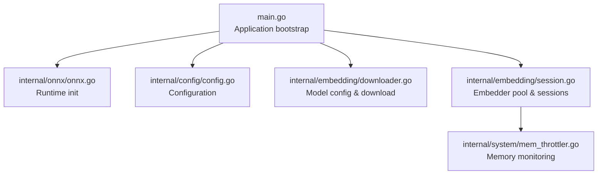
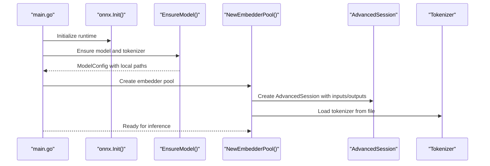
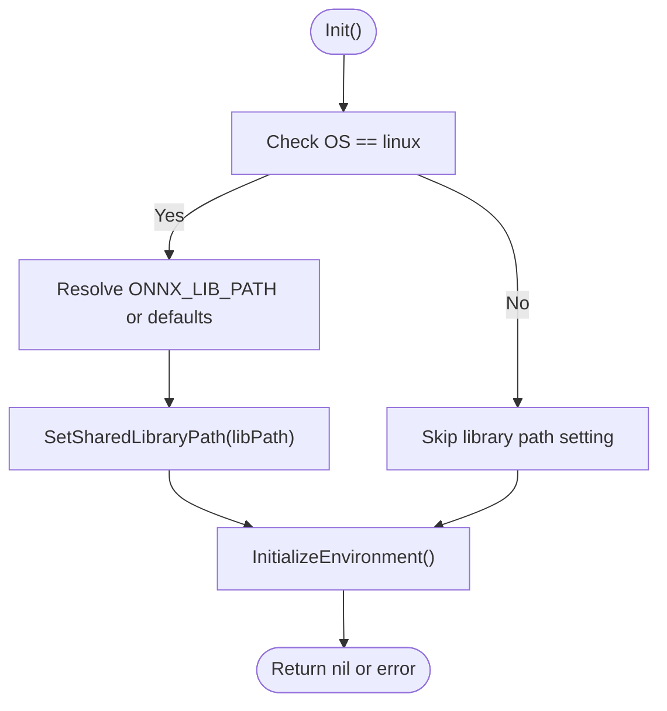
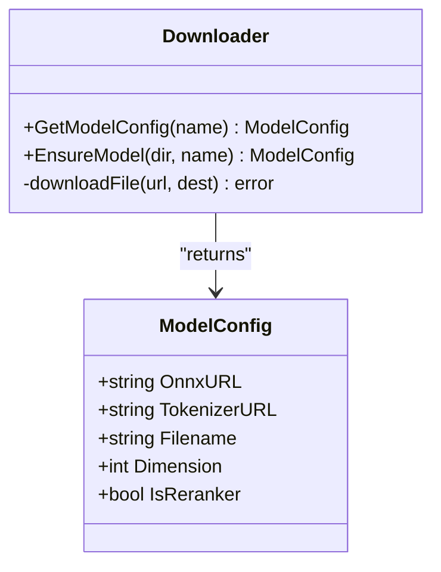
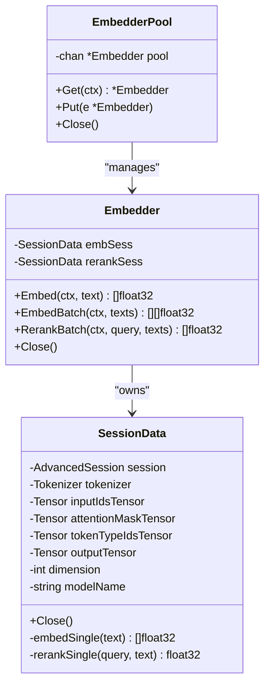
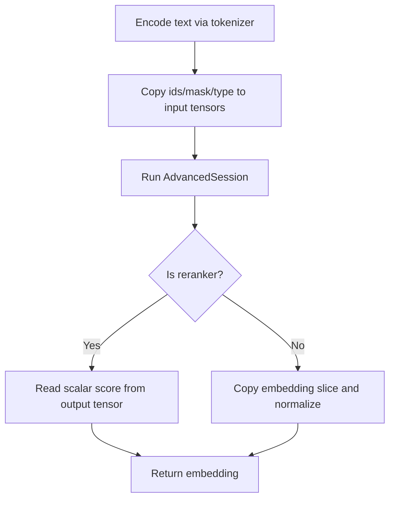
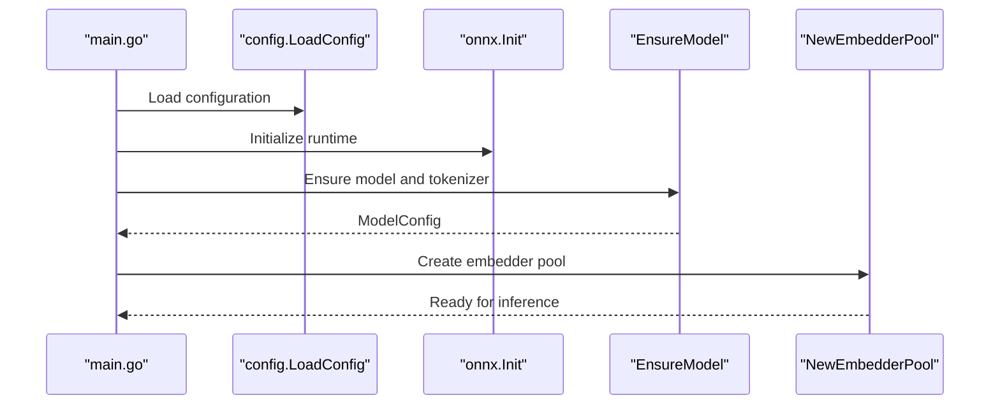
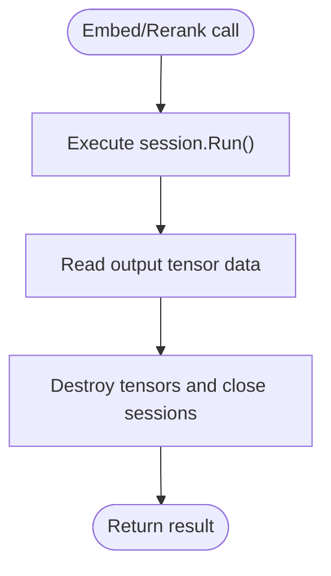
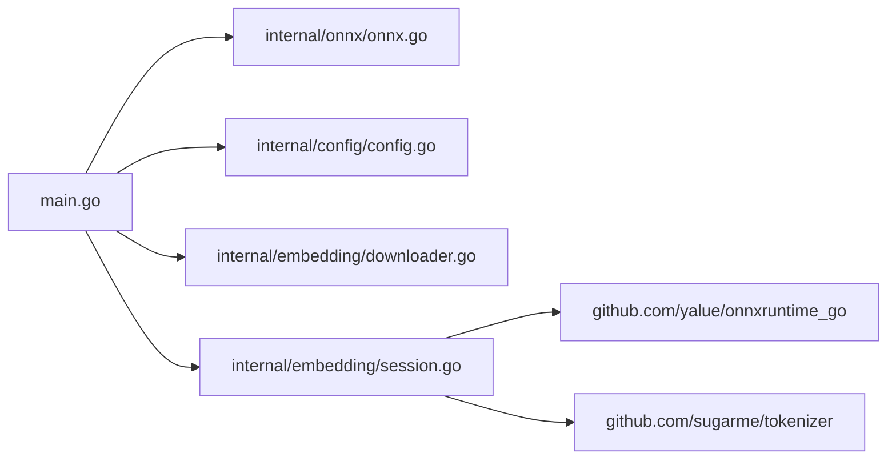

# ONNX Runtime Integration

<cite>
**Referenced Files in This Document**
- [onnx.go](file://internal/onnx/onnx.go)
- [session.go](file://internal/embedding/session.go)
- [downloader.go](file://internal/embedding/downloader.go)
- [main.go](file://main.go)
- [config.go](file://internal/config/config.go)
- [mem_throttler.go](file://internal/system/mem_throttler.go)
- [check_onnx.go](file://scripts/check_onnx.go)
- [check_onnx_2.go](file://scripts/check_onnx_2.go)
- [check_onnx_3.go](file://scripts/check_onnx_3.go)
- [inspect_models.go](file://scripts/inspect_models.go)
</cite>

## Table of Contents
1. [Introduction](#introduction)
2. [Project Structure](#project-structure)
3. [Core Components](#core-components)
4. [Architecture Overview](#architecture-overview)
5. [Detailed Component Analysis](#detailed-component-analysis)
6. [Dependency Analysis](#dependency-analysis)
7. [Performance Considerations](#performance-considerations)
8. [Troubleshooting Guide](#troubleshooting-guide)
9. [Conclusion](#conclusion)

## Introduction
This document describes the ONNX runtime integration used by the application to perform local inference for embedding and reranking tasks. It covers runtime setup, session management, tensor operations, model loading and validation, tokenizer integration, sequence length handling, batching, memory management, lifecycle management, and performance optimization strategies. The integration leverages a dedicated ONNX runtime environment, pre-configured model sessions, and a thread-safe embedder pool to support concurrent workloads.

## Project Structure
The ONNX integration spans several packages:
- Runtime initialization and environment setup
- Model configuration and download/validation
- Embedding and reranking session management
- Application lifecycle integration and configuration
- Memory monitoring for safe operation

**Diagram sources**
- [main.go:112-137](file://main.go#L112-L137)
- [onnx.go:13-42](file://internal/onnx/onnx.go#L13-L42)
- [config.go:30-129](file://internal/config/config.go#L30-L129)
- [downloader.go:88-124](file://internal/embedding/downloader.go#L88-L124)
- [session.go:38-64](file://internal/embedding/session.go#L38-L64)
- [mem_throttler.go:30-103](file://internal/system/mem_throttler.go#L30-L103)

**Section sources**
- [main.go:112-137](file://main.go#L112-L137)
- [onnx.go:13-42](file://internal/onnx/onnx.go#L13-L42)
- [config.go:30-129](file://internal/config/config.go#L30-L129)
- [downloader.go:88-124](file://internal/embedding/downloader.go#L88-L124)
- [session.go:38-64](file://internal/embedding/session.go#L38-L64)
- [mem_throttler.go:30-103](file://internal/system/mem_throttler.go#L30-L103)

## Core Components
- ONNX Environment Initialization: Sets the shared library path and initializes the runtime environment, with special handling for Linux.
- Model Configuration and Download: Defines supported models, resolves URLs, downloads artifacts, and validates local presence.
- Embedder Pool: Manages a pool of embedders with pre-warmed sessions and tensors for concurrency.
- Session Management: Creates AdvancedSession instances with configured input/output tensors and handles run execution.
- Tokenizer Integration: Loads tokenizer from local JSON and encodes inputs for embedding and reranking.
- Lifecycle and Cleanup: Ensures proper destruction of tensors and sessions to prevent leaks.
- Memory Monitoring: Provides throttling logic to avoid overcommitting system memory during heavy operations.

**Section sources**
- [onnx.go:13-42](file://internal/onnx/onnx.go#L13-L42)
- [downloader.go:11-86](file://internal/embedding/downloader.go#L11-L86)
- [session.go:38-64](file://internal/embedding/session.go#L38-L64)
- [session.go:87-174](file://internal/embedding/session.go#L87-L174)
- [session.go:273-298](file://internal/embedding/session.go#L273-L298)
- [mem_throttler.go:21-103](file://internal/system/mem_throttler.go#L21-L103)

## Architecture Overview
The ONNX integration follows a layered approach:
- Application bootstrap initializes the ONNX environment and prepares models.
- Embedder pool holds reusable sessions and tensors per model.
- Embedding and reranking requests are executed synchronously against warmed sessions.
- Tokenizer encodes inputs and fills preallocated tensors.
- Memory throttler informs higher layers when to reduce workload.

**Diagram sources**
- [main.go:112-137](file://main.go#L112-L137)
- [onnx.go:13-42](file://internal/onnx/onnx.go#L13-L42)
- [downloader.go:98-124](file://internal/embedding/downloader.go#L98-L124)
- [session.go:38-64](file://internal/embedding/session.go#L38-L64)
- [session.go:87-174](file://internal/embedding/session.go#L87-L174)

## Detailed Component Analysis

### ONNX Environment Initialization
- Detects Linux and sets the shared library path via environment variable or fallback locations.
- Initializes the ONNX runtime environment and propagates initialization errors.

**Diagram sources**
- [onnx.go:13-42](file://internal/onnx/onnx.go#L13-L42)

**Section sources**
- [onnx.go:13-42](file://internal/onnx/onnx.go#L13-L42)

### Model Configuration and Validation
- ModelConfig defines model metadata, URLs, filenames, dimensionality, and reranker flags.
- Supported models are enumerated with their ONNX and tokenizer URLs.
- EnsureModel downloads missing artifacts and stores resolved local paths for later use.

**Diagram sources**
- [downloader.go:11-86](file://internal/embedding/downloader.go#L11-L86)
- [downloader.go:88-124](file://internal/embedding/downloader.go#L88-L124)

**Section sources**
- [downloader.go:11-86](file://internal/embedding/downloader.go#L11-L86)
- [downloader.go:88-124](file://internal/embedding/downloader.go#L88-L124)

### Embedder Pool and Session Management
- EmbedderPool maintains a buffered channel of embedders for concurrency.
- newSessionData constructs:
  - Shape and tensors for input_ids, attention_mask, token_type_ids
  - Output tensor with appropriate shape depending on model type
  - AdvancedSession with input/output node names and preallocated tensors
  - Special-case handling for models without token_type_ids
- Embedder exposes Embed, EmbedBatch, and RerankBatch methods.
- Close methods destroy sessions and tensors to prevent leaks.

**Diagram sources**
- [session.go:18-27](file://internal/embedding/session.go#L18-L27)
- [session.go:29-36](file://internal/embedding/session.go#L29-L36)
- [session.go:87-174](file://internal/embedding/session.go#L87-L174)
- [session.go:273-298](file://internal/embedding/session.go#L273-L298)

**Section sources**
- [session.go:38-64](file://internal/embedding/session.go#L38-L64)
- [session.go:87-174](file://internal/embedding/session.go#L87-L174)
- [session.go:273-298](file://internal/embedding/session.go#L273-L298)

### Tensor Operations and Input/Output Configuration
- Fixed sequence length is enforced via MaxSeqLength constant.
- Tensors are preallocated with NewTensor and NewEmptyTensor.
- Input node names vary by model; token_type_ids is conditionally included.
- Output node names differ for rerankers vs. embeddings.
- Data copying from encoded tokens to tensors is bounded by MaxSeqLength.

**Diagram sources**
- [session.go:180-245](file://internal/embedding/session.go#L180-L245)
- [session.go:316-366](file://internal/embedding/session.go#L316-L366)

**Section sources**
- [session.go:104-150](file://internal/embedding/session.go#L104-L150)
- [session.go:180-245](file://internal/embedding/session.go#L180-L245)
- [session.go:316-366](file://internal/embedding/session.go#L316-L366)

### Application Lifecycle Integration
- ONNX initialization occurs early in the application bootstrap.
- Models are ensured and dimension is set from model configuration.
- Embedder pool is created with configurable size and optional reranker.
- Embedder methods are exposed through a pool wrapper for concurrency-safe usage.

**Diagram sources**
- [main.go:112-137](file://main.go#L112-L137)
- [config.go:30-129](file://internal/config/config.go#L30-L129)
- [onnx.go:13-42](file://internal/onnx/onnx.go#L13-L42)
- [downloader.go:98-124](file://internal/embedding/downloader.go#L98-L124)
- [session.go:38-64](file://internal/embedding/session.go#L38-L64)

**Section sources**
- [main.go:112-137](file://main.go#L112-L137)
- [config.go:30-129](file://internal/config/config.go#L30-L129)
- [onnx.go:13-42](file://internal/onnx/onnx.go#L13-L42)
- [downloader.go:98-124](file://internal/embedding/downloader.go#L98-L124)
- [session.go:38-64](file://internal/embedding/session.go#L38-L64)

### Memory Management Strategies
- Explicit Destroy calls on tensors and sessions prevent resource leaks.
- Embedder.Close and SessionData.Close orchestrate cleanup of all managed resources.
- Memory throttler monitors system memory and can influence operational decisions.

**Diagram sources**
- [session.go:273-298](file://internal/embedding/session.go#L273-L298)
- [mem_throttler.go:21-103](file://internal/system/mem_throttler.go#L21-L103)

**Section sources**
- [session.go:273-298](file://internal/embedding/session.go#L273-L298)
- [mem_throttler.go:21-103](file://internal/system/mem_throttler.go#L21-L103)

## Dependency Analysis
- main.go depends on onnx.Init, config.LoadConfig, embedding.EnsureModel, and embedding.NewEmbedderPool.
- embedding/session.go depends on onnxruntime_go for sessions and tensors, and tokenizer for encoding.
- embedding/downloader.go provides model metadata and download logic.
- internal/system/mem_throttler.go provides memory monitoring utilities.

**Diagram sources**
- [main.go:112-137](file://main.go#L112-L137)
- [onnx.go:13-42](file://internal/onnx/onnx.go#L13-L42)
- [config.go:30-129](file://internal/config/config.go#L30-L129)
- [downloader.go:98-124](file://internal/embedding/downloader.go#L98-L124)
- [session.go:87-174](file://internal/embedding/session.go#L87-L174)

**Section sources**
- [main.go:112-137](file://main.go#L112-L137)
- [session.go:87-174](file://internal/embedding/session.go#L87-L174)

## Performance Considerations
- Pre-warmed sessions and tensors eliminate per-request allocation overhead.
- Fixed sequence length simplifies memory planning and reduces dynamic resizing.
- Batch processing is supported via EmbedBatch and RerankBatch for throughput gains.
- Memory throttling helps avoid GC pressure and system thrashing under load.
- Platform-specific shared library resolution minimizes startup failures on Linux.

[No sources needed since this section provides general guidance]

## Troubleshooting Guide
Common issues and resolutions:
- Shared library path problems on Linux:
  - Ensure ONNX_LIB_PATH is set or the runtime can locate libonnxruntime.so in expected locations.
  - Verify the library path is correctly reported during initialization.
- Model or tokenizer not found:
  - Confirm EnsureModel downloaded artifacts and that local paths exist.
  - Check model filename and tokenizer.json placement according to model directory structure.
- Session creation failures:
  - Validate input and output node names align with the specific model.
  - Use inspection scripts to enumerate valid input/output names.
- Runtime errors during Run:
  - Confirm tensor shapes and node names match model expectations.
  - Ensure tensors are properly filled and not left in uninitialized state.
- Memory leaks:
  - Always call Destroy on tensors and Destroy on sessions.
  - Use Embedder.Close and SessionData.Close to ensure cleanup.
- Performance bottlenecks:
  - Increase embedder pool size to handle concurrent requests.
  - Monitor memory usage and apply throttling when thresholds are exceeded.

**Section sources**
- [onnx.go:13-42](file://internal/onnx/onnx.go#L13-L42)
- [downloader.go:98-124](file://internal/embedding/downloader.go#L98-L124)
- [session.go:273-298](file://internal/embedding/session.go#L273-L298)
- [check_onnx_3.go:20-33](file://scripts/check_onnx_3.go#L20-L33)
- [inspect_models.go:25-35](file://scripts/inspect_models.go#L25-L35)

## Conclusion
The ONNX runtime integration provides a robust, efficient, and deterministic inference pipeline for embedding and reranking tasks. By preloading models, warming sessions, and managing tensors explicitly, the system achieves predictable performance and minimal latency. Proper initialization, validation, and cleanup ensure reliability across platforms, while memory monitoring and pooling support scalable concurrent workloads.