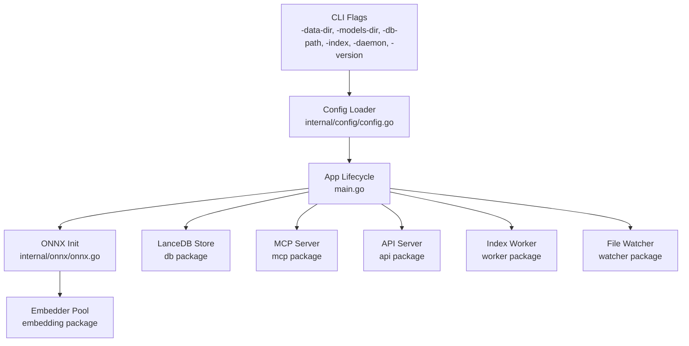
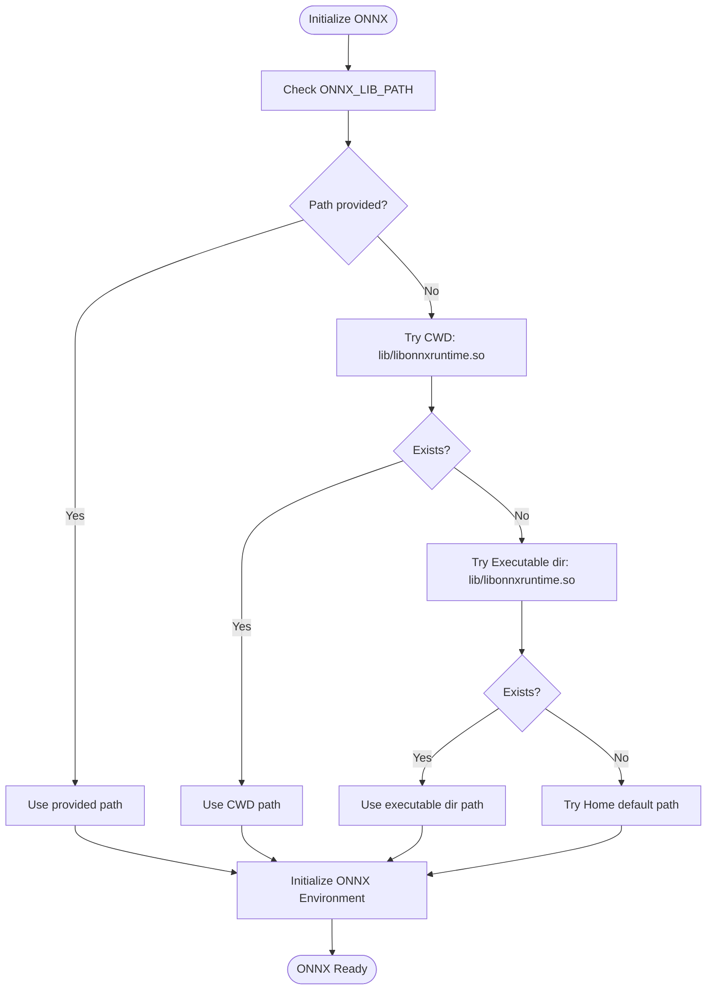
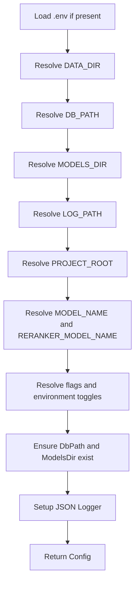
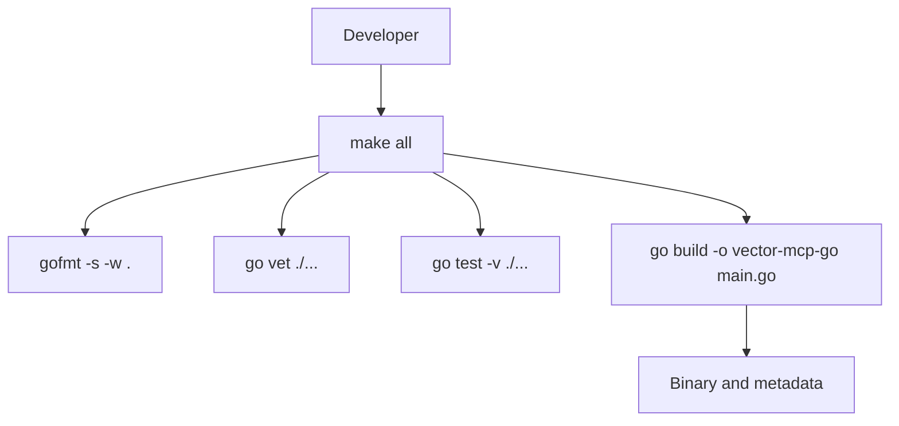
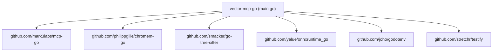

# Getting Started

<cite>
**Referenced Files in This Document**
- [README.md](file://README.md)
- [Makefile](file://Makefile)
- [go.mod](file://go.mod)
- [main.go](file://main.go)
- [internal/config/config.go](file://internal/config/config.go)
- [mcp-config.json.example](file://mcp-config.json.example)
- [.github/workflows/ci.yml](file://.github/workflows/ci.yml)
- [scripts/check_onnx.go](file://scripts/check_onnx.go)
- [scripts/check_onnx_2.go](file://scripts/check_onnx_2.go)
- [scripts/check_onnx_3.go](file://scripts/check_onnx_3.go)
- [scripts/inspect_models.go](file://scripts/inspect_models.go)
- [scripts/setup-services.sh](file://scripts/setup-services.sh)
- [scripts/vector-mcp.service](file://scripts/vector-mcp.service)
- [scripts/vector-mcp-ui.service](file://scripts/vector-mcp-ui.service)
- [internal/onnx/onnx.go](file://internal/onnx/onnx.go)
</cite>

## Table of Contents
1. [Introduction](#introduction)
2. [Prerequisites](#prerequisites)
3. [Installation](#installation)
4. [Basic Configuration](#basic-configuration)
5. [Quick Start](#quick-start)
6. [Architecture Overview](#architecture-overview)
7. [Detailed Component Analysis](#detailed-component-analysis)
8. [Dependency Analysis](#dependency-analysis)
9. [Performance Considerations](#performance-considerations)
10. [Troubleshooting Guide](#troubleshooting-guide)
11. [Conclusion](#conclusion)

## Introduction
Vector MCP Go is a high-performance, deterministic Model Context Protocol (MCP) server written in Go. It provides advanced semantic search, architectural analysis, and codebase mutation capabilities. The server integrates local ONNX embeddings for privacy-preserving, offline semantic understanding and exposes consolidated tools for search, LSP queries, code analysis, workspace management, and safe file mutations.

Key highlights:
- Deterministic operation with a "Fat Tool" pattern to reduce context fragmentation.
- Local ONNX embeddings via bge-m3 for fast, private semantic search.
- Rich MCP toolset for developers and agents.

**Section sources**
- [README.md:1-40](file://README.md#L1-L40)

## Prerequisites
Before installing and running Vector MCP Go, ensure your environment meets the following requirements:

- Go version 1.22 or higher. The project declares Go 1.26.1 in its module file, but the documented minimum is 1.22.
- C++ build tools for CGO-enabled ONNX runtime integration. The project uses CGO via the ONNX runtime binding and requires a working C/C++ toolchain to compile and link the ONNX runtime shared library.

Notes:
- The CI workflow explicitly sets the Go version to 1.22 for builds and tests.
- The build system enables CGO for cross-compilation with Zig toolchains in releases.

**Section sources**
- [README.md:23-26](file://README.md#L23-L26)
- [.github/workflows/ci.yml:21](file://.github/workflows/ci.yml#L21)
- [go.mod:3](file://go.mod#L3)

## Installation
Use the Makefile to build and run the server. The Makefile defines standard targets for formatting, linting, testing, building, cleaning, running, and displaying version metadata.

Step-by-step instructions:
1. Build the binary using the Makefile target:
   - Command: make build
   - This compiles the Go binary with linker flags injected at build time.
2. Run the server:
   - Command: ./vector-mcp-go
   - The server starts and listens for MCP requests on standard input/output by default.
3. Optional: Use make run to build and execute in one step.
4. Optional: Use make test to run unit tests.
5. Optional: Use make fmt and make lint to format and vet the codebase.

Build-time metadata:
- The Makefile injects version, build time, and commit hash into the binary via linker flags.

Verification:
- After building, confirm the binary exists and can print version information:
  - Command: ./vector-mcp-go -version

**Section sources**
- [Makefile:17-28](file://Makefile#L17-L28)
- [Makefile:35-43](file://Makefile#L35-L43)
- [main.go:280-292](file://main.go#L280-L292)

## Basic Configuration
Configure Vector MCP Go using environment variables and optional directories. The configuration loader resolves defaults and ensures required directories exist.

Key configuration parameters:
- ProjectRoot: Root of the project being indexed and searched. Defaults to current working directory.
- DataDir: Base directory for databases and models. Defaults to ~/.local/share/vector-mcp-go.
- DbPath: Path to the LanceDB directory. Defaults to DataDir/lancedb.
- ModelsDir: Directory for ONNX models. Defaults to DataDir/models.
- LogPath: Path to the JSON log file. Defaults to DataDir/server.log.
- MODEL_NAME: Name of the primary embedding model. Defaults to BAAI/bge-small-en-v1.5.
- RERANKER_MODEL_NAME: Name of the reranker model. Defaults to cross-encoder/ms-marco-MiniLM-L-6-v2; set to "none" to disable.
- HF_TOKEN: Optional Hugging Face token for model downloads.
- DISABLE_FILE_WATCHER: Set to "true" to disable file watching.
- ENABLE_LIVE_INDEXING: Set to "true" to enable live indexing on startup.
- EMBEDDER_POOL_SIZE: Number of concurrent embedders to pool.
- API_PORT: Port for the internal API server (when enabled). Defaults to 47821.

Environment variable precedence:
- Explicit overrides passed to the program take precedence over environment variables.
- Environment variables override defaults.

Directory creation:
- The configuration loader ensures DbPath and ModelsDir exist before starting.

**Section sources**
- [internal/config/config.go:30-130](file://internal/config/config.go#L30-L130)

## Quick Start
Follow these steps to run the server, connect with an MCP client, and perform basic operations.

1. Prepare the ONNX runtime:
   - Ensure the ONNX shared library is discoverable. On Linux, the server attempts to locate libonnxruntime.so in several locations:
     - Relative to current working directory
     - Relative to the executable path
     - Under ~/.local/share/vector-mcp-go
   - Optionally set ONNX_LIB_PATH to point directly to the shared library.
   - Confirm ONNX initialization with the provided script:
     - Command: go run scripts/check_onnx.go
     - This verifies environment initialization and model session creation.

2. Build and run the server:
   - Build: make build
   - Run: ./vector-mcp-go
   - To pre-index the codebase and exit: ./vector-mcp-go -index
   - To run as a background daemon (master worker): ./vector-mcp-go -daemon

3. Connect with an MCP client:
   - Use the provided configuration template to define the MCP server command and environment:
     - Template location: mcp-config.json.example
     - Customize the command field to point to your built binary.
     - Set ONNX_LIB_PATH under env to match your ONNX library path.
   - Example configuration keys:
     - mcpServers.vector-mcp.command: Path to the built binary
     - mcpServers.vector-mcp.env.ONNX_LIB_PATH: Path to libonnxruntime.so

4. Perform basic operations:
   - Semantic search: Use the search_workspace tool to query code semantics.
   - Code analysis: Use analyze_code to detect issues and patterns.
   - LSP integration: Use lsp_query for precise definitions and references.
   - Workspace management: Switch roots, trigger indexing, and fetch diagnostics.
   - Safe mutations: Use modify_workspace to apply patches and verify changes.

5. Verify installation:
   - Check logs in LogPath for initialization messages and errors.
   - Confirm the server responds to MCP requests from your client.
   - Validate that the ONNX runtime initializes without errors.

**Section sources**
- [internal/onnx/onnx.go:12-43](file://internal/onnx/onnx.go#L12-L43)
- [scripts/check_onnx.go:9-31](file://scripts/check_onnx.go#L9-L31)
- [mcp-config.json.example:1-12](file://mcp-config.json.example#L1-L12)
- [README.md:21-35](file://README.md#L21-L35)
- [main.go:280-317](file://main.go#L280-L317)

## Architecture Overview
The server initializes shared resources, selects master or slave mode, initializes the ONNX runtime and embedder pool, connects to the database, and starts the MCP server. Optional components include the API server, worker, and file watcher.

**Diagram sources**
- [main.go:93-176](file://main.go#L93-L176)
- [internal/onnx/onnx.go:12-43](file://internal/onnx/onnx.go#L12-L43)
- [internal/config/config.go:30-130](file://internal/config/config.go#L30-L130)

**Section sources**
- [main.go:93-176](file://main.go#L93-L176)

## Detailed Component Analysis

### ONNX Runtime Initialization
The ONNX runtime is initialized with a flexible discovery mechanism for the shared library path on Linux. It supports:
- Environment variable override via ONNX_LIB_PATH
- Relative paths from current working directory
- Executable-relative path resolution
- User-specific default path under ~/.local/share/vector-mcp-go

**Diagram sources**
- [internal/onnx/onnx.go:12-43](file://internal/onnx/onnx.go#L12-L43)

**Section sources**
- [internal/onnx/onnx.go:12-43](file://internal/onnx/onnx.go#L12-L43)

### Configuration Loading and Defaults
The configuration loader reads environment variables and applies sensible defaults. It ensures required directories exist and sets up structured logging.

**Diagram sources**
- [internal/config/config.go:30-130](file://internal/config/config.go#L30-L130)

**Section sources**
- [internal/config/config.go:30-130](file://internal/config/config.go#L30-L130)

### Build and Release Pipeline
The Makefile orchestrates formatting, linting, testing, and building. The release pipeline uses GoReleaser with CGO enabled and Zig toolchains for cross-compilation.

**Diagram sources**
- [Makefile:9-28](file://Makefile#L9-L28)

**Section sources**
- [Makefile:9-28](file://Makefile#L9-L28)
- [.github/workflows/ci.yml:18-36](file://.github/workflows/ci.yml#L18-L36)
- [.goreleaser.yaml:10-30](file://.goreleaser.yaml#L10-L30)

## Dependency Analysis
External dependencies and their roles:
- mcp-go: Provides MCP protocol support for the server.
- chromem-go: Enables integration with chromem storage for agentic memory.
- tree-sitter: Used for code parsing and analysis.
- onnxruntime_go: CGO-based ONNX runtime binding for embeddings.
- godotenv: Loads environment variables from .env files.
- testify: Testing utilities.

CGO and build toolchain:
- The project requires C/C++ toolchain for CGO-enabled builds.
- The release pipeline uses Zig CC/CXX for cross-compilation on Linux.

**Diagram sources**
- [go.mod:5-16](file://go.mod#L5-L16)

**Section sources**
- [go.mod:5-16](file://go.mod#L5-L16)

## Performance Considerations
- Embedder pool sizing: Tune EMBEDDER_POOL_SIZE to balance throughput and resource usage.
- Live indexing: ENABLE_LIVE_INDEXING can improve recall but increases CPU and disk I/O during startup.
- File watcher: DISABLE_FILE_WATCHER can reduce overhead in large repositories or constrained environments.
- Model selection: Choose appropriate MODEL_NAME and RERANKER_MODEL_NAME for your workload and latency budget.

[No sources needed since this section provides general guidance]

## Troubleshooting Guide

Common setup issues and resolutions:
- ONNX initialization failure:
  - Cause: Missing or inaccessible libonnxruntime.so.
  - Resolution: Set ONNX_LIB_PATH to the correct path or place the library under the expected search locations.
  - Verification: Use scripts/check_onnx.go to validate initialization and model session creation.
- CGO build failures:
  - Cause: Missing C/C++ toolchain or incompatible compiler.
  - Resolution: Install a compatible C/C++ toolchain and ensure CGO is enabled.
- Port conflicts:
  - Cause: API_PORT already in use.
  - Resolution: Change API_PORT via environment variable or configuration.
- Missing directories:
  - Cause: DbPath or ModelsDir not writable.
  - Resolution: Ensure directories exist and are writable by the running user.

Verification steps:
- Build and run: make build && ./vector-mcp-go -version
- Test ONNX: go run scripts/check_onnx.go
- Inspect model inputs/outputs: go run scripts/check_onnx_3.go
- Inspect model tensors: go run scripts/inspect_models.go

Systemd services:
- Use scripts/setup-services.sh to copy and enable systemd units for backend and UI.
- Manage services with systemctl commands.

**Section sources**
- [internal/onnx/onnx.go:12-43](file://internal/onnx/onnx.go#L12-L43)
- [scripts/check_onnx.go:9-31](file://scripts/check_onnx.go#L9-L31)
- [scripts/check_onnx_2.go:9-31](file://scripts/check_onnx_2.go#L9-L31)
- [scripts/check_onnx_3.go:9-48](file://scripts/check_onnx_3.go#L9-L48)
- [scripts/inspect_models.go:10-36](file://scripts/inspect_models.go#L10-L36)
- [scripts/setup-services.sh:1-31](file://scripts/setup-services.sh#L1-L31)
- [scripts/vector-mcp.service:1-17](file://scripts/vector-mcp.service#L1-L17)
- [scripts/vector-mcp-ui.service:1-17](file://scripts/vector-mcp-ui.service#L1-L17)

## Conclusion
You now have the essentials to install, configure, and run Vector MCP Go. Start with the prerequisites, build using the Makefile, configure environment variables, and validate ONNX initialization. Use the provided configuration template to connect an MCP client and explore the five consolidated tools for search, analysis, LSP, workspace management, and safe mutations. Refer to the troubleshooting guide for common issues and verification steps.

[No sources needed since this section summarizes without analyzing specific files]