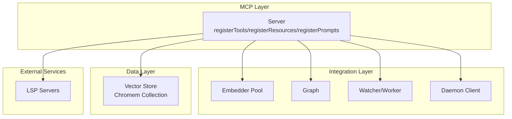
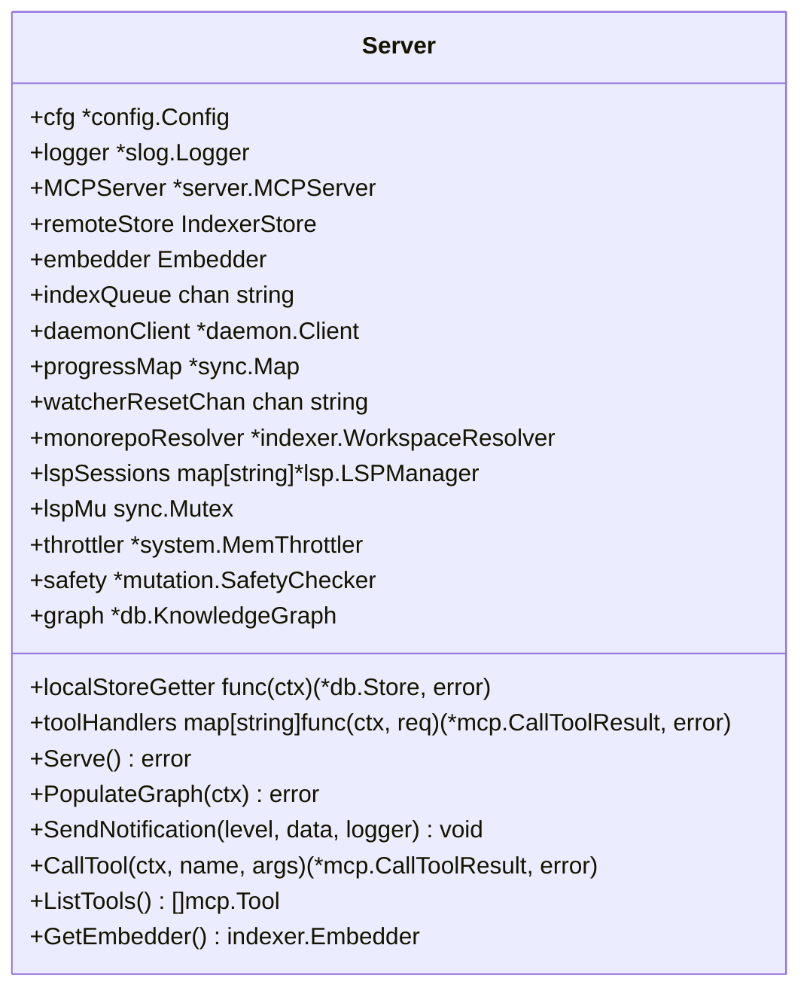
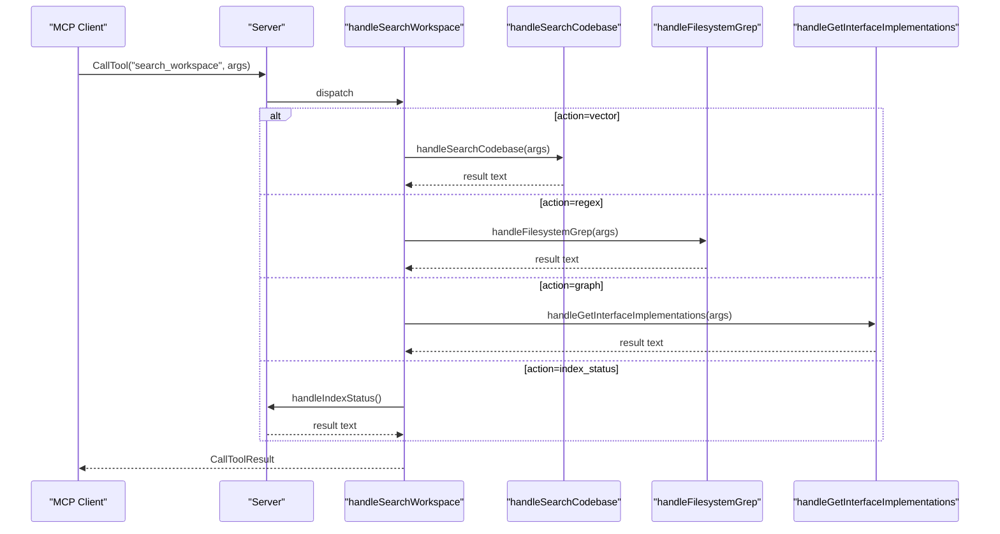
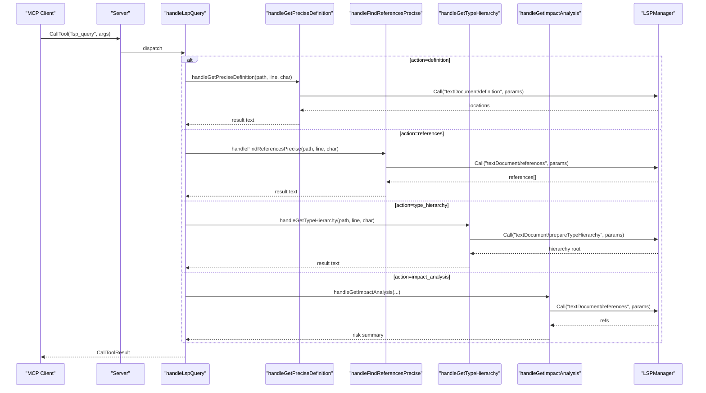
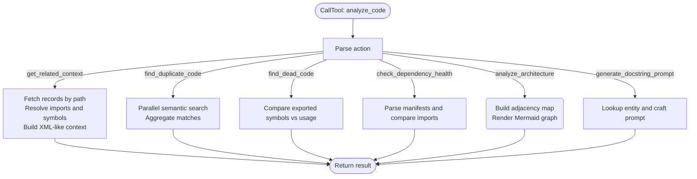
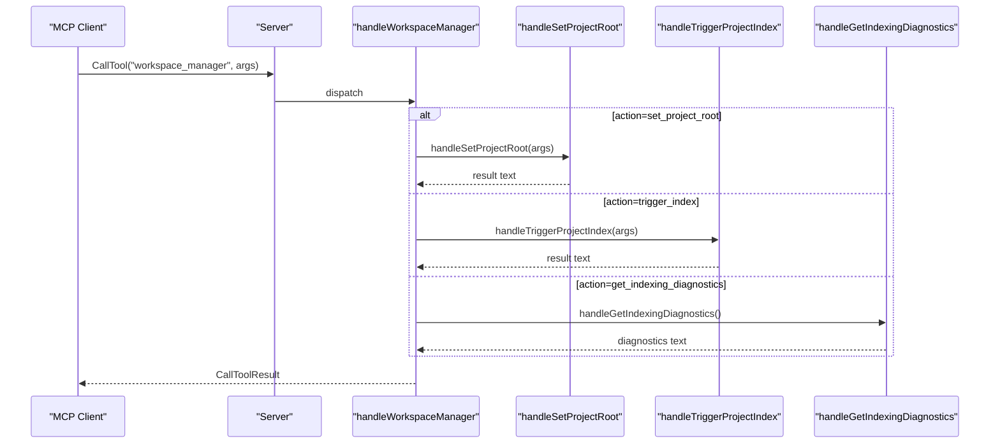
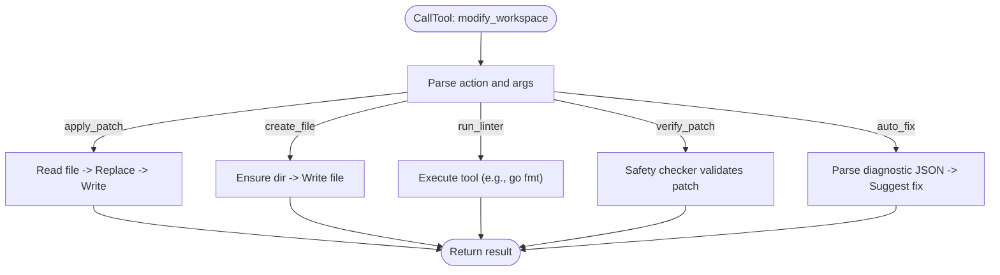
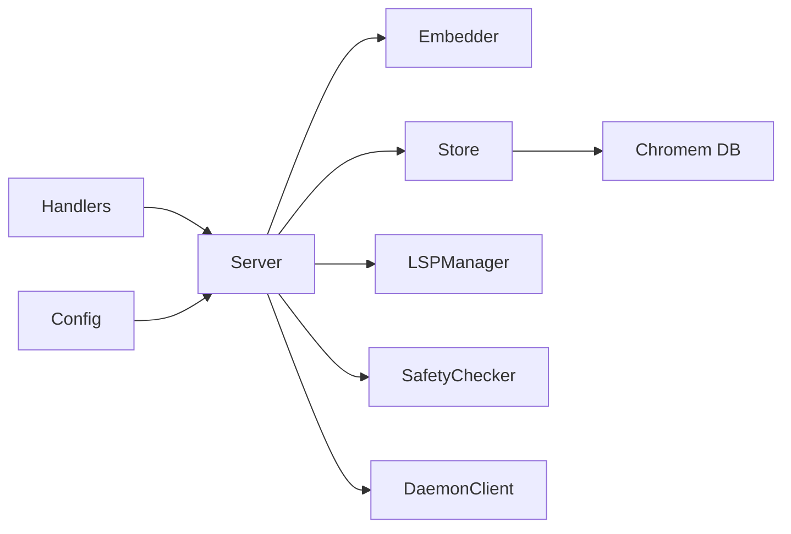

# MCP Protocol Implementation

<cite>
**Referenced Files in This Document**
- [main.go](file://main.go)
- [server.go](file://internal/mcp/server.go)
- [handlers_search.go](file://internal/mcp/handlers_search.go)
- [handlers_lsp.go](file://internal/mcp/handlers_lsp.go)
- [handlers_analysis.go](file://internal/mcp/handlers_analysis.go)
- [handlers_project.go](file://internal/mcp/handlers_project.go)
- [handlers_mutation.go](file://internal/mcp/handlers_mutation.go)
- [handlers_analysis_extended.go](file://internal/mcp/handlers_analysis_extended.go)
- [handlers_context.go](file://internal/mcp/handlers_context.go)
- [handlers_distill.go](file://internal/mcp/handlers_distill.go)
- [handlers_graph.go](file://internal/mcp/handlers_graph.go)
- [handlers_index.go](file://internal/mcp/handlers_index.go)
- [handlers_safety.go](file://internal/mcp/handlers_safety.go)
- [config.go](file://internal/config/config.go)
- [store.go](file://internal/db/store.go)
- [client.go](file://internal/lsp/client.go)
- [mcp-config.json.example](file://mcp-config.json.example)
</cite>

## Table of Contents
1. [Introduction](#introduction)
2. [Project Structure](#project-structure)
3. [Core Components](#core-components)
4. [Architecture Overview](#architecture-overview)
5. [Detailed Component Analysis](#detailed-component-analysis)
6. [Dependency Analysis](#dependency-analysis)
7. [Performance Considerations](#performance-considerations)
8. [Troubleshooting Guide](#troubleshooting-guide)
9. [Conclusion](#conclusion)
10. [Appendices](#appendices)

## Introduction
This document describes the Model Context Protocol (MCP) server implementation for Vector MCP Go. It covers the server lifecycle, tool registration, request/response handling patterns, and the five core tools that power unified search, Language Server Protocol (LSP) integration, AST-based code analysis, project lifecycle management, and safe workspace mutation. It also documents API specifications, parameter schemas, response formats, error handling, resource management, security considerations, authentication mechanisms, and performance optimization strategies.

## Project Structure
Vector MCP Go organizes MCP-related logic under internal/mcp, with supporting subsystems for configuration, database storage, embedding, indexing, LSP, mutation safety, and utilities. The main entrypoint initializes configuration, embedder pools, stores, and the MCP server, then serves requests over stdio.

```mermaid
graph TB
A["main.go<br/>Application bootstrap"] --> B["internal/mcp/server.go<br/>MCP Server"]
B --> C["internal/mcp/handlers_search.go<br/>search_workspace"]
B --> D["internal/mcp/handlers_lsp.go<br/>lsp_query"]
B --> E["internal/mcp/handlers_analysis.go<br/>analyze_code"]
B --> F["internal/mcp/handlers_project.go<br/>workspace_manager"]
B --> G["internal/mcp/handlers_mutation.go<br/>modify_workspace"]
B --> H["internal/mcp/handlers_index.go<br/>index_status, trigger_project_index"]
B --> I["internal/mcp/handlers_context.go<br/>store_context, delete_context"]
B --> J["internal/mcp/handlers_distill.go<br/>distill_package_purpose"]
B --> K["internal/mcp/handlers_graph.go<br/>graph helpers"]
B --> L["internal/mcp/handlers_analysis_extended.go<br/>impact analysis"]
B --> M["internal/mcp/handlers_safety.go<br/>patch verification, auto-fix"]
N["internal/config/config.go<br/>Config"] --> B
O["internal/db/store.go<br/>Vector DB"] --> B
P["internal/lsp/client.go<br/>LSP Manager"] --> B
```

**Diagram sources**
- [main.go:88-176](file://main.go#L88-L176)
- [server.go:86-117](file://internal/mcp/server.go#L86-L117)
- [handlers_search.go:315-365](file://internal/mcp/handlers_search.go#L315-L365)
- [handlers_lsp.go:128-154](file://internal/mcp/handlers_lsp.go#L128-L154)
- [handlers_analysis.go:21-224](file://internal/mcp/handlers_analysis.go#L21-L224)
- [handlers_project.go:134-161](file://internal/mcp/handlers_project.go#L134-L161)
- [handlers_mutation.go:93-153](file://internal/mcp/handlers_mutation.go#L93-L153)
- [handlers_index.go:16-38](file://internal/mcp/handlers_index.go#L16-L38)
- [handlers_context.go:14-64](file://internal/mcp/handlers_context.go#L14-L64)
- [handlers_distill.go:11-31](file://internal/mcp/handlers_distill.go#L11-L31)
- [handlers_graph.go:10-57](file://internal/mcp/handlers_graph.go#L10-L57)
- [handlers_analysis_extended.go:12-82](file://internal/mcp/handlers_analysis_extended.go#L12-L82)
- [handlers_safety.go:13-58](file://internal/mcp/handlers_safety.go#L13-L58)
- [config.go:30-130](file://internal/config/config.go#L30-L130)
- [store.go:19-64](file://internal/db/store.go#L19-L64)
- [client.go:36-117](file://internal/lsp/client.go#L36-L117)

**Section sources**
- [main.go:88-176](file://main.go#L88-L176)
- [server.go:86-117](file://internal/mcp/server.go#L86-L117)

## Core Components
- MCP Server: Registers tools, resources, and prompts; routes requests; manages LSP sessions; coordinates with vector store and embedder.
- Tool Handlers: Implement the five core tools and auxiliary operations.
- Configuration: Loads environment variables and sets defaults for paths, model names, dimensions, and operational toggles.
- Vector Store: Persistent Chromem-backed collection for embeddings and metadata.
- LSP Manager: Manages language server processes per workspace root and file extension.
- Mutation Safety: Verifies patches and suggests fixes using LSP diagnostics.

**Section sources**
- [server.go:66-117](file://internal/mcp/server.go#L66-L117)
- [config.go:13-28](file://internal/config/config.go#L13-L28)
- [store.go:19-64](file://internal/db/store.go#L19-L64)
- [client.go:36-117](file://internal/lsp/client.go#L36-L117)

## Architecture Overview
The MCP server is a thin wrapper around the mcp-go server that registers tools and resources, and delegates to specialized handlers. It integrates with:
- Embedding engine for semantic search and reranking
- Vector database for persistent storage and retrieval
- LSP manager for precise symbol queries
- Mutation safety checker for guarded workspace changes
- Daemon client for distributed operation (master/slave)

**Diagram sources**
- [server.go:86-117](file://internal/mcp/server.go#L86-L117)
- [main.go:112-154](file://main.go#L112-L154)
- [client.go:36-117](file://internal/lsp/client.go#L36-L117)

## Detailed Component Analysis

### Model Context Protocol Server
The MCP server initializes the underlying mcp-go server, registers resources, prompts, and tools, and maintains shared state for LSP sessions, memory throttling, and mutation safety.

**Diagram sources**
- [server.go:66-117](file://internal/mcp/server.go#L66-L117)

**Section sources**
- [server.go:86-117](file://internal/mcp/server.go#L86-L117)

### Five Core Tools

#### search_workspace
Unified search across semantic, lexical, and graph contexts, plus index status.

- Action: vector | regex | graph | index_status
- Parameters:
  - action (string, required)
  - query (string)
  - limit (number)
  - path (string)
- Responses:
  - Text result summarizing matches
  - Error result for invalid action or failures
- Behavior:
  - vector: semantic search with hybrid search and optional reranking
  - regex: filesystem grep with regex support and include pattern
  - graph: interface implementations lookup
  - index_status: current indexing progress

**Diagram sources**
- [handlers_search.go:315-365](file://internal/mcp/handlers_search.go#L315-L365)
- [handlers_search.go:191-313](file://internal/mcp/handlers_search.go#L191-L313)
- [handlers_search.go:20-189](file://internal/mcp/handlers_search.go#L20-L189)
- [handlers_graph.go:10-31](file://internal/mcp/handlers_graph.go#L10-L31)
- [handlers_index.go:96-127](file://internal/mcp/handlers_index.go#L96-L127)

**Section sources**
- [server.go:331-338](file://internal/mcp/server.go#L331-L338)
- [handlers_search.go:315-365](file://internal/mcp/handlers_search.go#L315-L365)
- [handlers_search.go:191-313](file://internal/mcp/handlers_search.go#L191-L313)
- [handlers_search.go:20-189](file://internal/mcp/handlers_search.go#L20-L189)
- [handlers_graph.go:10-31](file://internal/mcp/handlers_graph.go#L10-L31)
- [handlers_index.go:96-127](file://internal/mcp/handlers_index.go#L96-L127)

#### lsp_query
High-precision LSP integration for definitions, references, type hierarchy, and impact analysis.

- Action: definition | references | type_hierarchy | impact_analysis
- Parameters:
  - action (string, required)
  - path (string, required)
  - line (number, required)
  - character (number, required)
- Responses:
  - Text result with locations or analysis summary
  - Error result for invalid action or LSP failures
- Behavior:
  - Resolves LSP session per workspace root and file extension
  - Executes LSP methods and returns structured results

**Diagram sources**
- [handlers_lsp.go:128-154](file://internal/mcp/handlers_lsp.go#L128-L154)
- [handlers_lsp.go:19-53](file://internal/mcp/handlers_lsp.go#L19-L53)
- [handlers_lsp.go:55-95](file://internal/mcp/handlers_lsp.go#L55-L95)
- [handlers_lsp.go:97-126](file://internal/mcp/handlers_lsp.go#L97-L126)
- [handlers_analysis_extended.go:12-82](file://internal/mcp/handlers_analysis_extended.go#L12-L82)
- [client.go:146-200](file://internal/lsp/client.go#L146-L200)

**Section sources**
- [server.go:347-354](file://internal/mcp/server.go#L347-L354)
- [handlers_lsp.go:128-154](file://internal/mcp/handlers_lsp.go#L128-L154)
- [handlers_analysis_extended.go:12-82](file://internal/mcp/handlers_analysis_extended.go#L12-L82)
- [client.go:146-200](file://internal/lsp/client.go#L146-L200)

#### analyze_code
AST-based and metadata-driven analysis for related context, duplicates, dead code, dependencies, and architecture.

- Action: ast_skeleton | get_related_context | find_duplicate_code | find_dead_code | check_dependency_health | analyze_architecture | generate_docstring_prompt
- Parameters vary by action; common include path filters and token limits.
- Responses:
  - Text result with structured context or analysis
  - Error result for missing inputs or failures
- Behavior:
  - Uses vector store metadata (symbols, relationships, calls)
  - Leverages lexical and hybrid search
  - Builds Mermaid graphs for architecture

**Diagram sources**
- [handlers_analysis.go:21-224](file://internal/mcp/handlers_analysis.go#L21-L224)
- [handlers_analysis.go:226-311](file://internal/mcp/handlers_analysis.go#L226-L311)
- [handlers_analysis.go:313-472](file://internal/mcp/handlers_analysis.go#L313-L472)
- [handlers_analysis.go:557-634](file://internal/mcp/handlers_analysis.go#L557-L634)
- [handlers_analysis.go:474-555](file://internal/mcp/handlers_analysis.go#L474-L555)

**Section sources**
- [server.go:356-361](file://internal/mcp/server.go#L356-L361)
- [handlers_analysis.go:21-224](file://internal/mcp/handlers_analysis.go#L21-L224)
- [handlers_analysis.go:226-311](file://internal/mcp/handlers_analysis.go#L226-L311)
- [handlers_analysis.go:313-472](file://internal/mcp/handlers_analysis.go#L313-L472)
- [handlers_analysis.go:557-634](file://internal/mcp/handlers_analysis.go#L557-L634)
- [handlers_analysis.go:474-555](file://internal/mcp/handlers_analysis.go#L474-L555)

#### workspace_manager
Project lifecycle and indexing control.

- Action: set_project_root | trigger_index | get_indexing_diagnostics
- Parameters:
  - action (string, required)
  - path (string) for set_project_root and trigger_index
- Responses:
  - Text result indicating status or diagnostics
  - Error result for invalid action or failures

**Diagram sources**
- [handlers_project.go:134-161](file://internal/mcp/handlers_project.go#L134-L161)
- [handlers_project.go:16-132](file://internal/mcp/handlers_project.go#L16-L132)
- [handlers_index.go:16-38](file://internal/mcp/handlers_index.go#L16-L38)
- [handlers_index.go:129-169](file://internal/mcp/handlers_index.go#L129-L169)

**Section sources**
- [server.go:340-345](file://internal/mcp/server.go#L340-L345)
- [handlers_project.go:134-161](file://internal/mcp/handlers_project.go#L134-L161)
- [handlers_index.go:16-38](file://internal/mcp/handlers_index.go#L16-L38)
- [handlers_index.go:129-169](file://internal/mcp/handlers_index.go#L129-L169)

#### modify_workspace
Safe file mutation operations with integrity checks.

- Action: apply_patch | create_file | run_linter | verify_patch | auto_fix
- Parameters:
  - action (string, required)
  - path (string)
  - content (string)
  - search (string)
  - replace (string)
  - tool (string)
  - diagnostic_json (string)
- Responses:
  - Text result confirming operation or listing issues
  - Error result for invalid action or failures
- Behavior:
  - apply_patch: read file, replace, write
  - create_file: ensure directory, write content
  - run_linter: currently supports "go fmt"
  - verify_patch: uses safety checker to validate changes
  - auto_fix: interprets diagnostic JSON and suggests fixes

**Diagram sources**
- [handlers_mutation.go:93-153](file://internal/mcp/handlers_mutation.go#L93-L153)
- [handlers_mutation.go:13-44](file://internal/mcp/handlers_mutation.go#L13-L44)
- [handlers_mutation.go:66-91](file://internal/mcp/handlers_mutation.go#L66-L91)
- [handlers_mutation.go:46-64](file://internal/mcp/handlers_mutation.go#L46-L64)
- [handlers_safety.go:13-58](file://internal/mcp/handlers_safety.go#L13-L58)

**Section sources**
- [server.go:363-372](file://internal/mcp/server.go#L363-L372)
- [handlers_mutation.go:93-153](file://internal/mcp/handlers_mutation.go#L93-L153)
- [handlers_safety.go:13-58](file://internal/mcp/handlers_safety.go#L13-L58)

### Additional Tools and Utilities
- index_status: Returns current indexing progress and background tasks.
- trigger_project_index: Starts background indexing for a project path.
- get_related_context: Retrieves semantically related code and dependency context for a file.
- store_context: Stores free-form text as shared knowledge with embedding.
- delete_context: Removes context by path or clears project index.
- distill_package_purpose: Summarizes package intent and re-indexes with priority.
- trace_data_flow: Traverses graph usage for a symbol.

**Section sources**
- [handlers_index.go:96-127](file://internal/mcp/handlers_index.go#L96-L127)
- [handlers_index.go:16-38](file://internal/mcp/handlers_index.go#L16-L38)
- [handlers_analysis.go:21-224](file://internal/mcp/handlers_analysis.go#L21-L224)
- [handlers_context.go:34-64](file://internal/mcp/handlers_context.go#L34-L64)
- [handlers_distill.go:11-31](file://internal/mcp/handlers_distill.go#L11-L31)
- [handlers_graph.go:33-57](file://internal/mcp/handlers_graph.go#L33-L57)

## Dependency Analysis
- Server depends on:
  - Embedder for semantic operations
  - Vector Store for persistence and retrieval
  - LSP Manager for symbol queries
  - Mutation Safety Checker for guarded changes
  - Daemon Client for distributed indexing
- Handlers depend on Server’s store getter, embedder, and graph
- Configuration drives model selection, dimensions, and operational toggles

**Diagram sources**
- [server.go:66-117](file://internal/mcp/server.go#L66-L117)
- [config.go:30-130](file://internal/config/config.go#L30-L130)
- [store.go:19-64](file://internal/db/store.go#L19-L64)
- [client.go:36-117](file://internal/lsp/client.go#L36-L117)

**Section sources**
- [server.go:66-117](file://internal/mcp/server.go#L66-L117)
- [config.go:30-130](file://internal/config/config.go#L30-L130)
- [store.go:19-64](file://internal/db/store.go#L19-L64)
- [client.go:36-117](file://internal/lsp/client.go#L36-L117)

## Performance Considerations
- Embedding and reranking:
  - Batch operations are supported by the embedder pool abstraction.
  - Reranking is applied only when multiple candidates exist.
- Concurrency:
  - Filesystem grep uses a fixed worker pool and bounded channel buffers.
  - Duplicate detection parallelizes per-chunk searches with a semaphore.
- Memory management:
  - LSP manager enforces memory throttling before starting language servers.
  - Memory throttler is shared across components.
- Token limits:
  - Context assembly respects configurable token budgets and truncates safely.
- Indexing:
  - Background indexing queue and progress map enable asynchronous processing.
  - Slave instances delegate work to the master daemon.

[No sources needed since this section provides general guidance]

## Troubleshooting Guide
- Invalid tool name: CallTool returns an error when a tool is not registered.
- LSP startup failures: Ensure language server commands are available and memory throttling conditions are met.
- Dimension mismatch: Vector database probes enforce consistent embedding dimensions; recreate DB if models change.
- Indexing stuck: Check background progress via index_status and diagnostics; verify watcher and worker are running.
- Patch verification issues: Use verify_patch to detect compiler errors; auto_fix to suggest remediation.

**Section sources**
- [server.go:431-444](file://internal/mcp/server.go#L431-L444)
- [client.go:66-117](file://internal/lsp/client.go#L66-L117)
- [store.go:51-61](file://internal/db/store.go#L51-L61)
- [handlers_index.go:96-169](file://internal/mcp/handlers_index.go#L96-L169)
- [handlers_safety.go:13-58](file://internal/mcp/handlers_safety.go#L13-L58)

## Conclusion
Vector MCP Go provides a robust MCP server implementation with integrated semantic search, LSP-powered precision, AST-aware analysis, project lifecycle management, and safe workspace mutation. Its modular design, strong resource management, and distributed operation modes make it suitable for large-scale codebases and agent-driven workflows.

[No sources needed since this section summarizes without analyzing specific files]

## Appendices

### API Specifications and Parameter Schemas
- search_workspace
  - action: "vector" | "regex" | "graph" | "index_status"
  - query: string
  - limit: number
  - path: string
- lsp_query
  - action: "definition" | "references" | "type_hierarchy" | "impact_analysis"
  - path: string
  - line: number
  - character: number
- analyze_code
  - action: "get_related_context" | "find_duplicate_code" | "find_dead_code" | "check_dependency_health" | "analyze_architecture" | "generate_docstring_prompt"
  - Additional parameters per action (e.g., filePath, target_path, directory_path, max_tokens)
- workspace_manager
  - action: "set_project_root" | "trigger_index" | "get_indexing_diagnostics"
  - path: string
- modify_workspace
  - action: "apply_patch" | "create_file" | "run_linter" | "verify_patch" | "auto_fix"
  - path: string
  - content: string
  - search: string
  - replace: string
  - tool: string
  - diagnostic_json: string

**Section sources**
- [server.go:331-372](file://internal/mcp/server.go#L331-L372)

### Response Formats
- Text responses: Human-readable summaries, lists, or structured context.
- Error responses: Single-field error messages for invalid inputs or failures.
- Notifications: Logging-level notifications sent to clients for progress and diagnostics.

**Section sources**
- [handlers_search.go:178-188](file://internal/mcp/handlers_search.go#L178-L188)
- [handlers_mutation.go:13-44](file://internal/mcp/handlers_mutation.go#L13-L44)
- [server.go:409-429](file://internal/mcp/server.go#L409-L429)

### Security Considerations
- Authentication: No explicit authentication mechanism is implemented in the MCP server; operate behind trusted environments or gateways.
- Authorization: Workspace mutations are constrained by safety checks; verify patches before applying.
- Resource isolation: LSP servers are started per workspace root; memory throttling prevents excessive consumption.

**Section sources**
- [handlers_safety.go:13-58](file://internal/mcp/handlers_safety.go#L13-L58)
- [client.go:66-117](file://internal/lsp/client.go#L66-L117)

### Integration Examples
- MCP client configuration example:
  - Command path and environment variables for ONNX runtime are provided in the example configuration.

**Section sources**
- [mcp-config.json.example:1-12](file://mcp-config.json.example#L1-L12)