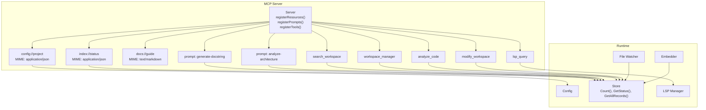
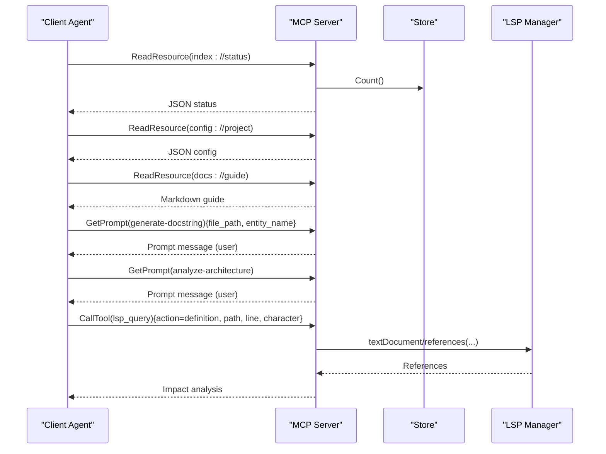
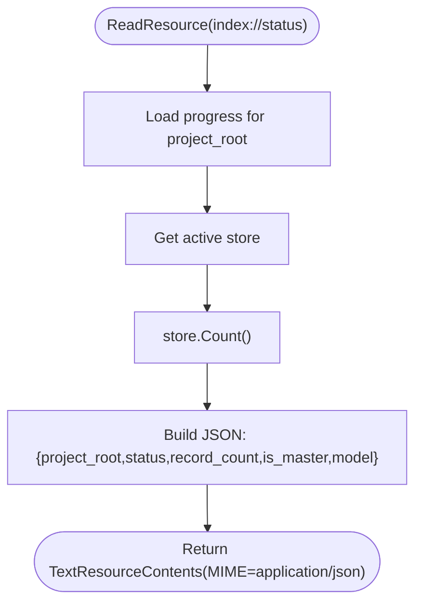
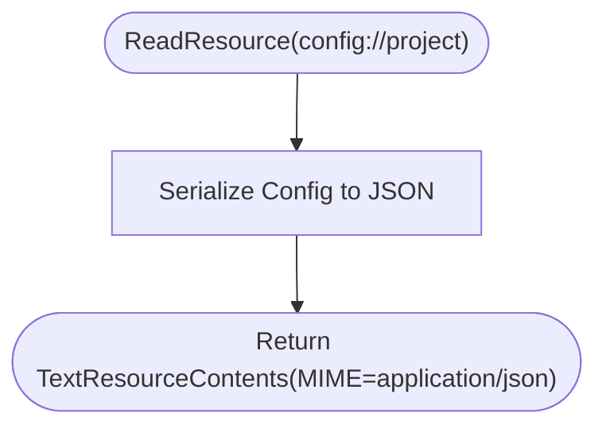
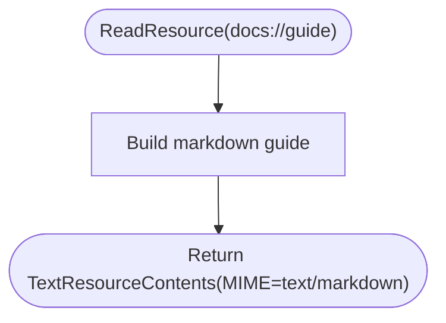
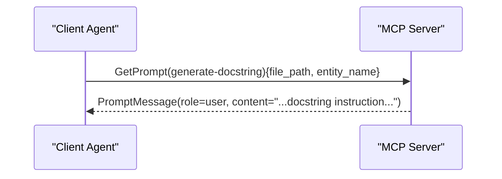
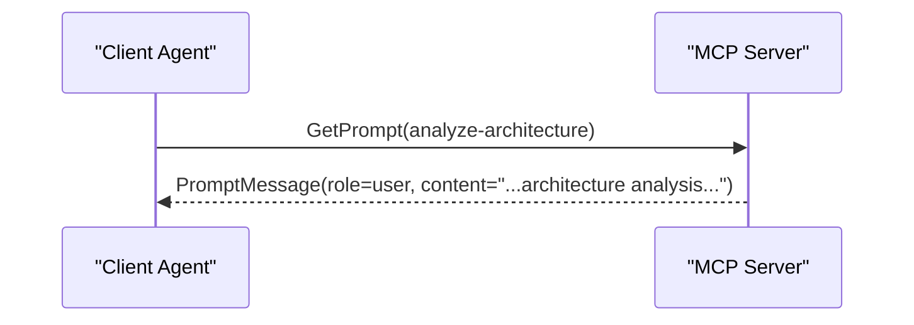
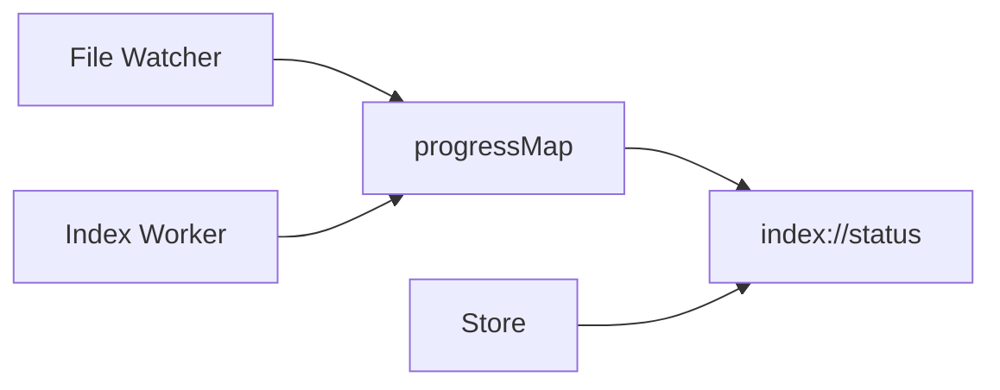
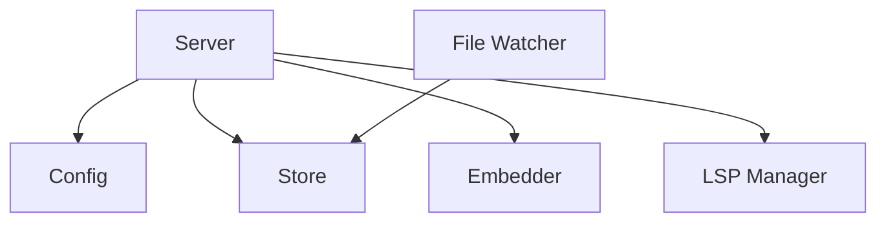

# MCP Resources and Prompts

<cite>
**Referenced Files in This Document**
- [server.go](file://internal/mcp/server.go)
- [handlers_index.go](file://internal/mcp/handlers_index.go)
- [handlers_project.go](file://internal/mcp/handlers_project.go)
- [handlers_analysis.go](file://internal/mcp/handlers_analysis.go)
- [handlers_analysis_extended.go](file://internal/mcp/handlers_analysis_extended.go)
- [main.go](file://main.go)
- [config.go](file://internal/config/config.go)
- [store.go](file://internal/db/store.go)
- [watcher.go](file://internal/watcher/watcher.go)
- [README.md](file://README.md)
- [mcp-config.json.example](file://mcp-config.json.example)
</cite>

## Table of Contents
1. [Introduction](#introduction)
2. [Project Structure](#project-structure)
3. [Core Components](#core-components)
4. [Architecture Overview](#architecture-overview)
5. [Detailed Component Analysis](#detailed-component-analysis)
6. [Dependency Analysis](#dependency-analysis)
7. [Performance Considerations](#performance-considerations)
8. [Troubleshooting Guide](#troubleshooting-guide)
9. [Conclusion](#conclusion)
10. [Appendices](#appendices)

## Introduction
This document explains the MCP resources and prompts system in Vector MCP Go. It focuses on:
- Three core resources: index://status for indexing telemetry, config://project for runtime configuration, and docs://guide for usage instructions
- Two key prompts: generate-docstring for documentation generation and analyze-architecture for system analysis
- Resource registration, MIME type handling, and dynamic content generation
- Prompt argument system, message formatting, and integration with AI agents
- Examples of resource consumption, prompt usage, and client integration patterns
- Resource lifecycle, content caching, and dynamic updates based on server state

## Project Structure
Vector MCP Go exposes an MCP server that registers resources, prompts, and tools. The server orchestrates:
- Resource providers for index status, project config, and usage guide
- Prompt factories for documentation and architecture analysis
- Tools for search, workspace management, LSP queries, code analysis, and mutation
- Integration with a vector database and optional file watcher for live updates

**Diagram sources**
- [server.go:201-332](file://internal/mcp/server.go#L201-L332)
- [handlers_index.go:16-169](file://internal/mcp/handlers_index.go#L16-L169)
- [handlers_project.go:134-161](file://internal/mcp/handlers_project.go#L134-L161)
- [handlers_analysis.go:21-224](file://internal/mcp/handlers_analysis.go#L21-L224)
- [handlers_analysis_extended.go:12-82](file://internal/mcp/handlers_analysis_extended.go#L12-L82)
- [store.go:35-64](file://internal/db/store.go#L35-L64)
- [config.go:13-28](file://internal/config/config.go#L13-L28)

**Section sources**
- [README.md:1-40](file://README.md#L1-L40)
- [server.go:201-332](file://internal/mcp/server.go#L201-L332)

## Core Components
- Resources
  - index://status: JSON resource reporting project root, indexing status, record count, master/slave role, and model name
  - config://project: JSON resource exposing active runtime configuration
  - docs://guide: Markdown resource providing a quick-start guide
- Prompts
  - generate-docstring: User prompt constructed from file path and entity name, with a professional docstring instruction
  - analyze-architecture: User prompt requesting a system-level architecture review
- Tools (for context)
  - search_workspace, workspace_manager, lsp_query, analyze_code, modify_workspace, index_status, trigger_project_index, get_related_context, store_context, delete_context, distill_package_purpose, trace_data_flow

**Section sources**
- [server.go:201-283](file://internal/mcp/server.go#L201-L283)
- [server.go:285-332](file://internal/mcp/server.go#L285-L332)

## Architecture Overview
The MCP server registers resources and prompts at startup. Clients can:
- Read resources by URI and MIME type
- Retrieve prompts by name and arguments
- Invoke tools for search, analysis, and mutation

**Diagram sources**
- [server.go:201-283](file://internal/mcp/server.go#L201-L283)
- [server.go:285-332](file://internal/mcp/server.go#L285-L332)
- [handlers_analysis_extended.go:12-82](file://internal/mcp/handlers_analysis_extended.go#L12-L82)

## Detailed Component Analysis

### Resource: index://status
- Purpose: Provide live indexing telemetry for health checks and agent orchestration
- MIME type: application/json
- Dynamic content generation:
  - Reads current indexing status from a thread-safe progress map keyed by project root
  - Queries the store for total record count
  - Includes whether the instance is master, and the active model name
- Lifecycle:
  - Status updates occur via background workers and file watcher
  - The resource reflects the latest state on read

**Diagram sources**
- [server.go:201-237](file://internal/mcp/server.go#L201-L237)

**Section sources**
- [server.go:201-237](file://internal/mcp/server.go#L201-L237)

### Resource: config://project
- Purpose: Expose active runtime configuration used by the server
- MIME type: application/json
- Dynamic content generation:
  - Serializes the current Config object to JSON
- Lifecycle:
  - Reflects the server’s runtime configuration at read time

**Diagram sources**
- [server.go:238-251](file://internal/mcp/server.go#L238-L251)
- [config.go:13-28](file://internal/config/config.go#L13-L28)

**Section sources**
- [server.go:238-251](file://internal/mcp/server.go#L238-L251)
- [config.go:13-28](file://internal/config/config.go#L13-L28)

### Resource: docs://guide
- Purpose: Provide a concise markdown quick-start for client agents and developers
- MIME type: text/markdown
- Dynamic content generation:
  - Returns a static markdown guide describing core resources, recommended prompts, and key tools

**Diagram sources**
- [server.go:252-282](file://internal/mcp/server.go#L252-L282)

**Section sources**
- [server.go:252-282](file://internal/mcp/server.go#L252-L282)

### Prompt: generate-docstring
- Purpose: Generate a highly contextual prompt to write professional documentation for a code entity
- Arguments:
  - file_path (required): Relative path of the file
  - entity_name (required): Name of the function or class to document
- Message formatting:
  - Role: user
  - Content: Text prompt instructing to produce a professional docstring based on context

**Diagram sources**
- [server.go:285-312](file://internal/mcp/server.go#L285-L312)

**Section sources**
- [server.go:285-312](file://internal/mcp/server.go#L285-L312)

### Prompt: analyze-architecture
- Purpose: Produce an architecture-review prompt for system-level reasoning
- Arguments: None
- Message formatting:
  - Role: user
  - Content: Text prompt focusing on package boundaries, dependency flow, and design patterns

**Diagram sources**
- [server.go:313-331](file://internal/mcp/server.go#L313-L331)

**Section sources**
- [server.go:313-331](file://internal/mcp/server.go#L313-L331)

### Resource Registration and MIME Types
- Resources are registered with AddResource and associated MIME types:
  - index://status → application/json
  - config://project → application/json
  - docs://guide → text/markdown
- Prompts are registered with AddPrompt and argument schemas:
  - generate-docstring → file_path (required), entity_name (required)
  - analyze-architecture → none

**Section sources**
- [server.go:201-283](file://internal/mcp/server.go#L201-L283)
- [server.go:285-332](file://internal/mcp/server.go#L285-L332)

### Dynamic Content Generation and Updates
- index://status:
  - Progress status comes from a shared progress map keyed by project root
  - Record count is fetched from the store
  - Master/slave status depends on whether a remote store is configured
- Live updates:
  - Background workers and file watcher update the progress map and store
  - The resource reflects the latest state on read

**Diagram sources**
- [server.go:201-237](file://internal/mcp/server.go#L201-L237)
- [watcher.go:146-165](file://internal/watcher/watcher.go#L146-L165)
- [main.go:178-202](file://main.go#L178-L202)

**Section sources**
- [server.go:201-237](file://internal/mcp/server.go#L201-L237)
- [watcher.go:146-165](file://internal/watcher/watcher.go#L146-L165)
- [main.go:178-202](file://main.go#L178-L202)

### Prompt Argument System and Message Formatting
- Arguments are validated and extracted from the GetPromptRequest.Params.Arguments map
- Messages are returned as PromptMessage with role user and text content
- Integration with AI agents:
  - Clients can embed the returned messages into their chat context
  - The server does not execute the prompts; it constructs them deterministically

**Section sources**
- [server.go:285-332](file://internal/mcp/server.go#L285-L332)

### Client Integration Patterns
- Reading resources:
  - Use ReadResource with URIs index://status, config://project, docs://guide
  - Respect MIME types for parsing (application/json vs text/markdown)
- Retrieving prompts:
  - Use GetPrompt with prompt names and required arguments
  - Embed the returned user message into the agent’s conversation
- Example flows:
  - Agent checks index status via index://status before invoking tools
  - Agent requests generate-docstring for a specific entity and uses the returned prompt to generate documentation
  - Agent requests analyze-architecture to get a system overview prompt

**Section sources**
- [server.go:201-283](file://internal/mcp/server.go#L201-L283)
- [server.go:285-332](file://internal/mcp/server.go#L285-L332)

## Dependency Analysis
- Server composes:
  - Config for runtime settings
  - Store for vector operations and counts
  - Embedder for embeddings
  - LSP Manager for symbol queries
  - File watcher for live updates
- Resource and prompt lifecycles depend on:
  - progressMap for indexing status
  - store.Count() for record counts
  - store.GetStatus() for background status
  - master/slave configuration affecting remote store usage

**Diagram sources**
- [server.go:67-86](file://internal/mcp/server.go#L67-L86)
- [config.go:13-28](file://internal/config/config.go#L13-L28)
- [store.go:35-64](file://internal/db/store.go#L35-L64)
- [main.go:178-202](file://main.go#L178-L202)

**Section sources**
- [server.go:67-86](file://internal/mcp/server.go#L67-L86)
- [config.go:13-28](file://internal/config/config.go#L13-L28)
- [store.go:35-64](file://internal/db/store.go#L35-L64)
- [main.go:178-202](file://main.go#L178-L202)

## Performance Considerations
- Resource reads are lightweight:
  - index://status performs a map lookup and a store count
  - config://project serializes the config object
  - docs://guide returns a static markdown string
- Prompt construction is deterministic and fast:
  - Uses argument extraction and string formatting
- Live updates:
  - File watcher and workers update state asynchronously
  - Resource reads reflect the latest state without blocking

[No sources needed since this section provides general guidance]

## Troubleshooting Guide
- index://status shows unexpected idle or stale status:
  - Verify background workers and file watcher are active
  - Confirm progressMap updates and store.Count() reflect recent indexing
- config://project appears outdated:
  - Ensure the server was started with the intended configuration
  - Check environment variables and CLI flags affecting runtime settings
- docs://guide not found:
  - Confirm the resource is registered and reachable by the client
- Prompt generation fails:
  - Ensure required arguments (file_path, entity_name) are provided for generate-docstring
- Integration with agents:
  - Use the provided example configuration to launch the server as an MCP server
  - Reference the MCP configuration example for client setup

**Section sources**
- [server.go:201-283](file://internal/mcp/server.go#L201-L283)
- [server.go:285-332](file://internal/mcp/server.go#L285-L332)
- [mcp-config.json.example:1-12](file://mcp-config.json.example#L1-L12)

## Conclusion
Vector MCP Go’s MCP resources and prompts system provides deterministic, client-driven assistance:
- Resources deliver live indexing telemetry, runtime configuration, and usage guidance
- Prompts scaffold high-quality documentation and architecture analysis
- The server integrates seamlessly with AI agents via standard MCP operations

[No sources needed since this section summarizes without analyzing specific files]

## Appendices

### Appendix A: Resource and Prompt Reference
- index://status
  - MIME: application/json
  - Fields: project_root, status, record_count, is_master, model
- config://project
  - MIME: application/json
  - Content: Serialized Config object
- docs://guide
  - MIME: text/markdown
  - Content: Quick-start guide
- generate-docstring
  - Arguments: file_path (required), entity_name (required)
  - Role: user
- analyze-architecture
  - Arguments: none
  - Role: user

**Section sources**
- [server.go:201-283](file://internal/mcp/server.go#L201-L283)
- [server.go:285-332](file://internal/mcp/server.go#L285-L332)

### Appendix B: Client Launch and Configuration
- Launch the server as an MCP server using the provided configuration example
- Environment variables and CLI flags influence runtime behavior and model selection

**Section sources**
- [mcp-config.json.example:1-12](file://mcp-config.json.example#L1-L12)
- [main.go:280-317](file://main.go#L280-L317)