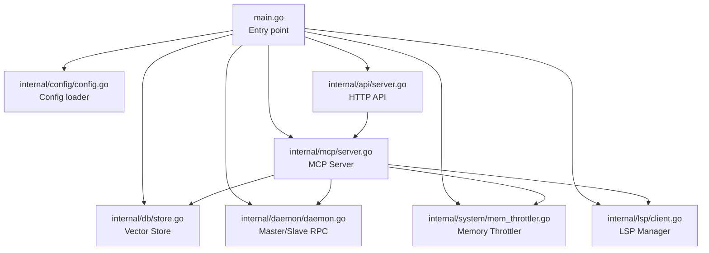
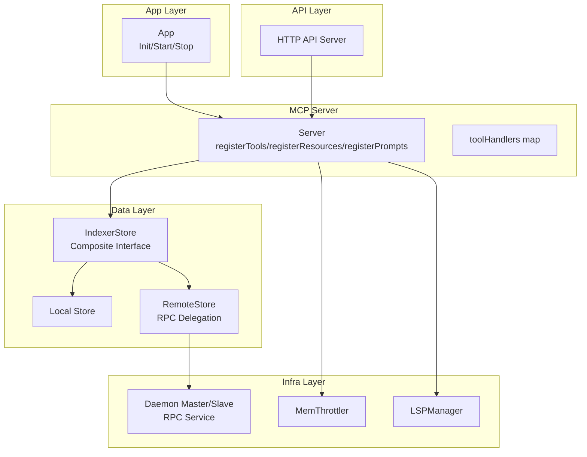
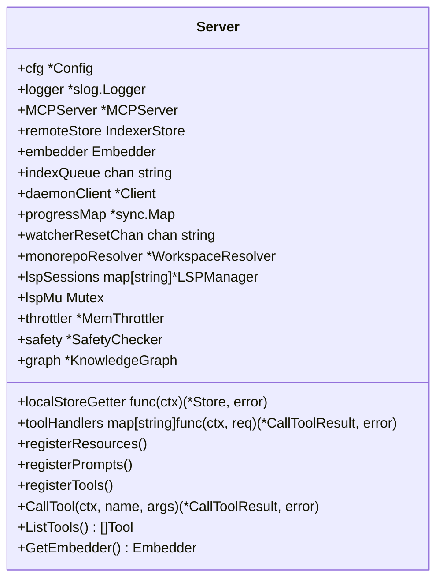
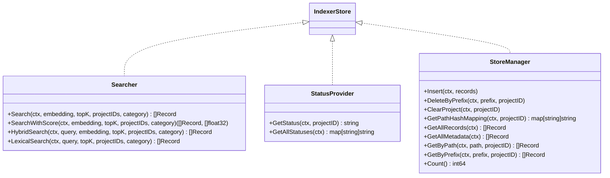
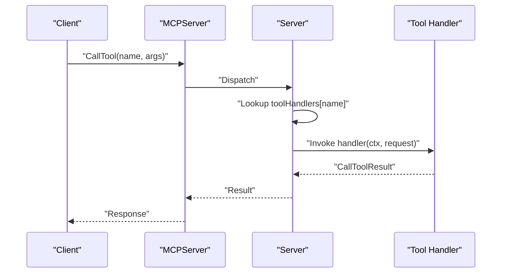
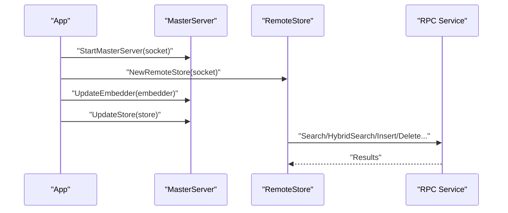
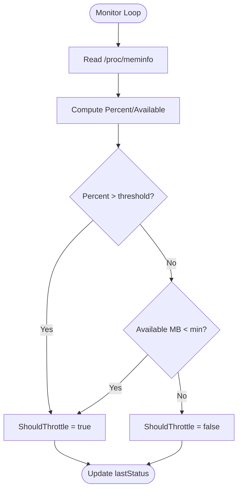
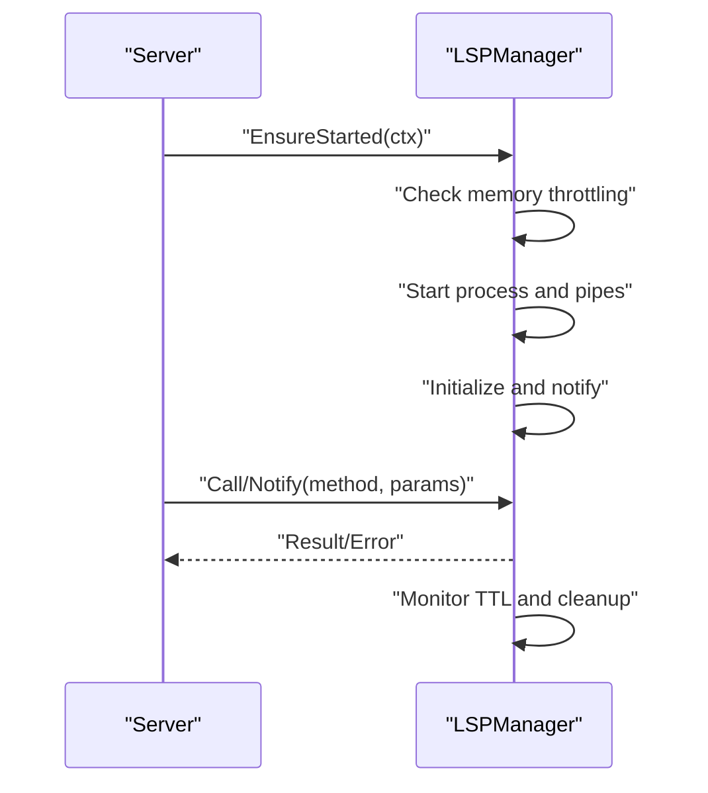
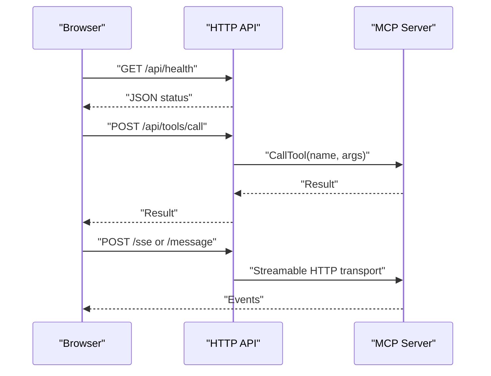
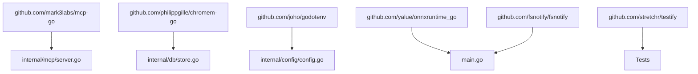

# MCP Server Architecture

<cite>
**Referenced Files in This Document**
- [main.go](file://main.go)
- [server.go](file://internal/mcp/server.go)
- [config.go](file://internal/config/config.go)
- [store.go](file://internal/db/store.go)
- [daemon.go](file://internal/daemon/daemon.go)
- [mem_throttler.go](file://internal/system/mem_throttler.go)
- [client.go](file://internal/lsp/client.go)
- [handlers_search.go](file://internal/mcp/handlers_search.go)
- [handlers_mutation.go](file://internal/mcp/handlers_mutation.go)
- [handlers_lsp.go](file://internal/mcp/handlers_lsp.go)
- [handlers_analysis.go](file://internal/mcp/handlers_analysis.go)
- [server.go](file://internal/api/server.go)
- [mcp-config.json.example](file://mcp-config.json.example)
- [go.mod](file://go.mod)
</cite>

## Table of Contents
1. [Introduction](#introduction)
2. [Project Structure](#project-structure)
3. [Core Components](#core-components)
4. [Architecture Overview](#architecture-overview)
5. [Detailed Component Analysis](#detailed-component-analysis)
6. [Dependency Analysis](#dependency-analysis)
7. [Performance Considerations](#performance-considerations)
8. [Troubleshooting Guide](#troubleshooting-guide)
9. [Conclusion](#conclusion)
10. [Appendices](#appendices)

## Introduction
This document explains the MCP server architecture in Vector MCP Go. It covers the Server struct design, tool registration system, request routing mechanisms, and the composite interfaces that enable flexible database implementations. It also documents server initialization, configuration management, component dependencies, master-slave architecture via remote store delegation, memory throttling integration, and LSP session management. Architectural patterns such as dependency injection, thread-safe maps, and factory methods are highlighted with practical examples and diagrams.

## Project Structure
The project is organized around a layered architecture:
- Entry point initializes configuration, components, and servers.
- MCP server module provides the core protocol server, tool registry, and handlers.
- Database module encapsulates the vector store and composite interfaces.
- Daemon module implements master-slave RPC for distributed operation.
- System and LSP modules integrate memory throttling and language server sessions.
- API module exposes HTTP endpoints for MCP transport and tool management.

**Diagram sources**
- [main.go:280-317](file://main.go#L280-L317)
- [server.go:86-117](file://internal/mcp/server.go#L86-L117)
- [config.go:30-129](file://internal/config/config.go#L30-L129)
- [store.go:35-64](file://internal/db/store.go#L35-L64)
- [daemon.go:333-378](file://internal/daemon/daemon.go#L333-L378)
- [mem_throttler.go:30-44](file://internal/system/mem_throttler.go#L30-L44)
- [client.go:54-64](file://internal/lsp/client.go#L54-L64)
- [server.go:110-117](file://internal/api/server.go#L110-L117)

**Section sources**
- [main.go:280-317](file://main.go#L280-L317)
- [server.go:86-117](file://internal/mcp/server.go#L86-L117)
- [config.go:30-129](file://internal/config/config.go#L30-L129)
- [store.go:35-64](file://internal/db/store.go#L35-L64)
- [daemon.go:333-378](file://internal/daemon/daemon.go#L333-L378)
- [mem_throttler.go:30-44](file://internal/system/mem_throttler.go#L30-L44)
- [client.go:54-64](file://internal/lsp/client.go#L54-L64)
- [server.go:110-117](file://internal/api/server.go#L110-L117)

## Core Components
- App orchestrates lifecycle, stores, and subsystems.
- MCP Server manages protocol, tool registration, resource/prompts, and handler dispatch.
- Vector Store implements Searcher, StatusProvider, StoreManager, and IndexerStore.
- Daemon provides master-slave RPC with RemoteEmbedder and RemoteStore.
- Memory Throttler integrates system memory monitoring and LSP gating.
- LSP Manager handles language server lifecycle and JSON-RPC transport.
- HTTP API wraps MCP transport and exposes tool management endpoints.

**Section sources**
- [main.go:37-71](file://main.go#L37-L71)
- [server.go:66-84](file://internal/mcp/server.go#L66-L84)
- [store.go:19-25](file://internal/db/store.go#L19-L25)
- [daemon.go:17-23](file://internal/daemon/daemon.go#L17-L23)
- [mem_throttler.go:21-28](file://internal/system/mem_throttler.go#L21-L28)
- [client.go:36-52](file://internal/lsp/client.go#L36-L52)
- [server.go:24-31](file://internal/api/server.go#L24-L31)

## Architecture Overview
The MCP server uses a modular design:
- Dependency Injection: The App constructs the MCP Server with injected dependencies (config, logger, store getter, embedder, queues, daemon client, progress map, resolver, throttler).
- Composite Interfaces: IndexerStore unifies Searcher, StatusProvider, and StoreManager for interchangeable local/remote implementations.
- Master-Slave RPC: RemoteStore and RemoteEmbedder delegate operations to the master daemon over Unix sockets.
- LSP Integration: Thread-safe LSPManager per workspace root with memory throttling and TTL-based lifecycle.
- HTTP API: Streamable HTTP transport for MCP and tool management endpoints.

**Diagram sources**
- [main.go:93-176](file://main.go#L93-L176)
- [server.go:86-117](file://internal/mcp/server.go#L86-L117)
- [server.go:55-61](file://internal/mcp/server.go#L55-L61)
- [store.go:35-64](file://internal/db/store.go#L35-L64)
- [daemon.go:502-509](file://internal/daemon/daemon.go#L502-L509)
- [daemon.go:326-378](file://internal/daemon/daemon.go#L326-L378)
- [mem_throttler.go:30-44](file://internal/system/mem_throttler.go#L30-L44)
- [client.go:54-64](file://internal/lsp/client.go#L54-L64)
- [server.go:110-117](file://internal/api/server.go#L110-L117)

## Detailed Component Analysis

### Server Struct and Tool Registration
The Server struct centralizes MCP protocol handling:
- Fields include configuration, logger, underlying MCPServer, store getter, remote store, embedder, queues, daemon client, progress map, resolver, LSP sessions, throttler, safety checker, knowledge graph, and tool handlers.
- Tool registration uses a helper to add tools and track handlers in a map for direct invocation.
- Resource and prompt registration expose index status, project config, and usage guide.

**Diagram sources**
- [server.go:66-84](file://internal/mcp/server.go#L66-L84)
- [server.go:324-407](file://internal/mcp/server.go#L324-L407)

**Section sources**
- [server.go:66-117](file://internal/mcp/server.go#L66-L117)
- [server.go:190-272](file://internal/mcp/server.go#L190-L272)
- [server.go:274-321](file://internal/mcp/server.go#L274-L321)
- [server.go:323-407](file://internal/mcp/server.go#L323-L407)

### Composite Interfaces and Flexible Database Implementations
The composite IndexerStore interface enables interchangeable implementations:
- Searcher: vector, lexical, hybrid search, and score retrieval.
- StatusProvider: project status and all statuses.
- StoreManager: insert/delete/clear operations, path mapping, listing records.

**Diagram sources**
- [server.go:28-61](file://internal/mcp/server.go#L28-L61)

**Section sources**
- [server.go:28-61](file://internal/mcp/server.go#L28-L61)
- [store.go:66-486](file://internal/db/store.go#L66-L486)

### Request Routing Mechanisms
Routing occurs through:
- Tool registration map keyed by tool name.
- CallTool dispatches to registered handlers.
- Resource and prompt handlers return content based on current state and configuration.

**Diagram sources**
- [server.go:431-444](file://internal/mcp/server.go#L431-L444)
- [server.go:324-407](file://internal/mcp/server.go#L324-L407)

**Section sources**
- [server.go:431-444](file://internal/mcp/server.go#L431-L444)
- [server.go:323-407](file://internal/mcp/server.go#L323-L407)

### Master-Slave Architecture and Remote Store Delegation
The daemon module implements:
- MasterServer: RPC service exposing embedding, search, insert, delete, status, and metadata operations.
- RemoteEmbedder and RemoteStore: client-side delegators that proxy calls to the master over Unix sockets.
- App initialization detects master presence and configures remote store for slave instances.

**Diagram sources**
- [main.go:93-176](file://main.go#L93-L176)
- [daemon.go:326-378](file://internal/daemon/daemon.go#L326-L378)
- [daemon.go:502-509](file://internal/daemon/daemon.go#L502-L509)
- [daemon.go:401-437](file://internal/daemon/daemon.go#L401-L437)

**Section sources**
- [main.go:93-176](file://main.go#L93-L176)
- [daemon.go:326-378](file://internal/daemon/daemon.go#L326-L378)
- [daemon.go:502-509](file://internal/daemon/daemon.go#L502-L509)
- [daemon.go:401-437](file://internal/daemon/daemon.go#L401-L437)

### Memory Throttling Integration
The MemThrottler monitors system memory and influences:
- LSP startup decisions via CanStartLSP.
- General throttling via ShouldThrottle.
- Background updates and periodic sampling.

**Diagram sources**
- [mem_throttler.go:46-110](file://internal/system/mem_throttler.go#L46-L110)

**Section sources**
- [mem_throttler.go:21-110](file://internal/system/mem_throttler.go#L21-L110)
- [client.go:67-84](file://internal/lsp/client.go#L67-L84)

### LSP Session Management
LSPManager:
- Ensures started state, starts language servers with memory throttling checks.
- Manages JSON-RPC transport, pending requests, and notification handlers.
- Implements TTL-based auto-shutdown and graceful cleanup.

**Diagram sources**
- [server.go:119-148](file://internal/mcp/server.go#L119-L148)
- [client.go:67-117](file://internal/lsp/client.go#L67-L117)
- [client.go:145-206](file://internal/lsp/client.go#L145-L206)
- [client.go:329-347](file://internal/lsp/client.go#L329-L347)

**Section sources**
- [server.go:119-148](file://internal/mcp/server.go#L119-L148)
- [client.go:36-52](file://internal/lsp/client.go#L36-L52)
- [client.go:67-117](file://internal/lsp/client.go#L67-L117)
- [client.go:145-206](file://internal/lsp/client.go#L145-L206)
- [client.go:329-347](file://internal/lsp/client.go#L329-L347)

### Tool Registration Patterns and Examples
Common patterns:
- Fat Tools: Unified tools that route to specialized handlers (e.g., search_workspace, lsp_query, modify_workspace).
- Argument parsing and validation: Handlers extract typed arguments and clamp numeric values.
- Context building: Handlers assemble results respecting token limits and context windows.

Examples by file:
- Search workspace routing: [handlers_search.go:315-365](file://internal/mcp/handlers_search.go#L315-L365)
- LSP query routing: [handlers_lsp.go:128-154](file://internal/mcp/handlers_lsp.go#L128-L154)
- Mutation routing: [handlers_mutation.go:93-153](file://internal/mcp/handlers_mutation.go#L93-L153)

**Section sources**
- [handlers_search.go:315-365](file://internal/mcp/handlers_search.go#L315-L365)
- [handlers_lsp.go:128-154](file://internal/mcp/handlers_lsp.go#L128-L154)
- [handlers_mutation.go:93-153](file://internal/mcp/handlers_mutation.go#L93-L153)

### HTTP API and MCP Transport
The HTTP API:
- Exposes health, search, context, todo endpoints.
- Provides tool management endpoints (list, call, index triggers).
- Wraps MCP transport with Streamable HTTP server and CORS headers.

**Diagram sources**
- [server.go:131-139](file://internal/api/server.go#L131-L139)
- [server.go:79-85](file://internal/api/server.go#L79-L85)
- [server.go:48-71](file://internal/api/server.go#L48-L71)

**Section sources**
- [server.go:24-31](file://internal/api/server.go#L24-L31)
- [server.go:110-117](file://internal/api/server.go#L110-L117)
- [server.go:131-139](file://internal/api/server.go#L131-L139)
- [server.go:48-71](file://internal/api/server.go#L48-L71)

## Dependency Analysis
External dependencies and their roles:
- mcp-go: Model Context Protocol server and transport abstractions.
- chromem-go: Persistent vector database and collection operations.
- godotenv: Environment variable loading for configuration.
- onnxruntime_go: ONNX runtime for embeddings.
- fsnotify: File watching for live indexing.
- testify: Unit testing utilities.

**Diagram sources**
- [go.mod:5-16](file://go.mod#L5-L16)
- [main.go:16-28](file://main.go#L16-L28)
- [store.go:3-17](file://internal/db/store.go#L3-L17)
- [config.go:3-11](file://internal/config/config.go#L3-L11)

**Section sources**
- [go.mod:5-16](file://go.mod#L5-L16)
- [main.go:16-28](file://main.go#L16-L28)
- [store.go:3-17](file://internal/db/store.go#L3-L17)
- [config.go:3-11](file://internal/config/config.go#L3-L11)

## Performance Considerations
- Concurrency and parallelism:
  - Vector and lexical search run concurrently and merge results with Reciprocal Rank Fusion.
  - Parallel filtering and worker pools for filesystem grep and duplicate detection.
- Caching:
  - String array parsing cache in Store with eviction strategy.
- Memory management:
  - MemThrottler prevents LSP startup under memory pressure.
- Token budgeting:
  - Handlers enforce token limits and truncate output to fit context windows.

[No sources needed since this section provides general guidance]

## Troubleshooting Guide
Common issues and resolutions:
- Master already running: Slave initialization detects existing master and switches to slave mode.
- Dimension mismatch: Store probing validates embedding dimension consistency.
- RPC timeouts: RemoteEmbedder and RemoteStore enforce timeouts for long-running operations.
- LSP startup failures: Memory throttling checks prevent launching when thresholds exceeded.

**Section sources**
- [main.go:93-108](file://main.go#L93-L108)
- [store.go:51-61](file://internal/db/store.go#L51-L61)
- [daemon.go:448-474](file://internal/daemon/daemon.go#L448-L474)
- [daemon.go:511-518](file://internal/daemon/daemon.go#L511-L518)
- [client.go:76-79](file://internal/lsp/client.go#L76-L79)

## Conclusion
Vector MCP Go’s MCP server architecture combines dependency injection, composite interfaces, and RPC-based master-slave delegation to deliver a scalable, flexible, and performant semantic search and code analysis platform. The design cleanly separates concerns across configuration, storage, transport, and tooling, while integrating memory-aware LSP management and HTTP-based MCP transport for broad client compatibility.

## Appendices

### Server Initialization and Configuration Management
- App loads configuration, initializes components, and decides master/slave mode.
- Config supports environment variables for paths, model names, watchers, and API port.
- Stores are lazily created and protected by mutexes.

**Section sources**
- [main.go:294-317](file://main.go#L294-L317)
- [config.go:30-129](file://internal/config/config.go#L30-L129)
- [main.go:73-91](file://main.go#L73-L91)

### Example Server Configuration
- Environment variables define data directories, models, database path, logging, and runtime flags.
- Example MCP configuration demonstrates how to launch the server as an MCP provider.

**Section sources**
- [config.go:30-129](file://internal/config/config.go#L30-L129)
- [mcp-config.json.example:1-12](file://mcp-config.json.example#L1-L12)

### Integration with External Components
- Daemon client and master server enable remote embedding and store operations.
- HTTP API integrates MCP transport and tool management endpoints.
- Embedding pool and reranker models are managed centrally and exposed via the server.

**Section sources**
- [daemon.go:401-437](file://internal/daemon/daemon.go#L401-L437)
- [server.go:110-117](file://internal/api/server.go#L110-L117)
- [main.go:110-154](file://main.go#L110-L154)