# analyze_code Tool

<cite>
**Referenced Files in This Document**
- [analyzer.go](file://internal/analysis/analyzer.go)
- [distiller.go](file://internal/analysis/distiller.go)
- [handlers_analysis.go](file://internal/mcp/handlers_analysis.go)
- [handlers_analysis_extended.go](file://internal/mcp/handlers_analysis_extended.go)
- [chunker.go](file://internal/indexer/chunker.go)
- [store.go](file://internal/db/store.go)
- [graph.go](file://internal/db/graph.go)
</cite>

## Table of Contents
1. [Introduction](#introduction)
2. [Project Structure](#project-structure)
3. [Core Components](#core-components)
4. [Architecture Overview](#architecture-overview)
5. [Detailed Component Analysis](#detailed-component-analysis)
6. [Dependency Analysis](#dependency-analysis)
7. [Performance Considerations](#performance-considerations)
8. [Troubleshooting Guide](#troubleshooting-guide)
9. [Conclusion](#conclusion)

## Introduction
The analyze_code tool provides advanced diagnostics across a codebase by combining semantic chunking, AST-based extraction, vector search, and structured reporting. It supports four primary analysis types:
- ast_skeleton: structural mapping and architectural manifest generation
- dead_code: detection of unused exported symbols
- duplicate_code: identification of semantically similar implementations
- dependencies: validation of external dependencies against manifests

The tool leverages Tree-Sitter for language-aware AST parsing, a chunker for semantic segmentation, a vector store for retrieval, and MCP handlers to orchestrate analysis workflows.

## Project Structure
The analyze_code capability spans several packages:
- internal/analysis: generic analyzers and distillation utilities
- internal/indexer: Tree-Sitter-based chunking and semantic extraction
- internal/db: vector store and knowledge graph utilities
- internal/mcp: MCP server handlers implementing the analysis workflows

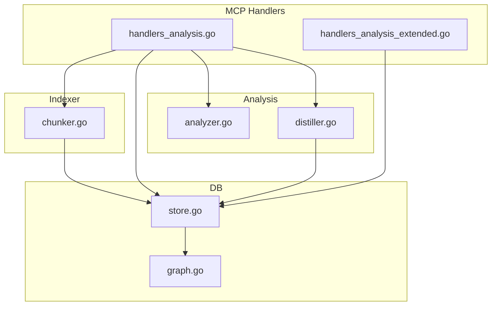

**Diagram sources**
- [handlers_analysis.go:1196-1242](file://internal/mcp/handlers_analysis.go#L1196-L1242)
- [chunker.go:43-101](file://internal/indexer/chunker.go#L43-L101)
- [store.go:19-664](file://internal/db/store.go#L19-L664)
- [analyzer.go:23-144](file://internal/analysis/analyzer.go#L23-L144)
- [distiller.go:22-191](file://internal/analysis/distiller.go#L22-L191)
- [graph.go:18-154](file://internal/db/graph.go#L18-L154)

**Section sources**
- [handlers_analysis.go:1196-1242](file://internal/mcp/handlers_analysis.go#L1196-L1242)
- [chunker.go:43-101](file://internal/indexer/chunker.go#L43-L101)
- [store.go:19-664](file://internal/db/store.go#L19-L664)
- [analyzer.go:23-144](file://internal/analysis/analyzer.go#L23-L144)
- [distiller.go:22-191](file://internal/analysis/distiller.go#L22-L191)
- [graph.go:18-154](file://internal/db/graph.go#L18-L154)

## Core Components
- Analyzer interface and implementations:
  - PatternAnalyzer: scans for markers like TODO, FIXME, HACK, DEPRECATED
  - VettingAnalyzer: runs go vet on Go files
  - MultiAnalyzer: composes multiple analyzers
- Distiller: aggregates indexed records into a package-level architectural manifest and stores a distilled summary
- Chunker: Tree-Sitter-based semantic chunking with language-specific queries, relationship extraction, structural metadata, and function scoring
- Vector Store: Chromem-backed storage with hybrid search, lexical search, and reciprocal rank fusion
- MCP Handlers: orchestrate analysis actions (ast_skeleton, dead_code, duplicate_code, dependencies) and produce structured reports

Key data structures:
- Issue: standardized report item for analyzers
- Chunk: semantic unit with symbols, relationships, structural metadata, and contextual string
- Record: vectorized document with metadata (including symbols, calls, relationships, structural_metadata)

**Section sources**
- [analyzer.go:13-144](file://internal/analysis/analyzer.go#L13-L144)
- [distiller.go:22-191](file://internal/analysis/distiller.go#L22-L191)
- [chunker.go:22-101](file://internal/indexer/chunker.go#L22-L101)
- [store.go:27-336](file://internal/db/store.go#L27-L336)

## Architecture Overview
The analyze_code tool orchestrates analysis through MCP handlers that delegate to the chunker, vector store, and analyzers. The chunker uses Tree-Sitter to extract entities and relationships, while the vector store enables semantic similarity search. Distillation produces high-level architectural summaries.

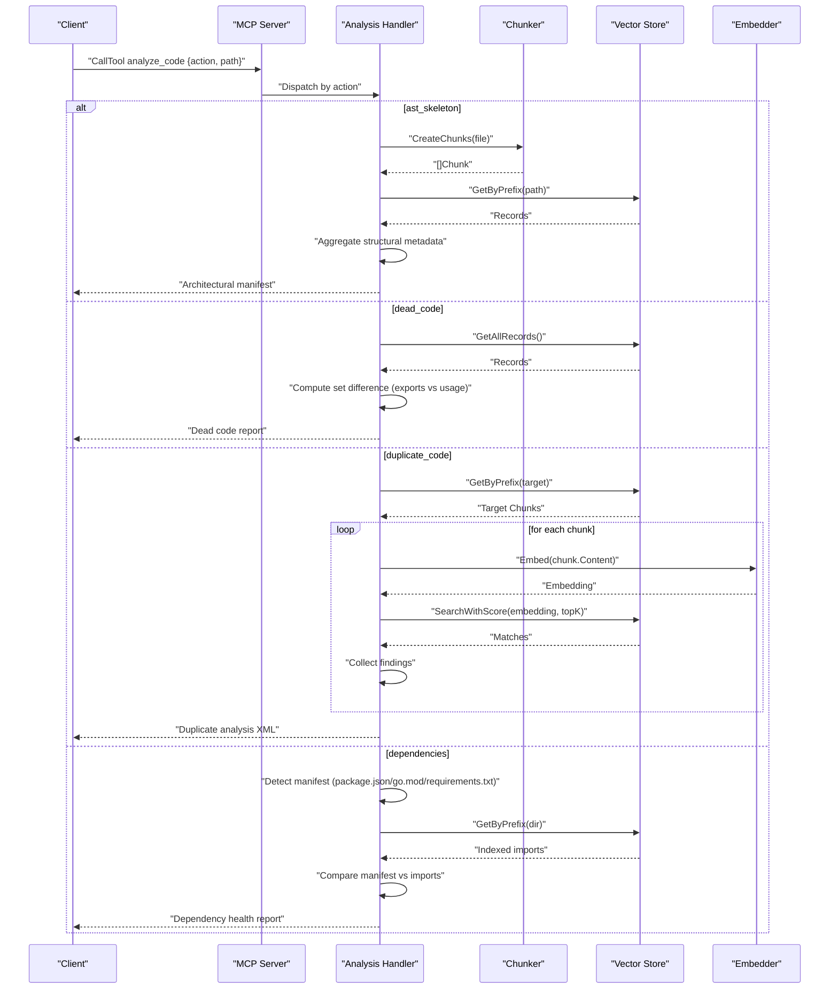

**Diagram sources**
- [handlers_analysis.go:1196-1242](file://internal/mcp/handlers_analysis.go#L1196-L1242)
- [chunker.go:43-101](file://internal/indexer/chunker.go#L43-L101)
- [store.go:80-409](file://internal/db/store.go#L80-L409)

## Detailed Component Analysis

### Analyzer Interface and Strategies
The Analyzer interface defines a uniform contract for analysis strategies. Implementations include:
- PatternAnalyzer: regex-based scanning for maintenance markers
- VettingAnalyzer: invokes go vet for Go files
- MultiAnalyzer: chains multiple analyzers and merges results

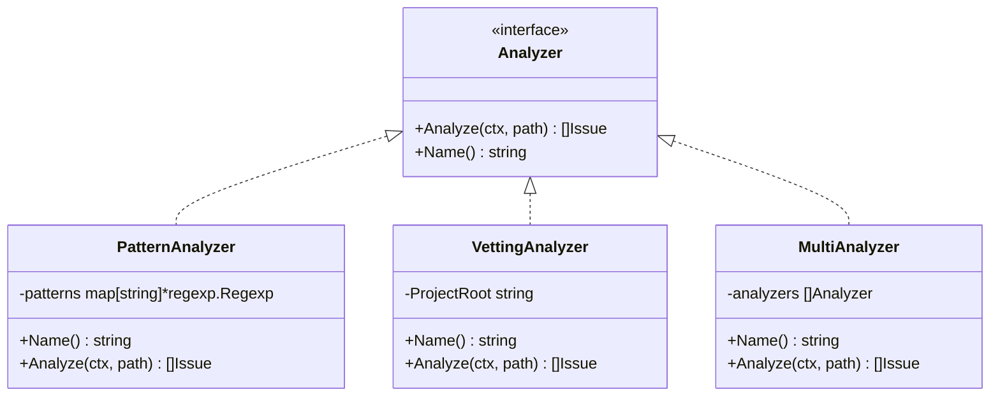

**Diagram sources**
- [analyzer.go:23-144](file://internal/analysis/analyzer.go#L23-L144)

**Section sources**
- [analyzer.go:23-144](file://internal/analysis/analyzer.go#L23-L144)

### AST-Based Chunking and Semantic Extraction
The chunker performs language-aware semantic segmentation using Tree-Sitter:
- Language detection by file extension
- Language-specific queries to extract entities (functions, classes, methods, types)
- Relationship extraction (imports/uses) via regex for supported languages
- Structural metadata extraction (fields, methods) and docstring association
- Function scoring based on lines and call count
- Gap filling and chunk splitting for long segments

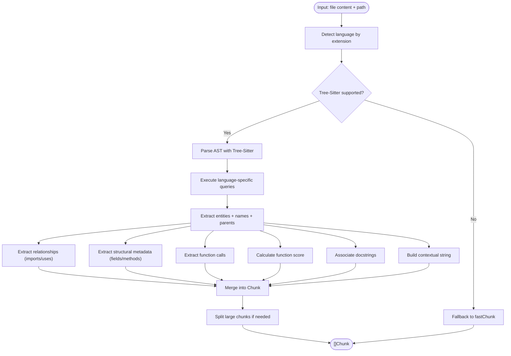

**Diagram sources**
- [chunker.go:111-421](file://internal/indexer/chunker.go#L111-L421)
- [chunker.go:423-646](file://internal/indexer/chunker.go#L423-L646)
- [chunker.go:648-758](file://internal/indexer/chunker.go#L648-L758)

**Section sources**
- [chunker.go:43-101](file://internal/indexer/chunker.go#L43-L101)
- [chunker.go:111-421](file://internal/indexer/chunker.go#L111-L421)
- [chunker.go:423-646](file://internal/indexer/chunker.go#L423-L646)
- [chunker.go:648-758](file://internal/indexer/chunker.go#L648-L758)

### Vector Search and Hybrid Retrieval
The vector store provides:
- Insertion of records with embeddings
- Semantic search with similarity boosting
- Lexical search with parallel filtering
- Hybrid search using reciprocal rank fusion (RRF) with dynamic weighting
- Priority and recency boosts for ranking

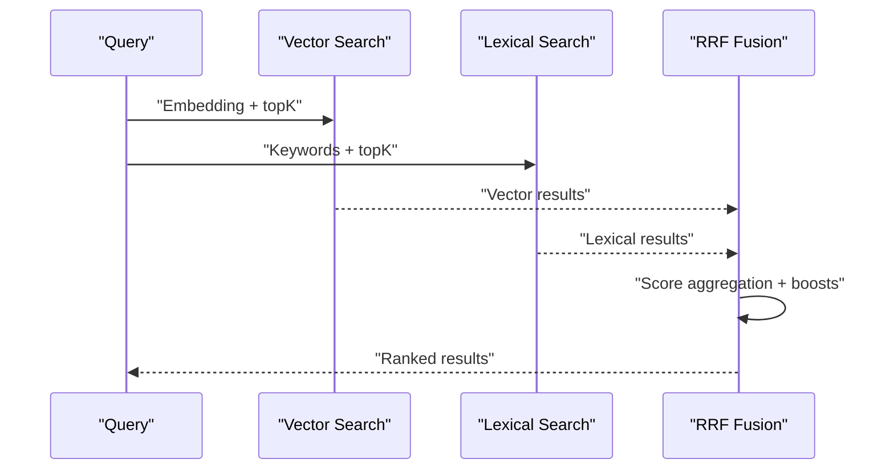

**Diagram sources**
- [store.go:223-336](file://internal/db/store.go#L223-L336)
- [store.go:80-409](file://internal/db/store.go#L80-L409)

**Section sources**
- [store.go:80-409](file://internal/db/store.go#L80-L409)
- [store.go:223-336](file://internal/db/store.go#L223-L336)

### Distillation: Structural Skeleton and Architectural Manifest
The distiller aggregates indexed records for a package to produce a high-level manifest:
- Exported API: exported symbols with type and structural details
- Internal components: counts by type
- Dependencies: external imports
- Storage: inserts a distilled record with priority and category metadata

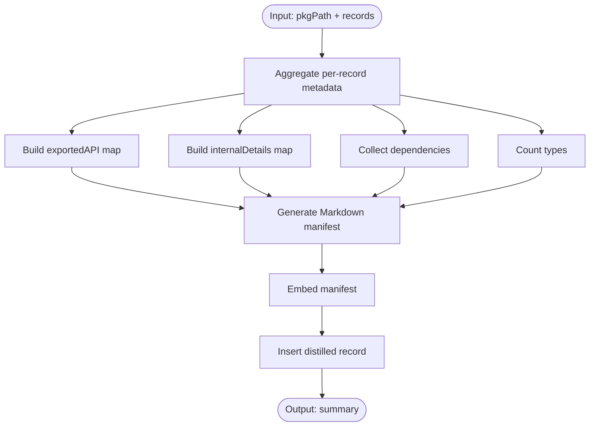

**Diagram sources**
- [distiller.go:40-190](file://internal/analysis/distiller.go#L40-L190)

**Section sources**
- [distiller.go:40-190](file://internal/analysis/distiller.go#L40-L190)

### Analysis Workflows

#### Dead Code Detection
The handler enumerates all records, filters by target path and exclusions, and computes the set difference between exported symbols and usage (calls plus imports). It supports library mode and default exclusions for common entry points.

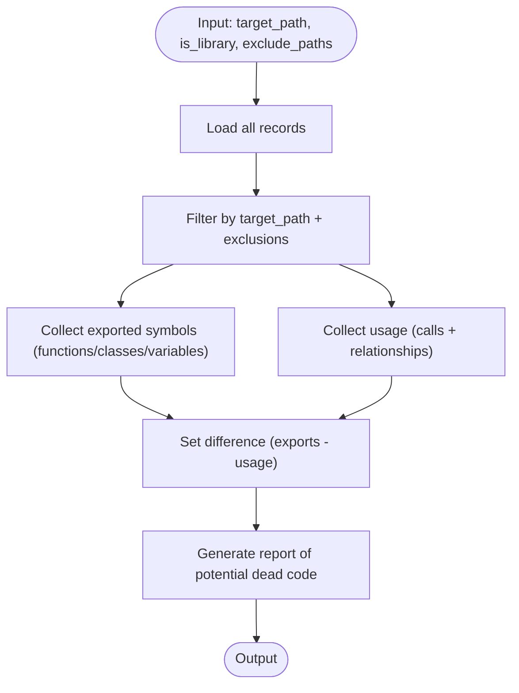

**Diagram sources**
- [handlers_analysis.go:636-777](file://internal/mcp/handlers_analysis.go#L636-L777)

**Section sources**
- [handlers_analysis.go:636-777](file://internal/mcp/handlers_analysis.go#L636-L777)

#### Duplicate Code Identification
The handler retrieves target chunks, embeds them if needed, and performs semantic similarity search across projects. It uses concurrency with a semaphore and deduplicates matches.

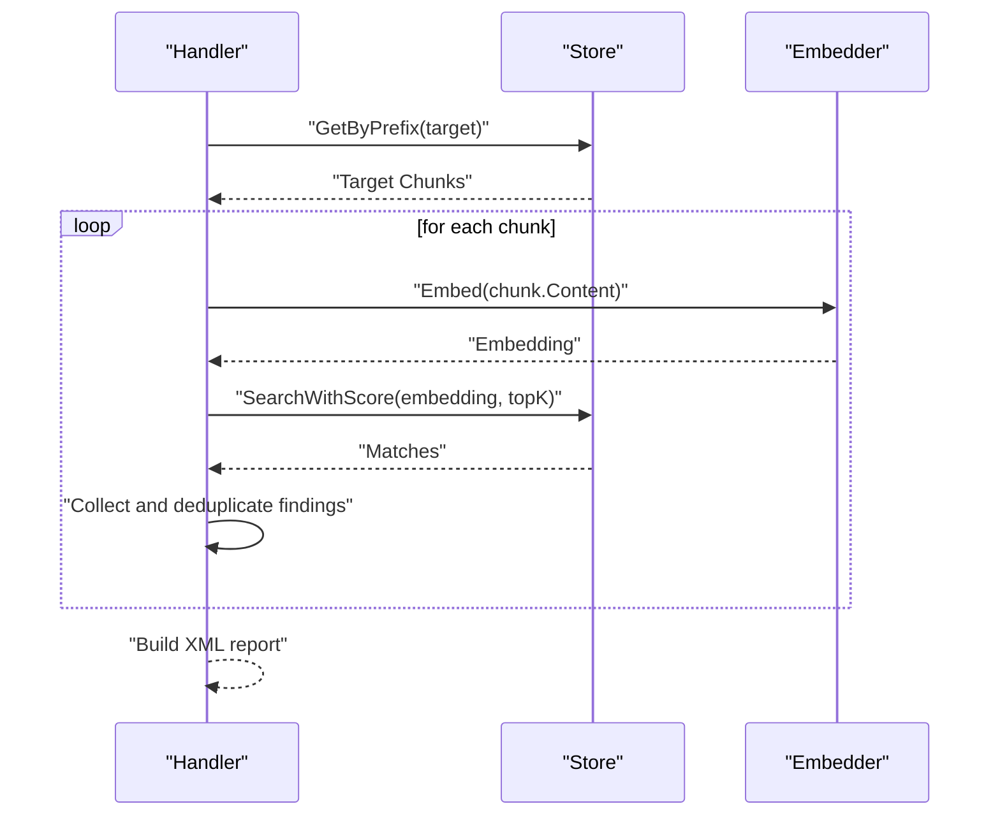

**Diagram sources**
- [handlers_analysis.go:226-311](file://internal/mcp/handlers_analysis.go#L226-L311)
- [store.go:338-409](file://internal/db/store.go#L338-L409)

**Section sources**
- [handlers_analysis.go:226-311](file://internal/mcp/handlers_analysis.go#L226-L311)
- [store.go:338-409](file://internal/db/store.go#L338-L409)

#### Dependencies Validation
The handler detects the project type by manifest presence, parses the manifest, and compares external imports from indexed records to declared dependencies. It handles npm, go, and Python manifests.

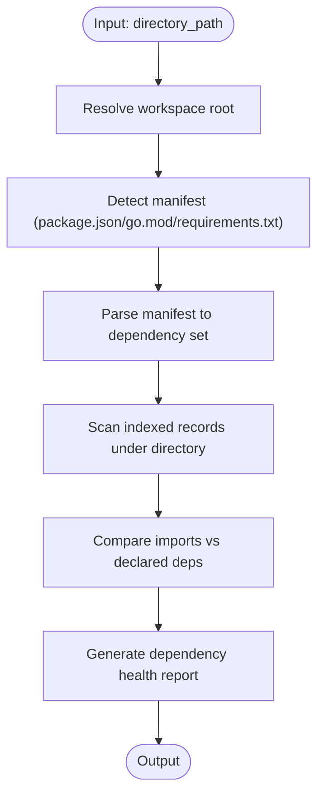

**Diagram sources**
- [handlers_analysis.go:313-472](file://internal/mcp/handlers_analysis.go#L313-L472)

**Section sources**
- [handlers_analysis.go:313-472](file://internal/mcp/handlers_analysis.go#L313-L472)

#### Architectural Impact Analysis (Extended)
The extended handler uses LSP to compute the “blast radius” of a symbol change by collecting references and summarizing impacted files and risk level.

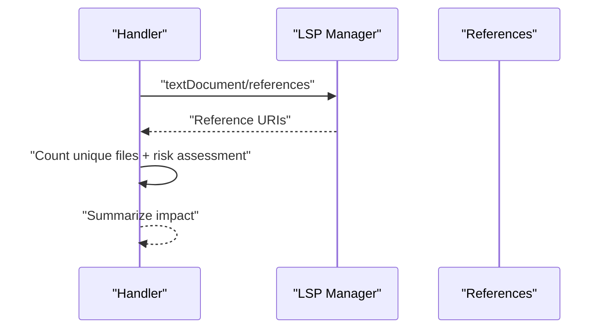

**Diagram sources**
- [handlers_analysis_extended.go:12-82](file://internal/mcp/handlers_analysis_extended.go#L12-L82)

**Section sources**
- [handlers_analysis_extended.go:12-82](file://internal/mcp/handlers_analysis_extended.go#L12-L82)

## Dependency Analysis
The analysis engine integrates:
- Chunker → Vector Store: semantic chunks become searchable records
- MCP Handlers → Chunker/Store: orchestrate analysis workflows
- Distiller → Store: writes distilled summaries
- Knowledge Graph → Store: populates graph from records for higher-order reasoning

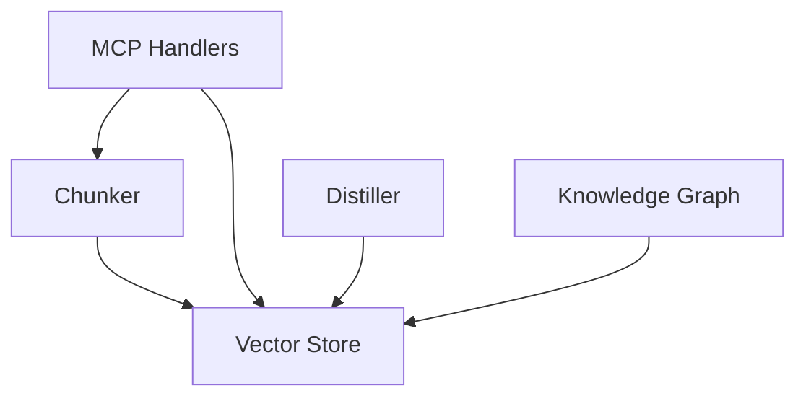

**Diagram sources**
- [chunker.go:43-101](file://internal/indexer/chunker.go#L43-L101)
- [store.go:19-664](file://internal/db/store.go#L19-L664)
- [distiller.go:22-191](file://internal/analysis/distiller.go#L22-L191)
- [graph.go:18-154](file://internal/db/graph.go#L18-L154)

**Section sources**
- [chunker.go:43-101](file://internal/indexer/chunker.go#L43-L101)
- [store.go:19-664](file://internal/db/store.go#L19-L664)
- [distiller.go:22-191](file://internal/analysis/distiller.go#L22-L191)
- [graph.go:18-154](file://internal/db/graph.go#L18-L154)

## Performance Considerations
- Concurrency and batching:
  - Duplicate code search uses a semaphore to cap concurrent embeddings/searches
  - Lexical search parallelizes filtering across CPU cores
  - Hybrid search runs vector and lexical queries concurrently
- Caching:
  - JSON arrays in metadata are cached to avoid repeated unmarshalling
- Scoring and ranking:
  - FunctionScore, priority, and recency boosts improve relevance
  - Reciprocal rank fusion balances lexical and vector signals
- Chunking:
  - Large chunks are split with overlap to preserve context
  - Tree-Sitter queries are language-specific to reduce noise
- Memory and disk:
  - Persistent Chromem database persists vectors and metadata
  - Dimension probing prevents model mismatch errors

[No sources needed since this section provides general guidance]

## Troubleshooting Guide
Common issues and remedies:
- go vet failures: ensure go toolchain is installed and accessible; verify project root configuration
- Missing embeddings: confirm embedder availability and dimension alignment with the vector store
- Empty results:
  - Verify indexing pipeline populated records for the target path
  - Check project ID and category filters in queries
- Dimension mismatch: delete the vector database and restart if switching embedding models
- Slow duplicate code search: adjust concurrency limits and topK parameters; ensure embeddings are precomputed when possible

**Section sources**
- [analyzer.go:83-119](file://internal/analysis/analyzer.go#L83-L119)
- [store.go:338-409](file://internal/db/store.go#L338-L409)
- [store.go:33-64](file://internal/db/store.go#L33-L64)

## Conclusion
The analyze_code tool combines AST-based chunking, semantic embeddings, and structured reporting to deliver actionable insights across four analysis types. Its modular design allows easy extension of analyzers, refinement of chunking rules, and tuning of retrieval parameters. For large codebases, careful attention to concurrency, caching, and scoring yields reliable and efficient diagnostics.