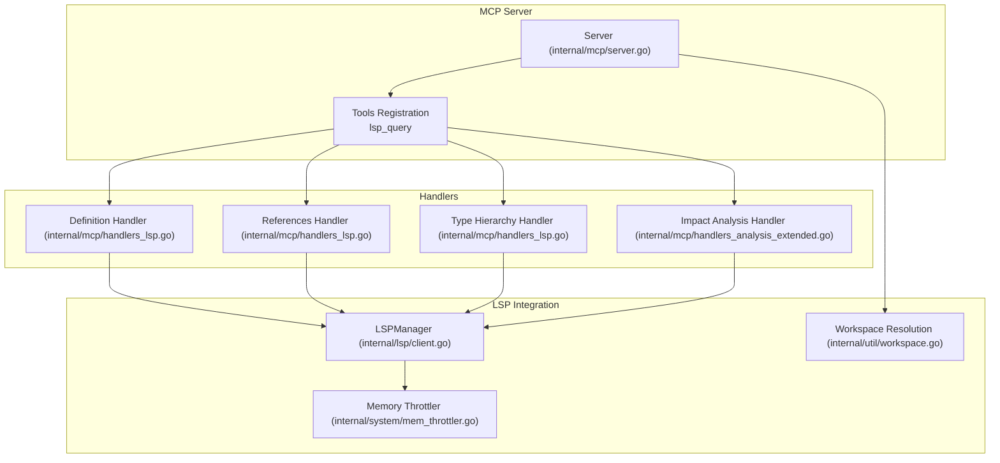
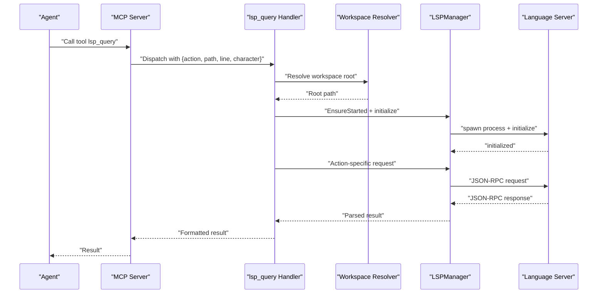
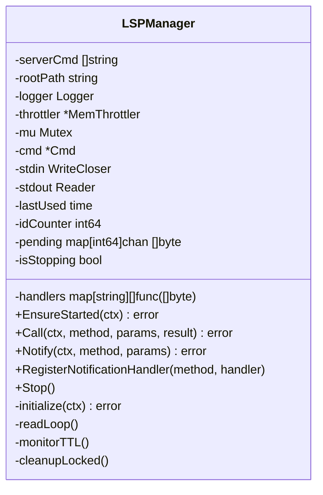
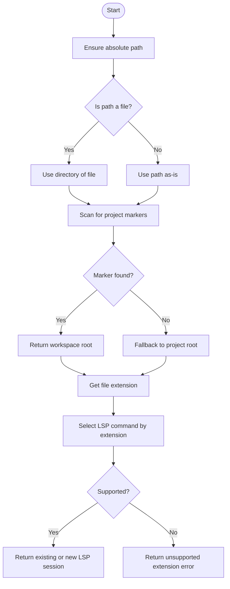
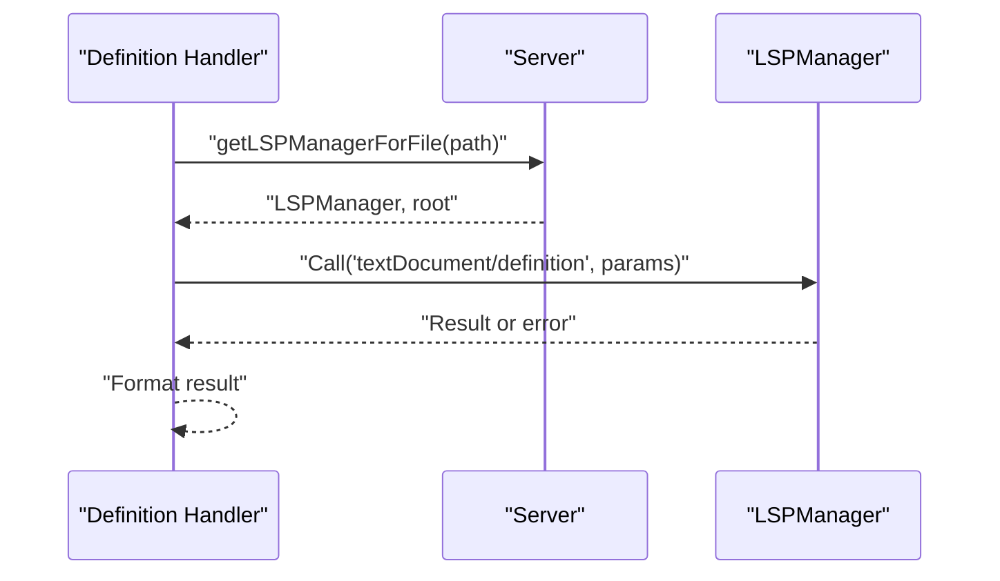
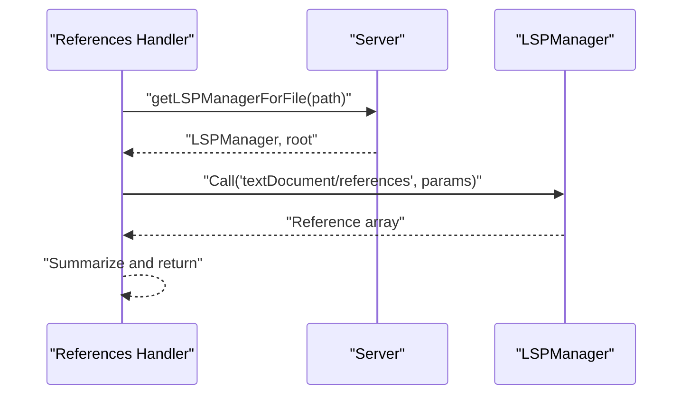
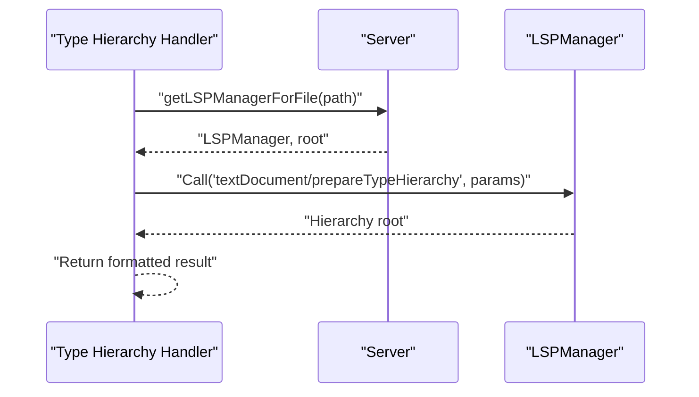
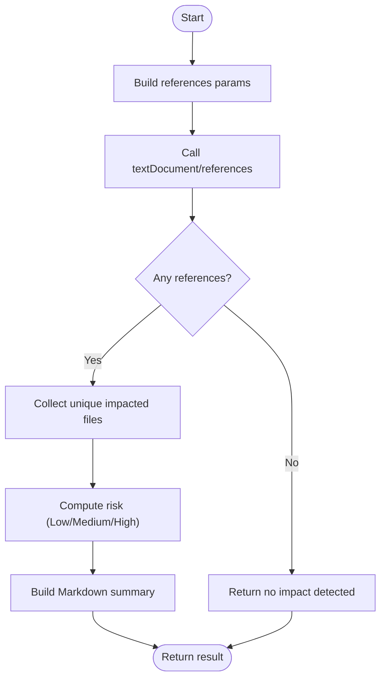
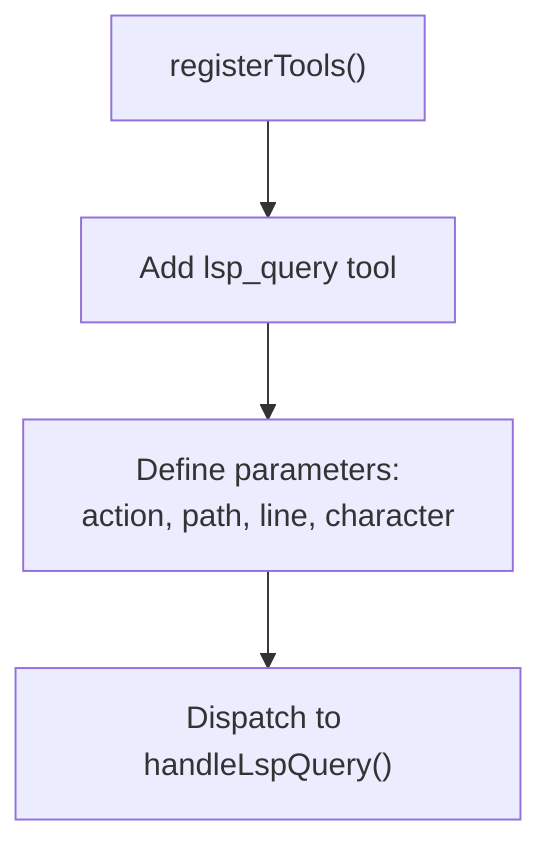
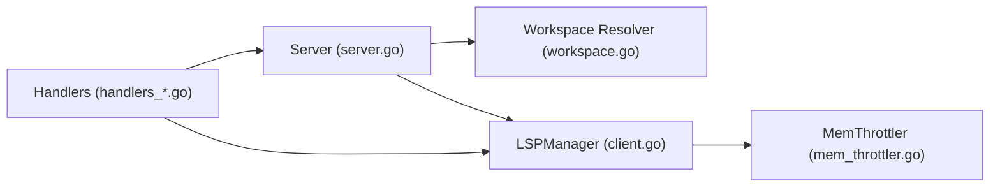

# lsp_query Tool

<cite>
**Referenced Files in This Document**
- [client.go](file://internal/lsp/client.go)
- [handlers_lsp.go](file://internal/mcp/handlers_lsp.go)
- [handlers_analysis_extended.go](file://internal/mcp/handlers_analysis_extended.go)
- [server.go](file://internal/mcp/server.go)
- [workspace.go](file://internal/util/workspace.go)
- [mem_throttler.go](file://internal/system/mem_throttler.go)
- [README.md](file://README.md)
- [mcp-config.json.example](file://mcp-config.json.example)
</cite>

## Table of Contents
1. [Introduction](#introduction)
2. [Project Structure](#project-structure)
3. [Core Components](#core-components)
4. [Architecture Overview](#architecture-overview)
5. [Detailed Component Analysis](#detailed-component-analysis)
6. [Dependency Analysis](#dependency-analysis)
7. [Performance Considerations](#performance-considerations)
8. [Troubleshooting Guide](#troubleshooting-guide)
9. [Conclusion](#conclusion)
10. [Appendices](#appendices)

## Introduction
The lsp_query tool is a consolidated Language Server Protocol (LSP) integration that provides precise symbol analysis across a codebase. It unifies four core LSP actions:
- Definition lookup: Jump to the exact location of a symbol’s declaration or definition.
- Reference finding: Enumerate all usages of a symbol across the workspace.
- Type hierarchy exploration: Inspect supertypes and subtypes for a symbol.
- Impact analysis: Compute the blast radius of a change by summarizing downstream references.

The tool accepts file path, line, and character coordinates along with an action type. It manages LSP sessions per workspace root and language server command, integrates with workspace resolution, and surfaces LSP errors gracefully. It is part of the “Fat Tool” pattern that consolidates capabilities into fewer, deterministic tools.

**Section sources**
- [README.md:11-19](file://README.md#L11-L19)
- [server.go:347-354](file://internal/mcp/server.go#L347-L354)

## Project Structure
The lsp_query tool spans several modules:
- LSP client and session management: internal/lsp
- MCP tool registration and handlers: internal/mcp
- Workspace resolution utilities: internal/util
- System memory throttling: internal/system
- Example configuration: mcp-config.json.example

**Diagram sources**
- [server.go:66-84](file://internal/mcp/server.go#L66-L84)
- [client.go:37-52](file://internal/lsp/client.go#L37-L52)
- [workspace.go:9-46](file://internal/util/workspace.go#L9-L46)
- [mem_throttler.go:22-28](file://internal/system/mem_throttler.go#L22-L28)
- [handlers_lsp.go:19-126](file://internal/mcp/handlers_lsp.go#L19-L126)
- [handlers_analysis_extended.go:12-82](file://internal/mcp/handlers_analysis_extended.go#L12-L82)

**Section sources**
- [server.go:66-84](file://internal/mcp/server.go#L66-L84)
- [client.go:20-34](file://internal/lsp/client.go#L20-L34)
- [workspace.go:9-46](file://internal/util/workspace.go#L9-L46)
- [mem_throttler.go:22-28](file://internal/system/mem_throttler.go#L22-L28)

## Core Components
- LSPManager: Manages lifecycle, JSON-RPC transport, request/response pairing, and background read loop with TTL-based shutdown.
- Server.getLSPManagerForFile: Resolves workspace root, selects language server command by file extension, and returns or creates a session.
- Handlers: Provide action-specific logic for definition lookup, references, type hierarchy, and impact analysis.

Key responsibilities:
- Session management: Ensures the LSP process is started, initializes it, and shuts it down after inactivity.
- Workspace resolution: Uses project markers to locate the workspace root for a given file.
- Memory-aware startup: Uses a memory throttler to avoid starting LSP when system memory is low.
- Error handling: Returns user-friendly messages for missing paths, unsupported file types, and LSP failures.

**Section sources**
- [client.go:37-143](file://internal/lsp/client.go#L37-L143)
- [server.go:119-148](file://internal/mcp/server.go#L119-L148)
- [workspace.go:9-46](file://internal/util/workspace.go#L9-L46)
- [mem_throttler.go:73-103](file://internal/system/mem_throttler.go#L73-L103)

## Architecture Overview
The lsp_query tool orchestrates requests through the MCP server to the LSP client. The flow is:
- Tool invocation with action and position arguments.
- Workspace resolution and LSP session selection.
- LSP request dispatch and response parsing.
- Result formatting and return to the caller.

**Diagram sources**
- [server.go:119-148](file://internal/mcp/server.go#L119-L148)
- [client.go:67-117](file://internal/lsp/client.go#L67-L117)
- [handlers_lsp.go:19-126](file://internal/mcp/handlers_lsp.go#L19-L126)

## Detailed Component Analysis

### LSP Session Management
LSPManager encapsulates:
- Process lifecycle: spawn, pipe setup, read loop, graceful stop.
- Request/response pairing: unique IDs, pending channels, response routing.
- Initialization handshake: initialize and initialized notifications.
- Background TTL monitor: auto-shutdown after 10 minutes of inactivity.
- Memory throttling: prevents startup under memory pressure.

**Diagram sources**
- [client.go:37-52](file://internal/lsp/client.go#L37-L52)
- [client.go:146-206](file://internal/lsp/client.go#L146-L206)
- [client.go:249-304](file://internal/lsp/client.go#L249-L304)
- [client.go:329-347](file://internal/lsp/client.go#L329-L347)

**Section sources**
- [client.go:37-143](file://internal/lsp/client.go#L37-L143)
- [client.go:249-347](file://internal/lsp/client.go#L249-L347)

### Workspace Resolution and Language Selection
The server resolves the workspace root for a file and selects the language server command based on file extension. Unsupported extensions produce an error.

**Diagram sources**
- [server.go:119-148](file://internal/mcp/server.go#L119-L148)
- [workspace.go:9-46](file://internal/util/workspace.go#L9-L46)
- [client.go:20-34](file://internal/lsp/client.go#L20-L34)

**Section sources**
- [server.go:119-148](file://internal/mcp/server.go#L119-L148)
- [workspace.go:9-46](file://internal/util/workspace.go#L9-L46)
- [client.go:20-34](file://internal/lsp/client.go#L20-L34)

### Action Handlers

#### Definition Lookup
- Validates path presence.
- Resolves LSP session for the file.
- Calls textDocument/definition with position.
- Returns the first result or a “no definition found” message.

**Diagram sources**
- [handlers_lsp.go:19-53](file://internal/mcp/handlers_lsp.go#L19-L53)
- [server.go:119-148](file://internal/mcp/server.go#L119-L148)

**Section sources**
- [handlers_lsp.go:19-53](file://internal/mcp/handlers_lsp.go#L19-L53)

#### Reference Finding
- Validates path presence.
- Resolves LSP session.
- Calls textDocument/references with includeDeclaration enabled.
- Aggregates and returns a summary of references.

**Diagram sources**
- [handlers_lsp.go:55-95](file://internal/mcp/handlers_lsp.go#L55-L95)
- [server.go:119-148](file://internal/mcp/server.go#L119-L148)

**Section sources**
- [handlers_lsp.go:55-95](file://internal/mcp/handlers_lsp.go#L55-L95)

#### Type Hierarchy Exploration
- Validates path presence.
- Resolves LSP session.
- Calls textDocument/prepareTypeHierarchy to obtain hierarchy root.
- Returns the hierarchy root information.

**Diagram sources**
- [handlers_lsp.go:97-126](file://internal/mcp/handlers_lsp.go#L97-L126)
- [server.go:119-148](file://internal/mcp/server.go#L119-L148)

**Section sources**
- [handlers_lsp.go:97-126](file://internal/mcp/handlers_lsp.go#L97-L126)

#### Impact Analysis
- Validates path presence.
- Resolves LSP session.
- Calls textDocument/references with includeDeclaration disabled.
- Computes risk level based on unique impacted files and returns a Markdown summary.

**Diagram sources**
- [handlers_analysis_extended.go:12-82](file://internal/mcp/handlers_analysis_extended.go#L12-L82)
- [server.go:119-148](file://internal/mcp/server.go#L119-L148)

**Section sources**
- [handlers_analysis_extended.go:12-82](file://internal/mcp/handlers_analysis_extended.go#L12-L82)

### Tool Registration and Arguments
The lsp_query tool is registered with the MCP server and expects:
- action: One of definition, references, type_hierarchy, impact_analysis.
- path: Absolute path to the file containing the symbol.
- line: 0-indexed line number.
- character: 0-indexed character offset.

**Diagram sources**
- [server.go:347-354](file://internal/mcp/server.go#L347-L354)

**Section sources**
- [server.go:347-354](file://internal/mcp/server.go#L347-L354)

## Dependency Analysis
- Internal dependencies:
  - Server depends on workspace utilities and memory throttler.
  - Handlers depend on Server.getLSPManagerForFile and LSPManager.
  - LSPManager depends on system memory throttler for startup decisions.
- External dependencies:
  - Language servers are spawned via OS process execution.
  - JSON-RPC transport adheres to LSP protocol.

**Diagram sources**
- [server.go:66-84](file://internal/mcp/server.go#L66-L84)
- [workspace.go:9-46](file://internal/util/workspace.go#L9-L46)
- [client.go:37-52](file://internal/lsp/client.go#L37-L52)
- [mem_throttler.go:22-28](file://internal/system/mem_throttler.go#L22-L28)
- [handlers_lsp.go:19-126](file://internal/mcp/handlers_lsp.go#L19-L126)
- [handlers_analysis_extended.go:12-82](file://internal/mcp/handlers_analysis_extended.go#L12-L82)

**Section sources**
- [server.go:66-84](file://internal/mcp/server.go#L66-L84)
- [client.go:37-52](file://internal/lsp/client.go#L37-L52)
- [workspace.go:9-46](file://internal/util/workspace.go#L9-L46)
- [mem_throttler.go:22-28](file://internal/system/mem_throttler.go#L22-L28)

## Performance Considerations
- Session reuse: Sessions are keyed by root path and language server command, minimizing repeated process spawns.
- Idle TTL: Automatic shutdown after 10 minutes of inactivity reduces resource usage.
- Memory throttling: Prevents LSP startup when memory pressure is high, avoiding system instability.
- Background read loop: Efficient JSON-RPC parsing avoids blocking and supports concurrent requests.

Recommendations:
- Prefer batch operations when possible to reduce round-trips.
- Use impact analysis to scope downstream changes before performing edits.
- Monitor memory usage when working with large workspaces.

**Section sources**
- [client.go:329-347](file://internal/lsp/client.go#L329-L347)
- [mem_throttler.go:73-103](file://internal/system/mem_throttler.go#L73-L103)

## Troubleshooting Guide
Common issues and resolutions:
- Unsupported file type:
  - Symptom: Error indicating no language server configured for the extension.
  - Cause: Extension not present in LanguageServerMapping.
  - Resolution: Ensure the file extension is supported or configure a compatible LSP command externally.
- No workspace root found:
  - Symptom: Warning about failing to find workspace root; falls back to project root.
  - Cause: Missing project markers (.git, package.json, go.mod, Cargo.toml).
  - Resolution: Initialize a repository or place the file under a directory with a recognized marker.
- LSP process fails to start:
  - Symptom: Startup errors or immediate disconnect.
  - Causes: Missing LSP executable, insufficient memory, or permission issues.
  - Resolution: Verify PATH and executable availability; check memory throttler thresholds; ensure proper permissions.
- LSP call failures:
  - Symptom: LSP error returned with code and message.
  - Resolution: Validate path, line, and character coordinates; confirm the symbol exists at the specified position.

Operational tips:
- Use the workspace_manager tool to set the project root when needed.
- Confirm MCP server configuration and environment variables if the server does not start.

**Section sources**
- [client.go:81-83](file://internal/lsp/client.go#L81-L83)
- [server.go:123-127](file://internal/mcp/server.go#L123-L127)
- [server.go:131-134](file://internal/mcp/server.go#L131-L134)
- [workspace.go:26-44](file://internal/util/workspace.go#L26-L44)
- [handlers_lsp.go:22-28](file://internal/mcp/handlers_lsp.go#L22-L28)
- [handlers_analysis_extended.go:19-26](file://internal/mcp/handlers_analysis_extended.go#L19-L26)

## Conclusion
The lsp_query tool delivers precise, deterministic LSP-powered analysis through a unified interface. By resolving workspaces, selecting appropriate language servers, and managing sessions efficiently, it enables reliable navigation, reference discovery, type hierarchy inspection, and impact assessment. Its integration with workspace resolution and memory throttling ensures robust operation across diverse environments.

[No sources needed since this section summarizes without analyzing specific files]

## Appendices

### Tool Parameters
- action: One of definition, references, type_hierarchy, impact_analysis.
- path: Absolute path to the file containing the symbol.
- line: 0-indexed line number.
- character: 0-indexed character offset.

**Section sources**
- [server.go:347-354](file://internal/mcp/server.go#L347-L354)

### Example Workflows
- Navigate to definition:
  - Provide path, line, and character for the symbol.
  - The handler calls textDocument/definition and returns the first result.
- Find all references:
  - Provide path, line, and character.
  - The handler calls textDocument/references with includeDeclaration enabled and returns a summary.
- Explore type hierarchy:
  - Provide path, line, and character.
  - The handler calls textDocument/prepareTypeHierarchy and returns the hierarchy root.
- Analyze cross-file change impact:
  - Provide path, line, and character.
  - The handler calls textDocument/references with includeDeclaration disabled, computes risk based on unique impacted files, and returns a Markdown summary.

**Section sources**
- [handlers_lsp.go:19-126](file://internal/mcp/handlers_lsp.go#L19-L126)
- [handlers_analysis_extended.go:12-82](file://internal/mcp/handlers_analysis_extended.go#L12-L82)

### LSP Server Configuration
- Language server mapping is defined by file extension.
- The server spawns the LSP process in the resolved workspace root.
- Initialization includes sending initialize and initialized notifications.

**Section sources**
- [client.go:20-34](file://internal/lsp/client.go#L20-L34)
- [client.go:119-143](file://internal/lsp/client.go#L119-L143)

### Session Lifecycle Management
- EnsureStarted: Starts the LSP process if not running, performs initialization, and registers background monitors.
- TTL monitor: Shuts down the session after 10 minutes of inactivity.
- Stop: Gracefully terminates the session and cleans up resources.

**Section sources**
- [client.go:67-117](file://internal/lsp/client.go#L67-L117)
- [client.go:329-347](file://internal/lsp/client.go#L329-L347)
- [client.go:349-354](file://internal/lsp/client.go#L349-L354)

### MCP Configuration Example
- The MCP configuration file demonstrates how to launch the server process with optional environment variables.

**Section sources**
- [mcp-config.json.example:1-11](file://mcp-config.json.example#L1-L11)