# modify_workspace Tool

<cite>
**Referenced Files in This Document**
- [main.go](file://main.go)
- [server.go](file://internal/mcp/server.go)
- [handlers_mutation.go](file://internal/mcp/handlers_mutation.go)
- [handlers_safety.go](file://internal/mcp/handlers_safety.go)
- [safety.go](file://internal/mutation/safety.go)
- [client.go](file://internal/lsp/client.go)
- [sanitizer.go](file://internal/security/pathguard/sanitizer.go)
- [workspace.go](file://internal/util/workspace.go)
</cite>

## Table of Contents
1. [Introduction](#introduction)
2. [Project Structure](#project-structure)
3. [Core Components](#core-components)
4. [Architecture Overview](#architecture-overview)
5. [Detailed Component Analysis](#detailed-component-analysis)
6. [Dependency Analysis](#dependency-analysis)
7. [Performance Considerations](#performance-considerations)
8. [Troubleshooting Guide](#troubleshooting-guide)
9. [Conclusion](#conclusion)
10. [Appendices](#appendices)

## Introduction
The modify_workspace tool is a safe, structured, and LSP-integrated system for performing controlled codebase mutations. It unifies five mutation actions into a single “Fat Tool”:
- apply_patch: search-and-replace operations with safety checks
- create_file: create new files with content
- run_linter: execute code formatting (currently supports go fmt)
- verify_patch: dry-run validation using LSP diagnostics
- auto_fix: LSP-driven suggestions for fixing diagnostics

It enforces strict safety via path validation, LSP-backed integrity checks, and a controlled mutation pipeline. This document explains the implementation, safety mechanisms, LSP integration, validation workflows, and best practices for safe workspace modifications.

## Project Structure
The modify_workspace tool spans several modules:
- MCP server and tool registration
- Mutation handlers for each action
- Safety checker integrating LSP diagnostics
- LSP client for language server lifecycle and notifications
- Path validation for security
- Workspace utilities for root detection

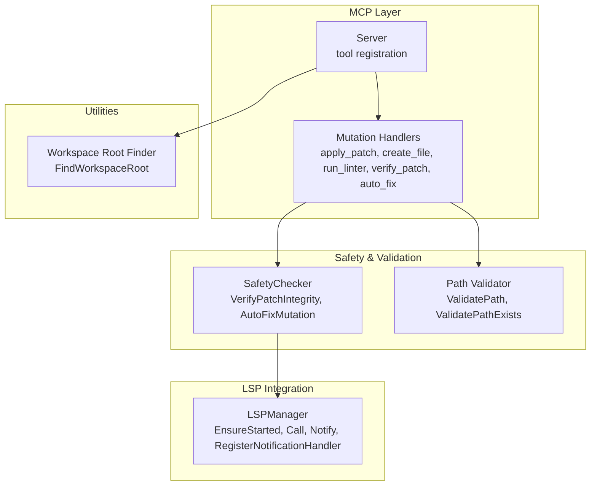

**Diagram sources**
- [server.go:334-418](file://internal/mcp/server.go#L334-L418)
- [handlers_mutation.go:101-161](file://internal/mcp/handlers_mutation.go#L101-L161)
- [safety.go:33-126](file://internal/mutation/safety.go#L33-L126)
- [client.go:36-355](file://internal/lsp/client.go#L36-L355)
- [sanitizer.go:44-145](file://internal/security/pathguard/sanitizer.go#L44-L145)
- [workspace.go:9-46](file://internal/util/workspace.go#L9-L46)

**Section sources**
- [server.go:334-418](file://internal/mcp/server.go#L334-L418)
- [handlers_mutation.go:101-161](file://internal/mcp/handlers_mutation.go#L101-L161)
- [safety.go:33-126](file://internal/mutation/safety.go#L33-L126)
- [client.go:36-355](file://internal/lsp/client.go#L36-L355)
- [sanitizer.go:44-145](file://internal/security/pathguard/sanitizer.go#L44-L145)
- [workspace.go:9-46](file://internal/util/workspace.go#L9-L46)

## Core Components
- Server: Initializes MCP tools, registers modify_workspace, and wires SafetyChecker and path validator.
- Mutation Handlers: Implement each action (apply_patch, create_file, run_linter, verify_patch, auto_fix).
- SafetyChecker: Validates patches via LSP diagnostics and provides suggestions.
- LSPManager: Manages language server lifecycle, requests, notifications, and handlers.
- Path Validator: Enforces safe path resolution and prevents traversal and symlink abuse.
- Workspace Utilities: Detects project root for LSP sessions.

**Section sources**
- [server.go:67-128](file://internal/mcp/server.go#L67-L128)
- [handlers_mutation.go:13-161](file://internal/mcp/handlers_mutation.go#L13-L161)
- [safety.go:33-126](file://internal/mutation/safety.go#L33-L126)
- [client.go:36-355](file://internal/lsp/client.go#L36-L355)
- [sanitizer.go:44-145](file://internal/security/pathguard/sanitizer.go#L44-L145)
- [workspace.go:9-46](file://internal/util/workspace.go#L9-L46)

## Architecture Overview
The modify_workspace tool orchestrates a mutation pipeline:
1. Argument parsing and action routing
2. Path validation for safety
3. Optional dry-run verification via LSP
4. Change application (write/create/format)
5. LSP diagnostics collection and reporting

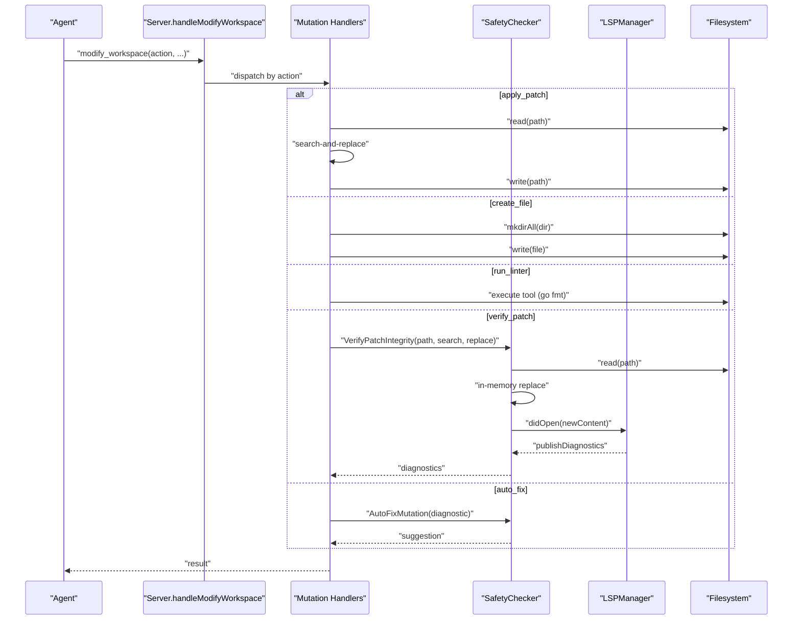

**Diagram sources**
- [handlers_mutation.go:101-161](file://internal/mcp/handlers_mutation.go#L101-L161)
- [handlers_safety.go:13-58](file://internal/mcp/handlers_safety.go#L13-L58)
- [safety.go:42-114](file://internal/mutation/safety.go#L42-L114)
- [client.go:66-117](file://internal/lsp/client.go#L66-L117)

## Detailed Component Analysis

### Mutation Actions

#### apply_patch
- Purpose: Replace occurrences of a search string with a replacement string in a file.
- Safety: Validates path, reads file, checks presence of search string, replaces, writes back.
- Error handling: Returns descriptive errors for invalid path, read/write failures, missing search string.

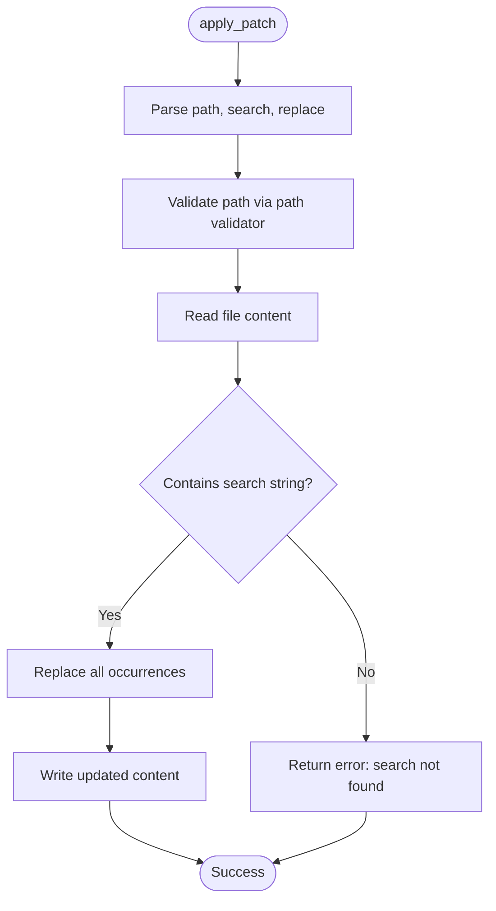

**Diagram sources**
- [handlers_mutation.go:13-45](file://internal/mcp/handlers_mutation.go#L13-L45)

**Section sources**
- [handlers_mutation.go:13-45](file://internal/mcp/handlers_mutation.go#L13-L45)

#### create_file
- Purpose: Create a new file with provided content.
- Safety: Ensures directory exists, validates path, writes file.
- Error handling: Directory creation and write failures reported.

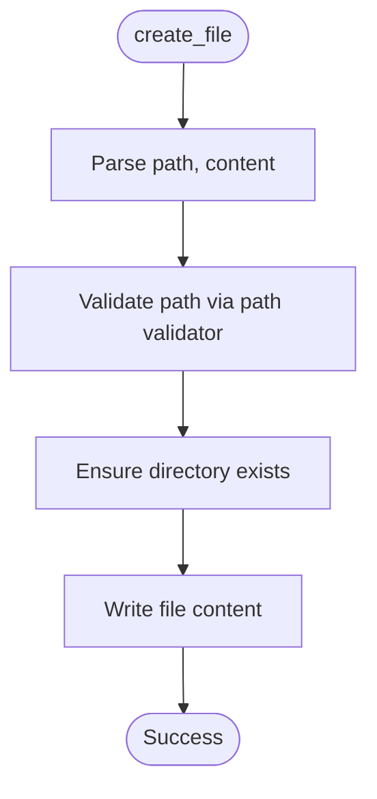

**Diagram sources**
- [handlers_mutation.go:73-99](file://internal/mcp/handlers_mutation.go#L73-L99)

**Section sources**
- [handlers_mutation.go:73-99](file://internal/mcp/handlers_mutation.go#L73-L99)

#### run_linter
- Purpose: Execute a code formatter or linter with the fix flag.
- Current support: Built-in mock for “go fmt”; can be extended to arbitrary commands safely.
- Error handling: Reports unsupported tools and execution errors.

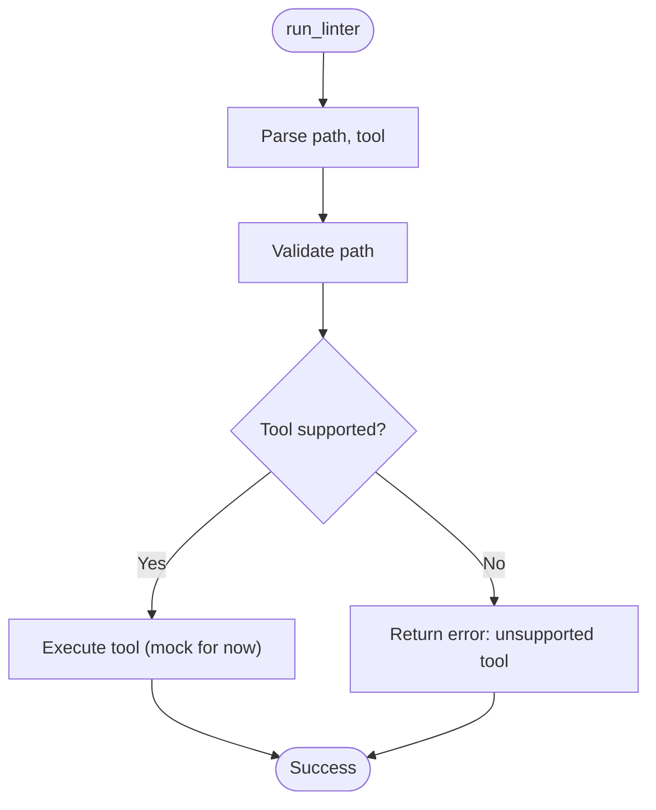

**Diagram sources**
- [handlers_mutation.go:47-71](file://internal/mcp/handlers_mutation.go#L47-L71)

**Section sources**
- [handlers_mutation.go:47-71](file://internal/mcp/handlers_mutation.go#L47-L71)

#### verify_patch
- Purpose: Dry-run validation of a proposed patch using LSP diagnostics.
- Workflow: Reads file, applies patch in-memory, triggers LSP didOpen with new content, waits for publishDiagnostics, returns collected diagnostics.

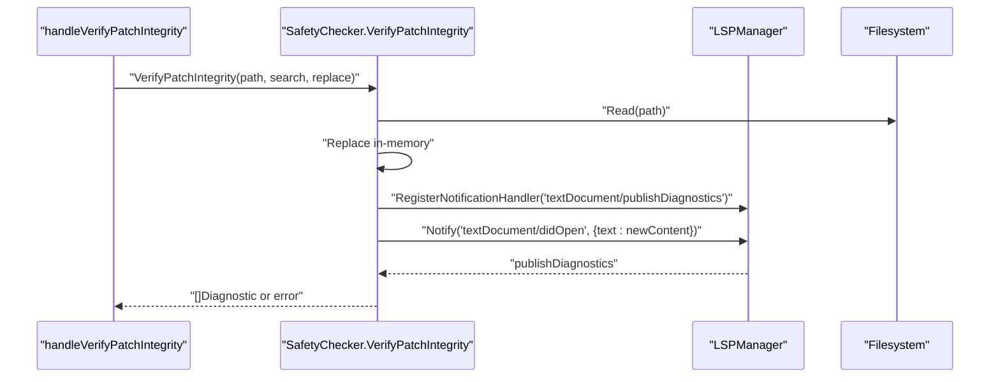

**Diagram sources**
- [handlers_safety.go:13-42](file://internal/mcp/handlers_safety.go#L13-L42)
- [safety.go:42-114](file://internal/mutation/safety.go#L42-L114)
- [client.go:208-236](file://internal/lsp/client.go#L208-L236)

**Section sources**
- [handlers_safety.go:13-42](file://internal/mcp/handlers_safety.go#L13-L42)
- [safety.go:42-114](file://internal/mutation/safety.go#L42-L114)

#### auto_fix
- Purpose: Provide a human-readable suggestion for fixing a diagnostic.
- Implementation: Converts diagnostic severity and position into a suggestion string.

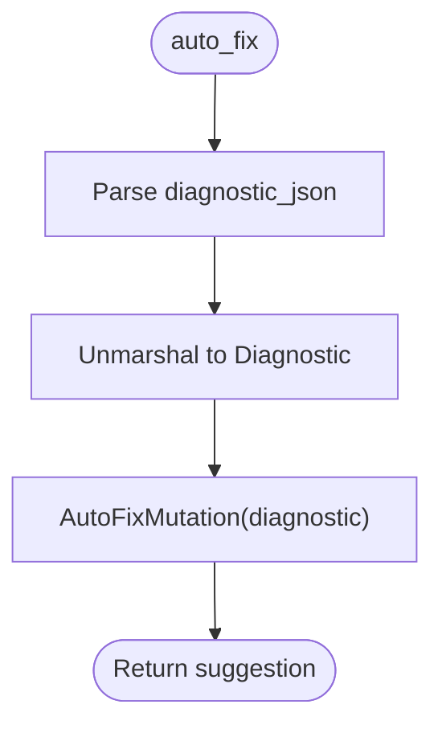

**Diagram sources**
- [handlers_safety.go:44-58](file://internal/mcp/handlers_safety.go#L44-L58)
- [safety.go:116-126](file://internal/mutation/safety.go#L116-L126)

**Section sources**
- [handlers_safety.go:44-58](file://internal/mcp/handlers_safety.go#L44-L58)
- [safety.go:116-126](file://internal/mutation/safety.go#L116-L126)

### Safety Checking Mechanisms
- Path validation: Prevents traversal, enforces depth limits, and optionally disallows symlinks.
- LSP-based verification: Uses in-memory patch simulation and didOpen to collect diagnostics.
- Timeout and cancellation: LSP diagnostics wait respects context cancellation and a fixed timeout.

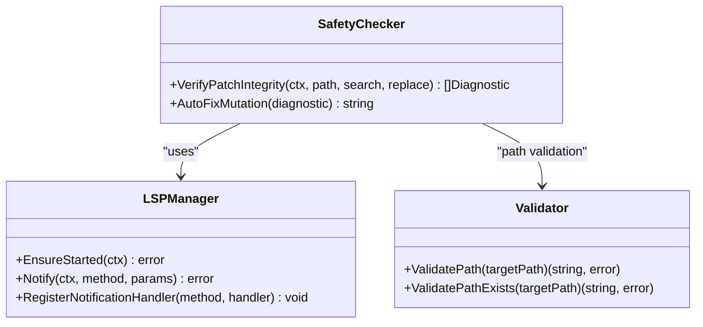

**Diagram sources**
- [safety.go:33-126](file://internal/mutation/safety.go#L33-L126)
- [client.go:36-355](file://internal/lsp/client.go#L36-L355)
- [sanitizer.go:44-145](file://internal/security/pathguard/sanitizer.go#L44-L145)

**Section sources**
- [safety.go:33-126](file://internal/mutation/safety.go#L33-L126)
- [client.go:36-355](file://internal/lsp/client.go#L36-L355)
- [sanitizer.go:44-145](file://internal/security/pathguard/sanitizer.go#L44-L145)

### LSP Integration for Verification
- Session management: Resolves workspace root, selects language server by extension, and caches sessions keyed by root and server command.
- Lifecycle: Starts language server on demand, initializes, and monitors TTL.
- Notifications: Registers handler for publishDiagnostics and triggers didOpen with in-memory content to simulate changes.

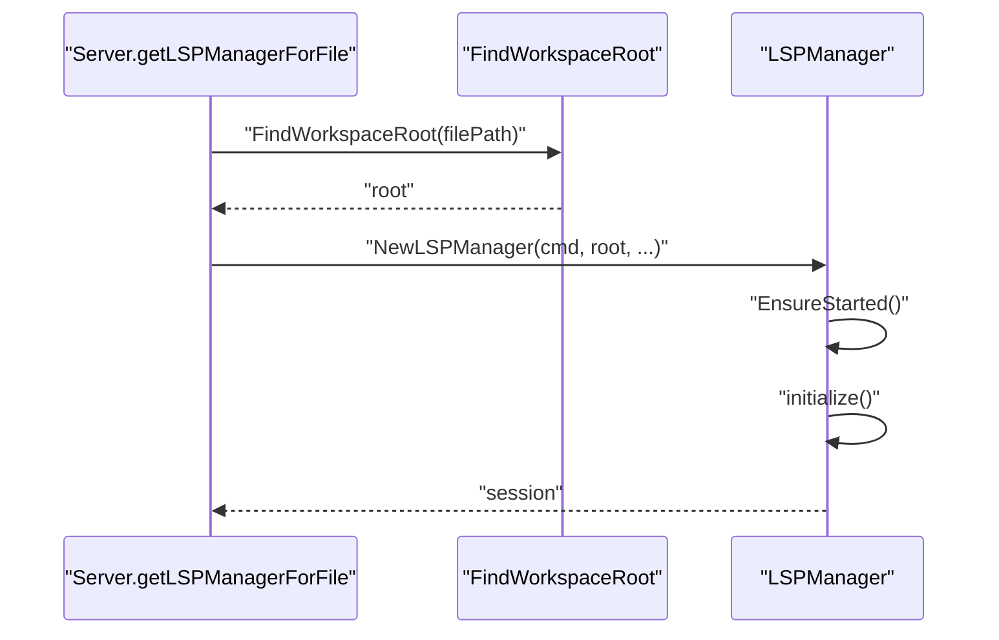

**Diagram sources**
- [server.go:130-159](file://internal/mcp/server.go#L130-L159)
- [workspace.go:9-46](file://internal/util/workspace.go#L9-L46)
- [client.go:66-117](file://internal/lsp/client.go#L66-L117)

**Section sources**
- [server.go:130-159](file://internal/mcp/server.go#L130-L159)
- [workspace.go:9-46](file://internal/util/workspace.go#L9-L46)
- [client.go:66-117](file://internal/lsp/client.go#L66-L117)

### Mutation Pipeline
The unified modify_workspace action routes to the appropriate handler, enforcing safety and validation at each step.

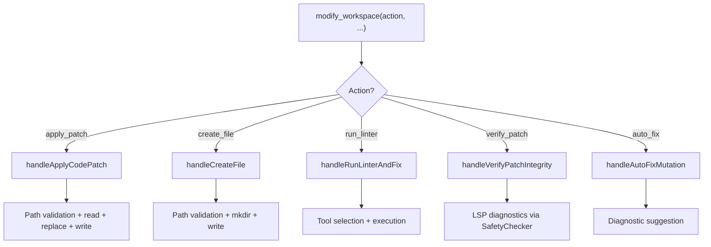

**Diagram sources**
- [handlers_mutation.go:101-161](file://internal/mcp/handlers_mutation.go#L101-L161)

**Section sources**
- [handlers_mutation.go:101-161](file://internal/mcp/handlers_mutation.go#L101-L161)

## Dependency Analysis
- Server depends on:
  - Path validator for safe file operations
  - SafetyChecker for integrity checks
  - LSPManager for diagnostics
  - Workspace utilities for root detection
- Mutation handlers depend on:
  - Path validator
  - SafetyChecker (for verify_patch and auto_fix)
  - LSPManager (for verify_patch)
- SafetyChecker depends on:
  - LSPManager for diagnostics
  - Filesystem for content reads/writes
- LSPManager depends on:
  - OS process execution and IO
  - Memory throttler for resource control

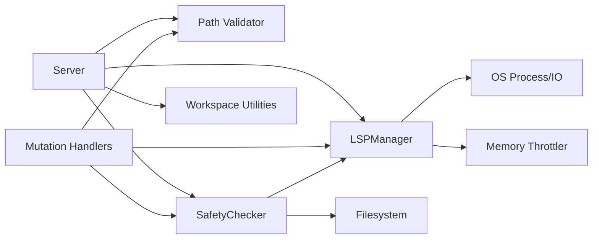

**Diagram sources**
- [server.go:67-128](file://internal/mcp/server.go#L67-L128)
- [handlers_mutation.go:101-161](file://internal/mcp/handlers_mutation.go#L101-L161)
- [safety.go:33-126](file://internal/mutation/safety.go#L33-L126)
- [client.go:36-355](file://internal/lsp/client.go#L36-L355)
- [sanitizer.go:44-145](file://internal/security/pathguard/sanitizer.go#L44-L145)
- [workspace.go:9-46](file://internal/util/workspace.go#L9-L46)

**Section sources**
- [server.go:67-128](file://internal/mcp/server.go#L67-L128)
- [handlers_mutation.go:101-161](file://internal/mcp/handlers_mutation.go#L101-L161)
- [safety.go:33-126](file://internal/mutation/safety.go#L33-L126)
- [client.go:36-355](file://internal/lsp/client.go#L36-L355)
- [sanitizer.go:44-145](file://internal/security/pathguard/sanitizer.go#L44-L145)
- [workspace.go:9-46](file://internal/util/workspace.go#L9-L46)

## Performance Considerations
- LSP lifecycle: Sessions are reused per root and server command, and idle after 10 minutes to conserve resources.
- Memory throttling: LSP startup is gated by a memory throttler to avoid overload.
- Path validation: Efficient checks for traversal, depth, and existence minimize unnecessary filesystem operations.
- Batch operations: The tool is designed for small, focused changes; batch operations should be composed from individual safe actions.

[No sources needed since this section provides general guidance]

## Troubleshooting Guide
Common issues and resolutions:
- Invalid path or traversal attempts: Ensure paths are within the project root and do not contain traversal sequences.
- LSP not started: Verify language server availability for the file extension and that memory throttling is not engaged.
- Diagnostics timeout: Increase context deadline or reduce workspace size; ensure LSP server is healthy.
- Tool not supported: Currently only “go fmt” is supported; extend run_linter with safe command execution.

**Section sources**
- [sanitizer.go:76-131](file://internal/security/pathguard/sanitizer.go#L76-L131)
- [client.go:66-117](file://internal/lsp/client.go#L66-L117)
- [handlers_mutation.go:47-71](file://internal/mcp/handlers_mutation.go#L47-L71)

## Conclusion
The modify_workspace tool provides a safe, LSP-backed pipeline for controlled codebase mutations. By combining path validation, in-memory patch simulation, and LSP diagnostics, it minimizes risk while enabling practical refactoring and formatting. Extending supported tools and adding rollback mechanisms would further strengthen the system for production use.

[No sources needed since this section summarizes without analyzing specific files]

## Appendices

### Example Workflows
- Safe search-and-replace: Use verify_patch to check diagnostics, then apply_patch to commit changes.
- Automated formatting: Use run_linter with “go fmt” to format code consistently.
- New file creation: Use create_file to scaffold templates or new modules.
- Batch operations: Compose multiple actions sequentially, validating each step with verify_patch.

[No sources needed since this section provides general guidance]