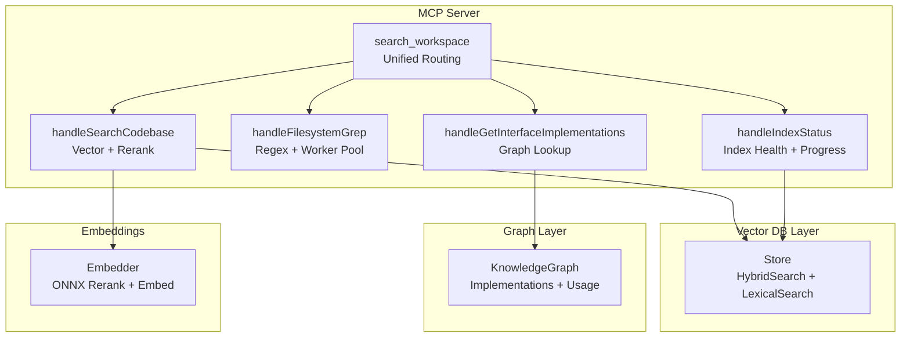
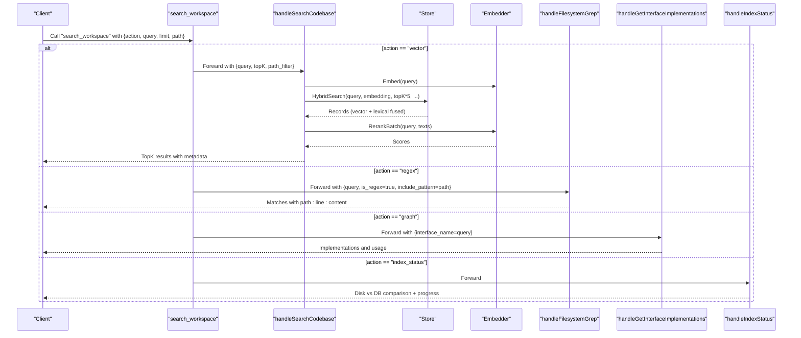
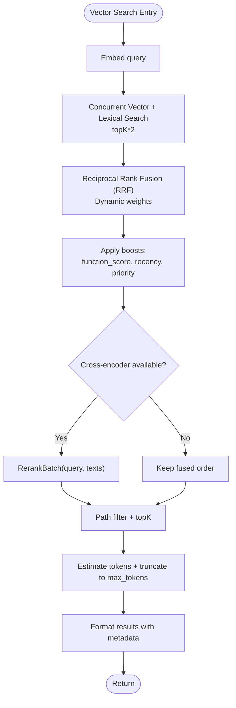
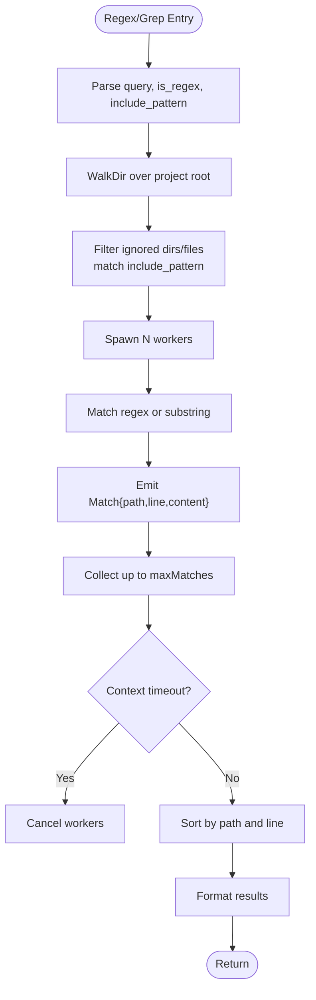
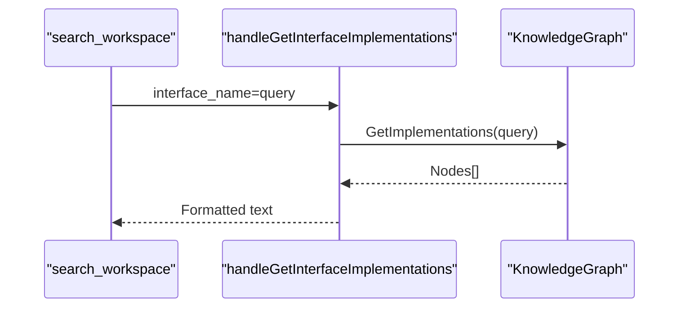
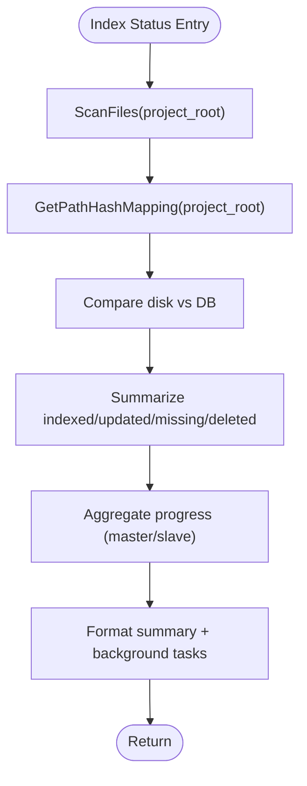
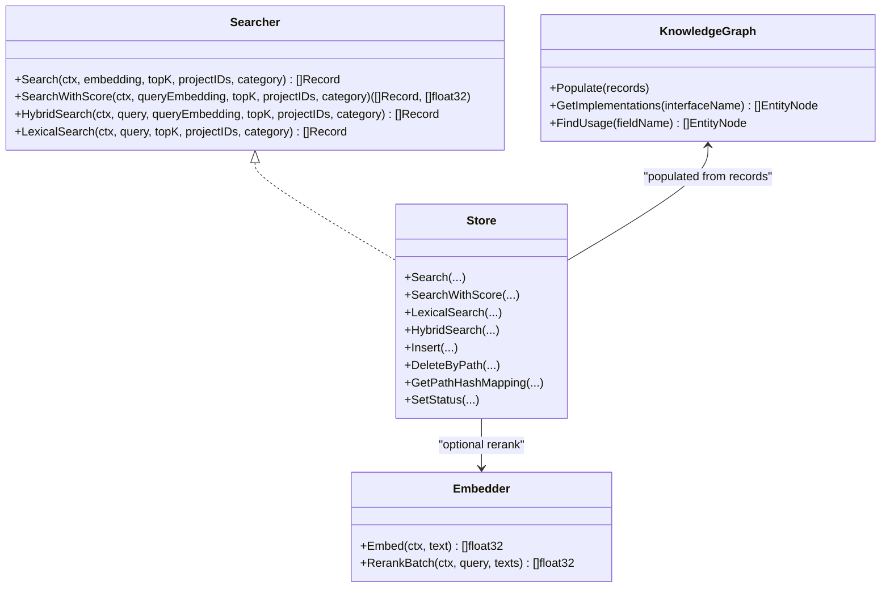

# search_workspace Tool

<cite>
**Referenced Files in This Document**
- [handlers_search.go](file://internal/mcp/handlers_search.go)
- [server.go](file://internal/mcp/server.go)
- [store.go](file://internal/db/store.go)
- [graph.go](file://internal/db/graph.go)
- [handlers_graph.go](file://internal/mcp/handlers_graph.go)
- [handlers_index.go](file://internal/mcp/handlers_index.go)
- [scanner.go](file://internal/indexer/scanner.go)
- [session.go](file://internal/embedding/session.go)
- [README.md](file://README.md)
</cite>

## Table of Contents
1. [Introduction](#introduction)
2. [Project Structure](#project-structure)
3. [Core Components](#core-components)
4. [Architecture Overview](#architecture-overview)
5. [Detailed Component Analysis](#detailed-component-analysis)
6. [Dependency Analysis](#dependency-analysis)
7. [Performance Considerations](#performance-considerations)
8. [Troubleshooting Guide](#troubleshooting-guide)
9. [Conclusion](#conclusion)
10. [Appendices](#appendices)

## Introduction
The search_workspace tool is a unified “Fat Tool” that consolidates four complementary search modalities into a single endpoint:
- Semantic vector search (vector)
- Exact text and regex matching (regex)
- Graph traversal for code relationships (graph)
- Index status and diagnostics (index_status)

This design reduces tool fragmentation, improves LLM tool selection accuracy, and provides a cohesive interface for deep codebase exploration. The tool routes requests to specialized handlers based on the action parameter and returns deterministic, structured results.

## Project Structure
The search_workspace tool is implemented within the MCP server module and integrates with the vector database, graph knowledge base, and indexing subsystems.

**Diagram sources**
- [handlers_search.go:315-365](file://internal/mcp/handlers_search.go#L315-L365)
- [handlers_search.go:191-313](file://internal/mcp/handlers_search.go#L191-L313)
- [handlers_graph.go:10-31](file://internal/mcp/handlers_graph.go#L10-L31)
- [handlers_index.go:96-127](file://internal/mcp/handlers_index.go#L96-L127)
- [store.go:223-336](file://internal/db/store.go#L223-L336)
- [graph.go:107-119](file://internal/db/graph.go#L107-L119)
- [session.go:300-314](file://internal/embedding/session.go#L300-L314)

**Section sources**
- [README.md:13-19](file://README.md#L13-L19)
- [server.go:331-338](file://internal/mcp/server.go#L331-L338)

## Core Components
- Unified router: Parses action, query, limit, and path filters and dispatches to the appropriate handler.
- Vector search: Embeds the query, performs hybrid search (vector + lexical), applies dynamic boosting, and reranks with a cross-encoder when available.
- Regex search: Scans the filesystem with a worker pool, supports regex or substring matching, and returns formatted matches.
- Graph traversal: Resolves interface implementations and usage patterns from the knowledge graph.
- Index status: Compares disk vs. DB state, aggregates background progress, and returns actionable diagnostics.

**Section sources**
- [handlers_search.go:315-365](file://internal/mcp/handlers_search.go#L315-L365)
- [handlers_search.go:191-313](file://internal/mcp/handlers_search.go#L191-L313)
- [handlers_search.go:20-189](file://internal/mcp/handlers_search.go#L20-L189)
- [handlers_graph.go:10-31](file://internal/mcp/handlers_graph.go#L10-L31)
- [handlers_index.go:96-127](file://internal/mcp/handlers_index.go#L96-L127)

## Architecture Overview
The tool orchestrates concurrent operations and applies hybrid ranking to produce high-quality results.

**Diagram sources**
- [handlers_search.go:315-365](file://internal/mcp/handlers_search.go#L315-L365)
- [handlers_search.go:191-313](file://internal/mcp/handlers_search.go#L191-L313)
- [handlers_search.go:20-189](file://internal/mcp/handlers_search.go#L20-L189)
- [handlers_graph.go:10-31](file://internal/mcp/handlers_graph.go#L10-L31)
- [handlers_index.go:96-127](file://internal/mcp/handlers_index.go#L96-L127)
- [store.go:223-336](file://internal/db/store.go#L223-L336)
- [session.go:300-314](file://internal/embedding/session.go#L300-L314)

## Detailed Component Analysis

### Unified Router: search_workspace
- Action routing:
  - vector: Delegates to vector search with topK and path filtering.
  - regex: Delegates to regex/grep with include_pattern and is_regex=true.
  - graph: Delegates to graph traversal for interface implementations.
  - index_status: Delegates to index status reporting.
- Parameter validation and defaults:
  - limit clamped to [1, 100].
  - path acts as an include pattern for regex mode and a path filter for vector mode.
- Error handling:
  - Returns descriptive errors for invalid actions or missing parameters.

**Section sources**
- [handlers_search.go:315-365](file://internal/mcp/handlers_search.go#L315-L365)

### Vector Search: handleSearchCodebase
- Embedding:
  - Generates a dense vector embedding for the query.
- Hybrid search:
  - Concurrently executes vector search and lexical search with larger topK to enable fusion.
  - Uses reciprocal rank fusion (RRF) with dynamic weights based on query characteristics.
- Dynamic boosting:
  - Applies function_score, recency boost for documents, and priority metadata.
- Reranking:
  - Optionally reranks results using a cross-encoder (RerankBatch) when available.
- Filtering and formatting:
  - Applies path filter and token budgeting to keep results within context window.
  - Formats results with metadata (path, line range, symbols, category) and content.

**Diagram sources**
- [handlers_search.go:191-313](file://internal/mcp/handlers_search.go#L191-L313)
- [store.go:223-336](file://internal/db/store.go#L223-L336)
- [session.go:300-314](file://internal/embedding/session.go#L300-L314)

**Section sources**
- [handlers_search.go:191-313](file://internal/mcp/handlers_search.go#L191-L313)
- [store.go:223-336](file://internal/db/store.go#L223-L336)

### Lexical Regex Search: handleFilesystemGrep
- Regex support:
  - Compiles and validates regex patterns; falls back to case-insensitive substring matching when disabled.
- Concurrency:
  - Uses a worker pool and file walker to scan files concurrently.
  - Applies include_pattern to restrict scope.
- Matching and sorting:
  - Emits matches with path, line number, and trimmed content.
  - Sorts results by path and line number.
- Limits and timeouts:
  - Enforces a hard cap on matches and a 30-second context timeout to prevent hangs.

**Diagram sources**
- [handlers_search.go:20-189](file://internal/mcp/handlers_search.go#L20-L189)

**Section sources**
- [handlers_search.go:20-189](file://internal/mcp/handlers_search.go#L20-L189)

### Graph Traversal: handleGetInterfaceImplementations
- Purpose:
  - Returns all struct/class implementations for a given interface name.
- Behavior:
  - Queries the knowledge graph and formats a readable list of implementations with type and path.

**Diagram sources**
- [handlers_search.go:350-358](file://internal/mcp/handlers_search.go#L350-L358)
- [handlers_graph.go:10-31](file://internal/mcp/handlers_graph.go#L10-L31)
- [graph.go:107-119](file://internal/db/graph.go#L107-L119)

**Section sources**
- [handlers_search.go:350-358](file://internal/mcp/handlers_search.go#L350-L358)
- [handlers_graph.go:10-31](file://internal/mcp/handlers_graph.go#L10-L31)
- [graph.go:107-119](file://internal/db/graph.go#L107-L119)

### Index Status: handleIndexStatus
- Disk vs DB comparison:
  - Scans project files and compares hashes to determine indexed, updated, missing, and deleted files.
- Background progress:
  - Aggregates active indexing tasks from progress maps or daemon client.
- Output:
  - Summarizes counts and lists up to ten items for missing/updated files.
  - Includes global status stored in the database.

**Diagram sources**
- [handlers_index.go:96-127](file://internal/mcp/handlers_index.go#L96-L127)
- [handlers_index.go:171-225](file://internal/mcp/handlers_index.go#L171-L225)
- [scanner.go:67-191](file://internal/indexer/scanner.go#L67-L191)

**Section sources**
- [handlers_index.go:96-127](file://internal/mcp/handlers_index.go#L96-L127)
- [handlers_index.go:171-225](file://internal/mcp/handlers_index.go#L171-L225)
- [scanner.go:67-191](file://internal/indexer/scanner.go#L67-L191)

## Dependency Analysis
- Interface contract:
  - Searcher interface defines the core operations: Search, SearchWithScore, HybridSearch, LexicalSearch.
- Store implementation:
  - Provides vector search, lexical filtering, hybrid fusion, and metadata-based boosting.
- Embedder integration:
  - Cross-encoder reranking is optional; fallback to pure vector/rank occurs when unavailable.
- Graph population:
  - KnowledgeGraph is populated from database records and supports interface implementation detection and usage tracing.

**Diagram sources**
- [server.go:29-34](file://internal/mcp/server.go#L29-L34)
- [store.go:80-409](file://internal/db/store.go#L80-L409)
- [graph.go:107-119](file://internal/db/graph.go#L107-L119)
- [session.go:300-314](file://internal/embedding/session.go#L300-L314)

**Section sources**
- [server.go:29-34](file://internal/mcp/server.go#L29-L34)
- [store.go:80-409](file://internal/db/store.go#L80-L409)
- [graph.go:107-119](file://internal/db/graph.go#L107-L119)
- [session.go:300-314](file://internal/embedding/session.go#L300-L314)

## Performance Considerations
- Hybrid search fetches more candidates to enable robust reranking and filtering.
- Dynamic boosting and recency adjustments improve relevance without extra compute cost.
- Cross-encoder reranking is optional; when unavailable, the system gracefully falls back to vector-only ranking.
- Regex search uses a bounded worker pool and a hard cap on matches to prevent resource exhaustion.
- Token budgeting ensures results fit within the configured context window.

[No sources needed since this section provides general guidance]

## Troubleshooting Guide
- Invalid action:
  - Ensure action is one of vector, regex, graph, or index_status.
- Regex compilation errors:
  - Verify the regex pattern is valid; the tool returns a descriptive error.
- Timeout during regex search:
  - Large projects or slow disks can cause timeouts; reduce scope with path/include_pattern or increase timeout externally.
- No results:
  - For vector search, confirm embeddings are available and the database is populated.
  - For regex, verify include_pattern and query specificity.
  - For graph, ensure the interface name exists in the knowledge graph.
- Index status discrepancies:
  - Use index_status to compare disk vs DB and identify missing/updated/deleted files.
  - Check background progress and logs for stuck tasks.

**Section sources**
- [handlers_search.go:362-364](file://internal/mcp/handlers_search.go#L362-L364)
- [handlers_search.go:37-40](file://internal/mcp/handlers_search.go#L37-L40)
- [handlers_index.go:171-225](file://internal/mcp/handlers_index.go#L171-L225)

## Conclusion
The search_workspace tool unifies semantic, lexical, graph, and indexing capabilities into a single, deterministic interface. Its hybrid search algorithm balances recall and precision, while the unified routing simplifies agent workflows. By leveraging concurrent operations, dynamic boosting, and optional reranking, it delivers high-quality results efficiently.

[No sources needed since this section summarizes without analyzing specific files]

## Appendices

### API Definition: search_workspace
- Tool name: search_workspace
- Description: Unified search engine for deep codebase exploration. Use this for semantic search (vector), exact text/regex matching (ripgrep), following code relationship graphs (calls/imports), or checking indexing progress.
- Parameters:
  - action (string): The type of search. Values: vector, regex, graph, index_status.
  - query (string): The search query, symbol name, or regex pattern.
  - limit (number): Max number of results to return (default 10).
  - path (string): Optional file or directory path to restrict the search scope.

**Section sources**
- [server.go:331-338](file://internal/mcp/server.go#L331-L338)

### Hybrid Search Algorithm Details
- Concurrent vector and lexical search with larger topK to enable fusion.
- Reciprocal Rank Fusion (RRF) with dynamic weights:
  - Boost lexical weight when query contains code-like identifiers.
- Metadata-based boosting:
  - function_score, recency boost for documents, and priority metadata.
- Optional cross-encoder reranking:
  - RerankBatch(query, texts) when available; otherwise fallback to fused order.

**Section sources**
- [store.go:223-336](file://internal/db/store.go#L223-L336)
- [session.go:300-314](file://internal/embedding/session.go#L300-L314)

### Practical Examples
- Vector search:
  - action: vector, query: "HTTP client initialization", limit: 10, path: "internal/"
- Regex search:
  - action: regex, query: "TODO.*fix", limit: 50, path: "*.go"
- Graph search:
  - action: graph, query: "Repository", limit: 20
- Index status:
  - action: index_status

**Section sources**
- [handlers_search.go:315-365](file://internal/mcp/handlers_search.go#L315-L365)

### Result Formatting and Scoring
- Vector results include:
  - Path, line range, category, entities, and content.
  - Token estimation and truncation to stay within max_tokens.
- Regex results include:
  - Path, line number, and trimmed content.
- Graph results include:
  - Implementation details with type and path.
- Index status includes:
  - Counts of indexed/updated/missing/deleted files and background progress.

**Section sources**
- [handlers_search.go:277-312](file://internal/mcp/handlers_search.go#L277-L312)
- [handlers_search.go:178-188](file://internal/mcp/handlers_search.go#L178-L188)
- [handlers_graph.go:25-30](file://internal/mcp/handlers_graph.go#L25-L30)
- [handlers_index.go:197-224](file://internal/mcp/handlers_index.go#L197-L224)