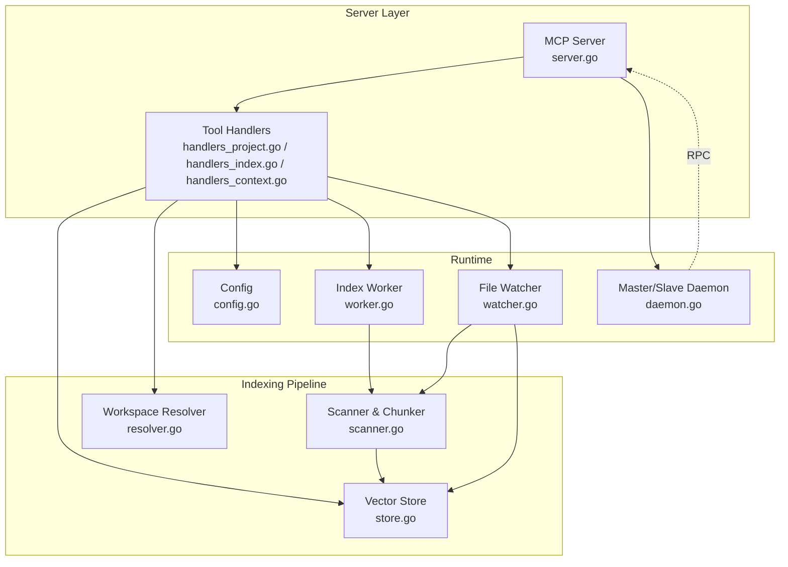
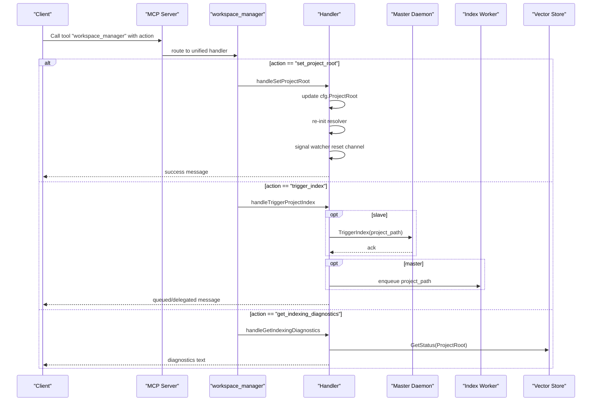
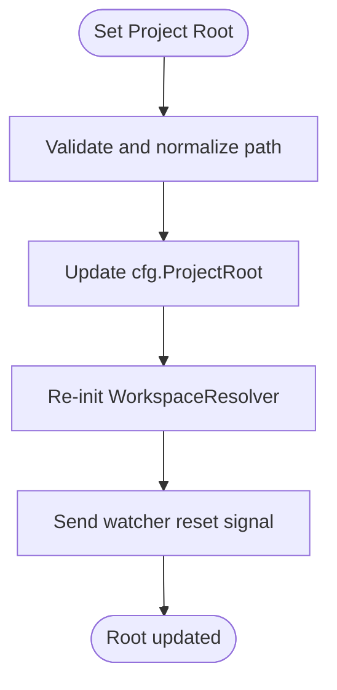
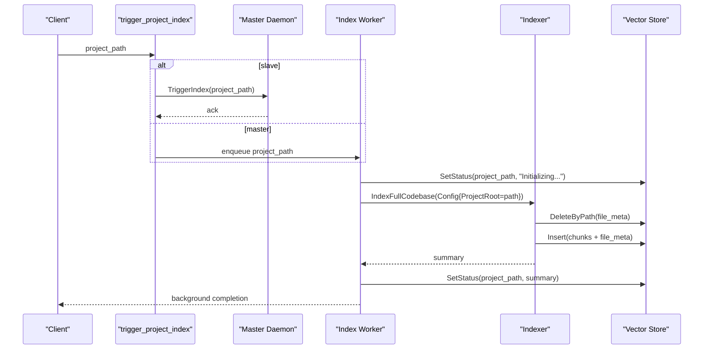
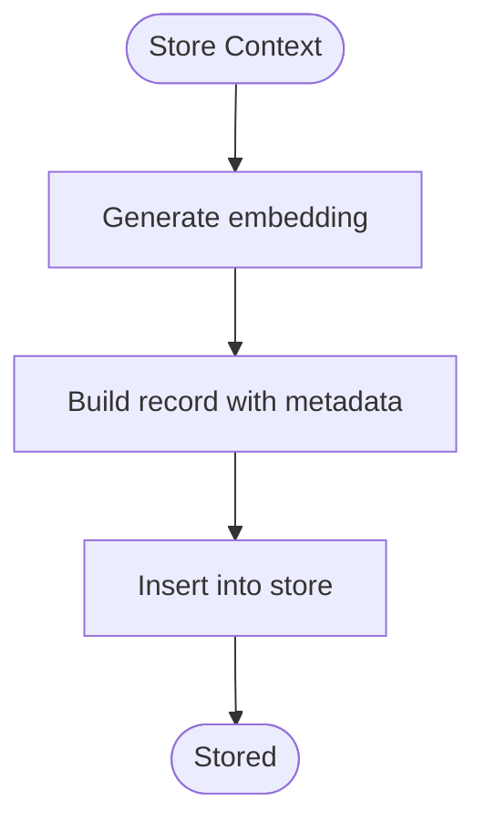
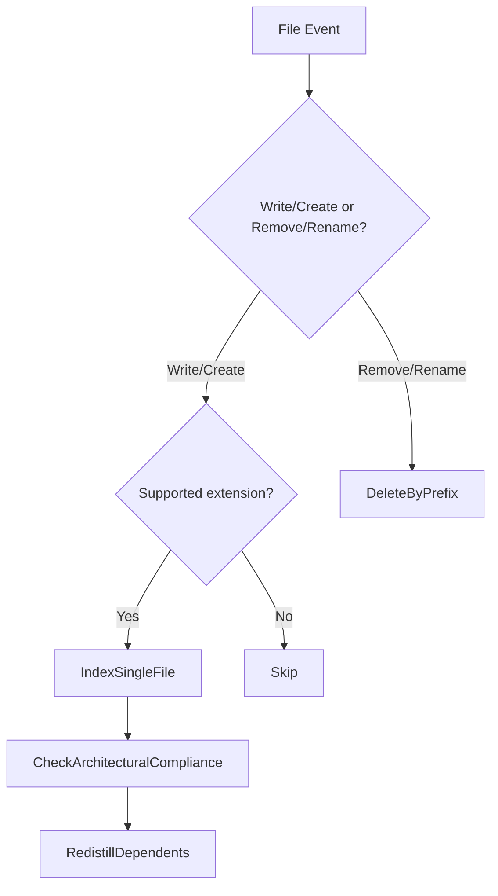
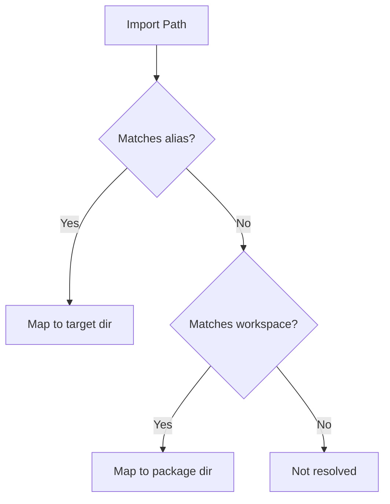
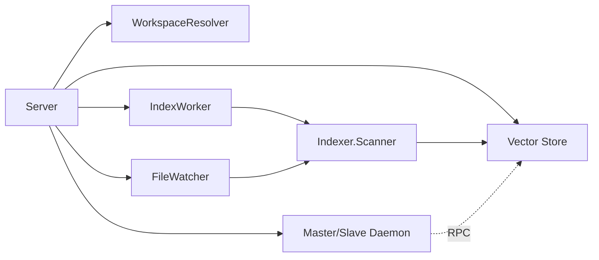

# workspace_manager Tool

<cite>
**Referenced Files in This Document**
- [main.go](file://main.go)
- [server.go](file://internal/mcp/server.go)
- [handlers_project.go](file://internal/mcp/handlers_project.go)
- [handlers_index.go](file://internal/mcp/handlers_index.go)
- [handlers_context.go](file://internal/mcp/handlers_context.go)
- [resolver.go](file://internal/indexer/resolver.go)
- [workspace.go](file://internal/util/workspace.go)
- [watcher.go](file://internal/watcher/watcher.go)
- [scanner.go](file://internal/indexer/scanner.go)
- [store.go](file://internal/db/store.go)
- [daemon.go](file://internal/daemon/daemon.go)
- [worker.go](file://internal/worker/worker.go)
- [config.go](file://internal/config/config.go)
</cite>

## Table of Contents
1. [Introduction](#introduction)
2. [Project Structure](#project-structure)
3. [Core Components](#core-components)
4. [Architecture Overview](#architecture-overview)
5. [Detailed Component Analysis](#detailed-component-analysis)
6. [Dependency Analysis](#dependency-analysis)
7. [Performance Considerations](#performance-considerations)
8. [Troubleshooting Guide](#troubleshooting-guide)
9. [Conclusion](#conclusion)
10. [Appendices](#appendices)

## Introduction
This document explains the workspace_manager tool that orchestrates project lifecycle and indexing operations. It focuses on three core actions:
- set_project_root: Switch the active workspace/project root and reset the file watcher.
- trigger_index: Manually initiate a targeted re-indexing run for a given project path.
- get_indexing_diagnostics: Retrieve system health diagnostics and status for indexing.

It also documents project root management, workspace resolution, monorepo support, indexing control and progress tracking, context storage, configuration management, project state persistence, and integration with the file watcher system.

## Project Structure
The workspace_manager tool is part of the MCP server and integrates with:
- Configuration management for project root and runtime settings
- Indexing pipeline for scanning, chunking, embedding, and storing vectors
- File watcher for live indexing and proactive analysis
- Daemon for master/slave coordination and remote RPC operations
- Worker for background indexing tasks

**Diagram sources**
- [server.go:67-128](file://internal/mcp/server.go#L67-L128)
- [handlers_project.go:134-161](file://internal/mcp/handlers_project.go#L134-L161)
- [handlers_index.go:16-38](file://internal/mcp/handlers_index.go#L16-L38)
- [handlers_context.go:14-32](file://internal/mcp/handlers_context.go#L14-L32)
- [scanner.go:67-191](file://internal/indexer/scanner.go#L67-L191)
- [resolver.go:16-27](file://internal/indexer/resolver.go#L16-L27)
- [store.go:35-64](file://internal/db/store.go#L35-L64)
- [watcher.go:22-56](file://internal/watcher/watcher.go#L22-L56)
- [worker.go:24-44](file://internal/worker/worker.go#L24-L44)
- [daemon.go:326-399](file://internal/daemon/daemon.go#L326-L399)
- [config.go:30-130](file://internal/config/config.go#L30-L130)

**Section sources**
- [server.go:67-128](file://internal/mcp/server.go#L67-L128)
- [main.go:93-176](file://main.go#L93-L176)

## Core Components
- MCP Server: Registers tools, routes requests, and coordinates with the vector store, watcher, and daemon.
- Workspace Manager Tool: Unified tool that delegates to specific handlers for project root switching, indexing, and diagnostics.
- Indexer: Scans files, computes hashes, chunks content, generates embeddings, and inserts records into the vector store.
- File Watcher: Monitors file system events and triggers targeted re-indexing and analysis.
- Worker: Processes background indexing jobs from a queue.
- Daemon: Provides master/slave RPC services for embedding, indexing, and store operations.
- Configuration: Loads runtime settings and project root, and provides helpers for relative paths.

**Section sources**
- [server.go:334-418](file://internal/mcp/server.go#L334-L418)
- [handlers_project.go:134-161](file://internal/mcp/handlers_project.go#L134-L161)
- [handlers_index.go:16-38](file://internal/mcp/handlers_index.go#L16-L38)
- [handlers_context.go:14-32](file://internal/mcp/handlers_context.go#L14-L32)
- [scanner.go:67-191](file://internal/indexer/scanner.go#L67-L191)
- [watcher.go:22-86](file://internal/watcher/watcher.go#L22-L86)
- [worker.go:24-112](file://internal/worker/worker.go#L24-L112)
- [daemon.go:326-399](file://internal/daemon/daemon.go#L326-L399)
- [config.go:30-130](file://internal/config/config.go#L30-L130)

## Architecture Overview
The workspace_manager tool is a thin dispatcher that routes to:
- set_project_root: Updates the active project root, re-initializes the monorepo resolver, and signals the file watcher to reset.
- trigger_index: Delegates to the master daemon if running as a slave, otherwise enqueues the path for background indexing.
- get_indexing_diagnostics: Aggregates progress, global status, and database statistics.

**Diagram sources**
- [handlers_project.go:134-161](file://internal/mcp/handlers_project.go#L134-L161)
- [handlers_index.go:16-38](file://internal/mcp/handlers_index.go#L16-L38)
- [handlers_index.go:129-169](file://internal/mcp/handlers_index.go#L129-L169)
- [handlers_context.go:14-32](file://internal/mcp/handlers_context.go#L14-L32)
- [daemon.go:410-423](file://internal/daemon/daemon.go#L410-L423)
- [worker.go:47-61](file://internal/worker/worker.go#L47-L61)
- [store.go:603-610](file://internal/db/store.go#L603-L610)

## Detailed Component Analysis

### Project Root Management and Workspace Resolution
- Project root switching:
  - The handler validates the path, converts to absolute, updates the configuration, re-initializes the monorepo resolver, and signals the file watcher to reset.
  - The watcher resets its watch set and re-watches recursively under the new root.
- Workspace resolution:
  - The resolver parses tsconfig path aliases and pnpm/package.json workspaces to resolve import paths and package locations.
  - This enables monorepo-aware navigation and analysis.

**Diagram sources**
- [handlers_context.go:14-32](file://internal/mcp/handlers_context.go#L14-L32)
- [resolver.go:16-27](file://internal/indexer/resolver.go#L16-L27)
- [watcher.go:102-119](file://internal/watcher/watcher.go#L102-L119)

**Section sources**
- [handlers_context.go:14-32](file://internal/mcp/handlers_context.go#L14-L32)
- [resolver.go:16-27](file://internal/indexer/resolver.go#L16-L27)
- [resolver.go:169-188](file://internal/indexer/resolver.go#L169-L188)
- [watcher.go:102-119](file://internal/watcher/watcher.go#L102-L119)

### Indexing Control Mechanisms, Progress Tracking, and Status Reporting
- Manual re-indexing:
  - The handler accepts a project_path and either delegates to the master daemon (slave) or enqueues the path for background processing (master).
- Background indexing:
  - The worker pulls paths from the queue, sets progress/status, and runs a full scan-and-update cycle.
  - The indexer compares hashes to skip unchanged files, deletes stale records, and batches inserts.
- Progress tracking:
  - A thread-safe map stores per-project progress strings; the MCP resource “index://status” surfaces the current status and record count.
  - Slaves fetch progress from the master via RPC.
- Status reporting:
  - The handler aggregates active tasks, global status, and database stats for diagnostics.

**Diagram sources**
- [handlers_index.go:16-38](file://internal/mcp/handlers_index.go#L16-L38)
- [daemon.go:410-423](file://internal/daemon/daemon.go#L410-L423)
- [worker.go:63-111](file://internal/worker/worker.go#L63-L111)
- [scanner.go:67-191](file://internal/indexer/scanner.go#L67-L191)
- [store.go:586-610](file://internal/db/store.go#L586-L610)

**Section sources**
- [handlers_index.go:16-38](file://internal/mcp/handlers_index.go#L16-L38)
- [handlers_index.go:96-127](file://internal/mcp/handlers_index.go#L96-L127)
- [handlers_index.go:129-169](file://internal/mcp/handlers_index.go#L129-L169)
- [worker.go:63-111](file://internal/worker/worker.go#L63-L111)
- [scanner.go:67-191](file://internal/indexer/scanner.go#L67-L191)
- [store.go:586-610](file://internal/db/store.go#L586-L610)

### Context Management System
- Storing context:
  - The handler embeds arbitrary text, constructs a record with metadata, and inserts it into the vector store.
- Deleting context:
  - Supports deleting by exact path/prefix or clearing an entire project’s index.
- Retrieval:
  - Uses hybrid search and lexical search to surface relevant context.

**Diagram sources**
- [handlers_context.go:34-64](file://internal/mcp/handlers_context.go#L34-L64)
- [store.go:66-78](file://internal/db/store.go#L66-L78)

**Section sources**
- [handlers_context.go:34-64](file://internal/mcp/handlers_context.go#L34-L64)
- [handlers_index.go:40-94](file://internal/mcp/handlers_index.go#L40-L94)
- [store.go:66-78](file://internal/db/store.go#L66-L78)

### File Watcher Integration
- Live indexing:
  - On file writes/creates for supported extensions, the watcher indexes the file, checks architectural compliance, and may trigger redistillation for dependents.
- Directory changes:
  - Newly created directories are added to the watcher; deletions/renames trigger prefix-based deletions from the vector store.
- Resetting:
  - The watcher walks the previous root to remove watches and then recursively watches the new root.

**Diagram sources**
- [watcher.go:141-196](file://internal/watcher/watcher.go#L141-L196)
- [watcher.go:198-244](file://internal/watcher/watcher.go#L198-L244)
- [watcher.go:246-280](file://internal/watcher/watcher.go#L246-L280)

**Section sources**
- [watcher.go:58-86](file://internal/watcher/watcher.go#L58-L86)
- [watcher.go:102-119](file://internal/watcher/watcher.go#L102-L119)
- [watcher.go:141-196](file://internal/watcher/watcher.go#L141-L196)

### Monorepo Support
- Path aliases:
  - Reads tsconfig compilerOptions.paths to map aliases like “@/*” to “src/*”.
- Workspaces:
  - Parses pnpm-workspace.yaml and package.json workspaces to discover nested packages and resolve import paths.
- Resolution:
  - Tries path aliases first, then workspace mappings, returning a relative directory for imports.

**Diagram sources**
- [resolver.go:87-114](file://internal/indexer/resolver.go#L87-L114)
- [resolver.go:116-149](file://internal/indexer/resolver.go#L116-L149)
- [resolver.go:169-188](file://internal/indexer/resolver.go#L169-L188)

**Section sources**
- [resolver.go:87-114](file://internal/indexer/resolver.go#L87-L114)
- [resolver.go:116-149](file://internal/indexer/resolver.go#L116-L149)
- [resolver.go:169-188](file://internal/indexer/resolver.go#L169-L188)

## Dependency Analysis
- Coupling:
  - The MCP server composes the resolver, watcher, worker, daemon, and store; handlers depend on these components.
- Cohesion:
  - Handlers encapsulate specific actions; the unified workspace_manager reduces duplication.
- External dependencies:
  - RPC for master/slave coordination; fsnotify for file watching; vector database for persistence.

**Diagram sources**
- [server.go:67-128](file://internal/mcp/server.go#L67-L128)
- [worker.go:24-44](file://internal/worker/worker.go#L24-L44)
- [scanner.go:67-191](file://internal/indexer/scanner.go#L67-L191)
- [watcher.go:22-56](file://internal/watcher/watcher.go#L22-L56)
- [daemon.go:326-399](file://internal/daemon/daemon.go#L326-L399)

**Section sources**
- [server.go:67-128](file://internal/mcp/server.go#L67-L128)
- [daemon.go:326-399](file://internal/daemon/daemon.go#L326-L399)

## Performance Considerations
- Batch embeddings:
  - The indexer attempts batch embeddings and falls back to sequential embedding if needed.
- Parallel processing:
  - Indexing workers and scanners use goroutines and channels to parallelize file processing.
- Caching:
  - The store caches parsed JSON arrays to reduce repeated unmarshalling.
- Memory throttling:
  - A memory throttler is integrated to limit resource usage during embedding and indexing.

[No sources needed since this section provides general guidance]

## Troubleshooting Guide
- Indexing appears stuck:
  - Check the master daemon logs and the “index://status” resource for progress.
  - Verify the file watcher is enabled and not blocked by ignore rules.
- Diagnostics:
  - Use the “get_indexing_diagnostics” tool to review active tasks, global status, and database statistics.
- Path issues:
  - Ensure the project root is an absolute path and that the watcher reset completes successfully after switching roots.

**Section sources**
- [handlers_index.go:129-169](file://internal/mcp/handlers_index.go#L129-L169)
- [server.go:202-237](file://internal/mcp/server.go#L202-L237)
- [watcher.go:102-119](file://internal/watcher/watcher.go#L102-L119)

## Conclusion
The workspace_manager tool centralizes workspace lifecycle and indexing operations, integrating tightly with the indexing pipeline, file watcher, and daemon architecture. It provides robust controls for switching roots, triggering targeted re-indexing, and diagnosing system health, while supporting monorepos and live indexing.

[No sources needed since this section summarizes without analyzing specific files]

## Appendices

### Configuration Management
- Environment variables and defaults:
  - Project root, data directory, database path, models directory, logging path, model names, reranker model, dimension, watcher flags, embedder pool size, and API port.
- Relative path helper:
  - Utility to compute relative paths for metadata and status reporting.

**Section sources**
- [config.go:30-130](file://internal/config/config.go#L30-L130)
- [config.go:132-138](file://internal/config/config.go#L132-L138)

### Project State Persistence
- Status persistence:
  - Project status is stored as a special record type keyed by project_id.
- Record types:
  - “chunk” for content vectors, “file_meta” for file metadata and hashes, “project_status” for indexing status, and “shared_knowledge” for stored context.

**Section sources**
- [store.go:586-610](file://internal/db/store.go#L586-L610)
- [scanner.go:308-332](file://internal/indexer/scanner.go#L308-L332)
- [handlers_context.go:51-59](file://internal/mcp/handlers_context.go#L51-L59)

### Examples

- Switching workspaces:
  - Call the unified tool with action “set_project_root” and provide the new project path. The server updates the root, re-initializes the resolver, and resets the watcher.
  - See [handlers_project.go:134-161](file://internal/mcp/handlers_project.go#L134-L161) and [handlers_context.go:14-32](file://internal/mcp/handlers_context.go#L14-L32).

- Triggering targeted re-indexing:
  - Call the unified tool with action “trigger_index” and provide the project path. The server either enqueues the job (master) or delegates to the master daemon (slave).
  - See [handlers_project.go:134-161](file://internal/mcp/handlers_project.go#L134-L161) and [handlers_index.go:16-38](file://internal/mcp/handlers_index.go#L16-L38).

- Diagnosing indexing issues:
  - Call the unified tool with action “get_indexing_diagnostics” to receive a report of active tasks, global status, and database statistics.
  - See [handlers_project.go:134-161](file://internal/mcp/handlers_project.go#L134-L161) and [handlers_index.go:129-169](file://internal/mcp/handlers_index.go#L129-L169).