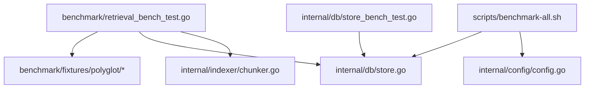
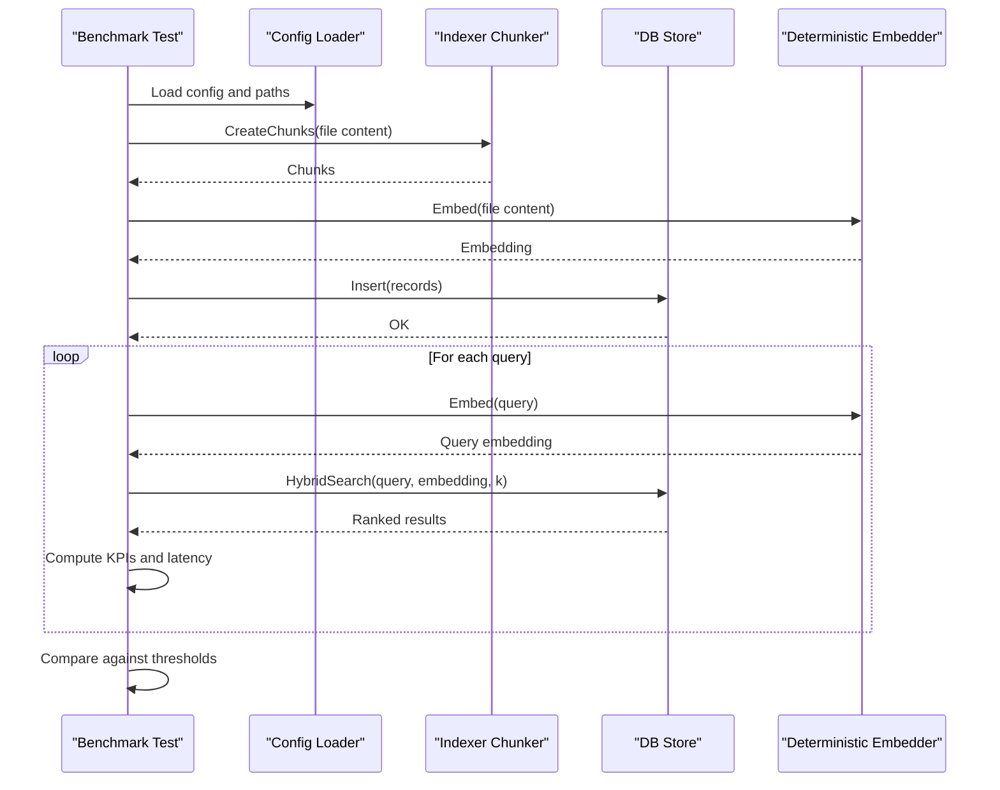
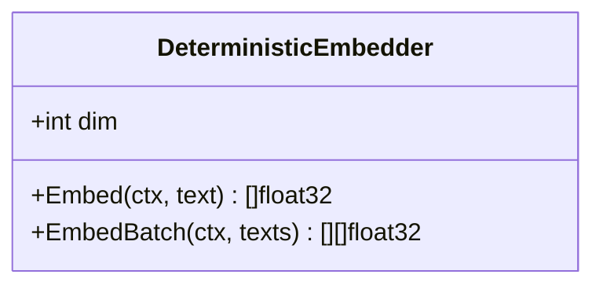
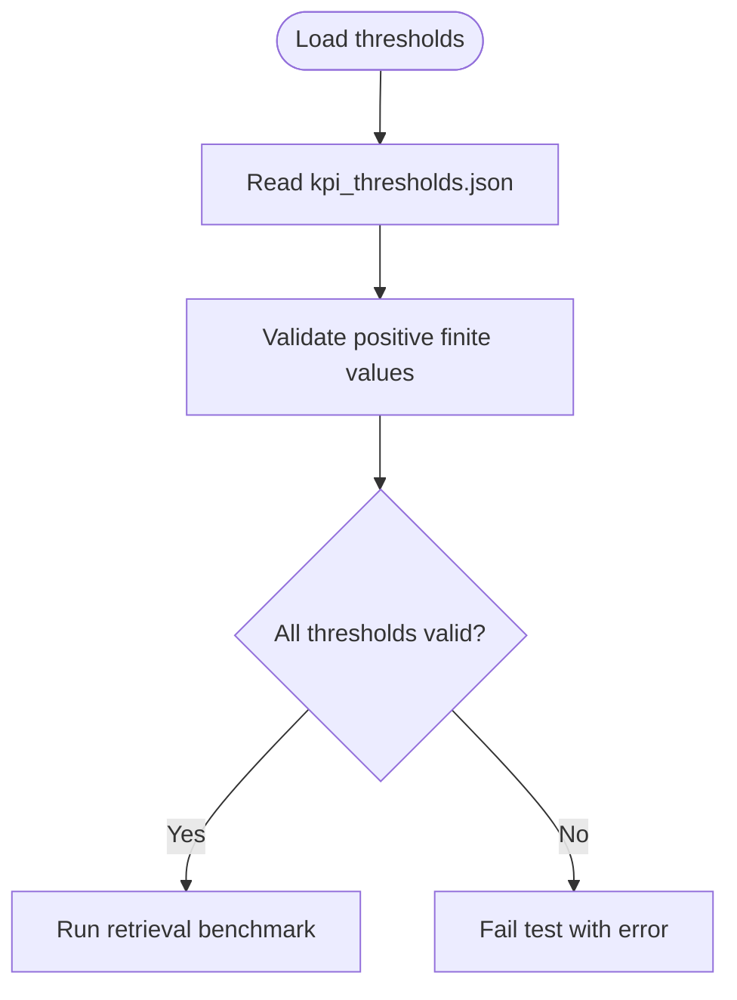
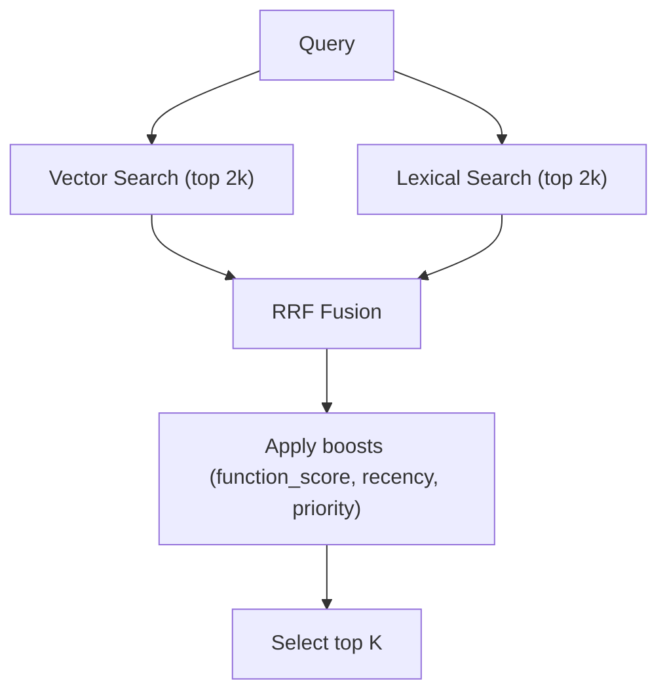
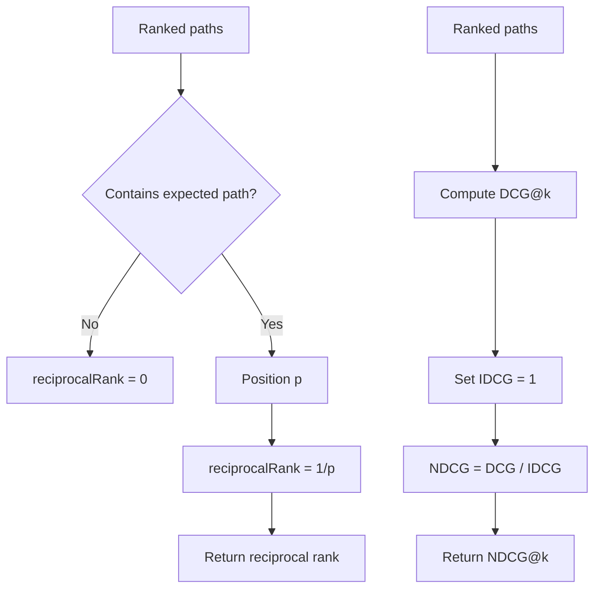
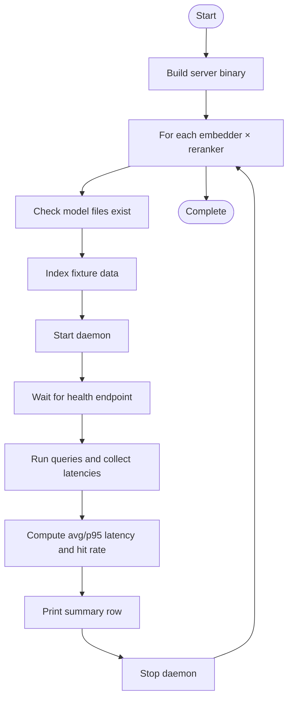
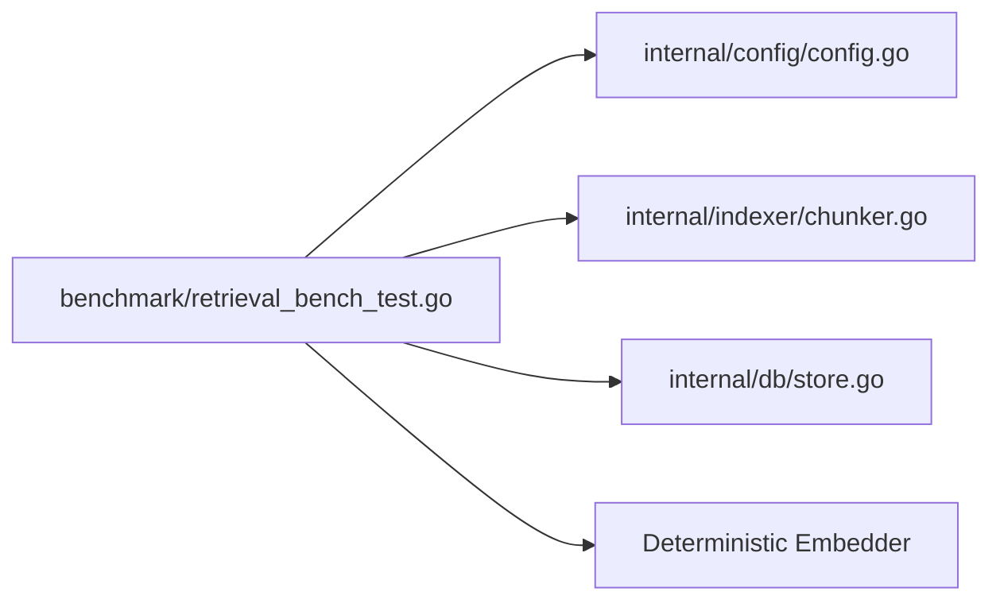

# Benchmarking and Performance Testing

<cite>
**Referenced Files in This Document**
- [benchmark/retrieval_bench_test.go](file://benchmark/retrieval_bench_test.go)
- [benchmark/fixtures/polyglot/README.md](file://benchmark/fixtures/polyglot/README.md)
- [benchmark/fixtures/polyglot/kpi_thresholds.json](file://benchmark/fixtures/polyglot/kpi_thresholds.json)
- [benchmark/fixtures/polyglot/main.go](file://benchmark/fixtures/polyglot/main.go)
- [benchmark/fixtures/polyglot/service.ts](file://benchmark/fixtures/polyglot/service.ts)
- [benchmark/fixtures/polyglot/worker.py](file://benchmark/fixtures/polyglot/worker.py)
- [internal/db/store.go](file://internal/db/store.go)
- [internal/indexer/chunker.go](file://internal/indexer/chunker.go)
- [scripts/benchmark-all.sh](file://scripts/benchmark-all.sh)
- [internal/config/config.go](file://internal/config/config.go)
- [internal/db/store_bench_test.go](file://internal/db/store_bench_test.go)
- [README.md](file://README.md)
</cite>

## Table of Contents
1. [Introduction](#introduction)
2. [Project Structure](#project-structure)
3. [Core Components](#core-components)
4. [Architecture Overview](#architecture-overview)
5. [Detailed Component Analysis](#detailed-component-analysis)
6. [Dependency Analysis](#dependency-analysis)
7. [Performance Considerations](#performance-considerations)
8. [Troubleshooting Guide](#troubleshooting-guide)
9. [Conclusion](#conclusion)
10. [Appendices](#appendices)

## Introduction
This document describes the benchmarking and performance testing framework for Vector MCP Go. It focuses on:
- Retrieval performance testing using a polyglot fixture with Go, TypeScript, and Python code samples
- Deterministic embedder for stable benchmark assertions
- Quality KPIs (recall@k, MRR, NDCG), latency measurements (p50/p95), and indexing performance metrics
- Regression testing via KPI thresholds
- Guidance on running benchmarks, interpreting results, and establishing baselines
- Utilities for reciprocal rank, NDCG computation, and percentile latency calculations

## Project Structure
The benchmarking system is organized around a dedicated benchmark package, a polyglot fixture set, and supporting scripts and utilities:
- benchmark/retrieval_bench_test.go: End-to-end retrieval benchmark validating KPI thresholds against the polyglot fixture
- benchmark/fixtures/polyglot: Deterministic fixture with small code samples and KPI thresholds
- internal/db/store.go: Hybrid search implementation (vector + lexical) used by the benchmark
- internal/indexer/chunker.go: Chunking logic used during fixture indexing
- scripts/benchmark-all.sh: Full-system benchmark harness for indexing and latency across model configurations
- internal/db/store_bench_test.go: Low-level lexical search benchmark for database performance
- internal/config/config.go: Configuration loader used by the benchmark harness

**Diagram sources**
- [benchmark/retrieval_bench_test.go:1-357](file://benchmark/retrieval_bench_test.go#L1-L357)
- [benchmark/fixtures/polyglot/README.md:1-5](file://benchmark/fixtures/polyglot/README.md#L1-L5)
- [internal/db/store.go:1-664](file://internal/db/store.go#L1-L664)
- [internal/indexer/chunker.go:1-759](file://internal/indexer/chunker.go#L1-L759)
- [scripts/benchmark-all.sh:1-127](file://scripts/benchmark-all.sh#L1-L127)
- [internal/db/store_bench_test.go:1-52](file://internal/db/store_bench_test.go#L1-L52)
- [internal/config/config.go:1-139](file://internal/config/config.go#L1-L139)

**Section sources**
- [benchmark/retrieval_bench_test.go:1-357](file://benchmark/retrieval_bench_test.go#L1-L357)
- [benchmark/fixtures/polyglot/README.md:1-5](file://benchmark/fixtures/polyglot/README.md#L1-L5)
- [scripts/benchmark-all.sh:1-127](file://scripts/benchmark-all.sh#L1-L127)
- [internal/db/store.go:1-664](file://internal/db/store.go#L1-L664)
- [internal/indexer/chunker.go:1-759](file://internal/indexer/chunker.go#L1-L759)
- [internal/db/store_bench_test.go:1-52](file://internal/db/store_bench_test.go#L1-L52)
- [internal/config/config.go:1-139](file://internal/config/config.go#L1-L139)

## Core Components
- Deterministic Embedder: Provides reproducible embeddings keyed by input text to ensure stable benchmark assertions
- Polyglot Fixture: Small, intentional code samples in Go, TypeScript, and Python used for retrieval quality and latency tests
- Hybrid Search Engine: Combines vector and lexical search with Reciprocal Rank Fusion (RRF) and optional reranking
- KPI Thresholds: Minimum acceptable values for recall@k, MRR, and NDCG to detect regressions
- Benchmark Utilities: Functions for reciprocal rank, NDCG, mean, and percentile latency calculations
- Full-System Harness: Script to index data and measure latency across model configurations

**Section sources**
- [benchmark/retrieval_bench_test.go:21-53](file://benchmark/retrieval_bench_test.go#L21-L53)
- [benchmark/fixtures/polyglot/kpi_thresholds.json:1-6](file://benchmark/fixtures/polyglot/kpi_thresholds.json#L1-L6)
- [internal/db/store.go:223-336](file://internal/db/store.go#L223-L336)
- [benchmark/retrieval_bench_test.go:280-340](file://benchmark/retrieval_bench_test.go#L280-L340)
- [scripts/benchmark-all.sh:24-127](file://scripts/benchmark-all.sh#L24-L127)

## Architecture Overview
The retrieval benchmark executes the following flow:
- Load KPI thresholds from the fixture
- Create a temporary database and index fixture files by chunking content and inserting records
- For each query, compute the embedding, perform hybrid search, and compute KPIs and latency
- Compare computed KPIs against thresholds to detect regressions

**Diagram sources**
- [benchmark/retrieval_bench_test.go:92-224](file://benchmark/retrieval_bench_test.go#L92-L224)
- [internal/indexer/chunker.go:43-101](file://internal/indexer/chunker.go#L43-L101)
- [internal/db/store.go:223-336](file://internal/db/store.go#L223-L336)
- [internal/config/config.go:30-130](file://internal/config/config.go#L30-L130)

## Detailed Component Analysis

### Deterministic Embedder
Purpose: Produce stable, deterministic embeddings keyed by input text to ensure reproducible benchmark results.

Key behaviors:
- Hash input text to derive a seed
- Generate a fixed-length embedding vector using the seed
- Support batch embedding for efficiency

**Diagram sources**
- [benchmark/retrieval_bench_test.go:21-53](file://benchmark/retrieval_bench_test.go#L21-L53)

**Section sources**
- [benchmark/retrieval_bench_test.go:21-53](file://benchmark/retrieval_bench_test.go#L21-L53)

### Polyglot Fixture and KPI Thresholds
- Fixture: Intentionally small code samples in Go, TypeScript, and Python
- Purpose: Provide deterministic, controlled retrieval scenarios
- KPI thresholds: Minimum acceptable values for recall@k, MRR, and NDCG

**Diagram sources**
- [benchmark/retrieval_bench_test.go:70-90](file://benchmark/retrieval_bench_test.go#L70-L90)
- [benchmark/fixtures/polyglot/kpi_thresholds.json:1-6](file://benchmark/fixtures/polyglot/kpi_thresholds.json#L1-L6)

**Section sources**
- [benchmark/fixtures/polyglot/README.md:1-5](file://benchmark/fixtures/polyglot/README.md#L1-L5)
- [benchmark/fixtures/polyglot/kpi_thresholds.json:1-6](file://benchmark/fixtures/polyglot/kpi_thresholds.json#L1-L6)
- [benchmark/fixtures/polyglot/main.go:1-12](file://benchmark/fixtures/polyglot/main.go#L1-L12)
- [benchmark/fixtures/polyglot/service.ts:1-20](file://benchmark/fixtures/polyglot/service.ts#L1-L20)
- [benchmark/fixtures/polyglot/worker.py:1-7](file://benchmark/fixtures/polyglot/worker.py#L1-L7)

### Hybrid Search Engine
Hybrid search combines vector and lexical search with Reciprocal Rank Fusion (RRF) and optional reranking:
- Concurrent vector and lexical search
- RRF scoring with dynamic weights
- Optional reranking using a cross-encoder
- Boosts for function score and recency

**Diagram sources**
- [internal/db/store.go:223-336](file://internal/db/store.go#L223-L336)

**Section sources**
- [internal/db/store.go:223-336](file://internal/db/store.go#L223-L336)

### Retrieval KPIs and Utilities
KPIs computed per query:
- Recall@k: Fraction of queries where the expected path appears in top-k
- MRR: Mean of reciprocal ranks for expected path positions
- NDCG@k: Normalized Discounted Cumulative Gain at k using binary relevance

Latency metrics:
- p50 and p95 percentile of per-query latency

Utilities:
- reciprocalRank: Computes reciprocal rank for a ranked list
- ndcgAtK: Computes NDCG@k for binary relevance
- mean: Arithmetic mean
- percentileDuration: Nearest-rank percentile for durations

**Diagram sources**
- [benchmark/retrieval_bench_test.go:280-309](file://benchmark/retrieval_bench_test.go#L280-L309)

**Section sources**
- [benchmark/retrieval_bench_test.go:164-224](file://benchmark/retrieval_bench_test.go#L164-L224)
- [benchmark/retrieval_bench_test.go:280-340](file://benchmark/retrieval_bench_test.go#L280-L340)

### Full-System Benchmark Harness
The script benchmarks indexing and latency across model configurations:
- Builds the server binary
- Iterates over embedder and reranker combinations
- Indexes fixture data, starts the daemon, runs queries, measures latency, and computes hit rate
- Outputs summary statistics

**Diagram sources**
- [scripts/benchmark-all.sh:20-127](file://scripts/benchmark-all.sh#L20-L127)

**Section sources**
- [scripts/benchmark-all.sh:20-127](file://scripts/benchmark-all.sh#L20-L127)

### Database-Level Benchmark
Low-level benchmark for lexical search performance using a synthetic dataset.

**Section sources**
- [internal/db/store_bench_test.go:1-52](file://internal/db/store_bench_test.go#L1-L52)

## Dependency Analysis
The retrieval benchmark depends on:
- Configuration loading for paths and model settings
- Indexer chunker for converting file content into chunks
- Database store for insertion and hybrid search
- Deterministic embedder for embeddings

**Diagram sources**
- [benchmark/retrieval_bench_test.go:16-19](file://benchmark/retrieval_bench_test.go#L16-L19)
- [internal/config/config.go:30-130](file://internal/config/config.go#L30-L130)
- [internal/indexer/chunker.go:43-101](file://internal/indexer/chunker.go#L43-L101)
- [internal/db/store.go:223-336](file://internal/db/store.go#L223-L336)

**Section sources**
- [benchmark/retrieval_bench_test.go:16-19](file://benchmark/retrieval_bench_test.go#L16-L19)
- [internal/config/config.go:30-130](file://internal/config/config.go#L30-L130)
- [internal/indexer/chunker.go:43-101](file://internal/indexer/chunker.go#L43-L101)
- [internal/db/store.go:223-336](file://internal/db/store.go#L223-L336)

## Performance Considerations
- Hybrid search fetches more candidates to improve fusion quality; adjust top-k multipliers to balance latency and quality
- Dynamic weighting in RRF can favor lexical matches for code-like queries; tune weights based on workload
- Optional reranking adds latency but improves ranking precision; enable only when needed
- Indexing throughput scales with chunk size and overlap; ensure chunking parameters align with embedding model context limits
- Database-level parallelization in lexical search reduces per-query latency for large collections

[No sources needed since this section provides general guidance]

## Troubleshooting Guide
Common issues and resolutions:
- Missing fixture: Ensure the polyglot fixture directory exists and contains files
- Invalid KPI thresholds: Thresholds must be finite and strictly positive
- Dimension mismatch: If switching embedding models, clear the database to avoid vector dimension errors
- Empty or invalid results: Verify embeddings are generated and inserted successfully
- Regression failures: Investigate degradation in recall@k, MRR, or NDCG; review chunking and hybrid search configuration

**Section sources**
- [benchmark/retrieval_bench_test.go:98-104](file://benchmark/retrieval_bench_test.go#L98-L104)
- [benchmark/retrieval_bench_test.go:106-110](file://benchmark/retrieval_bench_test.go#L106-L110)
- [internal/db/store.go:51-61](file://internal/db/store.go#L51-L61)
- [benchmark/retrieval_bench_test.go:215-223](file://benchmark/retrieval_bench_test.go#L215-L223)

## Conclusion
The benchmarking framework provides deterministic retrieval testing using a polyglot fixture, robust KPIs (recall@k, MRR, NDCG), and latency metrics (p50/p95). It integrates a deterministic embedder, hybrid search engine, and a full-system harness to detect regressions and guide performance tuning. Use the provided thresholds and utilities to establish baselines and monitor performance over time.

[No sources needed since this section summarizes without analyzing specific files]

## Appendices

### Running Benchmarks
- End-to-end retrieval benchmark:
  - Execute the retrieval benchmark test to validate KPI thresholds against the polyglot fixture
- Full-system benchmark:
  - Use the benchmark script to iterate over model combinations, index data, start the daemon, run queries, and report latency and hit rates

**Section sources**
- [benchmark/retrieval_bench_test.go:92-224](file://benchmark/retrieval_bench_test.go#L92-L224)
- [scripts/benchmark-all.sh:20-127](file://scripts/benchmark-all.sh#L20-L127)

### Interpreting Results
- KPIs:
  - recall@k: Proportion of queries where the expected path is in top-k
  - MRR: Mean of reciprocal ranks for the expected path position
  - NDCG@k: Normalized discounted cumulative gain at k using binary relevance
- Latency:
  - p50 and p95 percentile latency per query
- Indexing:
  - index_time_per_KLOC: Indexing duration per thousand lines of code

**Section sources**
- [benchmark/retrieval_bench_test.go:202-207](file://benchmark/retrieval_bench_test.go#L202-L207)

### Setting Up Performance Baselines
- Establish thresholds for recall@k, MRR, and NDCG in the fixture’s KPI thresholds file
- Run the retrieval benchmark to compute current KPIs and latency metrics
- Track p50/p95 latency and index_time_per_KLOC over time
- Use the full-system harness to compare across model configurations

**Section sources**
- [benchmark/fixtures/polyglot/kpi_thresholds.json:1-6](file://benchmark/fixtures/polyglot/kpi_thresholds.json#L1-L6)
- [scripts/benchmark-all.sh:24-127](file://scripts/benchmark-all.sh#L24-L127)

### Testing Utilities Reference
- reciprocalRank(paths, expected): Returns 1/p if expected is at position p, else 0
- ndcgAtK(paths, expected, k): Binary-relevance NDCG at k
- mean(values): Arithmetic mean
- percentileDuration(values, p): Nearest-rank percentile for durations

**Section sources**
- [benchmark/retrieval_bench_test.go:280-340](file://benchmark/retrieval_bench_test.go#L280-L340)