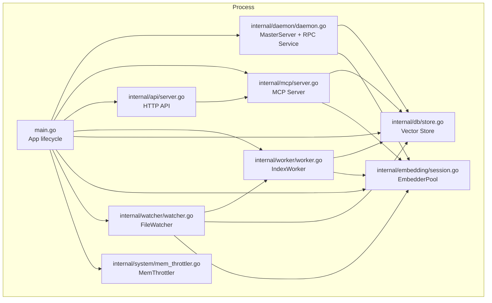
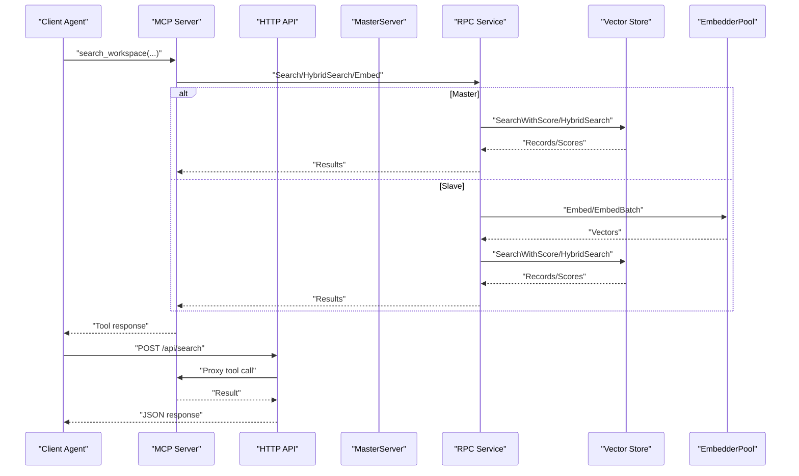
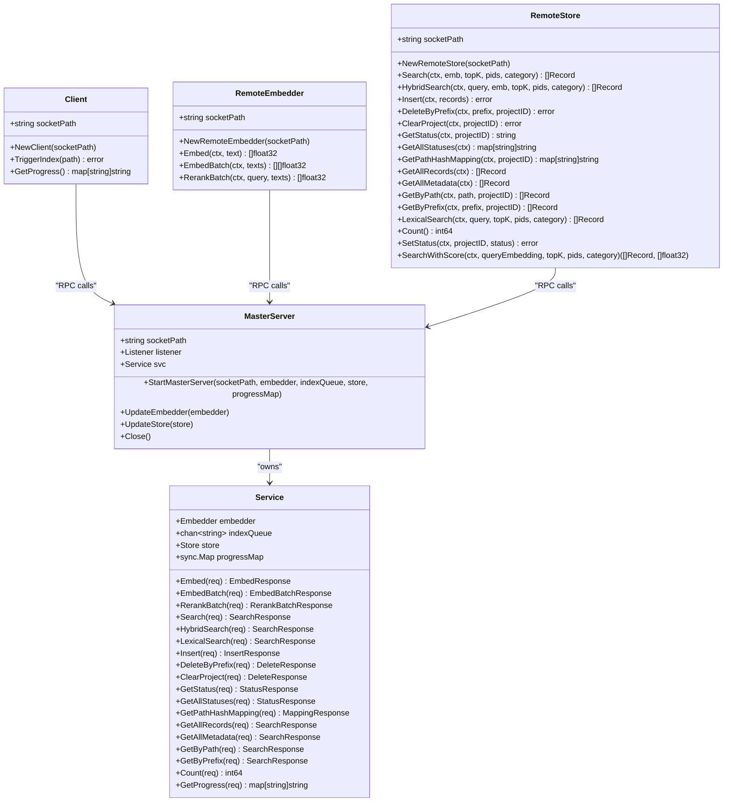
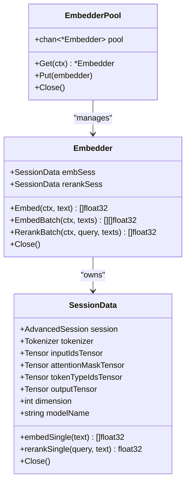
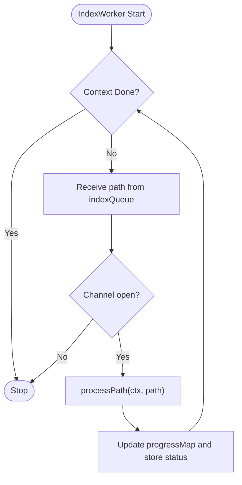
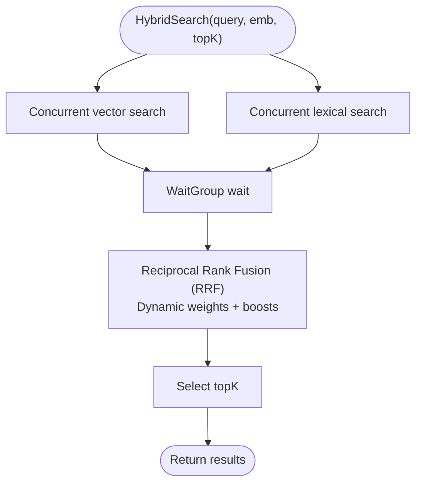
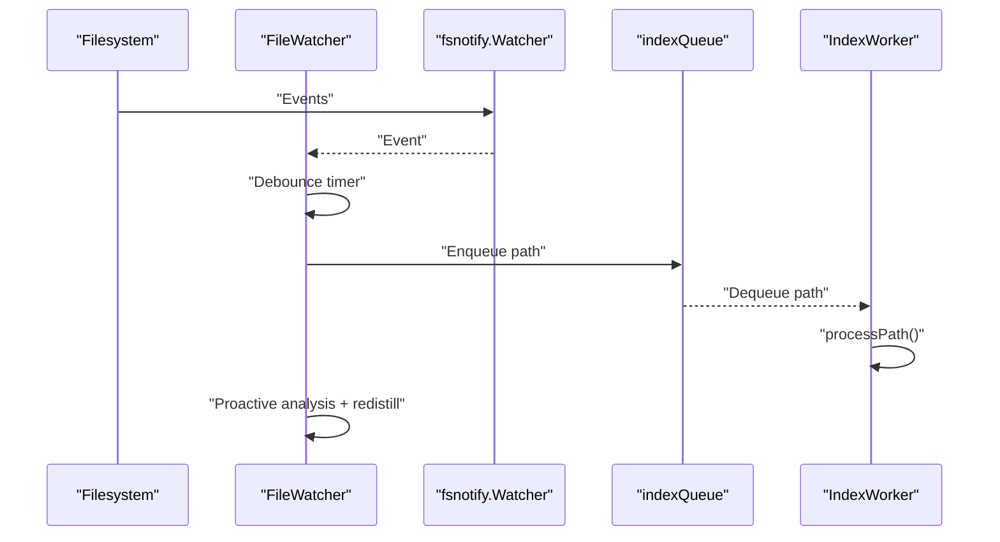
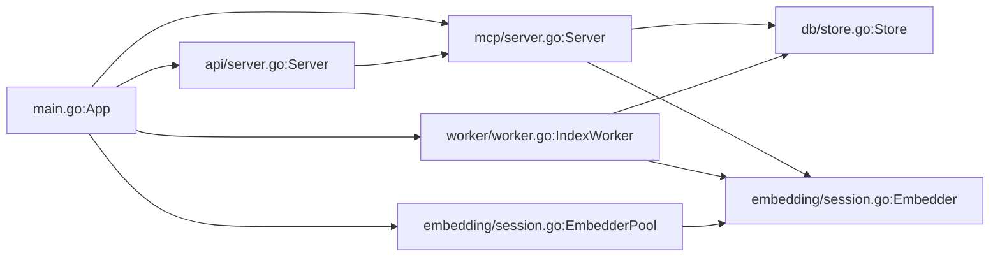

# Concurrent Processing and Scaling

<cite>
**Referenced Files in This Document**
- [main.go](file://main.go)
- [daemon.go](file://internal/daemon/daemon.go)
- [server.go](file://internal/mcp/server.go)
- [worker.go](file://internal/worker/worker.go)
- [store.go](file://internal/db/store.go)
- [session.go](file://internal/embedding/session.go)
- [config.go](file://internal/config/config.go)
- [watcher.go](file://internal/watcher/watcher.go)
- [mem_throttler.go](file://internal/system/mem_throttler.go)
- [resolver.go](file://internal/indexer/resolver.go)
- [server.go](file://internal/api/server.go)
- [README.md](file://README.md)
- [technology-modernization-plan.md](file://docs/technology-modernization-plan.md)
</cite>

## Table of Contents
1. [Introduction](#introduction)
2. [Project Structure](#project-structure)
3. [Core Components](#core-components)
4. [Architecture Overview](#architecture-overview)
5. [Detailed Component Analysis](#detailed-component-analysis)
6. [Dependency Analysis](#dependency-analysis)
7. [Performance Considerations](#performance-considerations)
8. [Troubleshooting Guide](#troubleshooting-guide)
9. [Conclusion](#conclusion)
10. [Appendices](#appendices)

## Introduction
This document explains how Vector MCP Go scales and processes concurrent workloads across embedding, indexing, and search operations. It details the master-slave architecture, distributed worker coordination via Unix RPC, load-balancing strategies, and thread-safety mechanisms. It also provides guidance for horizontal scaling, cluster configuration, fault tolerance, and performance tuning tailored to high-throughput vector operations.

## Project Structure
Vector MCP Go organizes concurrency and scaling across several layers:
- Application bootstrap and lifecycle management
- Master/Slave daemon with RPC service
- MCP server and HTTP API
- Worker pool for embeddings and background indexing
- Database layer with parallel search and hybrid ranking
- File watching and live indexing
- Memory throttling and resource guards

**Diagram sources**
- [main.go:37-176](file://main.go#L37-L176)
- [daemon.go:326-399](file://internal/daemon/daemon.go#L326-L399)
- [server.go:66-117](file://internal/mcp/server.go#L66-L117)
- [worker.go:24-61](file://internal/worker/worker.go#L24-L61)
- [store.go:19-64](file://internal/db/store.go#L19-L64)
- [session.go:34-85](file://internal/embedding/session.go#L34-L85)
- [watcher.go:22-86](file://internal/watcher/watcher.go#L22-L86)
- [mem_throttler.go:21-44](file://internal/system/mem_throttler.go#L21-L44)

**Section sources**
- [main.go:37-176](file://main.go#L37-L176)
- [daemon.go:326-399](file://internal/daemon/daemon.go#L326-L399)
- [server.go:66-117](file://internal/mcp/server.go#L66-L117)
- [worker.go:24-61](file://internal/worker/worker.go#L24-L61)
- [store.go:19-64](file://internal/db/store.go#L19-L64)
- [session.go:34-85](file://internal/embedding/session.go#L34-L85)
- [watcher.go:22-86](file://internal/watcher/watcher.go#L22-L86)
- [mem_throttler.go:21-44](file://internal/system/mem_throttler.go#L21-L44)

## Core Components
- App lifecycle and master/Slave detection
- MasterServer with RPC service exposing embedding and store operations
- MCP server with tool handlers and resource providers
- HTTP API gateway for SSE and MCP over HTTP
- IndexWorker consuming a channel of paths for background indexing
- EmbedderPool for concurrent embedding requests
- Vector Store with parallel lexical filtering and hybrid search
- FileWatcher for live indexing and proactive analysis
- MemThrottler for memory-aware backpressure

**Section sources**
- [main.go:93-176](file://main.go#L93-L176)
- [daemon.go:17-324](file://internal/daemon/daemon.go#L17-L324)
- [server.go:66-117](file://internal/mcp/server.go#L66-L117)
- [worker.go:24-112](file://internal/worker/worker.go#L24-L112)
- [session.go:34-85](file://internal/embedding/session.go#L34-L85)
- [store.go:80-336](file://internal/db/store.go#L80-L336)
- [watcher.go:22-196](file://internal/watcher/watcher.go#L22-L196)
- [mem_throttler.go:21-103](file://internal/system/mem_throttler.go#L21-L103)

## Architecture Overview
Vector MCP Go implements a master-slave architecture:
- Master process owns the vector database, model sessions, and RPC service.
- Slave processes connect to the master via Unix domain sockets to offload embedding and vector operations.
- Background indexing is coordinated via a shared index queue; workers consume paths and index incrementally.
- Live indexing is driven by a file watcher that debounces events and triggers targeted re-indexing.

**Diagram sources**
- [daemon.go:112-184](file://internal/daemon/daemon.go#L112-L184)
- [daemon.go:502-622](file://internal/daemon/daemon.go#L502-L622)
- [server.go:324-407](file://internal/mcp/server.go#L324-L407)
- [api/server.go:33-109](file://internal/api/server.go#L33-L109)

**Section sources**
- [daemon.go:333-378](file://internal/daemon/daemon.go#L333-L378)
- [daemon.go:401-474](file://internal/daemon/daemon.go#L401-L474)
- [daemon.go:502-622](file://internal/daemon/daemon.go#L502-L622)
- [server.go:184-188](file://internal/mcp/server.go#L184-L188)
- [api/server.go:48-71](file://internal/api/server.go#L48-L71)

## Detailed Component Analysis

### Master/Slave Daemon and RPC Communication
- MasterServer registers a service and listens on a Unix socket; rejects attempts to start a second master.
- RPC methods expose embedding, reranking, and vector store operations.
- Slave clients dial the socket and call methods remotely; timeouts are enforced per operation.
- RemoteEmbedder and RemoteStore provide transparent delegation to the master.

**Diagram sources**
- [daemon.go:17-324](file://internal/daemon/daemon.go#L17-L324)
- [daemon.go:326-399](file://internal/daemon/daemon.go#L326-L399)
- [daemon.go:401-474](file://internal/daemon/daemon.go#L401-L474)
- [daemon.go:502-622](file://internal/daemon/daemon.go#L502-L622)

**Section sources**
- [daemon.go:333-378](file://internal/daemon/daemon.go#L333-L378)
- [daemon.go:401-474](file://internal/daemon/daemon.go#L401-L474)
- [daemon.go:502-622](file://internal/daemon/daemon.go#L502-L622)

### Embedding Pool and Concurrency
- EmbedderPool maintains a buffered channel of embedders for concurrent use.
- poolEmbedder wraps the pool to Get/Put embedders around calls.
- Embedder uses ONNX runtime sessions and normalizes vectors; panics are recovered and surfaced as errors.

**Diagram sources**
- [session.go:34-85](file://internal/embedding/session.go#L34-L85)
- [session.go:176-280](file://internal/embedding/session.go#L176-L280)
- [session.go:180-245](file://internal/embedding/session.go#L180-L245)
- [session.go:316-366](file://internal/embedding/session.go#L316-L366)

**Section sources**
- [session.go:38-85](file://internal/embedding/session.go#L38-L85)
- [session.go:323-348](file://internal/embedding/session.go#L323-L348)

### IndexWorker and Task Distribution
- IndexWorker consumes paths from a bounded channel and processes them sequentially per path.
- It updates progress in a shared map and stores status in the vector store.
- The MCP server’s index queue feeds the worker; the daemon client can enqueue paths on the master.

**Diagram sources**
- [worker.go:47-61](file://internal/worker/worker.go#L47-L61)
- [worker.go:63-111](file://internal/worker/worker.go#L63-L111)

**Section sources**
- [worker.go:24-112](file://internal/worker/worker.go#L24-L112)
- [daemon.go:139-147](file://internal/daemon/daemon.go#L139-L147)

### Vector Store Parallelism and Hybrid Search
- SearchWithScore and HybridSearch coordinate concurrent operations and combine results.
- LexicalSearch parallelizes filtering across CPU cores for large result sets.
- HybridSearch uses reciprocal rank fusion with dynamic weights and optional boosts.

**Diagram sources**
- [store.go:223-336](file://internal/db/store.go#L223-L336)
- [store.go:85-221](file://internal/db/store.go#L85-L221)

**Section sources**
- [store.go:85-221](file://internal/db/store.go#L85-L221)
- [store.go:223-336](file://internal/db/store.go#L223-L336)

### FileWatcher and Live Indexing
- Debounces fsnotify events and triggers targeted indexing for supported extensions.
- Performs architectural compliance checks and re-distills dependent packages.
- Resets watchers when project root changes.

**Diagram sources**
- [watcher.go:58-86](file://internal/watcher/watcher.go#L58-L86)
- [watcher.go:121-139](file://internal/watcher/watcher.go#L121-L139)
- [watcher.go:141-196](file://internal/watcher/watcher.go#L141-L196)
- [worker.go:47-61](file://internal/worker/worker.go#L47-L61)

**Section sources**
- [watcher.go:22-196](file://internal/watcher/watcher.go#L22-L196)
- [worker.go:24-112](file://internal/worker/worker.go#L24-L112)

### Memory Throttling and Backpressure
- MemThrottler periodically reads /proc/meminfo and exposes ShouldThrottle and CanStartLSP.
- Integrates with LSP and indexing to avoid overloading the system.

**Section sources**
- [mem_throttler.go:21-103](file://internal/system/mem_throttler.go#L21-L103)

## Dependency Analysis
- App orchestrates initialization of master/slave, embedding pool, MCP server, API server, and background workers.
- MCP server depends on the store (local or remote) and embedder (local or remote).
- IndexWorker depends on the store getter and embedder; it writes progress to a shared map.
- Daemon client and remote store/Embedder depend on the Unix socket path.

**Diagram sources**
- [main.go:93-176](file://main.go#L93-L176)
- [server.go:66-117](file://internal/mcp/server.go#L66-L117)
- [worker.go:24-61](file://internal/worker/worker.go#L24-L61)
- [session.go:34-85](file://internal/embedding/session.go#L34-L85)
- [store.go:19-64](file://internal/db/store.go#L19-L64)
- [api/server.go:24-44](file://internal/api/server.go#L24-L44)

**Section sources**
- [main.go:93-176](file://main.go#L93-L176)
- [server.go:66-117](file://internal/mcp/server.go#L66-L117)
- [worker.go:24-61](file://internal/worker/worker.go#L24-L61)
- [session.go:34-85](file://internal/embedding/session.go#L34-L85)
- [store.go:19-64](file://internal/db/store.go#L19-L64)
- [api/server.go:24-44](file://internal/api/server.go#L24-L44)

## Performance Considerations
- Embedding concurrency
  - Tune EmbedderPoolSize via configuration to match CPU cores and GPU availability.
  - Batch embedding requests when possible to amortize tokenizer and runtime overhead.
- Indexing throughput
  - Increase index queue capacity and worker count for large repos.
  - Use debounced live indexing to avoid redundant work.
- Search performance
  - HybridSearch benefits from concurrent vector and lexical search; adjust topK and weights based on workload.
  - Leverage lexical boosting for symbol-heavy queries.
- Memory management
  - Use MemThrottler to pause heavy tasks under memory pressure.
  - Monitor available memory thresholds to prevent swapping.
- Horizontal scaling
  - Run multiple slave instances pointing to the same master for read-heavy loads.
  - Consider sharding by project roots and routing tool calls accordingly.

[No sources needed since this section provides general guidance]

## Troubleshooting Guide
- Master already running
  - Starting a second master fails early; ensure only one process owns the socket.
- RPC timeouts
  - Embedding and rerank operations enforce timeouts; increase buffer sizes or reduce batch sizes if timeouts occur.
- Index queue full
  - IndexProject returns an error when the queue is full; reduce rate or increase queue depth.
- Dimension mismatch
  - On collection reopen, a dimension mismatch triggers an explicit error; delete the DB and restart if switching models.
- Memory pressure
  - MemThrottler indicates when to throttle; reduce concurrency or pause indexing.

**Section sources**
- [daemon.go:348-356](file://internal/daemon/daemon.go#L348-L356)
- [daemon.go:139-147](file://internal/daemon/daemon.go#L139-L147)
- [daemon.go:463-473](file://internal/daemon/daemon.go#L463-L473)
- [daemon.go:636-647](file://internal/daemon/daemon.go#L636-L647)
- [store.go:51-61](file://internal/db/store.go#L51-L61)
- [mem_throttler.go:87-103](file://internal/system/mem_throttler.go#L87-L103)

## Conclusion
Vector MCP Go achieves scalable, deterministic vector operations through a master-slave RPC architecture, a bounded EmbedderPool, and a dedicated IndexWorker. Parallel search and lexical filtering, combined with memory-aware backpressure, deliver robust performance. For high-throughput scenarios, tune worker pools, leverage hybrid search, and shard workloads across multiple slaves while maintaining strict separation of concerns between master and slave roles.

[No sources needed since this section summarizes without analyzing specific files]

## Appendices

### Configuration and Environment Variables
- ProjectRoot, DataDir, DbPath, ModelsDir, LogPath, ModelName, RerankerModelName, HFToken, DisableWatcher, EnableLiveIndexing, EmbedderPoolSize, ApiPort
- These drive model loading, indexing behavior, and API exposure.

**Section sources**
- [config.go:30-130](file://internal/config/config.go#L30-L130)

### Horizontal Scaling and Cluster Configuration
- Run multiple slave instances sharing the same master socket for read-heavy workloads.
- Use project root scoping to isolate indices; route tool calls to appropriate shards.
- Consider API load balancing in front of multiple masters for write-heavy workloads.

**Section sources**
- [daemon.go:333-378](file://internal/daemon/daemon.go#L333-L378)
- [api/server.go:87-109](file://internal/api/server.go#L87-L109)

### Fault Tolerance Mechanisms
- RPC calls wrap panics and propagate errors; timeouts protect long-running operations.
- IndexWorker recovers from panics and records status; FileWatcher resets watchers on root changes.
- MemThrottler prevents out-of-memory conditions by signaling when to throttle.

**Section sources**
- [session.go:180-185](file://internal/embedding/session.go#L180-L185)
- [worker.go:64-72](file://internal/worker/worker.go#L64-L72)
- [watcher.go:102-119](file://internal/watcher/watcher.go#L102-L119)
- [mem_throttler.go:87-103](file://internal/system/mem_throttler.go#L87-L103)

### Performance Tuning Guidelines
- Worker-to-master ratio
  - Start with 1-2 slaves per master for moderate workloads; scale based on CPU and memory headroom.
- EmbedderPoolSize
  - Match to logical CPUs; reduce if GPU-bound or memory-constrained.
- Index queue depth
  - Increase for bursty live indexing; monitor progressMap for backlogs.
- Search topK and weights
  - Tune HybridSearch weights for query patterns; boost lexical weight for symbol-heavy queries.

**Section sources**
- [config.go:103-108](file://internal/config/config.go#L103-L108)
- [store.go:254-277](file://internal/db/store.go#L254-L277)