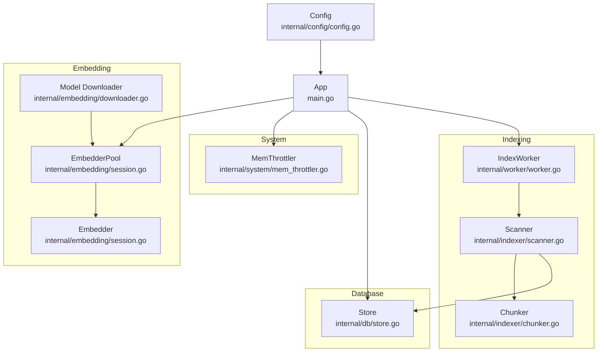
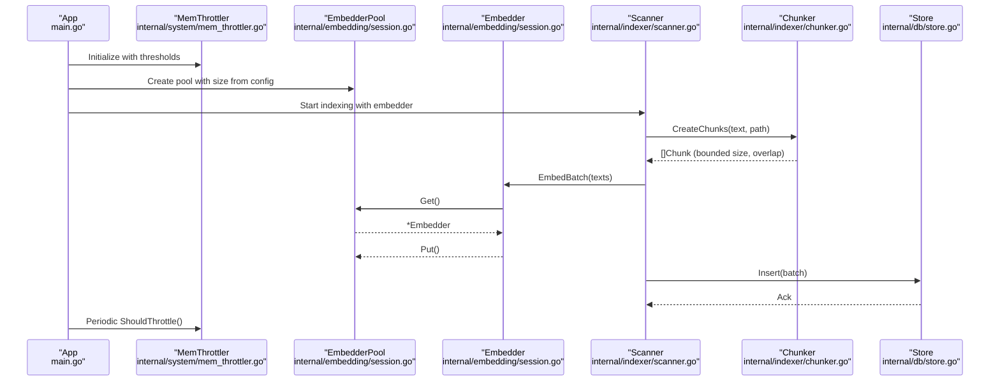
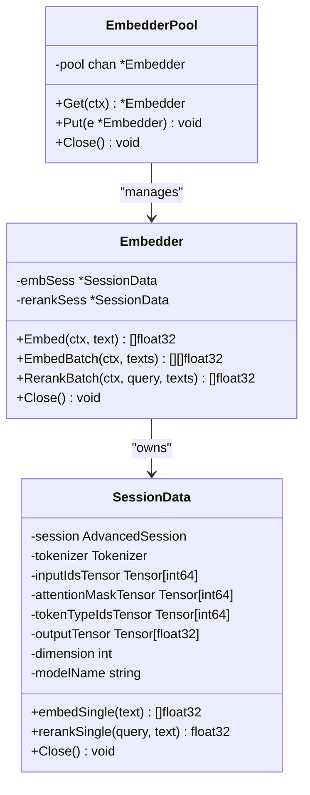
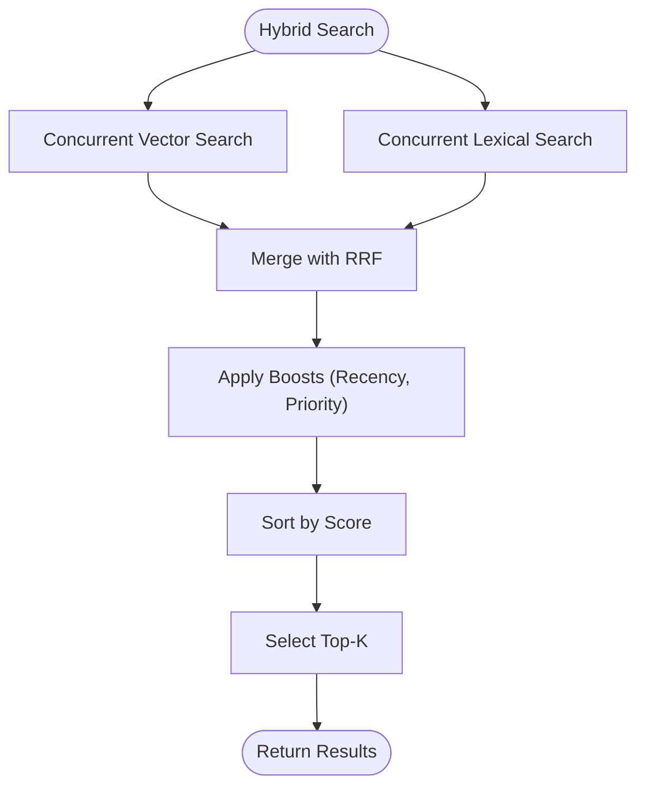
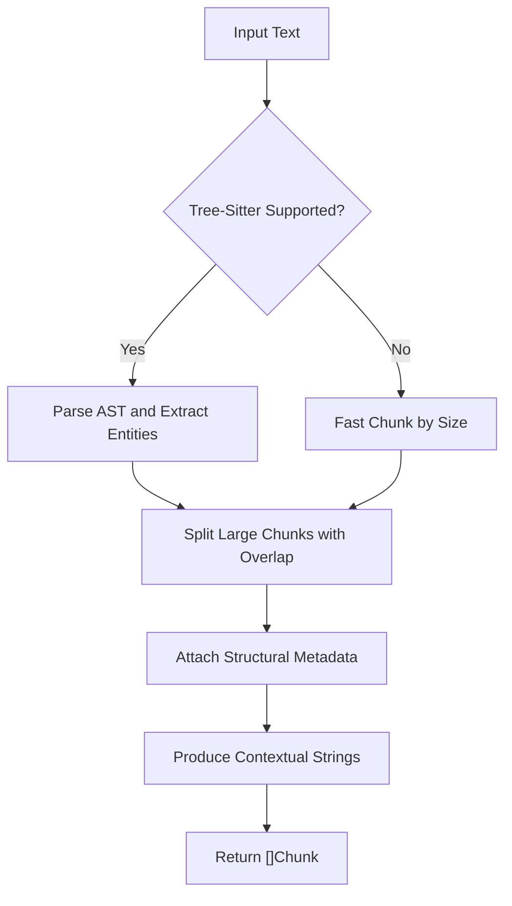
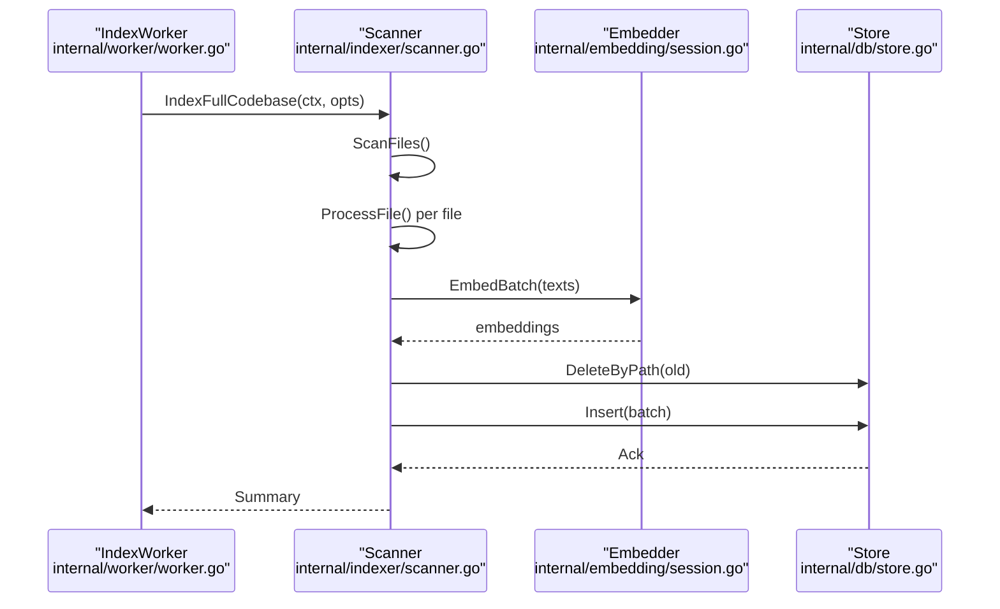
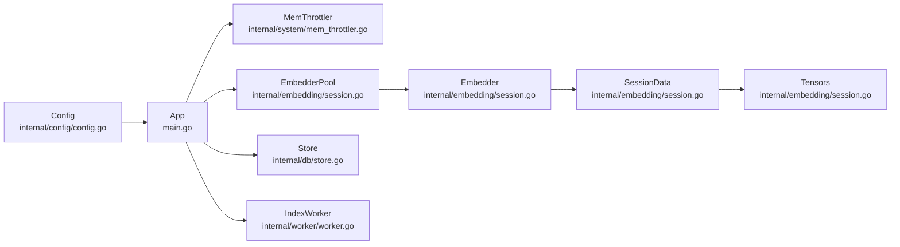

# Memory Management and Resource Optimization

<cite>
**Referenced Files in This Document**
- [mem_throttler.go](file://internal/system/mem_throttler.go)
- [store.go](file://internal/db/store.go)
- [chunker.go](file://internal/indexer/chunker.go)
- [scanner.go](file://internal/indexer/scanner.go)
- [session.go](file://internal/embedding/session.go)
- [downloader.go](file://internal/embedding/downloader.go)
- [worker.go](file://internal/worker/worker.go)
- [config.go](file://internal/config/config.go)
- [main.go](file://main.go)
</cite>

## Table of Contents
1. [Introduction](#introduction)
2. [Project Structure](#project-structure)
3. [Core Components](#core-components)
4. [Architecture Overview](#architecture-overview)
5. [Detailed Component Analysis](#detailed-component-analysis)
6. [Dependency Analysis](#dependency-analysis)
7. [Performance Considerations](#performance-considerations)
8. [Troubleshooting Guide](#troubleshooting-guide)
9. [Conclusion](#conclusion)

## Introduction
This document provides a comprehensive guide to memory management and resource optimization in Vector MCP Go. It focuses on:
- Memory throttler implementation for resource-constrained environments
- Memory allocation patterns in vector operations
- Garbage collection optimization strategies
- Memory-efficient embedding storage and vector database memory mapping
- Chunk-based memory management for large-scale datasets
- Resource pooling mechanisms and leak prevention
- Optimal buffer sizing for embedding operations
- Monitoring memory usage, identifying bottlenecks, and configuring memory limits
- Best practices for indexing and search operations

## Project Structure
Vector MCP Go organizes memory-critical components across several packages:
- System-level memory monitoring via a throttler
- Vector database operations with efficient insert/search patterns
- Indexing pipeline with chunk-based processing and batching
- Embedding subsystem with pooling and tensor buffers
- Configuration-driven resource sizing



**Diagram sources**
- [mem_throttler.go:1-151](file://internal/system/mem_throttler.go#L1-L151)
- [session.go:1-367](file://internal/embedding/session.go#L1-L367)
- [downloader.go:1-158](file://internal/embedding/downloader.go#L1-L158)
- [scanner.go:1-485](file://internal/indexer/scanner.go#L1-L485)
- [chunker.go:1-759](file://internal/indexer/chunker.go#L1-L759)
- [worker.go:1-112](file://internal/worker/worker.go#L1-L112)
- [store.go:1-664](file://internal/db/store.go#L1-L664)
- [config.go:1-139](file://internal/config/config.go#L1-L139)
- [main.go:1-349](file://main.go#L1-L349)

**Section sources**
- [main.go:58-71](file://main.go#L58-L71)
- [config.go:30-130](file://config.go#L30-L130)

## Core Components
- Memory Throttler: Monitors system memory and advises when to throttle or pause heavy tasks.
- Embedder Pool: Manages ONNX runtime sessions and reusable tensors to minimize allocations.
- Vector Store: Efficient insertion and hybrid search with parallelization and caching.
- Chunker: Produces memory-aware chunks with configurable overlap and size limits.
- Scanner: Processes files in parallel, batches writes, and controls memory footprint.
- Index Worker: Background worker that coordinates indexing with resource awareness.

Key memory management highlights:
- Throttler uses periodic sampling of /proc/meminfo and maintains a read-write lock for thread-safe access.
- Embedder pool reuses tensors and sessions, avoiding frequent allocations.
- Vector store caches parsed JSON arrays to reduce repeated unmarshaling costs.
- Chunker splits large texts into overlapping chunks to fit model constraints while preserving context.
- Scanner batches inserts and processes files concurrently to balance throughput and memory usage.

**Section sources**
- [mem_throttler.go:21-110](file://internal/system/mem_throttler.go#L21-L110)
- [session.go:34-85](file://internal/embedding/session.go#L34-L85)
- [store.go:663-664](file://internal/db/store.go#L663-L664)
- [chunker.go:537-577](file://internal/indexer/chunker.go#L537-L577)
- [scanner.go:120-191](file://internal/indexer/scanner.go#L120-L191)
- [worker.go:24-61](file://internal/worker/worker.go#L24-L61)

## Architecture Overview
The memory management architecture integrates throttling, embedding, indexing, and storage:



**Diagram sources**
- [main.go:58-71](file://main.go#L58-L71)
- [mem_throttler.go:30-44](file://internal/system/mem_throttler.go#L30-L44)
- [session.go:38-65](file://internal/embedding/session.go#L38-L65)
- [scanner.go:67-191](file://internal/indexer/scanner.go#L67-L191)
- [chunker.go:43-101](file://internal/indexer/chunker.go#L43-L101)
- [store.go:66-78](file://internal/db/store.go#L66-L78)

## Detailed Component Analysis

### Memory Throttler
The throttler periodically reads system memory statistics and exposes advisory checks for throttling and LSP startup decisions.

Implementation patterns:
- Uses a background goroutine with a ticker to refresh memory status.
- Thread-safe access via RWMutex; exposes read-only status snapshots.
- Dual-threshold policy: percentage-based and absolute MB-based availability checks.

Memory implications:
- Low overhead: minimal goroutines and periodic sampling.
- Prevents out-of-memory conditions by signaling when to pause heavy tasks.

```mermaid
classDiagram
class MemThrottler {
-thresholdPercent float64
-minAvailableMB uint64
-mu RWMutex
-lastStatus MemStatus
-stopChan chan struct{}
+NewMemThrottler(thresholdPercent, minAvailableMB) MemThrottler
+ShouldThrottle() bool
+CanStartLSP() bool
+GetStatus() MemStatus
+Stop() void
-monitor() void
-update() void
}
class MemStatus {
+Total uint64
+Available uint64
+Used uint64
+Percent float64
}
MemThrottler --> MemStatus : "stores latest"
```

**Diagram sources**
- [mem_throttler.go:13-28](file://internal/system/mem_throttler.go#L13-L28)
- [mem_throttler.go:21-110](file://internal/system/mem_throttler.go#L21-L110)

**Section sources**
- [mem_throttler.go:30-110](file://internal/system/mem_throttler.go#L30-L110)
- [main.go:69](file://main.go#L69)

### Embedding Subsystem and Resource Pooling
The embedding subsystem uses a pool of embedders backed by ONNX runtime sessions and preallocated tensors.

Key design elements:
- EmbedderPool maintains a buffered channel of embedders for concurrency control.
- SessionData preallocates input/output tensors sized to MaxSeqLength and model dimension.
- Embedder methods wrap Get/Put semantics around ONNX inference calls.
- Tokenization bounds input length and normalizes embeddings to unit vectors.

Memory optimization strategies:
- Tensor reuse avoids repeated allocations for input masks, token ids, and outputs.
- Pool limits concurrent model usage to prevent memory spikes.
- Normalization is performed in-place to minimize extra allocations.



**Diagram sources**
- [session.go:34-85](file://internal/embedding/session.go#L34-L85)
- [session.go:29-36](file://internal/embedding/session.go#L29-L36)
- [session.go:16-27](file://internal/embedding/session.go#L16-L27)

**Section sources**
- [session.go:38-85](file://internal/embedding/session.go#L38-L85)
- [session.go:176-245](file://internal/embedding/session.go#L176-L245)
- [session.go:261-271](file://internal/embedding/session.go#L261-L271)
- [session.go:300-314](file://internal/embedding/session.go#L300-L314)
- [config.go:103-108](file://internal/config/config.go#L103-L108)

### Vector Database and Memory Mapping
The vector store integrates with a persistent database and implements efficient search and insertion patterns.

Key features:
- Insertion uses parallel workers via runtime.NumCPU() to distribute load.
- Hybrid search runs vector and lexical search concurrently, then merges results with reciprocal rank fusion.
- Caching of parsed JSON arrays reduces repeated unmarshaling overhead.
- Memory mapping leverages the underlying database’s persistence and indexing.

Memory considerations:
- Batched inserts reduce per-operation overhead and memory churn.
- Sorting and scoring occur in-memory; topK selection limits retained results.
- Cache eviction prunes older entries to cap memory growth.



**Diagram sources**
- [store.go:223-336](file://internal/db/store.go#L223-L336)

**Section sources**
- [store.go:66-78](file://internal/db/store.go#L66-L78)
- [store.go:338-409](file://internal/db/store.go#L338-L409)
- [store.go:80-121](file://internal/db/store.go#L80-L121)
- [store.go:633-663](file://internal/db/store.go#L633-L663)

### Chunk-Based Memory Management
The chunker transforms raw text into semantically meaningful chunks with bounded sizes and controlled overlap.

Patterns:
- Tree-sitter parsing for language-specific AST nodes when supported.
- Fallback fast chunking for unsupported extensions.
- Overlapping slices to preserve context across boundaries.
- Rune-safe slicing to avoid UTF-8 corruption.

Optimization:
- MaxRunes and overlap tuned for large-context models.
- Gap-filling with Unknown chunks ensures coverage of non-entity regions.



**Diagram sources**
- [chunker.go:43-101](file://internal/indexer/chunker.go#L43-L101)
- [chunker.go:111-421](file://internal/indexer/chunker.go#L111-L421)
- [chunker.go:537-577](file://internal/indexer/chunker.go#L537-L577)

**Section sources**
- [chunker.go:43-101](file://internal/indexer/chunker.go#L43-L101)
- [chunker.go:537-577](file://internal/indexer/chunker.go#L537-L577)

### Indexing Pipeline and Background Worker
The indexing pipeline scans files, computes embeddings, and atomically updates the database.

Highlights:
- Parallel workers process files concurrently using a worker pool.
- Batching of inserts reduces transaction overhead.
- Atomic deletion of old chunks before insertion prevents fragmentation.
- Progress tracking and error aggregation for observability.



**Diagram sources**
- [worker.go:47-112](file://internal/worker/worker.go#L47-L112)
- [scanner.go:67-191](file://internal/indexer/scanner.go#L67-L191)
- [session.go:261-271](file://internal/embedding/session.go#L261-L271)
- [store.go:66-78](file://internal/db/store.go#L66-L78)

**Section sources**
- [worker.go:47-112](file://internal/worker/worker.go#L47-L112)
- [scanner.go:67-191](file://internal/indexer/scanner.go#L67-L191)

## Dependency Analysis
Resource pools and memory constraints are coordinated through configuration and application initialization.



**Diagram sources**
- [config.go:103-108](file://internal/config/config.go#L103-L108)
- [main.go:58-71](file://main.go#L58-L71)
- [session.go:38-65](file://internal/embedding/session.go#L38-L65)
- [mem_throttler.go:30-44](file://internal/system/mem_throttler.go#L30-L44)
- [store.go:66-78](file://internal/db/store.go#L66-L78)
- [worker.go:47-112](file://internal/worker/worker.go#L47-L112)

**Section sources**
- [config.go:103-108](file://internal/config/config.go#L103-L108)
- [main.go:133](file://main.go#L133)

## Performance Considerations
- Embedding buffer sizing:
  - MaxSeqLength is fixed at 512; adjust model configs accordingly.
  - Ensure dimension matches the selected model to avoid mismatches.
- Chunk sizing:
  - Large-context models require larger maxRunes with overlap to preserve context.
  - Overlap reduces boundary loss while increasing memory slightly; tune based on model capacity.
- Parallelism:
  - Use runtime.NumCPU() for embedding and lexical search to utilize available cores.
  - Scanner batches inserts to reduce overhead; tune batch size based on memory headroom.
- Caching:
  - JSON parsing cache in the store reduces repeated unmarshaling; eviction prevents unbounded growth.
- Throttling:
  - Configure thresholds to maintain headroom for critical operations like LSP startup.

[No sources needed since this section provides general guidance]

## Troubleshooting Guide
Common memory-related issues and resolutions:
- Out-of-memory during embedding:
  - Reduce EmbedderPool size via configuration.
  - Limit batch sizes in embedding calls.
  - Enable throttling and back off when ShouldThrottle() is true.
- Excessive memory during indexing:
  - Verify chunk sizes and overlap are appropriate for the model.
  - Ensure atomic deletions occur before inserts to prevent accumulation.
  - Monitor progress and errors; address failures promptly to avoid retries.
- Persistent memory growth:
  - Check cache eviction thresholds in the store.
  - Validate that tensors and sessions are properly closed when pools shut down.
- LSP startup failures:
  - Confirm CanStartLSP() passes before launching language servers.

**Section sources**
- [mem_throttler.go:73-103](file://internal/system/mem_throttler.go#L73-L103)
- [scanner.go:171-184](file://internal/indexer/scanner.go#L171-L184)
- [store.go:633-663](file://internal/db/store.go#L633-L663)
- [session.go:282-298](file://internal/embedding/session.go#L282-L298)

## Conclusion
Vector MCP Go employs a layered memory management strategy:
- A lightweight throttler provides proactive resource control.
- An embedder pool and tensor reuse minimize allocation overhead.
- Chunk-based processing and batching keep memory usage predictable.
- The vector store optimizes search and caching for large datasets.
- Configuration enables tuning for diverse deployment scenarios.

Adopting the recommended practices—tuning pool sizes, chunk parameters, and batch behavior—ensures robust performance across indexing and search workloads while preventing memory bottlenecks.